# APT-C-37
## Mobile

### 2016年
> 武器: DroidJack RAT
> 伪装：以Flash、PDF阅读齐、更新应用为主，期间2016-09-14 package变化一次，其于package未改变，由于采用DroidJack框架生成，代码结构未产生变化

| 时间| 2016-05-09 | 2016-5-11 | 2016-5-16 |2016-08-09|2016-09-14|2016-10-10|
| ---| --- | --- | --- | --- |--- |--- |
| sha1| 0bb88368dadf64e49e3aa723a2873eada8a0cf5f |e0ee9e420733871eb7032d73da04df26f3823ece  |d5156183c2e439b93c077e1eea7e9e803a244b9d|102ba9eb5d1ddf610aa2c01dda4fcb5e593bba35 c2376a4606117194995ed2e5f054f08a49db6f48|a6405c39baa3c2cc9b53a906c1d10bc7d19aafce|fe71ffdaa9fbf0ad9878b2758a5276dd360e8d22|
| package| net.droidjack.server | net.droidjack.server |net.droidjack.server | net.droidjack.server net.droidjack.server|com.Contacts|net.droidjack.server|
| label| flashplayer | PDFReader |SystemUpdate|AndroidUpdates PlayVideo|FlashPlayer|2|
| 代码结构|  |  |||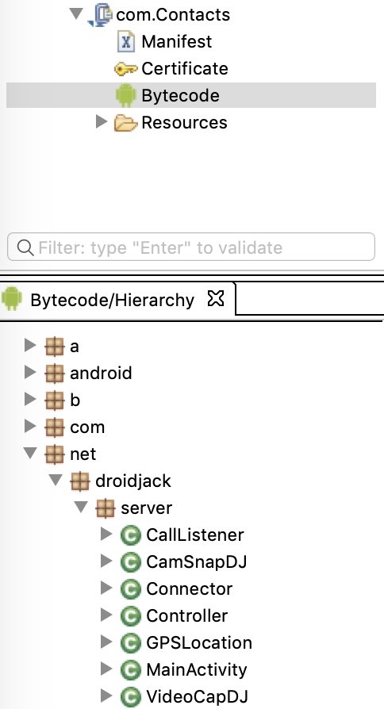|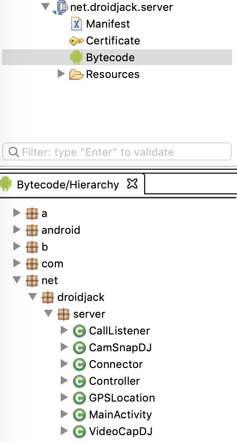|

### 2017年

> 武器：DroidJack、SSLove
> c2ca820e3673a5c121e36c9c53147e952fe10b7b 2017-07-19 Abu Mouad
> 
> SSLove RAT 725e9ba1ced4b3da3aadc56949d0904d7a06c06c 2017-08-17 
> 
> 2017年定向目标转向新闻机构、大学、医疗，并使用新型RAT: SSLove，出现了一个APT-C-37团队人名 Abu Mouad

| 时间| 2017-01-18 | 2017-02-17 | 2017-02-18 |2017-03-08|2017-03-30|2017-06-04|2017-06-08 |2017-06-18|2017-07-19|2017-07-26|2017-08-17|2017-09-05|2017-09-23|2017-10-13|2017-10-21|
| ---| --- | --- | --- | --- |--- |--- |--- |--- |--- |--- |--- |--- |--- |--- |--- |
| sha1| 02abc00326f63585a28de547b89d2e762ce4e90c| f7d5793c2e2f402e9a5de9c102a00a891c7ca6e2  ec75cbdea5c845ee2e948bc44f7c42a84c1ceba8| 725062e5647135cc643fcf9ff8ab8834d749595c |85d2273c90fdaeb95eb3345ab1d3c9087ea507a0 b12f91ef2ea3e0fcac3a9271f7463ac3fd9e0fb1 |503bd1de576706a4c2b553dd66a11dd930ae705e|f3a097f8f6c83a6a975cd71c28ed97f2f2610ba1|1a175db0c3db65acae1afef98772b5843379289d|e0bad0a911c29f158c229a53e6aba03f74c31d2a|c2ca820e3673a5c121e36c9c53147e952fe10b7b 6a668cccce1781ac450224d82566459f1a941779|069212436a03ab38d71a2187d23ad1d85aacf7c1|725e9ba1ced4b3da3aadc56949d0904d7a06c06c|70bfd9b4b52fdb48bf2f6e4674f5eb21a15b88c9|f5e2b8f7fb31553980e3bc3542d30e4da83e19ab|1b2848670d1d5db1280f29bd448d460ccfeb1bc1|280c44270d8feaa1afdf62a7c016a42c20a14529|
| package| com.Contacts| net.droidjack.server | net.droidjack.server | net.droidjack.server | com.Contacts|com.Contacts |com.Contacts|com.paramjna.content.zawjat|edu.daddah.android.quiz com.apps.nabe3islam456trial|com.Contacts|com.sawarim.android|com.sawarim.android|com.Contacts|com.sawarim.android|com.goldensoft.propheticmedicine|
| label|FlarshPlaye | samer MyfrinedTom | Trix |Aya | FlashPlayer|WhatsAppUpdates |Youtube|زوجات الرسول|إختبر معرفتك الدينية مسابقة نبع الإسلام|Youtube|وكالة الصوارم(萨沃姆机构)|وكالة الصوارم|Youtube|وكالة الصوارم|الطب النبوي|
| 代码结构|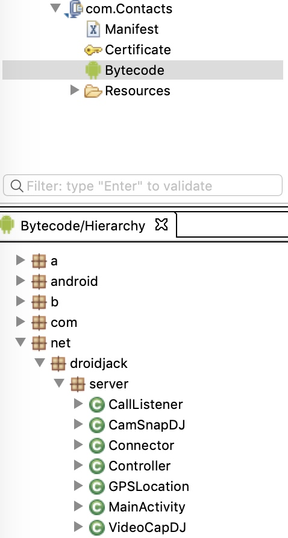|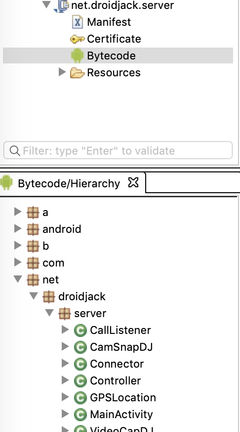|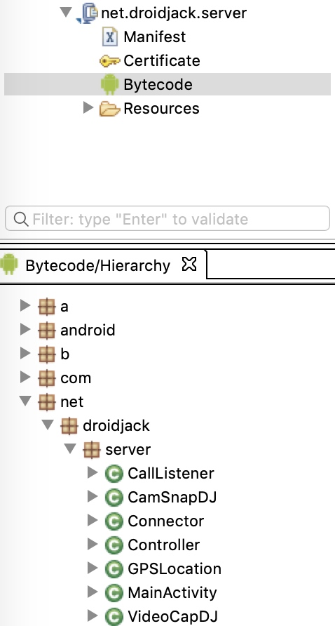| 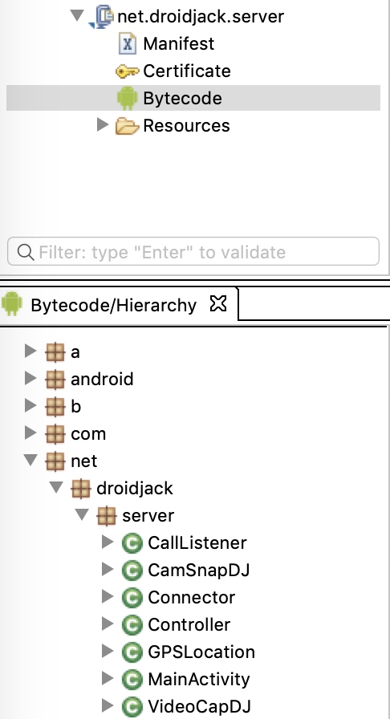| 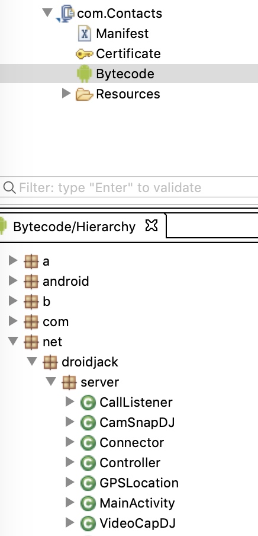|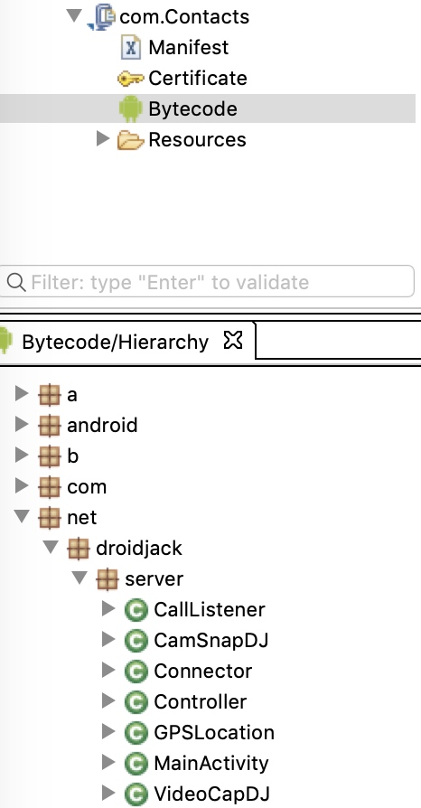|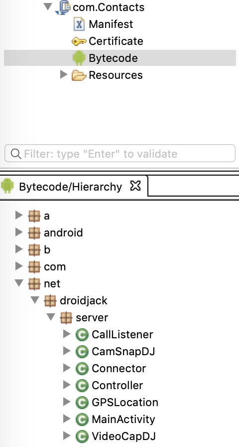|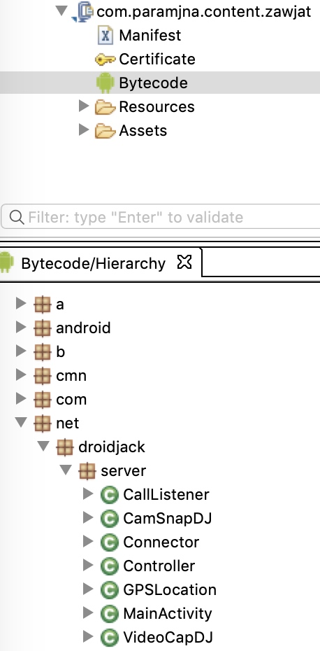|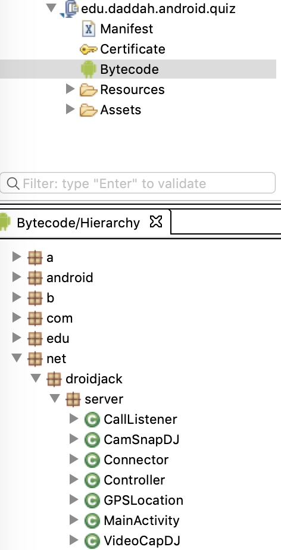||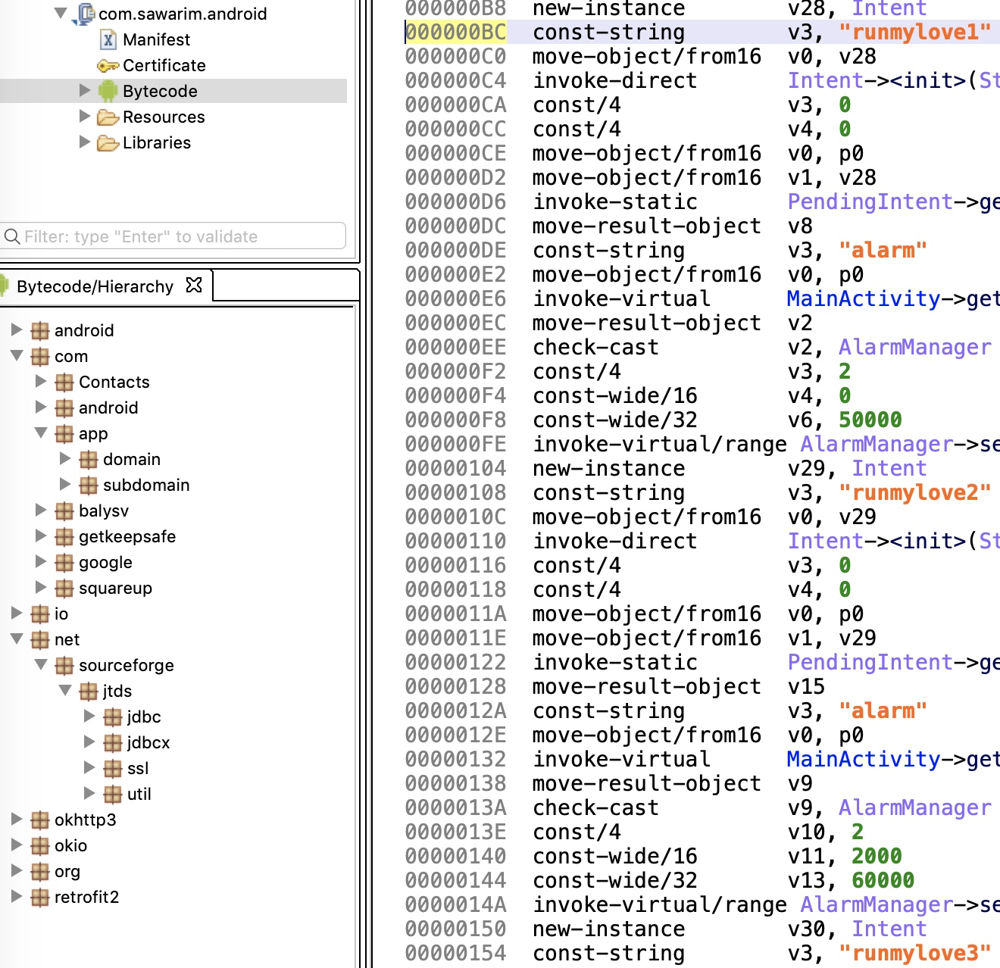|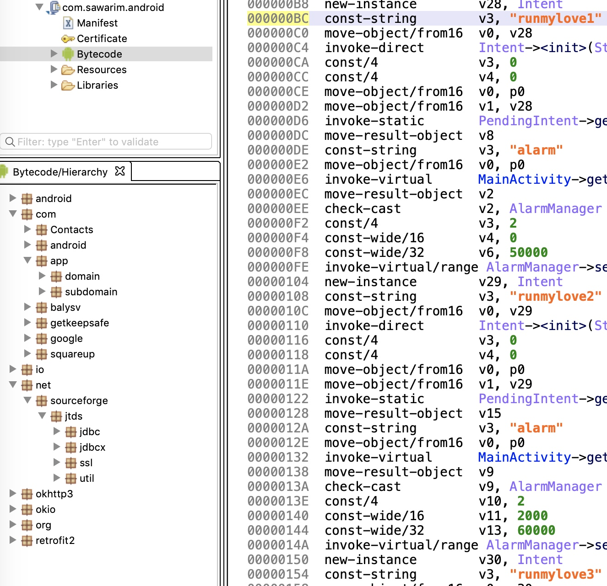|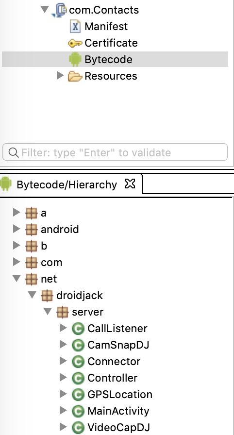|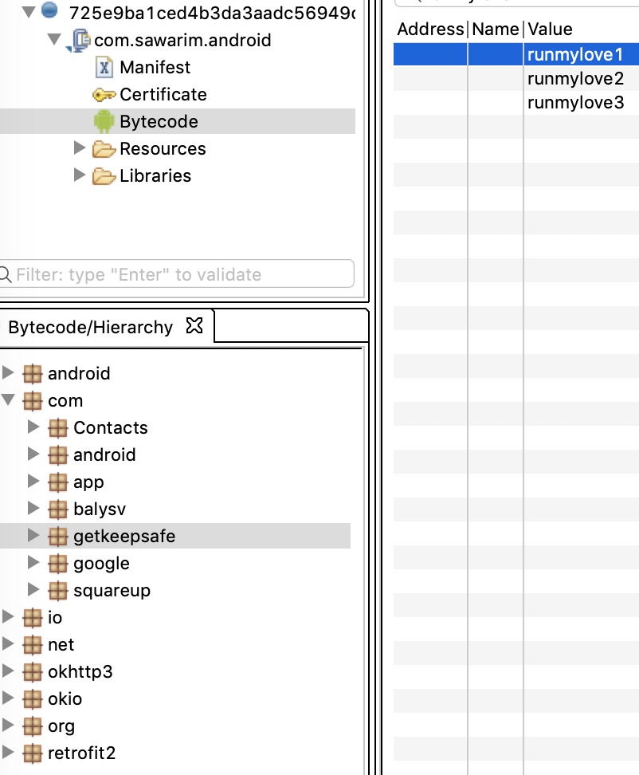|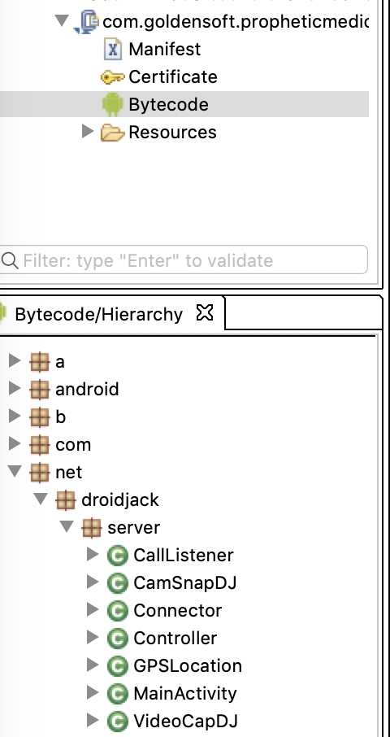|

### 2018年
> 2018-10-23 出现 SpyNote

| 时间| 2018-06-28 | 2018-10-23  | 2018-10-25 |2018-10-27|
| ---| --- | --- | --- | --- |
| sha1| 054303c6ebe742b7db67b99ae21c21e84f171bfe | 7e3adf18f718727b0b44f92a65321720c385f5c8 | 8bba0442579de58af915d600f59aa8d6278f96dc 22d4ab097cd8b7727bd137a46279710906e31d41 | 90bb69fbb90a6ecf4dc69b5d71e1df5425b4cdbe|
| package| net.droidjack.server | yps.eton.application | net.droidjack.server | com.springnet.app |--- |--- |
| label| FlashPlayer | WhatsApp | WhatsApp Test | WhatsApp Test |
| 代码结构|  |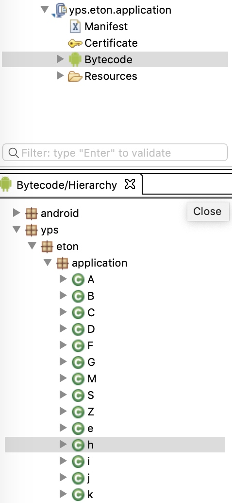|||

### 2019年
| 时间| 2019-02-16 | 
| ---| --- | 
| sha1| c00e11ab0ae42dd5971ab088474680307bab45b8| 
| package|com.Contacts | 
| label| WhatsApp Update | 
| 代码结构| 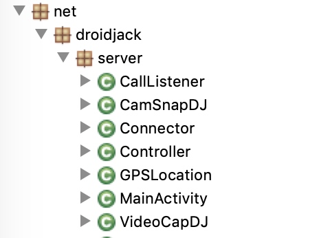| 

### DroidJack RAT

### SpyNote RAT
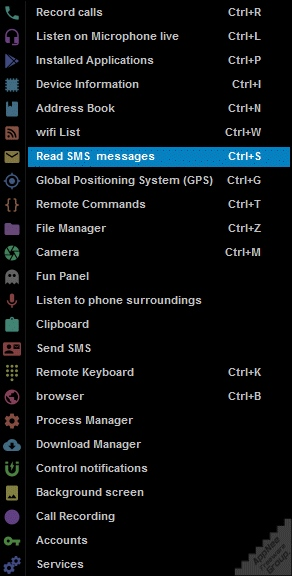

### SSLove RAT
> 地下RAT

## APT-C-37 Mobile 时间轴
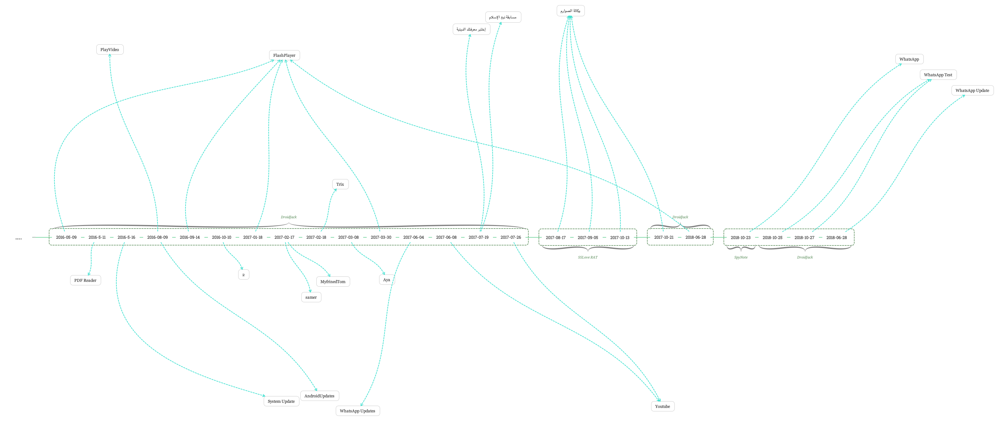

## PC
### 2016-11-18 d17bd49890bfb91520dd5607123e2b6a3f8b0c04
> C## 编写
功能：
- 收集电脑指纹信息
- 拍照
- 设置自己开机启动
- 劫持屏幕
- 更改注册表
- 键盘记录
- 自我更新
- 设置自己在防火墙中可信
- 自我痕迹清理
- 磁盘文件窃取

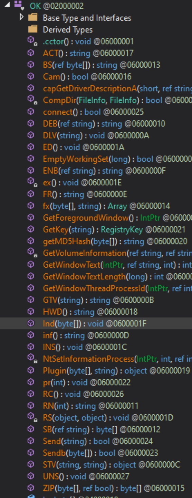
