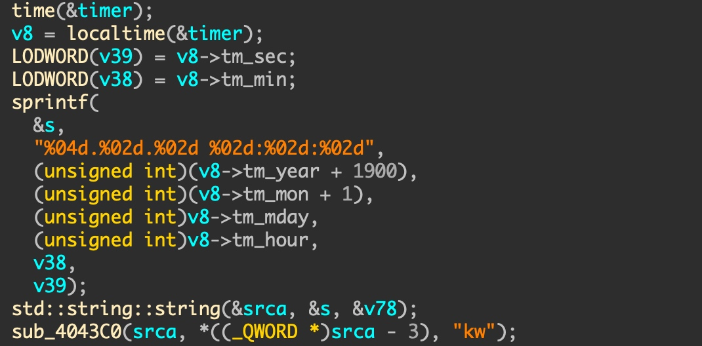

# APT41 
**APT41 is a group that carries out Chinese state-sponsored espionage activity in addition to financially motivated activity. APT41 has been active since as early as 2012. The group has been observed targeting healthcare, telecom, technology, and video game industries in 14 countries**.

## Target
• Healthcare: including medical devices and diagnostics
• High-tech: including semiconductors, advanced computer hardware, battery technology, and electric vehicles
• Media: including news organizations
• Pharmaceuticals
• Retail
• Software companies: which were compromised in supply chain operations potentially affecting large numbers of victims
• Telecoms
• Travel services
• Education 
• Video games: including development studios, distributors/publishers, and activities enabling supply chain compromises
• Virtual currencies: including in-game currencies, cryptocurrencies, and related services

APT41 has targeted organizations in 14 countries (and Hong Kong) over seven years, including: France, India, Italy, Japan, Myanmar, the Netherlands, Singapore, South Korea, South Africa, Switzerland, Thailand, Turkey, the United Kingdom, and the United States (Figure 1). APT41 espionage operations against entities in these countries follow targeting of verticals consistent with Chinese national policy priorities.


## Recent attacks

```
date: October 31, 2019
hash: 8D3B3D5B68A1D08485773D70C186D877
target: Telecoms
```
## Analysis
### run init()->main() in start()


### init()


sub_40228C()、sub_402320() and sub_40BC70() don't important info.

### main()

 
Entrance is sub_403B80()

### Entrance


We need to analyze start_routine function, sub_404040 function and other.

### start_routine
the malware checks for the existence of two files: keyword_parm.txt and parm.txt and attempts to read the configuration files every 30 seconds.  


If either exist, the contents are read and XOR decoded with the string:
- XOR key is "http://www.etsi.org/deliver/etsi_ts/123000_123099/123040/04.02.00_60/ts_123040v040200p.pdf" len


These two files, keyword_parm.txt and parm.txt contain instructions for MESSAGETAP to target and save contents of SMS messages.

The first file (parm.txt) is a file containing two lists:
- imsiMap: This list contains International Mobile Subscriber Identity (IMSI) numbers. IMSI numbers identify subscribers on a cellular network.
- phoneMap: The phoneMap list contains phone numbers.The second file (keyword_parm.txt) is a list of keywords that is read into keywordVec.

Both files are deleted from disk once the configuration files are read and loaded into memory. 


After loading the keyword and phone data files, malware begins monitoring all network connections to and from the server. It uses the libpcap library to listen to all traffic and parses network protocols starting with Ethernet and IP layers. 


It continues parsing protocol layers including SCTP, SCCP, and TCAP. 


pcap name


Finally, the malware parses and extracts SMS message data from the network traffic:

- SMS message contents
- The IMSI number
- The source and destination phone numbers


- If the SMS message text contains one of the keywordVec values, the contents are XORed and saved to a path with the following format:

```
/tmp/devlog/orbit/keyring/esd/kwdata/kw_<year><month><day>.csv
```
- The malware compares the IMSI number and phone numbers with the values from the imsiMap and phoneMap lists. If found, the malware XORs the contents and stores the data in a path with the following format:

```
/tmp/devlog/orbit/keyring/esd/data/<year><month><day>.csv
```


- If the malware fails to parse a message correctly, it dumps it to the following location:

/tmp/devlog/orbit/keyring/esd/data/%04d%02d%02d_%d.dump


### Why use IMSI as key?


