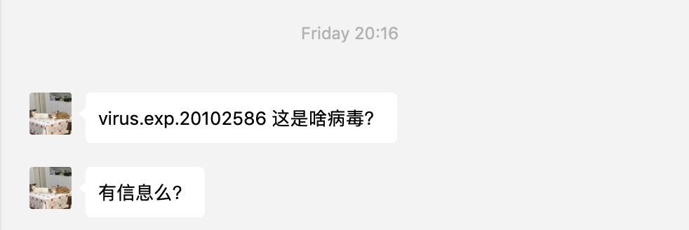
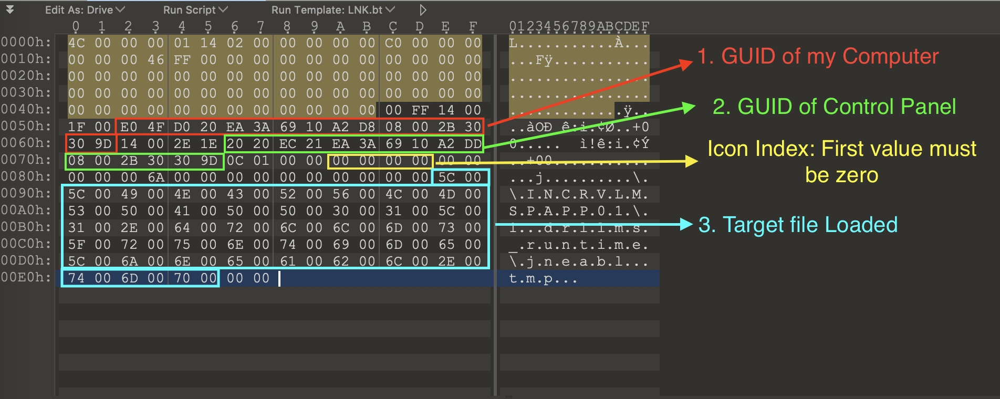

# CVE-2010-2568 分析
最近朋友问我这个Malware,只知道这个是美国搞伊朗用的漏洞

话不多说，先看Exp
https://www.virustotal.com/gui/file/ff6482ff8a12489a06d9d2ceedf195cee1015deccf10f81fb69dce962695ed3c/detection

## Exp 格式

需要加载的恶意文件 \\INCRVLMSPAPP01\1.drllms_runtime\jneabl.tmp

其中偏移0x007A代表了Icon ID，仅仅在0x007A偏移位置的值为0时，才会去加载目标文件
