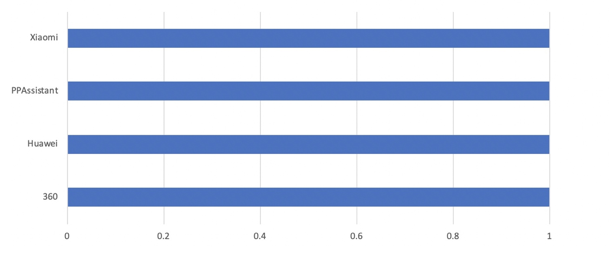
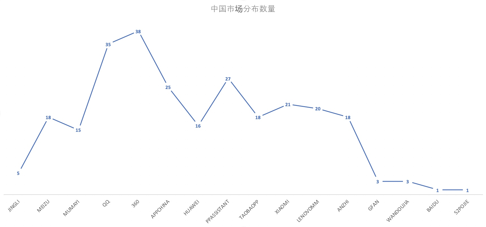
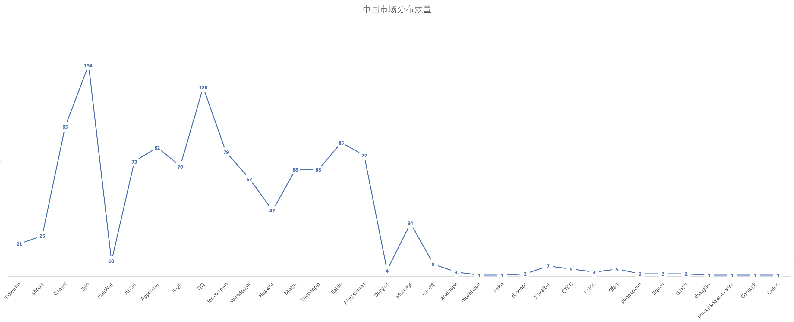
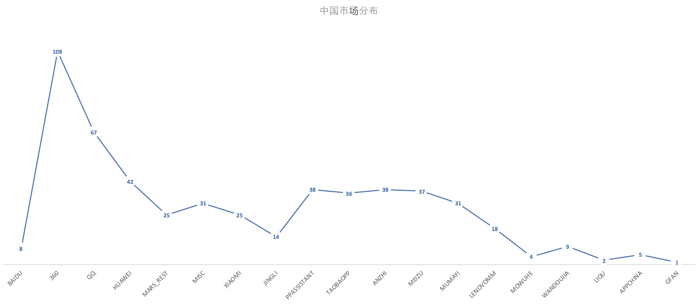
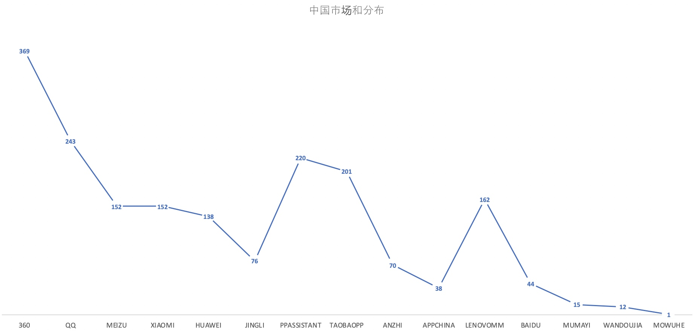

# Adware中国市场分布
作者: 2ero 2020/7/17 21:48 南京
## Triada
| sha256                                                           | package_name       | label | version_name |
|------------------------------------------------------------------|--------------------|-------|--------------|
| ECB3AC1E693ACC57F0664E33C95BFCD5E0237B855B26A73407BFAE7F4A95F348 | com.kankan.taopian | 淘个片   | 1.5.4.0      |
| CC0ABBE1938FBAF9AB95FA742026CCD1B6D02C19F529B851F3E5BCE3514B6CFA | com.kankan.taopian | 淘个片 | 1.5.4.0 |
| 0286CEE7F065D379C0B8DC57A1FA21CEF3B2F6E81368A3F63C9FE4DD4F0BAB17 | com.kankan.containner | containner | 1.1.1 |
| 7199B111183A7C7145B6C05811206147E9BC9D397E06F7ABD60E02783C0886FC | com.kankan.bangtiao | 帮挑 | 1.4.2.0 |
| 6BA83D0D5C77AEB293022656ADD4EB981E2355CB7709ADA476AB7EFAD5045A59 | com.fy.wxdhs.vivo | 我要当皇上 | 1.2.2 |
| C82456C1EC4FA4D0A7416D403FCFB827E966FFCD665BBDC8B3F9880FBCAB3A5A | com.fy.wxdhs.vivo | 我要当皇上 | 1.2.3 |

## Necro

中国市场对应的数量

| sha256                                                           | package_name                                | label          | version_name      |
|------------------------------------------------------------------|---------------------------------------------|----------------|-------------------|
| D617F5833017DE7ECE7072C17EEFC2F4580DA6439499752CBF0DE6EF8197248F | com.ttyouqu.app                             | 天天趣闻           | 2.2.2             |
| 28B8B2D4CF8B25D9160FA15F7507D788C1E16BF9EF537C5DA7C14B1C6D4C1D59 | com.qiyu.wang.readbook                      | 免费小说大全         | 1.5.0             |
| 026CD1D407184CA516AF3F57314306E88501888F16A7138D88A436993867ECF9 | com.ym.ecpark.obd                           | 车智汇            | 7.7.0             |
| 26AD4E8BFD9842104B78EF498DAC356C098884D73E309A36E6304EC887795794 | com.intsig.camscanner                       | CamScanner     | 5.11.4.20190620   |
| F6E79C43E6DCC5BF5A722CF61923E96F5FBAA7B80F38208826817EBACD2EE788 | com.intsig.camscanner                       | CamScanner     | 5.12.0.20190723   |
| 14372F6E644CD323F1C2C63B11D74E9CCFCD45A83C26D87835D06B467E94B2DA | com.ddfun                                   | 豆豆趣玩           | 3.0.3_build4      |
| 445FA70B6D130966BCB03F69C0D8915DF9E96561F3C1114B57582D015C547743 | com.ddfun                                   | 豆豆趣玩           | 3.0.2_build1      |
| BEBEC704926050370E56D8F42F0DA477FDA303F41EBD4D58117B84ECBD267FAC | com.ddfun                                   | 豆豆趣玩           | 3.0.1_build1      |
| 492F4347904ED6D411FEFE2FA13FD118F22F20AF0402FD7B2327C6F1058B55F4 | nsin.everydaywatch.com                      | 每日一看           | 3.5.0             |
| 5C6E45DB0FFCD38B2821C4F77654E6F7DA6A474AEFF9858B8CE4CEC0A39BB8C1 | com.firebear.androil                        | 小熊油耗           | 2.1.7             |
| 8F260FDB71C17C72727B204803CBC86C8FA7BC3C5148D14B8CD3B5421C22A99F | nsin.everydaywatch.com                      | 每日一看           | 3.5.0             |
| 9810BB17C4D48CB8212B0DFF2B469EA3F960B92E8476D1E557D815DCAA1A80FE | com.ttyouqu.app                             | 开发版            | 2.4.0             |
| 2C1D26C2C886B851FCBB818FEB7612DA22B1CCBC8A7007A3BF401FEED5D1641C | com.icoolme.android.weather                 | 最美天气           | 5.08.001.20190809 |
| 95A0047AF9641A2B84401CDB5A0834DFA05C1C009DF89CDDE5A02B8D9624D93E | com.lexiangquan.supertao                    | 超级淘            | 4.3.12            |
| 53C35CDD04BE5183150AC1B9C10AC6B71971BEAB447DCB92D1AA6EE2337074D2 | com.intsig.camscanner                       | CamScanner     | 5.11.5.20190625   |
| B7F2611D3CF687FFE2177146AF1B09036327714C5852F17E5A1CD156D865578C | com.lexiangquan.supertao                    | 超级淘            | 4.3.1             |
| 3607A2E6C18DEAD48893923E4EB316614F2A1E49FC2BE6786C639143A742F3D8 | com.lhxc.sdxs                               | 闪电小说           | 1.0.1             |
| 728090D16212531A0EF39D268575B4F1C26088803F2097BCF47C21E24D0DFE29 | nsin.everydaywatch.com                      | 每日一看           | 3.0.4             |
| 12FFC87B3239BD30FA6821322FE13535E14DCB3D05D0ABFE73D045483BE6A507 | com.firebear.androil                        | 小熊油耗           | 2.1.6             |
| 11BB56ACF41DFAA4A63BE5821B32E084F133B9447573CC0A6524189EA270934B | com.kankan.bangtiao                         | 帮挑             | 1.4.1.7           |
| 2A7A63C1C161C34D1AF8A934896ED299576539B71C84DFC08AD2DC52DFCE1EF1 | com.ddfun                                   | 豆豆趣玩           | 3.0.3_build3      |
| 476ECBC15B62E158BB28BC79FCE062FB8899D4855C69A08BBEB3D72F4704BEDA | com.intsig.camscanner                       | CamScanner     | 5.11.5.20190624   |
| E76581E0BBF5DA38C764928E7B3E80C575570BD425C529618A22E4BFCC2CF221 | nsin.everydaywatch.com                      | 每日一看           | 3.2.0             |
| 2463A61F149E3A6D9B75379AAADE446B0D74E6313637DFFFCBEEFB35BB6A45BB | com.example.administrator.news              | 今日趣闻           | 1                 |
| 24CDCFCD861AF0AD750C718D037F5FB0BA802C8666B4BCB9274159E96BD24E02 | com.xm.yuelaixiaoshuo.ylreader              | 阅来小说           | 2.0.3             |
| CE66F32E6D609BEF07AAFDAEEF4A22ED8AAB27196187DCC53F88332DAFE43E20 | com.icoolme.android.weather                 | 最美天气           | 5.07.001.20190614 |
| ED3D30ACC28B3CD03366F009BF54C4FCBA351A360E517ED1B3AEE26DEA704D80 | com.intsig.camscanner                       | CamScanner     | 5.12.0.20190725   |
| 8FDE77F29402A07D4BD3F912F8FB0B3DD87649803E798F59BE8D8209E462D31E | com.duanmao.qz                              | 宝趣赚            | 1.0.0             |
| 899F6B1BA2CA3D9D236BEF3DC571A644BCC249DC8F7B519B1FDF1F92B581DC06 | com.icoolme.android.euiweather              | Weather        | 5.06.001.20190615 |
| DB39A817AFD988C8D148136B4F50F225B9D16D137D526F1D308D9E2E2CA91FEE | com.lhxc.sdxs                               | 闪电小说           | 1.0.12            |
| 376CCE573A1272A276EDB88D32C17292CE83E8433506B9719EBF418A759C9264 | com.tgelec.aqsh                             | 安全守护2          | 3.1.2             |
| BB02CDC4C3161203C08D6D978C6AF7AD26F7CA58CABFB4D9A05861CE7093822A | com.icoolme.android.weather                 | 最美天气           | 5.09.001.20190826 |
| E72C9EFC7B8EFC740F8A29F5149CCD3BE7232941480FF8B6AACEA340140B98CC | com.lhxc.sdxs                               | 闪电小说           | 1.0.6             |
| F252D2CF5CA3CC79D1A3A6FA3984612AFB6BF67D6CE14DAFEB9DC15215864ADC | nsin.everydaywatch.com                      | 每日一看           | 3.0.4             |
| 5149E12548622D0159AEF96D945FA9563F5D6C8F8E41055590658000A4B0A36D | com.mianfeia.book                           | 免费电子书          | 5.2.0             |
| 026438D8606DED11CD20C08F48C94C7A58C9EC430CC39A6804B247D210FEBE86 | com.midea.vm.washer                         | U净             | 1.31.0-5edca7ab   |
| 7199B111183A7C7145B6C05811206147E9BC9D397E06F7ABD60E02783C0886FC | com.kankan.bangtiao                         | 帮挑             | 1.4.2.0           |
| 50D1769C8F418F4B42C8B13BFA2FA202F2294BE23B8E593EB202D742C7B62ED5 | com.lexiangquan.supertao                    | 超级淘            | 4.3.6             |
| 4858406D25957F16F82CD65EB9C76C4C2C7859BC992BA8D1BA0EC1905A4A9CB4 | com.lexiangquan.supertao                    | 超级淘            | 4.3.1             |
| 02FCBF383383CB5076088744580A5AF67E1300465A08A132A2D06280B83E66F2 | com.mianfeia.book                           | 免费电子书          | 5.2.0             |
| 24A4D44106B14A8B1CC44422CE3669F24D3F654F2339232508CE8093945A35A1 | com.intsig.camscanner                       | CamScanner     | 5.11.7.20190710   |
| 607E34186DF7501853E8BEAD52FD129CB51D659C297B0EEC0DE448F8A54C7AB9 | com.midea.vm.washer                         | U净             | 1.31.2-4e9ea0ce   |
| 710EDCBA843140D47964DF94B7A49BB8C4F24B14462B179F763ED93F2FF1D1FE | com.lexiangquan.supertao                    | 超级淘            | 4.3.4             |
| 34554842C52994ECD2D8F1548EACC38DED98EAA471E1DB46FC9AD7137168876D | com.icoolme.android.euiweather              | Weather        | 5.07.001.20190622 |
| 2F3AEF8DF34705C2343ECF37127A6E52EA2B0BB35F1933B14657104998ED0EED | com.jxedt                                   | LySDKDemo      | 1                 |
| 71D1562F3054A3B0A3718FF55A05FD266B6A13C329AA5C0EDCF64170C01E9C46 | nsin.everydaywatch.com                      | 每日一看           | 3.3.0             |
| A38A062603EC4DC8010FB3EA20E0C7EE29F812359996575EA1A2688ADBDC1BCF | nsin.everydaywatch.com                      | 每日一看           | 3.5.0             |
| 3ABA6F3D04FDB78AB39BE7E7A71CC834C959A9C8F25B22330F9DA3F63C6F0FA8 | com.midea.vm.washer                         | U净             | 1.31.5-1763bd2f   |
| 8FB397C8FD05ACC3A29AD66CFE7AC3FE99A7ABE882F852D7EF6B87CE72051AF5 | com.t550211788.nqu                          | 御书房文学          | 1.0.3             |
| E0D4539279002F136BA15F37ED1A71CE4DEBA3E3C637B4DA55F9A04592A71F5A | com.qubuxing.qbx                            | 趣步行            | 1.2.8             |
| 656253C33FE68118B1F55769445866AB5D223E2E3A0B2072516587F1CBC1C0E5 | cn.qshower.qshow                            | 露一小手           | 2.2047            |
| F3E608EF70436004505552DA946A4B1188F47166F86F5D71180068B3F35BF878 | nsin.everydaywatch.com                      | 每日一看           | 3.2.0             |
| 610178ECC8D2EE715710AA72886E4613A84FF2B7206119E5D369767583D1A008 | com.mfyueduqi.book                          | 爱看书            | 5.2.0             |
| 303892DC9D4F8D3BC215177D8A9C7B5C96B88DC3E2D6EFC0341C0AF2121F8FEC | cn.xiaoheya.www                             | 河丫红包           | 1.2.3             |
| 4AE53C994CF2E46E6B6A5F31B6B99C3F3B8B4904F96FF570BCBFF68517A76486 | com.yj.kankanzhuan                          | 看看赚内网          | V3.3.0.0          |
| 6C883DB8FC5E45041D3E2998729566191BF93F32B94A8A4DF40FFDA1D78F8B68 | com.tts.hybird                              | 畅途汽车票          | 5.5.2             |
| 19583F34693E2F49C7D983A4899F2BD5B322B9C990057B1E58F4A39197D68ECA | com.icoolme.android.euiweather              | Weather        | 5.07.001.20190622 |
| C9AECA3A0B3A07ECEA12850AED5828F92D3EE90E8F13A2E8808934AB3EE8EF5C | com.jingwen.app                             | lieyingsdk     | 1                 |
| CECDF01CE9CB376109CEB78328F5F33B6BD07E150EBB113BB125B77161566E1E | com.yt.news                                 | 泡泡头条           | 3.0_build4        |
| 3AAADBFD153F9AA4AFDD29FACEBD9E59350F693F5266EB2B81DB92E51F9AC69B | com.xm.yuelaixiaoshuo.ylreader              | 阅来小说           | 2.0.3             |
| FE60526014D122C27CE9BBA3305BE56470CFDAD34024B75B106B9A7B2DF122C8 | nsin.everydaywatch.com                      | 每日一看           | 3.4.0             |
| 1EBE6E2720BAD1B162C67930B99027E65BC747E1D8DEBACA2AF4DF386115BDFD | com.pig.peppa.house                         | 佩琪屋            | v1.9.6            |
| 8F18FD2FB88DE35F2725B90AFB00FA147D72F20F9A0C41824EA6810507C76852 | com.lexiangquan.supertao                    | 超级淘            | 4.3.1             |
| 63A2384803F6C6684E4BC5D546129AAEF18BBC21F9ADAC107D8B84773367CE79 | com.shanbo.sbvideo                          | 闪播影视           | 999.99            |
| 8F8C12C08626CA452579A6D09D134B1699F1D1FFC813E44E998C88FB1EC45A5A | com.ddfun                                   | 豆豆趣玩           | 3.0.3_build1      |
| 88CAB60A748B71C1AC38C3B3C58D344B89F662EB8BB1306AAD23D1CDA111DE02 | com.lexiangquan.supertao                    | 超级淘            | 4.3.6             |
| 32844FD00D4326FF51980F6373BAF72D92678558C85F4B7D72337DF62F7D286B | cn.xiaoheya.www                             | 河丫红包           | 1.2.3             |
| 987C7E199424B76DEB20939BA345F5A5A886B3A4E26D9EE872FAE35A275647BC | com.icoolme.android.weather                 | 最美天气           | 5.06.001.20190520 |
| 7C066C1857442B1E318E4089E5839EBD0762A2556E3611E4110FA17E3948DD8E | com.icoolme.android.euiweather              | Weather        | 5.06.001.20190621 |
| 20B70EFC1E0FA35A798A7416173C941DDB5301EA4AD15F159EF0B72C94675184 | com.yt.news                                 | 泡泡头条           | 3.0_build1        |
| A8997F343136E321851267169B78949C961ED29652D301870730AEDF2848237F | nsin.everydaywatch.com                      | 每日一看           | 3.1.0             |
| 769FF7238BE70904193FF4835B07D124D41630FEA200380818E35725825A5C13 | com.t550211788.nqu                          | 御书房文学          | 1.0.4             |
| 8A455B2B6BBC2B5B8430F2E9119BD32BEFA435347B6033B7700324AE2E00CD07 | com.lexiangquan.supertao                    | 超级淘            | 4.2.11            |
| 56A90D638CAECB4F1E415103779CB895016B1EA578E58C38A762AD67558F2F4A | com.haobo.adhubsdkdemo                      | AdHubSDK Demo  | 1                 |
| 3A17A6538972A32DB6A763442869A455CA7C84879360D7D55E564F7164D6D91D | com.xm.yuelaixiaoshuo.ylreader              | 阅来小说           | 1.1.4             |
| 8D3A047F13F6269F5734AE08A3F219A9EC18366D0CF1BC4693E9628B1C9CB496 | nsin.everydaywatch.com                      | 每日一看           | 3.0.4             |
| EADC1E24C91BC5A826D1703B1A0D2E60036830FF3678989A8C372BECB7513E61 | cn.qshower.qshow                            | 露一小手           | 2.2047            |
| 6DB75B5EA97E6C4F7180AD67C91438D4ABA784F3762B05E8E4AB9B3B800AC582 | nsin.everydaywatch.com                      | 每日一看           | 3.3.0             |
| 2BF2DA3F103E6B928EB5E52DDC068F95BAC3BF7BEA12650F7211E4FFA0AB2A57 | com.intsig.camscanner                       | CamScanner     | 5.11.4.20190620   |
| F72FC9F9601D16B724BAAA45575A1F3D5A0CF29FD1E63E606CCF58E8523D8FA5 | com.example.administrator.news              | 今日趣闻           | 1.2.1             |
| 1D89F0240D3262B9F00DECE54D3E8A1B0CFB66ADBE9AC8FC7F2303197C47D3A1 | com.lexiangquan.supertao                    | 超级淘            | 4.3.1             |
| 92BC44AE75AA3B00210B7EA6B98E8AB3E577994CD427C1EF7C35588A03919B7F | com.midea.vm.washer                         | U净             | 1.31.0-9a470a06   |
| 98067FAA204BE71438579D8A185C6A89F48032897F379B4AEA31DC6F20BBEABF | com.duanmao.qz                              | 宝趣赚            | 1.0.0             |
| 4496C5C35213709E9B2AB94F602BB727DB62700F7AD0E45CC133C226AAE442E2 | org.zywx.wbpalmstar.widgetone.uexaaagg10001 | 安全守护           | 4.5.3             |
| 2A772B2601E93A1F054DF2942190D2E16BF46D801A4088CCC3E7EE788CD77A69 | com.jingwen.app                             | LySDKDemo      | 1                 |
| 334CF9E8332C56F2CCBE017B05D8D5CC0965DE558B4D42233392D741E8CA65CB | com.yt.news                                 | 泡泡头条           | 3.0_build2        |
| E87315C4B3981297D2779E120BD687E7B1B3E4E24C0571B1F16A83EF631F1F13 | com.shanbo.sbvideo                          | 闪播影视           | 999.99            |
| 92FA9C880293B9F8AE39FFA470EC3FE2882876CEA4BE7359A8A56284D54A42F9 | com.lhxc.sdxs                               | 闪电小说           | 1.0.1             |
| 706AF05E0C585A7F50F886A427FEF4285E791A399164F43CCD2D0C6D6C88381C | com.lexiangquan.supertao                    | 超级淘            | 4.3.5             |
| 62D02D328EF06D58F24D48A05ADD350AFD5473FC907D3C3F4965D043B65EA149 | com.midea.vm.washer                         | U净             | 1.32.2            |
| CAB5DCC02F99E22E6A03A140FBEA56F16097CB255FEFC2075F75A582A3902E8D | com.bang.redbox                             | 红包盒子           | 1.0.0             |
| D195C4A73D774CE5EF9140254679B1541D8FFFDFBD9D7BF707D9392D7F0407BD | com.firebear.androil                        | 小熊油耗           | 2.1.6             |
| C69059C54AFF574C8201F77E1CD227CF6297B97FFB48F3D1E62D04F0C7AC1968 | nsin.everydaywatch.com                      | 每日一看           | 3.5.0             |
| 8ADB5BC3E3C1E6959DF065BE90D06D3EF6C25D33AB9A9B3FDA030CCA8A0E2D10 | com.lexiangquan.supertao                    | 超级淘            | 4.3.5             |
| 78BC4FEE72E7A82DFFF7B9940A6D69B192399ADD3C0DC5EE0BE06413B6F9B9A3 | com.mobivans.onestrokecharge                | 预记账本           | 4.4.7             |
| D0412BCE60C9AF1604BB7B8817E4F629DBBA6BF08C2470171BDC72CBCD3AA8CA | com.jingwen.app                             | LySDKDemo      | 1                 |
| 8B0B62A189D0F67D01517DBCE030AFF654B0DACD09458EFCAA0EF84DF7D9984A | com.lexiangquan.supertao                    | 超级淘            | 4.3.6             |
| FDB1AE76B8D3618AFAF9622910500177000F2DF352C8C316B60C539A8F139E4A | nsin.everydaywatch.com                      | 每日一看           | 3.0.4             |
| C655337073F30292CDE25F97DE0692D0B1AE64003F7D69D71D7A7D506E84DE01 | com.lexiangquan.supertao                    | 超级淘            | 4.3.3             |
| F3F598382BD08410CB3888756463161023813AC14AE7E647C442EB454FDEDAC6 | com.lexiangquan.supertao                    | 超级淘            | 4.3.2             |
| 297FC616B15374C2A97160C1C79DA7D5E4561D75D6E3B1C9FDC0EDD35792748B | com.ddfun                                   | 豆豆趣玩           | 3.0.3_build2      |
| 864D015BB6DC5185E6CF96BAE80DAED11B7A1C8F3127AD08E0B1396B8F8A54CA | com.intsig.camscanner                       | CamScanner     | 5.12.0.20190725   |
| 2BF0ED625E0C533AD9FF59756BC6565F4C8EFBF2F9A91CE3766C811535D8D920 | com.shanbo.sbvideo                          | 闪播影视           | 2                 |
| 64624EEE444FD081955219541E8201CD7FEA7F0CBF3C4CA4B423AD71A7BFA885 | com.lexiangquan.supertao                    | 超级淘            | 4.3.4             |
| DAA268D7ADCF224EDE7F1E7A6F39928F318BA20A5F8A73F367AA94D87A16F1FB | nsin.everydaywatch.com                      | 每日一看           | 3.0.4             |
| 68E8ADD3440F50A0953CCC5E2AF336960049D948BF027E63A6DECEF7F8581185 | com.mfyueduqi.book                          | 爱看书            | 5.1.0             |
| C0AB0814127982767084B5CDD7F9EC51262A2AA13BC7245CB0734DE0468F94D1 | com.mianfeia.book                           | 免费电子书          | 5.2.0             |
| 3306076FD56FED6B21BCD6DBD6FBA1F7F4B066B4CF61BB55E4B8152CA55992A2 | com.icoolme.android.weather                 | 最美天气           | 5.08.001.20190706 |
| 2DD7D60005B43BB97D5ACC2FAF89A3567F3B7514D86FEE2D15F2BE8F8C444A0C | nsin.everydaywatch.com                      | 每日一看           | 3.4.0             |
| 3139AA3A7CBFD566759C70B7AB4C0F43514D1820542FD4E950D602B11702090B | com.midea.vm.washer                         | U净             | 1.31.5-b082f5b7   |
| 1B6C63578DCC886069D68CD59B0BEAE00784140B157427CAF32C8AF643FAC8A6 | com.icoolme.android.weather                 | 最美天气           | 5.08.001.20190709 |
| EF666E8E9DC1A731E9F6A7B66E5907ACF0C33F818D80E3D65D7C4BBE0F4153A6 | com.sanmiao.dajiabang                       | 赢互帮            | 3.8.4             |
| B5B2182D60E1AAD8389485DF3A0472BDA30C38877AE357D1742E5F398711EC87 | com.lexiangquan.supertao                    | 超级淘            | 4.3.1             |
| B3405EA957A453A463FF1C9E964D4942B229852D9D7B463B37FF7AE884A2DFAB | com.bly.dkplat                              | 多开分身           | 11                |
| 193EDC81F4B0662F90F7553BFDA08C74CA6439FB3B463F9F52271A88AEE4AC9B | com.shanbo.sbvideo                          | 闪播影视           | 999.99            |
| 336D1103C5925C70D0186F09C6AA7E91DFDCCC293BA6D82201319C6238B6C178 | com.news.tutoutiao                          | 兔头条            | 4.2.0             |
| 2FE92FE478A8F9348668EB9D0615D0399AB6270FFCC07A34EAFC9E89CAC809E7 | com.handicapwin.community                   | 即刻猜球           | 3.85              |
| 75647015FAA6E1D9C50304805CFEA08BE786E55A268FE4E0AEF219DCF0FE7FB0 | com.midea.vm.washer                         | U净             | 1.31.0-cd6e0463   |
| BC4567EAA0F84080A29366C8FAFB9AC73D23969A05A0425961992CE805717EE7 | com.tts.hybird                              | 畅途汽车票          | 5.5.1             |
| 75B2BAD542FA9DE7C4A476C4C89F14B119166B024DD3985B2A9B6B7CE09F9B99 | com.zhige.friendread                        | 友读小说           | 1.6.0.test        |
| 65E2C314D76005E4C2B3FFCE0E74CFDA021C11383BDFD33150D3916994431C4E | com.intsig.camscanner                       | CamScanner     | 5.11.5.20190625   |
| 6BEC7C5FDBE951629D6BF6C37D7D5524D73502954CE4EA5E7EEDB09D07DE5F78 | com.lexiangquan.supertao                    | 超级淘            | 4.3.12            |
| 6A06A29F6F7188CE8771CD0F454441759FCB10A04E5A39793B320F4B76158FAF | com.intsig.camscanner                       | CamScanner     | 5.11.7.20190710   |
| 5475CB16F818711A894CD3D076EEA6A1B004E13256EF9F316AE133073AACA629 | com.sanmiao.dajiabang                       | 赢互帮            | 3.8.6             |
| F5374A29E6EC151A3EA130AC431D4BDC90D2F0AD78832374DE7CFF915D445C29 | com.yt.news                                 | 泡泡头条           | 3.0_build3        |
| A5E802544F4B2AA166393B95A0F0E0E77D67519C6E5FB703E40151466F5AC494 | com.intsig.camscanner                       | CamScanner     | 5.11.4.20190620   |
| A092255AC69E50FD90545FB85E8FE453C8362FFFFD288D11D1A1E40C186D46CF | com.tgelec.aqsh                             | 安全守护2          | 3.1.3             |
| 2689C26EF8B5CBAE9683253BC19045ED79D49E682D75598B87FFBE50A3612A2B | com.duanmao.qz                              | 宝趣赚            | 1.0.0             |
| D9A84B9EBB1A7DBDA5A221F660F98517FB94EEEDB536794C113F1275C030CB81 | com.lhxc.sdxs                               | 闪电小说           | 1.0.2             |
| 0AA74C356823B5E8A769E5409E08E181E76415CA9803870A1E3E54EBF4B71B44 | com.icoolme.android.euiweather              | Weather        | 5.06.001.20190402 |
| 3B79FD8DC42F320D91EF6B0DB0B75226BC81800092E39F9F7EA8F3EDCCB41C90 | nsin.everydaywatch.com                      | 每日一看           | 3.0.4             |
| 5A0AFF829F918478B2F2AAD09B5DA800273A16BA2F451A50200867A7D3761F14 | com.ddfun                                   | 豆豆趣玩           | 3.0.1_build1      |
| B3DB31F462585E101A2F4159D510909C9E3540C0080165ECF0AF96B6762D60E7 | com.lhxc.sdxs                               | 闪电小说           | 1.0.1             |
| 471F02666C45929233A5E073F6AB714D529A7088534854FD616E880170F52A5E | com.midea.vm.washer                         | U净             | 1.31.4-74869952   |
| E723FB642F7A34EAB16ECC6ABF14ABDA09A49C49EAFD049E7B08D9AFA6DCFE0D | com.lexiangquan.supertao                    | 超级淘            | 4.3.5             |
| 2424FCA0B19204D1D0C55071F76F02EC980C2956CA9216BA81E9032EC563E6BE | com.cazin.wxtp                              | 自动赚            | 2.95              |
| 438BE6CFE801601A99D502ACEF9C0D25B812B2B4E3AA585D8B075DA5960A7892 | com.xm.yuelaixiaoshuo.ylreader              | 阅来小说           | 2.0.1             |
| 26D1B236CDD0C6920692518F2AC63DA34C4E6D02C413FFBEB3E0A5BAD030960D | com.yj.yueyouqian                           | 阅有钱内网          | V3.3.0.0          |
| C455E58144F31EC2A52154266B126164BE14BDE7BDD8DFE9083E76EC486ED48A | com.intsig.camscanner                       | CamScanner     | 5.11.5.20190624   |
| 4256E1EB4A86C5D64DF1B3409A541DE97AFC5FED44FC5750E1635245D93457A3 | com.icoolme.android.weather                 | 最美天气           | 5.09.001.20190826 |
| FB1E7DF4035731395D07E8706647A63FFC26BE6BC70BC55145290B70B6971D78 | com.lty.zuogongjiao.app                     | 坐公交            | 1.6.5             |
| 5D55EFFB8A7635469BF4C43250878DC2C7848B63CE49FEBA61B70518C3D5C5FD | com.lexiangquan.supertao                    | 超级淘            | 4.3.0             |
| 49EC408E5471DA407ABA8551E73BAEDC6DB95D6521DB12069A78AB0818298AB9 | com.mianfeizs.book                          | 免费追书           | 5.1.0             |
| CCFB75C0783E18D3ACBA0D15F42DBDA057B240D8AC476FAE768F37EB5F8180F7 | com.lexiangquan.supertao                    | 超级淘            | 4.3.1             |
| D255B8D8464E76B7D0B00B0E98393CB83EE34D23C6D49A169E39D1272F22D57A | nsin.everydaywatch.com                      | 每日一看           | 3.6.0             |
| 9C99FFE278DA63DF1514E10CADB1B5A152A588D2F06715E6BF030BAE85570741 | nsin.everydaywatch.com                      | 每日一看           | 3.2.0             |
| 90D3BD7C9C1CAD37570978795A8B0ABD21A9F9C6DCEF6A513D6F6237B4469289 | com.lexiangquan.supertao                    | 超级淘            | 4.3.51            |
| 9EF0C07C0428E5CEBE04F3F6CE8CF89FDFA52D346A2BEAB7E1E87971D2E84500 | nsin.everydaywatch.com                      | 每日一看           | 3.0.4             |
| E4C95B06811037C807359164D59522B3519E3428DDA3727E787F386A4E8283F5 | nsin.everydaywatch.com                      | 每日一看           | 3.0.4             |
| CADEBD517585CE03E1A81D0B5F75ED8A8D4E99096340265F25198B0DB3F776F2 | com.icoolme.android.weather                 | 最美天气           | 5.08.001.20190801 |
| 3CEB75CAA1FB03930927B4CCCA94450EB0AEBF2BDAEEDBD9CA851E64DB8FF5EB | com.news.tutoutiao                          | 兔头条            | 4.1.0             |
| 86787579618EBB86975242DBB67C0F490902389F7258C7EF2B78FF155C7231F1 | com.news.tutoutiao                          | 兔头条            | 4.2.0             |
| F7AEBE70E561B044F37039A7CF1DC45FE09FB76AC3519423BC96CAA9AF68D5D6 | com.lexiangquan.supertao                    | 超级淘            | 4.3.4             |
| ADA06D8D928EEE087E54EFA3AE8F0C1B9FDCA0061400F0167FA2C8A94A6F21B1 | cn.qshower.qshow                            | 露一小手           | 2.2047            |
| 4025BEEE7A7EE9CB8D123B15B22EEE2E27110563FFCF71703CAA0136E02B7EAC | com.intsig.camscanner                       | CamScanner     | 5.11.5.20190624   |
| E0604CD44B54BF86A95E907F8ADE71A898EC53C80E33580906DFE138CA2E8BE9 | com.tgelec.aqsh                             | 安全守护2          | 3.1.4             |
| 5B0FC710F4AF177783F1B3015DBDF7879D2DB1A61135BCE3D0C34F3D29B45409 | com.news.tutoutiao                          | 兔头条            | 4.3.0             |
| 50EB8AD058E692F010A5C5E9BC8B1ED366417A19079EC320AED15E31FB61B0A6 | cn.xiaoheya.www                             | 河丫红包           | 1.2.3             |
| 288B5816C03A1F52616BBC93C49419F197B49F8E153BA463BCA8F6150E07B9B0 | nsin.everydaywatch.com                      | 每日一看           | 3.5.0             |
| 59CC15D9B1BFF7C70C667E3CBC7148842DE0F8BBADA62F51CD69779FA8092E09 | nsin.everydaywatch.com                      | 每日一看           | 3.2.0             |
| 3F153E65B535A8E5BD709A23B9FCF3928D57B46BE403CFE8783A9291B4467F37 | com.news.tutoutiao                          | 兔头条            | 4.3.0             |
| D5C2AF7F26CF013156EA77EDBD085384D45504FEA46840F0DE35D5039BC4CEDC | com.bang.redbox                             | 红包盒子           | 1.0.0             |
| 079168C730285285B54D39D6BA2239CB57570C94E3C33801C47E9372172F16F2 | com.handicapwin.community                   | 即刻体育           | 3.85              |
| EAE78DB1DF9C153060D4878CF60A3D5146F04CB198DECCB358AC44FD4B20493B | com.android.chinesepeople                   | Chinesepeople  | 3.3.13            |
| 278199CCBE2E3D5CF71C6FDE32873FB6B3A38BDD3E54B3A8130FC79D86E8DE06 | com.bly.dkplat                              | 多开分身           | 11                |
| AA876E82018D39F42D9E35B7F26A0A1573442D9EB5568D16ED27DA6DFFE877CE | com.icoolme.android.weather                 | weather        | 1                 |
| 0F6654A0F14F0547AD79A500A6BDE0BC838F40BF0D16BAE4393663D29C5D3643 | com.xm.yuelaixiaoshuo.ylreader              | 阅来小说           | 1.1.4             |
| 02FF3E2995903A2238EBFA5E0EC62C8FDB8D0E9EAADD1B51721C0B3439722256 | nsin.everydaywatch.com                      | 每日一看           | 3.4.0             |
| 01883042B7FD0B64608BD80741CD2C63D9921C9970A881E0C8829E5A545E370F | com.jingwen.app                             | lieyingsdk     | 1                 |
| C081BF158F0F0A00AC6164F9B37896DD43F7EF2C4ED8C179DC41611E0ABA14FD | com.bly.dkplat                              | 多开分身           | 11                |
| 52BB8C55BD19D1799094D2521A94715EFA4B30C9E87278A49589D7709B487D90 | com.yj.kankanzhuan                          | 看看赚内网          | V3.2.1.0          |
| A302B9734A987F549CBFAC23632EC34991325A37DC7CCD15A7BB4BA436BE7312 | com.jingwen.app                             | LySDKDemo      | 1                 |
| 4DA6D7A399E496C19DF24745FFF7C7484B7A5EDB5B2C3D2866E0908EA8302139 | nsin.everydaywatch.com                      | 每日一看           | 3.2.0             |
| 367AE174650950D3F18AA0FAFBB450AF88FD22361EFC0C011062028D6D32CD1B | com.lexiangquan.supertao                    | 超级淘            | 4.2.11            |
| F058E81701022EDE42E3D251FE8DAEE7969817A5091EA4F95C5643E7B42E154D | nsin.everydaywatch.com                      | 每日一看           | 3.1.0             |
| 7921308BCDE08C464687A79C8E25BB20FF4DDD8969153B1D0FCE735D741B3974 | nsin.everydaywatch.com                      | 每日一看           | 3.0.4             |
| DE0001FA690A05C883603B78BA1E5A4B1371719EB004F9DE741FB37A18E46887 | com.news.tutoutiao                          | 兔头条            | 4.1.0             |
| B85699C9BCDADD4FD405C3C9F6127AA9413378DEC16204F63B91505001DBB982 | com.kankan.bangtiao                         | 帮挑             | 1.4.2.0           |
| 89094AB11DE3B448AF20040A396195E531FFEB80D8B02452639229912402D62D | nsin.everydaywatch.com                      | 每日一看           | 3.0.4             |
| 1882542B45F7468066DAE80F0F849F472AF60901AA59232382B45749366403F4 | com.handicapwin.community                   | 即刻猜球           | 3.85              |
| C7A04CB8A1FD890708B8F224024245A0B5871986B4F7B6C196258ED5948770A5 | com.intsig.camscanner                       | CamScanner     | 5.11.3.20190617   |
| 76DE7634912C7F5F8106AA52FD9A2851BDD8554BAE93346422E85D00E350794E | com.toroke.qiguanbang                       | 斑鸠职业           | 4.7.3             |
| D123D9E4D98E84B89B5B9F51ED8E641C8B5C41325E1E29651EC62F79E39D5B7F | com.intsig.camscanner                       | CamScanner     | 5.11.3.20190616   |
| 0D84B03E91B7C7F4BC3F40A48101160C4EE6CB89BD511CF1E0B9A088FCA8C43E | com.qubuxing.qbx                            | 趣步行            | 1.2.9             |
| 36892F1B99062601958D11E284E7818986AF1B10CF15D97C0781BD3E8BB272EE | nsin.everydaywatch.com                      | 每日一看           | 3.2.0             |
| 33555E26A5BFCE37FFBD77C38E746B8422CE6D77BFDE14DA7B24FEBD7779E541 | com.lexiangquan.supertao                    | 超级淘            | 4.3.4             |
| 997D81D954423B1F239FBF9DE1353185AF67B72351FF37613375613484B7F3D6 | com.yj.kankanzhuan                          | 看看赚内网          | V3.3.0.0          |
| 8E33AECD6507D94DB009E81DA591ED57D708A88B3DBCA961E3A1E470A9D7878D | com.lexiangquan.supertao                    | 超级淘            | 4.3.3             |
| A20B34E90EAB7E5041786D83CD4E54E534A42B91B95B3B22E27838164BF280E1 | com.icoolme.android.euiweather              | Weather        | 5.06.001.20190402 |
| 861A18F0A2A38B9E37F098D9FCE71BC53DB696EBA8A95BC8B3B273A1DB811286 | cn.qshower.qshow                            | 露一小手           | 2.2047            |
| 529BC03F544DC3C5411A46DD64DA0AD823B70548B1FAF2B1A6ABA00E28BBC3A3 | com.sanmiao.dajiabang                       | 赢互帮            | 3.8.8             |
| F6ED4D3AB2E672A584D4F3AE55C913B66288D4219D624A9F1F8463BCCEF8DBFA | com.lexiangquan.supertao                    | 超级淘            | 4.3.2             |
| EC570D671BA592772297142F4CB150D7855E7178C9F40DBE0041BB9A6C8DEC93 | com.duanmao.qz                              | 宝趣赚            | 1.0.0             |
| AC4BB377130C1F0E04A9F07283D8D391B1512782FBCC21788B14AA069FC73CC8 | com.intsig.camscanner                       | CamScanner     | 5.11.5.20190625   |
| 526E08DC731B07AC32CD129683BC9C860C8953A6A4EEC81056FE0F0E94D237D2 | com.intsig.camscanner                       | CamScanner     | 5.12.0.20190725   |
| 31B82073A1D057407F74E36CE5902224A7C648871DEA9467C208FE1ECFA9DFDB | com.bang.redbox                             | 红包盒子           | 1.0.0             |
| 60F25BA7F737AC714B284DA45D96F57E7696A2A932391215F8B12E2E88EFD90E | com.ddfun                                   | 豆豆趣玩           | 3.0.1_build1      |
| D76BAA3E4D12F14A700B4243E230C15094F3BD94A830885B7A2E57FCAF133E2F | com.sanmiao.dajiabang                       | 赢互帮            | 3.8.8             |
| 6EFB3A20096C9AAF0DE4D653FE1A865825BC333831A437242CD8395DE3FE0C0E | nsin.everydaywatch.com                      | 每日一看           | 3.2.0             |
| EC2D8DCF887BFE1255B6C8B88082778F897F448FADE93E68D27C61720DB91E8C | nsin.everydaywatch.com                      | 每日一看           | 3.4.0             |
| 255666B79368E743390C693E96EC8C9C0400B762D303A02DCF97C840FA4BB594 | com.zhangyu.glorystep                       | 荣耀步数           | 2.0.0             |
| 93F5E2FA0A133B3E28CAD34122AA37D7BF95BF2BE5A52509D84AAD7738EBBCD6 | com.mianfeizs.book                          | 免费追书           | 5.1.0             |
| 7CA72E824187DFEC7D425285FB1FED4E2C65474236DB1939AE2164DDD10FE41C | com.lexiangquan.supertao                    | 超级淘            | 4.2.1             |
| CB5C64F38014C6EEA45DA1E9F82C825A03B8DBA0C84BCE6251A80259CAEDB894 | com.icoolme.android.weather                 | 最美天气           | 5.09.001.20190817 |
| FA233163D1CDD4ACA5AB2B573ED2FCD9AB827EA4B4C792440B19BA114175685B | nsin.everydaywatch.com                      | 每日一看           | 3.3.0             |
| A2F4E813B30825B37F1FABBBAF01CB6D69A75C64DB727AE6B88D87375C55E201 | com.lexiangquan.supertao                    | 超级淘            | 4.3.0             |
| A432C704965ABE8573E9ADCB8C00F226F2415F7C818DFE04D2600A211D3F20FC | com.icoolme.android.weather                 | 最美天气           | 5.08.001.20190709 |
| 425981636B3BC2116ED116ADF4F49E5A402E8B3035F853B981291E07C58C67F4 | com.icoolme.android.weather                 | 最美天气           | 5.08.001.20190709 |
| 62B4488DD1CF1072AD5161C05297D35CFA6D1119A1C69CECF823DA3E4D7214FC | nsin.everydaywatch.com                      | 每日一看           | 3.1.0             |
| 7A5BFBD3B75D821B2697F9F9D9EF89D26CD2EC895741E5DB222583BAC82EE207 | com.ym.ecpark.obd                           | 车智汇            | 7.5.6             |
| 3567CD9313E64B50E5FA38F6349D4BB0C3CEC80C9D39F0879BBAEE2AEAAC2298 | com.toroke.qiguanbang                       | 斑鸠职业           | 4.7.4             |
| 6CF3AD0A373F1E80EB2E85929C94C767E5C063F946D4C55B9F493F2B612C2A4A | com.duanmao.qz                              | 宝趣赚            | 1.0.0             |
| 27F8E926B02D027B1721A8C9EDEE73F307144C9D8E18100D65E6DA22A5A517B1 | nsin.everydaywatch.com                      | 每日一看           | 3.2.0             |
| AEC35A5FDDED1035E546D0CD2D0A90A2393DA51F94601FC22D5239633C6724EF | com.yj.kankanzhuan                          | 看看赚内网          | V3.2.2.0          |
| 9F7AD2D8D018536A1EE7F87914477EB951DC9B149534E243CD957B376B4F1C29 | nsin.everydaywatch.com                      | 每日一看           | 3.2.0             |
| CC314BE7D17DF5DA44C90299305C084652831A6BA8623B91E5245CF32FAF49AE | com.t550211788.nqu                          | 御书房文学          | 1.0.4             |
| C2DADDB4E49F1CB1D293968FA244CF660FCD21BC333F9C0B1B8B08F054525F0D | com.icoolme.android.weather                 | 最美天气           | 5.09.001.20190826 |
| 3506084D3447A5DB7883EA281CB9D53C9A434B5428BCBBFF8F97F27D7B4383CD | cn.xiaoheya.www                             | 河丫红包           | 1.2.3             |
| 3B4682026708C574B62898434B94CC81F4CEC5137BACDB8A4F19C010B23828D0 | com.toroke.qiguanbang                       | 斑鸠职业           | 4.7.2             |
| 3518BF4744863C0D2A2E922A57A215709ED98A65DFD3A4B00B877C8FE42649EF | com.example.administrator.news              | 今日趣闻           | 1.4.4             |
| C705021E8F40519BE2B52F02DC2175450D240E369BC31C6A9FC9618DCF7F12A2 | com.lhxc.sdxs                               | 闪电小说           | 1.0.1             |
| A57E20F103CB254452D193E638F5BE2886A4D281EE2AF867C21D5F09F0F1A9D2 | com.midea.vm.washer                         | U净             | 1.31.0-2b202f50   |
| 8329EFCE0DE3D431EF5F92995159BA1DA43ECC1A534E46B9CB0F927334A70DD8 | com.lexiangquan.supertao                    | 超级淘            | 4.3.1             |
| 329BE4DCE65BF5499EB71E2ACDDA0254E242CD4AFC328736768D18524E3537B5 | nsin.everydaywatch.com                      | 每日一看           | 3.0.4             |
| 45F6419106AA4B4C8CB80F6611C9C85EEC3A5C5393999F062EA9DF1965AEE08A | com.lexiangquan.supertao                    | 超级淘            | 4.3.0             |
| D668C55921DF10CEAC43C96A3183EF959E64207CD271C7F64F1F2669910CF67C | com.lexiangquan.supertao                    | 超级淘            | 4.3.2             |
| DCEC5F1CC2C4BA0F11EE712671303098222F6A18D632BACD6903D688F5965126 | com.qubuxing.qbx                            | 趣步行            | 1.2.8             |
| E51629FADD0935EEAB1038DF751EA54C7570BF5458D2EB2A7253B22826D90AF2 | com.coolwind.weather                        | 天气             | 2.0.16.u          |
| 87B1AC35875ED5A9CE17944BAB448B5E82430B78436A45B156788C105360C798 | cn.bm.shareelbmcx                           | LySDKDemo      | 1                 |
| 994100D7BD70739307D53D329D34BAF513D101E79F414351E9EC672B4A4ACE20 | com.qubuxing.qbx                            | 趣步行            | 1.2.8             |
| EC8918DA5BB563777839E759CCC5D1EAD41788EB3FC45C756B492179886E5F1C | com.rus.dic.yura                            | 俄语综合词典         | 2.1               |
| 1CC605BA49CB88751F7FABC0AED8A09890278840D6DF450D400D72A6C4D64434 | nsin.everydaywatch.com                      | 每日一看           | 3.5.0             |
| 7C86598FF92D0BC848401F55C10092E82F8A353D99CF1B72B370F30D271070E1 | com.lexiangquan.supertao                    | 超级淘            | 4.3.5             |
| 7362D34C68254D29F97B8BC2E5DBB9086028D72A0B6E883933AEF2C1A117BB64 | com.yj.kankanzhuan                          | 看看赚内网          | V3.2.2.0          |
| 6F02DA4A7CEC174E648BC622DC66185F75FEDECA5761548C7E1709BA9AD6DED4 | com.warunion.jushi                          | 矩矢野            | 1                 |
| 39F593B28DD53F0636E7295352BC40140FD479DC3232C9A5E5C0EF916ED0DCA0 | com.tts.hybird                              | 畅途汽车票          | 5.5.2             |
| 7330EE22BD9FF30E35ED18F45C923ACE484A7CEB6FC30A03B10610124B000685 | com.lexiangquan.supertao                    | 超级淘            | 4.2.11            |
| B85925E04B9AB0FA13C96B555A225A2D9717B9325D154C1D55517D09E6A4798D | com.news.tutoutiao                          | 兔头条            | 4.2.1             |
| 838848D63531715B29F92F6069EDCAE48F81E9502B286A72CBB73548FDA19C28 | nsin.everydaywatch.com                      | 每日一看           | 3.5.0             |
| CECF35C1FAD385AE9431F568263765195E7A96A29B852B9F22E2374C162DD85D | com.news.tutoutiao                          | 兔头条            | 4.2.1             |
| 2A6F1FC243CE02FB2A65B3ED42C6B34243251C404CADE7CED36538AF7544A429 | com.lexiangquan.supertao                    | 超级淘            | 4.3.5             |
| 28A84C77E3CC092FFB3CF2BA0D54F8CCA6ED86D0FC33DA647D2797DC3E577493 | com.lexiangquan.supertao                    | 超级淘            | 4.3.0             |
| 1D65934B13977551C8AEE226D948A1487C90813EC6EA0F9B3ED15C154C4062D3 | com.sanmiao.dajiabang                       | 赢互帮            | 3.8.8             |
| 028C47AE16B29DE5E4B04F9CF7FAD1073F2B4FFFE716820112320BB940AABEA2 | com.lexiangquan.supertao                    | 超级淘            | 4.3.1             |
| 72BE641019ECEB46EA978CB24F5AFC2C5A657E07C1B5ED1D0E340AF6D50D68DE | com.example.administrator.news              | 今日趣闻           | 1.3.3             |
| 86659E9896B17014EFE01DAC803E9A7F3D264C1DE4374C99F3C7049C1DB35ECA | nsin.everydaywatch.com                      | 每日一看           | 3.1.0             |
| 336BDDE6A5232F1928D6F3379E40669ACAB30877A9C79D7B8A90CA3DD7997BE7 | nsin.everydaywatch.com                      | 每日一看           | 3.6.0             |
| 2106BA8E8595E5670AC34397AA8457B0301F1560FD89EF7E656195B9410F94E1 | com.xm.yuelaixiaoshuo.ylreader              | 阅来小说           | 2.0.1             |
| EA09EE9D86DF4B7902357203A6240B9ED2BC00435B6B84573EE54640AC238CE9 | com.pineapple.pineapple                     | 菠萝小说           | 1.0.0             |
| FE72A7349F779C17DDA2780B1F10DA3D58B757EEAC277C29156BBB9FF23C8878 | com.duanmao.qz                              | 宝趣赚            | 1.0.0             |
| 78912F169EE70DA81912E9BF825268E4F452F674E9493AC4641CE7B5FD32A925 | com.lexiangquan.supertao                    | 超级淘            | 4.3.12            |
| 90032C515E2B43800A4E1F03EA8E5E61D99725FF9D391F747B91E61937E86C7C | nsin.everydaywatch.com                      | 每日一看           | 3.5.0             |
| 5D9E954C0FF71A33ACB5A5D9D8DD81197E3FC414FE52737DC716D2DA60D36048 | com.icoolme.android.weather                 | 最美天气           | 5.09.001.20190814 |
| 79C1CEE8DC65D1399A96A2B18A94FF4D088A1586E46463AFD42FB899B6B89942 | com.lexiangquan.supertao                    | 超级淘            | 4.3.0             |
| 9C40CA297907697EFEC10A0D1CB518FFAC4E15E7E18FD0075008D288A2E01EC6 | com.qiyu.wang.readbook                      | 免费小说大全         | 1.5.0             |
| A10D8B5414AE7976D1705B99D9D89BAE30B43D7F0EED370F257BDF52C1FAD4BE | com.ddfun                                   | 豆豆趣玩           | 3.0.3_build1      |
| 8B5406A65F959ADFA533DF7A1953CD9D219413A58832B4D4B969F8EF13810A4F | com.lexiangquan.supertao                    | 超级淘            | 4.3.2             |
| 95B23E1C6AC33CD1D89F533354519493426A0B68705577E4D8DD61310B24D079 | com.lexiangquan.supertao                    | 超级淘            | 4.3.4             |
| 027E9731270DC8201AEFE8D9B9B5EB88905776AA5733F9181D2F54F1DFCC4056 | com.bly.dkplat                              | 多开分身           | 11                |
| 797005302D56281B8A85BD398DD315F9AB937EBC4AE97F09FCEC4991DD9E5416 | com.lexiangquan.supertao                    | 超级淘            | 4.3.61            |
| F0147FB1BD01FEC7CF4DB7E2E51861B092307252964AEB2A1B5305BEE3A144F2 | org.zywx.wbpalmstar.widgetone.uexaaagg10013 | 关爱守护           | 1.2.0             |
| 39EC7BA49A69038FDA402EA2F8FDBBBE4CE532CF76F4DE0408DC4E85A0A23ACF | com.midea.vm.washer                         | U净             | 1.32.3            |
| 58AC5A0C9D7203F3BFADAE7DB64F0A5C79CBD418C2BF3F7D9EB5186104E03295 | com.zhangyu.glorystep                       | 荣耀步数           | 2.0.0             |
| 47239AE4127C30C6751FDB2247AAB419141C6829301CB2751D71FB0200078829 | com.tts.hybird                              | 畅途汽车票          | 5.5.1             |
| 26AE193736F3E5559CEEF2EA0C6786DCDD1456F8E4D0BBBD2C3889CD4FF8C9A0 | com.midea.vm.washer                         | U净             | 1.31.3            |
| 7428B6A8503099F3F9EFD77E18D4AD90D6C8AFEE60BDA8F6478BEB7F0CA124DE | com.zhige.friendread                        | 友读小说           | 1.6.1             |
| 00C755C1D61BAEDFF96FD4141A452BE631CEAABB3857E639F2274DBCF95D3247 | com.ddfun                                   | 豆豆趣玩           | 3.0.3_build1      |
| 68AE930412D6E7B13E5739CC8256F772484EC06A114CE64536B52BDD1713BCD9 | com.icoolme.android.weather                 | 最美天气           | 5.09.001.20190814 |
| 26086A296E5335CC1963BB3DC2D13B9FC36187818F446DABE9281DFDC6F69058 | com.tts.hybird                              | 畅途汽车票          | 5.5.1             |
| 1D06C772C48489AC2B038B4F3F7449D0741DD53E679D81E25660768F2551677E | cn.qshower.qshow                            | 露一小手           | 2.2047            |
| 9B24B9CC136194153D78D4B3BF913BE5337776FEDEE3E49BC938418A384F740B | com.ddfun                                   | 豆豆趣玩           | 3.0.1_build1      |
| 5FEDFF3F3E928EAC4229117C36AD0DBAA7373E86518520FF085A9F349FC24DDE | com.ddfun                                   | 豆豆趣玩           | 3.0.1_build0      |
| 4DABEE946D88D31C1C114601E758CEA2DCA5855052FBE89DBDBDB2222A6C8A70 | com.intsig.camscanner                       | CamScanner     | 5.12.0.20190725   |
| 919FEF847C85F48816BEFD9A3877AAC44C60E6362610CA0569C1847C19001A31 | com.tts.hybird                              | 畅途汽车票          | 5.5.2             |
| C844B6899C6813360D328EDFFED9771422B5555BF21BD5D8047566D1FDE05786 | com.yt.news                                 | 泡泡头条           | 3.0_build3        |
| A6F39CA1C508F13E6D67BCCC1CF7299E27728237DB9DE7744A72A6322A43DFD2 | nsin.everydaywatch.com                      | 每日一看           | 3.2.0             |
| CF533300DF1077DE0871DA450EF80610B07474B28794AECF1CD4AE4ABA5F8533 | org.nutsclass                               | EBC威客          | 2.6.4             |
| 79FF8A8DCBC9506162BFCE575A2FAC0CC8B22518DF7FAA3DA0D27449BBA19852 | nsin.everydaywatch.com                      | 每日一看           | 3.0.4             |
| 937C72CC1AB3DCB2E370D3225EBBCC2BEAE4D1BCD9147175C2171F23C919AD56 | nsin.everydaywatch.com                      | 每日一看           | 3.0.4             |
| BF3B00341110A781811DFAB3D7E846FF133FEA46349E742AE4B39B3B395DDE6D | cn.shanzhu                                  | CBF精灵岛         | V1.9.2            |
| 542F82123619CD9C98BD9197DD4C5A68A588C4D3038410DEE32B5AE3A3BB96FB | nsin.everydaywatch.com                      | 每日一看           | 3.2.0             |
| 7881322E66B7370AF7A02C0AB88AFBC5F50134608CA4759A5C73AEEFBC1F755C | com.duanmao.qz                              | 宝趣赚            | 1.0.0             |
| 7853F1D063A191679F767B4DA34E13A165F1E56088BE3B278C6207F198D7BAE3 | com.lexiangquan.supertao                    | 超级淘            | 4.3.12            |
| 23B9A1A9CF01992B862DCA5C37FDD761F8773CA4E8EE1606DC7A71733D944B3A | nsin.everydaywatch.com                      | 每日一看           | 3.0.4             |
| 0E995EB1A64614ABD49BE689CAAF8B497A1FBB1EB215987D2741D80A850902A1 | com.yt.news                                 | 泡泡头条           | 3.0_build4        |
| CC6F1C1F375E83729519767CF1EED841699F4E0956C01E787600D764F32CAB79 | com.lexiangquan.supertao                    | 超级淘            | 4.3.3             |
| F653B60C79142BA2278CA60594D36B2B36AE18AA19DAF18C5CF0BA91F771D428 | com.example.administrator.news              | 今日趣闻           | 1                 |
| 663A0265B8538CBE06406FF27FB79F6F4474F662B81CEA52D837447C596D2A8A | com.intsig.camscanner_cn                    | CamScanner     | 5.12.0.20190725   |
| 50803F66ED5FFF7AA512658282DF78DDC94D79CC01CB505583BFBDE4D062C227 | com.icoolme.android.weather                 | 最美天气           | 5.08.001.20190709 |
| 5B8EDBDFEB2333DEC25E824672F1A675FD6858B296D509BDF08A3F5ACD991E81 | com.xm.yuelaixiaoshuo.ylreader              | 阅来小说           | 1.1.4             |
| 637933A30867B973963F301DC1DABA4F19EE6CC783484A764BF2A8BFDE6903D5 | com.midea.vm.washer                         | U净             | 1.31.0-5447f916   |
| 308A8F1F88541CDDFE6D981D61AE8CCAA2F922C0B5849FDFE3C868AEFCEE6C04 | com.qubuxing.qbx                            | 趣步行            | 1.2.8             |
| DD16BBBF4BCD4FB8B4F19D3F52594AE13937CDBCC17B0F2221A135044215083B | com.example.administrator.news              | 今日趣闻           | 1.4.0             |
| 2A7122838A1944CB185D7A34D67CAFEC97BDF1AF2365BD57EFB072B166079374 | com.tts.driver                              | 畅途家            | 1.1.5             |
| 56B6618EC5F9A35FC45F7430C1D20EAAF16350152461A890ECB6174B7785513C | nsin.everydaywatch.com                      | 每日一看           | 3.0.4             |
| CF73BD1A901437DF44EA55D310E75FF1B075651C52B351E5CDDCC8535005E443 | com.zhige.friendread                        | 友读小说           | 1.6.0             |
| E83498FEE071216DC5CF3C5522730474903C817AC05C7DB9B2CC87FC0EE2F7D7 | com.icoolme.android.weather                 | 最美天气           | 5.08.001.20190808 |
| C1362AFFFF120B569A8F5047DA0249E2F556018547EAC3139A1D61E688D8ACCC | cn.xiaoheya.www                             | 河丫红包           | 1.2.2             |
| 822973858BA75DA20925F834CC90DB6EF891CF716050067009520CAD0835431D | com.yj.kankanzhuan                          | 看看赚内网          | V3.3.0.0          |
| 76DF8DDBBBB44D8FC019020A670C4CA9226210E853704021A939FF0C6F2088EA | com.toroke.qiguanbang                       | 斑鸠职业           | 4.6.1             |
| 29745EF38D4E0D94AD4B95BD90815CCFD37A4DFA31BFDAA103ED7CBFDD8F57AF | com.qubuxing.qbx                            | 趣步行            | 1.2.8             |
| B7049334531DF3AD90F6BEA14681D20E59728D09D851C3A7C0C23AD4394CED78 | com.lexiangquan.supertao                    | 超级淘            | 4.3.4             |
| E0FA4E078FA6F57333ABE885D86BF3CA9726F96BB9FC9306AD62492F5F095376 | com.toroke.qiguanbang                       | 斑鸠职业           | 4.6.1             |
| 9156D54B6B4A2F3DC31553EE12A0907B36763F528EA796550239707D64BD1B37 | com.intsig.camscanner                       | CamScanner     | 5.11.3.20190616   |
| 410327F2B08C29BDC1022B7E2F6D3644B49534C74C744CFCC32F57710315EB7D | com.lexiangquan.supertao                    | 超级淘            | 4.3.6             |
| 7C1B05CF12ADA75B4E96657C67E22434DF722A5C6FA5AE799EA5C5E940B9773B | com.midea.vm.washer                         | U净             | 1.32.3-a35e10c7   |
| AB68B8891CEC43A6B9466EFED74BF745F32E20C8B7939D86E07CB18188C37796 | nsin.everydaywatch.com                      | 每日一看           | 3.0.4             |
| 365674405E998639F0B584EAF79ACDE17014FEEA523112463E97506A0293970D | com.icoolme.android.weather                 | 最美天气           | 5.06.001.20190520 |
| B1C2EF9C63533C3C1E53692EE5A7A39DE7EC1F384A9CECADB8E76589B7B873F2 | com.intsig.camscanner                       | CamScanner     | 5.11.5.20190625   |
| 0A77A528A8B1A20B6AFBC07105D979C27417EF16C375021F692EE23F84CDE615 | com.lexiangquan.supertao                    | 超级淘            | 4.3.11            |
| F6FD187280D5D17DEDA328C18E5E9737CF41FF767CBE6AA16DB839F455829051 | nsin.everydaywatch.com                      | 每日一看           | 3.2.0             |
| 9FFFB4B87B50F7FCB5EA01637C6E55B9D853ED1D5B8D0E45D6A44DF438644856 | com.lexiangquan.supertao                    | 超级淘            | 4.2.12            |
| 2DD6E44189AF1794B8A6C0A9AA30EA196CC0CCFDC88CC31A28828AE7851BA860 | com.intsig.camscanner                       | CamScanner2    | 5.11.7.20190708   |
| EA03EDCCD774B40D38AB503E744F85F2BF4F3D1FE7B36FBFA7F21E12809E81C1 | com.lexiangquan.supertao                    | 超级淘            | 4.3.6             |
| 1B8103A9C86BE90571361D82F17A36029B9F3747F19EBD8AC42003BBA8A86C3E | com.midea.vm.washer                         | U净             | 1.31.0-61d66e89   |
| FD6FC9DD28037C563D635D3D5AF4676BD9C33C2317972903E824B4B7B0AA6E9D | com.lhxc.sdxs                               | 闪电小说           | 1.0.1             |
| 2FFE5A0572336587E8DF684A4A716211092DCDB629F5EA46527F27B9C88916A4 | com.icoolme.android.euiweather              | Weather        | 5.06.001.20190522 |
| 9C742F79F6B801FDDB6E74ED07E9762E356011DDD4357042F4E512E4D4626870 | com.huancheng.news                          | 晨资讯            | 2.9               |
| D0C30B1165F964633D09DED643241907734BD0C3CC000CB4F99B279C41AE6B5C | com.lexiangquan.supertao                    | 超级淘            | 4.3.1             |
| EE7C15A8F765ACA953D1AEFBB3D9BC65A7B2DCB6AEEE2F5E5636313411C588B7 | com.ubox.community                          | 树懒社区           | 1.5               |
| 9A3DA938DA65F917DB245384C34A7CE7913AF15CADCBD5BF870C5BA84675FE2B | com.intsig.camscanner                       | CamScanner     | 5.11.7.20190709   |
| 1C08C4475BDE67F0D2AC48A4CD5CADB1DF414B841AC9D71CFC7A8DD6ED14BAD6 | nsin.everydaywatch.com                      | 每日一看           | 3.0.3             |
| 920B2F39C79857AF57E17E6FA49F88CC67DDCF070D75624C79541B7F7288F47B | com.example.administrator.news              | 今日趣闻           | 1.0.8             |
| C47D2A5B7A09F181FCCC1105973B6134CFCC6D619E2286D2854FAAF4ED72BDF7 | com.lexiangquan.supertao                    | 超级淘            | 4.3.31            |
| D21291568F0325A56BD2C93D26F94905D617CA18CC36B313DFA1920DA6DB6B3B | com.ddfun                                   | 豆豆趣玩           | 3.0.3_build4      |
| 00CC32C0FE02A8071D86443AD605D11C35D2416C55C344D0227090D10CDD457D | cn.xiaoheya.www                             | 河丫红包           | 1.2.3             |
| 6C2BF010F3C8C5F82755492750B3D5339D5CF105CCDCC0015C843E517F3FAD32 | com.intsig.camscanner                       | CamScanner     | 5.11.5.20190625   |
| 7F57695FD33EB0B31F1495F1684D845DA2A620D750FA423AF61757A6161C2904 | com.lexiangquan.supertao                    | 超级淘            | 4.3.6             |
| 624748F43F802F493A04766C7AA82B4303D761F16A30A0080F1B08ED38EF2A83 | com.lexiangquan.supertao                    | 超级淘            | 4.2.11            |
| 5D3598FF9E23DDFE8E1375C6144ABA3FADF4376564E146A70F3044631EC0CB95 | com.midea.vm.washer                         | U净             | 1.31.5            |
| BB903C3FBCDD0F304DB5F1638F54FF47CBAB93374E51B10A0F7B88C19D9CBA65 | com.kankan.bangtiao                         | 帮挑             | 1.4.2.0           |
| 2FC138E682D873631800E901C43F609A9BF1BBA6E2661026A41DCAE4E935EA29 | nsin.everydaywatch.com                      | 每日一看           | 3.0.4             |
| 319E576166B8614CCE42392C8FA71505719601CE5CD4B8FED0E22C35B487B5FB | com.xm.yuelaixiaoshuo.ylreader              | 阅来小说           | 2.0.3             |
| 7948BAD9B96B7C693464D3517350ABD82E9BDE9F4F9C4C394B049DC5B197FCC2 | com.lexiangquan.supertao                    | 超级淘            | 4.3.2             |
| FC016121937E049061B0256B426A94F179976F911FD64501F86C84AFE9E428AD | nsin.everydaywatch.com                      | 每日一看           | 3.3.0             |
| 51C2CADA4C61D0F4349DD588216B9377ACA6EF35616817B8E68686B7BECBD0AE | com.kankan.bangtiao                         | 帮挑             | 1.4.1.7           |
| D325E308EFA543AF5F1CF60AAE5811471F4524D54A24B2877E14BEBA49A034C2 | com.tgelec.aqsh                             | 安全守护2          | 3.1.1             |
| 1FFFCE8132001E1381939B4FC59C8AD899B4F781685FD4266CF861656751420B | com.icoolme.android.weather                 | 最美天气           | 5.07.001.20190614 |
| 4ECBEC110C1525F56BDB2AAFBC9F19F5AF96C82EF593EBAB311F5BE632BC180C | com.lhxc.sdxs                               | 闪电小说           | 1.0.12            |
| B37BC8369D274CC7A558557060A4E95C564EF09EF234C01FCF76AEECEA89E10B | com.lexiangquan.supertao                    | 超级淘            | 4.2.1             |
| 05183C2A180A95BE35EC17DD68857F689A993EE9D199CD1359097F94A5724B50 | com.duanmao.qz                              | 宝趣赚            | 1.0.0             |
| 1F7DC3771288B50EEB30E2133796E9B38F3A9AD2B348BFBC379D8F5010EE40E5 | com.lexiangquan.supertao                    | 超级淘            | 4.3.0             |
| 3F6073B7FC43CE3A7C9D749EBFEADDF6DC78199B740E47D58281AAE76437BDC2 | com.handicapwin.community                   | 即刻猜球           | 3.85              |
| FF41CC3E2634D442C48F5E9C6E12A50FD22CBC91B336C0BA8C1D0DA7856B23EA | com.lexiangquan.supertao                    | 超级淘            | 4.3.4             |
| 7601EB92459B1EAAD5127FA169C867AA1CB7ACE166DD5DAE0F13EBA9B6B94ADB | com.yt.news                                 | 泡泡头条           | 3.0_build4        |
| BF99BFD5A86CBB4820D897AEA542C95FD5C1D18839E7BFA9F3C51D44CB5C7D4F | com.lexiangquan.supertao                    | 超级淘            | 4.2.1             |
| DFFEA410675072E0E509EB4577597ACB88165EEC9CBD861B5EF861DACEA7914C | com.shanbo.sbvideo                          | 闪播影视           | 999.99            |
| 178244C8AF949041B612946E5184E7AD38AD8DE68230E9B0DB5C6EE6B3D12034 | com.icoolme.android.euiweather              | Weather        | 5.06.001.20190705 |
| 6CC84C680B99A032C81056A0CA0E5D41121A706C48CEA0F7C3A9E5E458C8BDD9 | com.lexiangquan.supertao                    | 超级淘            | 4.3.3             |
| 516A4A4179F410CDED40D0EBF747B6AC76946634AEC4BCB4C0F6A0C3CAFA27CE | com.qubuxing.qbx                            | 趣步行            | 1.2.9             |
| 4B2009A28B84450CBDFB9EE36A5B2ED19AA45C474752E1DA749672A7EE0D7BC8 | com.news.tutoutiao                          | 兔头条            | 4.2.0             |
| F941F25FD293A89B74388E4706ADCCCAA2ABBAD559956422A2CBDEC190F93A37 | com.news.tutoutiao                          | 兔头条            | 4.2.0             |
| B8D19A9E786AA9EB4D40F6844042A77AE775CF19DC377F0164C875F687343CA2 | cn.xiaoheya.www                             | 河丫红包           | 1.2.3             |
| 46BB687079C9FF33E3AB1278064F09465E810747E79E423F23EDC3B64D116019 | nsin.everydaywatch.com                      | 每日一看           | 3.2.0             |
| C5A8BEF9F3DAD79FAF9F141A2A64ADA22E255DD17204385941707B608BA2181E | com.shanbo.sbvideo                          | 闪播影视           | 1                 |
| D163ECC2F7408D0CEF651E2C4A2866E57AE606B0E427252EFB25DA2198F7222A | com.news.tutoutiao                          | 兔头条            | 4.1.0             |
| F991C3A4085DEFE95F9FBCA4C9E723AE1EF01279104430EA75552414334D2B36 | com.intsig.camscanner                       | CamScanner     | 5.11.5.20190624   |
| 4BC643EBC5D41E76C248D51F55ABE15BF53C4FF71A84E7C12C69B756F4D09371 | com.icoolme.android.weather                 | 最美天气           | 5.08.001.20190709 |
| 4AF6818F26173BF505A701EE4EB6D105C191340B4D99A581F8B3608F171570FA | nsin.everydaywatch.com                      | 每日一看           | 3.3.0             |
| 816DFEB9068F1C8341BEA486B1ECA8821B27F093DD5C3EA0CFEC849A083ABCA2 | com.ym.ecpark.obd                           | 车智汇            | 7.6.1             |
| 1C0661680DC309239D578F33D112A56FCA99836EB8323146F69ABB33A1D283E6 | com.intsig.camscanner                       | CamScanner     | 5.12.0.20190724   |
| 79C6D9E1D23271D9576A4C08CD33ED8291C4739ECBD753A7017DC75AE538E944 | nsin.everydaywatch.com                      | 每日一看           | 3.3.0             |
| 62F816F6AC6D189ACF532F906DA4789B6E54066281B9C3FB0FABC9275CC97478 | nsin.everydaywatch.com                      | 每日一看           | 3.5.0             |
| 44D3726ADF08C5A8E7132A7AA27D273C5095A90D46688AF9F594B19C51FBA7EF | com.jingwen.app                             | LySDKDemo      | 1                 |
| 6B29B3FE9A5808E2F622298A39B9E8C21E2360ED24E73601BC952D6AE04CCBB2 | com.lexiangquan.supertao                    | 超级淘            | 4.3.12            |
| 01808C25F844CFE8C136173582D4CFAC8B0D0131704FDCB33B5492C24FC8CC30 | nsin.everydaywatch.com                      | 每日一看           | 3.2.0             |
| 83C01CAB06B2A60933B52934756A51DD768F001099966B9E5A80E539E24E3935 | nsin.everydaywatch.com                      | 每日一看           | 3.4.0             |
| 39F5F7771C8F8BB0B289EFD738B2F7A43B8D67FC4A77A999143A5008A1F319C6 | com.ddfun                                   | 豆豆趣玩           | 3.0.1_build1      |
| D76A9DE7586DBADF99769FB62DECA17623525377C14B26587366F278CDF6EAA8 | nsin.everydaywatch.com                      | 每日一看           | 3.1.0             |
| AA6B2B576EF18D9EA37DA6DF6B91263D64E86DB630FC508C78DF6C399D814F50 | com.lhxc.sdxs                               | 闪电小说           | 1.0.1             |
| 3706E93C9269646736B00CCE22D156BCBA2081C702A47FE8AC27021BFB2CB72B | com.ubox.community                          | 树懒社区           | 1.4               |
| B850E71FBDFDBF23201F051D3E3021E4A15515726E3E2FFA0D517534189619DE | com.coolwind.weather                        | 天气             | 2.0.16.u          |
| 6413455CA6CD099835C84CBFFDEAF518827AFFDA038A57918AE531331AD77B53 | com.xm.yuelaixiaoshuo.ylreader              | 阅来小说           | 2.0.3             |
| C14957467DDD73A11CBF9AA9DF9B6E7A5DB96441EB8AE34B42B69FF9F46EA448 | com.lexiangquan.supertao                    | 超级淘            | 4.3.4             |
| 0E1024404B16D59620B4A4B13D362ED88FA58861691170A83BDAF90AA150651E | com.sports.community                        | 即刻体育           | 3.85              |
| 4936B359F7919FA9A97C73672EE1C7135A8DDA010603EB0518A8BAC22A8B9A8A | com.icoolme.android.euiweather              | Weather        | 5.06.001.20190609 |
| 94B1C2F7F1D6D9BF426E097D8C40E44C722078BB784C17A936F76487C993B1DF | com.icoolme.android.weather                 | 最美天气           | 5.09.001.20190814 |
| 707B839EE42C58529BDE5CADBCD46C70EB7528B5D184E214AFE8A5D90C55CB42 | com.example.administrator.news              | 今日趣闻           | 1                 |
| DAED4C2FFA3E1A20C12ECE9C93BEDCFCA7D6E12241D06250FBC39040839235B5 | nsin.everydaywatch.com                      | 每日一看           | 3.0.4             |
| ACF5E621134186DD01DF8508B77434431A1BE3EFA57E7BE900CF05DDA9CBD728 | nsin.everydaywatch.com                      | 每日一看           | 3.5.0             |
| E1D6BABDF13496134658D8B034E6FDB8CD69F4D3C2871383E3A9F9C03E38580A | com.intsig.camscanner                       | CamScanner     | 5.11.7.20190709   |
| 17A2F9EEF26B9F594A8D85B3ECF02A99B52EC5BFDC62D16F125F04B083A8213F | nsin.everydaywatch.com                      | 每日一看           | 3.2.0             |
| A6E16616E20B4124AA13FF8DD3F2315094C6FF6AF01AE9C54F2715E670B58849 | com.lexiangquan.supertao                    | 超级淘            | 4.3.4             |
| E463BBD4D55ED59A18D5DA62B44A7152F9EAFBB05E7612DB19EC7E10BD03918D | com.intsig.camscanner                       | CamScanner     | 5.11.7.20190710   |
| E011DDD7C7CAE1E2F345355FD31171D009E14DEC9AAA69EEB3E57DD3CED78187 | com.tts.hybird                              | 畅途汽车票          | 5.5.2             |
| DFADDE2044645C03450B1892A7314161197C895E1107751D14DEE08C37D300A9 | com.bang.redbox                             | 红包盒子           | 1.0.0             |
| EAE3B6CD742B68204D2A89ECC1FCD9C2A5327F89FB4BAB6B24CCEF2EDBEB33B5 | com.lexiangquan.supertao                    | 超级淘            | 4.3.0             |
| 31A8D010B79CFEC8ED5E162F9AC6C12A7D19440CE1734508AB9AA611996CC179 | com.bly.dkplat                              | 多开分身           | 11                |
| D2DC5DB9DADDDE6EFBF60CDF79E16BFF49F8313B3760129A7F8D91B762CEAD77 | com.duanmao.qz                              | 宝趣赚            | 1.0.0             |
| 40B190DA3E4935540773ACF9C7BE2CB7ED9CB7094EDD1C1AB9797A6B2720FFE2 | com.lexiangquan.supertao                    | 超级淘            | 4.3.2             |
| 582B981C89FE3DF1685E0224B525E7B97CA75C524A1828223FBBFB3C2F410EF1 | com.news.tutoutiao                          | 兔头条            | 4.2.0             |
| 6F3FC84BF33E3CF734D6D5A9A7B6099AEC4112343E2ED6BC0C16E94E70F89EF3 | com.example.administrator.news              | 今日趣闻           | 1.4.9             |
| 887F913FE3AEDA980B6621CCE642492C813246BFFA611A7A9A29A507346BEF25 | com.lexiangquan.supertao                    | 超级淘            | 4.3.3             |
| 16B68CCC3247D75C1780C25F7A6E83043547148E381BD1E88E2170D622037CEE | com.icoolme.android.euiweather              | Weather        | 5.06.001.20190402 |
| 109042BB3C8DF13090CAF1E04E779EBF5DA76D0CE5F09F5D162063CFA67C7715 | nsin.everydaywatch.com                      | 每日一看           | 3.4.0             |
| C935F5384EAC2B3CB26413E2EB045BA6BF72DF478F305D938AE6F6CCCF6CC59E | com.qubuxing.qbx                            | 趣步行            | 1.2.9             |
| 32AB4D7A3B36CE13B0341C5D0A5FED6CC2ADB7BB8EED8CA6EA5D96F3FC9DFE24 | com.lhxc.sdxs                               | 闪电小说           | 1.0.1             |
| 8B42B55BFA486EE163BD64949BF922DDAECB9F50AE32D233B896A42FB6682A10 | com.zhige.friendread                        | 友读小说           | 1.5.6             |
| 87F472159ED79132F006342DAF455C897EA9F35E62B3F86A03503390907EDEBA | nsin.everydaywatch.com                      | 每日一看           | 3.1.0             |
| 3DEB4CE4236247E242EAC3EB87319576C04BEC66329290B5C57EFC081EAE8F0C | com.tts.hybird                              | 畅途汽车票          | 5.5.2             |
| 15CC23A2C310836EBB7C2326C0577428CDD536E48D615E66ECB62821F45A3B27 | com.midea.vm.washer                         | U净             | 1.31.0-f2a23de9   |
| 198C965553534C2799B04F74A54D6A3165F30B9213522F2A77AA0087550DA7C7 | com.lexiangquan.supertao                    | 超级淘            | 4.3.3             |
| C82D1A6FAB5A68885036B58405B8BEFB6EC3FDBDD4191D72FE6D0759B09AFAB3 | cn.qshower.qshow                            | 露一小手           | 2.2047            |
| DABAA634DBFCA95122AFE0428D3B582917AC9ED55D33E81F0F96016E60FE7ED2 | com.lhxc.sdxs                               | 闪电小说           | 1.0.1             |
| C197C1971BB6983BAF3BB66F6256EF5BD37B6DBEC12114A88A87F8839362E185 | com.lhxc.sdxs                               | 闪电小说           | 1.0.12            |
| 459B3F245F9CC7339D7B2B77017F7C4572B675BE7E57810D82842547CF5DF7EB | com.lexiangquan.supertao                    | 超级淘            | 4.3.6             |
| 9F1098A6E81D6DD06FC5AAE5E631F64B34AE5A52FAB36FCA195EFAD22C5FD68D | com.intsig.camscanner                       | CamScanner     | 5.11.7.20190709   |
| 93C3729024DF6723318C10F5B02807BC259700F887EBC8B9429E3E401DAE81F3 | com.intsig.camscanner                       | CamScanner     | 5.12.0.20190724   |
| 001DB7A46A6BF78E2964FC1CA3589E543D57A6E9E804AC01B0975A3625CDDB25 | com.example.administrator.news              | 今日趣闻           | 1.4.5             |
| DF3227523949F4467FD6462A00FAF4404971AB6D45E77EFB50DA99DB3A05A524 | com.mfyueduqi.book                          | 爱看书            | 5.2.0             |
| 4B95004ECE52D72C767303B1EBF84BE268B1CBBA0B1B5491341E1895F2782ECE | com.example.myapplication                   | My Application | 1                 |
| B330C1D36A1D5C15EA67DFBC3E3B6471EC1DD755CD7B2DF74199F7DDB36046E8 | com.zgalaxy.zcomic.asdf                     | 露一小手           | 2.2048            |
| A97ADC1512D58F2480B4C9BE26C978148D16032695475E2941166DACD10FAF0B | com.pig.peppa.house                         | 佩琪屋            | v2.3              |
| 1AD876D948ADAF7C825C782D6E5922674891A362CD2AB4DC1EF77A29AAECFFF5 | com.lexiangquan.supertao                    | 超级淘            | 4.3.1             |
| 38DA58639686115EA5927DF4ED075A5F0FD35B97E94FBE9AE5238F620045D38A | nsin.everydaywatch.com                      | 每日一看           | 3.6.0             |
| 3F49C553555AAC897C55AC6491E60458D171A056725BC1D7F3E0C6470D7A4959 | com.zhangyu.glorystep                       | 荣耀步数           | 2.0.0             |
| FAFF63D7645AFE853A42BA88AF4C082581098526117FE81057940D113477A42B | com.xm.yuelaixiaoshuo.ylreader              | 阅来小说           | 2.0.1             |
| 40BB5998D85326BD7480162864889B7461E57D1CA669D3F35051D820EA955451 | com.shanbo.sbvideo                          | 闪播影视           | 999.99            |
| A9CD228CCE264760DC7C42266CF58D5DD66630D1636F6DCAB8B873EB59D90477 | com.lexiangquan.supertao                    | 超级淘            | 4.3.4             |
| CA11DCCADD98628F82A9A58C6327CD24A66294A0340C3BEF16056E72DB87FBE9 | com.lexiangquan.supertao                    | 超级淘            | 4.3.3             |
| B5681DCAF8E8836AEA8EFD91137F6D2103B45AC37972EC7456EF1273D39C8A07 | com.lhxc.sdxs                               | 闪电小说           | 1.0.5             |
| 3D5E97DF3F9AC8743A7D430462FB9EFE0FA33FE63DF22AF59078105BECEAA83B | com.ttyouqu.app                             | 天天趣闻           | 2.5.9             |
| 5646C9374EE6750276972BDF1C9C50D44CD607542FEDC2553AFE7EA57FD548A1 | com.lexiangquan.supertao                    | 超级淘            | 4.3.1             |
| FF636F0FCD0D88EC6406AB2454E7012DA5689467B966B7CDC9920C3ECE80C77E | com.news.tutoutiao                          | 兔头条            | 4.2.0             |
| A3664F53D3A07CA2C43216597A70BF7925E044E894165A0129F0B4142D73B42C | nsin.everydaywatch.com                      | 每日一看           | 3.0.4             |
| 67887E9DA778380518D7134C333AF23F2BF95261E40E68DB6F28C89A4F8D68CB | com.news.tutoutiao                          | 兔头条            | 4.2.0             |
| 0EC8C0EEE105FF559AE619B6A29B32D8341477AF56BCC83B1CC4F7BA6085935C | com.kankan.bangtiao                         | 帮挑             | 1.4.1.7           |
| 837A11BEA918E1CF110FC8206ECEA8BE232C092BED8F03ED2703444A06C6F4AC | com.icoolme.android.weather                 | 最美天气           | 5.08.001.20190709 |
| 490F90F05AB03F356A5EE65A2E5C1ECB3FC4692ED4BE02291E0AA0AB6AB65BE5 | com.lhxc.sdxs                               | 闪电小说           | 1.0.12            |
| D1A4BCE5828423A7F454D72AE094B38D3AB9168BD72ACA8BD478706926E7BEEC | com.lexiangquan.supertao                    | 超级淘            | 4.2.11            |
| 44AF0F7A8150FDB7B623D842B6304688F4E7B4BF560E805AEF470A2D523364A2 | com.tgelec.zhitianshi                       | 智天使2           | 1.2.1             |
| 0552C1137D7118ED05511878CDE9CB3A7CA49A9BE1005F8DB28EE5F5F59F1663 | com.ddfun                                   | 豆豆趣玩           | 3.0.1_build0      |
| EF38A09EB847D40421EF641D695079077F1055204D9C79B42F2F586AC8DC90CA | com.ddfun                                   | 豆豆趣玩           | 3.0.1_build1      |
| A58B508DF7FF1D488FC6BD1C0E6D3E787F0466898AA2903EF88B1D54A6DF70AD | com.kankan.bangtiao                         | 帮挑             | 1.4.2.0           |
| 79B530560FFA5E003BD4D45EF6D185CC88601E6D0E9BB5214831B14C70CC6714 | com.intsig.camscanner                       | CamScanner     | 5.11.3.20190614   |
| E1A8662BEB00E6255A872F2143D123DA2B17F0EE6F729DE17CCCAE4DECF00F51 | com.lhxc.sdxs                               | 闪电小说           | 1.0.6             |
| ADD7EA28AED84D6A81774A77C105E1A4D41A97420116DB732CAE8687A7498812 | com.lexiangquan.supertao                    | 超级淘            | 4.3.3             |
| 1DB1F30600C1437CE0F16CEF568E8988D2D651E2C0A600D1D6243DEC5C9DF937 | com.lhxc.sdxs                               | 闪电小说           | 1.0.1             |
| 7D6C3D66A204052CA00EC1FD56CE5121ECF0856577C93D75CB86D5674E296DEF | com.pineapple.pineapple                     | 菠萝小说           | 1.0.0             |
| C15B3A1288967ABA963EB37EC97A754E9AA050C7E5A1CDC9B757E8AE877C30E5 | com.lexiangquan.supertao                    | 超级淘            | 4.3.5             |
| 49BA4861F228FD4B22357CB4483ADADA100170BE09476A754FBE8D901AF1D6DD | com.example.administrator.news              | 今日趣闻           | 1.4.8             |
| 0E33CB6F2F1927624B4C25BE252FD3D14608FF68ADCB9BDEE917D6CC552CA4A4 | nsin.everydaywatch.com                      | 每日一看           | 3.1.1             |
| EAD574C997A3B772BB6B5B7070E88441B928DF6EDFEDF4975022362819689276 | org.zywx.wbpalmstar.widgetone.uexaaagg10001 | 安全守护           | 4.5.5             |
| 2A583AF7C96C3C2D823C00D0612C6F299A0608C63A6CC17AF09212FD682B3273 | nsin.everydaywatch.com                      | 每日一看           | 3.0.4             |
| DC2D7CC9B32D0290726E5113940D4DF4A915618626FF13FD0C23741293C19E81 | nsin.everydaywatch.com                      | 每日一看           | 3.5.0             |
| 6DEFA891AFD13004069AA18D95A30C436A0E298208905F708FD88E7EE9B2B31E | com.sports.community                        | 即刻体育           | 3.85              |
| BDD554F8E72ECC19E27C5FA25EA01AB04294DB4099E0225173E12A4A84EF2337 | com.icoolme.android.weather                 | 最美天气           | 5.07.001.20190614 |
| 83B4F0DB9D89FDD90518CAFA85D609A278D6EECF3D23EFCF6B7C2AA58CD0D835 | com.qubuxing.qbx                            | 趣步行            | 1.2.8             |
| FE3B3EA88DBA5C537DDD1D44480D7422B82E622C5428802E573D0216714A393C | nsin.everydaywatch.com                      | 每日一看           | 3.2.0             |
| 3FA8ACF436B515745BF7DA18144375516690A64E4F5C28B754B7F9D1A288C613 | com.lexiangquan.supertao                    | 超级淘            | 4.3.3             |
| DE1F46374DE2FB3F4A423C138FC0B1028779981842E3528B6F41A37EFA9AC337 | com.yj.kankanzhuan                          | 看看赚内网          | V3.3.0.0          |
| 0D97A9368A25149B16C8FA0C065EF22F781691C5C298635D6AB5C9583E4C4775 | com.huancheng.news                          | 晨资讯            | 2.9               |
| 55B18E335ED40155389A56D2B6D283A4578FACB03AEF8A5BFCC4E8D4C0965DE6 | com.lzlz.sxttl                              | 数学100          | 3.52              |
| 40FFB2F823DC0B86E84DF02CB8E5DA80B5819701FF9461FE6506A749F3A862F2 | com.kankan.bangtiao                         | 帮挑             | 1.4.1.7           |
| 88028B4EA131233B0016D666F0B5D604164E58083E7AA7DBC376E7769D661FAF | com.tgelec.aqsh                             | 安全守护2          | 3.1.0             |
| 0E84B16E67DD503AFC9DAE15FFA0401DFE083CB1C2DBE17217209F1DD37906B9 | com.kankan.adcenter                         | TtkAdSdk       | 1                 |
| 2D007AF5DDB51D2DE30D3D6DB1D6A5A707B646E72272FD78DB07D14354340D27 | com.qiyu.wang.readbook                      | 免费小说大全         | 1.5.0             |
| 0E43ABE938A988CDE6FB0CA2D4130D76ED3395120079B0BD03E482EEABA4D46D | com.mfyueduqi.book                          | 爱看书            | 5.2.0             |
| ECAAA2B0939C68D512AB9D8E4C8859DD976B34D52CD8EF9C0C48E533EEC5EEB2 | com.kankan.bangtiao                         | 帮挑             | 1.4.1.7           |
| ADD7B61B636D8AAD31BA80973E25CB229197DA91F991FBB1A11704B01AD9363E | com.icoolme.android.weather                 | 最美天气           | 5.08.001.20190622 |
| 6440C585DDBE7E955FB428C1FBA2E3B99D814C379EF8247DC7518EE5049CB250 | com.intsig.camscanner                       | CamScanner     | 5.11.7.20190710   |
| 628B4009FAD4E2E016A367B189D55EF8D4DB957EA45468F54933E670A2424449 | com.lhxc.sdxs                               | 闪电小说           | 1.0.1             |
| 37FE03C0DF7D8E8F5E9A61149EBE2CA56F651BDC6789055B8633E8316C48E666 | com.icoolme.android.euiweather              | Weather        | 5.06.001.20190402 |
| 334EE2EE3D71760EBCC166BFF5DA172EC2342E17D65D2A91A21B1E0253F591DB | nsin.everydaywatch.com                      | 每日一看           | 3.0.4             |
| F0E444ACB7C0DC2AB8948679091BFBB9246EED76A605858C6167540160278BAE | com.lhxc.sdxs                               | 闪电小说           | 1.0.12            |
| 3CF72D0DE1947666576CBEA79F237BC79F24429C35699E467F597854EFE2F330 | com.shanbo.sbvideo                          | 闪播影视           | 999.99            |
| C5071AEF1BD311C2F9C8CA9134506B2E87660AE3A756A9678D3FD8111E3FB510 | com.midea.vm.washer                         | U净             | 1.31.0-bc6ca1e1   |
| B72A543E47D9334AEA9F0D4BCFD344F1D349223B467F8D01AE06F10AC8D1D3CA | com.kankan.bangtiao                         | 帮挑             | 1.4.2.3           |
| 72E39BDCF93EF57C41C4371B8604C846D2B321FACC0E2FD8CD68CC6682334C9E | com.yj.kankanzhuan                          | 看看赚内网          | V3.2.2.0          |
| D790E73733DE49DB935E9EA7B2C439DBFDFCC3734D7284CFB9491AFA5C59F910 | com.example.administrator.news              | 今日趣闻           | 1.0.8             |
| E0CEAE099ED99CB7704E283FF52B64C388EEBCBDB5A3205B1799ED33EDC6D6A0 | com.bang.redbox                             | 红包盒子           | 1.0.0             |
| B98B3CDF1C8A0DB13BB079E89A3B8661128C536A7CE8FDD41572E43C3CC21B9B | com.intsig.camscanner                       | CamScanner     | 5.11.7.20190708   |
| FB6BE28353F349EBF6307F6EEBF00C73AA86EF1880362C7E1BD6DAE3133E1DAD | nsin.everydaywatch.com                      | 每日一看           | 3.2.0             |
| 25359F0B5609FFFD210D8098016341E6C4F9BC82D50FF1F1101AE924C36B20EE | com.icoolme.android.weather                 | 最美天气           | 5.07.001.20190614 |
| 2D30CCA43492724ED6AEE8B5056667297AEE7C6D57385DD758E95F01140692BD | com.mianfeia.book                           | 免费电子书          | 5.2.0             |
| C3552A1A1CC83C819732160D0F4968C66B1BE4A25C8E65C7CBEA8B61ECA062C9 | nsin.everydaywatch.com                      | 每日一看           | 3.4.0             |
| 7281A5FBD80B836689C794AB9D0C34DA7E614182467CA9679839373F3FAF3F0A | nsin.everydaywatch.com                      | 每日一看           | 3.0.4             |
| E273340F395987743BD0E4FEE2920BDBEE39B6C78D9A219AA1A2BE42F0007B60 | nsin.everydaywatch.com                      | 每日一看           | 3.5.0             |
| 9B914A1E3CBB5DFA7AED41CC1A6839974F7A6E9E652F41C5D1527EF952EC80DC | com.ps.recycling2c                          | 小黄狗            | 2.7.1             |
| C172F9B018130FE3F76DEDC2019F14AF8758D185959FC36E20144FAB5E51DE18 | com.icoolme.android.weather                 | 最美天气           | 5.09.001.20190826 |
| 612BD79E6E5AD882C9A86F6B92A1FAC0EB5031B9E2D089797E6C237F56F7AF82 | com.example.administrator.news              | 今日趣闻           | 1.0.6             |
| EFC4A706D6E7FFD54B786E6BA2C5504B5C1F59F6A13E7A3DEDAD855F3D783ED5 | nsin.everydaywatch.com                      | 每日一看           | 3.0.4             |
| 9031E5711820872BC7C22795C5D80D71E8F42DAA9600A6424A3513CC3B542407 | com.lhxc.sdxs                               | 闪电小说           | 1.0.1             |
| 9F3AB989A3EB70D3B0613C9F5D0C88B3F3E978DD292B96F11D381364D1F31782 | com.lexiangquan.supertao                    | 超级淘            | 4.3.2             |
| 6B3D7010910160FE20934F2A7E8364E6168880EB19080A725E241DDBF52471D5 | com.intsig.camscanner                       | CamScanner     | 5.11.4.20190620   |
| E876EB308A9BA0C60F6A58CE87B22434289027496651845FF44D63D0093B17D9 | com.lexiangquan.supertao                    | 超级淘            | 4.2.11            |
| 7ED95B4060A9342A4CB3073EE85E1485DC576A2B5672F8B16112A3300CA155CB | com.lexiangquan.supertao                    | 超级淘            | 4.3.3             |
| 1EC4CEDF3113178F9E958441C6AE72A33F8C0C775921BABED2F8F54801855F02 | com.lexiangquan.supertao                    | 超级淘            | 4.3.2             |
| 607A058A6584390A6369617D1DF36A1D21BF36F1CD774F3937F56AA7DED7FFF6 | com.ttyouqu.app                             | 天天趣闻           | 2.4.4             |
| 50243121DBE0A785441337DCEF346364C9EEEF5457D5CAFAD3DA8C73EB839471 | com.yt.news                                 | 泡泡头条           | 3.0_build4        |
| 1C5F5357AFD77DCE85241B9375E2A52DEBF00C7E121E23F8B506416B8203A517 | com.lexiangquan.supertao                    | 超级淘            | 4.3.5             |
| 95AF2097BDB537FA4A86EEABB53ADB4D8482474182174C16C918A43B81DD12BA | com.pineapple.pineapple                     | 菠萝小说           | 1.0.0             |
| AC35B3ED6BCEC0DB037530679003EAD91FFD3FDABA1C178EE03CCCA602751CD7 | com.midea.vm.washer                         | U净             | 1.31.0-bbe6b028   |
| E3EB302BE29A6A35F20067FD8B1A7453B9A2B7AC33FDC867C00F22DA231A88E3 | com.example.administrator.news              | 今日趣闻           | 1.3.6             |
| 37D3F2DB5932B64B9DEB029BDACF311147B44BFD4F3BAB7A1A19C01961150517 | com.icoolme.android.euiweather              | Weather        | 5.06.001.20190402 |
| 0ED24CC11434FFE57060E66A8592AFCC68F551DD5714049CB28D10EE51F99A61 | com.example.myapplication                   | My Application | 1                 |
| 76EAA32AD99E432DE267BC53CD98EDDCC3158A2322260C4B60A517C127D281C2 | org.zywx.wbpalmstar.widgetone.uexaaagg10001 | 安全守护           | 4.5.4             |
| 218666DB24CC496C6D31DA4CB4E42E58961F464B442E2729447DE7FED174381B | com.kankan.adcenter                         | AdHubSDK       | 1                 |
| 0A96889A58A5D8F57EBB0A4A0C1F143E7591C4F38CCA5B5050E25D395F1A154E | com.jingwen.app                             | falconAd       | 1                 |
| 379AE95D2B684D6510CDACFC25E8C555EEA3DDBFEC4016D05409531F828EC16F | nsin.everydaywatch.com                      | 每日一看           | 3.1.0             |
| E4413777E67EA4A8D30EBE4BFA71971BF91218C53F2FCE20CA537D7D96BA00A9 | nsin.everydaywatch.com                      | 每日一看           | 3.4.0             |
| 524BC10735E0DD48E32B058563229DBCCA2717E59C562D2DECADDC30245C014D | com.ps.recycling2c                          | 小黄狗            | 2.7.1             |
| D9B4C92FEA2CE99DB3435D55A1B7A56409F3D7088A8F84AB8F180A3837E73329 | com.lexiangquan.supertao                    | 超级淘            | 4.3.6             |
| A88018A2CCA5226AA1FDCC38B889B647A3CC72532CED6ECB7C1F17E1C3D73AA3 | com.mianfei.book                            | 爱看书            | 5.1.0             |
| 52EE8BA123B455D586DDBE793A155F4069BB9086FCBEE412DE1CD85914480D03 | com.bang.redbox                             | 红包盒子           | 1.0.0             |
| D3D2179C3D1FFF74C3AD5BAB8FC448EEFD3869EBDFE2028E956A238B99DF640E | com.duanmao.qz                              | 宝趣赚            | 1.0.0             |
| 8DD9F75FC43ECDAB0952229A1DF9ABD27BA86763C87DABEC08C1423BD99175A3 | com.lhxc.sdxs                               | 闪电小说           | 1.0.2             |
| 145A613B22DC5975FABDB1B1002119F1A0D77C350945366E0B6E48EE096451D7 | com.example.administrator.news              | 今日趣闻           | 1.5.0             |
| 69B29F497C43935E0DADDDC6CB5F4BEADD2A8BEAA9FEC1BB51DC8AEEB8D51FEF | com.news.tutoutiao                          | 兔头条            | 4.2.0             |
| F30B7216CFCD15AD7E48E6D54B3C98F1F252E7F0E1F676D82F891205682F3D1C | nsin.everydaywatch.com                      | 每日一看           | 3.2.0             |
| B9FB53A73150F4051199486E0F8B6D7514342C5141691A67926BA62072816AE6 | com.haobo.adhubsdkdemo                      | AdHubSDK Demo  | 1                 |
| 58C92E5B4611FFA0324F0269E3B8AABA30DC9E68B8CC4FA00C9D240D00EDD468 | com.apicloud.faIconAd                       | falconAd       | 1                 |
| C861D6C373B38236B6301A1804B01A7982E399FA8AE27EB37D5716FE1089152F | nsin.everydaywatch.com                      | 每日一看           | 3.3.0             |
| B2379FD63559C4722BBC398D5269ACB6CD7242959A9140B8DCA6707755B742D6 | cn.mall                                     | 链店             | V1.0.2            |
| 7E5DC58D994C9B5B097F70737F8BAD582CADC5998A7361D05442E4237B76BE99 | com.intsig.camscanner                       | CamScanner     | 5.11.7.20190710   |
| B08E7F3999438FDAFD4E5BF9C2D32D058186A9339FFBCFAF84704A377DD75095 | com.intsig.camscanner                       | CamScanner     | 5.11.7.20190708   |
| 98F5F4B952E503F0DD87C0DCDA2A3B06A4A34E0BBB250FC01FF58727DF2A7E42 | nsin.everydaywatch.com                      | 每日一看           | 3.2.0             |
| 1AC1BF683C4565190B9203647CDB8C1968200A4B19B71D0D935297394772B604 | com.news.tutoutiao                          | 兔头条            | 4.3.0             |
| A7DEA9B33CAD524DD5992805D724B84FE1346AA6F437D6E1E69B647A66A0BDDF | com.news.tutoutiao                          | 兔头条            | 4.3.0             |
| F90E7F38B81872FD04EA637943E40024A3706D70ED7CE0FB074EAFFC0EE23B8D | com.lhxc.sdxs                               | 闪电小说           | 1.0.10            |
| DC2F884E5F216AE7E166240B141E64763032C628ACB19370609ECA489725327A | com.lexiangquan.supertao                    | 超级淘            | 4.3.4             |
| F235E416B05E52F901CFE8BD6086CD2DC61E02803048586FD17FA3ABB5BE07F8 | com.lexiangquan.supertao                    | 超级淘            | 4.3.5             |
| 9A9E6D2621EBC7876FDEE738D3A0B59ABBB8A4D6BA929F016A03E43EF1DCFAC8 | com.qubuxing.qbx                            | 趣步行            | 1.2.8             |
| CFFE234B93E48CD73038982C32036CFA752F134B0E8E4D7451C5B5354AB9D8E6 | com.lexiangquan.supertao                    | 超级淘            | 4.3.6             |
| D11F05F84FF9825840BA45EFA5673D22E383FA844938E1BA1D61168BFEAAC854 | com.intsig.camscanner                       | CamScanner     | 5.11.5.20190625   |
| F9073CD8514621858159B2EEB04F54D9313497914E20D0E6FF3F8738A8F62CDE | com.tgelec.aqsh                             | 安全守护2          | 3.1.7             |
| 5A5F4CA77B2ACCD3880A25F0C844B690B812AC16A57DD0DF9D269F5BE290E1EC | com.ddfun                                   | 豆豆趣玩           | 3.0.2_build1      |
| EB338BCA22749F6FB4F7391B800407618B6CEB5010461582DBCC4D2D07A4ADB7 | com.bly.dkplat                              | 多开分身           | 11                |
| A17C2F8EDE8CBE50D8A21C3A9DA238CFCB73E6D75039F8FE19A7C120470460FB | com.qubuxing.qbx                            | 趣步行            | 1.2.9             |
| 002FCFEAB9EDDCEEFE601A156534DB1C02B80FD8260480A5CBF7067B22FCB07F | org.zywx.wbpalmstar.widgetone.uexaaagg10001 | 安全守护           | 4.5.6             |
| CC44B60304C552B92D8DDC50ACE2A05BF66EDC427E605A75F4115A8C85555641 | com.lhxc.sdxs                               | 闪电小说           | 1.0.6             |
| A0BA6D81738969EF5D9D8BB7DD092660C847356B4B603487ADB24DAD4A39852C | com.mianfeia.book                           | 免费电子书          | 5.2.0             |
| 8F0E8792B6A5E608528C3C4D32882E130F7B7005FD6C7C8E1A321346AFCF35F5 | com.bang.redbox                             | 红包盒子           | 1.0.0             |
| 2C49F4372E3C0B49E51D4687175D5B906BC4D4B612C1D740B25D7A669006FBFF | com.bly.dkplat                              | 多开分身           | 11                |
| DC0BABAC517289ABA4743C81F4DF824DA701D70C1557B571821B49C2E64240F0 | nsin.everydaywatch.com                      | 每日一看           | 3.6.0             |
| 2DCA79CD993B387F91C21EA46D6545BF3EF597DF454421FC3CC959122928DE87 | com.icoolme.android.weather                 | 最美天气           | 5.09.001.20190823 |
| 68EB058908292E829DEBB8AE2933E64F08E9E0F810BC5006B34ACE52B7CB0406 | com.lexiangquan.supertao                    | 超级淘            | 4.3.2             |
| 7B0E7FC65BC47A69FAEA59BEA62F49BB2437CD3FCE89DB222362FA2CEB29AE50 | nsin.everydaywatch.com                      | 每日一看           | 3.3.0             |
| AC7D90634BCC5A51928D14DA2A5208C84FC75461975F60139F00C488ED821510 | com.duanmao.qz                              | 宝趣赚            | 1.1.1             |
| 74C35329998D1E63F93799B598F5C9DD7B93DC0931085B8394AF3D27AA898105 | com.mianfeia.book                           | 免费电子书          | 5.2.0             |
| EF520182C604A3D3EB30AA45C1EAB1DBCA0D4D906B80E1D03AAE29BD8966A1E5 | com.lexiangquan.supertao                    | 超级淘            | 4.3.3             |
| 7A2AF301E14998F46C0160B3914BBDD6CC3DC0EE741B6BDC52793548D1B1E25C | com.icoolme.android.weather                 | 最美天气           | 5.07.001.20190614 |
| 8DFD636600469543E96F8BC8DD0C3D337BB929C865B1340DDDACEF00947ACF67 | com.mianfeizs.book                          | 免费追书           | 5.2.0             |
| 10D8DED48D6C4037D9D3ACE5CD23346C7087FAAB92E775C411F9106355BD9C72 | com.intsig.camscanner                       | CamScanner     | 5.11.7.20190710   |
| B537BAC2944C1686FBB38C0E5B8764F325E3F1B217E7077F7504F875B84F4F54 | com.bly.dkplat                              | 多开分身           | 11                |
| F408645CA121C37180B04D22F091A647A6B29E8CBCD6F6140EFDE3D748AC92A1 | nsin.everydaywatch.com                      | 每日一看           | 3.0.4             |
| 829FDBE8672C1731B2420720C27AB136B52E2896A719D57C08D20B9CD678F0CA | com.zhige.friendread                        | 友读小说           | 1.5.6             |
| D9BA88392B49CECDCFE022E0FD510B8B694EE73F156D3D9D991CDBB3BE494E56 | com.lexiangquan.supertao                    | 超级淘            | 4.3.3             |
| 9369E1813623625D66E7E0491C1139B85B1AE55FDE0566D52CD7ACEBABA381CA | nsin.everydaywatch.com                      | 每日一看           | 3.4.0             |
| A604C87D743915B99C5DE33253C370207B360C7E3E85FC99A4DC8414FD2F137E | com.tgelec.aqsh                             | 安全守护2          | 3.1.5             |
| 8DB53E4ECBB1C82987DE2F131CC42AFD19F2A9223D4B9467DA898F3CCBFBFAB0 | com.lexiangquan.supertao                    | 超级淘            | 4.3.2             |
| 2126AD9A92B179B9FE8C5E07D0229F274983347937E80D663398EBCDB3766A95 | com.haier.washcallmanager                   | 海狸管家           | 2.2.1             |
| 6C44203162D3CF8AB87A600A7C0EA8B81D2D188CB3C802A0CEA3983B29243C2C | cn.xiaoheya.www                             | 河丫红包           | 1.2.3             |
| A59519459CEA1262A82476A49DFBCC9E6828AFBE7685B44A1C540CD03525E65B | com.lexiangquan.supertao                    | 超级淘            | 4.3.6             |
| B48C2D4BACDAD108495663348FFFEE4B553E481D8FED50D687F3E6E77D9E0380 | com.xm.yuelaixiaoshuo.ylreader              | 阅来小说           | 2.0.1             |
| 7C2C549A6ABC36447110CCD9F9A3C19FB763A79ED792A81349868FADD99EA45B | com.lhxc.sdxs                               | 闪电小说           | 1.0.12            |
| A06448F538564533425CC2CC6058362F4FD706FCBADA7D69B961DB11494D9809 | com.ddfun                                   | 豆豆趣玩           | 3.0.1_build0      |
| 49A3CD4DA4F749D30CF3BA7F7A02B72318A34ABB054B3237F16AAE14E0210943 | com.qubuxing.qbx                            | 趣步行            | 1.2.8             |
| 79A1AC2ACEF694EAE7889F2C7C17DF9592BBD5544DFAF72A8BB1EAB8551FA7EC | com.intsig.camscanner                       | CamScanner     | 5.12.0.20190725   |
| D4B50C24DE8A61B088C055FB49504C347C801FC8C0074E99C48406B45758FBDA | com.example.administrator.news              | 今日趣闻           | 1.2.0             |
| C867826D9F4B1C4F4FAA7797B6B53FD4F0130B58B860C3B2E49EC366A59F2CBE | nsin.everydaywatch.com                      | 每日一看           | 3.4.0             |
| C1F7F89B2296A99CCF9195CA010E45B47512398039E9AA3B805356B94A5843FF | com.lexiangquan.supertao                    | 超级淘            | 4.3.21            |
| CDDC1C735577EB6D24AB5B0BBEBA84C35EABE38931660DC8352D27D6DB6210FC | com.kankan.bangtiao                         | 帮挑             | 1.4.2.0           |
| 12ECE3386B603A5FCADA42F2129FA9238E9E2A02D3342F998D91E02BBD4738FB | com.bly.dkplat                              | 多开分身           | 11                |
| E27B6DA2AEB752052023FB050A50542C391C95E44D7DCC7A25F9CA9588ACB5A4 | nsin.everydaywatch.com                      | 每日一看           | 3.0.4             |
| 72383B5E74E8F2A36A45597716EDAA822B2B9CDD5873AA2B395BD36DE85D485E | com.icoolme.android.weather                 | 最美天气           | 5.09.001.20190826 |
| B8963F1BE16E723A43B7313509F099C47BEEEBC58021DCD1517B3382F79A1796 | com.intsig.camscanner                       | CamScanner     | 5.11.3.20190614   |
| 50904138BA89BD91AC4F25951A9E8841E954E1A8996E0CFC709316B9CD5A40F8 | com.qubuxing.qbx                            | 趣步行            | 1.2.9             |
| 013C7B0FDC66FAFB049DAE0D297D39B647D04C10B7BB455EE3947D2F7321C04C | com.shanbo.sbvideo                          | 闪播影视           | 999.99            |
| C4D726F10DA0AE3528A0A12967B18E63483711CEE9144A73543BF2A2B6B9E957 | com.lexiangquan.supertao                    | 超级淘            | 4.2.1             |
| 0BDE2CF6CC857AC4D98C0A1434DA9FAC6087544F4DB6583475CDAA557AEC5B31 | com.qubuxing.qbx                            | 趣步行            | 1.2.9             |
| 16D58900E59DF5766284F0A2EE3B8777775E929194EE582EC2ACDBEB949C71C5 | com.qubuxing.qbx                            | 趣步行            | 1.2.8             |
| 9D92608B9B2F3DAA415223DC5D91ADE385C59F819C2642A531E9441FBA19D32D | com.android.chinesepeople                   | Chinesepeople  | 3.3.14            |
| 1EEA6F500F471F9181C2A91A9D2956AE012DD11022A64E03D56E140F46DAAD7E | com.intsig.camscanner                       | CamScanner     | 5.11.4.20190620   |
| CC77302C4CEBFEFCEA37BD3E09A9ABE787DD3CFE8847113C79ECBCE0AFC453BA | com.news.tutoutiao                          | 兔头条            | 4.2.1             |
| 576E472BB112C8BA6A639DABE84DA34D4EB54E13D0F4E5FD846294E893CEFA53 | nsin.everydaywatch.com                      | 每日一看           | 3.5.0             |
| 07D0B6B8BFADEC8A00D31AB5779D08C3F693C829281B9A0D4F96F974478BD25C | com.example.administrator.news              | 今日趣闻           | 1                 |
| 8B3A99CAA7EE941B331295C5490EAB0F2AFD3943B5953EB61385CEDE3FAD0C8B | com.lexiangquan.supertao                    | 超级淘            | 4.3.1             |
| BFA3F905DD7F01EF878BF8145843FF681B6C596ADA1D130AA4F99684EBDD5498 | nsin.everydaywatch.com                      | 每日一看           | 3.2.0             |
| 0F3D367E93A307FF685582AA653DDE872F515A690C0345E1EFBCEABA0A4BA829 | nsin.everydaywatch.com                      | 每日一看           | 3.2.0             |
| 89BFE2A55188E3F6E3E9C5B5C759F53BD011AE3B75BFF22999D6F655CCEC2B65 | com.shanbo.sbvideo                          | 闪播影视           | 2                 |
| 3FCC3D8FF8D54A9F0AFC9D1CC7B42002CE9265E4D0C26BF5AA1B53E15D443E23 | com.mianfeia.book                           | 免费电子书          | 5.1.0             |
| 51DCCDE2B4A7CE34DFCCEC75F794C3AD01DBD85B72C06BB5E3AA0DC1CAD91E19 | com.jingwen.app                             | LySDKDemo      | 1                 |
| DE09EF511878423B0849AD7B9B9961283B5C15196E1323EFF53E901BCA753F4E | com.sanmiao.dajiabang                       | 赢互帮            | 3.8.9             |
| 343A750FEC3771ABB2C3A61FE499559F3B88E66F7CF45207BE568926B40269D4 | com.lexiangquan.supertao                    | 超级淘            | 4.3.6             |
| 246F8F21B199A3F0A3F7CCC9F2155BD3DD94E6A8A92789E8FF7338C2E09AABFE | com.intsig.camscanner                       | CamScanner     | 5.11.3.20190614   |
| 1DC65817107577298A8AF663AD1781D83B779FC335570B0BFD42F36F5EFFD3C8 | com.lhxc.sdxs                               | 闪电小说           | 1.0.1             |
| BE037F3E72E74AE83CADFEDAD54CD3389E21F0B66C5A8387B3F1E54377036F5C | com.intsig.camscanner                       | CamScanner     | 5.12.0.20190725   |
| 8A0BEE16B13844E9F5D0A8F5A9ACD839B7FBDAB0F7F62FBBCF1343269BF411B4 | com.kankan.bangtiao                         | 帮挑             | 1.4.2.0           |
| 670C15D0664F359B67CDDFD6ADC571FEA60B8E2B6B0340ABC5F9CC9FFF4894F8 | com.lexiangquan.supertao                    | 超级淘            | 4.3.0             |
| DBC88D837D1BAA4A0BA84F6973A12035D0A79D804D0EC0448431A2C140500292 | com.midea.vm.washer                         | U净             | 1.31.0-3cedbbab   |
| BCB1EE2290745681911F0DE0C0E72AEB111C998BFDA4BFB9576633E88D79DC9C | com.lexiangquan.supertao                    | 超级淘            | 4.3.01            |
| ECD2ADEFE2CF5FFA973D81565837945148228319A720EDC292278FBECE37F29F | com.yt.news                                 | 泡泡头条           | 3.0_build2        |
| DBF2C4CE8D275CB0AD50FF1FAC962EA828F8948CCBB9B14424F25342AF81B439 | com.firebear.androil                        | 小熊油耗           | 2.1.6             |
| B870CBFA3350906FA680E2CAFFF5F734080FC049C671DB2AAD4A0E92F83F0200 | com.duanmao.qz                              | 宝趣赚            | 1.0.0             |
| A0201AE44065CEE26F2FB6F21D5EC69A6414F36550EEA96E8371BC094C98F379 | com.xm.yuelaixiaoshuo.ylreader              | 阅来小说           | 2.0.1             |
| CE0D23D8B7EA601F2FAEAC74CEDD975CAE6B8853DEA706ED455D34E6E17FBC89 | com.mfyueduqi.book                          | 爱看书            | 5.2.0             |
| C043A21D2DA67546D42A340144AA3BF7CD618AEB4CAD4A4158D8546F53B301E2 | com.example.administrator.news              | 今日趣闻           | 1.4.3             |
| D20758C4D53418580EB145DF5A229C0A25D8AF60F610A86C2D1EBCBF6BF93B0F | com.lexiangquan.supertao                    | 超级淘            | 4.3.6             |
| 60C12252F2D05E46DE9CC9468BD0E7F0B7D17318A08278BAD4EE1290709A1D7A | com.ddfun                                   | 豆豆趣玩           | 3.0.2_build1      |
| AA9F3036BB84E6EA221CC1806AFEF904DF892D30AD9E4E1177A11780E035B514 | com.lexiangquan.supertao                    | 超级淘            | 4.3.6             |
| E43DAC524019C12E92DF5F7E0F8E5712C8FB1F01614305FEF21BF8D2DC4DFAEA | nsin.everydaywatch.com                      | 每日一看           | 3.3.0             |
| 25C26E91D4D718DB8E10E71B0CB79B4D03EEDCEF3F44B0987F98AF23CEB448F1 | com.icoolme.android.euiweather              | Weather        | 5.06.001.20190524 |
| E13AE6450A5D7DF6F9A57B5C3FD7AC09883F8D8D313F35A9F671770477FFADB4 | com.shanbo.sbvideo                          | 闪播影视           | 1                 |
| 16CBFA564D3015D73E8BF25753B9C199B890FDAC94AB8462AC67A110814833C5 | com.lexiangquan.supertao                    | 超级淘            | 4.3.5             |
| 2DF0294BF40EFC05844C65A96BD28890ECC289E68DCC52C71C2DB9F344332E5A | com.midea.vm.washer                         | U净             | 1.31.5-74b5c513   |
| 88428CBA39FFE0ABB955D4F2049592F089F409B095ED60C271675445670F3605 | nsin.everydaywatch.com                      | 每日一看           | 3.3.0             |
| 49E40E502310C325B73FED0BE1EA0205273C55496ED14603928C938D972E223C | com.news.tutoutiao                          | 兔头条            | 4.2.0             |
| 33483F7028C0CA179256CCF2217339ABA3DA3F813EE522E314EFCD58934BA8B0 | com.example.administrator.news              | 今日趣闻           | 1.4.9             |
| BE2327E75089B30AA5DE69244AFBDC797C05F425111E97EC126B05221B31AF8B | com.toroke.qiguanbang                       | 斑鸠职业           | 4.7.2             |
| 34A291C99EA78E81D738027723C6D69D5AA944D8C2578738B91B6533FD89DFD0 | nsin.everydaywatch.com                      | 每日一看           | 3.2.0             |
| 48EBDFA969C137ECC36DE8071236ACCED120EA5544C46FC2F38FCCDFD421DC5D | nsin.everydaywatch.com                      | 每日一看           | 3.3.0             |
| 3761A42495F2A035E48D8A2AD56DAD9D65825ABD0CBB4736F5E6A1CF5781E230 | com.duanmao.qz                              | 宝趣赚            | 1.0.0             |
| 710C583CF575700632C723827EE6B81A211A948C36FB13D36F0381B8EF08F877 | com.lhxc.sdxs                               | 闪电小说           | 1.0.12            |
| B560A073D710A53D454C1A707E6049EA854DBD1C84417CDFF55921B91BE72FE7 | nsin.everydaywatch.com                      | 每日一看           | 3.0.4             |
| 21A478B52311CED4A90ED20E61BEE5E85495E5F2A5D04BB9BE59FABB9EC8D16F | nsin.everydaywatch.com                      | 每日一看           | 3.0.4             |
| FD5AA5BB47131D0101F90E4BABE3C6FCAF815B94EEAF311F60F3011E6E96E07B | com.intsig.camscanner                       | CamScanner     | 5.11.7.20190708   |
| 6318873A21D6E9AC1897E334D6F53B168DE9B776992F47045E857AF769A1813A | com.lexiangquan.supertao                    | 超级淘            | 4.3.5             |
| 8CA7EE52C3F28F5F7430A5740BA1E8B38E74C957F621C80563FBE9CB1B3AED67 | nsin.everydaywatch.com                      | 每日一看           | 3.3.0             |
| BDE38088304BAFFBAB753F2A3558CD05D6AC1500B6AA8F6532147E1EF35E6562 | nsin.everydaywatch.com                      | 每日一看           | 3.4.0             |
| DEC40D79EBAA5043BD370F9D12792233B90AC4DB135BC857A0B0CCC6CB30DF33 | nsin.everydaywatch.com                      | 每日一看           | 3.3.0             |
| D39D357C652192836C96E38B3686FF8894257AC697ECA3A49B81B72900B29F95 | com.kankan.bangtiao                         | 帮挑             | 1.4.0.9           |
| 72066A51FCBF72892C3FB0DFFCCD6E427C5D081E599E6EA49B0B1833DB5021B2 | com.intsig.camscanner                       | CamScanner     | 5.11.5.20190625   |
| 66395BF4225AEFCA2EF2C9B0073D8E38C32A05D264649477A87FBDFB07E4670B | com.qiyu.wang.readbook                      | 免费小说大全         | 1.5.0             |
| DF61DBE3A39FB310EA7F4FA241FE53026D0FD394402C656DC7304AAC7B2481FA | com.fanfan.cangshu                          | 翻翻头条           | 3.7.6             |
| 4D4DEA183AD6018A99055142DC439CF373E69915F4EB954FA25F546AC749E00C | cn.xiaoheya.www                             | 河丫红包           | 1.2.3             |
| B6423A0E4812BB5F6EC4DE919E02C5DFBDAA89511094FC51A46EC2C8FCCD225B | com.ttyouqu.app                             | 内网测试版          | 2.3.0             |
| 2F191FB764140FD4A3882D64F198567BB88882BEE72F49257D40C24679E1FB08 | com.lexiangquan.supertao                    | 超级淘            | 4.3.3             |
| F9B29DB944E112BC65442ED3EEAA8BE26F3E310809214C9A4169EA09E98E8987 | com.lexiangquan.supertao                    | 超级淘            | 4.3.2             |
| 44843F437509D43AB10E0FF4A6545A6721E2DE6175D3CC4BE99EAE5C9992A4BF | com.shanbo.sbvideo                          | 闪播影视           | 999.99            |
| D04D80D64C9AE36655AE3AA8148D4FED7016D0937E43ED1CE12917BAD6CC234B | com.haobo.adhubsdkdemo                      | AdHubSDK Demo  | 1                 |
| EE0ADDFA7ECD9DB6C067F5EE960B409B4A21773E33ED6944715DB6DB7AEFDA83 | com.icoolme.android.weather                 | 最美天气           | 5.09.001.20190826 |
| 314EC0BCA3D829E64BA37BAED8F20EBE5040DCB0CC6B3F6B37DBEBA88481E6C3 | com.android.chinesepeople                   | Chinesepeople  | 3.3.15            |
| A586F0DE9E9ADA37B8E4CEE6D1AC6DDC3B47DE99FB43E92B239DF97E9C5DD720 | com.yj.kankanzhuan                          | 看看赚内网          | V3.3.0.0          |
| EF76414FD593EC94386EB9E679A2EB7F38EE98581501AE34CCEB35B9F7DF4E5F | com.qubuxing.qbx                            | 趣步行            | 1.2.8             |
| 60B28424465995E6F229E697A4CAA4D7E6B6AB1A2051265D2B6C6C16FA8C8777 | com.shanbo.sbvideo                          | 闪播影视           | 999.99            |
| FBCFD2272A8AE090B038171A3B5238850A2D4AB8199D44EBB1EC5353C6F8F99A | org.nutsclass                               | EBC威客          | 2.6.4             |
| 2E89596E21EF93E226D28FDF768CCE83EF44629BDAA6E71B4319A2A6B8CF09BA | com.icoolme.android.euiweather              | Weather        | 5.06.001.20190629 |
| 7467352F375A9A419F8EC35532A654159D39152A3CD9ECED825796F5F01C46E2 | nsin.everydaywatch.com                      | 每日一看           | 3.2.0             |
| 0A3CD2B0552D71F96697E5CD5007C2B337030F5A97B961C1F41FF56C4A11F610 | com.lexiangquan.supertao                    | 超级淘            | 4.3.2             |
| 7A326EBA928245FEB8673862383F29F8CB55E1783B6EC6A926392D5536705BFF | com.bly.dkplat                              | 多开分身           | 11                |
| 7B68E15E8CA69274214B321788F5A5616275D39943CA5ABABB999C4CE5EC91AA | com.lexiangquan.supertao                    | 超级淘            | 4.3.5             |
| A7B6A8BD50C55B78229BFBCAA02565CBB40EFB49D786E9D310DA98B9C3DECD2C | com.icoolme.android.weather                 | 最美天气           | 5.09.001.20190826 |
| F7F3502DBDD9C928C62A68A53E3BF6AFF06C72E630E15A9E953A2DB062A69811 | com.example.administrator.news              | 今日趣闻           | 1                 |
| 80467FEBBEBFCAAB4749661B785CA72B6B38CE1236D11BC0C5798D5782452A94 | com.mianfeizs.book                          | 免费追书           | 5.2.0             |
| 2F43945168BD936A5CE50D9EA429DDA00656A2193AB16D67496E67DEC24F82D8 | com.qubuxing.qbx                            | 趣步行            | 1.2.9             |
| 9401E5681F51F46802E5F57D8EC65CB75BBD9C60950BBCD557F10D2BB0B82288 | com.sanmiao.dajiabang                       | 赢互帮            | 3.8.7             |
| 84901410C06F9A2DB4158445345585A6FD0ACEEAD5F9E45E64B3366F8DE5A10B | com.jzyd.coupon                             | 省钱快报           | 2.11.30           |
| DE77EBC6C0DA904FB4278F8A7A3AE2EC772A998323B010649D54DDC89BE41584 | com.handicapwin.community                   | 即刻体育           | 3.85              |
| 9CAE5A5713CFDEDE10A4818F34D5CCEACB70A57B85DF7E2AFF1631ECE29BFAFC | com.lexiangquan.supertao                    | 超级淘            | 4.3.0             |
| 0E2CF2C4B9B4F2E30167BDAC89E5E2B00154CD068823DC097A98ABDB4FC86028 | com.shanbo.sbvideo                          | 闪播影视           | 999.99            |
| 6EB5C5BFC0DACB6E53511CC61F08BEB4996440BEDB77270DBE69D2CADB70A404 | com.lexiangquan.supertao                    | 超级淘            | 4.3.6             |
| EF0F5AF9B706608CED88372DC0C0E2182CBDE52390BB9064727E1DD47431CB5A | com.lexiangquan.supertao                    | 超级淘            | 4.3.6             |
| B2F8F5AF24206220DC44B68B4368C5B2ACAF0EFC83A683A6CEE40627C73EB4B5 | com.intsig.camscanner                       | CamScanner     | 5.11.3.20190617   |
| DD20224A12E79BB44C01AA122EA8B29E015BF98909E98C5AF6E50E5F760CF90A | nsin.everydaywatch.com                      | 每日一看           | 3.1.1             |
| 6F94829C611D15E5C1A761F74C071EB0B26FAE6E0E25F453104F8041C2A2B889 | cn.xiaoheya.www                             | 河丫红包           | 1.2.3             |
| B9D603525EAE074F72B92A0683F3A97296E0A6B2B4144846758FF96EB737BC08 | com.ps.recycling2c                          | 小黄狗            | 2.7.1             |
| 65865C8FE95439EF2574E40CD108D8FFFCC99332C3350087979422ADE8A8973B | com.kankan.bangtiao                         | 帮挑             | 1.4.1.7           |
| C1586134ADFB3F095215B23DFAFC1D74C38D9E9D4A0A45A7C0E95315964C85D2 | com.qubuxing.qbx                            | 趣步行            | 1.2.9             |
| 986AFE70383C15E07DBE02162587C6E6BF43ECC72267DC0A1512AD91AE3D6511 | com.icoolme.android.weather                 | 最美天气           | 5.08.001.20190709 |
| 64AE26B237F2778D94B774A4B8E71B125649F85A7AEDAE19A8A1186248A92944 | nsin.everydaywatch.com                      | 每日一看           | 3.0.4             |
| 92D3DB83BBCA4682A6746E340600AC2DB96CC3E8E3C09AB54C7C64C700B3C0C0 | com.lexiangquan.supertao                    | 超级淘            | 4.3.5             |
| C71931DC60F7D55D1D303DF560F3CAC0ED8E430837E242B1E69B0898A7210ED0 | com.tts.hybird                              | 畅途汽车票          | 5.5.2             |
| DCB8F64847F66787BDD4BD1EAE8DEAAE176C61EC8DF657BBDFA174B28AD92727 | com.intsig.camscanner                       | CamScanner     | 5.11.3.20190617   |
| 8579D9E2A754AD13FA758B7CFEF0DB582C72EFC5D2D6168CF2040DBB84BC7627 | com.mobivans.onestrokecharge                | 预记账本           | 4.4.7             |
| C85B46D0081330DEF980E502734EF609F8BEB72BFFFB832B2351CDB6B87CF765 | com.sanmiao.dajiabang                       | 赢互帮            | 3.8.7             |
| 8F9C95B67F6DE5937455E00023191E87CD8EB2656FD826B2454D1C34DE607100 | com.kankan.adcenter                         | TtkAdSdk       | 1                 |
| 80E81645A75EFDECDDA4C59D681B9C9E96B4A2E51D0DF08E94F941323F864646 | com.midea.vm.washer                         | U净             | 1.31.1            |
| BA3B9A5A64A3DE7EA8C0A9FA2712D3724FAE73CC66B798CD6FD3B8D5B0FDA3D8 | nsin.everydaywatch.com                      | 每日一看           | 3.2.0             |
| A11D5FEA9A6F56A6D53AFAD7B583AAE7A9C2F426B7DD7F89108F83B4BE4C7A98 | com.mfyueduqi.book                          | 爱看书            | 5.2.0             |
| 4B93E6D9CA8A35584AA616EDD1A39A20E6336BD7037F4DE8C335A0DD36728B91 | com.icoolme.android.weather                 | 最美天气           | 5.09.001.20190814 |
| 37834B33CBD473CE2926D76D0EB2618D4C37AC3E052B7B4965CFA90A89E9F929 | com.qubuxing.qbx                            | 趣步行            | 1.2.8             |
| C64478579511611F896157D9922799CB577F429C051D0A563308687ECC817631 | com.lexiangquan.supertao                    | 超级淘            | 4.3.5             |
| 7AED7771B15D795BCD5EE119885613A3D5124F46D72C501FCE3429F6C3C78BA4 | com.intsig.camscanner                       | CamScanner     | 5.11.3.20190617   |
| 186EE4BD8C1B40F94C91EB2B1E2283FB2C341C3D1E7026452371CBF4E8EABC17 | nsin.everydaywatch.com                      | 每日一看           | 3.5.0             |
| 40B766A718517638488A0BB26EF68621536EB51FA8558D863C7DDED6D5D10F2D | com.haobo.adhubsdkdemo                      | AdHubSDK Demo  | 1                 |
| 47EB7FFC7AE8C9842711A595519EBEE2A592F3DBD5DE305D19A781E8A6DDE3ED | com.icoolme.android.weather                 | 最美天气           | 5.06.001.20190520 |
| C309630BC3B9C5D8EF68A128408F2331E6D9E8B598CD0EA8AEBDBF263B083A11 | com.mianfeizs.book                          | 免费电子书          | 5.2.0             |
| 37573EEDA6660AED13A954E24FAC8FE29A2B596B243B8BFD59DD45244C4E30C1 | com.lhxc.sdxs                               | 闪电小说           | 1.0.1             |
| AFF40818E51FCF098D54E65F3603FEF30631D522B47949B254766CC539DBF462 | com.icoolme.android.weather                 | 最美天气           | 5.08.001.20190709 |
| 85B5C784F676AEC0A02D53C8CD352DA422EC56BD0614F12CC0CE819F8BB8287A | com.icoolme.android.weather                 | 最美天气           | 5.07.001.20190614 |
| B0A3123A0170A5A824E1F1E9265485F4A8E730D626DB3911055A061191703613 | com.qubuxing.qbx                            | 趣步行            | 1.2.9             |
| B4EA251D185E37E859EC2E4507445E8AFB869FCABA26F0BB4D3FC9DD0AF19635 | com.lexiangquan.supertao                    | 超级淘            | 4.3.3             |
| 09E20F2714800A272A6793FA5E905D6677C637EC54E350ECB84DD755EF8F8B16 | com.mianfeia.book                           | 免费电子书          | 5.2.0             |
| B64443664BD9AC429CF38BB9E0FE441D5C1E71D4DD41699239828CC5B77DDCDF | cn.xiaoheya.www                             | 河丫红包           | 1.2.3             |
| CDF0D1BFC306C8BCA0BF1D4F795551A87CAA59F60C440F8680DAFC8B2948013F | com.lhxc.sdxs                               | 闪电小说           | 1.0.1             |
| 00555C19E610C6395C878FC51F848D51BF0C9D4F477B60D6F11E109FF4A9CB6D | com.lhxc.sdxs                               | 闪电小说           | 1.0.5             |
| FE309F21517DF00ADCBF4940AC5348DD8E7008AFB85C15401E84E55F76526879 | com.yt.news                                 | 泡泡头条           | 3.0_build2        |
| DACFDBAF575DA9A5FA309AEA0A289D48ACD2442D7ABC0B5FAFE633E01A95B059 | com.pig.peppa.house                         | 佩琪屋            | v2.0              |
| B00C21533325790BA628B0A7004997DC49995CBF2D65A040C4D7D682BF78F1ED | nsin.everydaywatch.com                      | 每日一看           | 3.2.0             |
| 907C56401EC518E6963785DD23C46CE2B7463374314136E01B2D808A834E8B06 | nsin.everydaywatch.com                      | 每日一看           | 3.1.0             |
| DDEEE8D8B36D6810E4D23400631CB1B064019A3FEB0F1A4D01C22FDE0E6EEC07 | com.xm.yuelaixiaoshuo.ylreader              | 阅来小说           | 2.0.3             |
| 37382EED1EA68CDF01C510D3A5E88651CBC7D5CFCD81791E80B2FA836BCF6B58 | com.intsig.camscanner                       | CamScanner     | 5.11.3.20190613   |
| B92A7272334F3529275DB91FDF4182234A2143B173DCD56E43B3F42096F22EED | com.example.administrator.news              | 新闻挖矿           | 1                 |
| F8B64B7C37D20E6B86219A33638692D35B5AD96FB7CE94E6100B35533016111C | com.lexiangquan.supertao                    | 超级淘            | 4.3.4             |
| FD290F48BF4762F4BA7329D6AD88EFEF5723EC91B614CC561D1D2463B5075A2C | com.shanbo.sbvideo                          | 闪播影视           | 999.99            |
| ED7B1AEC03F0FFC70FD0DEA2820059596EF72DF908998A34139F65F171ACABC4 | com.ddfun                                   | 豆豆趣玩           | 3.0.3_build3      |
| D2651BEB6E700104730FA13B8F64AE3EF0867C1E96D1167D5DD1D71C16BA158B | nsin.everydaywatch.com                      | 每日一看           | 3.4.0             |
| C56D745772BF8CF4D175DAEEEA8DED0FF4AE4234591411FF19808B7655E4752D | com.example.administrator.news              | 今日趣闻           | 1.4.7             |
| A747D494145551106AFB02A1126A0446F868A6C1345E4C76D502219E279F718B | com.lexiangquan.supertao                    | 超级淘            | 4.3.5             |
| 3E0F3D0C9FE4CA65F7BA3CF27FCC1692E70C5498D81D2D490802801E68B255DD | com.sanmiao.dajiabang                       | 赢互帮            | 3.8.4             |
| 1C930CB8C543B28AEBEA00BF5A7D74760BED522B198A8EAD90EC26E41C35C90A | com.yt.news                                 | 泡泡头条           | 3.0_build1        |
| 5DB42E5FF68342D2C93B00EBAAC347300BC0BCD2E26D4D033DF09A8BB4CE9A93 | nsin.everydaywatch.com                      | 每日一看           | 3.0.4             |
| BC931AB212EFA2387B60372C4CAAEAEA6E622392C540F3E54DA24EF9C5D037B3 | com.toroke.qiguanbang                       | 斑鸠职业           | 4.7.2             |
| EF6AA7B50093DB0F33EF604AB2BF408F1D9418525AEF40CC6D24350E0DD14622 | com.qiyu.wang.readbook                      | 免费小说大全         | 1.5.0             |
| 78181DA96772F4D224CB50D4BBEDEC98AF6058C988B6DF926929B905CF3BC537 | com.qubuxing.qbx                            | 趣步行            | 1.2.8             |
| EAAC305CB222E88D22A04330388A87C133861FBAD6C8EEB3BDFAF9C18BAC4773 | com.lexiangquan.supertao                    | 超级淘            | 4.3.0             |
| E62AFFF0B32E0AFD58059FAB8192C143B373383159190E2F9B29233099D4289B | nsin.everydaywatch.com                      | 每日一看           | 3.4.0             |
| 8C32F7786D78889DF44DD4670C5B323B96930E8DFAA80CB23082758D0B1D6B50 | com.intsig.camscanner                       | CamScanner     | 5.12.0.20190724   |
| 2E42AAC9AE7359ADA90DDAB9C557A09A8DBC7E320DE76DC0B0068436B0C17AB8 | nsin.everydaywatch.com                      | 每日一看           | 3.5.0             |
| 7A615CF8E2495F83F3FD73BA754DF273FA0520E4D2D8E6B633F649777188A3AD | com.jingwen.app                             | lieyingsdk     | 1                 |
| 2BB38972E9FC2D1E01DCAA121E9F74FCEE418D60876C4F36A2E4A7CB491A1630 | com.lexiangquan.supertao                    | 超级淘            | 4.3.41            |
| 905D2151D273945D101BA24526C0060718F2148486E5AAF1405696F10E00989D | com.icoolme.android.euiweather              | Weather        | 5.06.001.20190402 |
| 45D26DEE0EFD6EB091FDF3AF10524DFFC9F501250FF7CF180BD4EBF0D1CD4D2A | nsin.everydaywatch.com                      | 每日一看           | 3.6.0             |
| FDDFEAAEF369041E89CE43F315DFC523242FAFA66726F65371E4FECE73313451 | com.lhxc.sdxs                               | 闪电小说           | 1.0.5             |
| 319C349C69F0ACAA49ED6CF6D4F2EC6DFF86F1D0CE321AF23089EB385AF7644C | com.intsig.camscanner                       | CamScanner     | 5.11.7.20190708   |
| ED6E3959135E702A59A00A4220CD3B347E2E0BD55678E66173A8ACD5C092DCB5 | nsin.everydaywatch.com                      | 每日一看           | 3.1.0             |
| A27C511B2D4E4758969ADE4BBBEA43C0DB4947209B686323C0D1F6EA025D0B9A | com.kankan.bangtiao                         | 帮挑             | 1.4.1.7           |
| 9F8F8F4A00B23D1E73C954ED5EED39C1FD09B39BCC8CE4F8E0718E6DEDD166A6 | nsin.everydaywatch.com                      | 每日一看           | 3.0.4             |
| 228A0965CA6F20AC25356676E19CD11126F3CA96FE333ACB1E84367FA3A92936 | com.news.tutoutiao                          | 兔头条            | 4.2.1             |
| 319B3E45FC6772FF7C7F93CA00F935F857A8470C040039484CF0DB678E89502F | com.intsig.camscanner                       | CamScanner     | 5.12.0.20190725   |
| 1E7CDCB10F7683F507C71D2B042DD55DB06FD76B7E0EB2FF2ABF0360873BD88D | com.intsig.camscanner                       | CamScanner     | 5.11.3.20190613   |
| 1F17BE42F7C90953BAC1D20476F6A934452563E92EC2649160C0697A2AF3711C | com.intsig.camscanner                       | CamScanner     | 5.11.3.20190614   |
| AA5B48DBD1D2458E9048911B599187010AC8EC451649E696576E37F116D56D6E | com.kankan.adcenter                         | TtkAdSdk       | 1                 |
| 8F67965917461DF5A10842C135AE6AB4CA5D6F2677CB5CBCF93060A730DBBE89 | com.intsig.camscanner                       | CamScanner     | 5.11.3.20190614   |
| 4006F13B50504F0FB6396F9F01D94F7B2E0D2D25B960902DE5EB7811E6DFFA06 | com.mianfeia.book                           | 免费电子书          | 5.2.0             |
| A75CCFFB575954AE2E459E257C250C785D5FBABDF86BA80CB1052F6EACB32606 | nsin.everydaywatch.com                      | 每日一看           | 3.3.0             |
| 5CD54B96CFBC80A77BB0DAA6BBF81AAEF41AF27517117FF302CB93D672CFB366 | com.icoolme.android.weather                 | 最美天气           | 5.08.001.20190709 |
| 62AA2CBA27553D421DA82484BD13D0FCA7E3F72D94B0A55879489D8F8461AD41 | com.midea.vm.washer                         | U净             | 1.31.0-4472a37c   |
| 35110E638488A94A530120147D820B4FBC09B04E60389222F76FB102544BBBC0 | com.icoolme.android.weather                 | 最美天气           | 5.09.001.20190826 |
| 88093B35CE1D4766DCEEF0906BA789FF4CEDEA01F35487DFB368FE431D47F412 | com.qubuxing.qbx                            | 趣步行            | 1.2.8             |
| 37DE05A1177EFEE0F2AEF73D463D9DFC3681BAFB5FE40FCBCC311C51EF69641A | com.icoolme.android.weather                 | 最美天气           | 5.08.001.20190709 |
| 8639BACDFC7B9F712D5E7D6074AC6AB01465A30E612E2739AAE40AA038A68F44 | com.intsig.camscanner                       | CamScanner     | 5.12.0.20190725   |
| 135EEB4001656D5C7A53357447827FD2DCC48EA78833A01AE2261C7688F321D3 | nsin.everydaywatch.com                      | 每日一看           | 3.4.0             |
| BF63694171E33B7A892C0492F10D01BE16986E9DB7810703EC45BB27063A322D | com.kankan.bangtiao                         | 帮挑             | 1.4.0.9           |
| CC2699B6B0B493ABF1D250A29FF4AD2410439599CD3205B4D126262589DE4ADB | com.icoolme.android.weather                 | 最美天气           | 5.06.001.20190520 |
| 37AA55DE4A9B7A89B1BD3CC8B1EE0B3AC634E4529F65AD00A18B2C446E080BA1 | com.xm.yuelaixiaoshuo.ylreader              | 阅来小说           | 2.0.3             |
| D8CE8631CD4EEAC05B8A12CBE668BCCDA13A09480952EF4EECE3DA389E7B1F07 | nsin.everydaywatch.com                      | 每日一看           | 3.2.0             |
| 0FC9FF288E0B9A0136949402067C2ABE44B62D9F72034F13341609D766B2F08A | com.lexiangquan.supertao                    | 超级淘            | 4.3.1             |
| 279A40EA7059DD77D50FFD73B19A7BD2E93F8B4C958EC054169814377D6ABDA9 | nsin.everydaywatch.com                      | 每日一看           | 3.1.1             |
| 0AD6BFD6B452E0E81D8A8D94B6221995E71B974DF38F2535FAFE83745184AC04 | com.bly.dkplat                              | 多开分身           | 11                |
| FC044DEA150FCFF712331E73EA2E8721D2382EEC3CAE08A9B0673AFE2BCCA357 | com.lexiangquan.supertao                    | 超级淘            | 4.3.5             |
| 4384EC1FF7E5A4AFFCF7403445C074DD57FE37251F6DD69C427F14E2265C7102 | com.news.tutoutiao                          | 兔头条            | 4.1.0             |
| 03C279CF06205DEB03A2B98E99772D79430AA3041D1D027FCB377A689942B6AE | com.lexiangquan.supertao                    | 超级淘            | 4.3.6             |
## Ixintui

| sha256                                                           | package_name                   | label            | version_name      |
|------------------------------------------------------------------|--------------------------------|------------------|-------------------|
| BC8A208E07F1CBCF23C45038FF34589373AD331DA165E4324F77BB7C051E601B | fm.qingting.qtradio            | 蜻蜓FM             | 5.0.2             |
| 7A6C545022338FF961EDDFC10EECCE0B4F9B6D6B9ABA3F610D50EC6AE077E026 | com.yoloho.ubaby               | 好孕妈              | 5.5.3             |
| C5DB05E7531B3603A2718066DD5FAE4D280735DE3E9E63072B0B85736E45E9E0 | fm.qingting.qtradio            | 蜻蜓FM             | 5.0.0             |
| 7D02F95EE942A5F8D5EEAE0D97BBA7207EEC303B6DCA69A6DD8ACAA7E80035C0 | com.yoloho.dayima              | 大姨妈              | 8.2.5             |
| 5F4EE4BF863408552860A7A3A916E67D0091DECBCFB836F9D3667D35534DE34B | com.browser2345                | 2345浏览器          | 7.5.2             |
| ADA91BF5067B9F72A7A1EA2419C2936EB4FBC3CF47C7852886747DCFF36B6492 | qsbk.app                       | 糗事百科             | 10.17.1           |
| 34D5C9AD54DAA641488846371E747257ACB266EEA3970A3E503F6D6192CD9A5A | com.yoloho.dayima              | 大姨妈              | 8.0.1             |
| BD5A096744406A5836D95F4844F64A16EC879D640E4F782C923B78EACFB2E54A | com.capelabs.leyou             | 乐友-母婴商城，妈妈首选     | 5.3.4             |
| 43B0C3A2C8C81DC038E80775229CA9F0A98C3540865C5CDCFDD832CCEACA226E | com.capelabs.leyou             | 乐友               | 6.0.6             |
| 54154F43522D53111CEA996A65351987E8ADE77EB9026A71C001D3D106F92A62 | qsbk.app.remix                 | Remix            | 1.6.0             |
| 2C501B4AE10243CFC2DE64AE67B73C5452BD48B59275C34C83ECCF93BABAF19D | qsbk.app                       | 糗事百科             | 10.16.1           |
| 38DE4CFE09FEA337907D285F85749962E6EA8B5972F8DFE3A20B6D49350E31F0 | com.mapbar.android.mapbarmap   | 图吧导航             | 10.0.5.739c960    |
| F13406C695799BF51E0C7A35256DEF60B02C72195162BA6886474541093369A2 | com.yoloho.dayima              | 大姨妈              | 8.0.7             |
| 8B2C80867787C61A26378B634D63E60B79A70BF69F71339A0C8EE30ED6B94959 | com.yoloho.ubaby               | 好孕妈              | 5.4.8             |
| 1C9126117EED9D01A674A4D70C3EDAFDCFE10D5936C4247021C4D0715636ACD3 | com.capelabs.leyou             | 乐友-母婴商城，妈妈首选     | 5.2.6             |
| 166AD7506D5E5F6FA20AD653D2ACD63FE7510741B1FC2738522FC279C8AF4D8F | qsbk.app                       | 糗事百科             | 10.19.40          |
| 3DFF3657E3EC8F7A4FE4A91C4212C5411AB40D56DC5C3A3671F612F9B5EF0946 | com.capelabs.leyou             | 乐友-母婴商城，妈妈首选     | 6.0.2             |
| EBDFBB09FA40D5072270EF363D6E441D03F6EF180D05105E5FE7F8EF10EC48C4 | cn.com.tiros.android.navidog4x | 导航犬离线版           | 10.0.2.a2be438    |
| 15538A9D57B1C82D29EAC5E0DDF22FA3F0B5DC7485C81313965963961B4E6ABA | com.yoloho.ubaby               | 好孕妈              | 5.5.1             |
| 366D4F456F9E6CD2005EF0DBB33BFAEB0D059170FC74658C326362BA74F4C701 | fm.qingting.qtradio            | 蜻蜓FM             | 5.3.8             |
| 995FABE7026411A62D6F4ADF72F538D11CC6429EF0D3C1EC417E262BA5E1F3A5 | qsbk.app                       | 糗事百科             | 10.19.3           |
| E30F08F7392B0F85E4E0091999D860DB866CD11E2A7456A9E5AA6E8A8BAEC250 | qsbk.app                       | 糗事百科             | 10.19.40          |
| D0BEFB6AECD3B51994E9C6CDF99DF56485C9CF3C72D740F6EBE0CCFD30AD232A | com.yoloho.dayima              | 大姨妈              | 8.0.4             |
| 40FC85F04F13CEA40C198856E1D71862CC609039777BE6387EFC82E9EBF0C140 | com.capelabs.leyou             | 乐友               | 5.3.4             |
| 087F605485D7F9C3E667CA8BD9B446CEE27D3ADAF481DB637BF8673584285EEF | qsbk.app                       | 糗事百科             | 10.3.2            |
| AE9A4A515CD19700191BC696BC7C7AC0027CBDCC4AF74BA4166DE2DD16370285 | qsbk.app                       | 糗事百科             | 10.18.2           |
| 13A249538615601F395A95F7DBEC4828C4BED6D0C1BEB7B256CE7B19803D6C50 | com.browser2345_ucc            | UCC浏览器           | 7.3.3             |
| CBDAB27323B8C68EF5188E9B3E2E0044219D91DD3380E47BAC1214143C386733 | com.capelabs.leyou             | 乐友-母婴商城，妈妈首选     | 5.4.4             |
| CA2D6B7D4B6DDE6608C62564EBE9F8CBB363619975448CF4098329F5D52B1147 | com.yoloho.dayima              | 大姨妈              | 8.1.1             |
| D9BEBBB4E62D874CAD6B04ECDC274A864F801A341248F74E8A85F916464E0574 | com.yoloho.dayima              | 大姨妈              | 8.0.5             |
| D5BD1AC09CD51FE5A3654AADE59E0769EBD6CE63EF14E746631B87E7B36369F4 | com.mapbar.android.mapbarmap   | 图吧导航             | 10.1.1.cf443eb    |
| 6661088A2B7EB6D4795C4401A6817C234511EC5440C3A6912503DE262872CD1E | qsbk.app                       | 糗事百科             | 10.19.40          |
| C80DEA3272372049998E0980DB4F44C143C223065334ECBCDDE936167171484D | qsbk.app                       | 糗事百科             | 10.17.5           |
| 891E0198BA54122C375BE8965E7193EE922666C4AC47B53FE0431455D0333FF1 | io.chaoge.door                 | 门业宝典             | 2.9.2.2005190822  |
| 19ED502CCF83F1BF29700AF609AFE59475985BF156CD331E89BDDEF335D98185 | io.chaoge.door                 | 门业宝典             | 2.4.0.1911201720  |
| F73C250A4DB4D0A112A07CF5C44BA50B829CEED4A04CAB313D86D97E35F504A4 | cn.com.tiros.android.navidog   | 导航犬              | 9.5.7.5e03d5b     |
| 6099D17E6D594CD31BD77C71500E175CD0E5AF7DA0A525D497CAB4AB735A3888 | qsbk.app                       | 糗事百科             | 10.17.5           |
| 5F76E095303E2032727CAA6F59DA0D6F1B76B16B4E56FB9BFC815D257FAF0CF9 | com.capelabs.leyou             | 乐友               | 5.1.1             |
| 05FF20759DA79BA3BDF8CAC7FAB7581C955D059CDCCA3560FCA51F8AB18206FE | qsbk.app                       | 糗事百科             | 10.18.2           |
| 3C76FF090F942CA8E4AE91E232F1A2FDA9BD4378BEEA9053068F84D4A73B4CB5 | qsbk.app                       | 糗事百科             | 10.4.0            |
| 18A57CB2753C3A2C83D1D943179CF3D6DB689ABF2B42A25B99645CD136695010 | com.yoloho.dayima              | 大姨妈              | 8.1.1             |
| 60C11F99922B8DAF2D87C879EC264A86EC0E35865A6427F2B842273B7AF07844 | com.capelabs.leyou             | 乐友               | 6.1.2             |
| E4697FEA54F71B6E22D9D4B1865AECA313C5629878DC1A42D59D14EE4FC59ADF | com.capelabs.leyou             | 乐友               | 5.0.8             |
| 1DB36BA8F9A999BA01725BE95C88CCFB73C4F3BB440C4FE41DD016D8E2D7062F | com.yoloho.dayima              | 大姨妈              | 8.1.6             |
| 985A58C2D7520C05CE99FF0B289C516695493452437B8ADC08786197C3DDD917 | com.capelabs.leyou             | 乐友-母婴商城，妈妈首选     | 5.3.0             |
| 9B15F64FCB95273186C0FB5845EFBF1AB3089DC807A978B02A166E9A76AD2978 | com.miercnnew.app              | 米尔军事             | 2.7.3             |
| F069BC8465C8634B73673799B9854F9A4BE42D025E430915547057125BAF9C46 | com.capelabs.leyou             | 乐友-母婴商城，妈妈首选     | 6.1.8             |
| 2F79C3721F3DBE105F3156F33011B856DAC77AD9543896BE54FE999984077620 | qsbk.app                       | 糗事百科             | 11.7.10           |
| 95A6C2BE1422C4D23BC06A13845882598803FE3BD57C1FA2BA5E2D47A4BB70E1 | com.yoloho.dayima              | 大姨妈              | 8.2.5             |
| 510E23CE0047477A7D64DCC34C64A442F30379BEBCBD2CDDB33D9FEE9ACE1B7F | com.miercnnew.app              | 米尔军事             | 2.7.2             |
| 0604CBE5A978A8662CCA8ABE1FAE3E41FEC4C3FCAF23A3A946F930F4254261E6 | com.yoloho.dayima              | 大姨妈              | 8.1.0             |
| C501614DCE593F4C6231F3605EDB7C6E5A8F60171491715A6E04A648D7D5BD3D | com.browser2345                | 2345浏览器          | 7.5.3             |
| A017CCC032C23575C24F17EC162ED05C1883BC3CA9A9ACEE473DB9333BB25627 | com.browser2345                | 2345浏览器          | 7.6.3             |
| D4D7E445298CC52C5796EAE5EE56F8955E709111D439DFD179A55FA27F7CEC9F | com.mapbar.android.mapbarmap   |  图吧导航            | 8.6.2.fc68f01     |
| B5D2E242102288DCA534611F8D05F1F80F8982576DDB7E30295699EB6275B4A6 | qsbk.app                       | 糗事百科             | 10.18.2           |
| 1DEB7363C84DE7C57A53A3210E3F25F72B24D498BD5AD6C0A69A3F12A95E3A29 | qsbk.app                       | 糗事百科             | 10.5.1            |
| 266E09C74914817F45813D2B2F19C0BC0C2DF112B9EDE502CAFC7DBEE5557301 | com.yoloho.dayima              | 大姨妈              | 8.1.5             |
| 6ACD8ACF6A4CAE903AD5154661E24371C5AAC42833B878889086EA36258205A7 | fm.qingting.qtradio            | 蜻蜓FM             | 5.0.0             |
| A4AB093072794B8B1FD64EEE66BB41356F9B8875CA44AD49B452AB3807A4A558 | com.changba                    | 唱吧               | 6.8.1             |
| 9155F1CC8FA17E1DE34A12D4003A932320642C29D2BA937F1CB90EDE59165144 | com.capelabs.leyou             | 乐友               | 5.3.8             |
| AE94B4BE440A7CDA9F0A583C546BCF3796A48DEF59F523760B392041B6A49574 | com.yoloho.dayima              | 大姨妈              | 8.1.6             |
| 7BCE101598F99728CC62E953481DBCBA0596C5CD1B2512F8EFC74C3D22A68A16 | com.yoloho.dayima              | 大姨妈              | 8.1.5             |
| CDF08DF2AABD36564BD1C7A25CB2BC0AE8EE766964A7BCC025778859BD7C7448 | com.capelabs.leyou             | 乐友-母婴商城，妈妈首选     | 5.2.6             |
| 32DD1151218316CA475AFFEF0618B0522ACA6936FFA4AA4625A5973D12EFA87C | com.capelabs.leyou             | 乐友               | 5.3.8             |
| D8343646FFCAEA9AED03C2DC53BB73FA7956D1FF8A6BEDB2B3C8C5A7D5491328 | com.changba                    | 唱吧               | 6.8.6             |
| AD4B88E98FB7B205F24A779F3CDEF2C1B153664F929ECF86F17EE4AD1070ADD3 | com.yoloho.dayima              | 大姨妈              | 8.1.7             |
| 0E8B6C9B9B5B8B891FFA322309BBCADC4C0495E5EE73123F24935B257BE0F498 | fm.qingting.qtradio            | 蜻蜓FM             | 4.9.9             |
| 543923328E8B622D4E4D01751BF1D22678337413934613DDF8AF89BE62C21D07 | com.miercnnew.app              | 米尔军事             | 2.7.3             |
| 04DC95B4593C36CB7677EE1BEC9420EAD9F4C40496EF11078FEFF7E05779E065 | com.zhinengshouhu.app          | 智能守护3            | 1.3.4             |
| 5569CE854D923137F45C1ABAC5C8B5568B0187BA994742306D918226180D9208 | qsbk.app                       | 糗事百科             | 8.3.3             |
| 7514A55DFC740A9CA39924C4A5B19F703F199AC23593609446AA23CAFC8ADC14 | cn.com.tiros.android.navidog   | 导航犬              | 10.0.8.6b0b8c7    |
| 9B8D8FC59FDC88BDC87C4AA77BF9F78ACE8BB2D0B57978A7D9DBEDD25750F6D3 | com.mapbar.android.mapbarmap   |  图吧导航            | 8.6.2.fc68f01     |
| C3143FEBAB516DF3ABB663865F1AE1DA911FCAE77DF8B244426B2FB6D31A5448 | com.yoloho.dayima              | 大姨妈              | 8.2.0             |
| DE250F7A5B9363A946C5896D669A383FAB15ACCBA6CF2630633AC9B1A290813E | com.capelabs.leyou             | 乐友               | 6.1.6             |
| 2E533B65939C1A93651363888E69A93362C2F4DC1822A03EF66072CC657933DE | com.capelabs.leyou             | 乐友               | 6.1.4             |
| 15BE5997F8171510FEC61FEA2913849FAB386B1D634DD26AF0C515AABDA4C826 | com.yoloho.dayima              | 大姨妈              | 8.1.1             |
| AA71457A1E1EE9DCAC2D73289F3C580CE30F47215A93879C18B5EE01226578FE | com.capelabs.leyou             | 乐友               | 5.4.4             |
| C21D20A0217F6766CA7E844418EE2A2BCF2A573464F4E33A7613947FE6E8E25F | com.yoloho.dayima              | 大姨妈              | 8.2.0             |
| 5F93ADF0A0AC798D3D23C1D82E327D505CA74FD54DC01E332BDBB7943ECCEACB | com.yoloho.ubaby               | 好孕妈              | 5.1.4             |
| BC3FCB9672ED06D846D7ACE4239A317D52534982E1E3E792CB5F46F01FEA30EF | qsbk.app                       | 糗事百科             | 10.18.1           |
| 14CEA538671101CAE7920ADE5D8FE71150D2A3C98758223309BD3574FD6C3F04 | com.yoloho.dayima              | 大姨妈              | 8.0.6             |
| 561C1903FC236B8F08B4E7C101FD1BB2FDD04A7FC7D8BD501F8E75A85713FD1E | qsbk.app                       | 糗事百科             | 10.10.1           |
| 2EDFBB819CF9CF18370EEF78E55B36CDC726CCD2218901C68B15994A8CEA4579 | com.yoloho.dayima              | 大姨妈              | 8.1.8             |
| C513D0F8BFC38573759C085094550175A4A54A78F2FD14D88FDD63C3C6B5312D | com.ixintui.push.demo8         | Push Example Pro | 1                 |
| 489908020EAEDB6ECCB38B7FBF4E4F3D00882530698277884A0C1714189E63B5 | com.yoloho.dayima              | 大姨妈              | 8.1.0             |
| B6235ED701E46D916E18BFD5A08CA9303701904554A7162D3F31DA7CAC263CDF | com.yoloho.dayima              | 大姨妈              | 8.1.0             |
| 7DDEEDA38A08800C2C33F7531840D22C977D6946E516AE73243D5A4834CD34AF | com.capelabs.leyou             | 乐友-母婴商城，妈妈首选     | 5.4.4             |
| 8AC6E057A0613A852F77A51936831C31F362DF4B85F505D8AF489E46305014E1 | com.yoloho.dayima              | 大姨妈              | 8.0.5             |
| 2726A1778715B407D65D4D4CFA90106612577068E826E291C9667ACE4D6C0B37 | com.miercnnew.app              | 米尔军事             | 2.7.2             |
| 41ACFF2DA96E7A2A74DEA779499D7841D34FF2A1DB1F14CD632FF50EF09F1ECE | com.browser2345                | 2345浏览器          | 7.4.2             |
| 9C3B961090A4B58C7B7482B0B895CD548770BEC83699305B1B22C9E4590CC4F7 | com.yoloho.dayima              | 大姨妈              | 8.0.5             |
| D7E07340ED371C110465397766B2E806BD2DDEC8876BE5D622B02DE2FDB10A03 | qsbk.app                       | 糗事百科             | 10.16.1           |
| D14E59687D805363BA18737EA2ED2EF3ECAD2E7A950794C1AE90D83B9C84F050 | com.yoloho.ubaby               | 好孕妈              | 5.4.0             |
| 1D998F55C61F168EAC0AEE5EC9F868BF85AAE3A34132305877C29E399916289F | com.yoloho.dayima              | 大姨妈              | 8.0.2             |
| A5EBB478533C4338CA4545E649CDBEEBA164D66141CA16ACD69EB7AF91CB16F1 | com.capelabs.leyou             | 乐友-母婴商城，妈妈首选     | 6.0.4             |
| 7B156F76B83C6B3AEDBBCA4285AEB800EB1B8E7DBE5FD136601D27993D60C91E | com.capelabs.leyou             | 乐友-母婴商城，妈妈首选     | 5.3.0             |
| 7D4BDD5B8B7C16A8314685001B1E0476DF48251DC0E5C34177904B90E7FA49CD | com.yoloho.dayima              | 大姨妈              | 8.1.7             |
| E07EC970348B373A00F2CBBB233AECBC5980E8D590AD419CA92D593F4100231B | cn.com.tiros.android.navidog   | 导航犬              | 10.0.3.1a8a365    |
| 636AD9F08E7719977FC47E4ABF0BBED09627CEFF51B192638A1E716770CD4829 | fm.qingting.qtradio            | 蜻蜓FM             | 6.0.2             |
| F00BE46EE461091FD4DF5433A85A06A3ABDA257750CF8CAD8F3D5BAC0BCFEAFF | com.yoloho.dayima              | 大姨妈              | 8.1.9             |
| F9739BADE89FAD74E5DF07719185D904A5D00152E99CFC4A1851C237F090DFA0 | com.miercnnew.app              | 米尔军事             | 2.7.0             |
| 6E0B342B471418D90D9608E21785528388D8D7B6183481504AFEECFC2AB724F8 | com.capelabs.leyou             | 乐友               | 5.2.6             |
| 65C43BD0BFB470EFB66691E928C1799F19B0E1F168D736F305520A8672BD7E86 | com.changba                    | 唱吧               | 7.5.1             |
| F20C26F70E63BB82E748AD286302323AB2803CA343A0337192A38861694F9D1F | com.capelabs.leyou             | 乐友               | 5.3.0             |
| 4B502B5FCCF641E798484611426D2824A9505AD8519DE758F17E5D4474E0F91D | com.miercnnew.app              | 米尔军事             | 2.7.3.1           |
| D7BF1C9661C379D1479501529F97DEC5FB865267F7B0D28188ACA31B4B48A13E | io.chaoge.live                 | 超哥报价             | 1.3.1             |
| AD5D7479226089AD535842EE462C8B8E934C7EDD643347E577FBB6510F1E8C17 | com.capelabs.leyou             | 乐友-母婴商城，妈妈首选     | 5.3.4             |
| B9D1D4A7C30BE6ABCC75C0C274D92136A2ED52A39D3A96E2473C495ACBF08E6E | com.budejie.www                | 百思不得姐            | 6.5.6             |
| 4EFA441197344468F3314A3B689D4299B9AB7C699B23ED4B240C7E2C379815F3 | com.capelabs.leyou             | 乐友-母婴商城，妈妈首选     | 5.0.8             |
| 118848910C6CC557D123786AA9C485C30F52338BF52AE20D3D6649B003384E7F | com.browser2345                | 2345浏览器          | 7.4.2             |
| B21CD34A2D1FBD2A77F7911737E956828E1871D782D2EABB867DE37DEB8F50A1 | com.capelabs.leyou             | 乐友               | 5.3.6             |
| A4FE0EA6445844C4FD2A731780AB471C4511CA201005D828DF707A4E31A9D5A8 | qsbk.app                       | 糗事百科             | 10.15.5           |
| 5320959E96A280DA9BF11351C7251559C2E1BFC3DB02A54155857B3233D8CEA3 | com.yoloho.ubaby               | 好孕妈              | 5.2.1             |
| 1296E0F83A61ED3F533B98AAEEF19E7269B559C79C4C806F0B8D88FF0EC3C937 | com.yoloho.dayima              | 大姨妈              | 8.2.1             |
| 4BD9F831869908AEFFB1CB581BFED1198D24FD6C369EFAE9D3BDC909F0A1A75A | com.capelabs.leyou             | 乐友-母婴商城，妈妈首选     | 5.2.3             |
| 8C79A9F7754FBF07811999E5D542ED77889FD375D548FD5B74D1E4A90CC96B05 | com.yoloho.dayima              | 大姨妈              | 8.2.4             |
| 34791753EA0234803DD2D509329990A3EF2A05BE90D3EB2926C814746C341F9D | com.yoloho.ubaby               | 好孕妈              | 5.4.6             |
| D34DA351FE9EC081CADEB0B5578A67C0B5B685D319C877D704AE37802483A246 | com.yoloho.ubaby               | 好孕妈              | 5.1.2             |
| DAAD1438B33724C25EC3E011390FFC79D08BD585DF8783B9662CA3E36FB6EC46 | com.yoloho.dayima              | 大姨妈              | 8.0.0             |
| 3007238EAEE1D965DF7DBBE75DDDC05A0421A2ECAB4A99D3AE1F3EC14F205A4F | com.budejie.www                | 百思不得姐            | 6.5.8             |
| 7F5863A1B7A8E1BF8EFEB9416A1D3C94256E2EB9AF106E75B08C6635F5741B8F | com.yoloho.ubaby               | 好孕妈              | 5.2.1             |
| 7350C9714DC0C2ABF168B5FB3C6A9F97D454F494D674790C5BDC85BDA50A63CB | com.yoloho.dayima              | 大姨妈              | 8.1.3             |
| 0A4DE95D6B60F7D9195488C0685007E1CAE61C75265A7B8A6C5ECE57419F96BF | com.yoloho.dayima              | 大姨妈              | 8.2.71            |
| BDDC7C285F1BC54B7DE9BCD4042A484D4EBBDE54156728DA7E81ABD4A0D5D698 | com.weipai.weipaipro           | 微拍               | 1.5               |
| 4F6C268F6E085A7958D53345002F99AF22DE1FEDBB25882971E4FE660865FE20 | cn.com.tiros.android.navidog   | 导航犬              | 10.2.1.b500f0b    |
| BCE5673D6E7B79AE0F692043B44818E392ECE78B88C1F5C60B65DC7D21903E3D | com.capelabs.leyou             | 乐友               | 5.2.2             |
| E8AE17EC56E1BB6D3125EB5405DC4EF354B246C84C21526E4F8A1945A3CB31EF | qsbk.app                       | 糗事百科             | 10.17.1           |
| 80D0EB6323E683C0F63A0ED7FCE77C760B000D5602E662D519A065A1066A8A4A | com.ttyongche                  | 天天用车             | 3.6.0             |
| 9C02C1F94E0E7F1D0F5F9D0FB7E2B612675ECAB5728BF857E44E4A7301A6C2CC | qsbk.app                       | 糗事百科             | 8.4.0             |
| 83F3791CBED046E309C2CB6865C29F47856054F1E64DD5C2A4B46133B085F26D | com.yoloho.dayima              | 大姨妈              | 8.1.9             |
| E0C588AE732AB2062D214874A41938123EAFAA17822097652FF4976C82123311 | com.capelabs.leyou             | 乐友               | 6.2.0             |
| 52687300E810CB92B25AFAE908F9FB449284EE963F975A07F26CE6F95601A73D | io.chaoge.live                 | 超哥报价             | 1.4.2             |
| 3896C2443EC9F84C026C995D0A9C2051A19C3F732B3C4E61E505881596074C4B | com.capelabs.leyou             | 乐友               | 5.0.8             |
| 1AB5C7F0A5417414E356AC2801F8008F240DC5E9B88AA493FD404F921D5FF739 | fm.qingting.qtradio            | 蜻蜓FM             | 4.9.8             |
| D549506DF656A62155CD441C58023C8F9E09F591FFD4D605FE7F37D543E1EC3A | qsbk.app                       | 糗事百科             | 8.4.0             |
| FAA787F9DD5A3B4E83E714782210DBE0B343F835D46CFEA4D59B344EF1BD88E2 | com.yoloho.dayima              | 大姨妈              | 8.0.6             |
| 3AF41A3FC12E39CF29D743CA7EC2E915A10FEC758B58F174D9ECB935133AE890 | com.yoloho.dayima              | 大姨妈              | 8.2.2             |
| 8D69E3DABCCDD1BFD53B129BA7868D9DE392F7B2C82A14A8B7E3A532A67A5F35 | com.changba                    | 唱吧               | 6.6.0             |
| 6D66328F888DCCEF1E0BAA55617CF3B0BCAAAC86C6A576EA7424AC88EA41A266 | com.capelabs.leyou             | 乐友               | 5.3.8             |
| 90D2F4D4118D63F0B13839EAC6730BF0359976F8FF7C50E1C082586A438FCFBC | cn.com.tiros.android.navidog   | 导航犬              | 10.1.2.fad4f94    |
| 7F23D4CBC2FFAF871AEC44C722A638E1CBC8C7C30452D75611C36FEEE1354170 | com.mapbar.qingqi.onwer        | 解放行车队版           | 2.0.1             |
| 7109C1F259910D5669A16D02D985D9C4D4E4F3631E575AC155F95869C6AF8F0C | com.yoloho.dayima              | 大姨妈              | 8.1.8             |
| 20B63F0C69846D50BBC7385F18E46D0EDCF93465142709FCCC87349F42A3BF16 | com.capelabs.leyou             | 乐友               | 5.2.6             |
| BDF7D24702E54594C1D3125C3D3D4FB0E32CF01A9DC5ECF916A47BF07DD56FCD | com.capelabs.leyou             | 乐友               | 5.1.1             |
| 80BEE8BD341703E3154B1D1BFF8AD6DE43E6434594C336D8FFD0093A5FD54E16 | cn.com.tiros.android.navidog4x | 导航犬离线版           | 10.1.1.cf443eb    |
| 2C5A7F90C4BE1F773FFC1F451AB4BA03EA1526F15952CB29131BEE49A06DD7EE | com.yoloho.ubaby               | 好孕妈              | 5.5.1             |
| 4580BD55AB2CAC3068BBF13C95CF70E9C40576450D56A92365E0A0C903CC15E1 | com.browser2345                | 2345浏览器          | 7.5.3             |
| 5B64A63865A2F025EC5BECD65E165F65A3FF0212DEFD225B906E779AEC4876BD | qsbk.app                       | 糗事百科             | 10.13.3           |
| 06BAC7D30181676872AF878607C9ED0B22617422490688820F9FCC7CD892E3D1 | com.yoloho.dayima              | 大姨妈              | 8.2.4             |
| 5263BF09EC46A2EB1E58D6017125A09E1B68B8C4F4FF6175CD68710DF47D075F | com.changba                    | 唱吧               | 6.6.0             |
| 835D7A12E033AD132E9ADEAEC588EFCB1F76C73602344D015F48F762B1DDD4DB | com.capelabs.leyou             | 乐友               | 5.2.6             |
| 6F9BDC24984E23DE358487DB360E4363BEC537B1D55D3E079948AA0BB34B2641 | com.browser2345                | 2345浏览器          | 7.4.2             |
| 4275825A0962C4FD0147631DFA52B9D662D6DD2221C1772205B8F8B96069327D | com.yoloho.dayima              | 大姨妈              | 8.1.5             |
| A9B7D18D8CDEDA1BAF98B666896D2B5B04162A1BDA0297564429D6C903982AA4 | qsbk.app                       | 糗事百科             | 8.1.2             |
| 8FE818C2EA10F1420CE38543EC4818F38C06044BD5606A3A22BCBEAA402CA4FF | com.miercnnew.app              | 米尔军事             | 2.7.0             |
| 08A3386DAD52C1B4482D60CFE55B9BAF1C8E0CDC84044BEA9C594A1D7F905E53 | com.ttyongche                  | 天天用车             | 3.6.0             |
| 1254BD46BEE4074F4B7E6B8224C6F1FC9B24628AFF211F84906700EDC4F8AD0B | com.yoloho.ubaby               | 好孕妈              | 5.4.6             |
| 6300CEAD82D39E0B7FE1092E26AAE3F151BC9113C7BC7297AE2302A95F605D4A | qsbk.app                       | 糗事百科             | 11.5.7            |
| 5D8966BF5591F03D543A150EC58358970EFC6A35ADDFCEFC8B7C656F9987B545 | fm.qingting.qtradio            | 蜻蜓FM             | 4.9.7             |
| 84E8C9AE9790FFCBDCE46FB6E79F0C9572D9C094E884A7D0D740CF2BE3F0719E | fm.qingting.qtradio            | 蜻蜓FM             | 4.9.9             |
| B6B2509C888A726D9924E797022FD556CC10125389C6378E396A5558D32C07E3 | com.yoloho.ubaby               | 好孕妈              | 5.5.0             |
| BF6D2BE88A2F36A480385C0F6A926604AD5381DF53F53C07906F93BBB4DE62CC | com.yoloho.dayima              | 大姨妈              | 8.2.71            |
| DDE93AAD3482D1EDDC1506921615232F5EF0A2B7624C15D153C222631435D6FA | qsbk.app                       | 糗事百科             | 10.19.2           |
| 725E98AD997A5B6C96025CB6DE0E1C38A8EACA489B6DFAAAE239C68D7BE71EFE | qsbk.app                       | 糗事百科             | 10.9.0            |
| 0461E9141D42E76E7A6B7F0F405DB599B09131C7C5671F646BCAB01FB9915C72 | com.changba                    | 唱吧               | 7.5.5             |
| 3026A531F1EF142837AFB8E1AAE02FB18D25A04EA4327FA38F2BC598B43E235D | cn.com.tiros.android.navidog4x | 导航犬离线版           | 10.0.1.ab2f297    |
| 7CDA39CCE0E49035DACB29AE57836194D4019A214B94D8C3F3AA7C47A2475630 | com.browser2345                | 2345浏览器          | 7.3.3             |
| 9F09C5A808E237D14764DCE4D9647BC7BC4CE78CD2F4AF0635F140B3F63D7DF6 | com.yoloho.ubaby               | 好孕妈              | 5.2.0             |
| 76776B4742D78FC800E5E1E410E58686BE08747F8886FFE7A6CAADF5A4ABCA1E | qsbk.app                       | 糗事百科             | 10.18.2           |
| B96ACE0169F4E908940BB0D9123BD85C5685550BDCF8CA39981ED5AA8399CAB6 | com.yoloho.dayima              | 大姨妈              | 8.1.7             |
| 048EDBF0716415F8DB4F72CC21B95332283485F8F4D04ECEE0ACF70C53463E7F | com.yoloho.ubaby               | 好孕妈              | 5.2.1             |
| 44D50AE9815F5757CB069A41E42CE9240B70638F70898463E19DEF64C2E7FDF9 | com.yoloho.dayima              | 大姨妈              | 8.2.0             |
| 5522862F8059F4391E1DA219BB8F937B3923E9FA3C0F9D2C0675DA758A4A97ED | com.yoloho.dayima              | 大姨妈              | 8.1.8             |
| 4EB50B3D0039A5786AC93350F81012E02CD76AB3B6DCA61B140FAB73E1AB3DA5 | qsbk.app                       | 糗事百科             | 10.18.1           |
| 3110890E7BBF6922DDCAB4EF23C16F7C5DA2C3B1FAF47E5D50CFAA5330FB7ACB | com.yoloho.dayima              | 大姨妈              | 8.0.1             |
| 64A42B615E018C3F4EB6937ED321EA7ED19C503CB66724B7FFE115511102E4FE | com.yoloho.dayima              | 大姨妈              | 8.0.1             |
| ABF11516A2668BEF829912E0283E68215D9BBA5077F13CCD416C27B8D65CA0A2 | qsbk.app                       | 糗事百科             | 10.17.5           |
| 4B2B6408CAFD7A0DB2873DB0003374BA50A5B55B667A9F555773553730A5A432 | qsbk.app                       | 糗事百科             | 11.7.10           |
| 175194C6B98615DA9E0F5D793148CE6188D2828D504C39761A88929671FD0BA1 | cn.com.tiros.android.navidog   | 导航犬              | 10.0.1.ab2f297    |
| 07303A190893A3A21C43B71F872F8F2A9D385CE176DEC9A7C6F98788E0A95AB8 | fm.qingting.qtradio            | 蜻蜓FM             | 6.2.2             |
| AB1A18774483CAC7E446C90731FE26B66447DCD989EFEE4B93B6646482F85A5B | com.yoloho.dayima              | 大姨妈              | 8.1.8             |
| 9F970934AA40AF620C3EEF48E32AB04B4C2DAAE7A9C51A31462F0123DCA292E2 | com.miercnnew.app              | 米尔军事             | 2.7.2             |
| 8B5DDFE2D0AAAE01AFB5567BFA788646538FDFD38D3C14C5828EF7D617257D68 | com.app.business               | 省钱小助手            | 1.0.4             |
| A3804506439B4689386DFE72833A2F4C5E5A1F691FA551E80CD1506343C2EC6A | com.yoloho.dayima              | 大姨妈              | 8.0.3             |
| 862F9FA8EC67749A57CFE7C523E2EAB4BB5E371649134476DBD6FFE26818DC61 | com.yoloho.dayima              | 大姨妈              | 8.0.3             |
| 27C4C1B2E5CC52C48169E3AD7BB4DC092D4FF1C84EF33E47803848EE4586BB72 | com.browser2345                | 2345浏览器          | 7.5.3             |
| F359B3C404F849FCB0EA8BF81543B4D56F3F38106BC9347438348DD4B3D21A28 | com.yoloho.ubaby               | 好孕妈              | 5.1.4             |
| FC5E44E9FE7EEA1EA8AB4A6BDA550C4459F2A3E8D5A60498A88ED545D69D87EB | fm.qingting.qtradio            | 蜻蜓FM             | 5.2.9             |
| 31E5E07B97FD59E51721F7F30FB4A0498069D22420E2653DB09554EF9D7BD966 | com.miercnnew.app              | 米尔军事             | 2.7.0             |
| 8533352991D2062951854D2E5DD854D9F58499C170EC8E95B27FA4E377008F90 | com.yoloho.dayima              | 大姨妈              | 8.0.5             |
| B445094F69325ECFA136FB12334AB112F4FA6335E0E6F86B4A09312173C62468 | com.yoloho.dayima              | 大姨妈              | 8.0.7             |
| 811AAEE1BB83EE64143DC5A1CF755FAF0AA10B96665DA597668AC5D982596160 | com.capelabs.leyou             | 乐友               | 5.3.6             |
| 0C71AFA4D3AAF4DADC147E358BAFFF4B1A3736E3716F2EE7D3982E190F0F8B4C | com.changba                    | 唱吧               | 7.6.0             |
| 9687D41B76A4CF6F8B6D18517F61DB8407891E2845407C4855C03758F78D5FDD | qsbk.app                       | 糗事百科             | 10.19.13          |
| 689884CC93858E050657323F38CBA69B08D6C75B1B76CC21B36978636B2E7C1F | fm.qingting.qtradio            | 蜻蜓FM             | 5.0.6             |
| D3FE5B87E7140D0776E86285DF017FE5BCDBA6A28A050DFD3DD43D70BB35161B | qsbk.app                       | 糗事百科             | 10.19.40          |
| 2BD49CB5FC118E1EAC3E4830CDB243F4B1CD6A67F64D3C9D994E8BDD5E8AADCB | com.capelabs.leyou             | 乐友               | 5.3.3             |
| 54254D23AA0DC69F69A46B3EBEA8FDD36885F378E9CE8E2AD388AE09962AC223 | com.capelabs.leyou             | 乐友-母婴商城，妈妈首选     | 5.3.0             |
| 91171627F22F74EA6F77D3DAD0BF7B8FBC9296239C520D5B7E4B417C9F9CA9DE | com.yoloho.dayima              | 大姨妈              | 8.1.0             |
| 4109229BFC43A7D750C87876B7D2B9107C66F48DBA9E7C95F90481961F2FB20A | com.app.business               | 省钱榜              | 1.0.2             |
| 001E7FC4DE47B46B9C140E23096E6DE4A305C6FD7ACA36E426EC9DF43969D178 | com.changba                    | 唱吧               | 6.6.0             |
| 436095729059E1B5F9BB4C6F27051221BE145A66F844333C79B29E21054CA281 | com.capelabs.leyou             | 乐友-母婴商城，妈妈首选     | 5.2.0             |
| 85A29590B91C74BA0C456090C9EB25836F57CC22D81604587EFC66CE0180FC77 | com.browser2345                | 2345浏览器          | 7.5.3             |
| 84BEBB0AFCD66E0347D14C1504C77629B790773C596C02EA274922A50D8AF2CD | fm.qingting.qtradio            | 蜻蜓FM             | 5.0.3             |
| C8A826DDB9884347713EE3E63D44DD5634F186C0B5A78778EE960E99B4090303 | com.capelabs.leyou             | 乐友-母婴商城，妈妈首选     | 5.3.4             |
| AA76083896985ECDB6456972D06112D51E0115A6EB2806D0B4D146312EBC0F21 | qsbk.app                       | 糗事百科             | 10.4.0            |
| DF6E18A3D8ED33248683FA9766FDA9D8B04F021A555C44ABB94A8568C7CDE3C4 | io.chaoge.door                 | 门业宝典             | 2.5.0.1912171713  |
| 09C84D5389EBDCBB5B08F2CD33C00C4693F047BE5EDA265FF54452019F3D92FA | com.browser2345                | 2345浏览器          | 7.5.1             |
| F262EEC9802852576DA8EDFA03814D269FA2313C5230DA24CFDBF86B849E95F6 | com.yoloho.dayima              | 大姨妈              | 8.0.0             |
| D09BE0B73498F71C62890BE019E6400AC558DFE13D02D72CF735D42EEE6F4C8B | com.capelabs.leyou             | 乐友-母婴商城，妈妈首选     | 5.3.6             |
| F4E648418C1DF2970D7D944011A1BF409B8173E55F97F9F9D2A8D529AA95698E | com.yoloho.dayima              | 大姨妈              | 8.1.8             |
| 7FD93252C602081AAFC31BF81004300394345CADE94A70A7E157DDA376F73B9E | qsbk.app                       | 糗事百科             | 9.0.0             |
| 58818F1D86775BDA0485192D8E95FAE0FD920A07D0818FCCF0C6ECE19319E9E1 | com.capelabs.leyou             | 乐友               | 5.1.2             |
| 5D9AEDBC64F6BC59C08FFE8F4A26D5AECF6080B04113AFE14179E067DEC798E7 | qsbk.app                       | 糗事百科             | 10.18.1           |
| 8ACE803451B71948923F7AD2BBD89BF45800EFCD494C45895DE56161D44A1AE2 | com.yoloho.ubaby               | 好孕妈              | 5.4.9             |
| ADC0CD621472C81E211A107E76A53BA8C62F29F8F838C6259C68CB3AE69A6D9D | com.mapbar.android.mapbarmap   | 图吧导航             | 10.0.6.e773904    |
| 8104C8474C0E622E7216CD5C6C3179A266FA8270B7680F37EBBEC7018869D3DE | com.mapbar.android.mapbarmap   | 图吧导航             | 10.2.1.b500f0b    |
| 63E13A2232ABE0D83B11D34AB8CDC32C7CF816A04B58AE0F294AC381CEBEE744 | qsbk.app                       | 糗事百科             | 11.7.1            |
| 15E7BB12EEFB58089A9A3D78948D576BB7A7EF8D78B8FA456A18375BCD15919F | com.budejie.www                | 百思不得姐            | 6.2.4             |
| 11BE69E554F357D3A597E6D6560500FFCBA218353514913AD7F7EEAA1CDC5691 | io.chaoge.door                 | 门业宝典             | 2.10.0.2006010856 |
| FCAE24781142A9EF0727057A6C64DA294078F9B675A4F3403830BEFCC0E5CA0B | io.chaoge.door                 | 门业宝典             | 2.9.0.2004271705  |
| 1E16398750C3BF965C7F0BA5C4180C34BF6289D0E14BB4EDE9907DDE29B5BCB2 | io.chaoge.door                 | 门业宝典             | 2.1.0.1910171416  |
| 6E2795AB3F84B99C07C816650850FFD73CDA0EAD0BD9E86D764A2BE24FB1A044 | com.app.business               | 省钱小助手            | 1.0.5             |
| 146B6FE02C02B64C343F04DBA44B8338AD0E13F0C7DB0E33AC1E893F896D3B6B | com.yoloho.dayima              | 大姨妈              | 8.2.51            |
| A4F879847D105C84A9B6D7D6E4B76994F649C171197BC298B76D5CAF27C597AA | io.chaoge.door                 | 门业宝典             | 1.18.1.1908191129 |
| 3DB49D4A4621E17C28806A3C5DE510BA9311E03815078BFBE9B033A2FE04932C | com.yoloho.dayima              | 大姨妈              | 8.2.7             |
| D0B1D54C2502F6743DF1CBEBDCC982BC18B8310E3A6BCDF3643533C72462ADB1 | com.yoloho.dayima              | 大姨妈              | 8.1.8             |
| 0445CAB0ED703115D931641C02521A0C50CF596104528902AF436227A335061F | qsbk.app                       | 糗事百科             | 10.17.5           |
| 1A3D25D6B4C3354AE0977D8886BC3E05DF8E482688B5A00C25FE29300EC40810 | com.ttyongche                  | 天天用车             | 3.6.0             |
| E41B22FA877D615EDDA5C584FB8E7A8684E692027D9D37A76A054EAB1C33F958 | com.browser2345                | 2345浏览器          | 7.4.2             |
| B9B86A7C36F6F59DA7A5BDDE0763DCC19EBA41129465B83EDF9395FA8CF53CFF | com.browser2345                | 2345浏览器          | 7.6.3             |
| 85C8E324A2366015DF3E1891A0DBE3FCC4DC1DD79D229720ADBB1ABCAEDFCFBE | com.capelabs.leyou             | 乐友-母婴商城，妈妈首选     | 5.3.8             |
| 08024E4FF5433B15B629E6A3DC69C8F419854E3C52EECCA6E80B4DF281913755 | fm.qingting.qtradio            | 蜻蜓FM             | 5.0.4             |
| 8278C6C3B21B29F78A706019CABFFD400F59FEACEF0DB7AB73880BA7BC56A210 | com.yoloho.dayima              | 大姨妈              | 8.1.3             |
| 45E5527F362D256DAF1C1D6898BC8F0A9E5AA19A9C347FC7EDE44191799112FA | fm.qingting.qtradio            | 蜻蜓FM             | 5.0.4             |
| D4A397993ACA698F37EFD56D59B63B40B83EDC4951DF38DDCE49293E866E67D4 | com.browser2345                | 2345浏览器          | 7.6               |
| 2A84945203102F1DF8FA751D1408BE55FB49D90C0577E278E7797850645EEC2F | fm.qingting.qtradio            | 蜻蜓FM             | 5.0.7             |
| B0112CE25D8114BC8AD26BE9CAF41ED61574ED3A5C5E800FF0313CF3AE71053D | qsbk.app                       | 糗事百科             | 10.18.2           |
| 8871B9BE7B5FD4FA591F457C2D80C9273771E6D4EDA47CBB32A1819B7FC7F4F7 | com.yoloho.dayima              | 大姨妈              | 8.0.7             |
| 234E59379EBBCBF00F5825C3E59936655481A963C2E23C8D1600DF968C06E97C | com.app.business               | 省钱小助手            | 1.0.4             |
| FE58E4D7EED8BBFA9563F66B8F90853FD77CF9E11893E9088773E00CFA7F7632 | com.yoloho.dayima              | 大姨妈              | 8.0.3             |
| 9E92DEA2F222C8E7945DE918DE0CDF38A27B0DF9BF2098FF69C5FD6F6075B43E | com.changba                    | 唱吧               | 7.6.0             |
| 0DD064B8C2C416E64C76E0D0D88570A3F262CECD2D9D10574F29377BAB086063 | com.yoloho.dayima              | 大姨妈              | 8.1.3             |
| 617D458BE5F8D2E19F8D00BAC44F313A54479DEF42955E207730177D838486D5 | cn.com.tiros.android.navidog   | 导航犬              | 10.0.6.e773904    |
| A98490E11DCB6D83EDF9C4F0DCD46E3D50A718494054C00BDA5200D903B9A2AE | com.app.business               | 省钱榜              | 1.0.3             |
| CD81D229946E8B86A8C44A7FB2FE45ADBE7F57E0AF9BBB142DF380EC201A6569 | qsbk.app.remix                 | Remix            | 1.8.0             |
| 3D889F708BD52889E1B4A4D28F96516A3C861421247AB4642619A179E9CD845E | com.yoloho.ubaby               | 好孕妈              | 5.4.0             |
| 149357730CA9665C1D3E6717C5EA381C601EEC5295E9EEAEE2B72146A0F4981F | com.yoloho.ubaby               | 好孕妈              | 5.2.0             |
| 92F4F74E3384343BC7CC02F7EF573DE80BD77D5F11D1D04D25663F2F332112C3 | com.browser2345                | 2345浏览器          | 7.6.3             |
| B874B031FE65D160776AAC3AF83053C282CC74670E85E2A6788BF18482BCD32B | com.ttyongche                  | 天天用车             | 3.6.0             |
| E825C5BB04D90CCBBC96BDD644F21519B59FDEE8AF96728EEE4B19ADF75CDDC5 | fm.qingting.qtradio            | 蜻蜓FM             | 5.0.3             |
| A135618966A0634C17FC50B7DBB0BE258B4206023F269AB433518E05C89FB10D | com.mapbar.qingqi.onwer        | 解放行车队版           | 2.0.3             |
| 504A1D3A9304D4E7EC61C9D38445AFF1F5BBA5958ADD466FF5BFB2022A0682E7 | com.capelabs.leyou             | 乐友-母婴商城，妈妈首选     | 5.4.2             |
| 76FA80F60454AFF16EF16BE08FB318E02EC5989E269C37879E7FB5F5A7999DD1 | com.capelabs.leyou             | 乐友-母婴商城，妈妈首选     | 5.4.1             |
| 3DBF8BBEBDD72E171B385B748D92AB338EE585014661D380DAAF484DABA9BDD1 | com.capelabs.leyou             | 乐友               | 5.1.0             |
| 901DEEFD5CE9C546DEA177968A175B5743D1BF314E6C24847EA7AA9208D11DDD | com.changba                    | 唱吧               | 6.7.1             |
| 99D3B35CAC50EAFF7DA72D0BC06F7050A0EAE7EE80B29896F7A5CFADA533AA22 | com.weipai.weipaipro           | 微拍               | 1.3.2             |
| 3C13D83E4FD88E16AE03EE04282DE683F61568F8AA56D28A1E56DAE07460E288 | cn.com.dxi.android.navidog     | 导航助手             | 14.2.1.956279     |
| AAFAB0760ED63AC2D00A41214FBD4B15B10C766EE7E7014CE50AF1520BD00388 | qsbk.app                       | 糗事百科             | 11.7.6            |
| 71F239988CC37922F1CD6DA9364BA170572A6C631843DFB803309A3A928EECCB | com.yoloho.dayima              | 大姨妈              | 8.1.6             |
| 22C9134EFC5F87E52D6D74775E519061B12B5D5555E72619E7D54D65518778D9 | com.baozou.baozou.android      | 暴走日报             | 2.0.0             |
| 9162CA2D6E6220AEAD7B139E946C1342B45A654FE74914E168E22167FC21018C | fm.qingting.qtradio            | 蜻蜓FM             | 6.3.3             |
| 3423CFEA5A638A7BB626921F2527BE2591C0CFD9B954BA1383CA041E29C05841 | com.browser2345                | 2345浏览器          | 7.6.3             |
| DCFBEC9E4F8618285D4C93B4B3E035F411BD9B42A3EC04589837D34C76148AF9 | com.browser2345                | 2345浏览器          | 7.4.2             |
| BBF65D422DE8B0FA5F9C99E3C90CE92FE41A9D80FB8C30C9D4948310F1A3D29A | cn.com.tiros.android.navidog4x | 导航犬离线版           | 9.5.7.f8bf349     |
| 668C83E798DBA0B5D32F62CDED9A74C743EC57E6F11C2016A43461CB4E010BAB | com.yoloho.ubaby               | 好孕妈              | 5.4.1             |
| 9C2C70A89387FFA6CE6A9231ED6BD6AE64315FDE79127E668D6DB751E3FD4CDD | com.yoloho.dayima              | 大姨妈              | 8.2.5             |
| BC6BB1A9EC330CA41879CE8131C34E764133BC807ACE98E74EE8A2690DE5804E | com.yoloho.ubaby               | 好孕妈              | 5.4.5             |
| 7FCFA5DA1E14C7267D91505DC480D2D4023A44AE13ED6D0183FDD4D3E346BBA5 | com.browser2345                | 2345浏览器          | 7.3.2             |
| 8DDA3BDB1FAB06B54D422294D713B096D9FBB7EDFCCBF607A867A87609DD3C96 | fm.qingting.qtradio            | 蜻蜓FM             | 6.2.3             |
| A26479FF17E5D029CF4B3602B2AC28E5AE705B8A4AB9A43166F9C8698A7DF128 | qsbk.app                       | 糗事百科             | 10.19.3           |
| 390CF39D291CF68786B941618B35C48AA83FD64624E65741973BE8861274619A | com.budejie.www                | 百思不得姐            | 6.3.2             |
| C078BC5EFD69F9D6F260B9C67EB13146CC8B656017ACC60A60EE3A8870AA41F7 | qsbk.app.remix                 | Remix            | 1.8.0             |
| 13609F11E5D9B1AEE6D140C3359E5F88F17048C064D448EBCE305C912CBF1DE4 | com.capelabs.leyou             | 乐友               | 6.0.2             |
| FC60B1D1C675E94BCDC5EF66C87E617BC0F730B9994B3ABB386E1B33758CDCDF | qsbk.app                       | 糗事百科             | 10.18.1           |
| FEFDD0A6E84622506D17AE9B33CFC52188AD08D5088AD58462F9D2B38F2DD0F8 | com.yoloho.dayima              | 大姨妈              | 8.1.5             |
| DDB2B82C71B5E63E0DE65559A861E8304AE360DE826C6D9FB12F4AD111050217 | fm.qingting.qtradio            | 蜻蜓FM             | 5.1.9             |
| 3B0FD12526AE9F02AE483ACBE2F9D9867E989C356582FF04B7BC8C53AA123906 | com.yoloho.ubaby               | 好孕妈              | 5.4.1             |
| B7EEE18D59852E21D26C675196ED9A97AB94FBAA5F5C5404042D844BBD3C9563 | qsbk.app                       | 糗事百科             | 8.3.3             |
| 9BC423AE0BE4DBCF828C3C2710BB96A52A18CF56C5900116B347B8507F6FB64E | com.miercnnew.app              | 米尔军事             | 2.7.0             |
| D390143B7F9CB8C9580F0C7DE7E1F6477AB31174045197B739C32A2861530680 | com.budejie.www                | 百思不得姐            | 6.5.8             |
| E21FA391158FDCD5ED2221ABBD0871FF121DD47ACB897A10027D8494B766701A | com.yoloho.ubaby               | 好孕妈              | 5.5.0             |
| 482A1C3C1CBCEB56E3E2384444B469FF2B6D103C73EDEFA7288F2C1C92634A86 | com.capelabs.leyou             | 乐友-母婴商城，妈妈首选     | 5.2.2             |
| 5156AA99FD8E431327E7C48219EA82FEE4C4C2DBB9F41B4B20BEF27B96062EC8 | com.yoloho.dayima              | 大姨妈              | 8.0.0             |
| 8B37B3B9A98F7F3708F549CCEC3AD502428FFE55A472D2F8675D1133270405C3 | com.mapbar.qingqi.driver       | 解放行司机版           | 2.0.5             |
| 1F35520F01156738C80B42CF9F560F753B4E8094CEBB4E6FF69EA664BB53405A | com.capelabs.leyou             | 乐友-母婴商城，妈妈首选     | 5.3.4             |
| 33DC9BE34C2E00558544D931E81DC32D67D7621832E3A2CD779BF9DE62274F78 | qsbk.app                       | 糗事百科             | 9.4.1             |
| B926318FB9D796FFADCA5FBEB53F36468449658B85E862BFD4A8B4B4A4278D82 | qsbk.app                       | 糗事百科             | 10.19.40          |
| A55E23E837947040CDCD2CA65116F653E2CC0B266D4DF936C1733C9CE89989A9 | com.miercnnew.app              | 米尔军事             | 2.7.0             |
| AF924522F6B73990082D9F04B9B7F07A241115F21ACECD8B784679BAF7314968 | qsbk.app                       | 糗事百科             | 10.17.1           |
| 3B2FCCA45831118DC56ED852B38B89B6896629272643F7B835985FB392861294 | com.zhinengshouhu.app          | 智能守护3            | 1.3.3             |
| BC855114027238897C835794F3349E4288D2BF2FD7293B053CB704AD0ED152F0 | com.yoloho.dayima              | 大姨妈              | 8.1.0             |
| 7ACB618DC9966D472256D734FF7E484DB04439BFCE6B0E21F6A3BBB074B3538D | cn.com.tiros.android.navidog4x | 导航犬离线版           | 10.0.8.6b0b8c7    |
| 9A72FEE914334C3D4BF58AAA9D9ABC2E42C2E47C9978ED89C2C9F0432A6E1D68 | com.yoloho.ubaby               | 好孕妈              | 5.2.0             |
| 1C565E587DC987AEB25EC3DDD646F9FEC603682C514A391351C1A136B0677207 | com.yoloho.dayima              | 大姨妈              | 8.0.0             |
| 9627A96505C2EBACBCFBEBA8C2E49726FBEB20654A5A2161C7FE494104CDE52B | com.changba                    | 唱吧               | 7.7               |
| 7B4D68D7686C536F7427BB834F7F0E319EBC5B26FB1A191985F20053D842371F | com.ttyongche                  | 天天用车             | 3.6.0             |
| CE0EDEC55ABCC65C04D76EB7760C9908AF7903F8A74FB7808A1CBAE4B8E1E50E | qsbk.app                       | 糗事百科             | 10.19.40          |
| 526D438D53F56C927000696E7AB43A723C9FB76BFD84C5471CB192BDCC7829B0 | qsbk.app                       | 糗事百科             | 10.19.40          |
| E40C6DE08C1D76C1B293900D27C924EA87BE1C9198567F9D95DAD2F791A5F61B | com.mapbar.android.mapbarmap   |  图吧导航            | 8.6.1.f14aad5     |
| 8169DDB292578222F54CAA4FAE0A8A72A59368B2FB8C2F2652839BB6BD3D8638 | com.capelabs.leyou             | 乐友               | 5.1.0             |
| 1C4551CD6374687FB8DBA9E2C837F6E1E0DF78731916FA919D65BF808B8AFB9B | com.miercnnew.app              | 米尔军事             | 2.7.3             |
| 4E9FF56D894F539427F21ED50584F6B8F54DE286550DC5FAD56E4F231AE4EEBD | qsbk.app                       | 糗事百科             | 9.1.2             |
| 14402829866DAC83CF059C6CD1F75B38688E3628CCCCB5B6D56BD75FCE0465C6 | com.changba                    | 唱吧               | 6.8.5             |
| 3548F7B0AA1BC7A5CD1AF6CAA8637E8CB7FD554CA557E2FE585BAB1A3F9D26E2 | fm.qingting.qtradio            | 蜻蜓FM             | 5.0.1             |
| 27D952CAD0EDA830E2DC4B8A5F8D1B7FFB730F457A1C67838D7B01B3FCF43F5F | com.yoloho.ubaby               | 好孕妈              | 5.3.0             |
| 49164C9C72FEBDABF6AA4869FE2F75013C68C03D2F8C0007C5E38AB847DBA0F6 | fm.qingting.qtradio            | 蜻蜓FM             | 6.1.6             |
| 1D394BD7C33B3249655D1B7AB42EEE9160563D3F567EF7E87D435CB57922BD70 | com.yoloho.ubaby               | 好孕妈              | 5.5.2             |
| 911384822E816151663F687FEDBFACCED8368E9921D698E94B3FDB21A0A94324 | com.yoloho.dayima              | 大姨妈              | 8.1.5             |
| 57213D61BA27063B6F10D776509D551D00B7C462C0178FA65BD1BF24132D8773 | com.capelabs.leyou             | 乐友-母婴商城，妈妈首选     | 5.1.2             |
| 6FFABD14B04E96FC1EE8394C1521462D0324547E0B346B0F736A617F5C470DA5 | qsbk.app.ye                    | 火山               | 1.0.8             |
| 45591FD634702D92D52F37E66EDC74A49532E650EB90A90D3C4E40332BC8ADCB | com.changba                    | 唱吧               | 6.6.0             |
| CF24CE12435B0F97B21A43D4EB9B94C3ABBADAD66CBADF8A3E85721E26B85FDD | com.yoloho.dayima              | 大姨妈              | 8.2.2             |
| A4666BC5FCF439A1A0A3BB0CF5373084A6A7A36F0D459BA95770718F76B48C4F | com.yoloho.dayima              | 大姨妈              | 8.1.3             |
| 070B862336861ECF565BAF0395E979AD78F2E782A05420B0398E0A87FD299060 | com.yoloho.dayima              | 大姨妈              | 8.2.0             |
| 1CC1871F0F75FEBB14297489DAD0476533D448974367F26A8F452E64A43C4368 | com.mapbar.qingqi.onwer        | 解放行车队版           | 2                 |
| E411F7277CDA97466600CDD3C584AB97611E68006FC9A11FB7DD49BF75C6C94E | com.browser2345                | 2345浏览器          | 7.5.1             |
| F889928B227C9E8D46FA82F9C69CC41ADFF69993D6C2C5E38E35093481B787F3 | com.yoloho.dayima              | 大姨妈              | 8.1.1             |
| 73C2AE387AFEF001EB62CB9C092EE7ECE7FE6DC001172639C622B2E098460430 | com.mapbar.qingqi.driver       | 解放行司机版           | 2.0.1             |
| EDA50B394EB91C29EBDEB3AF497B1F5AD0BA6B3973A2F13920BD4F89ED8CB207 | com.capelabs.leyou             | 乐友-母婴商城，妈妈首选     | 6.1.6             |
| 8D90CE9E71A75E95A9C00B246670D1B385A1F2018CFD911F91E15260DA963790 | com.capelabs.leyou             | 乐友-母婴商城，妈妈首选     | 5.3.3             |
| BFCE1EBE08577627FAFE5B54B9F31652827C290F6BAC1A2B432F2E4E89376FD9 | io.chaoge.door                 | 门业宝典             | 2.10.1.2006111640 |
| 27AF0EA3D594303F82E58E70B61DC67E89CBA1A626D900EF112BF7F662040554 | com.ifeng.news2                | Ifeng_News       | 6.2.2             |
| 164CC0011D552C60430784B0908DF83DC85CFB70A97595610206749C69FB1DA0 | qsbk.app                       | 糗事百科             | 10.18.1           |
| F6317007D09CC5BE57BD7D1DEAA52F2C2A0591A6C2C2E9E4B73D3221889F0266 | cn.com.tiros.android.navidog   | 导航犬              | 10.0.2.15b1ff8    |
| B8D0E34DE873EDECD34DAE558C3395C721562557BB2B0D1718AC2D8E1D14234C | io.chaoge.door                 | 门业宝典             | 2.9.0.2004281503  |
| E28DDAA36CD53911F958D08C6D4E43D3C1F67FB68D699C6B147C43248D0B86B1 | com.miercnnew.app              | 米尔军事             | 2.7.3             |
| 9A96834A74069742922A1B5C658BDDC91363E9AD063C61BACC037D105B4B274D | com.capelabs.leyou             | 乐友-母婴商城，妈妈首选     | 5.2.8             |
| 27D9BD6852CF17FDB56AEADF3FE77933C9871E110102850B0813C9931BB7A9BE | com.changba                    | 唱吧               | 6.6.1             |
| 1083EE401A972A984E797E67B87CBE827392F693BA3B86A71084BCABBE23DB45 | fm.qingting.qtradio            | 蜻蜓FM             | 5.2.5             |
| 58041F464EB3B3F8FBC20A8AF3B0189AE63586A8DB083B260026676BA8F84C3C | com.yoloho.ubaby               | 好孕妈              | 5.1.3             |
| BB6B0CD67FC27809BDD5E827E955F0DD18A11B20C6574F0885E99F879C6E873E | qsbk.app                       | 糗事百科             | 10.15.3           |
| 059E3E8210AB561195A3226A8D0DE33BE7A9951631CA7CA1B7D867F95911CFEB | com.mapbar.android.mapbarmap   |  图吧导航            | 8.6.3.6651ecf     |
| 70AF9E578EDDB7879BCB6F8352DCA9AAA1929D6136008CCA1B5614253278052E | com.yoloho.ubaby               | 好孕妈              | 5.3.0             |
| BBF9CDAFAA88D91A363F9EEB510055FC55EA3468BF142EBF3CFEFAF4928E0C3A | com.changba                    | 唱吧               | 6.7.8.1           |
| 0433630CCE82476C3E15FA6138A4895E089F32D8FF90DA1D33233EEBA4DD63A4 | qsbk.app                       | 糗事百科             | 10.19.2           |
| 3619B1582E66D54616EEC67B1F2806662C45B96931477052C3E9D954A242BEF5 | com.yoloho.ubaby               | 好孕妈              | 5.4.4             |
| E01E914A7813CA5B11FDC7FF16B68F89AF99B770C6ADF94FD7C81EE921FEFF48 | com.miercnnew.app              | 米尔军事             | 2.7.0             |
| 3159AA5FEF9A86162B092DE5623358D4BB3E8B28752528800378EA5008143192 | io.chaoge.door                 | 门业宝典             | 2.6.0.2001071343  |
| 809CCFF0F68FAE72A56EF816D7212EB47B98DE6A59A58A3A2A6FE78CFE95ECBF | com.miercnnew.app              | 米尔军事             | 2.7.2             |
| A039E2DB2A326DB9EACBE3A7B58E4BD46CFDC103391A0EFB4D37185618CD4C73 | com.yoloho.ubaby               | 好孕妈              | 5.2.0             |
| 1E96EEFEBB98BC3A7BE53C556E453604451FFF84E9635EEEFB4631F34A3DF857 | com.yoloho.ubaby               | 好孕妈              | 5.1.2             |
| BB792C58E5ACEB2E8176BE51635A9DC584293A79B80ADE7EC6DF55DA19DCB4D3 | cn.com.tiros.android.navidog   | 导航犬              | 10.2.1.d51c5e1    |
| C9FAD1281091D7DABFCEA829850C241C23DBB410935E82270C8E5859660BC60A | qsbk.app                       | 糗事百科             | 10.18.2           |
| 339689386BC27F9A6C2A1E4AE4186308F440E275394C5FE89982588D4CB419A5 | com.mapbar.android.mapbarmap   | 图吧导航             | 10.1.2.9865848    |
| 618342933A90AD9181FD608509D6501C42F9669D22623D4DD8CA70691586C6F9 | com.yoloho.dayima              | 大姨妈              | 8.0.2             |
| F1F3F508AF4DACA55307F0A93B98D115029C2A759AF96C5D217FCDEBE2B0696F | com.mapbar.android.mapbarmap   | 图吧导航             | 10.2.1.d51c5e1    |
| CB4DEE683A25E56828E53114CD7D950894EFE1E6DECD7A1B5C6B26862548B43C | com.yoloho.dayima              | 大姨妈              | 8.0.4             |
| F2EF966B102089D78AD490319EE407AB789138B0657CA56CF286A86D0CBD79DA | qsbk.app                       | 糗事百科             | 10.19.2           |
| CCCEBA9EF707FD950EC3C9881F37DD56D36D373E8740209A93514637CAA493F0 | com.yoloho.ubaby               | 好孕妈              | 5.4.4             |
| E668AEE6E792C538900656A19AB97EA75C0841B00D04E50ABE81EA83D39BA6A5 | app.xiaoshuyuan.me             | 群书馆              | 1                 |
| 6D3501440AE486EE25A68E4632DB4B8E3B6F0C2141E26F072FEBAFB9C364BD96 | com.changba                    | 唱吧               | 6.7.1             |
| 5D7E96850AC87D0AC742D93438C5787DC1E620C95EE8A3FAAD4703636BDF3207 | com.yoloho.ubaby               | 好孕妈              | 5.1.4             |
| 8843D917224D3B7146E19907E9D44E0A547279DB1092199C569C41D9B2114178 | com.browser2345                | 2345浏览器          | 8.3.1             |
| 202FE798F7949305C071A6CD2B1DE499B99E28DA79FFF4283B757FEC1D121613 | qsbk.app                       | 糗事百科             | 9.3.1             |
| 21F78EFD83EFE09EF6D20697483AF75CF77CBA9F244B5832CFDCC097D381EAFB | com.budejie.www                | 百思不得姐            | 6.5.6             |
| 901D18923ECEB9B490C3A1D42BDE4786EFFD35997D15C16037FE415B39E120AE | com.miercnnew.app              | 米尔军事             | 2.7.0             |
| D9AF468580446C88B5899C1F1881D08367BF7F744F477BF86ED309951552B8A6 | com.mapbar.android.mapbarmap   | 图吧导航             | 10.0.2.15b1ff8    |
| 9AC3EF7D4D86EC22108034C03121E9D31B897281D981A9921EB28063F484CA0A | qsbk.app                       | 糗事百科             | 10.16.1           |
| 538F272E13414EA0511376C74D1C354F3A5DBD89FEC25551D53DFFC02EB74DA8 | qsbk.app                       | 糗事百科             | 8.1.2             |
| FE9FD8D2546ADBF4B7006B9E06570BD9C0C7992F8FAAEACF2F98D5FBBC2DD9F3 | com.yoloho.dayima              | 大姨妈              | 8.1.7             |
| BF3F5CB164C92279226B268942E1CDD5A62D1D107E82CF35EC00CBF23741B88A | com.miercnnew.app              | 米尔军事             | 2.7.0             |
| 6D252B4C9B79E323571756361CFF0D0D7AEBC46D4AA561770DBFBE1F4EA76EFF | com.capelabs.leyou             | 乐友               | 6.1.8             |
| 0DD556BC0B92C58E7946C4BC930AEA12DA86F2BB188EE472D4EFF0B51869F8D9 | qsbk.app                       | 糗事百科             | 8.1.2             |
| A1C917587CE18D9BC2D1154FAE39794E29BB84023B3BA5186DBDE2B486386851 | qsbk.app                       | 糗事百科             | 10.19.2           |
| A61342AD3754425391A914DDD7917DDD272BE85FFCF207D2441085BB25682E21 | qsbk.app                       | 糗事百科             | 8.3.3             |
| 77E92DCF0F91E00B509171E9615BE708335B56284078A7EAACAA867A3318C81E | com.yoloho.ubaby               | 好孕妈              | 5.4.3             |
| C3D74A32901E915495BB62A9A6862EA5477D51A5D18A561C150742CEA0D7AF40 | qsbk.app                       | 糗事百科             | 9.0.0             |
| E3B02908500CF18877675C0A671DC2523BBAAB8C8D76F2620A4C228881FF5DE5 | com.yoloho.ubaby               | 好孕妈              | 5.5.2             |
| 8BD11CB4E46C082856AA843021A7950652155DF0ACB2BC499BC2A1BB2251A35E | com.miercnnew.app              | 米尔军事             | 2.7.3             |
| 5A993589BAA2CCEAD701E21639BC9BC736F9276B3F8A27933A152B828BC6C525 | com.yoloho.dayima              | 大姨妈              | 8.2.4             |
| D1BF96C4DA2C76C2A995E38DBE6F276911D9799D3311D8D9A1C0A80313069320 | qsbk.app                       | 糗事百科             | 10.19.40          |
| 7F24FB6B3065FE6C9527BB4F6E691901F31C2C9217B688EE3498EB0B3560B5FE | qsbk.app                       | 糗事百科             | 10.19.1           |
| 7844CD48A05EF0E5422772EDFC52D59EDE06B80FADC307F756B25DF0EC6C2BB0 | fm.qingting.qtradio            | 蜻蜓FM             | 4.9.9             |
| 04C6BA5A686B563C095EB0EFB2D24CCA6D90A8836A43300D5674D3F67F4DE5F7 | com.yoloho.ubaby               | 好孕妈              | 5.2.1             |
| D3DE1324988E058A7BA6D6063984DEB1CBBD50F459076DB52A40E249C98C6344 | com.yoloho.ubaby               | 好孕妈              | 5.4.6             |
| F448BF5357BAE651450F4E6740905632EE1650836BB9CA7DE6BF09E9ED594F0B | com.miercnnew.app              | 米尔军事             | 2.7.4             |
| 6ED8590A62BC608B8680097E4FB6934A998E32A9A626AA36094995C9321CCDC3 | com.capelabs.leyou             | 乐友               | 5.2.3             |
| 556C6456404E78198BB74BE813DFF2B3A8A20F1F53E73F03E7A70E2FDD44CBC3 | fm.qingting.qtradio            | 蜻蜓FM             | 5.0.2             |
| BB9D327F7A92BA9754187475038C685C50168F746A2A15CF31EF0AB90BDA79B7 | qsbk.app                       | 糗事百科             | 10.18.2           |
| 86F3D56C7DC0A825510D70D580F4EACBF6DF184C6846BD09DBC9EDF1805BCAAA | com.yoloho.dayima              | 大姨妈              | 8.0.4             |
| 2B3B7336E48197CF6C6A84CA5815D8D5823F0133D716ABB6BAAD6319ED10B499 | com.changba                    | 唱吧               | 6.8.5             |
| F80C55D127EC98FC2C14C8F9DBF11C338D3887E149850750F1303867C49EFA6B | com.app.business               | 省钱榜              | 1.0.3             |
| 4A1A31FB8B55AD17E223CE7AA2A0417F8BDED22B15AF002B51232D231D6192BF | com.yoloho.ubaby               | 好孕妈              | 5.4.3             |
| 7A7211017077E5C5C30B844244D669F846A11B6761002429CE3D817093A167F3 | com.yoloho.ubaby               | 好孕妈              | 5.2.0             |
| 6959EFD9D4C665504E36FA1EA27AB5CB8478FB11062063AD4C008E9E19C81836 | com.capelabs.leyou             | 乐友-母婴商城，妈妈首选     | 5.0.8             |
| 7EFBD834F14A2E4CA2414900230BD35D2BFACEF39E12DBABC9D48E6B4EED0BE1 | qsbk.app.remix                 | Remix            | 2.1.0             |
| 639635DBD5E98BD37BC7239C318431DCC61E01C4FAB67D51EDD4F9E7B441BECF | com.mapbar.android.mapbarmap   |  图吧导航            | 8.5.9.c54bfa3     |
| 41AE9967BEADD21FB5A5CD11A552D1F155EED49065D2DBE8056E21C403144BD9 | fm.qingting.qtradio            | 蜻蜓FM             | 5.1.1             |
| 367754E0384961D87EBA95CB149C8ABD9150A90FDF9905C9431889F079CDF1B5 | com.capelabs.leyou             | 乐友               | 5.4.6             |
| A65960355AE1264A4378C6DE3D53D437A86D696E48F451A0F20CD052D0170BE2 | qsbk.app                       | 糗事百科             | 10.19.40          |
| 99DF5DF4463B13BE299BF88D64FF85C8AF6FE014A43714A3076FBE62F0937772 | com.yoloho.dayima              | 大姨妈              | 8.2.0             |
| B85A39FF2B13A2C601CBA93F7B051BBE74D4781F1F848DC360C7C05EEF7F4FE1 | fm.qingting.qtradio            | 蜻蜓FM             | 4.9.9             |
| 30F3E8FA777E4440FFFE60CC7D391E96FCAB1873909578A15A4C2ED364EF0340 | com.yoloho.dayima              | 大姨妈              | 8.2.51            |
| 7FA0644E61C4A0994AF05F0EF455B34867A5CDA167512BB402DFE8F2A43A5657 | com.yoloho.dayima              | 大姨妈              | 8.1.9             |
| A718851A18C0A5A46EE3D69C78B34044BA2B1E844BA47402295523C8749C0A22 | com.capelabs.leyou             | 乐友               | 5.4.0             |
| 975151B266DCFC7C314CE1AE74A51DF908C30137D6FE225FA46BF83CE8E19006 | com.app.business               | 省钱小助手            | 1.0.6             |
| 4354B83677B2A61F651C68B7831A2AEC935B1FD6F4E1F728251E17279B04539F | com.browser2345                | 2345浏览器          | 7.6.3             |
| 97807A6263B9E686A4FED8D20FDD6FCBB58C308123BFEC0F1F7BD9F854AEC094 | com.yoloho.ubaby               | 好孕妈              | 5.1.3             |
| 4A6A506BF6B80F0003046A751E04487997E26654C0710FAF9865FEE00BC18F26 | fm.qingting.qtradio            | 蜻蜓FM             | 4.9.8             |
| BDCD7C63A6C95B5FE82F6DA9BEAE12552E8484C4C38E7110BA3E23D6660DF249 | com.yoloho.dayima              | 大姨妈              | 8.2.0             |
| 7ECF1F76224E856149B71ADCB89601817F722AA24B026A84634619632E8E4AFB | com.yoloho.dayima              | 大姨妈              | 8.1.8             |
| 2F89EA53461E1A41032B4A1FB3B0F0CC0530D4CBDACC53B2A682784A8E9BDFE1 | qsbk.app                       | 糗事百科             | 10.4.0            |
| 61FE08E23A213F90D2725E3D923097DD3AF55F8E087042E2083E09C3CA28647A | qsbk.app                       | 糗事百科             | 8.3.3             |
| CBA9C5153DFE154560E594B6D0254C8A80EE2C377561F261017C680AF00E0059 | io.chaoge.live                 | 超哥报价             | 2.6.0.1610251524  |
| F6E59421858D9A6F85D8F48F8DD39080EF7AAB7D95D08926A83E77F34A6B20B6 | com.yoloho.ubaby               | 好孕妈              | 5.4.5             |
| CE870DD88046896EC9EC36D3C0300BCE8EAB8CF2CAE12CFAD77BC752A838833F | qsbk.app                       | 糗事百科             | 10.13.3           |
| D00825E5C5AFF5F63C271097D03D76674FF95A3B995CA587E5EF016B1798BB1E | com.capelabs.leyou             | 乐友               | 6.0.4             |
| 79607C9555AD56552AC8A2C7C747D5E314674B1231B69D333765521D3DD49AD0 | com.capelabs.leyou             | 乐友               | 5.3.0             |
| 2343D854692F4513421E8665CEA927BD2E34A24359690D93F22ED05F9A278B82 | qsbk.app                       | 糗事百科             | 10.17.1           |
| D1A691602D5AE323B1C95AABD3B4FD9DD32DBEE2F91F6363374244262165031E | com.yoloho.ubaby               | 好孕妈              | 5.4.0             |
| F815822C069D6F2E7C1C687D5EDA3BD299DFEA9362057927A7BECAB16AEE386D | com.mapbar.android.mapbarmap   |  图吧导航            | 8.6.1.f14aad5     |
| 7FD6F90490F0048BF0F14E946267C4A22EFDBBB153E643CA74624884953DC436 | qsbk.app                       | 糗事百科             | 9.0.0             |
| 273586978B2A8A63D82653DE803E4B4BA956AD77AEAB24586672C3C582955EF5 | com.budejie.www                | 百思不得姐            | 6.5.8             |
| A36E1E9830CC3A06447CB6EF3726E2949E52E4BBED390D60D4BC4E057108645C | fm.qingting.qtradio            | 蜻蜓FM             | 4.9.8             |
| D96D94D95A23D9339C387496FE3F12B1C015752BC9465E268E4BD7409AB268BB | com.mapbar.qingqi.onwer        | 解放行车队版           | 2.0.5             |
| 449C1E0DDD346C8B702A04ABD552229826D2E62EEB7AE36B7CE5E47348ABE65D | com.app.business               | 省钱榜              | 1.0.2             |
| 32C40B7BC39312672E185D0B10C33DA267FA941B2545C614F181C9EB034AF315 | com.miercnnew.app              | 米尔军事             | 2.7.0             |
| F7F1F4A3C3593E33E6D72EA16D646037093E7EC09213B8F67D2631685F2B553D | qsbk.app                       | 糗事百科             | 10.19.3           |
| FFE6EAB4417C79AF9A2C20F75FFA8CB412C02268E4DABD0994E086ED1120060C | cn.com.tiros.android.navidog   | 导航犬              | 10.0.2.a2be438    |
| ED8E3080113FF2FAD746C9C6D5D1202EDB16F67A04750D10F71089B5DEC8777C | com.yoloho.dayima              | 大姨妈              | 8.0.3             |
| FE5A375679D9616A010B6D250392D8C0981B29F7B7B0DD658180993FD49DBB11 | com.capelabs.leyou             | 乐友               | 5.1.1             |
| 6FA5D1D3F1FD31AF14177AFB9FE4C32D79AB4FDBD856699EACB03DD2C471BDCE | com.yoloho.dayima              | 大姨妈              | 8.2.51            |
| 307D5AEB137CE9F26D600A42EB85593C46C7616BE29A3FD934922985CF82AEE9 | fm.qingting.qtradio            | 蜻蜓FM             | 4.9.7             |
| 8B5B7DD0B58008D00F3675A0C6C7B25715802E4A243CF734A1603B33AB8207E5 | cn.com.tiros.android.navidog   | 导航犬              | 10.0.5.739c960    |
| D63983ED941FBA81F4A5E51F9C815ACDB041C74BB01D259E9B2A4A37D04DA1AC | io.chaoge.door                 | 门业宝典             | 2.4.1.1911251121  |
| DC3FFE7BB865392964E75B0673492BA07EE38763E19D5953EE337646B4AD6A30 | cn.com.tiros.android.navidog4x | 导航犬离线版           | 10.0.6.e773904    |
| F8B14AC5CE942ADDD8E049136B140DECFA6B43F36D21C861B6430354C8426F33 | com.budejie.www                | 百思不得姐            | 6.1.7             |
| 433B0AA8A6D58B5259C958807BEB4DA142D1D3F9B8C0586042DDDF5066EC8C2E | com.browser2345                | 2345浏览器          | 8.3.1             |
| 03E83C9729138F23A53EBA9A165FDB11B3FFB6011B87CBFFC17A9195C73E087F | qsbk.app                       | 糗事百科             | 10.18.2           |
| 2E6C588A34A632BDAE9950A3E7404C7BD45679C4B9E542A54E0F3151DA4C9604 | com.yoloho.dayima              | 大姨妈              | 8.2.71            |
| DEA3FA0A4DEE02BCAA40C33AE6BD672E6460A3539305F86FF7BECE2CAE2E3E6D | com.app.business               | 省钱榜              | 1.0.2             |
| 2BA580B068B5AD71E2296B1A28988FDBD6464E78B9764E77A55255C19CA4D123 | qsbk.app                       | 糗事百科             | 10.17.1           |
| 3656EDCB7E1B1D605769ABE3B3E4F2CF2D2818F45530B059A2DFABF7CBEE0BAD | com.yoloho.ubaby               | 好孕妈              | 5.4.1             |
| 2E9E9C59FDFFC91CF3BFC8E69F5FAABAC4058132B4C948B63B05F0A5C38C1030 | com.yoloho.ubaby               | 好孕妈              | 5.4.6             |
| EB102391BC0B4D69F55D627DB4E351542D45F1F48F6AA0B3D3149482F7FB5D28 | com.yoloho.dayima              | 大姨妈              | 8.0.0             |
| 0F10DC7EC06AB12958944A3BA9F3303635C81DB67170BBEE025050BFBBA9EF53 | qsbk.app                       | 糗事百科             | 10.17.1           |
| 47E5A1805445137ED5C8EB6580BC4AF14CBA2A19EA8367B4E4C96C9A421BEE83 | com.capelabs.leyou             | 乐友               | 5.3.0             |
| F0002F0577FF184F8CAAAA20E81D8E595E22A05F26D289D31F20E2A6295B3B1A | qsbk.app                       | 糗事百科             | 10.17.5           |
| F5CE92B078994B7B7CC3FD8EBB6FDBEC9239DD8D05D4FA9D76BCC43425310198 | com.capelabs.leyou             | 乐友-母婴商城，妈妈首选     | 5.1.2             |
| 32E89E077B70B387C9636936F004FE9764826A6615891B00693CD830EF61BCE6 | com.changba                    | 唱吧               | 6.7.2             |
| 96231B66EB2659130C298AA7653F79E70B26F2B4C4DDC6CAFB65B52354BB7048 | com.yoloho.dayima              | 大姨妈              | 8.2.0             |
| 8F468364E7984A68CB1768D81467D35D8D179D3CF8FFC9C8458077E5ABE6CEA6 | com.capelabs.leyou             | 乐友-母婴商城，妈妈首选     | 5.2.8             |
| 7E91F7CF64C241E8076F5EFB74D7A82D84DB4ABACC32C55ADF010D2EBB9DF9E4 | com.browser_llqhz              | 手机浏览器            | 8.3.2oem          |
| CEFA9FAFB9D1E83D90F63210DD3FBE5B7C75EEC0D62C65D34556E2DADF077A71 | fm.qingting.qtradio            | 蜻蜓FM             | 4.9.7             |
| 0CF9B83E1FCAB59CAF86581A90ABDEFB2E6CE19ABA2129123DAA862678FECDBC | qsbk.app.remix                 | Remix            | 1.6.0             |
| 56FA337F74CD3892D8826DA0D3CCCB81A4BB3F4F2A2F3B8FE9589CAE77949448 | com.baozou.baozou.android      | 暴走日报             | 2.0.1             |
| 86AE42BDC82CBD8021E2EC5BB8DB1454E4A7C6B1AF39DC9AF7F852810B42EC55 | qsbk.app                       | 糗事百科             | 10.4.0            |
| E02F6F941352DB82974A5A82CFAC267ED4FFFA4D862BB74784D7FF8F31346E38 | com.capelabs.leyou             | 乐友               | 5.2.2             |
| 4DCAEA6F4EA7FA5FDD27C1D58EA12FA41F359CF5FDEE20F1F8322547CCE63732 | com.yoloho.ubaby               | 好孕妈              | 5.1.4             |
| 541F035FCBA136E69D5813FEFC37EECFBD8753A650548DF047393D4B0D554558 | com.yoloho.dayima              | 大姨妈              | 8.1.0             |
| CE9D940DE9D9F961BC79DDD9E54FB6A04FF17EB2CC8EEB1516CC360FE86062DB | io.chaoge.live                 | 超哥报价             | 1.4.0             |
| FA1C29E69D1C3F8622579D5AF87320C4648008A6FB41F1B236163186BE42BD27 | com.yoloho.ubaby               | 好孕妈              | 5.2.1             |
| A5433D7AD790429717D786F6B9D21157BCD908A568D7F159CA48715B5CD8E9B5 | com.changba                    | 唱吧               | 6.7.1             |
| 12A4A546964437BCB8A862B5CAFFE89D270E74459F619D1B454FA3D5E49DBAAF | com.yoloho.dayima              | 大姨妈              | 8.0.2             |
| 20F53FAA8480669E64BB6AB33531809DFE09B4533FFF6AA70E07D50AC2A709EE | com.yoloho.dayima              | 大姨妈              | 8.2.5             |
| AECCF5AD9030E2610C9464DFE12219C84FCBDD255DA3BBF2967B3615BA07A0E7 | com.browser2345                | 2345浏览器          | 7.3.1             |
| 99008BB02900A5AB69016EC31C39B68B7BDD54B1925728C00774997416C8670C | com.capelabs.leyou             | 乐友-母婴商城，妈妈首选     | 6.1.4             |
| A9C48D724DC34764FE3F081548B8610E0052AEA070D0F73AE13A68090AFE1AA0 | com.miercnnew.app              | 米尔军事             | 2.7.0             |
| 0B1CC57E0F8E1941307AF389C9C31F8DAAA886A09C7980483FB0245461D3C113 | com.changba                    | 唱吧               | 6.6.0             |
| 5FDFAD9EC7ED895CF25A416DCD378CC2DA637979B39CB303711A99349D23E9E9 | com.yoloho.ubaby               | 好孕妈              | 5.5.0             |
| 366C1526FC199D3A86FD64EED707CA80DA6A1D7F5A75768E6989FBCB6543FBB7 | qsbk.app                       | 糗事百科             | 10.19.1           |
| BDDFDBDADC53338887A9F1D234E56678B2CC8E39A55C87FC98F296DAE8117BAE | com.yoloho.dayima              | 大姨妈              | 8.1.7             |
| 1CB3215D4A29D152E0B838233A397A15EBFCD5B7E443235686925ADD30D89D9C | com.capelabs.leyou             | 乐友               | 5.2.1             |
| CE0903EDBF2B7A95D047E467F096E323A8EEA6ADAB104E2BB82E4771CF34E7F6 | com.yoloho.dayima              | 大姨妈              | 8.0.6             |
| 22144110CD73BE3C28DCE8174D461CF7E9B8B77CE94A9CAC0A1B6EF1950CB2BF | com.androidesk                 | 安卓壁纸             | 5.0.2             |
| 08D560E1DD92C8045D292743353100B1F04FF25A0B5921EF460BE45208CBF52B | com.yoloho.ubaby               | 好孕妈              | 5.2.0             |
| 36228DCCD68D022F20A1E4B468A20C467121A68E93CB9A9298B1945D8D50E68F | com.yoloho.ubaby               | 好孕妈              | 5.4.0             |
| 52E2B372659574F9D80E71426A318D31FC6E21B7C0F06DBB0887A00C23371186 | com.mapbar.android.mapbarmap   | 图吧导航             | 10.1.2.fad4f94    |
| 82821DE820B41D1678F5D05A2A3377EE141812D47B7560E0DCFE68B4DFBDA2E4 | com.yoloho.ubaby               | 好孕妈              | 5.1.3             |
| 96BEF9DF4CC45CBC51B26B0A214B92C41D119CD279EADAB21C32013E581AEF6E | fm.qingting.qtradio            | 蜻蜓FM             | 4.9.7             |
| 6F56B234F5866B84A4C47C133008E9AE7461289AA218341E8A0C77B74401E20C | com.miercnnew.app              | 米尔军事             | 2.7.4             |
| B44D2DD6C79E8E9A8654884BD126993F91562CC9A34AAF88DFDACC0BC33B6A5B | qsbk.app                       | 糗事百科             | 8.2.1             |
| CCEA60F7B47A817687AF7713EC98D11AD4C42E4507AAAA895FC5BDC7FFD09E35 | com.yoloho.dayima              | 大姨妈              | 8.2.4             |
| 90FFD4837C6F42A1178FD074C5872ABACA90819F7717A1B30CB2CCAFF685894E | com.capelabs.leyou             | 乐友               | 5.2.3             |
| FCFDC5E2062EB0AA61B1782137D822B52A6D01CD59505B50548D2BEA1DA2C832 | com.yoloho.dayima              | 大姨妈              | 8.1.6             |
| 0DADCDDADE2E6B92895A5788BD7222F9B58B093A7B11787895B6FD5FE36D23A5 | com.mapbar.android.mapbarmap   |  图吧导航            | 8.6.2.fc68f01     |
| 1B7A1E56F7065B92EFD49A94E45BF5E27315E8B1102F50C4E1A7DEDA5F1CD6E8 | com.yoloho.ubaby               | 好孕妈              | 5.4.3             |
| 1B2F2CF6AAC36A5E4BB3C933FE386F42E72FDBF52223CD9F6E51C13F7A7AC757 | com.hpbr.bosszhipin            | Boss直聘           | 3.9               |
| 0083020772AD4B5E1A19EAC42D6EA3C2B3778A829CB06F99A61632927199372B | com.dou_pai.DouPai             | 逗拍               | 2.2.1             |
| A433B456CC4FD6B7DD179865EF450F55DC354FA7EA389FD060AEDEFA8B3E7B57 | fm.qingting.qtradio            | 蜻蜓FM             | 6.3.5             |
| DB4C1618BAD1713D17E99382056498CDCEFF10579BEB55F5E2749717143541FF | fm.qingting.qtradio            | 蜻蜓FM             | 5.0.8             |
| B7FDD46FD85786BB7A4DB4E03E1A7DF1AB64338F7C8A52FC9139A05E628BDDFF | com.capelabs.leyou             | 乐友               | 5.3.8             |
| 4E7C535278FBB40B0A766F40CB3440D74BC9C56927204E6A0C27C8D5531F41FD | fm.qingting.qtradio            | 蜻蜓FM             | 5.1.3             |
| 59C0FF531183E8D726BCD90E048AA4E366DA494755C3885A4F97AE183C68723A | qsbk.app                       | 糗事百科             | 10.3.2            |
| 704B9CC234D77B2C8C2392667DD2F77498417C2D1DA2DD308AA1B0867C1A91A6 | com.aliguli.juhuo.app          | 宝贝在线             | 1.0.0             |
| 3E3A11F40C595AB7C95502F82188E1794AE20AD9CAE4CF24294D512B6FB00A57 | com.capelabs.leyou             | 乐友               | 5.4.2             |
| 7A6DEDCC8665CEB38AEC9183A210907A80CD8EDD69C2DBE4EA117A837BBCFB68 | com.browser2345                | 2345浏览器          | 7.5.3             |
| 043123C0ED8BAFBB3638E7685651EC26797676FBA98610BBF32DE4FC7D999F6F | com.capelabs.leyou             | 乐友-母婴商城，妈妈首选     | 5.2.8             |
| 55F6E7ED674F2E73DB1A2C3ABA10DBE686F627A3F14F5D96899CF600C835C784 | cn.com.tiros.android.navidog   | 导航犬              | 10.1.1.cf443eb    |
| 9E479D7F7DC515A8C7E50D0D8EB110C89B69E36A360AA37D8A84E2A0FA14EF19 | com.yoloho.dayima              | 大姨妈              | 8.1.1             |
| 4CEF90120BD975B1B142C40C97970447DD70A00115DB022182160A25751AA4D1 | com.yoloho.dayima              | 大姨妈              | 8.2.0             |
| DA41D745B94FDE4EA6355D9504C4A37F7552A1BB858E6C239741B8808AE90DFA | com.changba                    | 唱吧               | 6.7.0             |
| 928B1445ED0D19EC46EE3F1FD5162AE9776F584A6C636080C7B532B62A8BBAC4 | com.miercnnew.app              | 米尔军事             | 2.7.0             |
| 5C07660A2ADE4B416C7ECF79BD0643C743F0440C1A448BC66F7A39C4F9317E25 | qsbk.app                       | 糗事百科             | 10.18.2           |
| A758BFE367B86A508741F5D2B767E580C7EAAC97DD7F494F149267B56E26EADA | com.capelabs.leyou             | 乐友-母婴商城，妈妈首选     | 5.2.1             |
| 56BC426E2F7C34CD7A4822BB3DE5835FB5652F2AF626123116BED3BB256F525D | com.miercnnew.app              | 米尔军事             | 2.7.2             |
| 2FCC107ECA8829045B80D9978234288E6DCE3EAA3BF013A02CFA8CA2CA394A22 | com.yoloho.dayima              | 大姨妈              | 8.2.51            |
| 25A9300EEC3AE1A697323404701354FD9EDC75DBB09229B7625DD4A635FD62B1 | com.yoloho.ubaby               | 好孕妈              | 5.4.5             |
| 4CD0B193E222219A2CFBE9999B8EAFF20C236453652ACFCEC5614E777859BFAA | com.capelabs.leyou             | 乐友-母婴商城，妈妈首选     | 5.1.1             |
| B286EDFE2C9220CA696FDAE666DBC8FB85B79AF3D1B69A1A792AC1EF3B00D7B0 | com.yoloho.ubaby               | 好孕妈              | 5.1.2             |
| 47491AA5640165B9170FC61C5EE16AF00F3E25C08DF19DCC990D30B8B6B64237 | com.browser2345                | 2345浏览器          | 7.4.2             |
| 2BA037B505DC07E28BD2408321EC4E986C86607C8A70D4386809B301A4BF8CE9 | qsbk.app.ye                    | 火山               | 1.0.6             |
| 9E6FBF4B7095B8B8B5F1BD7FE078467BF09F813D5B4CF4695C66121E5ADE6507 | com.yoloho.dayima              | 大姨妈              | 8.0.4             |
| 79F219CAA1FF47B70EE045D863A039C55CB130B68AE88A4BC4495A8514E19AFB | com.capelabs.leyou             | 乐友               | 6.1.2             |
| 9F146FFDA1C18BEEC7B72B8EE28D7591E30E0A2D40DD58D3DA3D60459F9A546B | com.dou_pai.DouPai             | 逗拍               | 2.0.0             |
| 24B22FE5A7D2412CB0207F28BA81D20E54859D0DC52DD2B2582DEC94267CC0A3 | com.yoloho.dayima              | 大姨妈              | 8.1.5             |
| 828CCCAADD0C47B137EFB1682949EE8C3DAC65059FC899D3726610A2F92FA209 | fm.qingting.qtradio            | 蜻蜓FM             | 5.0.2             |
| BF523B58010784CAFF29080D411CE6F3D973CEF54A8F428AC921EAEC2FAE1743 | fm.qingting.qtradio            | 蜻蜓FM             | 4.9.9             |
| 905506366FB55D5A6200BFA69AA6A2865AE4A127F5ACE4B874590EA2850FB2A7 | com.capelabs.leyou             | 乐友-母婴商城，妈妈首选     | 6.0.4             |
| 7C7CE93142F821C919CDD47392E41DAD3585615AF02B6A867D76C0F5F0BA7472 | com.capelabs.leyou             | 乐友               | 5.3.6             |
| 648268413637F79B8EB5D8F24EF310188024D8A5C51D502C6D71D535908194B9 | com.miercnnew.app              | 米尔军事             | 2.7.3             |
| 3CC1B254E4AD4C57BFB98F3757CD58A22426B032327FFB74FD9E27DDA31E2CA3 | com.yoloho.ubaby               | 好孕妈              | 5.2.0             |
| 8D7BC981D6CCAB62AE3C2E41ABE4B35CA6EE292A89CDAE3632A0B35467C59D8D | com.budejie.www                | 百思不得姐            | 6.1.5             |
| F4CFB5978CC693FF2B3C7476E98625143EE656DA1CC1D8889EF9AFE28077EDFD | com.yoloho.ubaby               | 好孕妈              | 5.5.1             |
| 3AC212AC1EAB178D3A57CFFA094DE9B8B29667167BC043BF251ADE70AA51A9EB | com.capelabs.leyou             | 乐友-母婴商城，妈妈首选     | 5.1.0             |
| 5090AA8431AE3B454707F13CD82D42466D267B42AEBC42E3CDFFAF6A7C952ACD | com.yoloho.ubaby               | 好孕妈              | 5.1.3             |
| BB3BD60BAB107647F09E1732138784D4CA860A40B071B4EAC449F70B594B31B6 | qsbk.app                       | 糗事百科             | 10.17.5           |
| F7C636F5E5E7FBAF2C0E105E319EF878AE471DBC32541C4580BDB300BE2AF150 | com.changbat                   | 唱吧               | 6.6.07            |
| 17660BD1B52E009E405DF5DA6741609211C174087E5727AFBCCABC02C20ED4D4 | fm.qingting.qtradio            | 蜻蜓FM             | 5.0.5             |
| 1D7F0A91143F7A5FF0F44D5224476285BE16413A0F7534E517EEF106F5A2D53F | com.capelabs.leyou             | 乐友-母婴商城，妈妈首选     | 5.3.6             |
| 9FFFE5F54C44F420C4438E76B8A7D6EA0168DFDB7C8AED030CB80796ED5A77EC | fm.qingting.qtradio            | 蜻蜓FM             | 5.0.3             |
| 4A4F85EBFDA07549BAFF68D66EFA306A2334A7B4622BE5B7D40BFCEE12404419 | com.yoloho.dayima              | 大姨妈              | 8.2.2             |
| 614DDCFC444FDCD47CED393C5D8CB6B7C131247E869815D8166425B3865D6029 | fm.qingting.qtradio            | 蜻蜓FM             | 4.9.9             |
| 3439C75D14B0EF38F56B881397A7D5CFB1AA1D45F8256E3CA08F566F044100D9 | fm.qingting.qtradio            | 蜻蜓FM             | 6.0.3             |
| 989FD51A13B8A0DBFB5A11D6B11A4DAEFECBD26BC64D6F2EAEB08F6C1FB063AB | com.capelabs.leyou             | 乐友               | 6.2.0             |
| 969A3F7C4CF06CE4D077531A503F3F1631D94A0309103A3BAADA57B5EDEFD7B6 | com.yoloho.ubaby               | 好孕妈              | 5.4.1             |
| DF0910B5BD89756D5631E9019EE6384B994C4D97FADF57B0CEC800774CDC297E | fm.qingting.qtradio            | 蜻蜓FM             | 4.9.8             |
| D1580CB61E9C0592286451744E5899A51CB01440DD46D35937960AB064F1D67A | com.capelabs.leyou             | 乐友               | 5.2.3             |
| 3FC3750E4E3AB5520E1168F82647109B6FA1E405C34AF700C132CF09077110FC | qsbk.app                       | 糗事百科             | 10.15.2           |
| 883A0E99EE96FD604174CBE334EAE4D1AF7D2E637F13FBCC404253147D4B1AE3 | fm.qingting.qtradio            | 蜻蜓FM             | 5.0.0             |
| 4B52FCDB2A37EDA7BF2161E635605F6BF6CA4A35BF8D00D9CEDABBC7F303AE00 | fm.qingting.qtradio            | 蜻蜓FM             | 6.2.3             |
| B45A73BC180CF460D25CBF2B2A6B8D5CF310109651A73A772E931A86600CA802 | com.yoloho.ubaby               | 好孕妈              | 5.1.4             |
| 0C2FF3CFFA9F008AA09BA37F301511B707B19FB0CC63698F10583C9A8C26F4B0 | fm.qingting.qtradio            | 蜻蜓FM             | 5.0.3             |
| D8A1BAE7845ACE8F3218BA0F0130C82B65545559332E2BAA804B9C78CCF44E04 | com.mapbar.android.mapbarmap   |  图吧导航            | 8.5.9.c54bfa3     |
| 196947DE37C4DC418D10BACB6774BB1955A6B84C11A1BDCA0031F2408FC3D19E | qsbk.app.ye                    | 火山               | 1.0.8             |
| 1E593E5B29F3B34FEC58BA05005010F7683BB733124E43822D2A32C3267BB3AF | com.yoloho.dayima              | 大姨妈              | 8.1.4             |
| 411FFA648CFB5C0B71E840A1E0E9A813FD62318D2AA0653301BC93C6AFABB673 | com.moneyx3.renzhenzhuan       | 认真赚              | 0.1.7             |
| 5F17A5C2092BA969FC406868CFBD4699E0F40EB1DA8E967664C8AB2FE4042A90 | qsbk.app                       | 糗事百科             | 9.0.0             |
| 78115E193E1ABD1D53CB8758D59886B3F4449749015965071EBADAA27CEFCC68 | com.yoloho.ubaby               | 好孕妈              | 5.4.8             |
| 1820E3532ECB7CDFB0850DA69F3F1586F8962A54DB1FF5664B35B8F58BC7E2C2 | com.miercnnew.app              | 米尔军事             | 2.7.2             |
| F96D743718B6B14EA896FD6C2A105096C6ECCE36523B91F20D8DDD52673DF84D | com.capelabs.leyou             | 乐友               | 5.1.2             |
| 16A556C9F3A9EBB8AFF95C9D2E678E1286AAFB2392DAEA8CF1FEC252CAC65C32 | qsbk.app                       | 糗事百科             | 8.3.2             |
| 5DD74D3B20BE646F7C289563E5EBD9708B178122D0C96A9E659E3DC39C331E20 | com.capelabs.leyou             | 乐友               | 5.4.6             |
| 93A1C642A8DABC809F34F59371425FF0E4CAA71D4D56BBAA6C91B31213ABF6A7 | com.yoloho.dayima              | 大姨妈              | 8.1.3             |
| 8DF39C1D5A3096900E92312E9F3DAB34D6D954316F9211F3F2DBA72CA7499D42 | com.yoloho.dayima              | 大姨妈              | 8.1.3             |
| 10536EA967A8CBFBE2ABE61250693DE98E8569B54F16BBE0711FD8F62424B7CE | com.yoloho.dayima              | 大姨妈              | 8.2.51            |
| D9328F025C2E194307BF6202AC5736E993B9B8053202FFF76796A3123BA08907 | com.app.business               | 省钱榜              | 1.0.2             |
| 070A8DED0D1D46EEA0F9999F141AEE2DC9EC971F1D98058856E86DFD90DEF251 | com.capelabs.leyou             | 乐友               | 5.4.0             |
| B26A87767819D3477369589FF9B3F5FF1511B9995602100A1D2981136253B574 | com.linkai.zsllq               | 宙斯浏览器            | 8.3oem            |
| 35B0B0DE68C9BD33BD73639EA484D38792C790E377D6CD7B34C42FBC74E6EBCD | io.chaoge.door                 | 门业宝典             | 2.9.0.2004281747  |
| 6554F484C513C893E4F98600F93664F855E698132598351A094F9717ED4E6359 | fm.qingting.qtradio            | 蜻蜓FM             | 5.1.1             |
| E7C013BC316396E2F0E0194A1ABA7331BAE5AB3FE0D4FBB73453927CFE295197 | qsbk.app.ye                    | 火山               | 1.0.8             |
| 6E40B9A650C6196D29ADD78F7A8F9467E031179189D154EA4937C628BCD4CD17 | qsbk.app                       | 糗事百科             | 10.17.5           |
| 6895FCDEE1793C85AFCB569F3986469C7BB9355C6F0671342F32A2E24EDCC62C | io.chaoge.door                 | 门业宝典             | 1.16.0.1907181621 |
| E9E04C2EA8DFC63ADE1159510F3308D6772E1A1306218CCD979641BDA4A27280 | io.chaoge.door                 | 门业宝典             | 2.8.0.2004071545  |
| ACC5E8876C9A49A9659BD5A59D079A19E75E2FF99B134FFCDCC92F89F523A78E | com.yoloho.ubaby               | 好孕妈              | 5.4.5             |
| 40C3C853737D4EFE66A4DD9C924DFB5AF1D813ABE4862BF4957292E907D0D833 | qsbk.app                       | 糗事百科             | 9.0.1             |
| F48557FE86D3C0C4FDBD573959897FD9E72B9A99ED4360C00DD623B34019C73B | com.capelabs.leyou             | 乐友               | 5.2.1             |
| 66923C32DAC8BDFFDE5783891C6087FC66826654CCECDD00DDF760D940191667 | com.yoloho.dayima              | 大姨妈              | 8.2.5             |
| B102E33153A59917395EB023C253453B15D602610014DF6C74CC11CFAAE85984 | com.yoloho.dayima              | 大姨妈              | 8.1.4             |
| 8D59ECC064F4DD74B2B00B1958EDA9B3C833C6958F890439711CA261F6B33C02 | com.capelabs.leyou             | 乐友               | 6.1.8             |
| E56740B05037A77F43BD3E75BE140F6BE314FB0DFB75B05A68C6E00BDCE15845 | com.yoloho.ubaby               | 好孕妈              | 5.4.1             |
| 9A9C3EAA1C98B29EBEE46EBC4C99FEB30044320EDD5C994CBBDF7DF9430977C4 | com.yoloho.dayima              | 大姨妈              | 8.1.7             |
| 657B84FA51FD9C59BE52AE19B18FBF30806EF3D826EE50E37D9BB4A69C4A07F1 | com.mapbar.android.mapbarmap   |  图吧导航            | 8.6.5.f4c90b8     |
| 5B3BDE74B375617A903D2B028A9F59296D3CDB3915CF9C60D68D27E4382BAD7A | com.yoloho.dayima              | @7f090934        | 8.0.6             |
| DB90FCA2B9DD0E169E27048DAC06BFED2283CB83719DF56CB6C321AC8CFB4454 | qsbk.app                       | 糗事百科             | 10.17.1           |
| EA600532E0E422F1CF340E8F0084899F67E26E531036AF1F0750A51AB5706409 | qsbk.app                       | 糗事百科             | 10.18.1           |
| 0A3D1901BCEBA48FD7665D233392D9D15AD13675A653A3868905141B0D6EB564 | com.capelabs.leyou             | 乐友               | 5.1.1             |
| D4BD019CC1BA13428185B94213B0BC57A3F761FBF56113F4437CDF3395185EC5 | qsbk.app                       | 糗事百科             | 10.8.1            |
| 0AF9B317B483EE0C38A1CBEF3415B5AB01C8538E287790E5B8FE38B916DFB119 | qsbk.app                       | 糗事百科             | 10.3.1            |
| F3402B0765200D7DE0E02A3AC154D342B8A18457100B8A6EDD4CF04397995887 | com.capelabs.leyou             | 乐友-母婴商城，妈妈首选     | 6.0.4             |
| 34E7F5490E4C2471E176FA56E62E3B9D00907332DD4E03FD8D45DAD3F47D899E | cn.com.tiros.android.navidog   | 导航犬              | 10.1.2.9865848    |
| C7ACBB2F2052094285841E87AFCC9778A852AF0FB5E28378C398954499CB4FDA | com.yoloho.ubaby               | 好孕妈              | 5.4.1             |
| 983CB1ACBF5020A9BF99F5BDDB73F1E9F0B12E0550DC8E48A213567E803174D9 | com.browser2345                | 2345浏览器          | 7.5.2             |
| 46C7304443A9355ADD04C44D5E8B0ACEB63C4C6CCBC357746F6F780A8DA7E202 | com.yoloho.dayima              | 大姨妈              | 8.1.4             |
| BE5D061D27F51E19AA018799B9E66FDDBFA2C662724040FDB07DBC331C689844 | fm.qingting.qtradio            | 蜻蜓FM             | 5.0.8             |
| E5BA680D777E411EB4B57D7EBBB2CBCEDAC7F82B2CA1C5D6FA3D56919DD33DD5 | qsbk.app                       | 糗事百科             | 10.17.1           |
| CF6D403EFF123666101E5CF394AAC8B179CED529B815FFF79EF972AE4E2FECE8 | qsbk.app                       | 糗事百科             | 10.18.1           |
| 46DB2C800C6AE2625A1CBCE0DE3630CF4FABC4152D9122ACE74EE75DE0DCD0BF | com.yoloho.dayima              | 大姨妈              | 8.0.1             |
| 2B0AC80C2E8C49252CBE34FD1A674BB76B9DD587CEBC88267D3640CCC3105FA5 | com.miercnnew.app              | 米尔军事             | 2.7.3.1           |
| AE290EB2715702312E05B0DB7971B2CCEC8679C2066A51B41F0FFFE01749B42B | com.yoloho.ubaby               | 好孕妈              | 5.3.0             |
| A13869711BCD9E3AE3D22D8DAE2957FF396654BC27A68760E830A5085C02DF02 | qsbk.app                       | 糗事百科             | 8.3.3             |
| A041ED60CAA2BBB1E96EB38D03A5353B3680D704475F567B3079DB898940CAAD | qsbk.app                       | 糗事百科             | 10.18.2           |
| 1E89DF5CA3F5A5FFD8C6DDE807B09AC264969E06189A1C9CC09DF285D6339147 | com.capelabs.leyou             | 乐友-母婴商城，妈妈首选     | 6.1.2             |
| CC89E427F7F743F2454F7926D770ECA386B5A23429EB2CDD36B74894231B6866 | com.hpbr.bosszhipin            | Boss直聘           | 3.91              |
| 2694A45200BC1F4B2709DB345C58BA8B8731189BC582BFCC6A3BDAA3EC64AAFE | com.yoloho.dayima              | 大姨妈              | 8.2.71            |
| CFA5E3DBE7C0ABFDBB77A79380B22B3CCF91221883F33D52AD52FB24B23FCC40 | com.yoloho.dayima              | 大姨妈              | 8.0.7             |
| 3CDF75711898FC7199A6C6F742ED3B824688F64E2DDD8370134DC8CA3DE36446 | com.browser2345                | 2345浏览器          | 8.3.4             |
| 87E8BF0468A416BCCEBE0643AAD1EADDD9EC72F73A7D016004E560DF92E0E663 | io.chaoge.door                 | 门业宝典             | 2.5.0.1912180822  |
| 6132214EEB6B797C679CA1CD5C713AE537C9D68FF2A9571AF229859FE8ED03A3 | qsbk.app                       | 糗事百科             | 10.17.5           |
| 1A69CCFCCA2BB98A2F3800B45236FD5A75B0FF0756F1291C78473CF54637948E | com.yoloho.dayima              | 大姨妈              | 8.0.3             |
| 907EB877A0A6472B60F0FBA89DEFA136B184F2555DABC5D940D41CC5EEC0AAF0 | qsbk.app                       | 糗事百科             | 8.2.0             |
| A8B48E42E2E60EB01614A5F03AB3682182D449709932AA9B74DB0776B9FB1A19 | com.dou_pai.DouPai             | DOUPAI           | 2.3.1             |
| 138476A0051F2BA0515E4B0E0523AE69AD9DFF9F03484845FED9645CD485E877 | com.yoloho.dayima              | 大姨妈              | 8.0.2             |
| 8D2005995D7CA71E1773E52CA62ADE7DA453DCEF2FDEEBAB00EABC495E8DEDF5 | fm.qingting.qtradio            | 蜻蜓FM             | 5.3.6             |
| 30596A3D4C3699A49FFFCC325B5DD2293ADCFD76549CE1423C953A25AA6E4758 | com.capelabs.leyou             | 乐友               | 5.3.3             |
| 1C982BD5D44F959412159225249FA4560C4BAA0724DA6BC3B52DBA013E6955C4 | fm.qingting.qtradio            | 蜻蜓FM             | 5.0.1             |
| AD35B45C8DB9AA1588250EFD6D7676900403D817B37CA7957A3FFE6DB60A3E7F | qsbk.app                       | 糗事百科             | 10.16.1           |
| 6104EC368FDFE5D77501821582DB1EF721D9A5943214EECE79D9FDECCC9D1387 | com.yoloho.dayima              | 大姨妈              | 8.0.2             |
| BB7B469B0306A4C84B1BAB1659EFE7BA47CBF5196D631E433A7070314D3546D5 | com.yoloho.dayima              | 大姨妈              | 8.1.3             |
| 28BDCAE82723BBCA9761B3FE114F44A3D1D0F18FFF95AAA6AEB96EE653E0CF80 | com.yoloho.dayima              | 大姨妈              | 8.2.0             |
| 67C6E01801E685AB17BD449E04F5AA3929F3384F6C3B05E191DD3B65C2C82565 | com.miercnnew.app              | 米尔军事             | 2.7.2             |
| 5F47785920C5C11A884C74E87187E550BBD21F340D5BC4D0DDA107EBDBFC6B72 | com.browser_llqhz              | 手机浏览器            | 8.3.2oem          |
| E6D77EB8ED79607E1B2E1AB2B24B86117D7F564BE5E9ABFDD94E806C27A0BD3B | fm.qingting.qtradio            | 蜻蜓FM             | 6.0.1             |
| 01EB7733BCB1F969FA6131A223474AA81CBA1E338B1E5D9E1BC6B0710840ECB8 | com.mapbar.android.mapbarmap   |  图吧导航            | 8.6.7.91f3791     |
| 5EE7FF63BE8D21CADA447B83A3FA04BE0883304FB0763F56A41634E120E1E78A | com.yoloho.ubaby               | 好孕妈              | 5.4.8             |
| 0ED49CF4978C8985F6A774FDDF26787142D920A74040ABBB27708C0172A25EE1 | qsbk.app                       | 糗事百科             | 8.3.1             |
| F440E564AB68B9910B7276F7A171C11D719E34E70694A404BE470BF558FCDC9E | qsbk.app                       | 糗事百科             | 10.18.2           |
| F748102B41C2964A7F1732D63517A7A6896AD388B1F857E80E8CDD8FF61C2173 | com.app.business               | 省钱小助手            | 1.0.6             |
| B649DA413B47A762AD03EBF197A573D93043B68F49D8DD933818D74109C1EE65 | com.capelabs.leyou             | 乐友-母婴商城，妈妈首选     | 5.3.0             |
| 6AF3FB611996F536476FF04D0E806C7A5168E69307D8C471A56B1DBBB2E4625E | com.miercnnew.app              | 米尔军事             | 2.7.4             |
| 852840DF5611D87A79C1D4723EB522FE67AE78F9253BA58739BCC0FBEDD6C839 | com.yoloho.dayima              | 大姨妈              | 8.1.8             |
| EFF4DFF4C99FAE82FBB1D241E86D769776EDAB1310D184E0413C7D3A39CC1040 | com.capelabs.leyou             | 乐友               | 5.3.4             |
| 9E3B8477BACE652796CD9D1CF1ADA085890F6FD94F0D5EBD100D4BABE89B410B | fm.qingting.qtradio            | 蜻蜓FM             | 5.0.5             |
| DBE2BE6373AE7268A8661B5306C07CE213B8F6B93DFB05409B1E554CD2D60333 | com.weipai.weipaipro           | 微拍               | 1.0.0.0           |
| 2E93F1EDC577E3D58F9ADB4DD86BF1A116E7400A92025DE9F47ACB6D2038F6A9 | com.yoloho.dayima              | 大姨妈              | 8.1.6             |
| 47DF360B05FC6C0B1CCB698E7C5573B0E0BE060051D0D45B5E8E1A8FE4B1615C | com.yoloho.ubaby               | 好孕妈              | 5.5.3             |
| 9AE5BE4509AE7DEBB65400D32531E5C8BB1CFCEAC55111F1A6D352C72B365351 | com.browser2345_toutiao        | 头条浏览器            | 7.3.3             |
| 7650A5F1B7DFD7D267CEF0B1CEC65970F807C95648D4C155533BDD1D2EE35050 | io.chaoge.door                 | 门业宝典             | 2.3.0.1910311423  |
| 58122CE4ADA657FD308E528E30C1B4090EC5C2AB2FAA044FDCA967AC6DF9E54E | fm.qingting.qtradio            | 蜻蜓FM             | 5.0.8             |
| CA23C6AA627FF4DFEF8B692BCBE67DC200D6FF95203CDB98D89DE206E43AE6F0 | com.yoloho.ubaby               | 好孕妈              | 5.4.3             |
| CDCAFC30E868973D55912D1A65F41BA1DEAA47C61C67EDE6EFF85F5F054DAF14 | fm.qingting.qtradio            | 蜻蜓FM             | 6.2.1             |
| 95C3408AC31C2DACCA10EEA80DC2E07F175113B14B10AE788BB5FD69225F8CF2 | com.capelabs.leyou             | 乐友-母婴商城，妈妈首选     | 5.2.1             |
| A2EBF9E0F9A90A0459A9626D7D5BF3B4690F3784BDC8B5FD5E0297CE17FF02C1 | com.capelabs.leyou             | 乐友-母婴商城，妈妈首选     | 5.2.3             |
| D2DECDDBEAEBE507DF24511C7F19CEF522258303CA841B25826CDA2BCE34EB48 | qsbk.app                       | 糗事百科             | 10.15.3           |
| A92D8CDFDBC72F16FFF5B8A90A8A1F3004AC2AE130C3404796F55E817A5743EA | com.yoloho.dayima              | 大姨妈              | 8.1.9             |
| 7725BC1A2B6B3002E394CD0BA9643A1C3AE0DDF2383629B9E42CFAA46421230D | com.linkai.lvcha               | 绿茶浏览器            | 8.2.5.40          |
| CB37A9230199CB5E6BBA88349D7FD1F4DC63C6ED017ACA66840B8DE6C8F48893 | com.yoloho.dayima              | 大姨妈              | 8.1.6             |
| 74227DC53054413715FF2E46E645D8879343F9548DD71DDC7299A39F9B16840F | qsbk.app                       | 糗事百科             | 11.7.15           |
| 6B1D6B71AD639633D53000F8B6F43EF6ADBF63178CE09F8C2F795B32D9A4992C | qsbk.app                       | 糗事百科             | 10.17.5           |
| 81AC9C57773F1923346DC0CC161CD86DEABAF5F60B3B290EBD810472642BF70E | com.capelabs.leyou             | 乐友-母婴商城，妈妈首选     | 5.2.6             |
| 712ACC16A6A58292A379C47DC1430A9EA9E3A8A2006A79DA8E763FE4AC3456FF | fm.qingting.qtradio            | 蜻蜓FM             | 6.1.6             |
| 51E11F4FFCAC668500CA4FF9E8B0CAB4AD8C906B3915DE7CA6CEB6F61535C087 | com.yoloho.dayima              | 大姨妈              | 8.2.4             |
| 7D6A0464E74624A304CFA937477E1918F6D2AC95EF5EC85B8862F5CCAA0A8E28 | com.yoloho.dayima              | 大姨妈              | 8.1.8             |
| 9B979DC9AC55C521985700CC0D446EEA451B36E1D48D43BCF78D51443120D937 | fm.qingting.qtradio            | 蜻蜓FM             | 4.9.7             |
| 63F64B8FF83DD7B796FEA3C6327FC6DAD4061378658D8FF64B98D1C43E2B3B00 | com.capelabs.leyou             | 乐友-母婴商城，妈妈首选     | 5.1.0             |
| EF598906200E514522BD0F00A39F8EBF666DF8E3D31610C132CBF7072B87CF37 | com.yoloho.ubaby               | 好孕妈              | 5.1.2             |
| 4F929D04CC8D5593EC1DD0D764357DAC4AD4DF41709057A8B93DD0B26C17BD2E | fm.qingting.qtradio            | 蜻蜓FM             | 5.1.2             |
| 790DD46C0B1679B925EF21B1018BECB56114518985CE795E6695EF6287D821A8 | com.capelabs.leyou             | 乐友-母婴商城，妈妈首选     | 5.4.0             |
| DF875B10B9A0498BD0F64774A467B89376F1F1297D2E227078479470B18AAEEC | qsbk.app                       | 糗事百科             | 10.13.3           |
| 5EDD37AB87692430EBA459B165DC7125CFB4818CCCDAA8D871A340AE1B67DEC9 | fm.qingting.qtradio            | 蜻蜓FM             | 5.0.6             |
| 5C0CB44F4E76E580965E508BD93D82255ABA429EFD91E9C6FE2AE4BC23757604 | com.mapbar.android.mapbarmap   | 图吧导航             | 9.5.7.f8bf349     |
| CB0174FDFA1B0CDEBE0ABCB5949FDE4A55D4F7BC324417E4E51D3461C766C81E | com.capelabs.leyou             | 乐友               | 5.4.0             |
| 38E6B76F83C05C6969C75A72ADB6DD15428DCBA12125B445F4DBBD944280FC14 | qsbk.app                       | 糗事百科             | 10.1.1            |
| 3B13E2748C0CA67F2DC60B99476FDB1259E2CFC70F1FDA2D2A5FB79F4AF1C5DD | com.browser2345                | 2345浏览器          | 7.5.1             |
| 8A8704948479EBD6948EEF418D5DA3491B0DAB75B364EDE880A97E8632B0B75A | com.miercnnew.app              | 米尔军事             | 2.7.3             |
| E20500015E1D56E56A705F2C3604802C3CB84369CFCB5C0585308D3C8C3187E7 | com.browser2345                | 2345浏览器          | 7.5.1             |
| 6C25DEBB427A0204EBE033D367BA6AFDD220A0DA167D8511E744125136457078 | com.app.business               | 省钱小助手            | 1.0.6             |
| A5E3B3F82A895986CBDBC156E1C17F506C30C4A5B5E1D58DFC32F0AABFD51D08 | com.budejie.mimi               | 百思不得姐精选          | 6.5.5             |
| F2AC970F778E0A1FB33443D1C941E83134B43BB562BF28CF6A642193FCE13A5B | com.yoloho.dayima              | 大姨妈              | 8.1.2             |
| 3F1129C9BDF31AEEF1BA413D2CEDC70FAEDDB5815B3FEF736247E378C08C2F7F | qsbk.app                       | 糗事百科             | 10.19.1           |
| 9B6737A980227ECC0F68EF080FE9E78B32C07C3935C5AE95DB0C965F583EBDF1 | qsbk.app                       | 糗事百科             | 10.12.0           |
| CC8F203A17DA0F030E11B1EC5F8D2D0ABB1117EDD1D706B71D1DC9C1FEC92219 | com.changba                    | 唱吧               | 7.6.0             |
| E3379EB20BAC418D0D2BE8D36B5F8433B2246C11B89DF7528B5F43ED2A7AA40C | qsbk.app                       | 糗事百科             | 10.17.1           |
| 12E9EE8179E9E2F61B9EAE62B0B45C45D17AD459822E0FD8A6994E126EFF7388 | com.miercnnew.app              | 米尔军事             | 2.7.2             |
| 841F42F5FA1081899865F34E8F326CD5F64EBA780D3A8A08701C8D3F77033A7F | io.chaoge.live                 | 超哥报价             | 2.7.0.1610311137  |
| 1DE0157E230BD01C5037779C913DAE4A144F14463394524C1902A058ED08A523 | com.budejie.mimi               | 不得姐的秘密           | 6.1.0             |
| 2C6E4B0D3997F70A085F3AF0A5ECEAFF2D3EA3BCFB3AA7BAD7D72E91F6EEACB7 | com.browser_llqhz              | 浏览器              | 8.3oem            |
| 72663A095258962A4AFA9DA74E73F381EE1C727B82127200DC67E104DAE66E13 | qsbk.app.remix                 | Remix            | 2.2.0             |
| 1787E02A9AB4841D58EA12817CE579413935FA927186ADB3184AC688A1B3749F | cn.com.tiros.android.navidog4x | 导航犬离线版           | 10.0.2.15b1ff8    |
| AD0061552128BE0C1532116D1F84E453292E28CF217EB25FCCDDA5F17AAB3831 | com.dou_pai.DouPai             | 逗拍               | 2.2.0             |
| 547F16876C837C1E0D3533D461354E526C9245DE856749C268B16ED7FCBC6E61 | com.browser2345                | 2345浏览器          | 7.4.2             |
| 1253414E08A59DDEF6965664DCE5A6C1FC15B827E4F9D5D02950A7CF74577F92 | com.yoloho.dayima              | 大姨妈              | 8.0.0             |
| 88F7299A8994C8C6B0890D074A8371D78791B1231E2900E2F6C33966E6FA5848 | com.capelabs.leyou             | 乐友               | 5.2.2             |
| 0070E2587DB549DC3150A9F3C32E5A69D16CDC113BF1302D600D4BBA1E9D220C | com.capelabs.leyou             | 乐友               | 6.1.6             |
| B5B0254E0371C38B85B7C71D5D288854807DC40438C7A2C7D2853B987A7402DE | com.yoloho.dayima              | 大姨妈              | 8.0.2             |
| 4E8881E1C76620FA4D812DFE8A7940A1CF879B6C0715420E55DB180FBC98B554 | com.capelabs.leyou             | 乐友-母婴商城，妈妈首选     | 5.2.8             |
| A19B1FE08078D8A172345E64AAE9538334D28669FD7D634344A79758B20F444C | com.ixintui.push.demo8         | Push Example Pro | 1                 |
| 15CD4CA401A8C0CDC976DC04816CE556760B727DF628C244BB69E247580ACD82 | com.dou_pai.DouPai             | DOUPAI           | 2.3.0             |
| 8715FEDA26253A79A5B4218B23A98F64CE68D0186D7C5DF9EB31FD3A97DE4E6D | com.yoloho.dayima              | 大姨妈              | 8.2.51            |
| 251DB9754B96549CD64F4B2C8A9CD45BEF3C4B1199071B59E7264D3CAA0EBCB5 | com.yoloho.dayima              | 大姨妈              | 8.0.1             |
| 59EAC6C94BC2C02BDEDB2A8ACD2607A9123124F423F70076193B56F892E63825 | com.capelabs.leyou             | 乐友-母婴商城，妈妈首选     | 5.3.3             |
| C8160889B27AF1DE31B6A2DE0774A70063968026D109830071FC942D7FF2D763 | com.changba                    | 唱吧               | 7.5.9.1           |
| 174CBE74C58D5BB25AF157DCA7C3C6281BE61BE08B4EE0F3B64E43C884E54F50 | com.yoloho.dayima              | 大姨妈              | 8.2.71            |
| 305A80CBB8DEAF09D1DBEB59FC6F459615A606F167CC3C3BCDCDCF7E536EF311 | com.mapbar.android.mapbarmap   | 图吧导航             | 10.0.8.6b0b8c7    |
| 1CCDF89D8B54BEA762DC4183458AF038C38617F6D989D8E8E603AA9DF31B5BAB | com.yoloho.dayima              | 大姨妈              | 8.0.2             |
| 346BE2F9AA29F7A30CB922AE9763B4C570B888F383CC53910C4AF48495A14CA2 | com.yoloho.dayima              | 大姨妈              | 8.1.9             |
| 739EE714018A3E7EB0495C353EA9BD11BC5308CA39178EB8B86337FB8046367D | com.yoloho.dayima              | 大姨妈              | 8.2.51            |
| 26914268911115E0EB70F530D91D26CBE616C63AA7129A989FC1C9CFC88E580D | fm.qingting.qtradio            | 蜻蜓FM             | 5.0.3             |
| 767E17140344D678FAAEF405BD7AE662B324A5F49369FB5A2F380F5E53998288 | com.yoloho.dayima              | 大姨妈              | 8.2.5             |
| E377750B6A509E48672778ED9E2C384C49819F551900C10E218E742A5C2FBD0F | com.yoloho.dayima              | 大姨妈              | 8.2.4             |
| 46AD98A8DF95050C1ED1A529A47CBA8CA67F9FFFC074575A1FF8B0A565D9A2B5 | fm.qingting.qtradio            | 蜻蜓FM             | 4.9.7             |
| EE2DC4A21B9CAA84494E1B57E8A220B2B96D77D56939EE82B85F8241083645E1 | fm.qingting.qtradio            | 蜻蜓FM             | 5.0.4             |
| 174981E0BB153CFEF6C4F92556665A259F859466E11A0B968B496CE9A7FCBAB0 | com.mapbar.qingqi.driver       | 解放行司机版           | 2.0.4             |
| A86B4955C46FEA6CD22C207BE1C933E8112DDE1BF2C6F909F216FDBF42EB3977 | qsbk.app                       | 糗事百科             | 10.17.5           |
| 5D0953BF7F36A291AA5A4E12701FD8923BADF689D308832BA7F856CEF74CE9A3 | com.capelabs.leyou             | 乐友               | 5.1.2             |
| 1881171BE290899A81096C55A475B007C2EA8B516B4876C1C00BAF0393BCD247 | qsbk.app                       | 糗事百科             | 10.18.1           |
| 63A8C079F13650D80CBD90D3D9837CAE643C7A95636EBC7C99C04FFC1E40BD64 | qsbk.app                       | 糗事百科             | 10.16.1           |
| BF81530804C2A4CE6FBD3262C09324FC90859B86270FBB90B4EFE4A617FC3774 | qsbk.app                       | 糗事百科             | 10.17.1           |
| 6AEAF27B0E61EF6F4B5742C2C021141664AE417AC4F3DC3F5005E33E1722D282 | qsbk.app                       | 糗事百科             | 8.2.1             |
| 5809507A6DECEDECEC664486AC75B668BA778EEBAAF806A1E01DC8D4E27C8789 | com.yoloho.dayima              | 大姨妈              | 8.1.7             |
| D8BFE0FB752CF16F4EDF07D2CD5498DD391FB320B692E12FB9DEC1DB4F09296D | qsbk.app.ye                    | 火山               | 1.0.6             |
| EA6EBC1267E2A8F310CC8CF56D7028623F285D06009CB88B222F58389487CE2E | fm.qingting.qtradio            | 蜻蜓FM             | 5.0.7             |
| 3B3C00A68ECAD7439A8FE204A850D3BF383630564D419C9BD8544C71A9A7587F | com.androidesk                 | 安卓壁纸             | 5.0.3             |
| 32B4431B10A9A3BCE37328DC138844D6D42D1DD2A01E55DC9A6454AAF55E3006 | com.miercnnew.app              | 米尔军事             | 2.7.0             |
| 76ECC8D699CD40ECF786442CF03DDC42A234D8AA08A87C60E503A094CFC9C534 | com.yoloho.dayima              | 大姨妈              | 8.1.1             |
| 3261B7995605A4D3B907FE13A58FFD42DC0AD4A538657BA61111263839E53A2E | com.yoloho.ubaby               | 好孕妈              | 5.4.3             |
| E9AE734A31369FA4777E1002F6E93F10B886046A65D36F0FF995FCC8F2EC90BE | com.miercnnew.app              | 米尔军事             | 2.7.0             |
| A0CFD1CE4DCF2F16D2039CA3353D944C0CCC19DB771263EAAE19A2C644D46937 | com.yoloho.dayima              | 大姨妈              | 8.0.3             |
| 884550FA8092AA08EB8360B3C18FD68A649E42B35ABA92B15B261CEC2FC48902 | com.yoloho.dayima              | 大姨妈              | 8.0.1             |
| 7EF4E00678EFA2AFDCDD0EFB71A37D4CED3598D2955649D338BC8356B2C9D1E8 | qsbk.app                       | 糗事百科             | 10.18.2           |
| A32325D00FA9A9EB004DB62134DC2688AC031A902F4CB1159C03BB0DCA292B48 | com.yoloho.dayima              | 大姨妈              | 8.1.9             |
| 21B5D195CF89178918A461F76F25489FBFB52375045B91EC12EEA5D80FD6960B | qsbk.app                       | 糗事百科             | 10.18.1           |
| 27B2AB703C3B0D4F953B8E53791F52246E488FB2725D295B6D7F29D9E6978DE5 | com.changba                    | 唱吧               | 7.6.0             |
| 6AE0AA9CC7279619F20C6E56BC544B07880B24AD2CF83A2AC52B4A02AD4447FB | com.browser2345                | 2345浏览器          | 7.5               |
| 7D70B14EF9B2573612355C34B7E83E13B92C4739094B4A1D9FDE85AEEE33695E | com.yoloho.dayima              | 大姨妈              | 8.2.5             |
| 9BF618BEFE683A0EA67246C44785A5534BF63038B1F59BCE41027CD2F8CFFB14 | fm.qingting.qtradio            | 蜻蜓FM             | 4.9.9             |
| 88AF8D9BE89FDBA8B7590AD22EDD142A27439643C50FC80496E3E5ED46A5C01D | fm.qingting.qtradio            | 蜻蜓FM             | 6.0.0             |
| C4E9A77E0293BC060615A1751083B65308420A2F751419D0077B7483AFD6632A | com.capelabs.leyou             | 乐友               | 6.1.8             |
| A25065387F3F7970AE32B243B484755E1D442B29BB11B8C5F07AE15AC3827813 | com.capelabs.leyou             | 乐友               | 6.1.4             |
| 6D94B310CF5F8A1A8C3F0A567AE3DF8B3D7E94B72A6E68ECA3673E38D827E555 | com.changba                    | 唱吧               | 6.8.5             |
| 113AFAABE4EE1CE3DEF712630774764FD1D4E393A0750666DF73344E969A7911 | com.budejie.www                | 百思不得姐            | 6.2.3             |
| D1F2D97CA529560149140AB357265C598356B9676BBBAD4C52EA84164A8B244F | com.browser2345                | 2345浏览器          | 7.5               |
| ABA20DABD106518F59C85F311C2BC94FA703ADD9892917A8EFC07EE073103F47 | com.yoloho.dayima              | 大姨妈              | 8.1.1             |
| A9717B3D5EE21873168C0C30C25648916C7E4CB46F565875C30DE1607CD60A13 | com.ttyongche                  | 天天用车             | 3.6.0             |
| C3A9CEECB709EED01A8E6E7BB2555B78C7573E9EDB16828A4C6CA27780BA3000 | io.chaoge.door                 | 门业宝典             | 1.17.0.1907301700 |
| 1EDA53CC08781EC43266EC30810DD721CAAAD43F22E702D3795B61D1E08DB8F0 | com.yoloho.dayima              | 大姨妈              | 8.2.71            |
| FCAA694CE2C7A994FC5AD2EA83585E67DAEEE113409C51190103064CDFDCD649 | com.yoloho.dayima              | 大姨妈              | 8.1.4             |
| 84F05451C269232E6FA22B13E35951D6E4E3E462751198040455CC329DBAF438 | cn.com.tiros.android.navidog   | 导航犬              | 10.0.4.4504471    |
| FEB12E2D668E0A2E636813340754DDEE852FFB31E86CC84E01494E93E0017EDB | com.browser2345                | 2345浏览器          | 7.5.2             |
| 16B6410E91A2D1EF155F2D3EE6A6A70B840AACE7D7041A11BF9C3EE9C507473C | qsbk.app                       | 糗事百科             | 8.2.1             |
| 5AB479F33341A83A4DF415138B8B08D22AA163CBF50E41291232DC4D5A276BA1 | com.capelabs.leyou             | 乐友               | 5.2.8             |
| F4FECB9B8B6DFD0403BD3A4C5A4A22C5940B44D16EFF4F92D00ABA179B7220C2 | com.yoloho.dayima              | 大姨妈              | 8.2.2             |
| 05CF20DC46D91EBFD41318714DB3BCA7AE6E69615BEC52CF3F646AE7383820D9 | cn.com.tiros.android.navidog4x | 导航犬离线版           | 10.0.5.739c960    |
| 7053EE073DF544EA2265D69CA9164D9FE07C11E989AE8981D4D75E2E101147B4 | qsbk.app                       | 糗事百科             | 10.18.2           |
| ED976DD786F65914F7D0ADA615E84596217834BA1676C049FF327BB4A94AC390 | qsbk.app                       | 糗事百科             | 10.18.1           |
| 754451D621F4BACBDDDC1622569C3AD8DA20326EF82A0BA505B4FB06D367761E | com.yoloho.dayima              | 大姨妈              | 8.1.4             |
| 5369AF2F500451D24DD54C412F474BEE437E770A363EFEBB8E68F9DCE38A8517 | com.yoloho.dayima              | 大姨妈              | 8.1.9             |
| 9AF082F2D6D3E5558D7FA600CC55F917190620D2ECA162DE1D142FA902A92283 | io.chaoge.live                 | 超哥报价             | 1.2.5             |
| 66B2526853EF239C192A825027C68149516C75CBB753DBCD1CCE1AA6A7595E64 | com.yoloho.ubaby               | 好孕妈              | 5.5.2             |
| B20B51A48329E221C0B737A5650DB9F30F75A90CFFA42E16EE93D1E5E5049A7C | com.yoloho.dayima              | 大姨妈              | 8.1.4             |
| 6B2B9EA592BC46E8C9523D75A3DBEE80300B1D5975F5E3F3F4225F63B95813B8 | com.yoloho.dayima              | 大姨妈              | 8.1.0             |
| 5097E1410166DD798E7F6F52073D9A61D2C753B07BD5B0D394144EBF0095C0AF | com.yoloho.dayima              | 大姨妈              | 8.1.9             |
| 87AE66DB22483602E7CCB0F334A021DB098228FBE91B5BFB190CAB9A29D9CE49 | com.capelabs.leyou             | 乐友               | 5.3.3             |
| 06F5620973D110F339B4DCF0B0D59A56E3083A4BBC4120B348A701C954C677E4 | qsbk.app                       | 糗事百科             | 10.18.2           |
| 1092BA588D6954C80C633A62F4681D795576ECDFF7D60DEEF1D888E063409262 | qsbk.app                       | 糗事百科             | 10.17.1           |
| 3521A33551EC28B8F2FAC8BA0AC6758FE841DCE3389BA5F98226D5AFE9A5D4E7 | com.yoloho.dayima              | 大姨妈              | 8.0.1             |
| 30BB131287EDBC6BD50245AB5112515AA26AF250AEAB61FD7BCA4BF2189BF6C8 | qsbk.app                       | 糗事百科             | 10.18.2           |
| 82AF26B4183C93ED4C5304823B7840F47A9DB43430405F6F525358F2B07BBDF5 | com.yoloho.ubaby               | 好孕妈              | 5.4.0             |
| D85249A246BC7F075C1F6FB49CFB03E159E921E61007D8E4EE4D58B82B755297 | com.yoloho.ubaby               | 好孕妈              | 5.4.5             |
| 01114CE20CE7B35744B3C74A6D0B13D1F3B06561BBD631414C6163151B851255 | com.miercnnew.app              | 米尔军事             | 2.7.2             |
| A0802254E892B9121251D42B4F287B50D0207763E2EB2C0AA9DCC7C1EFC1375F | com.browser2345                | 2345浏览器          | 7.6.3             |
| DF7F92EF4A230AC151D63762E8FEFEC19D14E623AAC9B7B91EC4DD4D67EE4BF4 | com.miercnnew.app              | 米尔军事             | 2.7.4             |
| 3015E339577D25F30C5A354E1A046C57EDC3F1A7ACCF2134ECF9FF5DDF35F7E1 | io.chaoge.door                 | 门业宝典             | 2.0.0.1909201050  |
| B7FE00684CCAE64BA3512ABDB2F283B978B3FED7DFF4DEF4A3707BD3625AE606 | com.browser2345                | 2345浏览器          | 7.6.3             |
| 17C1EA07EA0734C72F193BB8D9B439C96ACDD700E9060370ADD20DF01C1D4E10 | com.ttyongche                  | 天天用车             | 3.0.3             |
| D12983281869A03356C3D39C53BDC5211EA5D8E0A57C10133683FA76E6BB0EA7 | com.capelabs.leyou             | 乐友-母婴商城，妈妈首选     | 5.4.0             |
| 02C8801313A21A8C25F7197722C4CB1FE56A4437510B6BCC5E8BA9D073831561 | qsbk.app                       | 糗事百科             | 8.2.1             |
| B2BCDCF92F0B344FCE2F05230915C66B304D533FAE5C85B1562B75C9C75EC6D1 | com.browser2345                | 2345浏览器          | 7.4.1             |
| 43E48FF309C1859AE57FBD3E026CAD199FF9CB98017BD87B66B80FCD64BF2A21 | com.yoloho.ubaby               | 好孕妈              | 5.1.2             |
| BA53E3184B40921929015EC060ADE420999435076F17E1FF4C580BF7864699FA | com.miercnnew.app              | 米尔军事             | 2.7.1.1           |
| 76759E367DDAB952B82D9F76E3FFB1EFB26367930E15E2E35292208F131426F0 | com.yoloho.dayima              | 大姨妈              | 8.2.2             |
| 4C42DD29E3F3F570C7BCDFA50DC2F5CC29DD93EF54D63112CC7F5FC39B79DF93 | com.yoloho.ubaby               | 好孕妈              | 5.4.6             |
| 9039B13B39D9C4C6B982A752FC1931CF40FAAE560E360893BCDB92B1339F7C30 | com.miercnnew.app              | 米尔军事             | 2.7.2.2           |
| 4C448BD1600295F7E27F32E057C3AAB2281E921105334DF1BA2819EFEE5F92BB | qsbk.app                       | 糗事百科             | 10.19.3           |
| 8BC6FA11BEDA318E6162111EDDDA135A8FE6EFE5A0FF5816656CDAF5C5395C17 | com.yoloho.dayima              | 大姨妈              | 8.0.2             |
| 21DC2E277DECDA16F8646921683D53FC723F0A78531A74AB9E8E8608D1270668 | io.chaoge.door                 | 门业宝典             | 2.6.1.2001111446  |
| BE7CAFA23BF0489936D6EFCC24CBE9CA8B6F835EE72148EBC3C032DDD1DED84A | fm.qingting.qtradio            | 蜻蜓FM             | 5.0.3             |
| AF4FBCA1D866048A01D3ABA70F12E06E3486CAE49BB0C7A28A773371C7E1E8DB | com.yoloho.dayima              | 大姨妈              | 8.1.0             |
| 6768C129A69FA18D84FBE42AE8CFE4518E97E99C99EA2BEA556E76AEEDA1D2C8 | qsbk.app                       | 糗事百科             | 10.17.1           |
| 2A663492E46A589581014D81018742EC7D10BF1BBDE85A86A73433847D0C3032 | fm.qingting.qtradio            | 蜻蜓FM             | 4.9.7             |
| 8D8B92C74C0DF98C3483E15C9D32279D8C50068BDDA8F52261C6CC236B31B958 | com.mapbar.android.mapbarmap   | 图吧导航             | 10.0.1.ab2f297    |
| F758C21794DF3332361DC00794AFE553B9CEF8898DDAA23C2CDD30A141A4002A | qsbk.app                       | 糗事百科             | 10.3.2            |
| C8045C024141CF7062E46F43F4C7A8DB031741A6930EA3010EB87FAA93207A7D | com.browser2345                | 2345浏览器          | 8.3.2             |
| DA4413EDF638F39BDC4C95B7B4E9E0C06C9FD9D57103FAC911A2861636F3B608 | com.changba                    | 唱吧               | 6.8.5             |
| 1FC102F24E49B7E99661254B97B52C03B4E8F6BB48E11307608D5285A79DC36F | qsbk.app                       | 糗事百科             | 10.12.0           |
| 21E5D80501D5C0C276E5EE6586E5E5EE114C77A79EF0D3A489028417529862B1 | com.baozou.baozou.android      | 暴走日报             | 2.0.0             |
| D37096A0A35578AD4F3D3CCB9C2984F437820BD567FB6E6241496927F20FEC48 | com.capelabs.leyou             | 乐友               | 6.0.6             |
| 41B5503760B6144F38A562B06922D1BF5501FAA040517E3EE097EB14D6C8D6FB | qsbk.app                       | 糗事百科             | 10.18.2           |
| 4D45FE42706894043C03D4999928D9D17016B41D1D29B40527EEEE8101F7218E | com.capelabs.leyou             | 乐友-母婴商城，妈妈首选     | 6.0.4             |
| E2E96A4B49CCFC34B6E6EF1103EEDBAFE804BF18FB0E294E97996B253B408D47 | com.yoloho.dayima              | 大姨妈              | 8.2.71            |
| F1DEE87CF64EE066A4C12AC94A45BC785EEE2FEBBBA739086E6C985D3EE7ED03 | qsbk.app                       | 糗事百科             | 10.17.5           |
| DB7A8C71AD1BA0406CCA65FA25006F61D3BC440F7CE633BCC958A7BDFBB51DE5 | qsbk.app                       | 糗事百科             | 8.1.2             |
| 02344B89373A1A005488E34EF1216E9F60F1961820411BB5830E2CD467AE71B0 | fm.qingting.qtradio            | 蜻蜓FM             | 5.0.0             |
| C39BA3D6C487659C68260AE163E76E6985EF7301292FA4179277EAF39189B2AD | com.browser2345                | 2345浏览器          | 7.6.3             |
| 4C6236DDA43B7E39E7C36F7F0D40DC9242B215C5AFF9CB84F81E43505046F036 | io.chaoge.live                 | 超哥报价             | 1.2.8             |
| 2D5DDFB8EF56E6758E3BA30A57EC77F71CDAF5E0FE1F96BC37BE2FBDD8900380 | qsbk.app                       | 糗事百科             | 10.14.2           |
| 29608BD2A57EB1F35DB9B8880E11A2489C8B0A645CC53F95AD8F4444B3635BA5 | com.yoloho.dayima              | 大姨妈              | 8.2.0             |
| 84F99C903F0705DA356E552734FB86E42875FEB8B64A9A032A20B2BFCF097BDC | fm.qingting.qtradio            | 蜻蜓FM电台-音乐听书      | 5.0.2             |
| 1BC4C13725AD48E16F37479079358FA4FC69F3F795060BD07D7A099316680518 | com.miercnnew.app              | 米尔军事             | 2.7.4             |
| 2CF12A60EF057CA5190CBDE67858D12077DF24168770519CA1B10538671D2C2C | com.yoloho.dayima              | 大姨妈              | 8.1.9             |
| 498DE26C5D28103ED687788ACE216531B4DB20CB1D667BAB511141E2C395236C | com.yoloho.dayima              | 大姨妈              | 8.0.7             |
| CAB9AE22463F65BC750FC26CCB496B5A01709A764422F9F1B2892FC3EA02B9E8 | com.browser2345                | 2345浏览器          | 7.5.2             |
| 827016F176E50AE9BA8A0F996D1FF0B8F67324E5CAC27C5FEFAFBAB794FAB741 | com.capelabs.leyou             | 乐友               | 6.0.2             |
| 9C53415833BF6D08756F7E545E3D3D8248D93C09A8E2DAE0790A6BA9FBEEB658 | com.ttyongche                  | 天天用车             | 3.0.3             |
| 02FD2F36A944CF84C02373C1F0119C025E30BDDB46FFD461562491C1D95A7918 | app.xiaoshuyuan.me             | 群书馆              | 1.0.2             |
| EDC59938DD3DCF8F3421ECE3B4FBFA13955FC4C9E499C47031DC1BCC9A0982CA | com.yoloho.dayima              | 大姨妈              | 8.0.6             |
| BBC571DC8E10079A30A505925022E3609A6529979A60EA454E3F5C4F79899ADE | com.yoloho.dayima              | 大姨妈              | 8.1.5             |
| 81FA21385269711196B4BFC1FC6F916346803493BDD1BFADB8A68C1420EAE4D7 | com.yoloho.dayima              | 大姨妈              | 8.0.7             |
| 4DBF5D83B8F15B2D961F1B7D2D0F9FC0CF3A885EA795E2DDBC96CEA2AC168836 | com.app.business               | 省钱榜              | 1.0.3             |
| 90384E005524FAEA23C6DB4269912D0C861F107B346422B5A1A4813275DA44CA | com.app.business               | 省钱小助手            | 1.0.4             |
| FCDDF6FDF5BE93D7C37CC5DC0FBE1E9B4702C240FEEDDB03334D6BE1A47AA692 | com.miercnnew.app              | 米尔军事             | 2.7.4             |
| D289650497D569D5EA7DA79ECBC10483FF6F75362C71D0788A67062E8EAD6799 | com.hpbr.bosszhipin            | Boss直聘           | 3.81              |
| 47BF801200A4C5BAADE93390AB9FDCF95BC2A155D27DFEC37387C104CFCCAE93 | qsbk.app                       | 糗事百科             | 9.0.1             |
| 0D39DA8C01F4F8CA5618BA94E2E3323E8311BCEAD6244DF5A2435223487D93C7 | com.capelabs.leyou             | 乐友               | 6.0.6             |
| 45FE16D6656464F2E0920B37473FC3E35C754FA40ADB93170F190B1266DB20CF | com.mapbar.android.mapbarmap   |  图吧导航            | 8.6.2.fc68f01     |
| D8177C9D3BA0F70E4D03CD6D6E2DD03CDD7E7BDB53D947EEFFD6AF5EF4D9099F | qsbk.app                       | 糗事百科             | 10.15.5           |
| 70EF028C74BD26834624E6A6088642A14831880CEA80562C3CD328551809DEB8 | com.masamaso.information       | 玛萨玛索             | 1                 |
| 0A14BB19FFE29667F8494E852EB5AEB741761D7B73617ACF0453763CF4E430AA | com.yoloho.dayima              | 大姨妈              | 8.0.5             |
| 00F62C4754D0969D82AFE1EB6D61588B50EC596CFAD9535B9FB53269C394A03E | com.capelabs.leyou             | 乐友               | 5.3.3             |
| BC3A85ACB809BD307704371734CC8916086AFFFBDC1455B16631F4C8332B4430 | io.chaoge.door                 | 门业宝典             | 1.19.0.1908261031 |
| 95DBC8D11580821404A69C16CE93D80CA5DBE6EFF265C45E4009C43767D09C61 | com.yoloho.dayima              | 大姨妈              | 8.2.51            |
| 55ED4972A87334A186E8EDD08E86A6A9B9CA62A4389F050B58C2F99E720F0451 | qsbk.app                       | 糗事百科             | 10.19.1           |
| ABB77A020A11D1E61D9CF5F3E13E87507269DCCC7BDA46CBF1F69D91D2D10DB9 | com.capelabs.leyou             | 乐友               | 5.0.8             |
| 7821A10F262B43C629BFF5F996E4F5F16910B6F39AECC6752DF5B95F381BF608 | qsbk.app                       | 糗事百科             | 10.3.1            |
| F0EB7C57B2A92BA4C4179B681D9C1DF4D514FA852E5B2715D303AB2AF622D99D | com.changba                    | 唱吧               | 6.7.0             |
| C938BE7C5E9AF7A46E908C4BCC49B602BF03F6954356851A12F66BC5EA7B839E | com.yoloho.ubaby               | 好孕妈              | 5.4.6             |
| 7A1C7F72FF8FB2FC1F5F7DF83E668BE234368B5598DD6EF26C6F3FDE98BF3DFA | com.yoloho.dayima              | 大姨妈              | 8.2.51            |
| AE2EB8C63748F77C8BD627E99D75EE612367A4BD914FA8D3B9523D051B60A789 | com.miercnnew.app              | 米尔军事             | 2.7.2             |
| 7AA4B0B367063EC0F520606E01C8C6E3F7E278CE42CCF8B75701A423C3705D5E | qsbk.app                       | 糗事百科             | 8.4.0             |
| 5456894AE56DDDCDE038C9AF1DB0B96F1654F7ADE8EBD1A3C535054935F567E4 | com.miercnnew.app              | 米尔军事             | 2.7.3             |
| DDB0BDEEED82CBC8B8368EB9657B1CB41680C7187A7A73C156846C096FD02AC5 | com.yoloho.dayima              | 大姨妈              | 8.1.7             |
| D808AFD9714C08D9BA8307D15CAA3E7232F923C40AE420F2F29731F5D6ADBD8C | com.yoloho.dayima              | 大姨妈              | 8.0.1             |
| 8DA8469E594719DC49CF3FA1B39CC6EB1FA6D084E3E84BCB7832B0D15A0E806B | qsbk.app                       | 糗事百科             | 10.19.40          |
| CFBD3952A65E8E4320B14E40C7D50433DD6D89AAF9321A92AB6B2759120DAEAD | com.yoloho.dayima              | 大姨妈              | 8.1.6             |
| 5E134B26D9F368642000CD21CA092FD65658AE4DDE6260863D0F843B12D3DDF1 | com.wetopnews                  | 微精选              | 1.1.3             |
| 0D357E30B0D43EA479F74B21514FEBB299FB7FBC2321EE922999EA9E65C7DF9B | com.yoloho.ubaby               | 好孕妈              | 5.1.3             |
| FA98F2A93A7D5E0F1C6C6B28249F3F46A4185D1BB9ABCF1663BEAAA238A6B0DB | com.capelabs.leyou             | 乐友               | 5.4.4             |
| 6B135A39EBCDF7217CAD4B92542091339DD1D20CFA1CC271689CDBD550FBCBD2 | com.mapbar.qingqi.driver       | 解放行司机版           | 2.0.2             |
| F4DEB47503C45FE880D31986F469326176068269031A23F66D8D1194318011B3 | com.yoloho.dayima              | 大姨妈              | 8.0.6             |
| 154D4FA39A7E27BF1AA1B8C1EBB14F75232917DAC29F54D8697D39F9B15BA2D8 | com.capelabs.leyou             | 乐友-母婴商城，妈妈首选     | 5.3.6             |
| 65299B8C6D66AABD4B0382A22AD4E045D9E9E7D420226077C60D51DEF639BD1D | com.capelabs.leyou             | 乐友               | 5.2.8             |
| D834E9BD28490F8E445A958F91FC84B44110E42D8EDCFDA679570E659035377F | qsbk.app                       | 糗事百科             | 8.4.0             |
| AD247379EA172C0CDB925903A872E59B3E77EFAE160E3B04E12CFBF2E9ADB91A | qsbk.app                       | 糗事百科             | 9.0.0             |
| 0E3407EDC796731E6A66F820EEBD3914E470EA6302639DA2E35F651AB572CD0F | io.chaoge.live                 | 超哥报价             | 1.3.0             |
| B08387606DF33FB8C7496AECF4502469BD87D4793C97336A17C32C8F74092E60 | com.capelabs.leyou             | 乐友-母婴商城，妈妈首选     | 5.2.3             |
| F5AC8352B9C1F0F6955497EF1265316045393C63359304D89F7786641B0FD757 | com.yoloho.dayima              | 大姨妈              | 8.2.2             |
| 57DFC0A4373C2795BE69F5DE246511E2592F6B5509273DE1FDA8A7FA7DE84278 | com.yoloho.ubaby               | 好孕妈              | 5.1.2             |
| A07451E9C3ACC8915A4D92416A4DFA59D60DD381E786DD557673EE973AE7A5AF | fm.qingting.qtradio            | 蜻蜓FM             | 5.2.9             |
| 525FADAC5C216D44EF670BDC5352DC017B0994CA243325AB679D1CDC265B6394 | com.capelabs.leyou             | 乐友-母婴商城，妈妈首选     | 5.0.8             |
| 0EAB2BC03096544CA3A2B1111F6D8B09D226248DAB675B937D3FD3998822F763 | com.miercnnew.app              | 米尔军事             | 2.7.4             |
| 5A084F8065C1F3C5C1FE532454B92682B39C88D52577558F8CDD2A36493764CC | com.yoloho.dayima              | 大姨妈              | 8.0.0             |
| E6CB9EDC39F6D8FD268B9B53775471825274BDFEE6AC93AC03E8BBA37151CBA2 | com.yoloho.ubaby               | 好孕妈              | 5.4.4             |
| 99F39F6B994B8D356AFF76373286C2A8878E2FF5C622153B2257DF7BD7E39239 | com.capelabs.leyou             | 乐友-母婴商城，妈妈首选     | 5.2.6             |
| AF5708AB8F7B3A9C94490FF2374F22FA607E0ABF635EE492AB47EC066EFE2546 | com.yoloho.dayima              | 大姨妈              | 8.1.7             |
| AC4ADA76F74F607743C7E5AC99600F4F1AB85F6B8608A82134A1C48B5B3E1793 | com.yoloho.ubaby               | 好孕妈              | 5.4.1             |
| 2BD8D9D23009ECC3CA9127E2F2BC3EDA2DDF938A61F974885189862C63F1F25A | cn.com.tiros.android.navidog4x | 导航犬离线版           | 10.1.2.fad4f94    |
| ED546C028122D9103BE898768A531D41EC56ED1A5C7244B46330562FD7D8E082 | com.yoloho.dayima              | 大姨妈              | 8.1.91            |
| E964817ED382C0E94AE2161AB875A73598130DBFD331200E58B20F58C84786A6 | com.browser2345                | 2345浏览器          | 7.6.3             |
| C9E951335B081998ED277759EAF204EDF0F87C0B296DE5E80F70299C7C9426EA | fm.qingting.qtradio            | 蜻蜓FM             | 5.0.0             |
| 150941F5FBE8EACA74D47A688BE2C281EFB5A5331A979BFE02BD2199F937745E | cn.com.tiros.android.navidog4x | 导航犬离线版           | 10.0.4.4504471    |
| FF380A1DF2B73247B89F6A2B4CFE26F5E20750F4DF7D659EB001C7A8DA158BAA | com.capelabs.leyou             | 乐友-母婴商城，妈妈首选     | 5.4.0             |
| F1DFDDD57EF3FF2A51C48988354807244414E76CC50871A3C192D3F031894124 | com.capelabs.leyou             | 乐友               | 5.4.4             |
| 42536AEC071D96ED5FA9D1F5C89A09DA92032B96B255E71467EEDB6FBBE54E00 | qsbk.app                       | 糗事百科             | 8.4.0             |
| EADD22688868528611E65F3D92730C345BBA1A4BDFFD77156EEDB61E4B527165 | com.capelabs.leyou             | 乐友-母婴商城，妈妈首选     | 5.4.0             |
| 16AD26780F8C5FA7D12BCF3BC3016E0DFB01FA93646F9099F18FB5A2A30986BD | qsbk.app                       | 糗事百科             | 10.18.2           |
| 4E11A9290A83263B0C97696EF483ACA7B8828EBBF9667A0AC854EE6E61A59938 | com.yoloho.dayima              | 大姨妈              | 8.2.2             |
| BC7E36AF744D2368591926E097DA0F67158D48735A89C634542345AB9D9ABFB5 | com.browser2345                | 2345浏览器          | 7.5.1             |
| F0D2F8F0B1A141EAC485E64FC992F45F0FEAEAA2B897FB335ED4B47D3E82F9E6 | qsbk.app                       | 糗事百科             | 9.5.0             |
| 2CFF08DA68AC0EEA651E2A885F250D32500E289491B992C2B521A8FD1BB9EA0F | com.miercnnew.app              | 米尔军事             | 2.7.3             |
| E1978FE7E0BBE671161BD6C67CEAE5A8139B5EFF5598352857A10730FE93F5F9 | cn.com.tiros.android.navidog4x | 导航犬离线版           | 10.0.3.1a8a365    |
| C6911DFC814383941CD6C9F2BC690B7137265CF93AD496ECA3645C0A81A860B2 | com.yoloho.dayima              | 大姨妈              | 8.2.1             |
| 54F5C221A84508F9DF20D026E1B7CB1566156ED8A4F65280AD8A9C1808E2CCAD | io.chaoge.door                 | 门业宝典             | 2.4.1.1911251354  |
| 9C2B46248342787FECDF1A44DB64251AB0C54E361F551F102D82990DB8B3249A | com.browser2345                | 2345浏览器          | 7.5.1             |
| 43B6346EADF3482A76CDFDF9EDEF17DEF2154A5EA372F6C635468C5E1875B8E6 | com.mapbar.android.mapbarmap   | 图吧导航             | 10.0.4.4504471    |
| 42AA9E1C51F4CBD3533AB3A90DFF0FD9803624F248CA3BB28D80BDA51701B6FE | com.changba                    | 唱吧               | 6.6.0             |
| 405EAA52E7445440F015502A40966C37202BEEC8157934C2EEE1B14CDC76E247 | qsbk.app                       | 糗事百科             | 10.17.5           |
| 28AA28363A043029095D06516188940C4AA839C5ED2B82B434780434CCC75822 | com.yoloho.dayima              | 大姨妈              | 8.1.5             |
| A221EF8C0B6B09C8F2327E2AED9CD3F521315C49ED99D6C0CC048D9176024DAC | com.capelabs.leyou             | 乐友               | 5.2.2             |
| BDE9B3D90971E823D33AA80874BD170AA7990E9AB48BE616BD06C2ACC4200705 | com.changba                    | 唱吧               | 6.8.0             |
| A956343FAC41484DE97969BE55248B4ED500A6B8CD39AE638ABDD53F16E2406C | com.changba                    | 唱吧               | 6.8.1             |
| A6DFDCD862340CACF335CC02B5C08E5BD0805461E72180709E77DB1869CD1A8B | fm.qingting.qtradio            | 蜻蜓FM             | 6.2.7             |
| 7271509A30F63143BD5C92115B43DDF5DE51EC9C8F39F4194F76DFE0C92C80C2 | com.browser2345                | 2345浏览器          | 8.3.1             |
| F4E0A1DB96A57D768534278656D473DE4E1F0B1287B533DF13BC32698152233C | com.app.business               | 省钱小助手            | 1.0.5             |
| 8CE1824B06DF759CC427D467267B38ADF8883B8C1F356B9707962B0629D68510 | fm.qingting.qtradio            | 蜻蜓FM             | 5.0.2             |
| C99544C54C043D0CE36DC7248D48F79D1ED731ADAEDB28C86AC3B11ACD6421E1 | com.capelabs.leyou             | 乐友               | 5.1.1             |
| 4022782BCE5B4EE394AD32BCFAC7A27F5CE023B0B1BD7A0FC93509D890EA6F14 | com.yoloho.ubaby               | 好孕妈              | 5.4.5             |
| 6625489F265DF6925F5A8F6737C177F89C7D6D0E99A51C35A1F4FFB0C0ED57CC | com.yoloho.ubaby               | 好孕妈              | 5.4.8             |
| 1E10BE695462F1211ED6E55A797D8ACE1616F3F777307CE316570684D9982A83 | qsbk.app                       | 糗事百科             | 8.3.3             |
| 2F1985D13C835B7FE17A2951CDBD72739F6D34ACD78F0F0BEC1664CD557F6EC8 | fm.qingting.qtradio            | 蜻蜓FM             | 5.2.8             |
| 20667ED51AF2F011034EBB1487FA1D1A0AFE1645B616A9CDA8AA619D1A02E453 | cn.com.tiros.android.navidog4x | 导航犬离线版           | 10.2.1.d51c5e1    |
| 06366DC7CB80637F394F13D11658BFD11AD1878A1ED9B6EB33ABABA3EE7C2099 | com.browser2345                | 2345浏览器          | 7.5.3             |
| EF59321EC549E89E89643DBB62A65F5D9B05C908169EBFBF4F997AE8F89436F8 | app.xiaoshuyuan.me             | 群书馆              | 1                 |
| 7316F1ED0D3DE010190CD796F8FD561E29BB1C2AD62272FC74E4902D79FB397C | com.yoloho.ubaby               | 好孕妈              | 5.1.3             |
| 1A6ACDE00124E5E0C7458287111C2E037AA023DE7F52B5E6392A4CE697F419C6 | com.changba                    | 唱吧               | 7.6.0             |
| 2317DFA1BED57BF4990A4298901D838FB37E06AAF3ABEB6ADBB7E62C8C6FF1A2 | com.mapbar.android.mapbarmap   |  图吧导航            | 8.6.5.f4c90b8     |
| D3B5170BB976A1C1C1066AEC7CB0F85B6850E94F1D3C1FC713730AD21DE60149 | com.ttyongche                  | 天天用车             | 3.6.0             |
| B8E177AD53CE609D5D734C2186DDCAEEBF39AF20957F6D666D4BCB44859F4D9C | com.capelabs.leyou             | 乐友-母婴商城，妈妈首选     | 5.3.8             |
| 78E2C22651F96F2F71CBA7BD791E179FFB627A83CE2A2C3DEF7EBF9AB651D218 | qsbk.app                       | 糗事百科             | 10.18.1           |
| 83F3EAB51A6065774F5C101F60C8002CFA827749E671E6A327873B4D2A55F056 | com.yoloho.dayima              | 大姨妈              | 8.2.2             |
| C77D7D35CD1C2967FD3A04F98CC68091985F161A57DEC12F179DA78092D24A3F | com.mapbar.android.mapbarmap   |  图吧导航            | 8.6.5.f4c90b8     |
| C55CB016CD4244936C9C583F516A8E7AF442266CECF2C3542161C1D1CE193E83 | qsbk.app                       | 糗事百科             | 10.17.5           |
| 5BCD55F283871EC27D70818CC28A6D37854B27EEA2B482D243E6D9257A0E7BBD | com.capelabs.leyou             | 乐友               | 5.3.6             |
| 789C9A864C79D02D48A2D438D5DCE997774972C5D7AAE7D646CAB4A281A60386 | fm.qingting.qtradio            | 蜻蜓FM             | 5.0.3             |
| 1BE3C112C71B7A139C5535F6538067A9A3243FCF39A89CDBAF333E37B4171B4E | fm.qingting.qtradio            | 蜻蜓FM             | 6.0.0             |
| 24C1B8C56C4EA23B8831FBCF75CC94F47DF33FE0047B39741D6DD40E4AEE9FC8 | com.yoloho.ubaby               | 好孕妈              | 5.4.8             |
| A6E079DD22A15F45D554B574A132E1C8899DF94FBDDF8E5A1B4F0815E57149F9 | com.mapbar.android.mapbarmap   | 图吧导航             | 10.0.3.1a8a365    |
| 4A62B6D22BDDA93817A89255FDF0358B0C5451FEEE67D9C0FFB1F95924D6DA8D | com.yoloho.ubaby               | 好孕妈              | 5.4.4             |
| C707C822F5C485E7E616E0DB2C9636B5CAE1A9C097E6EC1EBD50B36E4BE82129 | fm.qingting.qtradio            | 蜻蜓FM             | 5.0.1             |
| A030E9E42961CE9872A4043D454EF97E910CA1E065A8C6FB1980FFB7AAA690E1 | com.mapbar.android.mapbarmap   | 图吧导航             | 10.0.2.a2be438    |
| 823F4B3FDA2A310291B91D5213FB300E4BDC06A9E81F99B48D5FD3D38299807B | com.mapbar.qingqi.driver       | 解放行司机版           | 2                 |
| 4B5C644FCA1A549E154D2FC4EE31829444541E8F59814555678C2D4287A0661B | fm.qingting.qtradio            | 蜻蜓FM             | 5.0.5             |
| 17DE66E338C1B24115D4A8F5733B1EE9BE56203938A97C24C92D1F9A447C97FD | com.dou_pai.DouPai             | 逗拍               | 2.1.0             |
| 274FDA6456ACCA4894957597A3E443FF6863DDEABEC3D355856BFD40E75671AC | com.capelabs.leyou             | 乐友-母婴商城，妈妈首选     | 5.3.6             |
| 6D4368F11249539212E3A1AD1114F1D4942C6C78C9FEA99D51AC428B78144EE5 | com.capelabs.leyou             | 乐友-母婴商城，妈妈首选     | 5.2.8             |
| 7A2BB44A1675995BE2A62F61612070AE8B2530049F2228E5D0254EEC3AE2BADF | com.yoloho.dayima              | 大姨妈              | 8.2.5             |
| EA4C2C534A5DD13ABB71C4B8952251D377E90B39F5F08DBB0F839C180AF24F8B | com.capelabs.leyou             | 乐友               | 5.1.2             |
| 86B683881749B8031061FCF94C53C62CA55655A7CFD856ABDEA93C62969AA548 | com.yoloho.dayima              | 大姨妈              | 8.1.0             |
| 3DDC6CB0B396E897261446D49EE800AAF82C2228AB0B3271C32B37D41D281B53 | com.yoloho.ubaby               | 好孕妈              | 5.3.0             |
| 5188B7D238B882AEEA27BA009947166DD222E0B8E0EF06104763A79E1C53B34D | com.yoloho.dayima              | 大姨妈              | 8.0.0             |
| A479C319B0C242EF0A1D59EF304C17A330E3A8AA7970BD68EB361D6BD952B5EE | fm.qingting.qtradio            | 蜻蜓FM             | 5.0.2             |
## Creditx

| sha256                                                           | package_name                   | label      | version_name |
|------------------------------------------------------------------|--------------------------------|------------|--------------|
| 7AFF158658A53CC83F29A1B85D656DC0020D214C76767DFB83862F3B308CEAE6 | com.gomejr.icash               | 国美易卡       | 3.2.2        |
| F035787AE3E284769AC28262CC028AA31B02B503B26C2AC1BB8E578A518EE765 | com.xw.wqtaz                   | 微趣淘        | 1.1.2        |
| 116D531B172FD7D0870AB2DA3C0CA835D39B511A914DADD10F495F257C95437D | com.mljr.pdloan                | 有钱用        | 3.2.1        |
| 270C19A809E24EB1439CF88895DD3849A05FF31B6C1CBDFCD29194A8DE735082 | com.dandelion.xundao           | 讯到         | 1.0.1        |
| 7F8C8430083D614D447C43A9DBD9FE46623659E01F80C66D3114C1DF9631D045 | com.xw.wqtaz                   | 微趣淘        | 1.2.0        |
| 1741A57F1835C162AB3622160AFF179A35BD63436ED8510D7EC6AB779A9F2A1F | com.zhongjianrecover.jkhsTech  | 即刻转转       | 1.2.1        |
| BD19683A0D5C5DFD3184BCD80F082423770D901EC7C3277C5A9F855A4081AD67 | com.gomejr.icash               | 国美易卡       | 3.3.1        |
| CB3CFA71E881062BBCEFCE2364BC6FF8F6920E46E098B577162146A978030944 | com.yuecai.mochouhua           | 莫愁花        | 3.42         |
| 4C8CEEC008A3D41929C8F5B75F30998923ABC16964F87D5B9CF729A7217EB8E9 | com.mljr.pdloan                | 有钱用        | 3.0.0        |
| 09D63C8FB19FE725A6706885DDB40ADEA17E16668A19C5AEA7B3506B9F1B9A4E | com.dandelion.xundao           | 讯到         | 1.6.5        |
| D359D2CB31C784FE9911268B8357A6D0D530BBBE24C00280CEBABE3EFE82CF8F | com.yuecai.xianjinshu          | 现金树        | 1.1          |
| 4DEC25397CE169D763BD834C220C77FC3D7B30E1568983DF42EE9FF83E0FE6E8 | com.dandelion.shandao          | 闪到         | 1.2.0        |
| 7ACEEBD16F5776D00BA39FEC61029D8D93AFB16086799813E0229252F940AC64 | com.qinwanec.jingpinhui        | 鲸品会        | 1.0.0        |
| 82AE7533D4EF953C0DAFF2D76EC391D7974A362AED6BF326F582E1E83D197B96 | com.zhongyang.flashshop        | 91极速购      | 2.1.1        |
| 4BEF1A946FBF644CC6D0FA2777E8984BF81283F93B5B532076E8B55F80500634 | com.yuecai.mochouhua           | 莫愁花        | 3.42         |
| 008478CA99EC75908EF1D2441E5E5957C369E0E54150EA175A50C70A04B2E5FD | cn.pocketwallet.pocketwallet   | 口袋钱包       | 2.6.7        |
| D8F86EFBAD056F6312F5F106D3F0F66919AF0BAC484590A962C1421B1452F354 | com.yuecai.xianjinshu          | 现金树        | 1.1          |
| CCE6527B9175A8492BC229F56D61C2298D8B5F5B553FC5B57F2F58AA03EC3123 | cn.guorun.mt                   | 现金转转       | 3.0.5        |
| B86D4A31131D43A9DCEA05A4B65B180746225B66E49E1690E909131E143EBAE2 | com.yb.sdhsaz                  | 爱转转        | 1.5.2        |
| 34A74A45CAECF447F6D304CE5F6E211D9EC0C55A1C9D785B9FD180DF25152669 | com.payday.xiaohebao           | 小荷包        | 1            |
| 4B67EBA935BE6CFC2CFC596A554D12E84A55F78B8D2069034A392ECCB64C2CB0 | cn.pocketwallet.pocketwallet   | 口袋钱包       | 2.7.0        |
| 6013CF9E539D330E4383308E39AE82DD72767789F2B015940099CAF91EAF3550 | com.zhongyang.mishop           | 有米速购       | 2.1.1        |
| 4A6C3855AF76D26376FC138F3C0D46EB6CDFAD7160C8B6CEDDA26130DDC4B5B8 | com.mqfenqi.www                | 美期分期       | 1.7.3        |
| 696BFF0258535C9A7F329EF8C7756261056CAE92BDCC0E5676C5AB296AAE9251 | com.dandelion.shandao          | 闪到         | 1.3.0        |
| 740959619FE7C3FA2E173D0E53BBA9D6428E07CAE91B8B54B415BD3673F0EA2C | com.mljr.pdloan                | 有钱用        | 3.2.0        |
| 564A1680A342AC8C6D918AB37B121F7D502F25E50D2D7F2006469397DB310647 | com.xw.wqtaz                   | 微趣淘        | 1.2.0        |
| 390C080F3D73E6785EC128DBFE0C2EE4A1365FD740E3A7078175D60CCA202744 | com.jinqianbao.jmd             | 九秒贷        | 3.5.32       |
| 5A790F451FAAF1F22448931762E7E6823323E3488CC850932F803F96C62CA1E6 | com.anyike.waywardshop         | 51任性购      | 1.1.0        |
| E3A8976C57ECA274BC33AD98C603DC8027D1AEFD97D438023A767DFB873824B1 | com.gomejr.icash               | 国美易卡       | 3.3.0        |
| 5E50931186E036FEE65603E9C0F483BFA26D9BDF236A2E72CFFA879DA4499C50 | com.boccfc.wallet              | 中银消费钱包     | 3.9          |
| 74C824E5C4F7EC3388C48CF442CDF6933595BF66CABE3E0DC75F04E67D2CB2B4 | com.jinqianbao.jmd             | 九秒贷        | 3.5.2        |
| BBD42905B6AD0BB0C8AB1D23421A81A14EB498BFEF88FC13E2A2DA2D134C7AC3 | com.msxiaodai.galaxywallet     | 银河钱包       | 2.3.2        |
| CF88A0C63E7F528607BE2537D67FDB694B778160263B5AF264F1AFF33BA7C725 | cn.boccfc.loan.finance         | 中银消费金融     | 1.2.3        |
| FA14218F0AE472443F58B51B8A9168B56CF0A5F1553F16F917B6FC355FE6F933 | com.himi.galaxy.finance        | 银河闪贷       | 1.8.3        |
| 9261C931546C571CF02BBA6C5A3506ED2FD79EE2D0348AD65BAF9FC2C3967EE3 | cn.boccfc.loan.finance         | 中银消费金融     | 1.2.3        |
| 3BEE8D3177C9228B3BBE75D666FB68BB6C4BDA32CA8D5F8720F1B055964E62F6 | cn.pocketwallet.pocketwallet   | 口袋钱包       | 2.7.1.0      |
| 9185D735DF018C99D9222094932B714C35600B4DE87E70F51258A6F5D605F49D | com.youqian.daigeinihua        | 贷给你花       | 1.0.0        |
| EBF4354445AE9B73C626E0A2F17D8F1F8D165B99675F3933208094FDF976C4D9 | com.yuecai.mochouhua           | 莫愁花        | 3.42         |
| 3A16DE5B77759D08423264BEA3B5630850B2DEFEA9C17124A167FD07886E3D4D | com.zhongjianrecover.jkhsTech  | 即刻转转       | 1.1.0        |
| 7F964E4F4F3C6B2D5095CAD8E69943953443D9FA177FCC57975FF4C9BA1103CE | com.zijinph.loans              | 紫金普惠       | 2.0.4        |
| 894E5D176ACDFD27238FB07E4CAC64CADA5BDF9D053519ECD7A400151C9FA449 | com.gomejr.icash               | 国美易卡       | 3.3.2        |
| 28EA65920A43C36DB02B2D955851306F6E18BE1736D60D46ED9DC851B009CA5E | com.gomejr.icash               | 国美易卡       | 3.1.2        |
| 7A5DCB59B11C74E9145CD4C9356385F9E8C99A944FEFBFF40B281F1A7C5A7847 | com.xw.wqtaz                   | 微趣淘        | 1.1.2        |
| CAC92E584681C376825E7BDAE56B09598032FBBFCEDB9570C05409D099EA38C1 | com.yuecai.mochouhua           | 莫愁花        | 3.44         |
| A8B2F89860EED1715C2014FA2D2BD2D795DE35688F21FD1F96E1C2E0CB4CC1DF | com.gomejr.icash               | 国美易卡       | 3.1.6        |
| 0D8CF4FA82C0FE95117C33503645433DC592E1E1DC6C1982371BFE50791565B5 | com.joch.weilihua              | 微利花        | 1.0.0        |
| 91FACF4FDD2EE2C9995ABC40E31CA8672A4089DA02BA74B46066BDD2027F5325 | com.xw.wqtaz                   | 微趣淘        | 1.3.1        |
| 5CEDECC0C7D07F737F1BFFEFA82CD9D1DC5A6C33BFE97F423F29E28E5C016C4A | com.anyike.waywardshop         | 51任性购      | 1.1.2        |
| 5DC3CC4754FD0BD2EEE25F6A5AEA6B50CED3912885A81F9007773318FCFC3A21 | com.pingan.haodai              | 平安好贷       | 1.0.0        |
| EE91FC98596BAA040C0999242FCAEAA1E566427905C3D591007C139207ED1E93 | com.gomejr.icash               | 国美易卡       | 3.3.6        |
| CA148443485638882B33E64789ED194461412C24E7B052092D83A0C72941E052 | com.yb.sdhsaz                  | 闪电回收       | 1.1.0        |
| 9379C376C505A1567A354C64F3B17390C46F5CB958A99B9F69DECB309F89D731 | com.gomejr.icash               | 国美易卡       | 3.3.7        |
| 10BC09FE29202C419B64E16EECA7F89C99304598B4BEF319D90EF3F1CF5EF239 | com.yuecai.xinyongqianbao      | 信用钱包贷款     | 3.44         |
| 5E9CC61DAEEA32ABDCF1C53BE254C69594BC2A04C24B5372438883C4FF67489B | com.zijinph.loans              | 紫金普惠       | 2.0.2        |
| 25544650FDB18A355D077D452EF64E3A48F68FAE523B1E3A4139B505F8269906 | com.boccfc.wallet              | 中银消费钱包     | 3.9          |
| F00B8EF21F6B6AA7E30C3FC982647317A562C871709C9A80A4082902DE493C08 | com.dandelion.xundao           | 讯到         | 1.0.1        |
| F9D79AF8F13B7BC857EFA9D50AEBCBBC705DD26869A28BE709586D937D3E6E3D | com.yuecai.suixinhua           | 随心花        | 1.5          |
| C3D96EC1A8BB09EEEC7E3B9CD6CB6D464AB65AB6F9621556366146A1A881786D | com.zijinph.loans              | 紫金普惠       | 2.0.2        |
| 13F94D9ECCB413491DB15CD1391267D8606FC24955AC0D7FA648324ED12E361E | com.dandelion.xundao           | 讯到         | 1.0.1        |
| 44D00F8DF639C9BB4F16685678F29E1256510507812DB92B3023E43212CB3A0B | com.yuecai.suixinhua           | 随心花        | 1.61         |
| 9E61B8D10D574627953FCDECEEA49B275C131515B71578CA3194D00A15FBC9CF | com.rendongws.galaxywallet     | 银河钱包极速版    | 2.4.3        |
| BC7898110634FFD7F3D09FFA2883B5DBEDB12FB43A737DB4923C00161C13FFA4 | com.gomejr.icash               | 国美易卡       | 3.1.5        |
| BC00A5E01E15E8C0320BFB637F523E41485A842FE77D3B2945975B13C311388F | com.gomejr.icash               | 国美易卡       | 3.3.7        |
| E35D6454454D5DDD708D3FB2623F5388EE368B1FD1EFB0FF4FF4F9B952BEB959 | com.jinqianbao.jmd             | 九秒贷        | 3.5.31       |
| D6B30AA27ADFDAC5C230840B7AAFB112FAE0F7E166DDF2D889F2D9CB1ED9BCF7 | com.gomejr.icash               | 国美易卡       | 3.2.7        |
| 0087D5C37E4199A7F693DF4B24961F7A6E613EF245E5F7DB51BD20DEF3C20BEE | com.yb.sdhsaz                  | 爱转转        | 1.5.0        |
| C3DF0A6BF0EA2BDA3CC49B9AF0D926830EEBF14B3208E0E956EF011603625FE2 | com.yb.sdhsaz                  | 爱转转        | 1.3.0        |
| CC308761C2FCC51C450BD8B8748781DD265EF1390EE0F3086374BEB8357A2146 | com.gomejr.icash               | 国美易卡       | 3.1.5        |
| BCB0121CDD713DA51BE01A14EAD9486A2E8812F2625262CD9D90669915FD8E7B | com.youqian.myjqk              | 蚂蚁借钱快      | 1.0.0        |
| 3CB3C2B8C58D527F18BF036151D33D196E0508E2C744021FAF928E4D83529F41 | com.quhuabai.loan              | 趣花呗        | 1.1.0        |
| 99F99874DDF948512150092EF32E82AB848FCA1AE843336F7B87CACBB711126B | com.xw.wqtaz                   | 微趣淘        | 1.3.1        |
| E1037CFBFE887D3E73CF97A814BA256A803F8075F2D8A9ACB5A3D7DF0EEE61C2 | com.jinqianbao.jmd             | 九秒贷        | 3.5.1        |
| B5DD5098173F5B4CEAC975D446B55B3C89E187545FA04B46C27D06274122686C | com.yb.sdhsaz                  | 爱转转        | 1.5.1        |
| E9F4164300B6F494256F7C1DCE072EB52EF0A1BE3B663941C633796A8DDD35B7 | com.qinwanec.qutao             | 91趣淘       | 1.0.6        |
| 2CACD64492ED5C166669666174145D25DB09A056B568F81CDAABF0721B5F03FC | com.yb.sdhsaz                  | 爱转转        | 1.5.0        |
| A68444C175D531DC10091AC7BA8CB97467A6D8D099FF8331043881EC73F67BB8 | com.dandelion.xundao           | 讯到         | 1.0.0        |
| EF830E82EDAA68FF6209C90BDD742B1D2D889D739891FC3EE75D2B7B8D6B9CBB | com.mljr.pdloan                | 有钱用        | 3.2.0        |
| 379196F2FFB1602CD8E778A3DDF4740DD5CD5D10DB64350ED0B5C375F2E218EB | com.zhongjianrecover.jkhsTech  | 即刻转转       | 1.0.0        |
| E699BAA81393678116F5A29ED92AEE10EFEA314AD3F640A9BF83296E14FFF02F | com.gomejr.icash               | 国美易卡       | 3.2.2        |
| 5A8A3B98623D3A70037447250D2F37C7C3FEE7317E8A7A12C714D453559E05B4 | com.gomejr.icash               | 国美易卡       | 3.3.2        |
| B7D691091642B91FEC48F6555BD89EA612BF63E724ED0DAE30431D6DEB79BFCF | com.qinwanec.qutao             | 91趣淘       | 1.0.4        |
| 523EB6C171151FDB6F52557EE98140E4A40A808B76970887165299EB894B948A | com.dandelion.xunmiao          | 秒贝         | 1.7.3        |
| 3F2040D68C2ADF8116A2E61B5A4EDB4B50C9CCD8269D80815E54959E33857B0B | com.gomejr.icash               | 国美易卡       | 3.3.8        |
| 138BAFF1A4E868B3FE252469D3B341CC01B51AE69A84E6F2BBE057E20DB87C3E | com.hy.axypaz                  | 爱信优品       | 1.0.2        |
| 448B04B81E644955A9F8E2166434B4651DCFB3B3A34D983ADC437E1FB8604E48 | com.zhongyang.fcshop           | 风采专业版      | 1.0.0        |
| 0DCC74165A92A299F5633B7634D4B7044A1AC13C96B8E92AD01E50C32620D63B | com.himi.galaxy.finance        | 银河闪贷       | 2.0.0        |
| 57CF88B2E744BDA5F03D4888AF16AB5C9EB3A05A566024025E2E2E3E4EBBDFC6 | com.boccfc.wallet              | 中银消费钱包     | 3.9          |
| 237344712D5771DE5311D91D66EBFA78EA9C2F82361D9F8BC9F70DF917CBA8AD | com.gomejr.icash               | 国美易卡       | 3.1.2        |
| 1AF5359976CFBFEBC0C67530D8CBFD7647AF0A32C8059379B6BB4460D6836990 | cn.boccfc.loan.finance         | 中银消费金融     | 1.2.3        |
| 1AF67AC1AF701AC0B33355000EB4E0D6C66BDAAA89D25499176705DE03300152 | com.yb.sdhsaz                  | 闪电回收       | 1.1.0        |
| 2B93C7DCA55099F1AADFA74A5BE8279AACAF8CFF663A7364EF4B39317DCA9366 | com.yb.sdhsaz                  | 爱转转        | 1.5.2        |
| 6AA17F399A0AE76B08D560CF65CB14893B5BF1F3E44C61FCA5EC884FECBBC882 | com.dandelion.xunmiao          | 瞬到         | 1.7.5        |
| F12B30CDA616BA22790615836A3AA091403BF79DF6DE50E1B870CBA58428E69C | com.msxiaodai.galaxywallet     | 银河钱包       | 2.1.1        |
| 602A64CCE399DEFB924E1BB4B12EAA9845E3408C8EE4C7AA7FC573A86F6990A1 | cn.pocketwallet.pocketwallet   | 口袋钱包       | 2.6.7        |
| 4579BBCB648CB38AAE075645F8034249214F0E7862DD03EFEC57F355BF0E5091 | com.gomejr.icash               | 国美易卡       | 3.3.8        |
| FBAA728E7BF5BA847F3D7DEB23E28838F5E54090503DAEB4A152A0BA9E3F99F4 | com.gomejr.icash               | 国美易卡       | 3.3.0        |
| 3BE8902C187743CE81C0DA1A47B5CA8814122DE6D6289A2FF88AECA977C6A832 | com.mqfenqi.www                | 美期分期       | 1.7.3        |
| 4010B459BD4CFC4A9C357829DD5E2B77B6911CDD8E52D3B787F02F76D0CD32A3 | com.yb.sdhsaz                  | 闪电回收       | 1.1.0        |
| F3A3F7F7794CB754905CFC564A21962F34591EE71A54628766783DD178485DAC | cn.boccfc.loan.finance         | 中银消费金融     | 2.0.4        |
| 1398C6FCEB8B79FE77CBD359A9BDC491A0E02D4AE9E03E0083E0A1CEE55CF715 | com.quhuawy.loan               | 趣花无忧       | 1.0.4        |
| 32C1928D3CE2EC7A7278BF392FF225597370423170AE4127C99228CBB48522EF | com.gomejr.icash               | 国美易卡       | 3.3.9        |
| 2B55C5E9E71C60434A824A2DC5C2DC658F2246A577D43D954A82829BF190A907 | com.zhongyang.flashshop        | 91极速购      | 2.1.2        |
| 6DD70A636B525181A4064BBC11F2AC7F6EDFF46778F29C603DC75FF2F3493B6C | com.dandelion.shandao          | 闪到         | 1.5.2        |
| 539A9EE57BB74FF28EB2FC63B2800B8F37183E0CEE8AB092A2C4150ED8E8D69D | com.xw.wqtaz                   | 微趣淘        | 1.3.1        |
| 19344A6A290AD65D2C90368229BD2B172704A4FA09F243CE658297EB436E360D | cn.pocketwallet.pocketwallet   | 口袋钱包       | 2.7.0        |
| 67F8D9A356AF1AEF34883B5B1CFE718B6872A8F45961C14A327757F8C003E63F | com.msxiaodai.galaxywallet     | 银河钱包       | 2.3.2        |
| 1658CF02C18B403348A72C89FBB865554A3924F57A7901C1BA36C7720215C364 | com.gomejr.icash               | 国美易卡       | 3.3.7        |
| BC647214A882DF277453644658FF4836B3B3AC3AB7E8FB2BB402E0CB7063AA34 | com.gomejr.icash               | 国美易卡       | 3.1.7        |
| C9D62DE1D6F4E06D42E7F7AE61B0F8DFF6BFC8764EEBAA3FBB68880D4945FF70 | com.gomejr.icash               | 国美易卡       | 3.1.6        |
| 2C7CBBE30805FB18AC785C2FE41DFF3CDE974968EDC0C6B9FB6EAB057FC1F121 | com.like.pocketrecord          | 口袋记录       | 1.4.0        |
| B1C35AC6AC1C8DC89A47219E2A7A90873FBA0BD30377BC7A2C9BB9E0106806AC | com.yb.sdhsaz                  | 闪电回收       | 1.1.0        |
| B9156AB0B33E501347DEB492DCBFDF25E4F3EB3648A86AE5B4AA44755D37C24C | com.youqian.daigeinihua        | 贷给你花       | 1.0.0        |
| 3B892BA33D17F5C1D2BBB3B1F2F703DB07166F2A5F40291B3E96AA3DDD841D0D | com.dandelion.xunmiao          | 秒贝         | 1.7.0        |
| 3167CF354F2FB06C84191E433D16A758A5FC6431FE96825EEE625CE904979338 | com.gomejr.icash               | 国美易卡       | 3.1.7        |
| 35EE5810564DD45630CFF945CB2C70F36DEEF47593B0170C998C5767E10B0812 | com.zhima.xinyong              | 芝麻信用贷款     | 1.0.0        |
| BADE979A390C30B4C9BE47AE94BB5794E3D606C0F431DE653895AB0B8F0162D0 | cn.boccfc.loan.finance         | 中银消费金融     | 1.2.3        |
| C9EB3A9773F441E280906C10883D444B72CAFF11A20A773C5F83148361A2E06D | com.gomejr.icash               | 国美易卡       | 3.1.5        |
| 622446792EA1367CB5D4F2CB1B3BB4CDF446F702C940AA108730F131543ED350 | com.dandelion.xunmiao          | 秒贝         | 1.1.2        |
| 22D21766B7A3C9EC9759E8E698D9A1D8F7F28F99B27F1D6017D8C2B1775C32B8 | com.yuecai.mochouhua           | 莫愁花        | 3.44         |
| 40962F2F12493E19D20B1DEC7DDE8AE6680D4D3842B846136B33F3A1FA566ADF | com.gomejr.icash               | 国美易卡       | 3.3.9        |
| 4AA4424905567603180410C63DA98E12CB0DE2D292A9BC83767DF17D41D4AD2C | com.yuecai.suixinhua           | 随心花        | 1.41         |
| 97625D885D0FEEC3848C6C29F911BC23399C5DF822F712034ED8A68B72759908 | cn.pocketwallet.pocketwallet   | 口袋钱包       | 2.7.1.0      |
| 6C75C46DA57F70CC2DA3423C0CC4E61D03CC9BA2FFF585DFED1F9D076348872B | com.dandelion.xundao           | 讯到         | 1.6.5        |
| 42FF4143F209D0887C58523DA1D1C230C4BA77BEC812DDEA7B42E4DBA3DDE545 | com.msxiaodai.galaxywallet     | 银河钱包       | 1.3.1        |
| AC7B7C37C1536120AD4D1FB65627D1DBEB205094C40945EDF0F4B839CE31CC31 | com.dandelion.xunmiao          | 秒贝         | 1.7.2        |
| CEA1D581E5E2E768F425B27F3B1752C60144C6CA311FADBEA3D07280C01710D0 | com.himi.galaxy.finance        | 银河闪贷       | 1.8.5        |
| 8025EA152B37B446433A6A9F9C0C27CFB96206362758EA101690936BF39A3623 | com.zijinph.loans              | 紫金普惠       | 2.0.2        |
| 6FEA7A1478D03AA6BC7353ABF1F9546C1556133BFE3050AD0A7F0FEEA3CC2F40 | com.yuecai.suixinhua           | 随心花        | 1.41         |
| FEDCEFBDDC22351608813B9593B6A6EFF4B8BAD28108D77117D306C8C2E4A72B | com.zijinph.loans              | 紫金普惠       | 3.2.0        |
| E76AA78A846F53F95BCB506D8E67F50B1B2B808E421F2935FDC14DF9DF341DF0 | com.zijinph.loans              | 紫金普惠       | 2.0.7        |
| 46498CE199157075A0FFB5B0DCB92D2D1B963960561520EA5BAA7C827BE84687 | com.gomejr.icash               | 国美易卡       | 3.2.2        |
| 898F3035D893B6D79D090D04EF39BB571A4375B9F539FC26FE080BDC636E2023 | com.yuecai.mochouleasesystem   | 钱易贷        | 1            |
| 61BA96A45711A7D83E0E1F2DB15DC6549101B4EEF1AB97D3AE0EA6A903B5F247 | com.gomejr.icash               | 国美易卡       | 3.3.5        |
| 4426D278C7744A1D6A143A4F8E531D0C2C7A5482546F94D880AE45AF31C956CC | com.qinwanec.jingpinhui        | 鲸品会        | 1.0.0        |
| 1C87317D96F78008559922CEF2E31047A565A850B74009E8AFAF10880BDCCBBA | com.yuecai.mochouhua           | 莫愁花        | 3.43         |
| 16623B562976DB8CD09F64AB5562A6B653A0DB2D7FB4D0A4C818BE61BABEA729 | com.qinwanec.qutao             | 91趣淘       | 1.0.5        |
| 96747762C143DC25270F7A046C4A0BA01E05E11FB9B942FA1D7A3943231E4B4D | com.qinwanec.qutao             | 91趣淘       | 1.0.0        |
| 32649DFCC250CF055EE20DA50B22D62E0E524B498517B83FDAB9515C642096A1 | com.gomejr.icash               | 国美易卡       | 3.2.1        |
| 259680BA1EEA6573E7602FCB194A8237544B644962A0B86D54BEE16129C6AF63 | com.himi.galaxy.finance        | 银河闪贷       | 2.0.0        |
| 2F7F4281363C28961795184E85A3A71867A19C9E9C4E8C86521905FD5CDFB5B3 | com.xw.wqtaz                   | 微趣淘        | 1.1.0        |
| 90DA9C167D6381F7713C3B4DCED16C551892CD2BABDF088095C3B8FDD46E6FC9 | com.gomejr.icash               | 国美易卡       | 3.2.3        |
| 667B43383BE4357414D2B3E73D98AA72E06EF51AE5B6BDCDFE074896222BA183 | com.yb.sdhsaz                  | 爱转转        | 1.5.1        |
| A72F5AFBEE7F7CF4F102672EE642D94D5F05BE4417BE914237708E9F304AE381 | com.jinqianbao.jmd             | 九秒贷        | 3.5.2        |
| 32F727BD5C0C1BACABF1F7F3540CF55D0C852445281D611F543D2570D8C4BC4C | com.yb.sdhsaz                  | 闪电回收       | 1.2.0        |
| DCDF7B25E672DD81EBED86CB23A2849022ADDA5FC49C9136AD4C7FEE924507BA | com.jishiyu.jiekuan            | 及时雨借款      | 1.0.0        |
| BA4C359BCB8B64D3B2B5349619FF06D614D8B1CD754D7275008FCC14F4C88797 | com.dandelion.shandao          | 闪到         | 1.2.0        |
| 90469328D2FDCC159FF9336E946575DC2EA47278B1F23FC604D140448C68BB03 | com.gomejr.icash               | 国美易卡       | 3.3.9        |
| A8F8DC3A0F8374DBD1DCA218610AD7B2FE7D4E3DEB09F2D58BFDDECE01250B1C | com.gomejr.icash               | 国美易卡       | 3.3.8        |
| 035D7748A990938F60B4425CC6B84732225C20CDCC659CE03D9612693F1D4927 | com.msxiaodai.galaxywallet     | 银河钱包       | 1.1.0        |
| 687DF488702DC5E5351A17C87FC1CA0C80EC4D8F8A1F0BEA0BFC4D14A5775B40 | com.dandelion.xunmiao          | 秒贝         | 1.7.2        |
| E77EA0A2F3014F338199C075B53BE2B62A9A2CAA417B67FE32914D448EE15275 | com.zhongjianrecover.jkhsTech  | 即刻转转       | 1.1.0        |
| DC66906D64644B606991999ACB35301968B0140F024E9C23C632632DCE3C1B1E | com.dandelion.shandao          | 闪到         | 1.3.0        |
| F83390C254256A0AF1126A71EB7C1F5DA798CEC2E286B57263794BE1E39FB1B5 | com.gomejr.icash               | 国美易卡       | 3.2.3        |
| 5CFA188E73D6FD32CDD2D827CE90D27977268F6F55F20CA5CD1AAD985EB03C8E | com.yb.sdhsaz                  | 闪电回收       | 1.2.0        |
| 1E64B2238E923E59C4A2C5E32681A1523762B47127397476FAD2EC9BE572C573 | com.joch.weilihua              | 微利花        | 1.0.1        |
| 47D99A70E646D71286B73319C011B59CCDDECF41663B28AEB1276DF6F27BB911 | com.zhongjianrecover.jkhsTech  | 即刻转转       | 1.2.1        |
| B3A3DE722847D19C9CCA71996A4CEB246218D9D94A2D49477A5345D5E6B13759 | com.wuxcl.jinhuicard           | 金惠卡        | 1.5.5        |
| 375AC004FF7C23CEE2F2E0C5F766D0A8EB669BE3706CCAC068A25BA5009C95A1 | com.mljr.pdloan                | 有钱用        | 3.0.0        |
| 35EB708638A789104B849F902CA2C58D2DB567258B199FA07637F9AA6BA64C9E | com.yuecai.yiwanyuan           | 你的一万元      | 1.3          |
| 8155F683E2CF754324CEBBBEEE9C28D86655ACAEFA9F2D9B51A3059C8367B8CD | cn.kunhang.ssj                 | 随时借        | 1.0.3        |
| 17ABA53F2151AC82462E2E352FD2B2AE92F55666E2B88A8365005583561620DB | com.zhongyang.flashshop        | 91极速购      | 2.1.3        |
| A9B1F2385F483042C47CF409FBEBE9DF312F79EC00EEA5B24E8D08A616F12E01 | com.mljr.pdloan                | 有钱用        | 3.1.2        |
| ED97C99B509D8D6AF6326D3FE817334851A61B89103F0D1909FD1E4B2FA09EC6 | com.aisthink.iouplus           | 花小牛        | 1.1          |
| 9D39F539F8C534D89D3427EFB8064083E178158D4699A9A38C7461093A3BF802 | com.mqfenqi.www                | 美期分期       | 1.7.1        |
| 0D4320C5136811998208C25DAD7939D7FC9B9944DB080EE8EC14466C778438A6 | com.mqfenqi.www                | 美期分期       | 1.7.3        |
| 049C0942EFF17D197DE969B75B609D077FD7458347B244B80420570C0D86B317 | com.gomejr.icash               | 国美易卡       | 3.3.7        |
| 54908535B2F3B5EBBAFFDDCFB8E8FCBDDB27F3DA672F5C5C954007E52F6400D6 | com.zhongjianrecover.jkhsTech  | 即刻转转       | 1.1.0        |
| E001761C2A037223224371CB0E8A3E4C8F5743029F89ECB31D09E043E4FC682B | com.youqian.daigeinihua        | 贷给你花       | 1.0.0        |
| 643D81E43D0863C18613CD773A38804C693E8A8754005A6F1663C67170D5CFBE | com.dandelion.shandao          | 闪到         | 1.4.3        |
| 28084C1146804283568EF621E2D2AE4949993800FF4A1EDE8CA01054D4988598 | com.gomejr.icash               | 国美易卡       | 3.2.9        |
| CA98B0EAD4B730EFFF34817BAACFF2ADDC45DE1640E716FD1C0DB0A47CE8918A | com.zhima.xinyong              | 芝麻信用钱包贷款   | 1.0.0        |
| 5AC6EF97257291E693CC2EB1F0179AB5E1127FBEAE2B88C1DB28B01B0F105ABA | com.xuwang.flashshop           | 51闪电购      | 1.0.8        |
| 2445C9A65FA39B6B707EB5E249A4C85F6BAB4E0081FB9583298AC374B6BFA8AA | com.qinwanec.qutao             | 91趣淘       | 1.0.4        |
| D5472D5B828A2924616A369D1BB5837008C4D8CAA34386FE8BDF906A03DE7751 | com.gomejr.icash               | 国美易卡       | 3.3.0        |
| E2C196F6FFB70ADA2CBC07560C35983F59E2F39301EA534FD861B2BED28A3EF0 | com.jinqianbao.jmd             | 九秒贷        | 3.5.32       |
| BAEBC39084A45F23EE9640C0B47952CFBCA5348546151C969CE70639DBBF0F7C | com.gomejr.icash               | 国美易卡       | 3.1.8        |
| 95B632702BFBB5F947BB24F4A658F0378054C3D02D313E50FF7F4890EADF37A6 | com.dandelion.shandao          | 闪到         | 1.2.0        |
| 36A224A32C1DDAD620DF9EC8C9AE7227CFC29EF59C27D14BAAD577FE9DC9358A | com.himi.galaxy.finance        | 银河闪贷       | 2.1.0        |
| 498C8392F484C553581823F5CC6A5892D0EC30DBED42BD964FE4D273F58C0994 | com.dandelion.xunmiao          | 瞬到         | 1.7.5        |
| AE730E166208C6B3DB38E085ABBE906BB72A5EDE95FA534286E8D934910DAE42 | com.jinqianbao.jmd             | 九秒贷        | 3.5.32       |
| 9BBAE18BD537503216012D05D8E349C952EF56CF7DA157AC14F29A6D32D913D3 | com.zsp.yqsd                   | 鱼钱速贷       | 1.0.0        |
| 6AE0A9ADD141DEBDFB447798E0985837FDE889355085E372C9D35605B8D9661B | com.jinqianbao.jmd             | 九秒贷        | 3.5.1        |
| C6A987E8BC9C587FF891265ACA1AC79152D6FF4CD9C43650D0C0ED24E058BA68 | com.gomejr.icash               | 国美易卡       | 3.2.5        |
| 0656EBC3D8CA24D050B6481ACCC2D5EC27A47A18675F043F92ABDBA165136849 | com.yb.sdhsaz                  | 爱转转        | 1.5.2        |
| ECCA4D415D4751DE857D62DF25DB28E670CD3C90798480010890BB9A334E8E87 | com.gomejr.icash               | 国美易卡       | 3.3.6        |
| F583D08BB8CB0467316E5EDAF9A738A7630037A7A280162DB28286967DC2BC02 | com.yb.sdhsaz                  | 爱转转        | 1.5.0        |
| 4192A38627E25A47341832515A98DA3FB5D0B2D5CBD79020F342849A426BE69A | com.jinqianbao.jmd             | 九秒贷        | 3.5.1        |
| 228BE4E85E6949D2CAC3F1B3217F50F342908E60F7E57BE995A2E20043AA43AD | com.yuecai.fenqile             | 分期乐        | 1.5          |
| 1086866228254385F6E20E194B069C3F3F1F02F98BB6468DC02F7D8135928D14 | com.msxiaodai.galaxywallet     | 银河钱包       | 2.3.2        |
| 21588819E0332E219F8C98FCFC44F11CAF44BD04E3E30E0448226C2F947D81E5 | com.xw.wqtaz                   | 微趣淘        | 1.3.1        |
| AE816991831FC5BA4098FA82D5325DEF131D0AA1A9947FD72737307875316832 | com.gomejr.icash               | 国美易卡       | 3.2.8        |
| F6ECCCCCF19BBD02A987E57EC945E8114BF12951E83C4BA6632B838D1CA0D89C | com.gomejr.icash               | 国美易卡       | 3.2.6        |
| 38F25434377A7F99B171625ACCC3839B79ADC6FB26644946511DEADC3956950D | com.dandelion.shandao          | 闪到         | 1.5.0        |
| 59ACC95BDCA3266497FBD4A79DBF33CD2FE2DB78A26781496E0E7442415E19A0 | com.qw.youpinaz                | 91优品       | 1.0.0        |
| 61B6F9D9CA90EAE0A705E9212A29EAAB0CA56615FD8E5D39EC55295F79F9B90B | com.jinqianbao.jmd             | 九秒贷        | 3.5.3        |
| 468EF542BE1A1B18FDE5CC18456978352A45206037129B1F4828CF1E340B57A8 | com.gomejr.icash               | 国美易卡       | 3.1.7        |
| EA78B8B0C797CA70F75133E89874DEFFC48F579723DA0163A92A4F55CBF0AE33 | com.yuecai.xianjinshu          | 现金树        | 1.2          |
| 56C9C078204D7CDDF7012D95F99848B18A760CAF512CABAB9BDDB8772D0CEEEF | com.quhuabai.loan              | 趣花呗        | 1.0.3        |
| 70EA925D26C79D199CE61C2D9D3AAB082DAEA5743032EAF9F3C57D24B2CE32DE | com.yb.hsnb                    | 闪电回收       | 1.2.0        |
| 9E67CBECFB519F10A8FDE99443682F239676CD36AFF32D9F82F3D2BC84AF30A2 | com.yuecai.suixinhua           | 随心花        | 1.5          |
| 6939ED1D612D3593556D2D376B910214E35C7E932714DA55D2D8E1CF1CCA2EBB | com.dandelion.xundao           | 逸租         | 1.6.6        |
| 7EFC40D384A9E12D58A1D202BC048DA93B7F4DC2D7C0BE4E7FE1CF42CBB8B502 | com.boccfc.wallet              | 中银消费钱包     | 3.9          |
| 23183619BBBD7988ECE548BCADABB87FAE8C53ACB95ED8F84AE3E8ED9072DFCB | com.yuecai.mochouhua           | 莫愁花        | 3.42         |
| CDCF669F9B35D34B5F6104DD11C8FACF529F4E6E99915CA15D0A1212A9C6AA2E | com.quhuabai.loan              | 趣花呗        | 1.0.4        |
| 51EC13ECBF80DE0C1405FE4C703BF55DAF797AB59D4C0C4FA632F260086EA400 | com.qinwanec.qutao             | 91趣淘       | 1.0.4        |
| 5654C0005BF2C7307879BCEA4C3C28B5476333385F15FF8CB4660B9592242DCD | cn.boccfc.loan.finance         | 中银消费金融     | 2.0.3        |
| C1573F9F44369193FD7A4BAFEC6449E52A9F265ED1A481F97ABC39BD3A7BA222 | com.mljr.pdloan                | 有钱用        | 3.1.1        |
| 28DBE1FF04F8F5D66EDD0365044AD628A866923534D45DDDACBF024E31DF584A | com.dandelion.shandao          | 闪到         | 1.0.0        |
| 1F9A622ABDC3BA9D2AD532F461A0BADAEAF4AA1F68535B6FA979ABD3B9314A29 | com.xw.wqtaz                   | 微趣淘        | 1.1.1        |
| F6121BE567CC560425B7D7838AF96FFD888DDF3D59B8A07E2D0083B430A080E2 | com.yb.sdhsaz                  | 爱转转        | 1.3.0        |
| E69A76A80A7AA4FD96EB718E174C2D1F552024E739C3BCC5D0DFD78216A5BAA5 | com.zhongjianrecover.jkhsTech  | 即刻转转       | 1.2.1        |
| 1A1E824D570F9F56B0E1398F966EA1892DCF534D80635644BE660D5FACFCC183 | com.gomejr.icash               | 国美易卡       | 3.3.6        |
| 9B60AA8E3EEC0D03FB9BA26517AA7C53AF133F49564CCD2C7F0F7C2E886FCECA | com.zhimadai.zmd               | 芝麻分贷款      | 1.2.0        |
| D70ECAB489D251D25891248E9241E1F2D314195089A804D74ED6ACB5E86E22E0 | com.gomejr.icash               | 国美易卡       | 3.3.2        |
| 87AE17EFA00D06B23CF4491514597BCBBE9E7F1F617BF05B20D480F3623450D2 | com.joch.weilihua              | 微利花        | 1.0.2        |
| D5860B7D6D72FCD5FD529C71B14836AFA112FA7551214095EA3E9379F45E9570 | com.himi.galaxy.finance        | 银河闪贷       | 1.8.2        |
| 8D140245B85383731CCC5BD319864B0A0B6804FDB8FFC0170D7D735186B79BE4 | com.gomejr.icash               | 国美易卡       | 3.2.2        |
| 8DC38B94E0E012980CC4C84FC8930FD4B80BC043F957B13542DBF0B78079F39E | com.zhongyang.fcshop           | 风采专业版      | 1.0.0        |
| 80E61C2EFF12D0419FE7E23AD8BFA9027CFFAF4FCF5034D2D68BFD796CF20006 | com.mljr.pdloan                | 有钱用        | 3.0.2        |
| 32D8C309EBEF0494927E7125965474D33E8374AC0EC31FFC0C7260FF856DB29B | com.msxiaodai.galaxywallet     | 银河钱包       | 2.1.1        |
| 1E5FE7CCE980E27F6DF8476FC36FDA5E0032A0D849155379434E937C6BA41F25 | com.youqian.daigeinihua        | 贷给你花       | 1.0.0        |
| F964CCEF1AAEB4306DC1258765B2686ADCC229026A914AA4284D11CD7323F76C | com.yuecai.mochouhua           | 莫愁花        | 3.43         |
| 9943C1C89A07BD0A6EFD66DD2E2C2FF41910CC28656D435EE867772D75162A37 | com.dandelion.xundao           | 讯到         | 1.6.5        |
| 36DD412BA4A52F7CC17F901F515183D58629D8177A4086EBA39DA071CC789082 | com.xw.wqtaz                   | 微趣淘        | 1.0.0        |
| F61F70D0E964DEC8905ECDB30247C84E2C86F0CEAF0D625F1C5EB03F5177B95C | com.hy.axypaz                  | 爱信优品       | 1.1.0        |
| 97D5954E697B9BD1BC4701E7CC99D64F95FE2D9C42AEC46ADA25237005F7E27A | com.zhongyang.fcshop           | 风采速购       | 1.0.0        |
| FDFA135DFF27B0BAA00EDE5F12D06E6E7BFE31FE97597513D95D3678188DAE54 | com.hy.axypaz                  | 爱信优品       | 1.1.3        |
| 11790F056F7EB00FBFDE9A5783858E2CC2DD9E6D26BA46F21FEA791922C5CB4E | com.yb.sdhsaz                  | 爱转转        | 1.4.0        |
| 02826D11E431538D6824B7188A9F039A4563EAEE01E73EC48275397172CBC967 | com.gomejr.icash               | 国美易卡       | 3.3.8        |
| 89959A2BD7C247C330FE3707BB048A952479C920F989A7714955BDA1143660D4 | com.gomejr.icash               | 国美易卡       | 3.3.3        |
| 76CC7236E791FE7EA1915E873465FF1209C28D1D9F61E82986706F96B3DA7DC0 | com.quhuabai.loan              | 趣花呗        | 1.1.0        |
| CB533C424D6B26D6B76D9E97E8F9F6A3A5D047148F4E282A1867D97DE38CC5D0 | com.gomejr.icash               | 国美易卡       | 3.3.3        |
| AF3F384976883B91F7971BDB77B56A3099945A19A0FF11112EA16DC8FDD82177 | com.yb.sdhsaz                  | 爱转转        | 1.5.1        |
| DF0A766BD17964C1B1EB703CA23B81CAE4574FE80DF1187DC9C836650027FBCE | com.gomejr.icash               | 国美易卡       | 3.2.2        |
| 0281693916EA2EB98D2A2AC12BF061DBD14F9CF08B25B55FDB25DA12566B07B8 | com.jinqianbao.jmd             | 九秒贷        | 3.5.1        |
| DE7E32AF60953DA6FD25B2BEC3A3AB2FFACAD327E0FA55947318EDE584B059D2 | com.dandelion.shandao          | 闪到         | 1.4.0        |
| 063631B3124D71F6851ADEA10554B3B9FD5904FD71EF8C31C776351AE4AB5F3A | com.gomejr.icash               | 国美易卡       | 3.3.9        |
| EDB840FB4AA558EE634C41796E17EFA908496722CB1FECEE76DE0CAE4E858AF3 | com.mqfenqi.www                | 美期分期       | 1.6.0        |
| A97CA434017A221AA66A4F65AD3A82DA396A97971BD04B288B997A6658C61F03 | com.yuecai.xianjinshu          | 现金树        | 1.2          |
| 5B712FE606535BA4243DF5A2FBD93F2D12A4BD3C3FBF4F2E960D8720F4098078 | com.gomejr.icash               | 国美易卡       | 3.3.7        |
| FF2896DE18B00562D79C7289A280B7034E5AC5E2757792F453AF44E86639AAD8 | com.gomejr.icash               | 国美易卡       | 3.2.5        |
| A5A09C29053B88A35B0A8E2E868022012779F3706214EA4DBF96DE1FBAC7029D | cn.guorun.mt                   | 现金转转       | 3.0.5        |
| 80DE3796A241C66A9F1676936565432D2FB253BA8C2A6CCEF17F883DFED5C22E | com.wuxcl.jinhuicard           | 金惠卡        | 1.5.3        |
| 719EED3F4FECE21A24D42EDFA87A7E60F004C6345CB9F8C138C019A2623F6FAE | com.jinqianbao.jmd             | 九秒贷        | 3.5.1        |
| 42FBA821EFE1242D985663413CB9616F52A3D196F70ED49972BF8EC29EE016DB | com.dandelion.xundao           | 逸租         | 1.6.6        |
| FB86DC8557A1E7876C9AF1D3421FD533F6DD21BEF6E770DA07D19479C91BCA59 | com.dandelion.xunmiao          | 秒贝         | 1.7.3        |
| 2CE1B4B767019FF5FE091E16A319404F1ECAAD776CB143597081DC91120A8DE8 | com.yuecai.fenqile             | 分期乐借款      | 1.61         |
| 792ADE82A479D1C31BFD19A0E083E1F9D240D839867669669F3C35C680A7C277 | com.jinqianbao.jmd             | 九秒贷        | 3.4.4        |
| 695C4F0E1DFF822DC0760701BC502A962D7ED2DAD63BCB22C57127B3AA268248 | com.jinqianbao.jmd             | 九秒贷        | 3.5.1        |
| 21C13F274C653E8AAE82C865A403E7F93E66D5B562A51DF49C095376698F6297 | com.yb.sdhsaz                  | 爱转转        | 1.5.0        |
| 8C67B06AA3B149D3780EFC36B227E1E5EE84A3151313408B89A3361902778328 | cn.yifu.sub                    | 亿付购        | 1.1.8        |
| 95EEF279FA13EBE281C2B9328B2976BC83D66221FA317EA7EA9921A931D9FF11 | com.gomejr.icash               | 国美易卡       | 3.3.1        |
| 158DD65BBE4B3F62023CE9004071E301C110CDFC3EBBD303D32836B0FF7161DF | com.mljr.pdloan                | 有钱用        | 3.0.2        |
| 61B2C972B7F5AC899C1B3A1243F0F8A17D5CF371037ADCC6A4251BFDDFCABB5D | com.xuwang.flashshop           | 51闪电购审核下款  | 1.0.7        |
| 2384CAC3F5CB94A08A558AF55BB55001824509471C0B19D0D0E6AB4D630CA18C | com.dandelion.xunmiao          | 秒贝         | 1.1.2        |
| B255FF7823005F9AA8181EC7E914E507792963DF4E8FC2607AF8937051910D45 | com.dsxxzh.mt                  | 小猪花        | 1.0.1        |
| 951035AA1562CD0961AC4032BD6CD0B4B4596CAE113CE076F5A11E8EABB75F9C | com.gomejr.icash               | 国美易卡       | 3.3.2        |
| 23492D987D6BBA328B8AEDF14BB94F6E8C2CE202E70DE5797C821F8698D22CF4 | com.rendongws.galaxywallet     | 银河钱包极速版    | 2.4.3        |
| AFF23589C7A9BDFD52C305530F711C3FCA46B332D04A1E8B23B8544E9AE4ADCC | com.himi.galaxy.finance        | 银河闪贷       | 1.8.4        |
| DC8E8E96FF702BDB0BD934E16620145BC669199D8F1D815AC0AD83B33F373A37 | com.zhongyang.mishop           | 有米速购       | 2.1.1        |
| 4C175BA1F2FEAB7064E455D37D4D200814CDB913727C3FD169A1EC7171734C93 | com.xuwang.flashshop           | 51闪电购审核下款  | 1.0.7        |
| 324B2D5805B354AC91D35A46CBED34F50B538B024586034A4081AD57E12C0044 | com.yuecai.suixinhua           | 随心花        | 1.41         |
| EA2B757CD012691348FE851BEF468DE6B7A2A8FC61B6D738BE0D8FCE3FE06B25 | com.youqian.myjqk              | 蚂蚁借钱快      | 1.0.0        |
| D5D48746783F2D377959FBD2CEE4C5DEDD7BD4BD23ACE1AE768C76C7F9C1A665 | com.jinqianbao.jmd             | 九秒贷        | 3.5.2        |
| 94F7742B8CE4639FC804B3BA089A35ADE4366092C3BCBE07F54DE63525169581 | com.gomejr.icash               | 国美易卡       | 3.3.7        |
| 82966BA2610550CB06F57FCF6B00E59E14BCAB515BC2C3B918F4531CD2172EBA | com.zhongyang.flashshop        | 91极速购      | 2.1.2        |
| A46139D420FF9E39FF451998295086E639DFD2158B30C2EA7FA3E7EC7CB5508F | com.yuecai.mochouhua           | 莫愁花        | 3.43         |
| BCDCD912A804937465035F7417162FB91939D02F3BD887F247E2289265B576AF | cn.pocketwallet.pocketwallet   | 口袋钱包       | 2.7.0        |
| 88CFAC627C0ED192787B9FBFAC179CA4FAA0736FAA316F2C64D26D0AE04F6A08 | com.zhongyang.mishop           | 有米速购       | 2.1.1        |
| 84302070C8CAD307ED908510889471302988934E5CC4E5C9D7E87AFACA2144DF | com.boccfc.wallet              | 中银消费钱包     | 3.9          |
| B28E95647B638159A2F79B9716BA8923B79D76D8F67A036B6AEBAE14582F1C27 | com.iosapp.xdj                 | 小当家        | 2.2.1        |
| 58E4BF31E088EBCDD80B6F0913268D8A189551F3CFA315E6E39D3C8ADAFB0644 | com.yuecai.yiliangqian         | 快领借        | 1            |
| A6794BCB4C6C482287DC64C1FC4A9A27CE34E3366B712FBCEF7BCF99C19F7181 | com.yuecai.suixinhua           | 随心花        | 1.41         |
| 35C5C72A0B6A371DC4D2A1A7DB61B2EC4D04A5A988EB959094367DBD4DD2F4C1 | com.zijinph.loans              | 紫金普惠       | 2.0.6        |
| 767073382DE6A271126900A4E08B314AD21D9ECDE4DE32FB008CE08DB4FA9037 | com.zhongjianrecover.jkhsTech  | 即刻转转       | 1.2.1        |
| A3A0A4EA4AA8B1F3C67000318981337A0086859BF9712A079A58F3DF93034EEC | com.loanfish.shell             | 小带鱼        | 2.0.1        |
| 4C2C6D4C13F3FAFE6131503FFF45C94A436BDF16625E85B7BDC098BFF833BCD4 | com.gomejr.icash               | 国美易卡       | 3.2.1        |
| 8DA6AF311423163321A2BFDA222208CDA907F64402CE60F7D748A0719AA62295 | com.zijinph.loans              | 紫金普惠       | 2.0.4        |
| D6C160935931AFE18A2AEBD083124CE9A7661B940A3876C4AFD70B8FDF397A7A | cn.pocketwallet.pocketwallet   | 口袋钱包       | 2.7.3.0      |
| B2956DAAEC5E2A41C90D342A8FAC511DFE8500400BB209A8FD7B400594C17D58 | com.mljr.pdloan                | 有钱用        | 3.0.0        |
| E8DB2B0D62578429E3332E71FBA5914FDF0EDFD0E28DAC3EA118F6F023197ED3 | com.dandelion.xunmiao          | 秒贝         | 1.1.2        |
| 63C4FB375118156AD83D5FBFFAA9556C34D0A7B1A2912BB856D772BB28B22ECC | com.zd.myd                     | 麦芽贷        | 2.4.7        |
| E1820C0C4A3195DDB1DB4FC11A29C226A987BDD3AE519EB83F3BDAA9535A1C76 | com.gomejr.icash               | 国美易卡       | 3.2.8        |
| A71FD4B25AC82AD5F89F2E350231B3D0B4C506ACE0D031685280040BCC4115E1 | com.gomejr.icash               | 国美易卡       | 3.2.3        |
| DACAF21767AB0834739F90323E8D6752C210EB53B75437933C56F515D63B87A4 | cn.pocketwallet.pocketwallet   | 口袋钱包       | 2.7.3.0      |
| 6B309DE39353302B264020A2BB2B6FFFD88FDD42B0A7912EE708717F0A33BEF1 | com.aisthink.iouplus           | 花小牛        | 1.2          |
| 5DA42964ED2F7BA8070CF1BFEFEEDF3FA9A166E8EA0BCD56399BF8AE63C92D7B | com.zhongyang.flashshop        | 91极速购      | 2.1.0        |
| DEA976C1AD33D17D5127355D2253FDF625F874C2AC4DB70EC63FE29B4287BA2A | com.yuecai.mochouhua           | 莫愁花        | 3.44         |
| 234848C4622AC16512E50E1D430017F6B98AA9C22EFA19BCCC0F9E4D838439B9 | com.gomejr.icash               | 国美易卡       | 3.1.8        |
| 5A2F84C82B489E5D1F2B7F450EFA3BE1923EA1FF7D6953BAC42E176F3284D428 | com.joch.weilihua              | 微利花        | 1.0.1        |
| F26581D94BC9FE63DD042B3EA1C3C17BB485D4C0AF52FD60C0EB32634DF08C2A | com.xw.wqtaz                   | 微趣淘        | 1.1.2        |
| DEFF27D298B2869269676ADC1B80BB4626361C0F3A967D4113E1A2A00F2F4D3C | com.dandelion.shandao          | 闪到         | 1.5.0        |
| 907F18338531F7CB4C0F2EF4CDFB8CC0E5B5296CF7C3F84FB9C035DEFE8EDDAA | com.zijinph.loans              | 紫金普惠       | 2.0.6        |
| F0344905528C6F64EACDFC9BF1BAECBDE44DFE8D052B2A81F2534792E937435B | com.gomejr.icash               | 国美易卡       | 3.1.5        |
| FB0670299BEC9B46CD5866663CF322A3FA7E35ED7704973BD0558103334852A6 | com.mljr.rongxiaoyu            | 融小鱼        | 2.2.1        |
| 5F8941E65A680E856391979B6BDBE4376B78E4EFCFDCDC06A4CED72111BDDEC1 | com.gomejr.icash               | 国美易卡       | 3.2.8        |
| 006BE958EECE1667AAD123619A0AF276B43652007306FED8A17CCDB69002A189 | com.mljr.pdloan                | 有钱用        | 3.1.1        |
| C66B6FCEEF0DFEF20FD0325FC90E872680D5212D81C428E6EE916D99F8419B0D | com.qinwanec.qutao             | 91趣淘       | 1.0.3        |
| 40242413FCC3F47E5018789F53B315D520A8E00E3AF79DBCE42AEBB927DC485B | com.yuecai.suixinhua           | 随心花        | 1.6          |
| C70698B0FC4E8CEC13E814F68F2FD346EAA61E5CEEF020949A89DFDCA85C3ED0 | com.dandelion.pro.meiqi        | 美期极速版      | 1.6.0        |
| 6D2C93682C3F7440FBB0D92B7AB6BBA549297355C0DC47336543C3C607EA851D | com.dandelion.shandao          | 闪到         | 1.4.0        |
| 9274F7CFA535BA447E02969F1F32C7980ADB9152A4C086CB5DEFBE3035706071 | com.dandelion.shandao          | 闪到         | 1.2.0        |
| C6B3DAC6A0AE62FCD61356D8A44264E2BB666145017B0BCA3D6D1440845E2AEF | com.zhongyang.flashshop        | 91极速购      | 2.1.3        |
| 3C950EEA40F5C07C4B7E054CCCBFC3DCDD83DFE24EC4096D56CB78717B0BAECC | com.qinwanec.qutao             | 91趣淘       | 1.0.6        |
| F6C37C995DBDA451AE28F935E330DC4AAFF6AB9DA833674CB022893BE68CCC72 | com.gomejr.icash               | 国美易卡       | 3.1.6        |
| D9F5470A26C83F24DA71AC1227CF048C862BA0BACEF12105D8A14AD02FF12194 | com.qinwanec.qutao             | 91趣淘       | 1.0.3        |
| 9BE604642AE7B9D528C677B928BD795363C4910F9B51E96F270876E79D999183 | com.jaygee.bm.borrowmoney      | 我享借        | 3.1.3        |
| 90ECD804EF7C9C23AD19DD8F3C57A80875A310F9A594A8F577634A2C27CE6AA5 | com.mqfenqi.www                | 美期分期       | 1.7.1        |
| 46E57F582BEF64C1BE793A2FF4BC45DFB9589B3143A521C6654D101F4AD7B8FE | com.gomejr.icash               | 国美易卡       | 3.2.7        |
| CEA4A06AF072157F2602735C18C77309DF9B612A0DB344A95993C9BD5C090074 | com.jinqianbao.jmd             | 九秒贷        | 3.4.4        |
| 9D005FB7CF66BF08F2D343550D87EF4D9415AC56019C5E3EE1293B9F05087509 | com.yb.sdhsaz                  | 闪电回收       | 1.2.0        |
| E3EA1DF86D606EC5B7730ED16325025DA50191D1D4565D8C158EE0D53AA4A981 | com.dandelion.pro.meiqi        | 美期极速版      | 1.6.0        |
| DEBB3D999C26D407BD219C631E4386016EBD9830065B753E372DDE3B74E594EA | com.haodai.flashwalletloan     | 贷上钱包       | 4.4.0        |
| EED5694F00E74EDB050099BB3B0A3D279A78FB43DDF209DA4038AA9482526ED7 | com.qinwanec.qutao             | 91趣淘       | 1.0.4        |
| F29C341990FE3F19FA7AD74BE014D830CE5562E3670229F757EB1F8D32461356 | com.gomejr.icash               | 国美易卡       | 3.3.1        |
| 86024092F1A7658C4FCF68FE9370F6994C7AD45270D28D9D24A68F0E14E97DBB | com.dandelion.xunmiao          | 秒贝         | 1.7.0        |
| E3374BD27A01363C12C04B21284092C25FF54E6FD3EAA5C1FE3454084E1DEE54 | com.zd.myd                     | 麦芽贷        | 2.4.7        |
| 4DA1618249D519159F316C40E2CA2C5152595DC0B11C06D37C81691E4971131F | com.zhongyang.flashshop        | 91极速购      | 2.1.1        |
| 811DB409564F8EB876EDCFED8C6CF29628C24E6252C88E8B2CCA450EAC688EE2 | com.gomejr.icash               | 国美易卡       | 3.2.5        |
| A58F467A5629B8179E4C004B85825F49EFA0BF157BBDFDF4FFB3837389BD7F83 | com.yb.sdhsaz                  | 爱转转        | 1.3.0        |
| 9DBA58CD7D01F1E864547A5A9D1EAB2E56F5E47C85FCDB8E4C0A014EA91A6B1D | com.mljr.pdloan                | 有钱用        | 3.1.2        |
| 7A9651085FD1A9F50C485EA31F9999414FB42700D149544BF987BD84957F2F5D | com.xw.wqtaz                   | 微趣淘        | 1.3.0        |
| 7363F001CF2A5F0879193F80722CB97F104120C3F3391444B710133BE2B64F90 | com.huaxi.phonerecycling       | 天天回收       | 1.3.0        |
| 136BB61F7DB1C307E8FD56591D4E13DFB0AAE5CDE797417DA237AB0A6CBB5169 | com.yb.sdhsaz                  | 闪电回收       | 1.2.0        |
| 41C8352504390BB2B92EEA45CF6F0E9C93369E913CB794D65B3D530E59353B29 | com.yuecai.yiwanyuan           | 你的一万元      | 1.3          |
| BE518681A9882A799A8F0F242E79D2791E49E27DD531BA4E06052B638EF9CA73 | com.gomejr.icash               | 国美易卡       | 3.3.3        |
| 31780833556D4C8E451720E24822DE1BFB14E72373159B286308B8B59DA5AB43 | com.zhongyang.mishop           | 有米速购       | 2.1.1        |
| 3C6B79C7617C999E94AA479399F90E677C56549EBF5B251F4FEB44358E664D4A | com.gomejr.icash               | 国美易卡       | 3.3.8        |
| 58B89546CCD8D62155099387C5D4BD9BB09E3233A43F453FC27A7D4985CC3853 | com.yuecai.mochouhua           | 莫愁花        | 3.42         |
| C4D92B403F7061A554B6F86BA84439BC50FCDBF95F2706A4FA3BAF06D0F25217 | com.yuecai.jiedianqian         | 借点钱用贷款     | 3.43         |
| 25B261C9D3DE45899C5F29BA22A5BAE50A1610402B6A7E411B13F3EDEB41A84A | com.gomejr.icash               | 国美易卡       | 3.3.6        |
| 8935232C2866ABB3525CA7053179F6CD6D06B49B3D73BB23092145B601A2AE9D | com.zhongyang.flashshop        | 91极速购      | 2.1.2        |
| 086D1D467C7F7F84163C9D4B0D504E60157F55EB9D3B6076F6A05918BAC80A1E | com.yuecai.fenqile             | 分期乐        | 1.5          |
| 9BE228E9DFEC274060E6A1CF9B0ED2CE8113C9A64632242E11E02F6086ED260A | com.mljr.pdloan                | 有钱用        | 3.1.2        |
| EFB152F456FC640A4EE9418A7A6A1B8CF2A707BA3C158F38369612CAA7771B90 | com.yb.sdhsaz                  | 爱转转        | 1.4.1        |
| 65D7DDA31673B1FDAC801F64D2E65FC98C5F09E338D58D72C8045F3867B7767D | com.gomejr.icash               | 国美易卡       | 3.2.1        |
| F1096D6203107E7C8138386863E4A260F594839A65C4286340E12DCBB2AB21F5 | com.xw.wqtaz                   | 微趣淘        | 1.1.2        |
| 886BB081CC3449D242416090C771DB8E2EF2890D3BB717E05B39CB20FD463ACA | com.rendongws.galaxywallet     | 银河钱包极速版    | 2.4.4        |
| 2C09C4238E244761E601A80C0B236C7C57BCBBB759ED536B50917119CC5A8071 | com.xw.wqtaz                   | 微趣淘        | 1.2.0        |
| 3091DC0AC800B748388A531C42194E48449F4779E8398E74B9A8BF4688222D50 | com.yuecai.suixinhua           | 随心花        | 1.5          |
| 7CD2C1CB23DB55658B92EF030AC2F65B02B297D72DA061E2CF498C6D94A05A15 | com.xw.wqtaz                   | 微趣淘        | 1.1.2        |
| E631D689D923313239B6EFAA4C160EAA435118AE3AA08F7CDAD8B117B8CA6EDB | cn.boccfc.loan.finance         | 中银消费金融     | 2.0.4        |
| 670B35F78ACD8A360122F4ACA9D5BD7C55E8830EBC174A2C69D04BAB319310AD | com.quhuabai.loan              | 趣花呗        | 1.0.4        |
| 61E787E9A202E21CAC93136A79A666C7F049744B6DAE12FFDF5A3617BF1A97CD | com.zhuyu.bi.loans             | 你我花呗       | 1.1          |
| DE0C666447054969BE638FEDF26CE365C80278C80B89EAE60813C439AA0AD1E3 | cn.guorun.mt                   | 现金转转       | 3.0.5        |
| E0AD937415859E4FA1B2702F051656C466D27A49FC95CD09AFC150FBC7EB95DA | com.msxiaodai.galaxywallet     | 银河钱包       | 2.3.2        |
| 3AE85D81FBC9796CE1C709276F74FE7085E3D2F0233A56ABA09633A07CCA4B0A | com.like.pocketrecord          | 口袋记录       | 1.2.0        |
| CF26567692542EB4D266753EBA766727C9ABD1C80153D995EDEAE2D201FB1263 | com.gomejr.icash               | 国美易卡       | 3.3.6        |
| 722E9D348E0C85203F9043D027626E3051CCF9CF6A66BDD13838BB38B9741999 | com.like.suqian                | 速钱         | 1.10.1       |
| C2CCC957A4A330C44F8625467163A595D58C29E9B1DDC5846EA01D8CFA8C45C9 | com.gomejr.icash               | 国美易卡       | 3.2.6        |
| 437B60202D6E732BC8C5F34F11C875FCF9C24859BB65384C4B41AEBA71507F49 | com.yb.sdhsaz                  | 爱转转        | 1.3.0        |
| 50207B2DEA064C05AEC0B817B04457C2414ACAF40D4BDEC9F9EA45914BF801ED | com.zhongjianrecover.jkhsTech  | 即刻转转       | 1.0.4        |
| D86609B22FD7655B5E1B5AF1DFCCE57F81A9980F0795ECA5967C9680A5692675 | com.dandelion.xunmiao          | 秒贝         | 1.7.3        |
| 754AD637546C9620BCF440F29E759E6CF0B5EFF8844DC844A1672D94D04EAB78 | com.yuecai.haidaijiekuan       | 嗨贷借款       | 1.2          |
| 43FCF35B985D542CAC7F6328BED6A4B6C54821743CE45123EBC5D1C0BC9F1C1A | com.dandelion.shandao          | 闪到         | 1.1.0        |
| 997E578E8CA71C69C5EBECA7DE93B35754EAB424BF0385725A61EEC406913671 | com.yuecai.liuliuka            | 六六卡        | 1            |
| 52A4D2B91158DCE99A7AFFE34F1C357D07807FACA94855CCA7A3BE375972E1F9 | com.yuecai.mochouhua           | 莫愁花        | 3.42         |
| 2E62E4F176E8EE16D80C5A7DC3C6D18E6791DAAA63B027BB3E67097422333CA8 | com.boccfc.wallet              | 中银消费钱包     | 3.9          |
| F8C10B6641F175A935EDA77881C10E1C76CC49A25460F383A5B03769C3420EEA | com.xw.wqtaz                   | 微趣淘        | 1.3.1        |
| B2804573392EAE08D16F0F0CD0287781364D303A63F72844471CB9CF8D41D8E8 | com.dandelion.xunmiao          | 讯秒         | 1.1.0        |
| 44911DAF3D8F34B7F49079ED7C61591DA3478A8F4361EEBA9F6651652A9F321E | com.yuecai.yiwanyuan           | 你的一万元      | 1            |
| EEE4B8B4E2B3FCFD65B6CC7B0278DD9B936E48363E7EBC53C9AD315CE8DD0E76 | com.dandelion.xunmiao          | 秒贝         | 1.1.4        |
| 5A57ACBD3C9060B086A0B7749BDCE62A867D3DDE9946CAF3C271D35AD293EB2E | com.gomejr.icash               | 国美易卡       | 3.2.8        |
| 2DFCB276554D0B6AFEDAD8BD67E52BFF93D1B4A850D574627FF9747C368930D0 | com.gomejr.icash               | 国美易卡       | 3.3.9        |
| A041A1F8D52794869AF5A023FB10F3B16EA56203B54BC56A0455CC6D0A7C919E | com.gomejr.icash               | 国美易卡       | 3.2.5        |
| 28802B55499DB4B60C1140BB2E7A054650C557FF971804ADC1A704D8F6C8CFDB | com.zhongyang.flashshop        | 91极速购      | 2.1.3        |
| DCB0C25AF862471B3DE454884A96784A683DE0AB0488784DE0536465B63F2033 | com.gomejr.icash               | 国美易卡       | 3.1.2        |
| EE4F97C12757399DAAC5BE963A9CCC0F64FEB475528D7DD1488B9BB41826CBF4 | com.qinwanec.qutao             | 91趣淘       | 1.0.4        |
| 482D39AC6122FBF1F93FB06C4928CF13532FBC35AC03BCEF50D006CF2921F94E | com.zhongjianrecover.jkhsTech  | 即刻转转       | 1.1.0        |
| D644139020BBE6A547269CDAC0B150A2842612BA0229500C0AB3FE22596A3B16 | com.qinwanec.qutao             | 91趣淘       | 1.0.6        |
| 525B83A2C1EE4228C389EDC46C45B7786552634F5E38262433CB40B48182641A | com.gomejr.icash               | 国美易卡       | 3.2.8        |
| F31E4E23D12035A860014B83B81B0E7194E1D420DCE7E621E44AEDE7E06BB433 | com.jaygee.bm.borrowmoney      | 我享借        | 3.1.4        |
| 19ED276F31A416CBEFFA004B8BFB762D72B45687BC5659FBD9B7472147D6BB91 | com.dandelion.shandao          | 闪到         | 1.0.0        |
| 7B60E9935D4B2E8593C2F8D3FDAF435A4113F0ED8C254AE37DFF45B98092C609 | com.joch.weilihua              | 微利花        | 1.0.2        |
| B0F07C7B855E37755536B4C07B3826D27739C099BF2872A4C46FF1856BCB672F | com.gomejr.icash               | 国美易卡       | 3.3.7        |
| EBD829B9A8D101880898D691FB51FF683649DA792CCF4BED38CD38333F177581 | com.zhima.zhimaxinyongdaikkuan | 芝麻信用贷款     | 1.0.0        |
| 06B7C3381AA6B064B33C7E84547D16BA3FB198872F4A7383D63779FE3399E448 | com.gomejr.icash               | 国美易卡       | 3.1.3        |
| 3615F7F6526ED2907C141E83E083EC93AFCB4E8D7435C74F06891B48D5EC4577 | com.yuecai.xinyongqianbao      | 信用钱包       | 3.42         |
| 4112C1364E02E8B2288C1864B59037295E887B6E4CE84DD84A8F1BC12F314CB7 | com.yuecai.mochouhua           | 莫愁花        | 3.42         |
| EBA2F5B335BB3C3E2C913A3C4B66C6C7D4E42B88D7DF7CF7139F19AA39FB06F5 | com.hzxysystem.hgqb            | 皇冠钱包       | 2.0.4        |
| 3EA46D7D344D697A0B5F929652F01D34528143552355A30B1462B4B4906EEF16 | com.xw.wqtaz                   | 微趣淘        | 1.0.0        |
| BDEED7202898CDDD60E76C1A4A653547E6C3E74D7CA652E9C577950E393EE80F | com.yb.sdhsaz                  | 爱转转        | 1.3.0        |
| 01E04D7DDD8581E3FCF3B146261DB97830A3335A07507C9B6D52A2E373F6AD2C | com.gomejr.icash               | 国美易卡       | 3.2.7        |
| 237901A68BC86E1B906D9C564145B77A5DC9CFEAFC81714FF086B55F3B549B2F | com.zhongyang.flashshop        | 91极速购      | 2.0.4        |
| 99303665163645CA3C4181CAAAA03CC74C253F24F7023686AA96CEC93ABE07FF | com.msxiaodai.galaxywallet     | 银河钱包       | 2.1.2        |
| 326D67DC7CAAB21A17A539D226228A03645D9BD560C5D52B19D375A4C5BB7497 | com.qinwanec.qutao             | 91趣淘       | 1.0.4        |
| 71A4450ABE30A8E87110504A9896E2ED72954ECE654AA144914054C92C310ECC | com.boccfc.wallet              | 中银消费钱包     | 3.9          |
| 919EB27A6799457AB253248D1BD89B1B3934B3B020A440104DD326FC39CEA24C | com.zijinph.loans              | 紫金普惠       | 2.0.4        |
| 3DBECB56307BF0C4C3077E37928AB934A2692EDE98C5B5FF3A09DCEE89A1BE1F | com.gomejr.icash               | 国美易卡       | 3.2.9        |
| 0762E98E445111F437021897A2EDC6462CF34862EE9801765126FE2619166D17 | com.yb.sdhsaz                  | 爱转转        | 1.5.1        |
| 346E64266AEF05D3EF23D780F7CCCA976BFACA52640BC104F2932DF1FF92D801 | com.yuecai.mochouhua           | 莫愁花        | 3.44         |
| 4C91C4F1293F68D19C190FDB38C096A779D8E336703FB317305A2A9263EF1C82 | com.msxiaodai.galaxywallet     | 银河钱包       | 2.3.2        |
| ACDC70421CA555BABE3F777CDA550C0707982D07A4A3313A4198B9C34D955A0F | com.zhongyang.flashshop        | 91极速购      | 2.1.1        |
| CE22DCAD080DB4E8E7D2C5BBB58C8D7DFFBA86430BE1BCDDD0B5FECCF23E7B01 | com.gomejr.icash               | 国美易卡       | 3.2.0        |
| BB59CA82E0460029DCC90C539681F9FCFA801383F03EEB626BC3F51BD03E0FBA | com.hy.axypaz                  | 爱信优品       | 1.1.3        |
| 51B3B7F30D038C725B2D2D6234AE6AF06D1EE01F380A0B0539726BF7C2A293E9 | com.mljr.pdloan                | 有钱用        | 3.1.1        |
| 4E60DF8FC3C9C59457752F1EE5066FB994FBFF23CC0C27F52E488B713D085B0C | com.yuecai.languangsudai       | 蓝光速贷       | 1            |
| B4E27D852E454D10D512B48D6A2660A58C9A496605C191830F91C6CAD3A8DDE3 | com.gomejr.icash               | 国美易卡       | 3.3.2        |
| 3E5D6354F2858522DEC343A77FD87EDBE9A353DD1656B7EE0E5DFC8F62A14E9B | com.mljr.pdloan                | 有钱用        | 3.0.2        |
| 0DF0715E689433C7AF1C066F32A6B928F0C2A75881036725278C6DAC6DBD022C | com.yuecai.pinganxiaoe         | 平安小额贷款     | 3.44         |
| EF36659828D87D3268E59578B26FD3590D13DD5887659C34005636C79C4B185D | com.msxiaodai.galaxywallet     | 银河钱包       | 2.1.2        |
| 210FC5F38CE35A08D21365A62635C17A05216AE43AE36A9605E4F5F3033E858B | com.gomejr.icash               | 国美易卡       | 3.1.8        |
| D3EA405275CBB3E3AA2A17EA3DB7CCE10CA3D85DBC9DDE3A008870F37630F53B | com.xw.wqtaz                   | 微趣淘        | 1.1.0        |
| 3CAF597655E2AA5870C60789FE827D3F3D6D4D8B985595964B08AB15D7607B60 | com.wuxcl.jinhuicardb          | 钱小咖        | 1.5.5        |
| DC9D5D772B98F5B407A3B69573D9036B06F77F07D5AC5F3B69711223CB9A857A | com.joch.weilihua              | 微利花        | 1.0.1        |
| 03A0643FCCD5FA16F7C4E0571C2238AF040909D5965124B6C695701D9925CE16 | com.gomejr.icash               | 美借         | 2.6.3        |
| E82CC87A70F11E302FD68899972F8BBD2FFD1851E777CEC05F8A82183773917D | cn.guorun.mt                   | 现金转转       | 3.0.4        |
| 06F3A498930D1D76B0DC82D63A7C6866FDD7A489176CAEAAE9D71986F0EB2B0F | com.yuecai.mochouhua           | 莫愁花        | 3.42         |
| B460BD0535D2837526201AC03E82551012B52CCC77133D7D06ABEC26ADB7D546 | com.gomejr.icash               | 国美易卡       | 3.2.7        |
| 33186628AD4B620DFC1322B29605D1EACDEBF3D5E21BD154C1FA6C91B9B65B4D | com.jinqianbao.jmd             | 九秒贷        | 3.5.2        |
| D3DBE36D201D8E1549078045E53C0CE80DC3D25ACCD79D017DA09039A8F10767 | com.qinwanec.qutao             | 91趣淘       | 1.0.6        |
| 697DA4747F9A3B05452689B0EE8B62AED8AF5AE9D5A6FAF65E5E77CC22214202 | com.mqfenqi.www                | 美期分期       | 1.7.1        |
| 7450E9B19F725C8FBFB7794C722CB0C52E7B6A7546B225F977E07A239C57D9BA | com.himi.galaxy.finance        | 银河闪贷       | 2.1.0        |
| E5E0327049FFA2A837AE6002F1E3FF0F7A318649962EB2140D25F75531A52B0E | com.zhongjianrecover.jkhsTech  | 即刻转转       | 1.0.4        |
| 7E90E7790E7BEE0D145E45FBC80F6C33A307D2D6C196EFF7E8706CF6130DA2DB | com.quhuabai.loan              | 趣花呗        | 1.0.4        |
| A05F709DE9C5FE0B77407FEF552B057D71D03B3AB4ED65B8BBBEE20AD2051508 | com.gomejr.icash               | 国美易卡       | 3.2.3        |
| 738E3AC4E1A9322BCBE682EEDA924F90EA9FDA2957C7CE9EAF5BD56EBFC11FB0 | com.furun.cashwaiter           | 现金小二       | 1.6          |
| C281761BF32A1522F57B4CF70688DD54D1F75CD1072E91E3E7730E27F1F41017 | com.anyike.waywardshop         | 51任性购      | 1.0.0        |
| CCEC2A12496C542DF6F3FAEB7593E178B5AC2934FC9D2BFC76A65C74F297731A | com.qinwanec.qutao             | 91趣淘       | 1.0.5        |
| D644F92FD296EA1F1B9A64AB54D55C8452C56823701259D7EF453F56B818A2AF | com.zhongjianrecover.jkhsTech  | 即刻转转       | 1.2.1        |
| 997333C1917E8A4E13A4CCFA5B1726F9F6355BB242633C70D0F80F16451C3A7C | com.gomejr.icash               | 国美易卡       | 3.3.2        |
| 5325E4C47CE3F3F7F6E83EF27BD2E281223764E1796E6FBF485031118F22324A | com.gomejr.icash               | 国美易卡       | 3.3.3        |
| 5467C57F46A82B6774BB542E1E4D99D1038F46F8BA0B3AA4A8177B0819B4FFDF | com.zhongyang.flashshop        | 91极速购      | 2.1.2        |
| 8F416ECBD1AB75096E55E1B388FF5C22AA0C0ADB96B37F31004D907225A8EBF1 | com.dandelion.xunmiao          | 秒贝         | 1.1.2        |
| 6C0C65E8A6F3ABBF26FAE47EA381A24A712932E2D14AB8B78013F6022EF571A1 | com.gomejr.icash               | 国美易卡       | 3.2.6        |
| 4638DD89BAEF2690C1519C3835D3EFD742D48CA9808E7190B41902C4A693ACC4 | com.yuecai.suixinhua           | 随心花        | 1.63         |
| 03D2A001A7439C3F6ECC7782E67C0F4B585AB04271F2B9DF91D1BBA76065AF95 | com.yb.hsna                    | 闪电回收       | 1.4.0        |
| 9DABE977F18E47726555ABACCD043423E167345B2A9DE7ADA40A2B2EF3D36A8D | com.wuxcl.jinhuicard           | 金惠卡        | 1.3.1        |
| 5781C1273C3BCA87C81A3C0CB281975F49A4C3815D0455FD51720FA64F724A9E | com.mljr.pdloan                | 有钱用        | 3.2.0        |
| BCE3EF1C7122A83C87D81654C6374EEF40F1E05E875E388DF43BCBAC4DC3802D | com.yuecai.suixinhua           | 随心花        | 1.5          |
| 9C81B19EDEF2A0143B3AAD7355C66BCBB3B161B053147B3808849190C6B567C1 | com.yuecai.youyinshe           | 有银社        | 1            |
| C2F8BBFB3BB9AFFF17DE1C27C553E2DA64B230B05932700A152183243D9EAB9A | com.xw.wqtaz                   | 微趣淘        | 1.2.0        |
| 4931A68B3CA6C9B4D162DEEF10803F6EC3E6F399FEE4BB5EEC05575955438990 | com.dandelion.shandao          | 闪到         | 1.2.0        |
| 77A8FAD5EF62E4D91A16E99CE36A885AF4DD1E97B8B66F6F216E09FBABD7B517 | com.zijinph.loans              | 紫金普惠       | 2.0.2        |
| AE65CE885340D391FAD1245F88AF03E8874FC26FA55A8008C01752824CF8896D | com.pingan.haodai              | 平安好贷       | 1.0.0        |
| 949C3BA326FD435BE7B416501FECB963E7328FF0049963DBA87DC2823BB73147 | com.gomejr.icash               | 国美易卡       | 3.2.0        |
| B65944CEE868D27F13A5B370ABA15AEBAF138418C882A5CD998E4504831F4199 | com.gomejr.icash               | 国美易卡       | 3.2.8        |
| D4340246965BB94EC8C5665A38D493E3A9927055704F6A8517BC2A02C7282838 | com.yuecai.suixinhua           | 随心花        | 1.63         |
| 6028C5829C7E751AD4E6D9F9037091EFE76D2DC29817038057D0C375E39EADAE | com.yuecai.mochouhua           | 莫愁花        | 3.45         |
| BA22326F47BBB3E2038DD876003A8DEB1F56C732DE529D14171EC367AD3E8FF2 | com.gomejr.icash               | 国美易卡       | 3.0.6        |
| 2789327F59FD5264235A5EAEEB2DFEF43BE6522D924B1D3560DF5B1E24CA0133 | com.zd.myd                     | 麦芽贷        | 2.4.8        |
| 8D6951595B102863F406B326A0FB0CBF5422548E2588B4E021A65101B3C96966 | com.yuecai.suixinhua           | 随心花        | 1.63         |
| D6F32BC305BB5FA501921722B525AF5043C4C74C0682AD9D19856354C1D18DEE | com.youqian.myjqk              | 蚂蚁借钱快      | 1.0.0        |
| 2104B5A10FD60ECEEF9DBFB0988B2C17E88199C2C108BE8F06A0382995B1B10A | cn.yishan.jhy                  | 季花鱼        | 1.0.0        |
| D19162220675995A23D959D02BE14527784257A17F395CBA103364A41F9957F2 | com.hy.axypaz                  | 爱信优品       | 1.1.3        |
| 1A0C022E4F14B9C4BE7C65468517CA6971EB89EE5B185416E0D7D5BC1C5C3A79 | com.himi.galaxy.finance        | 银河闪贷       | 1.8.5        |
| AF6EDA4C88C979D0D99FFF93FAB2ACCC60E84B4A9201635E10111129DC3E71F2 | com.gomejr.icash               | 国美易卡       | 3.3.8        |
| 63F08F6E162B142F588233C1A5A29EBABD3ACE8CB44A56710587F189C7654FC7 | com.yuecai.youkejinfu          | 优客金服       | 1            |
| F17A9E8E401C6BE8A2C52C3F97EB82221EDD850BB8E1A7764AAB3F818CAD994F | com.jinqianbao.jmd             | 九秒贷        | 3.5.3        |
| 7847D31D55FDC98FD1DB9E18FFA4A23479B4929288DD827494E14CBB317E757F | com.msxiaodai.galaxywallet     | 银河钱包       | 2.3.1        |
| 34D403EA906D530431DF8621E20CF17E6A8C60D63D76970E24E728B1D30E6D89 | com.yuecai.mochouhua           | 莫愁花        | 3.43         |
| BBF9CAA850797A76E1FFDDC81BD08E6052B905DB3D86E19177468D9FB9C3C480 | com.xw.wqtaz                   | 微趣淘        | 1.1.1        |
| 58FE3B03A76034B16A41D4885F2970E45ABC697F52B3FAA762F7100D166DE09F | com.yb.sdhsaz                  | 爱转转        | 1.4.0        |
| 12AD672C9DF017B4E61FC1DADB8E3F65ECDFCF4E40847AD4B9790BA7B76BF3C2 | com.yb.sdhsaz                  | 爱转转        | 1.5.1        |
| E0BFD0B1797DB1CD1B5F340ABD26118D27D2F5385237E27F3ECFC445E7A1296C | com.yuecai.suixinhua           | 随心花        | 1.61         |
| 1F46ED57A497B6258682A4B7369C583108A4D324A98694236CDDCF82EB8DCE89 | com.wuxcl.jinhuicard           | 金惠卡        | 1.4.7        |
| 2A895B7922536B1F0315B6A9897E002A5C7307C940F8C455D68330B73063ACF8 | com.xw.wqtaz                   | 微趣淘        | 1.1.1        |
| 7A968EDD543FDC107B8BBC4BAA54EC26105A38D00FF68706348622B7D47BCF16 | com.furun.cashwaiter           | 现金小二       | 1.5          |
| 63618A86FA201AAA977A8A772DD79DA77E5AF572611AEE33B0197C250F0F3BB2 | com.gomejr.icash               | 国美易卡       | 3.2.8        |
| A4F98206E4D4545EAE333664A3983AB4544854847982D0D9FBD5BBAC9E47AE6C | cn.boccfc.loan.finance         | 中银消费金融     | 2.0.4        |
| 937A911238F7546DED97F882884A0A5E396DC9DF7587F0BE110F0294E4C69901 | com.dandelion.xunmiao          | 秒贝         | 1.1.2        |
| 26A806677BE09DBCC712EDBD15D9512D8E2F49B21C090BDF8F090961438D58F0 | cn.boccfc.loan.finance         | 中银消费金融     | 1.2.3        |
| 10D96A8102034C9A3366F77F3F81BB5E6D862B8BA8EF90FA6F12D8F02D9D8BFE | com.dandelion.xundao           | 讯到         | 1.0.1        |
| AB4C03C623932AAFD94FDF279872C807B1ABB218645C080ED4988D084C231006 | com.yb.sdhsaz                  | 闪电回收       | 1.1.0        |
| 933603A126BCF6D03BF6D7EE56D09865ABEA98282258F7B0829F872F15BC53E6 | com.qinwanec.qutao             | 91趣淘       | 1.0.0        |
| 9AE49913E4E6BC10B8D701D4EA487FC9BD69113F1894C32287FD27452856045F | com.qinwanec.jingpinhui        | 鲸品会        | 1.0.0        |
| 558D4A40D3E8E8580828F6D64D5D189B972B9D620C0D9B1EF62EB6B63BEA9631 | com.mqfenqi.www                | 美期分期       | 1.7.1        |
| 658ECD9CB15742F9A3323DCFEC1B39D574C6B914744D62BC32EEAD498333F57B | com.yb.sdhsaz                  | 爱转转        | 1.5.0        |
| AA5954A746B02458EBFD6F3AA5598D0F7F4F5A91EC56A63FE594B4CF00172C07 | com.mqfenqi.www                | 美期分期       | 1.6.0        |
| A45FC583BD130B9F7150E04EC319E4C31E3ECD3C74E4D85C4058C0C67EA489D0 | com.hy.axypaz                  | 爱信优品       | 1.1.0        |
| E01C3D010CD4DEBDDD8105A6B4BA85E0B763E3169807DF70DEABE0DBEC0A707F | cn.pocketwallet.pocketwallet   | 口袋钱包       | 2.7.3.0      |
| FAFD650412786CA759FDA869B1D3ADAE3FE90029F80145CD94474EB65A6B873B | com.qinwanec.jingpinhui        | 鲸品会        | 1.0.0        |
| FD4A506DE2F011F77FD35AE7B830C8DE7E7DF107345A3A934ED7B20B91F661BF | com.zijinph.loans              | 紫金普惠       | 2.0.2        |
| 25F471B74D3F7083758B184EC48560F710814F340602CBC432C75060DB78EE99 | com.gomejr.icash               | 国美易卡       | 3.3.0        |
| 9E402003E2A9710FE724C6BEF0BB4A08564D12304DA81EE8A0DCA65F97E151BA | com.zhongjianrecover.jkhsTech  | 即刻转转       | 1.2.2        |
| 9BF9255FAEE628E4EC6AB159D8B523C06691B85F5E1D4EBE0BC9CC1224B0244B | com.mljr.pdloan                | 有钱用        | 3.0.0        |
| 539255014CB8F94B99A5B7496D4D3A925B4A5C71985B8EAAC276CA6405B06FF8 | com.yuecai.suixinhua           | 随心花        | 1.5          |
| D8F25CA3A7BBF0311AA7AFFE73EC0E7FF2CF8CCDA5C9D47F4A82E4E61D234E46 | com.qinwanec.jingpinhui        | 鲸品会        | 1.0.0        |
| 3A5A20AE0EDC878CC277F9170D436606F17788BC3095F5873B40B7D700237FBB | com.zijinph.loans              | 紫金普惠       | 2.0.4        |
| CFAEB3D549703D91DCCCF1972536A8C8B7840DB1E9A8AB9BFE898BD57D811C2C | cn.pocketwallet.pocketwallet   | 口袋钱包       | 2.6.7        |
| D70464C6DAAC1A74817C25A39EEB19C06FE09D05FA0E20649190177DD054222E | com.gomejr.icash               | 国美易卡       | 3.1.6        |
| 0F9081ACF72602CE7B211637F860A65B0C6DF5A3821D3EAEAD0CA08509421B1B | com.yb.sdhsaz                  | 爱转转        | 1.4.1        |
| 949D579703FD3FF542029A7F577B04C8FF2B176BE4C661CD97A01C92941F011E | com.zd.myd                     | 麦芽贷        | 2.4.7        |
| 01F4B1D94C1227C4609AB9A5764A00F3F36B94612EAE25F32E45BDA9203EF188 | com.quhuabai.loan              | 趣花呗        | 1.1.0        |
| A467AB23C050098062471BF91F2E2C28B790DD4526232E47E23549F14576BB8B | com.yuecai.suixinhua           | 随心花        | 1.5          |
| FCAB2A23DDDAC49F5045F37C14F4E6C8B3251447C77427261C0733A929E4B75C | com.mljr.pdloan                | 有钱用        | 3.0.0        |
| 4D95B4BDE10C7FAAE3F80295B57D2A925D23173C7D5B965AE872B2228647E1C7 | com.zijinph.loans              | 紫金普惠       | 3.2.2        |
| 13C6F292F25D0002224353538140E082CD2851790E38B04E33CD2FE2900C90EA | com.jaygee.bm.borrowmoney      | 我享借        | 3.1          |
| BF1F8D16CBE33AC1D51DAD22BC460471A88073EC98995266DB8EF436919079C2 | com.yuecai.mochouhua           | 莫愁花        | 3.44         |
| 44EAA2CD41636EE50FE3E35E864FE0764D4E3BCBAB08BBD5AB845495507E7857 | com.mqfenqi.www                | 美期分期       | 1.6.3        |
| 2A11F7EC4042299BE68744E247B664F689EEF2A3E3183080A068D934BC56B630 | com.dandelion.xunmiao          | 瞬到         | 1.7.5        |
| A3CD7ECEEBFDA9D338BEE8D1D356A0062A967A536B1B118AE0CC932BD7FBCCC0 | cn.boccfc.loan.finance         | 中银消费金融     | 2.0.2        |
| AD4DA154322D351ACDB643D4C03372D93FC23C0FCA78AD6BBC3E3875FC558E56 | com.jinqianbao.jmd             | 九秒贷        | 3.5.2        |
| EEC5DEB34F8645F1C7820D82F90D8FAE900FC833D6250E2E2A339131E9C94D49 | com.yb.sdhsaz                  | 爱转转        | 1.4.2        |
| 687BA6A71A22D4CB2F3D42017CAD1CA1D9DA7BB56696913031E92FC639E1A5D8 | com.dsxxzh.mt                  | 小猪花        | 1.0.2        |
| 10ACD972627CE44787F4FBEA46E3023823B6599581893F9855A6E90364BEAD70 | com.zhongyang.mishop           | 有米速购       | 2.1.1        |
| 9FA2718191C552C3B89CEB5399FF501C1704AFB7D0DD5121704CEE00A6308828 | com.yuecai.pinganxiaoe         | 平安小额贷款     | 3.43         |
| 3535E51DABDB814CB4A1A5D367628406EEACF1421DB5F67424648C12FF1AB9BE | com.aisthink.iouplus           | 花小牛        | 1.2.2        |
| E065B056BF64CEA0991C3D7FA37AB60871895E978F75FF714BE9337AFFC97C13 | com.joch.weilihua              | 微利花        | 1.0.0        |
| 324074E50535DCC32F23B60CD7C71FFF35585627B07AEB2333EF221B1CE408A6 | com.jinqianbao.jmd             | 九秒贷        | 3.5.3        |
| 4F8B89C5D90187BE109FBEFC9F59EDB5B8D5675067178B50EC3EE176F0F67C97 | com.mljr.pdloan                | 有钱用        | 3.0.2        |
| A42D52D35707746503CB16E5E16F446D8D5F4E025125D21947D7002DA6453A61 | com.mljr.pdloan                | 有钱用        | 3.1.2        |
| AAD6961D456ADCFD37F58D540945CFAEA95E3DDE1FE554FF48D857A64F4D8CF7 | com.yuecai.suixinhua           | 随心花        | 1.41         |
| D93FBC06BB952B631CC92695C7DC5F84F4B12EFDA5CB5A9A9698677D86FAB2D5 | com.gomejr.icash               | 国美易卡       | 3.2.3        |
| 8B1C50273BFABBFCFFC6A1123C5A3708E3F78FC93EFA78B9F796F5B2461D5E66 | com.gomejr.icash               | 国美易卡       | 3.3.1        |
| BC4335BF50A4B3655CE645FBE993C6FB6BC039AC2124295D8A06BF67ADC86BE8 | com.gomejr.icash               | 国美易卡       | 3.3.5        |
| 981A101B811E317499B81CA616BF5C1D3D30DF0CD7A5537306003E6DD38C9CEB | cn.pocketwallet.pocketwallet   | 口袋钱包       | 2.6.7        |
| FCFC2E4B50703D20D5280CF40E454680E372E603D865E88767177E1E31B6168D | com.gomejr.icash               | 国美易卡       | 3.2.0        |
| 5C220F7DCC9C145A651609C7952E851EF15A1C82DD89C2F8C6761BBE163DFD5D | cn.pocketwallet.pocketwallet   | 口袋钱包       | 2.7.3.0      |
| 2811438741F55AFF056C04024672C10B716953B085293487C48A92F5B976CEC9 | com.rendongws.galaxywallet     | 银河钱包极速版    | 2.4.4        |
| C360950A0ACD0798365C0D0C0D8414FABF27A11E8FD7FD3BE21E58390D280457 | com.dandelion.shandao          | 闪到         | 1.3.0        |
| D9ECAD09F43BEB76D5506476CCA203C8814D5F702AE8F4BF89612AF762090A10 | com.gomejr.icash               | 国美易卡       | 3.2.9        |
| FC5B1A20697C27F358CF6C890943F483C692735B55310B6DBD4D7710E642CBBD | com.yb.sdhsaz                  | 闪电回收       | 1.0.0        |
| 6FD4589ACDB458E4DE05E3B71196E783B1FF21585197650ADB2E191B12607B4F | com.yuecai.sijihua             | 四季花        | 1            |
| 4B3A634C383C6E17F60CC2325E266BBF27BA19402569A5099F6C3AED86DD6582 | com.yuecai.gounihua            | 够你花        | 1            |
| 451B81397A49A99F40323284C30A073FEC254CBD5B848DD6C984AB7FE9C36463 | com.msxiaodai.galaxywallet     | 银河钱包       | 2.1.1        |
| EB84236C37D2D56C491FF7427744C62833FC36CD9F334826AEDB7754A0839AAA | com.qw.fcsg                    | 风采专业版      | 1.0.0        |
| 8883F1F458C493891B93005882D0E4F1C53AFE91255A2DD9F510D5CA4DFEF8DA | com.zhongjianrecover.jkhsTech  | 即刻转转       | 1.2.1        |
| 67B7C7BDF0C8C815354987E112B57D2EFD7105383DFE5B8852AE1950A859781E | com.yuecai.mochouhua           | 莫愁花        | 3.43         |
| 6C2B7AB88282D26D2AF39115D14672AD857BD553E83AA03D9A5048EE54F0CE97 | com.gomejr.icash               | 国美易卡       | 3.1.8        |
| DB9C51BA22C533F7FE39420B18BD2424CEFBC1746B1C0243998FE7589FF156B0 | com.dandelion.xundao           | 讯到         | 1.0.0        |
| 20A945505711D802A41299AB43F4BA63F031AAF11FC596101C051404CE19AD40 | com.yb.sdhsaz                  | 闪电回收       | 1.1.0        |
| 6AC83C56689D875426952B8A3AF9320AA6F1FCCCEBC857DEB80B612E8ED97373 | com.zijinph.loans              | 紫金普惠       | 2.0.5        |
| 870C2C4B3709F7DACAE5F95613ED428CB8BB7B038E2BDA5906399D350D70719D | cn.pocketwallet.pocketwallet   | 口袋钱包       | 2.7.3.0      |
| 9E8C238FE1F1489AF573EAC13E8EFBAF82B3A640885DDDB16BF50F5188C29A89 | cn.ankan.mt                    | 安康现金       | 1.0.2        |
| 3D6F2D293804239728DC1E5B0D4D351C6B459E256A0A00BAE1F13F2CAE3C97A9 | com.xw.wqtaz                   | 微趣淘        | 1.1.1        |
| 1D29C807761AB687DA399FC5642FB53B67CE60C1E686275F901B4389CB60F943 | com.gomejr.icash               | 国美易卡       | 3.3.8        |
| 1ABE3E7E2FCDCAEE2A0C2829B5472EA4307D1C01E93378770DBFA193974DC446 | com.zhongyang.flashshop        | 91极速购      | 2.1.3        |
| 3E9888368DFC29BA47E327288134881921C1371205A294E694B52C3E6585C1E0 | com.anyike.waywardshop         | 51任性购-借贷分期 | 1.1.2        |
| 2D20A99BB2062C2DBC5A51777EEEC2E4316A650CCA8B11486CEB36BED7FF35EA | cn.pocketwallet.pocketwallet   | 口袋钱包       | 2.6.7        |
| AC5C6B15904AE2EE9B97AD4F377F4A6A8A5AD53C9B134D35387A75CC32637DBA | com.gomejr.icash               | 国美易卡       | 3.2.7        |
| CC1EC6004B41B80B919244D6F85E8E7A3D1598102F988AAD5A7F4C3B7F8CAE46 | cn.guorun.mt                   | 现金转转       | 3.0.5        |
| C6947A35731EBF8AC444BAA1884C3F5F79B62B922FEAB20CA3704F1C78CEC5CD | com.mqfenqi.www                | 美期分期       | 1.7.3        |
| DF64211C50837B574BB97C4A3879672A2D1148664F23F0688A0D102B6F67C5F9 | com.anyike.waywardshop         | 51任性购      | 1.0.0        |
| A41FA1415163090449033E9EF0894A97F0E23C39D22208FCBA4275A336C1CC69 | com.gomejr.icash               | 国美易卡       | 3.3.0        |
| 661006DC69350FBA99116363633B8AE5B2E2696CB68E95A715C5AE4A5A37B147 | com.gomejr.icash               | 国美易卡       | 3.1.2        |
| 1AE40AAEE43C0AC9DA0C22AEE96A692077AA97868D0046D25E9EEAB325F57746 | com.zijinph.loans              | 紫金普惠       | 2.0.2        |
| 06A69505C46A1E4132BF32526831FA079DE023B27B571887AFBDE27C3C8F13C6 | com.yuecai.suixinhua           | 随心花        | 1.63         |
| 3D23F6C82AF6C03D38273EE5CF50149C2E0B49DDD0EA0A2AC837BF354BA858BD | com.msxiaodai.galaxywallet     | 银河钱包       | 2.1.2        |
| 071D8F515C0AAB4BA05D29108BB8AF41B858DA203CFAAB57A46348DB56DCA4A8 | com.zhongjianrecover.jkhsTech  | 即刻转转       | 1.2.1        |
| 891D7A7AB841FD7328988DC8E3E7A4654D00D75D9A129D7DA322D6F2FB2E43E4 | cn.boccfc.loan.cpcas           | 信用启航       | 2.1.3        |
| 83D05B2C523C09D523332E542866ECF4F398116E56600C9354E4B8B0D0F95E46 | com.dandelion.xunmiao          | 秒贝         | 1.1.2        |
| F31B98ECF64C04301B63338030C6F692115EC483B4AF64276F823B3D5A9DF7AF | com.mljr.pdloan                | 有钱用        | 3.0.2        |
| F726AE1DFF98A109EF0D8250F8250FC392A7C8FCADE9704818BA98AD488C428B | cn.boccfc.loan.finance         | 中银消费金融     | 2.0.4        |
| 4DBEF7B4010197679C36E26CE46790A0336F5974ADB8C0209BC66DE38AA65832 | cn.pocketwallet.pocketwallet   | 口袋钱包       | 2.6.7        |
| E7A523127742EAE0FB751C2CE376EA64A81B9F24BFFA073503B6F40F68AE2057 | com.yuecai.jiedianqian         | 借点钱用贷款     | 3.43         |
| 052CC9E1CF76AC3808D2F34683C4061BDE374C5C5899C8C72A7D79E4345E7286 | com.gomejr.icash               | 国美易卡       | 3.3.7        |
| E51B4F4461E1D45B7FADD8506079336FEC9958906FC30A55E9E031CB9217CCAB | com.gomejr.icash               | 国美易卡       | 3.3.9        |
| ED3140F202996E68EEB05B56C4F7DE9968CE9A9D181D7DC75BF871CB14DF4B1E | com.mqqd.www                   | 美期钱袋       | 1.7.3        |
| F44AA3744AD03569EA6692B4D83134DBDF68038813926BA46AF1A90F7C6ABFD3 | com.payday.jiadianmi           | 加点米        | 1            |
| 935ED5D9CEE2ABA2B048092766D91110983F66DFF76C9C07A7346C4FB33B309B | com.anyike.waywardshop         | 51任性购      | 1.1.2        |
| DDE32CC58D246EF4023A611DEBBE60B8848D7ADCC675CCDA2B077B502D1ACB83 | com.gomejr.icash               | 国美易卡       | 3.2.6        |
| A698A05601798959AACFC0A68AA12ECD073EF3E08D521A0C5E813B080D2E6856 | com.gomejr.icash               | 国美易卡       | 3.3.1        |
| C842F0678D4CFA104DFED54322036E66C34694A4D9502336180A458596DAD514 | com.mljr.pdloan                | 有钱用        | 3.0.0        |
| A6154F5C068EA52F89CA6359249A2A02D3EEF17A8ADA6A482009EE6BDAA1F0FF | com.qinwanec.qutao             | 91趣淘       | 1.0.6        |
| B12BA60FE8EFCDB387ADB3CB6D143CB466635593A5C265D47C248BD645AAFB22 | com.jinqianbao.jmd             | 九秒商城       | 3.5.4        |
| 45DD42502C97DB3AF91115EF8B47742EEFAEB0093EC32E39FA1320A50778B903 | com.joch.weilihua              | 微利花        | 1.0.2        |
| D87CCACED09F41C70A2159F224092F2511A3968320125C6F8289B0E0B63A5E8A | com.yuecai.lijidaikuan         | 立即贷款       | 1.61         |
| 3096A05F254903C23B858FE3989B7BB13CA0082101E9157A0FB17DD4BDC9AEC8 | com.gomejr.icash               | 国美易卡       | 3.2.6        |
| FC14A2C121675D6C8C724C37E245AB5D314C64E31ED9BFAA0FF6274AD3DCC2F7 | com.dandelion.shandao          | 闪到         | 1.5.2        |
| 4F1794C0F5DF4A89123A79C4F22E09C17E0F3DF5591B4B33C3BB42FF51E027FC | com.jinqianbao.jmd             | 九秒贷        | 3.5.32       |
| C839D88F7445310D923038DFA0A2AEAC7D234330032E8CBA26C11B0C2C641F61 | com.xw.wqtaz                   | 微趣淘        | 1.0.0        |
| F00F2277BEDAF5CF30F41BD3D906065BD565CC12F43EDCE3F4CE9A3F884D4207 | com.zd.myd                     | 麦芽贷        | 2.4.7        |
| BE2757DB53F714910D1442CADB9D954EAFD954FCFD1A4CDCBF4A5900C9913C09 | com.xw.wqtaz                   | 微趣淘        | 1.3.0        |
| 7A80BA87C789B760654C33E63D0EB579FD79CB56B5A62EDA9436DABA20C77018 | com.xw.wqtaz                   | 微趣淘        | 1.2.1        |
| 8DE744CCC5DE7AA7FCE5836BBD9322874E60D87E9DB80F6AB422EA7E38A7E982 | com.zhongyang.flashshop        | 91极速购      | 2.1.3        |
| 332B69808DEEAC469BC40E7F97255CEFF465262E4C5C8AF0933D598BBB0F9B43 | com.hy.axypaz                  | 爱信优品       | 1.0.2        |
| 23BB009EC9AD5B06A55C614D62F8DE8D68A328FF387BF9D7C97F36EAAA8A06F1 | com.gomejr.icash               | 国美易卡       | 3.2.1        |
| 54CB7A674B8D20C035EDD65285506280CEB7B78F3FC263EB45BD5679CE5A92AC | com.dandelion.xundao           | 讯到         | 1.0.1        |
| C391D3AFE34B559BDDA6A05D9079D1CAE5B815B274682401786F9E376D95E580 | com.zijinph.loans              | 紫金普惠       | 3.2.0        |
| 39AAD9D7779777DC07E08C824301F654EE535E76D1B558ADCE630342E14F6073 | com.zijinph.loans              | 紫金普惠       | 3.2.2        |
| 42F658BDE467C477510324B0C5BC843A3ACB324E79B31110943109ECD58F6EA6 | com.gomejr.icash               | 国美易卡       | 3.3.2        |
| 6F1C11F2CF632A92395749DA8D9938BDBBADF083662918559E5E8716E8A7C9B8 | com.gomejr.icash               | 国美易卡       | 3.2.9        |
| 969A94AF903D925FD181DDEE01528561DC872D39272C3789E0413BF296ADFB04 | com.joch.weilihua              | 微利花        | 1.0.1        |
| 80A017700C2BD23B5FA03B85C80DEA970DB0E7D13A8C161CB9B06C6F4E664653 | com.zhongjianrecover.jkhsTech  | 即刻转转       | 1.0.4        |
| 76514F0E6FAF6DD7F53DCB982F6DB698DE77F29927992E628D74276D77B77FA2 | com.mljr.pdloan                | 有钱用        | 3.0.0        |
| 441B4040E6B8454772C5DE460ABDA335A981F0FFBA129602C1FB6122DBDEE472 | com.gomejr.icash               | 国美易卡       | 3.2.9        |
| DDCE2A477695BD24BEEE6352EB3918B61EBBEF543467BDE79D3B0D013A83E238 | com.xw.wqtaz                   | 微趣淘        | 1.3.1        |
| 6E424DECEE476015896B786C6DF922E211BF9C9C5AACBB40AB55172DB42D003F | com.dandelion.xunmiao          | 秒贝         | 1.7.3        |
| E613DD8A9B7B04DF202DF198ED2601F68808B5ED71A7E1E99326D92CBBF879D0 | com.yuecai.jieyouqianzhuang    | 解忧钱庄       | 1            |
| 2D69F128B74E405AF254D46FEA00CBBE9B871423655C3E4519D92311FDA17C00 | com.msxiaodai.galaxywallet     | 银河钱包       | 2.0.0        |
| 53BDC98D0919FEFE7C5D3FD8832BADEB68A64C69B1687A62B4F13E06554E4958 | com.zhongyang.flashshop        | 91极速购      | 2.1.3        |
| 4C883A9C5DE36D7A9DF3CBE319A1102F4460D479FE27361275D2FF555FCF3045 | com.xw.wqtaz                   | 微趣淘        | 1.3.1        |
| 820282FEDD2E2BE9D5BB5C6836DB9FF49073719BB5BE4E6F4F85F0C7DEF8C48E | com.mljr.pdloan                | 有钱用        | 3.2.0        |
| B9372910280C998F0D97B87D79A8FCBA3AB6E8C7698EF5B1B4E2E7D31391DEEC | com.qinwanec.qutao             | 91趣淘       | 1.0.1        |
| 92785EBAFCAE40DF97586C0A1CFB001C7FA6F4E8D16DB8F452E448CDAB24CFB7 | cn.pocketwallet.pocketwallet   | 口袋钱包       | 2.7.0        |
| 722C46C035B417E07090EDF19324FA11AF479BA1E6B5CE37546F081FFF55197D | com.anyike.waywardshop         | 51任性购      | 1.1.0        |
| 9736B82164F46580F3E423621AD818A2608358A034B33047BECF4BF29DAA1D25 | com.zhongjianrecover.jkhsTech  | 即刻转转       | 1.1.0        |
| 607959E1E8F78C0B495561EB7286DEAFE9F9E06963C3C199F41813564C08F6A4 | com.dandelion.xunmiao          | 瞬到         | 1.7.5        |
| F1D45D33E105CED19C3E6097566C9F8CF5C76428F7E1F69E7B111FD752091FF4 | com.gomejr.icash               | 国美易卡       | 3.2.6        |
| 7ABC00C8DD92AF50860AAE1F948DF164CEEB0EEB6EE970044C79645D2284F05A | com.msxiaodai.galaxywallet     | 银河钱包       | 2.3.1        |
| D975E43881C1A19878C355DF6547B3E669329E9F5D5E0C34F2369F57DC388F02 | com.dandelion.shandao          | 闪到         | 1.0.0        |
| CAAA6622A154908728ABF52D58A48DBE07744D98DEAA2AAF38686C6A8D0D8614 | cn.pocketwallet.pocketwallet   | 口袋钱包       | 2.7.1.0      |
| 93184F990C455E2DB6A13A4896214C1F6B1FAA3224C018FA6844ACD99D08C197 | cn.pocketwallet.pocketwallet   | 口袋钱包       | 2.7.0        |
| DEFD3BDE4B3DFB129535C64DA7ECD1EDDEF6B33FD0503291A0341457D6FA64EE | com.yuecai.mochouhua           | 莫愁花        | 3.42         |
| 2ADFF28B235FF5F7B00EDF588E1A05455765E96388C5C2D11404B082DAB1E3FF | com.zhongyang.flashshop        | 91极速购      | 2.1.1        |
| 5CBE454BB244E42DA462D88A66389052C6F110F22A2F63A308DB905631D6F581 | com.himi.galaxy.finance        | 银河闪贷       | 1.8.2        |
| 289134F1D5C78BCD785A5CC30B28CC1078A6B4C197A3528BBE034366EE9471C1 | com.gomejr.icash               | 国美易卡       | 3.3.5        |
| 570288F74B027E3752D4F2B30C0893D2A728543E107B5168C8F50C4EFD7EA6C3 | com.youqian.daigeinihua        | 贷给你花       | 1.0.0        |
| DE8CBC1B444533A5F955AE7F5555168FE9ACD1F9EADCD340FE12C6F9CEDA3337 | com.dandelion.shandao          | 闪到         | 1.0.0        |
| 0E1566414648BCAD8280C4E6FEAE11C5DE754FC113707170778D8729B6B16E5D | com.zhongyang.flashshop        | 91极速购      | 2.0.3        |
| FB1E907DB21FAD7DB7BA0F5D52646E26ABEAC10996F35137B1C7FFF9099E7835 | cn.boccfc.loan.finance         | 中银消费金融     | 1.2.3        |
| ECF29F46FEFD36819C73ECDE0D4A067930210FC168DE38F1EC970AD720EF2AF3 | com.gomejr.icash               | 国美易卡       | 3.2.1        |
| 5120F6149564C73DD9566A4A12341EFCF40EF2D3ECA6EE1EFBACA91CB569324D | com.gomejr.icash               | 国美易卡       | 3.2.9        |
| ABC265D2CBCBEC393439FD08148BA076E559A7B7FFC2C8AA8804ECA2158456FD | com.rendongws.galaxywallet     | 银河钱包极速版    | 2.4.6        |
| E324323364F8409215051C9C0A969A3BCE25F256257AA52C744F02D52A6D01D5 | com.mqfenqi.www                | 美期分期       | 1.7.1        |
| 94E93BB4C1B386143126DEE457C38F8E61C3741EADB6110A4C835E5B73101872 | cn.pocketwallet.pocketwallet   | 口袋钱包       | 2.7.1.0      |
| 623611EBC5AAB0CE7A158815B15C7827E62A968E846E6EC8AC13AFABE783111D | com.gomejr.icash               | 国美易卡       | 3.3.5        |
| 740F6C2F512D00BCB38793C42401BFF3C2107A05AB17169634629890CBB257F0 | com.mljr.pdloan                | 有钱用        | 3.1.1        |
| 8AA4F449C8853329BAB52560B248E467376DDFF8DF09C6174E8AFCC1F74BFF29 | com.iosapp.xdj                 | 小当家        | 2.3.0        |
| 8D780C89F2416557C7ACDB5D95FDCEBD51534B3C42D126FC1DCD939702352D73 | com.gomejr.icash               | 国美易卡       | 3.3.1        |
| EC991D4876B8B8AF5DFB693D71F1F979493A6E159481C2F85F21020A0F638B39 | com.aisthink.iouplus           | 花小牛        | 1            |
| B7994AA786CA29046AC46112B18A8A51817341B85A0505E5DDD9B4FEC611AB89 | com.furun.cashwaiter           | 现金小二       | 1.5          |
| 464B82BBC026118DE85C1A5EA17DFB45943E8BFA9C64492947BBFB21828164BB | com.yb.sdhsaz                  | 爱转转        | 1.4.0        |
| 2A6CB8EB1EC5CB61DDBB6A3392C04E9BAFE2B27591977485A1E699A82428D956 | com.gomejr.icash               | 国美易卡       | 3.3.6        |
| E0B3E56585CCFA4AC21875CD6C865459CBF6FACDA1C8C810A599CF984E899E8D | com.payday.qianjinxia          | 千金侠        | 1.3          |
| 5C249EB60A347A67175BB536B2A57E45E110C85F5F9769BB92395F51D8AE9F89 | com.xw.wqtaz                   | 微趣淘        | 1.2.0        |
| 67E042C44769EF92F2E6FF1FFA6A05738355DDDB6080F5B3E401D49F9BC0B19E | com.hy.axypaz                  | 爱信优品       | 1.0.2        |
| C121AE9C4FD61E2E1242F7F1301685BC384824745079965BAAA5CBA1D89C0EE8 | com.gomejr.icash               | 国美易卡       | 3.2.7        |
| 284B1F876A184ED621AA8FF6DF731A81F223390CA2DAC41806F53DEB603A2F59 | com.yb.sdhsaz                  | 爱转转        | 1.4.2        |
| 3235724D48E556D6B8BFB054FB3947F5663E84E1CEB1BB504DBF0A6FBD1DD064 | com.xuwang.flashshop           | 51闪电购      | 1.0.4        |
| 67F6903774EE3FAE64C25B4C020640821DDC712FA357E14AEB7402CB0DE0DF7F | com.gomejr.icash               | 国美易卡       | 3.2.0        |
| FF82BC3F268E5E03CD765AF1BA4CEB2A630E8F3DC87CD9B35BE9CC872226E6D4 | com.gomejr.icash               | 国美易卡       | 3.2.6        |
| FCD213AE4D355862A434EC65563C2AD0AED24CB708FA70639C3449E7E2BB18DB | com.qw.youpinaz                | 91优品       | 1.0.0        |
| 8712D61C574A9A3948677077282FA95D7501B844F2FA95E46F949779CABFA24F | com.gomejr.icash               | 国美易卡       | 3.3.3        |
| 31B589C6CD19383B0E2D8805E27FC794E2870C472DA3FE19C3F1AF64983702A7 | cn.pocketwallet.pocketwallet   | 口袋钱包       | 2.7.0        |
| 97586BAFE0E7C799C2BF47CD83B64F63E61121A7FCF87C2A6BF6E6E1FD89FB13 | com.yuecai.jiedianqian         | 借点钱用贷款     | 3.44         |
| 484C2B462CAB9038A283B1834B9583EA05E866A0BCB9452EF443A87CDA086CC1 | com.qinwanec.qutao             | 91趣淘       | 1.0.6        |
| A9647CCAC4A2E900EEA02594423F1AE533A3E44C19231CAFBCB64F647DD549A7 | com.gomejr.icash               | 国美易卡       | 3.3.0        |
| EAD3CC92D1C9B1A250BD4199BBD39DA416DA8AB9B962A7B9491AC0D711A923F3 | com.yb.sdhsaz                  | 爱转转        | 1.4.2        |
| EC7A6A27D188CE88F1BACE05B32472F0095F12BAC1D32061FE468BC0249A0DE6 | com.jinqianbao.jmd             | 九秒贷        | 3.5.1        |
| 5CF44444D3222283F2C3E9523E57184A825CAE1305774713C87AAF065C5E14C4 | com.yuecai.suixinhua           | 随心花        | 1.61         |
| B5DE7A3867172C1A71F3DE92681FBF3B3BC87190748B5BEC9BF7B7923A2F37B4 | com.jinqianbao.jmd             | 九秒贷        | 3.5.3        |
| B7ED7557EE422ED85CF951942E2BBDFEB365D0776735A2F8E1FA476B3020FC5F | com.yuecai.xinyongqianbao      | 信用钱包       | 3.42         |
| A7B63D5F8D193DEB3CC0506894D0D25B5715043F44094B7EE403A47A709786AC | com.dandelion.xunmiao          | 秒贝         | 1.1.2        |
| 3BCA6DF9AAEA10914857C8D82BBDDECFA149C197EEBA816F0207BEEA49E60B15 | com.hy.axypaz                  | 爱信优品       | 1.0.2        |
| 3FC7712ECCE9ADAA71C9A8BED843C99A00440601588B568012B912C94373E021 | com.wuxcl.jinhuicard           | 金惠卡        | 1.4.3        |
| 45AE6AE6290269A406301A7D9A37D7BD6BC74FA4B05F779DF573B4F40B74F496 | com.yb.sdhsaz                  | 爱转转        | 1.4.2        |
| D1C38B6D2BAA14AAC782EDAD8D3C931D3CADE6FC577EFABA61C884AE2395CC84 | com.mljr.pdloan                | 有钱用        | 3.1.2        |
| 1A61B69A56D2CCFD30055306DDD35B7689DE79343C36C4CA0F24A4E9F5B8BD1D | com.gomejr.icash               | 国美易卡       | 3.2.1        |
| EE4618E6F3073D48209F2D68975DA97F1E4C23FB6E44D5F095B28964C44BC515 | com.gomejr.icash               | 国美易卡       | 3.1.5        |
| 6AA2FE14CF8945C5A82101DC4E7E7673F9FC519830F5927224F4E8E5FA357883 | com.dandelion.xundao           | 讯到         | 1.0.1        |
| B4E28EBC531F9818A76FDDD5E957EE9B3A852C27EEAFFE692714B013DBE44972 | com.quhuabai.loan              | 趣花呗        | 1.0.3        |
| 8773CEB7CE57F135A5FD1E9D47B0F7B4AB2B889B891C771D8D8A724355454830 | com.youqian.daigeinihua        | 贷给你花       | 1.0.0        |
| A4198EE119C8EA7013AD1371F827C7C8B2C06F2B10C879263D3C313ABB7458D7 | com.xw.wqtaz                   | 微趣淘        | 1.1.0        |
| A39D35915927765BEA8DF5F38AF2243A408F54ECA28360572818665043E2483F | com.gomejr.icash               | 国美易卡       | 3.1.5        |
| 9541813EEDA05456430BF23090E0A4FDAA0DEF0C30B30C318ADD648E79293F03 | cn.pocketwallet.pocketwallet   | 口袋钱包       | 2.6.7        |
| 18167EDBA2CC9E05613E56F7046F008572DDA91B3AA15469BBE29A157862617A | com.loanfish.shell             | 小带鱼        | 2.0.1        |
| 046A85D63FC138C5E1D7D17BBA0B76584B2A45E52A175A7C7CCBA46E44136D65 | com.gomejr.icash               | 国美易卡       | 3.3.3        |
| 60A57A63C70FCB86B6C524F0F7D2D757296C8BD3BF306BC7ED764BB8D2F8D884 | com.yuecai.suixinhua           | 随心花        | 1.5          |
| 67D979A749F66B111A2B329CA770A69C5576F23169419014FE1AB4BFD284EAAD | com.zijinph.loans              | 紫金普惠       | 3.2.0        |
| 0C2DE8FF31561A7C6CEFF17D2A1AF9923F3C3D856500EFCF2AD6DE7A2C079BDC | cn.boccfc.loan.finance         | 中银消费金融     | 2.0.0        |
| 8FF3BA09ABC73A0234176EE4C6C1D4F7A22527590F6F8F01187BE1BD1A7899E0 | com.zd.myd                     | 麦芽贷        | 2.4.7        |
| 51E6913AA00BF866319FE6215F68997F8B0163BDF5D31AFCAEE0B30ECA35A0AB | com.jinqianbao.jmd             | 九秒贷        | 3.5.32       |
| 0A0015E91B48EA18BE0F9BFFB89D6812E696E705203D68627D5BCD210E174B63 | com.gomejr.icash               | 国美易卡       | 3.3.5        |
| 46692EB984C4E4E0DF2FF4F9945011622FE4D9BD5E0E0B9EDA1079DDA4A415A7 | com.payday.jindaxia            | 金大侠        | 1.1          |
| 25232FD2FC0CF9275FD60758ED6C5778229CA6A36B0C468D95A4A08168E344F9 | com.zd.myd                     | 麦芽贷        | 2.4.7        |
| D5F25005DC7757D4161A12B23D8DC1E52B140AD04BD1FECCB2874AE769C7B57F | com.jinqianbao.jmd             | 九秒贷        | 3.5.2        |
| 6EA214C8E5A22B17007BAF900E3A7C3E75EA49998D2DABB742B6450FE53A8B1B | com.zijinph.loans              | 紫金普惠       | 3.2.2        |
| 23BEF8CA43103F811F8905D09F1E449E940A8B76F95698B59D7A1B9B4F8613E3 | com.yb.sdhsaz                  | 爱转转        | 1.5.2        |
| DB63E30413C95174FB6FBA66FCBB1EA4E920E4C6B3FFC31B1F3015D06961A564 | com.gomejr.icash               | 国美易卡       | 3.3.8        |
| A24764208DA67C72C9B1886136FE29C08A331E677216C17199BF3A7393035B7E | com.wuxcl.jinhuicard           | 金惠卡        | 1.3.0        |
| 98F1E13954850D4B1044A83E866200F4114A41D880081A971984F8899BBDA493 | com.dandelion.xunmiao          | 讯秒         | 1.1.0        |
| 3190E34F407A73DD7BCF4ED21C137A6B25F8DC019984FB9BCC8C332F45BDF261 | cn.pocketwallet.pocketwallet   | 口袋钱包       | 2.7.3.0      |
| 31FB27DE046EBD7FDC541E3C79446259029E5E4D0C44C71AD495160233BEC66D | com.yb.sdhsaz                  | 爱转转        | 1.5.0        |
| 390B2ADA5E4A99AE3E97A5BBCE23F32B581E991250CBBBC3EAE1227DAD2E91A4 | com.yuecai.suixinhua           | 随心花        | 1.6          |
| A0EE86E087EF25EB65CBACF80F0DD3A16E5544FC6E54CC849CAEFFA3FE95075C | com.dandelion.xunmiao          | 讯秒         | 1.1.0        |
| F2ADE2189EF87E0AE88B392C1E551CDA91FA584067663B1FF347C8FEA46E9129 | com.gomejr.icash               | 国美易卡       | 3.3.1        |
| 992B4DA25F43306DA0C505F37BAA0626961F3467A05FCC0FE9A77E625713D503 | com.zd.myd                     | 麦芽贷        | 2.4.7        |
| 1524E484496E3CFC8D3953392FB0FE9419B86BBEA3273BC0EC21598D02CB9D25 | com.zhongyang.flashshop        | 91极速购      | 2.1.3        |
| EFE1D6E57FFF8604AD4E20A1AD6AD6C9F4FED10AB33B4C48E5CD2A709F69937E | com.yuecai.yiwanyuan           | 你的一万元      | 1.3          |
| 954027EC59C91B37ED9B946257093F447A03EBCDB0687F585AD31FA008A5F520 | com.gomejr.icash               | 国美易卡       | 3.3.9        |
| 0C4302CBB34DE08771D41E0514DED73EB9D31D459ED3AB7D38FE44F82B315235 | cn.boccfc.loan.finance         | 中银消费金融     | 2.0.0        |
| 16403758402E84D0F15D546035A6F117DE0BEE1B8B15F825B505E4F8F222F485 | com.dandelion.xundao           | 讯到         | 1.0.1        |
| 608C383B05FB3477685F50F0EE19179598AE04FD9A87D304BA6154FD0902B624 | com.dandelion.xunmiao          | 讯秒         | 1.1.0        |
| 21FDBF0975A490F438FD658ED412A1450385049351B29748C5A88C277BE96F8F | com.mqfenqi.www                | 美期分期       | 1.6.4        |
## zhaocai 

| sha256                                                           | package_name                      | label      | version_name |
|------------------------------------------------------------------|-----------------------------------|------------|--------------|
| D8F01A2973DE0CC04891AE9FFF5E217EF587E42516E0238FB391FEBC46CC3369 | com.take.artifact                 | 自拍神器       | 1.0.4        |
| C8C87B96CEB344A2B5D956FD9C5885B2A9A057806B4958510831D4F14BC1A7BE | com.androidesk                    | 安卓壁纸       | 5.13.10      |
| 72EC259BA25E22856C1715A91FCE3A143C392695849DC694AF5AAE67C940D560 | com.aunt.calendar                 | 姨妈日历       | 1.1.4        |
| 0196F423D04E75696664E4F414FEEADCED74269DCF7AE020944A35D18DD310A8 | com.pregnancy.assistant           | 宝宝说-怀孕管家   | 1.1.6        |
| 426BD59ACC13335F795EBF2C7F52A964B8B238B106AF40411D44973142CB3D5E | com.pass.simple                   | 驾考无忧       | 1.1.3        |
| ACEDA0F62585690668019961B0E0D8B25819FF79BFF03FD604176F8655EAE03C | com.novv.resshare                 | 彩蛋视频壁纸     | 3.0.8        |
| CA99EF5D5394F3865A9D4040011DA527A411AD70EAA83BC38502F165067CE63C | com.androidesk.livewallpaper      | 安卓动态壁纸     | 999999       |
| E125BE1BA37E9470C4076D8B9067E221EF00EB87109B6B2AB195D13050BE0ECB | com.bs.besatisfied                | 记事本        | 4.0.6        |
| A0DCCF1E097AFE103577E4CE6B1722B34C27B62F77D037F2966C0FCD2F544DE2 | com.novv.resshare                 | 彩蛋视频壁纸     | 3.0.3        |
| D27E115A6C3D1EA3B4414B4FDDE0F6B0B0A14DB09D5FA91D78B1B46282D61E24 | com.huaxia.calendar               | 华夏万年历      | 5.3.2        |
| 7AC8200A0B22E790D42262446076FDCE6D87981D6D96E85649CD499B8BFEDAE0 | com.pm.clock                      | 闹钟通        | 1.1.8        |
| 5FF6D6A248CD79C400281F95C880B9092F88EECCD59070CAF40D08343506FA86 | com.xiuxiu.ringtone               | 手机铃声       | 7.2.6        |
| 1C1814F37C46FC888641E63DAB8C6D000986375633240D487DC54D27D8EC9E46 | com.miaomiao.weather              | 喵喵天气       | 1.2.0        |
| 36BDC5F652AC99A583148188CDBAC85DC28B5451ED2F253C1C5F4698C15B051E | com.novv.resshare                 | 彩蛋视频壁纸     | 3.0.4        |
| F9C16DB7D1E8500CEF1A655D8C8DBE872BC67751C935B26F550C89BE2419FA68 | com.dragon.calendar               | 农历大全       | 1.1.8        |
| 60C540CE178C4F8BE7FF21F71DD2F3C0CDE51A8593D30D69AB6E7592129C809C | com.king.english                  | 英语大王       | 1.0.6        |
| 27BB189F11C4811781889939BD9152265E3CCC84F416121DD8FBE05447DA0E43 | com.fast.browser                  | FAST浏览器    | 1.1.3        |
| A50B14FBC0AB85FDD126F8BF82888210B681A7CFF460C3E50D2AA441C0DEC0BD | com.video.clip                    | 短视频拼接      | 1.0.5        |
| 0B496C2E3693E11AED48905AA27A5BAB3408A7BFDDA8CAED2A5802818CDB1636 | com.cooking.food                  | 食谱大全       | 1.1.0        |
| BC8D0393F347ACA90C16011F1BF2BED7D9AD7F82976161DD1771632AD7433FF0 | com.private.housekeeper           | 加密隐私       | 1.0.3        |
| 000D3BEA2C40622D99E39F1FEB62DD262966B602DE339C2371EB27C9A331D1A1 | com.androidesk                    | 安卓壁纸       | 5.13.16      |
| C57568970E20E3652ADF9EC4E255280939D337434156C2DD122B392AC72E66EF | com.yunxi.calendar                | 云犀日历       | 3.1.4        |
| 17471B7555F154661F4BC9C3B21A814F4BC851328F8A34436254BC2D490BE357 | com.novv.resshare                 | 彩蛋视频壁纸     | 3.0.8        |
| 5B106640C0E125C176DE6DBD956F11802DFD30DE4AF294A008A982BD67B8FA07 | com.general.control               | 万能遥控器+     | 1.1.7        |
| 6506F2253EEC3F92AB9E63E060B6FC5AAC98AEBCFF2EBB0ED18987EA3B63D29B | com.androidesk                    | 安卓壁纸       | 5.13.16      |
| 807D6F1454483AEFAA9E6336C821B0C91952973F8A4D16DA7F452B1138A15B93 | com.androidesk.livewallpaper      | 安卓动态壁纸     | 4.0.1        |
| DF29C9564D42C76A3F848DDA05DAA6EEBA52EE6611324D8C230A2E87B0D4E96D | com.daxiang.note                  | 笔记本        | 3.1.5        |
| FA17F26E44B9D29DB16EBED8254BFCBAF61EC6A8AAAE0F469691B8C3199D659B | com.novv.resshare                 | 彩蛋视频壁纸     | 3.0.4        |
| 63351C0371EF3C28F335264BC1843BB45E6EAD5902FC4B3F0A6C6C11C7A2B353 | com.yunxi.calendar                | 日历通        | 3.1.5        |
| 47C8867E34FF57EFAB5650C0E161EB8D9E6E115A35951459D5A1B7EDB094F04F | com.daxiang.note                  | 笔记         | 3.1.5        |
| 6B9E90B656863FAC299823DB19564716468D53B5D2FC4AEE2CDE000CB39F3FF7 | com.lanren.food.release           | 懒人食谱       | 4.0.5        |
| 77B261662E75F7EAF747FF5FD09181A36CF55323C1C48B3AF5CE6DAEFA3F2ACE | com.slanissue.apps.mobile.erge    | 贝瓦儿歌       | 6.4.4        |
| F762E505F1D1353783E154092950CE7D1B56C813F7092FF0B42186B289CE5944 | com.comeon.girl                   | 有记大姨妈      | 1.4.2        |
| 71D5D65119242EBEFCD147B9D2CB65BB223AC2EA7D15DB76F6A53030E3E10AAC | com.androidesk                    | 安卓壁纸       | 5.13.5       |
| 025D57F3AEB1ED0591107EC432C2EBE12EC6C83EB92AEE9AF592B04729227310 | com.comeon.girl                   | 有记大姨妈      | 1.4.1        |
| D1F2B71DD13E45ABC9900688A4A540E0EA259B03D2786A844E74B37450D5A929 | com.z.hhwk                        | 作业互助组      | 10.4.6       |
| 02E60C06CE4B9E4D05E7FFB31EBA1498D8F830414744E7677E85C889ECD7FB92 | com.baby.mother                   | 怀孕管家       | 1.1.6        |
| 81959283A1F8005D24318EBE6CE121D024546ED720B169341A27C0BCAEC5C38B | com.novv.resshare                 | 彩蛋视频壁纸     | 3.0.4        |
| AE96A5EE538CF59B4E356E27203CAECB6C9087B1E7748FD7DBC910D06DFA8E9C | com.easy.wallpaper                | 超清壁纸       | 1.1.1        |
| 2E980D46E4F0D38B162C5C8028B53FCAAB2C6D4B5F7AFEE1AA877B427494751F | com.master.driver                 | 驾考大师       | 1.1.4        |
| 7C88035BCF2C1200A45C8C821CEC203A86DA7071DAA29572BBA2E2211187A38D | com.androidesk                    | 安卓壁纸       | 5.12.6       |
| F9FFC70F921ACDFC5F6009F05BD90704544675DA15DCAAF1648F95167B0BD8E9 | com.speed.master                  | 网络测速大师     | 1.0.4        |
| 0B735D2D01FB0AC8AC279C0A270CDA191FE628E18B738F78B0A43F100803F734 | com.first.calculato               | 最强计算器      | 1.1.5        |
| B750C9A810B95B50B4A328595787BBA500F2A826B26365C0C612D5B7D0E3E852 | com.bird.notes                    | 小鸟便签       | 1.3.5        |
| 674C84609364D2186BE3F2042D797549BD19D727CDF637E76BB27257E5499975 | com.universal.compass             | 易经八字指南针    | 1.0.5        |
| DA8E1A61D87E9F256AAD7449F177188517C31F3A4AE2950EC0D020776DD9C83B | com.androidesk                    | 安卓壁纸       | 5.13.15      |
| 356433E1FF0140A5EA134A5576D601FDCF989C8F2CF516FFD013ECFFE8CD010F | com.yunxi.bell                    | 手机铃声       | 7.2.5        |
| 80F1976D6C7EF14CDD56E90F34C15E77F35B2CF460C92B0A96E8AFC161352F98 | com.androidesk                    | 安卓壁纸       | 5.13.1       |
| DE5E501F82C8E10D49FCE5C941C94D0E8ED659F3FDBC21A75DCD12783EC52F1A | com.forever.calendar              | 中国万年历      | 1.1.6        |
| 2812132D524EB36611D4BA150EE0D11301B2203F8EADFAA9E8F4C1986BAF6B39 | com.video.clip                    | 视频拼接王      | 1.0.5        |
| 59A5E9E2B1EC3CD8079664EEA090D215BAD3CEB6531535F79A69A8D63A8DC5F0 | com.androidesk                    | 安卓壁纸       | 5.12.3       |
| BF634FDF906FF704311C27CDBA3F3BFD56BA2BF5FA1636F7E1B4F32340348F5F | com.calendar.form                 | 我的日程表      | 1.1.7        |
| DA57218F56BD7280CA73DB8364AF13C787C17762A3D2975AA75C57FEE8D833AA | com.strategist.calculator         | 汇率换算器      | 1.1.7        |
| 04C3FC6F3D85C288359EFF194B13C41BC9038F7BC08AF291DB61182FA7BC9FEE | com.ancient.calendar              | 老黄历        | 1.2.4        |
| BA4217BC09114B23CD2AC4F40AC030D0DFB3B934264BF95C94A605E39ACF2DD0 | com.androidesk                    | 安卓壁纸       | 5.13.0       |
| 664344BCF88A7FF682E8BB99EC309CABF3D23DD4DC210D6B0C8B30DBEEACCB25 | com.strategist.calculator         | 诸葛计算器      | 1.1.7        |
| E3BD3C5EC7ABD14B00AB7253029486D5BE347EA2036134479C0B854BF433BFEC | com.miaomiao.note                 | 喵日记本       | 1.1.6        |
| 913BF6FBAD3A95CF0A0DA10FD29A0FBF16D07530EB196B914DFBFAA0D20A4DA3 | com.cooking.food                  | 食谱大全       | 1.1.2        |
| 68CC8F22821C43A52ACE7BEAD422231D13A4A039E13CB4A901355110BC49E983 | com.daqo.wallpaper                | 壁纸         | 1.0.7        |
| 28A4D1C4DC6F0E7D85EE3378D7FA570C05EA57DC1CDE4FAC9EF7B0849D539504 | com.ancient.calendar              | 老黄历        | 1.2.4        |
| 65A3574BFF0A9EA15619DCB42660EEC931CD01A51833B209A6324B585BEE2BFD | com.novv.resshare                 | 彩蛋视频壁纸     | 3.0.1        |
| A8FD4F57ECA03F90227F6BC8101223E18B692930BF417CA9615BFA18A7776278 | com.slanissue.apps.mobile.erge    | 贝瓦儿歌       | 6.4.3        |
| 850E5ECB7F3A63C52AF917E38E37D931F82971AB7F614F79CE27D116B9761D82 | com.pm.clock                      | 闹铃         | 1.1.8        |
| 80F476C96907D704DB279324CA7AEAEEC21DF096CE60FB67683428D9013E6942 | com.month.beauty                  | 月经期助手      | 1.1.7        |
| C9FDFAD84626ADF9D829CE9670592948F0C5B93001BB824721658C52AA0BFFEB | com.cooking.food                  | 食谱         | 1.1.2        |
| 855EEB041EF2D0C0F17B31C5E67E8B489715D6E6027BEBE54975A68FACA7B484 | com.universal.compass             | 易经八字指南针    | 1.0.5        |
| 8F2B4E0C044FAAEC408D7EA67F58D29E01E11181CA4C80E1CDA523A500FB6E46 | com.androidesk.livewallpaper      | 安卓动态壁纸     | 4.0.0        |
| 093D3CFA5A8A9D45E80F50DAB3F4850BE595BCCE116F011944B77131DCF6CEA2 | com.shell.bill                    | 贝壳记账本      | 1.0.5        |
| C352A17F5F3CD37839D586E699BD1F01F31513622031CA9474C49CF594489EFD | com.plan.listing                  | 日程表        | 1.0.6        |
| EC63DD637197F58C966414DAAA6728AD3AEBF4FD2183C5847585C8D920626BF9 | com.daqo.wallpaper                | 动漫壁纸       | 1.1.1        |
| C686D9257A1FF6F3261AEA1B67FE9510F6499D85A4476E20ECF69DAA6C97AE77 | com.chinese.language.dictionary   | 汉语字典通      | 1.1.4        |
| AFF2A9E972FA1977146A6F8574868C430AA1A43A0D420E333A6861951184261D | com.first.calculato               | 数学计算器      | 1.1.6        |
| E49969A282BB6D6E24A55B5767D8E64206A8668E124D60698E54B79C95DCFED2 | com.king.clock                    | 闹钟王-闹钟     | 1.3.4        |
| 28351105FDB147114AB7DFC4F0020E5DF6012F6E5F1D614990F0898545F7CFCB | com.work.clock                    | 闹钟大全       | 1.1.6        |
| A38DD3534EC769574D83CACAE49CDD284412FDCC0A52668C9D76E6E87C13DB4E | com.androidesk                    | 安卓壁纸       | 5.13.15      |
| 18803AAF12A212B3DE4338CA193C9CCAD04FC0BFAD07217EFF4697F9A5A9E2A5 | com.fast.browser                  | 浏览器        | 1.1.3        |
| 6C562B3251D34E4A1317FD6C8678F476E23F150A093EE03A44D0DE49E42D6E31 | com.miaomiao.note                 | 喵喵日记       | 1.1.6        |
| 8621931FA3C7A02DEC5252C6B0C91A8FB094CB5F90E9A3E5D7586845BF423D87 | com.waipo.food.release            | 菜谱         | 3.0.5        |
| 291B60825272B0937C5790D00BD1154A05A6CEF8A45F8E88D20A3B850AEB8631 | com.soul.compass                  | 风水八字指南针    | 1.1.1        |
| 25066C0D6276060D2382654E56FA42C2B7A2DD9B4A861F46664673ED17D0F1EB | com.clear.mobile                  | 手机清理       | 1.1.4        |
| 45A861384A8AF96027964677B7D8D7123DC2D44EBE556CCBB601369B46C7A4A8 | com.map.subway                    | 地铁线路查询     | 1.0.5        |
| 0B34BC1B49FD15759C23D7F6F714CC69B7B82C147319A33BEB8C38417181B10D | com.security.girl                 | 姨妈日期记录     | 1.1.5        |
| E52BF5B4AF8DCF840D28812162AC858A684BE86075CCB35B58824C8DBB68BB28 | com.ancient.calendar              | 老黄历        | 1.2.5        |
| 4EFEAB909161560382E09571074D934910BBFCEA171581CD97B82FC7F47C1E39 | com.map.subway                    | 地铁线路查询     | 1.0.4        |
| 485663DF79FD5BE2314BDB917D9B2779658644DB297129F47F6200684CFA6CFC | com.whale.browser                 | 蓝鲸浏览器      | 1.1.4        |
| 7D9A6439D8E45F2EF0B06340D386897A68532574FD6CC1AD612235C10BBD8091 | com.universal.control             | 万能遥控器      | 1.2.1        |
| F67342BC5D646A4B012A0B7FA0D763E41DEE0322B5E85B77D93C3A2756224ACA | com.makar.camera                  | 美卡相机       | 1.0.5        |
| C9AD51E3F3E049D549D5DF21AF0AC3694B75C3B61B80A78F8B170A7CA6591494 | com.androidesk.livewallpaper      | 安卓动态壁纸     | 3.11.6       |
| 10DE48FDA7588C9FA457101CF7E9E972BF164FE9A11A25750F90CEBFADD75948 | com.soul.compass                  | 风水指南针      | 1.1.0        |
| E24BE33E3BD14D926910299338A13A870DC09DD9FB6C2633F24ACA456770C286 | com.strategist.calculator         | 诸葛计算器      | 1.1.5        |
| 635713174387C63D3C8BC2BCAF381275D8939359D8DD22EA0BC42B5E3E61F265 | com.androidesk                    | 安卓壁纸       | 5.13.6       |
| 195A33AE52D4E98EEBF4BBC42A578DC05614DB1E80008EE10D0689FE7882B474 | com.talent.food                   | 做菜         | 1.1.1        |
| BB187716A6D463AE40369723BB75FD0796E995DAF28401D87F80D935D221DE5C | com.androidesk                    | 安卓壁纸       | 5.12.5       |
| C78C0219CCA2013BD6D83C75173330AFF2673D75AE408D884F055FDAC238C37F | com.xiniu.note                    | 犀牛日记       | 5.2.4        |
| FED8F678596D2313A5F6C55CF47568D873ADADE5CD206A2C16F6B4ED90C8483B | com.free.compass                  | 海拔         | 1.0.7        |
| 6020FA256E8052E10A5C5D2F3287891212FA60CE0960AC656AF7EDB93E9B545A | com.slanissue.apps.mobile.erge    | 贝瓦儿歌       | 6.4.5        |
| 7757FDC98C4326AA5B1C23142420296CBE7932D4E00E63D010969FE114AE9B0B | com.androidesk                    | 安卓壁纸       | 5.13.4       |
| 3AA5279891234D399EB0E347EE8EF424EF40B9EA3C9CB02E647B3D72BAEA6CCB | com.androidesk.livewallpaper      | 安卓动态壁纸     | 999999       |
| 004FB5C45131FBBFBFD1A52B8AE8C169FDF16F36B877553D80982AAA3ED73B56 | com.androidesk                    | 安卓壁纸       | 5.13.9       |
| 2A5570A4111AB5E4B056FACA4546791403E4B7F8342E2532A8EE13AB2CFC7028 | com.pregnancy.guide               | 孕期备孕-孕期指南  | 1.1.9        |
| C2D5A2F7FCE93DDA1C8F82D3CA00F2E974808561CB01BD0787704ACB68A54DB1 | com.mini.bill                     | 口袋账本       | 1.2.5        |
| 863F86E9380337B431CB086D4B45A25F32FBF63A3DF0D4DCA1F092A4570E2DDB | com.androidesk.livewallpaper      | 安卓动态壁纸     | 999999       |
| 1F62D24AD44C7987CB1108E81053DFD04F5A368AF5AC38595BEC5076D6D067C0 | com.novv.resshare                 | 彩蛋视频壁纸     | 3.0.2        |
| 987DC88CB1F17E4D98A73A62638A32C09A7E6CC6DAB28E939A9BB1BED98FC0F7 | com.king.english                  | 英语字典       | 1.0.6        |
| B6B233A3A3A9095E67276E64E3283E9D23864A5E3395FC3B417BBAEE440F399C | com.dragon.calendar               | 农历         | 1.1.6        |
| 9CC42E2FB7D4F15B7562B7FC763BBE042FB0EA8C36520F646A258818178B8B29 | com.blu.ray.flashlight            | 蓝光手电筒      | 2.0.5        |
| A72FA0DFD0C31E8836FFF999BEC2FE98E96F7DCFAABF989CDB4B9949BDD7DBC8 | com.optimizing.memory             | 内存清理       | 1.0.5        |
| 34D783EA732F71D8E0FB9E2422913A548D315A127B4FD31B526AD7E07E739183 | com.androidesk.livewallpaper      | 安卓动态壁纸     | 3.11.6       |
| 203EEA82D0659516CB2AD51296510F597A198511034AA7E381445F2C534BF0B9 | com.androidesk.livewallpaper      | 安卓动态壁纸     | 3.11.6       |
| 1D5518404B1A33101D1D347A3D6BCD4D9EF1270C21488060A3269DB838CCDFE6 | com.to.do                         | 日程提醒事项     | 1.0.6        |
| 55085510E159E69167B2B321B89C1808DD4193DE6225409FED26E316602C8E11 | com.androidesk                    | 安卓壁纸       | 5.13.12      |
| E53B67094920CBC98FB315235CCDCBE345CBD334936FDF9714490B2CEDAF725D | com.slanissue.apps.mobile.erge    | 贝瓦儿歌       | 6.4.3        |
| B490427C10E6779EFEEE4ABE9F83B2932561B08CEC50A066287775197F903B5D | com.friday.BeiWang                | 记住每一天      | 1.2          |
| 1B55E24AB44B51C486106A732565E74EB27BC4A8FF83110AE0D87C7431D43138 | com.girl.record                   | 月经期日记      | 1.1.7        |
| 51D1F3B29A0E3245AD13C60FC7EA0B5E19EB292DAF56E8472A04880AE7E7269B | com.meiji.note                    | 美记事本       | 1.2.7        |
| C3855DC6CFA2DE7E7C6D06A8C4952B728851660CC337F75B08067BDEFC87D89A | com.wealth.compass                | 财神罗盘       | 1.0.4        |
| C551AE36189A2C8C208C39ECD6C748C6BE259540E3D68A349CA8B7E08821CCDE | com.soul.compass                  | 经纬度        | 1.1.0        |
| 824F45433A0D22F7C52B21A0C290426AEB4BB0DF2A661C2FCCED6623189A09E4 | com.koudai.calculato              | 口袋计算器      | 1.1.6        |
| B699B29C1AAE5B3E232E25517BC8D68C411B0A00C6029E8D0DD6F9CD56B0773E | com.general.control               | 万能遥控器+     | 1.1.9        |
| E2C2CD270B1E1B5F96AEA86CF8D07F9F33059C1B08DBDC39D2108F69021E07E0 | com.good.clock                    | 闹铃         | 1.1.7        |
| 281E9629B9B44FEC1D8638E5CAB9FC3ABE5662471CC1A1AFDB9D77F3D47FFB7A | com.dragon.calendar               | 东方农历       | 1.1.7        |
| 668C7E0ABBBCA999D46E140A1662A84CE34B24420C5DADC3E975D5673CC3D566 | com.tianqi8.weather               | 天气预报       | 4.0.9        |
| 69E4388D5B254D0D67EFBC1F50D7AE7212B3EF05A702A78DD201D59350A5983F | com.shiny.flashlight              | 闪光灯        | 2.0.2        |
| 11E8CC1128B625A7DAB356A94476B83CBAF37BB6CFF6092CC98782E6AC3771F0 | com.networkspeed.master           | 测网速        | 1.0.3        |
| 98E94F021B737C6DBF03A4E513BA107C1F2D1BC7E898EAABA145F5EAF608D209 | com.to.do                         | 我的待办事项     | 1.0.7        |
| AA9131B335F8C68E3E3C021A53F8E4722B0C2BB62442A533B5AFAB72A268217C | com.video.clip                    | 短视频拼接      | 1.0.3        |
| 1BDAF60206738C9BEA5483E2B91FBCB9793D1DFC0C72B8C26CE4DFC67193DB4D | com.androidesk                    | 安卓壁纸       | 5.12.7       |
| BC6B40841C79814014BB6E122D7AAB8852EDD491829EC2A0C04062C17C36E54F | com.makar.camera                  | 美卡相机       | 1.0.6        |
| 4B7AB7227EADA554ECFD5D802AB6757EE7FDF1D11A7249B30C29F4F20887D528 | com.first.calculato               | 税率汇率计算器    | 1.1.8        |
| 2CF83E390F3AEA13DB628ACD174D19E3E0780CD24A66D40BEBCC45F928CC29C3 | com.lanren.food.release           | 懒人食谱       | 4.0.5        |
| 82A45270D2F28B675C8974FAF794CD91E281CC0B6E7FFF244813690975FA2303 | com.androidesk                    | 安卓壁纸       | 5.12.3       |
| 3599A7AB5641161CCAC36840561B3F0B2958B63F909D2480405E817C55BB8698 | com.first.calculato               | 最强计算器      | 1.1.7        |
| C69B42B4A5B57587627A5B77301B319EFA04EA06B315002CC4F480096D3ACECF | com.king.clock                    | 闹铃         | 1.3.5        |
| 01944DE5C1833855E04BE1FE1121ABCE75523214BF1CF3D15FF0C83293D3BD89 | com.koudai.calendar               | 口袋日历       | 4.2.5        |
| 16BB2D31B1BAA9DA8300B481E7C30D05191E81F847E2128A8FCE45D191063CCD | com.androidesk                    | 安卓壁纸       | 5.13.17      |
| A8697BC778C1BE2BFC9778E4A7230239C86001D74688567994F96FF159D4C734 | com.monarch.memory                | 内存清理       | 1.1.1        |
| 9C737B3EED181D292940CE7A0C5ED9E061EC1020A2C51B3A06D7F79E2B90DAA3 | com.koudai.subway                 | 快玩口袋地铁     | 1.0.4        |
| 3EA0CD08F9D72A080270973AD51331B5600F90F4E18A9CD0985B8DC84460F339 | com.house.kepper                  | 信管家记账      | 1.0.3        |
| CAA2B875565C2ECB1DAF04C97EB6CECE55000AE200327EB4F0C88DE91AFF4D3C | com.speed.master                  | 网速测速       | 1.0.4        |
| ABF0071E523A260BFCBC84D2AFA59E2648BB6D0D0496033785F6FBEC0882330D | com.androidesk                    | 安卓壁纸       | 5.12.7       |
| FE7A515C4D2752C12D551966136730DCC0CAB31170CF98D6922EF5EBCC4A6ECB | com.novv.resshare                 | 彩蛋视频壁纸     | 3.0.1        |
| BA6B72A0FCFFD02324F5779436E8CE7E0C8088D0A237036F2B8A6014B1C65830 | com.smart.calculato               | 诸葛房贷计算器    | 1.1.6        |
| 914857CAD2D0458D2E625E0A2FF858BC27A9227CA00FDA5D454D3E5EAD4700D9 | com.wolfer.flashlight             | 防身手电       | 2.1.1        |
| 4BB12CB66ECFD309B899EFE3BA53CE00B1A4A97F8C5BB2443D59D6A3183D8A58 | com.lazy.clock                    | 闹钟大全       | 1.1.4        |
| 377D3B62561FC11F4FC329D39251E1443CB0679922E7E96C9BC6DEC548FE2145 | com.first.pass                    | 驾考神器       | 1.1.2        |
| 67F97AC711973311A2AFAFDE7B5E36644FFAAA20440C7D6F95D16802E5BD8617 | com.steward.memory                | 内存管家       | 1.0.4        |
| 4289DAC1E198B21A2B9FB4BF71EFFFE61405CCB1E7B72D47166E2BEE64D60053 | com.cooking.food                  | 食谱         | 1.1.2        |
| 10E487911043BC808708FFF6EB1FD24F04ED2AD60C74EFD3D1A9DB7696918AFD | com.ovulation.girl                | 排卵期预测期     | 1.1.4        |
| C9E584F3FB123E27F2DA092C60072D49A4D656D240B5218C123A94A5D78AD320 | com.koudai.calendar               | 万年历        | 4.2.6        |
| 75AA472B3A6AE1C36EEC04957D1C2C99B8C4943024C2C3171FDD03B65800940D | com.baby.mother                   | 濮信怀孕管家     | 1.1.6        |
| 024BCEACDE86DEE9E4660BD1D41B7F980EF19E8960EF95D14050610F1B2B46FF | com.phone.encryption              | 加密电话宝      | 1.0.4        |
| E6A4AE225DF06912E9A271A18EDF6185C0BF84B12E3B5FA486915B93FA114DB1 | com.bird.notes                    | 便签         | 1.3.6        |
| 271623EDC7DC03B1EB2C51BF66CB51D899766A271CAD5DA14B2FEBC74D16A0FA | com.z.hhwk                        | 作业互助组      | 10.4.0       |
| CF9155B43C4C0F802C75BA9AA317C443A2F54C76ED0D7C2266CE73BD0F064A18 | com.novv.resshare                 | 彩蛋视频壁纸     | 3.0.8        |
| B18B15C3916334331D4B50400B9FBB04F758F74AD7C118882A41D729D707DC42 | com.meiji.note                    | 美记事本       | 1.2.7        |
| 5ECE53AA441D093E792827C8E614AEA3AE291E4230075E6E984AA6D9858F06D8 | com.miaomiao.note                 | 喵喵日记       | 1.1.6        |
| 94C91D2BA8B5D2D7CC6C446C988F00E9C308BD312F0D2F83CDEE366DEA706FAB | com.yunxi.calendar                | 云犀日历       | 3.1.5        |
| FC4D1570A9BBDB2C6358D0AB1019243323D24C60FD008247B9DEE291A0E3C954 | com.slanissue.apps.mobile.erge    | 贝瓦儿歌       | 6.4.5        |
| 61369329D021D9D9E429F44E39E493207403D69CFBD3E883CAD141297E5B5219 | com.easy.wallpaper                | 超高清壁纸      | 1.1.1        |
| 68704559070ED7B142DCC728F2410ADD4F5B9B1B31B216435C7667F48F778D25 | com.stone.bill                    | 记账本        | 1.3.8        |
| EE2D68EF6754C8573DAE6A9443B42D47EF4C54146FFEDDB125486CFADA77D6FA | com.wz.merchant                   | 智小店        | 3.8.6        |
| 08DDFD4CE00A905976D3363223A26DC8FF29CB735A51E71734432B78EB6E5BDF | com.talent.food                   | 做菜         | 1.1.0        |
| FD896619ED1687AED31A493BD9CA5E2C4CADC2DFBC2477B64C77D64444430FF5 | com.video.smart                   | 牛播         | 1.0.6        |
| 0559CF1912091E37F6D72F21D075CDE4046E7025699C20F6790B043BA8B3BAB2 | com.daqo.wallpaper                | 壁纸         | 1.0.7        |
| A9ACDB4E5B3ED12D3F50A6D8E3E74982D2FDEB0AE684B98F66D267B78C37FD26 | com.miaomiao.weather              | 喵喵天气       | 1.2.2        |
| CBFA4BEFFC86ADC565D01CD39FCDC988F78C4951CEDFAEC6A4840F64A68510F8 | com.listen.ringtone               | 爱听铃声       | 1.1.5        |
| 5BF66787CF5EA7D8B3E86330EF13C50929649820BCDB83D0BFAD85972C55D3E8 | com.lazy.clock                    | 铃声闹钟       | 1.1.6        |
| 492D756DF4491E9DA60F95B87A10C7700727514DDE9745A84866A91A6E794F65 | com.novv.resshare                 | 彩蛋视频壁纸     | 2.10.4       |
| 73AC2B486B412A9E513905EE3A475217E5B7C83B8E16D5237C7E395C75DA0275 | com.girl.record                   | 经期日记       | 1.1.6        |
| 17197D65D730E267046BD3C4277F1F1BB60F28653B358C391AA1CF1C2C22CE9E | com.easy.wallpaper                | 超高清壁纸      | 1.1.1        |
| 94EA4D9473B0A957CE568DF2E34D4457D8BF9FE4C2951C34D4E960C0A30D1F68 | com.strategist.calculator         | 诸葛计算器      | 1.1.7        |
| 5E98133B31E83980C4E042FADAA16CA7573E28F1475F033328A84C1F75BE08C5 | com.first.calculato               | 最强计算器      | 1.1.6        |
| B96C4FB4B326C67549DD504C8D9287ADAD5595CA94FA250816E9283B1C84F4A2 | com.tianqi8.weather               | 天气预报       | 4.0.8        |
| C33FE589039EE24BC230150E2C56C032B38CD148AA1546BBB81CAF411CD8B869 | com.ticket.booking                | 机票预订       | 1.0.5        |
| 3A0C82FD00DDD21F7D9CAF1B0A5886F97DA340328E0E18A714CAE14D71ABE6BF | com.androidesk                    | 安卓壁纸       | 5.13.15      |
| C722E2932C693CD3F6F678307D21285CAA8758DA665004D5FE8EA3E66D939777 | com.androidesk                    | 安卓壁纸       | 5.13.11      |
| 391FA89548F08EA2030CA8238AFB79C9A64C68298293DB3D6FC071B0785D6227 | com.month.beauty                  | 大姨妈月经期助手   | 1.1.6        |
| 20B0DB1553DB71017381F65638F7402906494B88C0CBC546672C45198D6009FD | com.shiny.flashlight              | 闪光灯        | 2.0.4        |
| 5D3BE08F9908B8F808C273E5804965CC6955D436AD89D6C4E7C2E7284A6E48EF | com.free.compass                  | 免费指南针      | 1.0.7        |
| 84259EA48D7E21D72AE59304A39406FE5F45EA378820407368AE71F991E429E9 | com.witch.call                    | 魔力来电秀      | 1.0.7        |
| 70770E13664F08521AE5C8FEFC9FA01D59045D6E48D23B5ED0EDE3A7A6689CBA | com.whale.browser                 | 蓝鲸浏览器      | 1.1.3        |
| 66FCEE5C5F54200D357E93152C0601939D624D6DDBB7A607FED6BAA254DB5878 | com.pass.easy                     | 驾考大全       | 1.1.2        |
| D0A07EF0E52A89F37123B97EF5AA9F6F9F33AC87B15BDC2AF3A100637498E7D4 | com.cloud.browser                 | 浏览器下载      | 1.1.5        |
| 140AE09745441B824FB844FEAD3ED27ECF02F5FBAFEE31BDD25119CCF273E05F | com.mint.pedometer                | 薄荷计步器      | 1.0.3        |
| AA0448E03A26C0FB757768C73B68C3905DDD231F2B516506D3268165030DD193 | com.bullet.subway                 | 公交地铁通      | 1.0.5        |
| F27E88DB071A345358BF3FEBAF94A4E0F8E34394D4297ABBB86ADDAE2647D549 | com.help.bus                      | 公交出行       | 1.0.5        |
| 0AD8203B072BA23238B0CAC1275CBAF6F8415E91050D3857218427DD6A384735 | com.androidesk                    | 安卓壁纸       | 5.13.12      |
| E8EFA687D5DEB2BEA84255391CA0B64357B2B2A6F3331523EA75DE73C48FA314 | com.bird.notes                    | 便签         | 1.3.4        |
| 69664722A8629462B6894FBD6862270B629725CF9FD859DCDA8D8CE40AB8A86C | com.plan.listing                  | 日程计划清单     | 1.0.6        |
| CC2FEC224E86631B5461321B90BA50B51ADE73F14E1C16D247CE2EF79665734F | com.abc.query                     | 拼音查询宝      | 1.1.4        |
| 051C942E3F08E266FB7E0535F34200EF5D4A13A9CDBE26B12EA0A026A0E5272C | com.words.english                 | 背单词        | 1.0.5        |
| 5D15E7B19C9A4A2C312FCAD0A7398ED79F3E525AADAB417B0936C60DF4A4E897 | com.androidesk                    | 安卓壁纸       | 5.13.12      |
| 5C21056ABDC814913A1A6FD5783C44160C6B0D270A20D1A43D57866F13B5977C | com.androidesk                    | 安卓壁纸       | 5.13.15      |
| 053BA61130A6030CF9BCE61C9E59A15616BF5016866D8A553A6E3539473C01F7 | com.chinese.language.dictionary   | 汉语字典通      | 1.1.3        |
| 49B1B4C706066DD53426F70C2ED4F50D2DD45AFE2A407144FC4D2BD3715ED777 | com.first.pass                    | 驾考神器       | 1.1.2        |
| 343276C9F5E1EBA624BD442FC15C0379974BD310EFD8FAF2DBC10FE640693FB5 | com.dragon.ringtone               | 彩铃         | 1.2.5        |
| 044F2A638EE1117127B772219ACCE6433A69186C21BA2C1607131F9E4D91291C | com.dragon.calendar               | 东方农历       | 1.1.6        |
| 5B8FB2240A9BBEE0310A0E1BBD4262973D643436F681AA59B6CDCAA7C1A82146 | com.plan.listing                  | 日程计划清单     | 1.0.6        |
| 0F6305B2C6F0EE82F873C4E26C8E873A37CC3C5DABAFEF06A66544E6FE95528D | com.novv.resshare                 | 彩蛋视频壁纸     | 2.10.4       |
| ABF87F71C75C8E5D51D5888E38E69DB07CA8C3DE9A15E09FB5EDFB58D4FBCE36 | com.best.ringtone                 | 贝多铃声       | 12.2.5       |
| FF97BBFEEEB6C586143404E0B39CAC823AF5EA4BA31A13B383AED1BEC234BB9A | com.speedometer.networkwork       | 测网速        | 1.0.5        |
| C81617D6CDB0AE922BD1D9407229E1596BBCEDD4F9FA88ECB70BE8D22F732C15 | com.media.video                   | 快视频        | 1.0.8        |
| 6B797B8BE037492C9317ABE3AC0637C5C1DEFB5F10B18E3B377F7B8236CE85F8 | com.androidesk                    | 安卓壁纸       | 5.12.1       |
| F3EC065D73F3ACA679ADE100925DE1C55910DF104413B641B51648D159DB1B61 | com.mobiler.control               | 手机遥控器      | 1.1.6        |
| 8124E0E61A2117C8471899ECC8967E920F909DAD811CC182C3DF2EDCCE782E4E | com.androidesk                    | 安卓壁纸       | 5.12.9       |
| 816B8E878E739A370579ADC5C9363D60595BE3D3A4FDE59FCB52569122287469 | com.ancient.calendar              | 老黄历        | 1.2.6        |
| 9235FA8C373B5FB4ADF4B901CEC57627E1E054D75A0EC1CC8547AC6F8C560A80 | com.blu.ray.flashlight            | 蓝光手电筒      | 2.0.4        |
| CEEE321CFD018077DFF41C934A5672718CA11A0321D843E7BDE35667F3BB0CB3 | com.miaomiao.weather              | 天气预报       | 1.2.1        |
| 13416A825FB8E5738F6BC6CE5891F777F170AF2F78F24912125D0E95AB74DD54 | com.meiji.note                    | 美记事本       | 1.2.6        |
| B96E1E02E8820A79790B00C4D103F3BE711783EAD83835C05CC72EE63D1B4E7F | com.koudai.calendar               | 口袋日历       | 4.2.6        |
| FD4054BFE44225A7779D166C86810E242D65A6127266BA018B911ACE96F46643 | com.talent.food                   | 做菜达人       | 1.0.9        |
| D8C7A461A10CEFAE218FEB316220FCC19BC10861A4AD63C965DBC9D39DDB69CA | com.wolfer.flashlight             | 手电         | 2.1.1        |
| 98C523A51F149BA95CE9725FC000F2497BF565FD4F2B69DC38C13320ACBD95B6 | com.novv.resshare                 | 彩蛋视频壁纸     | 3.0.9        |
| 30CE8F5E783633AF84A1E00593B7823F7CC633482F755C131BA3EB77133102DB | com.artifact.camera               | 拍照神器       | 1.0.5        |
| DC96E807BF10D71CED07EC49157F61AD5539AEE7D4ED8510CA66CEC606C4665F | com.easy.bus                      | 巴士         | 1.0.4        |
| 80EBA1E10ACC8641A9F394F6D9CE8E880C6E83293B0FC1C766965CB44C78CD33 | com.androidesk                    | 安卓壁纸       | 5.13.3       |
| 95EE914C990305E096A7EA2400F033CA9277B20DD6F614C9C23B61DC40D575F0 | com.cloud.browser                 | 浏览器下载      | 1.1.3        |
| 37FDD0BC6B6CB69C5FCD0C0E3738E81208D3EBA35A242BE6D179FA7A6B2EAE1D | com.swallow.browser               | 海燕浏览器      | 1.1.4        |
| 7003A376E38F1E0297FCF90D0ADE409ACAE67656383EEB2E06ED681A5096BCA3 | com.androidesk                    | 安卓壁纸       | 5.13.0       |
| 3CF1555B6D53C6C59DDFCE68377FD7D9D99E54F59CFF841E95080ED25377E33F | com.edit.master                   | 中金视频剪辑王    | 1.0.5        |
| E9E67288F9D9C3789A01FD9D939F7FE9821CE56E5CA4EB9B3C08013EE351A038 | com.miaomiao.weather              | 喵喵天气       | 1.1.8        |
| 2649398F1A320D8BC63061040291282DD1A635C2C02F41705B76A4024739CE5E | com.bird.notes                    | 便签         | 1.3.3        |
| 4C70A536A8B94D70ABF8D1473415E0F67A40FD380043BF5D3F87164B7866931A | com.chinese.characters.dictionary | 字典词典通      | 1.1.3        |
| 4C5A09D7EE6735853F679260F20170F282FE12F69A82758E99089158EA644206 | com.yunxi.flashlight              | 最强手电筒      | 5.1.0        |
| 0794B1E3589B3A03494E4D829E39FA9C018E75629EC398C137B5CC152160023D | com.z.hhwk                        | 作业互助组      | 10.3.5       |
| A69725BD36E863EA5FE8527F3BEFB0482AA63142EBFD53C833C64ADAA19AFFB9 | com.keep.pedometer                | KEEP跑步计步器  | 1.0.3        |
| D9D7E84F85A163A225B0E00E0F8B99D06927DA6F390C8D3D2DB72BB5C3389BB9 | com.comeon.girl                   | 大姨妈        | 1.4.3        |
| 354B15F90A56186E466A48F6BB7DE4CD76777F973724EEFA1F1E58D63701EE38 | com.androidesk                    | 安卓壁纸       | 5.13.3       |
| 7898F9C0A9FA0DE41A672ECA8BD4191CA3FDF256D20FBDC7A6F1CC8DB95020A8 | com.yunxi.weather2                | 天气预报       | 4.8.2        |
| FE87278F9B88E57F377A7B3DE6C9E341DF4E1EE1A132B579A0335C7221D15485 | com.pass.simple                   | 驾考无忧       | 1.1.2        |
| 05E8F5CD5724F6BFC3DD4B6D78D8F27251CF2E17272853CB11B7DA66B70A6B43 | com.easy.wallpaper                | 超高清壁纸      | 1.1.1        |
| 54ABB9FB2F0619255FAF885C62011C4AFC998554DEBA946E9CBE6259DB57C7A5 | com.strategist.calculator         | 诸葛计算器      | 1.1.8        |
| 27502AD620E7E4C50EBFC6E576FF76BA6716C155E5D24FE2B09E8D29E8199830 | com.miaomiao.weather              | 喵喵天气       | 1.2.1        |
| 66A1428D34CF7675B10C93CC25C98D8D17DC8BFC6CC0300559131A0AB02714E4 | com.comeon.girl                   | 大姨妈记录      | 1.4.2        |
| DAAAC16A3E4C5BFFF2BCB49E66FD2EEEFCF0CB9A6F49A3A6404CC47154BAF090 | com.easy.subway                   | 地铁查询宝      | 1.0.5        |
| 7190BA98D208B86BF11CDA319DD67A94FD8DE75AA5F503A9361EB604A066BD90 | com.koudai.calendar               | 口袋日历       | 4.2.3        |
| 78EB70611EE6182DAC61D0831E349D60687503F627EC65DBE8C0B7CED6C45067 | com.abc.query                     | 拼音查询宝      | 1.1.3        |
| FBC64AB57296996AC761DDC49AEFB12C88B456B576C6A93318EDE4AB78A8197D | com.androidesk                    | 安卓壁纸       | 5.12.3       |
| 8B47CB99025DF30944AFFC4095E36D71EF0FDAE2C4FA6FB3F1FBD44E7F8A5C51 | com.koudai.subway                 | 地铁一点通      | 1.0.5        |
| D6F1F006F241A776570CF5B903BB2AA3727CC7D1A19C15FEE407804FDC005876 | com.ancient.calendar              | 老黄历        | 1.2.7        |
| F392946E7CE9EEDA523A369D52DBE23C7F375256BC24E60CED067675D6BFA035 | com.breeze.hypnosis               | 微风睡眠       | 999          |
| C470D12F95EDE760D062257D1C1F89B7A36C997E4EE903C31E08238ED2524F04 | com.king.english                  | 英语大王       | 1.0.6        |
| CF7799FFE2A8DBADEE1F1C96BB48B1EBC8596729C56D016F789A1F751CC25426 | com.cooker.food                   | 厨神厨房       | 1.1.3        |
| AA72A7B2B65DC762E2DEAF3F637A04530E99F892A7E7AD4BA26E89E438FCFF81 | com.bird.notes                    | 便签         | 1.3.3        |
| F80D3FB081310EA9D1EB5CF979DD3F14801A6CB0D93F82E5EE1D5347CEC9694F | com.good.clock                    | 睡觉闹钟       | 1.1.6        |
| 3C7AA7DBB89ED9A7A96341A73CBD55F561786BC44852B4B1C52D143B65BE5676 | com.housekeeper.flight            | 众联航班管家     | 1.0.4        |
| A9C08CA51597741CDBBB59D4D5DD6030AC7FA664650D3DB92D488BBFD7C25106 | com.novv.resshare                 | 彩蛋视频壁纸     | 3.0.9        |
| 8FC614F6F0836E653C85E6CB77F96FD57F277572360E05B1EC8BC4B9F980D890 | com.yunxi.calendar                | 日历通        | 3.1.6        |
| FB0CE632BDD130C8A267B73F0F3005ECAB961955D5F304A0F552A450827CAB39 | com.king.clock                    | 闹铃         | 1.3.4        |
| DAF8F3C535470C4CB9B4888A3F38A26CFC6D06C260E85F2F6A9C9A097A91373C | com.tianqi8.weather               | 天气吧        | 4.0.7        |
| A144B72A92BB70DD8E5B6B561198EEC69056DA173F1730653A01D8F29D51EB97 | com.record.hypnosis               | 我的睡眠记录     | 1.0.5        |
| 0891AA742F1F5819732C25C45F83E5501507F1860154C8D424C797CBCF844FDD | com.stone.bill                    | 记账         | 1.3.8        |
| 3CC979325792A77271CA4E8A85402BF48E8528B9B044B7EF6B387EC2AD757AD1 | com.z.hhwk                        | 作业互助组      | 10.4.5       |
| 4FE10EC4F7FBE014D2A9B0DAC8657EB7A5A60ADBE4ED9E2B50184AB7C430CB46 | com.battery.detection             | 电池寿命检测     | 1.0.7        |
| 97E7D8D48727EC700146D69EC4D170BC24F2568563DEBECF7DD0F0F9B1D3BD57 | com.miaomiao.note                 | 喵日记本       | 1.1.5        |
| F740B9EBC5A6837E6EE2409960B832B92B1F22AAAA3815B02A1FDE222C17BB9F | com.fengshui.compass              | 风水八字罗盘     | 1.0.5        |
| FEA71D0FE3C141866DD880F4D2967BC76C17EA5F8862F68869646FEED25DF941 | com.wz.merchant                   | 微米圈        | 3.8.8        |
| 964B6353AA68A0622DC5393A356D90B02C14F2E322851A1C77298AFE22905FB8 | com.soul.compass                  | 风水八字指南针    | 1.1.1        |
| 0C1D41879F66DB0E4B08AA55F9C05EE3882A479CA82ACAE2E45214B5C81D61E9 | com.androidesk                    | 安卓壁纸       | 5.12.8       |
| F29E07159E6AEA3BBE43DB4B39CD78A4ED55D17213483F751B5E94E28CB8997C | com.lanren.food.release           | 食谱         | 4.0.5        |
| D79D16C7504BF5667EE834769DC81BC20E59DED1BD3504117211E7FD26C1761E | com.waipo.food.release            | 菜谱         | 3.0.3        |
| 0985333562F037C77C74C4AA073C3A65AC6D3E60FF39DA8DD27E1E5393677026 | com.androidesk                    | 安卓壁纸       | 5.12.1       |
| 75C7425914699179CBF51FF92346B883E79361A684F4078D667BC7E2EB8E03BF | com.ancient.calendar              | 老黄历        | 1.2.8        |
| 262E62E9F2DE5E4DA24A92F158CE46ED62F96A4AC8CBDB99FBB2F227730ED201 | com.meiji.note                    | 美记事本       | 1.2.7        |
| 3DF6B6B705184B6242BBC870166E2FAF9F2B4A1A9F5E9BBE2441A9B24A2482C7 | com.master.hypnosis               | 睡眠提醒       | 1.0.4        |
| 75BAA5320BF70EEE83EBA4A9E85A8FC13363AA5454C1695F35494B2E2469CDAC | com.androidesk                    | 安卓壁纸       | 5.13.2       |
| D35A4205FC277D37B5DABB1BD965EAF08F5CFFD6C48C6953078097C7880447B1 | com.androidesk                    | 安卓壁纸       | 5.12.4       |
| D4D145C6EB8A03CEDE96A73D3A021F173FBA5582CA7C753206E5ECBB9F8F9AC7 | com.novv.resshare                 | 彩蛋视频壁纸     | 3.0.1        |
| A1EDCE550F105E1B5F9565A4A60B9F2B476E45037C5DEEC31F5F1573BCBD4177 | com.comparisont.booking           | 特价机票比价     | 1.0.5        |
| 46C074D70815E8B55EB63C098C83C1E158883DCD18B028BC3211EC13E57D9090 | com.novv.resshare                 | 彩蛋视频壁纸     | 3.0.3        |
| 9060EC3B620C837ABFED44837CF97A5CD5C8F734ECE2A0FB5D94948B926B5F67 | com.novv.resshare                 | 彩蛋视频壁纸     | 3.0.8        |
| 19C081585C94256D9882DA0A4B0EFC29C0379E573BC5021DE49F25FE263F1F47 | com.androidesk                    | 安卓壁纸       | 5.13.7       |
| F398BC43D301C15D4F03DC80F465BDBEE68057F455BECE58EAFD7689F71A66E4 | com.androidesk                    | 安卓壁纸       | 5.13.5       |
| 45C4B2302EA3ED932389BBE4413D64AACF4DF3ADE61DB1C7794F4BEC8D37BF1C | com.androidesk                    | 安卓壁纸       | 5.13.11      |
| 1993D72D4E2F30EEB2792EF037815BCC760BDA4DDF139B4C15B4BD81D8D74C29 | com.androidesk                    | 安卓壁纸       | 5.12.6       |
| DAFF88DF0D51F9431B16BAE41AABC0E85B51CA219F5246D8A88CE7C944F07849 | com.shiny.flashlight              | 超亮闪光灯      | 2.0.4        |
| 3F2B531C18200C6E210B4FF3CC52AF4AA94A516D67EF1771C3A35F86FAD52296 | com.bird.notes                    | 便签-提醒事项    | 1.3.6        |
| 9DCDE68A6D51C9E8100C296ABDD3FFC69C227EA7BA2A933C510D9D86453CA6F3 | com.novv.resshare                 | 彩蛋视频壁纸     | 2.10.7       |
| 3F361B6AB6A0467B3F8CC9CE13B675717C5D6C867D30C7A08B78E4970AD65119 | com.treasure.ringtone             | 彩铃         | 1.2.5        |
| FBAE96A6344974B085674B9030DA70D8C8108F537978E7DF4668808BC63B3FD6 | com.z.hhwk                        | 作业互助组      | 10.4.1       |
| B13F1C73AC95380EE4B689EBD9820A668496D39DD1B81EF1257D1D719363F393 | com.sloth.bill                    | 记账管家       | 1.0.5        |
| 7FFA8B8AA740F4BBE415821F6C97305F11216AE9BFD29D81FFEB45C37DE1A519 | com.universal.flight              | 全能航班       | 1.0.3        |
| 3E9263FA8ED814DE0B07180D011BD4B717F1DD50FCDAB1ABD0283F520FF002D6 | com.easy.wallpaper                | 超高清壁纸      | 1.1.1        |
| 7C732FFFAD6E0846CB0D7DFBA61FC9A965EBD09565B1940BBDA33B8DEAE09575 | com.edit.master                   | 视频剪辑王      | 1.0.5        |
| 85D4D8AA89F7CB74C2A48301C42042B49502D6C593BC6BA5B3D3DC9927196E1D | com.listening.english             | 英语听力君      | 1.0.6        |
| 7F5C3C236111407F3598F5328E430885649362965274103F6A14161D47AD3066 | com.Plus.calculator               | 计算器+       | 1.3.6        |
| 93B93EC70D5648491D9CB9F7526AE2F431F349F3E8EB6FA7F3911D2D2BC6DEBF | com.bird.notes                    | 便签         | 1.3.3        |
| 23C62C3C862AD965658C11898D2528DC995C58E54A9815D378A90722738EDC09 | com.mobiler.control               | 全能手机遥控器    | 1.1.6        |
| 95FFD784CE993002CF5523868AEB84B176156B5C1B7E69A59262E4DA23158592 | com.androidesk                    | 安卓壁纸       | 5.13.19      |
| 04BA3C15BE972F12E57626CDC0E4409FAF72E77D9CCA9098A4143B4D75DAB481 | com.housekeeper.flight            | 众联航班管家     | 1.0.4        |
| 73A516B4F32A6B7359C59FDD6E05FB021E55D9127846320617A42DE8D87E88C4 | com.tianqibao.weather             | 天气宝        | 2.0.1        |
| D94D45BB0371CAEDD6376E645435707A5A74D791AFBBD02B40A3BE5FA3E35935 | com.ancient.calendar              | 老黄历        | 1.2.4        |
| 3A74E66D2A0FD644D0549873A1B175348AFCFD6527101583EE5B62D31F3ECA7B | com.slanissue.apps.mobile.erge    | 贝瓦儿歌       | 6.4.5        |
| D312DCD5E07D8CD0C8A7DC10802C7AF9BC985DD19A9A6EE4E44893A37B228D64 | com.strategist.calculator         | 诸葛计算器      | 1.1.8        |
| 2093BC49B755A115ECF16815929B22ACDAA35887070E0BB5AA9C28C9DDD8567F | com.miaomiao.weather              | 天气预报       | 1.1.9        |
| 40D2F93A4F22EFDF0C2F94D30A0DC17516DFAFFCA782D3D666D6717428F4C587 | com.battery.guard                 | 电池卫士       | 1.0.7        |
| 50839BB95E2F76F31303949E62F340750B46A6400593563EBFDDD73818E613C5 | com.androidesk                    | 安卓壁纸       | 5.13.19      |
| 82CE23DEBD7EEE323505B8DD67EAB361AF06646DAED1B340E949E742917903BF | com.soul.compass                  | 风水指南针      | 1.1.0        |
| 2B578172C487A839B080C9FA50B73DCEA18244F01A66AA0F039E22E25154DEF2 | com.tianqi8.weather               | 天气吧        | 4.1.0        |
| CEA7234D9FBC707863660434A6C47C4DF0E3E5ECFE964D9DCDD843C07BABA84C | com.koudai.weather                | 天气         | 7.2.6        |
| 3DC9C6A85EFA4A155AF68801119A37E83BCC92DA689B1197DAEE99B67ADD4A1C | com.androidesk                    | 安卓壁纸       | 5.13.3       |
| 8ABCF58AE6352BC097AB30FBBCBC483F8749CCE2782F75A2288E2FBA5C2C0E81 | com.androidesk                    | 安卓壁纸       | 5.12.6       |
| ABC78F1AED8F88399B7E9956BBD9D4C08F58A46BD2552EA41FEAB8F2128865DB | com.ancient.calendar              | 老黄历-农历老黄历  | 1.2.9        |
| 7C17E31DAA4E502510252C349EACD04CEA51B178F4F0B882D3770848AB16B254 | com.yunxi.weather                 | 天气预报       | 7.0.5        |
| 73C57CF42457E4556AC40F9D0C68A8AB7348267DF3767251E9A7CE7C56AA8367 | com.private.safe                  | 私密保险箱      | 1.0.4        |
| 01769B9082041AD110FFFF440352E2BDCC3AD241DE04754D46AC43D5A0D58E67 | com.dragon.calendar               | 东方农历       | 1.1.7        |
| 5E6B37C7F57835A0FC0825BE5AD4F175CC4824994299D10DC30187255984C245 | com.first.pass                    | 驾考         | 1.1.2        |
| 593DA59EE0425ED25E469A6568AADF9B7F820CA488BB2769E14081D14ECE6309 | com.battery.easy                  | 电池降温       | 1.0.7        |
| 462AD965883623CA44E30A65ED2B44FB2A812A12E3A4F8A89D1EF029C1166C39 | com.english.translator            | 英语翻译       | 1.0.0        |
| 8AD336F8CA8CC58F422901386886CD61722725E6499D2777321AFC1540C58F08 | com.forever.calendar              | 中国万年历      | 1.1.6        |
| 3924AB5754A7B794FA7959D8456D0C89F130C34A5478BF6096D33861582E8557 | com.tianqi8.weather               | 天气吧        | 4.0.8        |
| 30B7FCE1EFE8159BCB815F95C7D440B9210747683E8221E664719883083E56BC | com.novv.resshare                 | 彩蛋视频壁纸     | 3.0.9        |
| 122A1812477E74A65A2181ABA6F208205BE77EC2FB9F64CAC14A053B733D0420 | com.bird.notes                    | 便签-提醒事项    | 1.3.3        |
| FFB7C1A8FEF23C26FC757F44781FA26FFC6F6A64D111D7E2C86690B8D1667D1D | com.easy.wallpaper                | 超高清壁纸      | 1.1.1        |
| ADE0470162FFF58C473C63A7F83E15A88FCFA2E93637E9BFD6067E16C793D616 | com.clear.mobile                  | 手机清理       | 1.1.4        |
| 26851E7B85DAF7ED8BE99AA3BD84D6501C256306678F5590E4E0DACEEF1653ED | com.take.artifact                 | 美颜神器       | 1.0.4        |
| AD251093BFB07C2215E64FD0764F1C6C237381C85E59FDF5F30AC2D0B25753C6 | com.universal.flight              | 全能航班       | 1.0.3        |
| 455211106D7D9FD55C987C37A01C0A9156F334F43FB8F70E39E72E8180F2BB6B | com.edit.master                   | 中金视频剪辑王    | 1.0.7        |
| 2C239B0DF29F933A495B3D137AA20D7E2452642D2FE4AACEB769E84A91D40CA1 | com.wolfer.flashlight             | 手电         | 2.0.9        |
| AB57EE70AD3A882052F8984871C25F5F861BA27B7084DE0A4AD00D515BD01773 | com.cool.pedometer                | 酷跑计步器      | 1.0.3        |
| 4143E59E3F73DB47866F5E9CDB80834A2E3A1D4D00756A03AC27CC11D3AE3249 | com.clear.memory                  | 清理内存垃圾     | 1.0.6        |
| 88C0AC9D3932386D72064EC435C910D7E5AA65A238B7846A280919638848E022 | com.easy.wallpaper                | 超高清壁纸      | 1.1.1        |
| 7DE3EEA9949BAB9308EBC57826E2F7572C27B8AC964E9B14BC20F08ACB899540 | com.androidesk                    | 安卓壁纸       | 5.12.1       |
| 02E0CB73F25C3CE12F624D37100A40779EF07AB81C3810F383AE8B90CA9661D7 | com.novv.resshare                 | 彩蛋视频壁纸     | 3.0.7        |
| DA586F01478C556B606F83F110DF35C92CB1B3F7C9D1D6E81BB93345611A3E07 | com.ancient.calendar              | 老黄历        | 1.2.8        |
| 1DC9F592004409B4F27DA2A631A5E19F1CB111E88819FB53E1BDEEAC91FC8CCF | com.androidesk                    | 安卓壁纸       | 5.12.6       |
| C9E972FE7BDCA8FD0F462E496D37C62948B6339F43A2993C8DD042818050140A | com.monitoring.hypnosis           | 睡眠监测王      | 1.0.6        |
| F8A0F74353824EC9103C3E62AAF36ED17C8109B97A0AF3F18BEE5F6AD9BCD027 | com.androidesk                    | 安卓壁纸       | 5.13.11      |
| 539C024EFF47EAA7DF8655916D7A54AF8876E3256C8D72B2EBBFC97D2558945E | com.novv.resshare                 | 彩蛋视频壁纸     | 3.0.1        |
| F73CFB495A1D6D7228E5E63AAD6405C4C6107D64D7DF59AE22A5C8AA3534F274 | com.information.flight            | 航旅信息查询     | 1.0.5        |
| 3B61DAC78293FADA6D9B10FD455D3D31EBA86BE92E1D4450342635624638965E | com.cooking.food                  | 食谱         | 1.1.1        |
| B3668868101DDB3E11FF1AEFA281D067140B49112BA554B2C69DC7D160410161 | com.novv.resshare                 | 彩蛋视频壁纸     | 3.0.9        |
| 5AB5D490ED4451C6C269ABB7AD3922B53A0BF24479B1BD91AC338997DEE5620C | com.fengshui.compass              | 罗盘         | 1.0.3        |
| 87BC63C00B033F90FB85EB040B0D1B7254808C78339368A938573EABB65FBB58 | com.good.clock                    | 正时闹铃       | 1.1.6        |
| 895EC42AF872233DCE66035BF1EF08EBB5C8C45279F3E60EB95AD6E606103C42 | com.yunxi.bell                    | 多乐铃声       | 7.2.5        |
| 9E3880EF9F83BCF32A96DF18F63D2F190DE0DE1603560F3A1808681E49481982 | com.bullet.subway                 | 掌上地铁出行     | 1.0.4        |
| FE392E618A5B88F8ADB2E7F9A1312BBC454A11870E0F1685E4F2668DB06EEE2E | com.easy.wallpaper                | 超高清壁纸      | 1.1.1        |
| 3B24F1B1A00A56510B663CDF51B3E70F441584A31333564A5398409A872E8724 | com.king.weather                  | 天气预报       | 5.0.2        |
| BEE7C9F7AE367BE206012F892834AB2E659F9D3B1212F3D16C07AC3D9C261FD7 | com.easy.wallpaper                | 超高清壁纸      | 1.1.1        |
| 98AEBA99BE6A5B5EDE14BE37E93984518EB125FC726750E8DD25FA2B610430FC | com.daxiang.note                  | 笔记本        | 3.1.4        |
| 87000A83DD3DD10C72CAAAF378FE1985C170BAC5EA599CA97FF2FEAB8C5F7417 | com.yunxi.weather                 | 天气         | 7.0.6        |
| AA8D6DCE148CF50A736759BABD86E65A3DE016B5EFABDB911401D3E62329ECC9 | com.wz.merchant                   | 微米圈        | 3.9.5        |
| 6B2383BD45367F3D7BBFBD6415C40C05131D6E7D3A388A325DFA062B9824EF6E | com.yunxi.calendar                | 云犀日历       | 3.1.6        |
| B1EAFFAADE139380FB71560DA483C2514547CEC0DACC002DA12E0CD5A06AE180 | com.free.compass                  | 免费八字指南针    | 1.0.8        |
| F38F914FBD7CF0FB3941CD3E0D0BD5F96121661912D650D747281674BC6A7555 | com.androidesk                    | 安卓壁纸       | 5.13.5       |
| F7286CBC87C0D3B6B690810C617844CD1AA7DADF56280CCF2FE7C0E72DC798C2 | com.meiji.note                    | 美记         | 1.2.5        |
| E98E8BF0FD9404879B80E8E24C3CA77413C324DD3D7483EBCCD914346A507379 | com.lazy.note                     | 笔记本        | 1.2.4        |
| 285066CE32628524DAB1F1939DC3D760CF567BA4F395D7A0D25B8428EE69159A | com.androidesk                    | 安卓壁纸       | 5.12.8       |
| EA18C621F446AD121E630822E5AD2CA50BD424969A71FDC15BE95565EDDD181A | com.yunxi.weather2                | 美人天气       | 4.8.2        |
| C249681D5E085C1928CF49FC6FD67778474D623960CD72E47CE134CE0551849F | com.androidesk                    | 安卓壁纸       | 5.12.4       |
| 26F2C1F7C410E1525B8554E6EC30882273873C4FAA1E9BFC3F735DA95A516F12 | com.han.dictionary                | 汉语词典通      | 1.1.3        |
| 4149DC839D3786DE44C5888A105FEBCB693ECB8DF0C84104180AE3F066536827 | com.androidesk                    | 安卓壁纸       | 5.13.15      |
| B3DF9782E3F923A4BF9A09536E26E88950DD135DD4B0102A6DD17BBE9BC75800 | com.full.dictionary               | 字典词典大全     | 1.1.3        |
| B17D2DE054357AC78519FF0DBD4A69A4B2E6F18F39ED97AB2658CC435119F713 | com.household.control             | 万能家电遥控器    | 1.1.8        |
| 888850AC47E2DAF57AC3F8B906AEBAEE1A5611CD4E09A47240291B0241FA9E27 | com.plan.listing                  | 计划备忘录      | 1.0.7        |
| 782155450BA0D6882EF094D7E243ACA6FCA53A865398621D623C18E719CEAF6B | com.xiniu.note                    | 犀牛日记       | 5.2.3        |
| 80C44D3E79FBD3AD420E101720FCB956DEE1D0532A16003167FEB83272283BBC | com.cooking.food                  | 烹饪大全       | 1.1.0        |
| E45DB587A58AC94A9CBF3F5AB109B4F79947FC76D453DE9F78D3BD072A77D78A | com.king.clock                    | 闹钟王        | 1.3.5        |
| 79819A17FA0DA27668C89D39B72DAAD2EA84D55B36E745739E4CAD8B2FF80A53 | com.androidesk                    | 安卓壁纸       | 5.13.10      |
| 72324622C105B5F5F5B01FA5D0FC25DF28B34A2C588EF5EEDDF9DC3248D75C59 | com.androidesk                    | 安卓壁纸       | 5.13.2       |
| 20AC986BE84FB66325184705F3263C08B32A1A6BE262C8CA885F375382F6B732 | com.androidesk                    | 安卓壁纸       | 5.13.3       |
| A679ADE52273BB284B786E8DD87C57B1898D88CD4BBCFC00E1D9599411966C04 | com.girl.record                   | 经期日记       | 1.1.8        |
| 822048C5729D5DA8C01EC8200150017DADF55E229F7ECA13A2EE41B5EDE295AC | com.easybattery.detection         | 电池检测       | 1.0.5        |
| 65CE7D7E7F5C2DE44CEFDA489C96DEBA142E0ACB304DDE1DB4BD90FC69673124 | com.king.clock                    | 闹钟         | 1.3.3        |
| 812A09D9FF036A7D2C00A89EBB03768F65EE07D830FD41605B8E80A12DE3B50C | com.miaomiao.weather              | 喵喵天气       | 1.2.0        |
| A7292D2A29B936659A59F86BB0E0180295CDEE6EE46F39CE02BD8B4A9DBEBC6A | com.androidesk                    | 安卓壁纸       | 5.12.5       |
| E07FA7B31AE92BDB9CA230587950B7DE528E839D0AA87D1A2E4F8340F9D8B308 | com.media.video                   | 快视频        | 1.0.6        |
| 396B5866D38A83657DED9CC6F158F55F86281AC267F7BEB353B7BD02D65F0B34 | com.meichu.food.release           | 食谱         | 3.0.5        |
| 1C4C0E20B491730C18E297BBE549E84ED5A66FBBF53049E4A58B109AB09E5CB0 | com.androidesk                    | 安卓壁纸       | 5.13.7       |
| 0EB3EF09FAE225285C3116D57D8FA13141B1C60E67B6963A1B0879FA58FE15AE | com.koudai.calendar               | 口袋日历       | 4.2.7        |
| DD689FB32DD8189245AF56B3A535929BE8A1FF2912C4A4F200B71DE59ABFAD46 | com.tomato.bill                   | 番茄记账本      | 1.0.5        |
| E979D7A9F6C4B69E90FBF426F89386AF44AF98A1ECCBB1A50A9CEB77315E1136 | com.han.dictionary                | 汉语词典通      | 1.1.4        |
| 662C98AA8DADF00CBA6AD90DD485FDA4948B2D45C5D64D33721B8EAA2EF8E2E9 | com.record.ing                    | 录音         | 1.1.3        |
| 305A8CD250DEB036C75057DD4BC55498D33AEC5A6D766BE910C9528FE168B5D8 | com.daxiang.note                  | 笔记本        | 3.1.5        |
| 048A1C86C18451029463F1C00C6D44E636096A634D8EA6389B618D16250B82D4 | com.fast.ticket.booking           | 马上订机票      | 1.0.5        |
| F7E9DB9E683564016C98F28CA31262AF242FB47FE8C889F0DF513DB48B2E51C0 | com.easy.wallpaper                | 超高清壁纸      | 1.1.1        |
| A5E11482C046BD2E1FBAC116879C7ACCDA05AEC85E06B3F6F92417AD79FD448E | com.miaomiao.calculator           | 科学计算器      | 4.0.4        |
| B5C7939C9DFF26D5B1A90808FA06C950C8E348597C61F6C3EF5D1D25D000A019 | com.mobiler.control               | 手机遥控器      | 1.1.6        |
| 3CE4FE0397902493410D7DAA21AC14D54041225506063489411FC0BD518467AB | com.month.beauty                  | 月经期助手      | 1.1.6        |
| CCD8C943F94B85CA69B00593E41666A42C0B5FDF9B222EA72736762AB7C6670E | com.strategist.calculator         | 诸葛计算器      | 1.1.6        |
| 0394612F614C0B9BCC75F1381415EC958492A30CAB7A86DD475BE92F9E8FB36A | com.novv.resshare                 | 彩蛋视频壁纸     | 3.0.6        |
| 975210F796C37C6512A4230525B5B127EC3C79B080713A0CBADD212EC14C4970 | com.record.ing                    | 录音         | 1.1.3        |
| C10A2608021F73A8CBA5D2F2EA93B0466504C40A8313FB7EB3CEDEB76C7B06C3 | com.androidesk                    | 安卓壁纸       | 5.13.1       |
| 547AEF2AD2D78E39D4C0712BF65104994509B1620C26A66665B443B5F89495D5 | com.best.ringtone                 | 手机铃声       | 12.2.6       |
| B9B8D1270921B9D9317A8C1D96AB993FF78D3A9AD10BBC126C0E976BF08BC988 | com.ovulation.girl                | 排卵期预测期     | 1.1.5        |
| 5D26CAB4CF72FD7914096D8AB86F5BCB7A3FE2B5B71C458C98AA36BE18EBF3D1 | com.wolfer.flashlight             | 手电筒        | 2.1.0        |
| 46AEF7B29B693A4E9CEE1261A1320EC87AD48CBD0F2D804D2A2ABE6DDB8F8160 | com.androidesk                    | 安卓壁纸       | 5.12.10      |
| C7B9C68062AE30978876C3BBD40949E5C6097F5305AB7A28F7795814085E562D | com.McDullpalm.bus                | 实时公交       | 1.0.6        |
| 410D17D64CB29BF19606E5681A697A676096F37AD06E3696E86EF21D95A15F72 | com.easy.bus                      | 实时公交       | 1.0.4        |
| E82C911D62D6E1E44CE3CE620DBCD936F968EB39434254D7515D83487DF3FBD6 | com.easy.wallpaper                | 超高清壁纸      | 1.1.1        |
| EB26E14652446731EF79A73F9EC9B2A1B9A499725AC6DDCCF7BB14826285EBF9 | com.androidesk                    | 安卓壁纸       | 5.12.7       |
| 601A54551F100CAC0D5796F9629D41BC851C8C58695E2BEB59B18BBB524A346D | com.easy.bus                      | 无忧巴士       | 1.0.4        |
| 63C94535FAE81A3F61DAE9D44EE6D7271B97C5097EBEEF0E7C0E0EE23143E6C8 | com.miaomiao.calculator           | 喵喵计算器      | 4.0.5        |
| 6B62370DCAF64FF82CF8DC468D5883F798CD13C69680D1DBEE2E9FB0CEE0C2CA | com.androidesk                    | 安卓壁纸       | 5.12.3       |
| 4C78DC6114B7EF3C51965F75F5094797971031103831252154426143B7686C1C | com.monarch.memory                | 内存清理君      | 1.1.2        |
| 41272F9FBBA9FA8CF96688B1E416B6DCDA77E932FBB7ADB2C4B958A385553545 | com.keep.pedometer                | KEEP跑步计步器  | 1.0.3        |
| 7241D59EB9A7C7BB9A2B46A9F8BBE018823FFD98D33946081141A334C9AFEC8E | com.pregnancy.assistant           | 怀孕助手       | 1.1.6        |
| 6BBD02B60FCF0FAB2BF9462E2CC553BD3BAE824459157CB07AE6315185D218DC | com.koudai.subway                 | 地铁一点通      | 1.0.4        |
| 155EE7AC0D335D3884110C20BA7CAEB9F64C0D9F0092ECFC059B6326A07424E6 | com.information.flight            | 航旅信息查询     | 1.0.5        |
| 82C3EC807595DF1185968E342777F51CA7764B5D52A3BD95D8CC707BC90049F3 | com.androidesk                    | 安卓壁纸       | 5.13.10      |
| 1B7DEC2C90DBF045E4485D8ABC04A69E0D7DFD87BE35DFA290B25666F31E3023 | com.private.safe                  | 保险箱        | 1.0.4        |
| 75A3BB5343F7DE56B20B018363C1874B97D41FC80A9C1A457562B723F395B6B9 | com.bs.besatisfied                | 随心记        | 4.0.5        |
| FC91FF73CCB355DBE3B102A657BDB9EA4F1B2B2A51EF8C60695327AFA95F0606 | com.full.dictionary               | 字典词典大全     | 1.1.4        |
| 596C829C11660395F14711E0CEE8BFE3635BE32E7BC735B75A2D49BC39651462 | com.calendar.form                 | 我的日程表      | 1.1.7        |
| 69CB9D5150735B4E3F6BC6519E61BFAF451B92ED5D8C2C4A0D8BB25A6EC7782D | com.stone.bill                    | 石头记账       | 1.4.1        |
| C9BD9B32C0E1A67FBAF392C08B2419E85978D9C7B04E67212AA48E9CB794AB0D | com.pass.easy                     | 驾考大全       | 1.1.2        |
| 2640AFE72953E08D5940822A8AEF422FF42082213FF329651F79B881736C7A4F | com.edit.master                   | vlog视频剪辑   | 1.0.7        |
| CF7FE20A6E1FEA619DF8C8AA34256AE1A8C258001B6099F702FC431DFDA46793 | com.easy.wallpaper                | 超高清壁纸      | 1.1.1        |
| F5382447EB834166A42E94C5E6E1549ED7EEFD3DA793F7AAA3AD241AC8ABEFB1 | com.daxiang.note                  | 笔记本-大象笔记   | 3.1.6        |
| 125C297B15FE9A478C6E7179A276CDD74658C347C442796CD8FB498C41B54FD8 | com.lazy.clock                    | 彩铃闹钟       | 1.1.5        |
| A7E97410426480CBFC1862EF28C0D144CD2BD3B28441BDCB36C4E75B9F59E8C5 | com.miaomiao.note                 | 喵日记本       | 1.1.6        |
| A964A7C25A4B4D921CB88575F651CBD99B44D5F8348A2400F01EB575642E4407 | com.daxiang.note                  | 笔记本        | 3.1.5        |
| 2F5DBA3CEFA138927D93F75044AF650E710EFE7C975FF939C5CA3A3C109D229B | com.emperor.flashlight            | 手电王        | 1.0.8        |
| F05101E9CE27B82062B1F0C15E480A05520456E83FC9BE7F757DE81A78DB3CEB | com.first.compasspass             | 万能指南针      | 2.0.2        |
| BE05B64B2D225F8A76DA8EAF768A4561CFC802508C346619736C1B71763A19E2 | com.androidesk                    | 安卓壁纸       | 5.13.0       |
| 30A717CFF501D6CEB865B92E866F0C5880C42E12FE74B57897BF0C5B645EE1E6 | com.androidesk                    | 安卓壁纸       | 5.12.6       |
| D9964070CC6848039A7C380C5C3EBF00715B8887F4E05CF8479DEC968723E55C | com.emperor.flashlight            | 手电王        | 1.0.9        |
| F7C72CB6B02803C383DDA20EFE875B821E9EB957E1D6D1149470240F8718A4B5 | com.androidesk                    | 安卓壁纸       | 5.13.19      |
| CED183116AA04EC2559820BD482642CCC858459A8A634578ED362128044546C6 | com.emperor.flashlight            | 手电         | 1.0.8        |
| 840F844CCB8A5EFB834097DB722645C7402DB87260A0BE1C8CB872709A4348DE | com.androidesk                    | 安卓壁纸       | 5.12.1       |
| E52130DC74A4E156DA2A195C3293992C546AE43C3DE095998FCD45860979D83B | com.trip.housekeeper              | 日程管家       | 1.1.5        |
| B2F1FF9B0A30BE92431481C99EC1237F06E6440881A1E47A39C2EE742034B216 | com.dragon.calendar               | 农历         | 1.1.8        |
| 45BDE6AC4FC906B697B9E5382E0F0AB8CE0EA846C0B1091FA88A4C222DA49449 | com.cloud.browser                 | 猎云浏览器      | 1.1.3        |
| 949CBDA1FE3181F368B59B32D81E9278C9420E259992351A2029EB9467C77843 | com.androidesk                    | 安卓壁纸       | 5.13.19      |
| B65E95D42A6A1D1F762FB6498BBA7E558F997AF30A97C51B64D37634230987FE | com.bs.besatisfied                | 随心记        | 4.0.4        |
| 01FE5C834C9893B207B6D3971F6641B508B9116A86FFCDC6DC99E5E8F7DE87FF | com.best.ringtone                 | 贝多铃声       | 12.2.6       |
| 7B2AA7EC0A371D402FCB7502A994E7136C04057D40B81303A5D518F4CC4BFE5F | com.TV.control                    | 电视遥控器      | 1.1.8        |
| 1D5A49A137977B1AD148D64D982064DD876DC8328A38DA33EF3B16FA27137398 | com.blu.ray.flashlight            | 蓝光手电筒      | 2.0.4        |
| BA4BB5026C085DEF3579D4812E7FABCE2CB70565C998DD27148AF91E7429C2EF | com.assistant.flight              | 天巡航班助手     | 1.0.3        |
| 942E6B803E0E358AED1998989C15A0803BFE54C630388533C7CC4AE9A80F0F12 | com.talent.food                   | 做菜达人       | 1.1.1        |
| 0E9DC44A380A8C9E3D6CD76EB68D468CF48BE155E152F762509C178F064A1E02 | com.koudai.calendar               | 口袋日历       | 4.2.3        |
| B59658B5349060ECA5E23AB9F7FC30937ED23B517775BE4EB0FDED458CD473A5 | com.cooker.food                   | 美食         | 1.1.2        |
| A3A42A64996A9DCC2A9823D65DEE3B45B240366C6425D389F713C2C01D6A5E3B | com.koudai.calculato              | 口袋计算器      | 1.1.7        |
| 72FA025042CF2905101F092B4C2987A1647C16F9B6754FBD4B37784047C61227 | com.androidesk                    | 安卓壁纸       | 5.13.1       |
| B23403A67E913E4BAA06A2F01DD137CB0110AB22314832A3D7476922B4014569 | com.koudai.calendar               | 口袋日历       | 4.2.4        |
| 853A563CBA5F4E65F697FF2F3500B2E5C9951A35ACC5CECA8C303C86C1AFD568 | com.record.ing                    | 录音         | 1.1.2        |
| 23F543B79435E223381A103F729CF9E2532B6586EDC474113998DD1AA035D571 | com.ancient.calendar              | 老黄历        | 1.2.8        |
| 12EE5A318DCD62E0D74702FDA14977506571186BAD15D0D6C5D787660E32640D | com.talent.food                   | 懒人做菜       | 1.1.1        |
| 7B1D14D6D84594D146416884073F783EBAAFBA5774C98DC3DE64881022870B5A | com.general.control               | 遥控器        | 1.1.9        |
| F8FDAFCFCAD9F56F18323D53FFC2C311A8865E847A6D43C8B21ED9771F4B9A70 | com.huaxia.calendar               | 华夏万年历      | 5.3.3        |
| A4024A8DD0BF07D100EF1DC3A56603C3F6DF6B7E8FB62E57643776BF49998492 | com.androidesk                    | 安卓壁纸       | 5.13.3       |
| 3EA92B1D68FB03ECF1630B1FC9779FA7C34282683ACADA66A2ACA3783805BA78 | com.huaxia.calendar               | 万年历        | 5.3.1        |
| 5B1DB40C5F3CB7E55FE4A81750487DAAFFC02B580425A241A93B6D93239CC625 | com.thousand.browser              | 千橙浏览器      | 1.1.3        |
| D31C212EB52DADD3B2F03834F9E1F2CDC5A79CEA726B747EF65AA77CB7E2447A | com.koudai.calendar               | 日历         | 4.2.5        |
| 1DE5AFB0BC50FA680114CC5FA71DF3876EF937A3E7D592593410F1535BC7DFDD | com.dynamic.flight                | 联众航班动态     | 1.0.3        |
| E26890D3163888D63BAD3980486136A40223DAD3872B2266A5FA8AAF5EDF95A1 | com.lazy.clock                    | 彩铃闹钟       | 1.1.4        |
| CDB1D4FB6554B0AAE365C72188C5AADF201FC5BEE563B8E040A49E91B6414545 | com.edit.master                   | 视频剪辑王      | 1.0.7        |
| 577320D9D308AE321073D7CC3C348950800DC82969AF32E43A6A5B8B93F67AB1 | com.month.beauty                  | 大姨妈月经期助手   | 1.1.6        |
| 584CF71E37DA5F939F7479D2583CDCC8093C8B328542360B1F9061BE795D1AD1 | com.androidesk                    | 安卓壁纸       | 5.13.15      |
| A94D28D81ED3CD7A29EA99AEC82CF7070A141A131D6452CCD87D358A3AB3BD54 | com.talent.food                   | 做菜         | 1.1.1        |
| 810412D28E9DE634F728BBA373240E7E58C47729BF9093C95F9C204756C008B2 | com.mini.bill                     | 记账本        | 1.2.5        |
| 0ED4664D3356889CA6BA588D8DE7815A02D75069C39742809A3EAA8F111E8E6F | com.daqo.wallpaper                | 壁纸         | 1.1.0        |
| 5D46E5204279FB9FBB315BA2C33AF927918650B53D73688A32C0633AF8F4488F | com.edit.master                   | vlog视频剪辑   | 1.0.5        |
| B52CEE7D00E2C84AA6E8749D106AE2D17DD3D2C888449A0017178357D64794CA | com.listen.ringtone               | 彩铃大全       | 1.1.6        |
| 37ABC2EF7533E35E70ED0F0704DE0D77E431AB930AC325DD3DBE4FF0FCC177E9 | com.daxiang.note                  | 笔记本        | 3.1.6        |
| C5D1098786EA8CCF51CB72D65AB1295237C2B8186682D5454172B9ECB4FC0CCD | com.iclean                        | 爱清理        | 1.1.0        |
| 50758291BDD9233C4B314BAD29B7557A1EAC6A28C6463D6081340B71CF8D3296 | com.androidesk                    | 安卓壁纸       | 5.12.6       |
| 7297C76A1923310588581E96DD0720BA3AE9B2E646DA539A64B661DA7D654785 | com.androidesk                    | 安卓壁纸       | 5.12.3       |
| F252F1619F6583B777857AD3A8BB09BE2C92FEBF883975FA2F43BC0BAEAE8991 | com.king.clock                    | 闹铃         | 1.3.6        |
| 56B3910E1214D6639F6E1803B3DFB5973A28E42F203D30E4F8AC52A1B6A06472 | com.whale.browser                 | 浏览器        | 1.1.3        |
| C33D120764DC8187980C6C4BD3B010535872630E217C8789173EBA5FF20DE0A5 | com.assistant.flight              | 天巡航班助手     | 1.0.4        |
| 9D02BC60CFB8A4E5F4D1DE2456D65B6C67F09D58601FA2DEF89C2BDE31CBE1BA | com.refrigerator.control          | 空调遥控器大师    | 1.1.7        |
| 1EE16EEA9303C079F5FA42C5E999F2FEA33E5B481387D29821E6EEE5CF96F4E7 | com.androidesk                    | 安卓壁纸       | 5.13.19      |
| 7489712A8AF92A350E03CE0F811A66EDA244BCC7C59E9B5C02B957FE67299290 | com.emperor.flashlight            | 紫外线手电筒     | 1.0.9        |
| DB1A4DA3D6B62587C593149A4ABC3592DB3F762400EEE07BD4A4B53FC6C9FCE2 | com.fengshui.compass              | 风水八字罗盘     | 1.0.4        |
| 0DFDDD36007524BC542F6C48880B53D8AD92E427AE86CB8BA1D3312AE8E758D7 | com.koudai.weather                | 天气         | 7.2.4        |
| 6EDFBB0902F24C43E0E1637BEA666C00272F8D3740189F0B0C9E315229A5D0E6 | com.meiji.note                    | 美记事本       | 1.2.5        |
| 36F5DF0205034C474146133CF57873D0FF881FDD6C252BBEC094313734509AD9 | com.androidesk                    | 安卓壁纸       | 5.13.6       |
| B300486A1B107C3A600465D318C7442C9371231BDE0F371392B1503960EC3F4F | com.thousand.browser              | 千橙浏览器      | 1.1.4        |
| A76BDE895B543BD4227E6940E381A345E6CD5D3A54C19BA78536F1D528DEEB08 | com.reading.english               | 英语阅读君      | 1.0.6        |
| 766E9A17067A26A02E57A49BE4CBB324A94179DC3571CAF15B62091E904E37D1 | com.security.girl                 | 生理期        | 1.1.6        |
| 86B3C8E0E9D19AFFCF7BD1B8432BE833B90119EE8296ACA0CA5B3933B37858D3 | com.tomato.bill                   | 番茄记账本      | 1.0.4        |
| 6F505969ACFD9399EA06D5377FE038CC5AED658E9487C80CF6831AA3D21573D1 | com.king.weather                  | 天气王        | 5.0.2        |
| 30930F51E3586E6BD82FCD2ACA9B2F25028E709750E8096BE882EEA5C3CD07B2 | com.edit.master                   | vlog视频剪辑   | 1.0.6        |
| 5BE5C1BB282237CA3D41D82B04739D99F1F0DEF380095158311D07724EC8CC9B | com.androidesk                    | 安卓壁纸       | 5.12.7       |
| 2F04CC15D25DA3C56F6F47CDA5877C6CFB31EBCE4F0799B4435EB6F2B202C17D | com.sloth.bill                    | 树懒记账管家     | 1.0.6        |
| 909D465B94306461E7F5ED8BB0CD8E80FD3B3C8B4B6F5009114921DF6B03208D | com.plan.listing                  | 日程计划清单     | 1.0.6        |
| 360D302759068B48BD764C24053473195F343561F9332D687ABFCB448BF816F9 | com.king.english                  | 英语简单学      | 1.0.6        |
| BD921100D8ABBA49046DCD7E9CEA7144EA4E35E50195CCFD787F21ACB19363C2 | com.best.ringtone                 | 彩铃大全       | 12.2.5       |
| 509EEC7C947D871AE973CAB7A0F4C0C563A37044685FFBCDC6FCACF15239A7F5 | com.girl.record                   | 月经期日记      | 1.1.8        |
| FBC92CCCD676922D5EEA3FD1A33255CE6CD6CB312F1FA32104DC76455909A859 | com.androidesk                    | 安卓壁纸       | 5.12.1       |
| F264702FD00C1FD60751B8493EA15A08B20DBD349667B6A1B7D5F5079DA81D14 | com.video.smart                   | 牛播         | 1.0.5        |
| DBCD39691EE812ECBE86F4DE5BD9B43207DA651647E1DF03BCEDD7261B5E48DC | com.blu.ray.flashlight            | 蓝光手电筒      | 2.0.4        |
| C790A276DA5933B5A1D5724A503AEACDFBF08AE8126F3D869D1EA274427DDDF5 | com.androidesk                    | 安卓壁纸       | 5.12.2       |
| D1FF1730F9549D789898ABC76EB1FBC0C14008640FE1842D5AEEF7DCC92660F1 | com.first.compasspass             | 指南针        | 2.0.1        |
| BE2037432592416733BA05FEF549A7CE7D4F7CD0512FA259965C0730F09B7E7D | com.bs.besatisfied                | 记事本        | 4.0.5        |
| 6A03AA15B59DC3FC7ECD427DED03F73E8532A7FE442F72B86238EA60E6871BF7 | com.yunxi.weather                 | 天气         | 7.0.7        |
| D5758F2FD4B5240DC539FC58A8A64785D49FAF83C9FACB5A58A8A929BABE7538 | com.novv.resshare                 | 彩蛋视频壁纸     | 3.0.3        |
| CDF4779593AE6F86DBB78FAD26361F23B10F1437E5667BEC29486524CA0A9F0C | com.ancient.calendar              | 老黄历        | 1.3.0        |
| 5BF64C1AEFFE1879A56E829934CDEC0395700E8D119531030E59E12AB3E52B67 | com.lanren.food.release           | 菜谱         | 4.0.3        |
| 1FC3CF679D904E47F943FEBDA6803711F72C497994527EA38D457FCD50924281 | com.androidesk.livewallpaper      | 安卓动态壁纸     | 4.0.0        |
| F6711D90044C15A9AB712A002C1C3140FC9AD3750661A593A667E964A156832A | com.androidesk                    | 安卓壁纸       | 5.13.2       |
| 9FB4897F81C86B8251ECF49642DB29EEB007FBE51D309544C50A5737998678D2 | com.record.memo                   | 备忘录-快记备忘录  | 1.1.5        |
| 165AC895943CE3C610206553D4DEFCCE3E5123A258008753565F93D3ADDCD688 | com.words.english                 | 英语单词       | 1.0.5        |
| DCB54D63F897279EDD1EF88123123FCCB65651D52DA936BA40FBE6E26AEEB85F | com.lazy.clock                    | 铃声闹钟       | 1.1.5        |
| E342403B458AC5ED974F89C6019416BC1AB1F854C9335C9A8534E681572623CD | com.forever.calendar              | 中国万年历      | 1.1.7        |
| 14E8CE30C1BBD03C8729EF0073B5107C4BC04ECD34BA4282006EB8FEBF95E218 | com.battery.detection             | 电池寿命检测     | 1.0.7        |
| 5571B6841EA3DE9B4D52565FD71AD62953E8F3D022761B0D88FA776D25762327 | com.androidesk                    | 安卓壁纸       | 5.13.3       |
| 8379C2758A7D1E5D732BB186F1BB13197BBA484473BE438F0A208C114D7C33F5 | com.lazy.clock                    | 彩铃闹钟       | 1.1.5        |
| 72923B84D3D3F5AC4531431FBBF38F195A7C708AE656DAD0DA8C61C4A2265F4F | com.pregnancy.assistant           | 怀孕助手       | 1.1.6        |
| 2FCDFDE1795BC549086565479040C3FD796C35625846BE6B6903AFF08325A5ED | com.tianqi8.weather               | 天气吧-天气预报   | 4.0.8        |
| 10933E335914B6F4230B8502F3B303B82A92BA9862E19008988A4CDC45D87355 | com.androidesk                    | 安卓壁纸       | 5.12.1       |
| 7F356025B6B682983727789E7404199233C269E5E1C28FDF339BB5574E9F9E89 | com.androidesk                    | 安卓壁纸       | 5.13.1       |
| A5694C0497D059B25706ABD26AAE3762B98A0886913264040B8BF9C38B71947D | com.yunxi.bell                    | 彩铃         | 7.2.5        |
| 26A5C20CDCD4EA5F597379C07CA52E29CC486110F9B07DE1074639743061FE08 | com.king.clock                    | 闹钟铃声       | 1.3.4        |
| E8B283E295B4F7EE5CF689F2CF1767B0A9F4F48FA340B0E0A2CB8E3D537F2E74 | com.aunt.calendar                 | 姨妈日历       | 1.1.4        |
| DC3C91ACC5D36E23CE0F9DB49E156E59015D09167AC7762BECFA16843C2FDAC6 | com.novv.resshare                 | 彩蛋视频壁纸     | 2.10.6       |
| 95D74DEF253645F7BDA4BCE338D9551A8E86949E4892A2BCE10BF5B95008AC74 | com.androidesk                    | 安卓壁纸       | 5.13.0       |
| AE10038EDD3C9D33B443B05CEBFC844172A23CCDF58ECF03F77A52FE2402F095 | com.daxiang.note                  | 上甲笔记本      | 3.1.6        |
| F31E54D007F2BD3EBA15D1C3C494B5DA799F16A30FC6A5C98D35183072E31BB3 | com.androidesk                    | 安卓壁纸       | 5.13.9       |
| D8E60E93BD2C3743F1A1DE6FE849A7513DC7116CA9EA382C2532002E08E71812 | com.thousand.browser              | 浏览器        | 1.1.3        |
| 3C6AD6636F91B746F6F91252DB69E8316F7C82320298E6EDC99E439B4DAB0557 | com.androidesk                    | 安卓壁纸       | 5.13.15      |
| 7D050428867F1C05E3C0BDC60AF156A2AB2511951D38D5EECCF6D4195194F2CA | com.translate.english             | 英语翻译       | 1.0.5        |
| F1365387AFE00BF06E70D58C881FDF1DE196E623BC6F605CFEF40DD72FBB5303 | com.xiniu.note                    | 犀牛日记       | 5.2.4        |
| 33DFA1E9C06282788ADFA4B1CC941EA45003CB669324A6EFA672EAA5C640E599 | com.stone.bill                    | 记账本        | 1.3.9        |
| A24DE5D0014B0D3BA6C3BB592C9497779D4D77B9EE146A25160A4FBFFE26865E | com.swallow.browser               | 浏览器        | 1.1.4        |
| 95862BA1339A4E6A528A12CEF2AB862600AFC394003A60CD57B1EC7FB110C74E | com.universal.control             | 万能遥控器      | 1.2.1        |
| 302E30025D05C3444C91433118D43900B65CB28F791ADF4BE193F17F352EDB28 | com.androidesk                    | 安卓壁纸       | 5.13.7       |
| 8D6B9A297C2D5E01F5D68F0FF324AEB06D1F2E9EDB1E534E790ED36994F5A650 | com.monitoring.hypnosis           | 睡眠监测王      | 1.0.5        |
| 9EADAC300E697BBC4612A0DB11184F8A5CED60261F976BB26D2F62408FB7D493 | com.translate.english             | 英语翻译       | 1.0.5        |
| 6B44212A7360268C28CF59E54D4CBF43263B471B78BA78FF68D3A59F65419BA0 | com.tianqi8.weather               | 天气吧        | 4.0.9        |
| 92C28A20F86F5F3F4F987524334270414C84D19AC436D32F7F59BB5F3D3E7529 | com.take.camera                   | 美颜照相       | 1.0.5        |
| 4698647662C66A8426BDDC1F71499E31E491FCBDE81AFC3FA353966DFEEB4487 | com.tianqi8.weather               | 天气吧        | 4.0.6        |
| 8424BE30913B6E8C83B710D8CE5658E98D07B6067FF4A70C51FDEBED16015B2F | com.androidesk                    | 安卓壁纸       | 5.12.7       |
| 05FDA7F28B23AFA436B8CADC274241C3FDD19A1F039C452E7D4134EC44607237 | com.information.flight            | 航旅信息查询     | 1.0.3        |
| D93C8E0F990DD333A839CDE8A7D1055019C98E9CCA242BA5C8AC34BABE9DBABE | com.androidesk                    | 安卓壁纸       | 5.12.8       |
| 32CAA63F96359D54F3B1CF8AAA60D5961FFFF7BCD4646F7812400ED79A0DDE97 | com.androidesk.livewallpaper      | 安卓动态壁纸     | diy专享版       |
| 3ADA44EADCB89CEA277CD293E9989E0B5D6E3641D02DDA63A24D646BB294BE1A | com.strategist.calculator         | 个税计算器      | 1.1.6        |
| A2670FA784771778FA86B13EA607894BEB53E1CA7B597231D325ED6474C7E5D2 | com.thousand.browser              | 千橙浏览器      | 1.1.4        |
| E7453D412FAB9114949D4D7D45E34A33074A64F4C3854E6695CD1D406CB896A3 | com.novv.resshare                 | 彩蛋视频壁纸     | 3.0.6        |
| 5EC9B4E5510CEDBA2220CAE75856A054C2D03DD4DB349A9F15F119F98956034F | com.daxiang.note                  | 笔记本        | 3.1.5        |
| 0A0CD8A47409F216E7B1D19F149FF3CE05616388113CDEFDEDE80661BFEC31EB | com.plan.list                     | 计划备忘录      | 1.0.6        |
| E9784CB626721970D155483A15403059318A88DC370A21ED6A054AA7EBC1CE4B | com.androidesk                    | 安卓壁纸       | 5.12.3       |
| 980F8B2E405BA85908E860E47881F95C5DF27E2BF7081E65189A44335EF4166F | com.dragon.calendar               | 农历         | 1.1.9        |
| DF9D7C511D2FBC12F1264374FF3E81443A686FF8F11049ABE451219E993052BB | com.yunxi.weather                 | 天气         | 7.0.6        |
| 0179A4ED2A52B833C338C45B57457EA90C9558A39C0630667B9AECCB611F3EEE | com.plan.master                   | 计划大师       | 1.0.7        |
| C31169634BA8FCBDBE4DD12EF304F88AA7599314F513460E64C668A28E4D32DE | com.king.clock                    | 闹钟         | 1.3.5        |
| CBAE305084A98B26C4CBA37D80DFA4C059B817199FC5DE1BB9FBE91062B5B0FB | com.edit.master                   | vlog视频剪辑   | 1.0.5        |
| 0002BCDAE1FEAE748DA0A832C92603A00DA4A646E74361DBF45E3DD6640855D2 | com.cooking.food                  | 烹饪大全       | 1.1.0        |
| 916DB524F7A59336F3C116D7EAE68D8DD0FB1D165FA2BA93B771871F8FF5E9FB | com.huaxia.calendar               | 万年历        | 5.3.2        |
| A44B4047CBCF787531DCF0777824ECA905A4A1357F05BFB058D4558E54FACFE3 | com.my.subway                     | 一氪地铁管家     | 1.0.5        |
| 51EE86E9BA0B5E47334D06D2B21178CD856B5DF90462D6119A270691D3348D98 | com.battery.detection             | 电池寿命检测     | 1.0.7        |
| 328F51D176F68500DEF9D21614C94A59D3D3830BE8F037E22E9AE4A1E19DCCA5 | com.ancient.calendar              | 老黄历        | 1.2.9        |
| 7FD8179144E85A35745B75643584F4D53F589789019A534ECF4BB480856E784F | com.androidesk                    | 安卓壁纸       | 5.13.0       |
| B6CB2CE860D4286E59F59BE43E99C9C4261B5E1DD4D574B059256BB6BBE0547A | com.mother.bible                  | 备孕食谱       | 1.1.7        |
| 089E7B1899C3605360D07BB9C45397B07294A1F0BABC569506F2407049C5BABB | com.tomato.bill                   | 番茄记账本      | 1.0.5        |
| E47CF8DCDD3249FB13628FEA108CA42AA9983C748208E8EF77568DE9D54607EC | com.forever.calendar              | 万年历大全      | 1.1.7        |
| 54266BEBD513901375351E56CE941758AA4D16732D9B2E39AB28FAB71F2BD9E6 | com.androidesk                    | 安卓壁纸       | 5.13.9       |
| C9630010DE274A0AE8467F73120837780E3A4503F97E887B7AB78A77CCF91E44 | com.androidesk                    | 安卓壁纸       | 5.12.6       |
| F73B8C166449FD9ADE706A6B419A44575B70881A65B1E2CF08C7F97BF45BAAF6 | com.good.clock                    | 正时闹铃       | 1.1.6        |
| 3CB422DD1BCBF986DB764B64DBAFCD27ADA2851249E7BCA982EC709C7729D3CB | com.witch.call                    | 魔力来电秀      | 1.1.0        |
| 6CAA1915D64D5A29A28E362AD87FF5B6E706FBFFDFE5FD32D91BC284127B2D3F | com.waipo.food.release            | 菜谱         | 3.0.5        |
| F345A8E10738445E375F63E796601D61BFAE0F7E308B8C924E99DA60FDBF6AA2 | com.cooking.food                  | 食谱         | 1.1.1        |
| 60A984CA8F533348CCF9F46022491048B63A26A76F92D50D86B25349EE0DE30C | com.best.ringtone                 | 贝多手机铃声     | 12.2.5       |
| 76BAEEDD8C90833184E69D28D0CAA807E79764B4B0C0B155022981974DC1720C | com.king.weather                  | 天气预报       | 5.0.2        |
| 501F043749E53C73F49E3A7A5BE7D71F84F698175FFB66BFC4DA442369E5FF7C | com.fengshui.compass              | 风水八字罗盘     | 1.0.5        |
| A197748E525B20AA41FEE6C88E95B6C26333B03FE57FE4173DC5E72DBE1D7E07 | com.best.ringtone                 | 贝多手机铃声     | 12.2.6       |
| 3D307F85570CEC029C01F655DD7ACF83F77831FCA7F41E1CBEBE99CE3A682C43 | com.dragon.ringtone               | 东方铃声       | 1.2.4        |
| AA27085D7068963917A4340251E97663EE3D9549EABD9F428F5DFA675B9A7F61 | com.first.pass                    | 驾考         | 1.1.2        |
| 7DBC1A8EDA6CB7632541D460ECCA7287441964DD17C22A57EF9BFC2B44713AC4 | com.soul.compass                  | 风水指南针      | 1.1.1        |
| 89E845EFD079BE81EC9207C015EAC70FC6C04F103117FBAFA419C125BFA35631 | com.androidesk                    | 安卓壁纸       | 5.12.2       |
| FBC19D0BE30FF90F2103F8FA6801FFCA02C93B5A4CB16D9DEDD7599D7DB428A8 | com.tianqi8.weather               | 天气         | 4.0.9        |
| 6916E16C3C515C94E0083B9A8D0FF477A1EEDC9E85A95A9114AD92DDBBB80CB5 | com.calendar.form                 | 日程         | 1.1.6        |
| CB657AF13050E90AB12B6B07F653062DC8B0A04C78FCFDE39157551E8E39E033 | com.strategist.calculator         | 诸葛计算器      | 1.1.5        |
| 85D2E3202F58C1AAAFDFD66237995F559C5C1A5F667922274A2FF96984CAB17D | com.lazy.clock                    | 彩铃闹钟       | 1.1.4        |
| EC2B3E52F3000FBBB28F0727BDCB4937C3F199B55A8F9496D4720C0D4C869FA7 | com.record.memo                   | 快记备忘录      | 1.1.4        |
| FE99F802A78C8E5ADB88011C05AA05FE41D51280386D7415447C3F28101864A9 | com.androidesk                    | 安卓壁纸       | 5.13.3       |
| 39F469B0F497FAE46660F61DB53B29874C4121BDA392DF2425FB10605093DB10 | com.easy.wallpaper                | 超高清壁纸      | 1.1.1        |
| 1872A77B08846116CFB62BC36B195446C5CB6C459284D1AC01AE4BCD08BE78AC | com.meichu.food.release           | 食谱         | 3.0.5        |
| CB272172B37E337D88FEB39031EC7EC2121EE52306888BA0E0394AAF67CC127F | com.miaomiao.weather              | 天气预报       | 1.2.0        |
| 902F81E9535524C82F638A78C409E37FFCF5941443AA22B3E3DB5F3B94C243D6 | com.androidesk                    | 安卓壁纸       | 5.12.8       |
| FDF77D5F2D28437D74072141E559BC1CFD9E4E00E2493CCBB578FD5D7E5C7267 | com.androidesk                    | 安卓壁纸       | 5.12.3       |
| 4380F13616D815F6B026873985757A6571150E95ED03F5F0D0AE784CD4F0E2E7 | com.lanren.food.release           | 懒人食谱       | 4.0.5        |
| ABF1B39CFF9A0754D28479AB4535E91C2296FB2699003FB64222934BE2B0D862 | com.androidesk                    | 安卓壁纸       | 5.12.6       |
| 7284FC31F39CF6773D76E2A7EB01F5FDFA2B0AC12C115DE276558B24C68E5F8C | com.novv.resshare                 | 彩蛋视频壁纸     | 3.0.9        |
| 5D1BF8541830725F24CBC6BBC935542D57CC4FFF8F76EF821CFCA3021D10AE60 | com.slanissue.apps.mobile.erge    | 贝瓦儿歌       | 6.4.4        |
| 201F1184B8E932E7BE0A1372383BBAB0C795F03F3B4D8DFDBCC45625F74DAD7E | com.meiji.note                    | 美人记事       | 1.2.4        |
| 079C9906011F1B8938F7EF852180BD0C8F036276E67F62238E4F602A63B7D9BE | com.clear.memory                  | 清理管家       | 1.1.0        |
| 4B610A5850A04632A9D9DA2E33C9DC7EEB276055F76A35CD7A48EB526F58F7ED | com.dragon.ringtone               | 彩铃大全       | 1.2.4        |
| CCC904F26FA1BCD828327EE27306E40BD8AB1CBC46F4E1620BBF44D2978EAA25 | com.mother.bible                  | 孕妇备孕       | 1.1.7        |
| BACF2BD572212B68B761F16490AF07CBEBBEF2814EAC892854A7C22DA83DAA29 | com.dynamic.flight                | 联众航班动态     | 1.0.4        |
| B5051D779A0FCFAA2F3E2F9D98EB37A710553198710E22795F7483D96BB301B2 | com.all.food                      | 菜谱大全       | 1.0.7        |
| B3FC5D3B40C44DE71FE2807A41494B9218C149E1365F92F097EB7929893299C4 | com.meichu.food.release           | 食谱         | 3.0.3        |
| C2893DB9DBFF8A825744C77CEF19D7562B06C2A0E89115A8F530D9F85CD7C380 | com.help.bus                      | 帮帮公交       | 1.0.5        |
| 3A2D668E7797B92084474786D1B1E35557AE2201284941162E3DC06131D83BCD | com.androidesk                    | 安卓壁纸       | 5.12.5       |
| DDC1D5754B95ACD6348AF7BF8D5DE462E13CF43F063A9651369FED601F4D41F7 | com.lanren.food.release           | 懒人食谱       | 4.0.4        |
| A6FF804959E105185412E3FC6260D92433DF068DA9F230C6FD40DF4DEBCE9050 | com.meiji.note                    | 美记事本       | 1.2.5        |
| 9AA09F6A7811ED707CC801499651049D0F3A14BEBA82CCF38E4570861F466F8F | com.huaxia.calendar               | 华夏万年历      | 5.3.2        |
| BEDF21D2A32BD217D263B7974DA6C70B37B2D5FFCAA0CAFDEE0D5DBA6C5CFD44 | com.androidesk                    | 安卓壁纸       | 5.13.11      |
| 592E3D75CE3D46888657D78868ED02752D86A5DA6322322D818FDFDEA8F86015 | com.xiniu.note                    | 日记本        | 5.2.5        |
| 08C041D1E7B654774526A36536547ED652D80914315A8B67EA63750642F485BE | com.english.translator            | 英语翻译器      | 1.0.0        |
| BACA3895FBE77C817A7AEA1A2EC57D25367F602DCC49627B8EC85EDC6761B256 | com.videoedit.master              | 视频编辑王      | 1.0.5        |
| 4C15D3DB02C99B60B374467D0F3B9F01DA9EAC4B60849AD6C87699B2B4382407 | com.steward.memory                | 内存管家       | 1.0.3        |
| BA4CEF21CED53A4768E3EF446AAE3AF559AD407A6B2779A35B55D404F5567571 | com.androidesk.livewallpaper      | 安卓动态壁纸     | 999999       |
| CD87AF2F60564DC89C8129E6415670D4C23604410E56A1E14BF5DA471E24416A | com.wz.merchant                   | 微米圈        | 3.9.6        |
| CD61A30285C25FE7FE1F04314E544F2A87C5F2B46945EF8AE906158B1FF8EF7B | com.artifact.camera               | 拍照神器       | 1.0.5        |
| 6B52F2AA29F6828E08C7492B7DB48FEC136257B62FF135E84F31DB858DD73F89 | com.general.control               | 遥控器        | 1.1.7        |
| 15EC069D94A2151F6E62B1C0E48935B55DC3D506FE45C8D5EEEF80320A1476F3 | com.pass.easy                     | 驾考大全       | 1.1.3        |
| 9EAA1BBBCF8E5D2EBC184FFA14FEC5325C025AAE8C31B90D271D6AB4343ED9F7 | com.pregnancy.guide               | 孕期指南       | 1.1.9        |
| EF4CCAFD9BD5A148BCC95B16F077AF3DB9734D23086D8E562FE833213647F15B | com.novv.resshare                 | 彩蛋视频壁纸     | 2.10.4       |
| E69338E0DE7AE3A735B08A7B23785E81F6E2361D4865C6694BCE269C862DBC68 | com.androidesk                    | 安卓壁纸       | 5.13.2       |
| 38849C7B65CCDBC60DEBF696DDA4882F3F58E5FC0195BBD99F1BB3ADB701A176 | com.koudai.calendar               | 口袋日历       | 4.2.7        |
| 5C52E2C68523B64546B2B78EF0D24D69CA388CAF9C413DD69FF67B731DFAA5EA | com.listen.ringtone               | 手机铃声       | 1.1.5        |
| 056DFEF4B9DF43587A1446CF046FC1C3A8D91ED4611DC524E136B38608BDD43D | com.zhuanqian.weather             | 赚钱天气       | 2.2.2        |
| 23E6FDC817CFDB4728208AECD1D14C470374B0FB95B7635CEB3BAD5AD927320B | com.free.compass                  | 免费指南针      | 1.0.6        |
| 9C975C2F43B28E4D678A7E1E0545C22F562ACE9E7EA89B2D7A524A7297BB7F8B | com.stone.bill                    | 记账         | 1.4.1        |
| 26D43E35B67A4E5840EBAB46253EE5684513F3A4518E3E09FED8D64E736249E9 | com.androidesk                    | 安卓壁纸       | 5.13.4       |
| 9EBC4469C83EFF7273A2A5366219194B93338FA5660FE5462B72DC418044D1EE | com.miaomiao.calculator           | 免费计算器      | 4.0.4        |
| 0210BEBC55DE58F56FF02F88BD7D3FA28DB18634D5F69F3F032B1E6EE58FA523 | com.miaomiao.note                 | 喵日记本       | 1.1.7        |
| DEB0E60E16E30DB1DDB41C4468802807F94833A2354623AABA7F9C8F74460D50 | com.androidesk                    | 安卓壁纸       | 5.13.16      |
| 883C50D7E5272C9F5A4D1297694409B411093C991B9B0A8746C37B46C61DD5E7 | com.makar.camera                  | 美卡美颜       | 1.0.6        |
| 2E86F693E9E682DD37D45E926E1C0142475CC56DAB6B10211AAE3006A0804185 | com.stone.bill                    | 石头记账       | 1.4.0        |
| 4A313B66B25924716220CBDEA58DD199246B1BDB60E82CFD61F1107C86CF3301 | com.daxiang.note                  | 笔记         | 3.1.6        |
| 395DDEB26D077CB96FA6A654076E5A64367533850BF34C3A2A1F656ED998A6D0 | com.androidesk                    | 安卓壁纸       | 5.13.16      |
| E7AED5083F9BD4DC89F2B28E48F4ADA8496CB4D889087523A59EB9923138D1A7 | com.androidesk.livewallpaper      | 安卓动态壁纸     | 4.0.0        |
| C21D962F0C3E3DFCA786F0825C405D6699142CABAD44C199C50160F04248E994 | com.pass.simple                   | 驾考         | 1.1.3        |
| BE140B7C9A892DB54A20E3D52E96AEA87C8087B4BF5D95F92FCDC7C8B1B4241B | com.keep.pedometer                | KEEP跑步计步器  | 1.0.3        |
| BDF79697553754DAFE955211953DDA77DD2EB5923674B65A793F25673C7516D8 | com.androidesk                    | 安卓壁纸       | 5.13.4       |
| 23408DD9B4857DDD814A75E7F2BD63121A31D41EC00485AFD43DC0A1688337B9 | com.bird.notes                    | 便签         | 1.3.6        |
| E29CE6C872585A93201F7642258EE166CAF0AD684BBE4510E5FFBEF1E98CE98C | com.driving.pass                  | 考驾照        | 1.1.4        |
| A1EBE0D98079FA18389E30225C8AF1AB265FC538B2C31D1BB5F29F7CB9D9B710 | com.chinese.characters.dictionary | 汉字字典通      | 1.1.2        |
| 409ED60C8D4807C6DA04E6335243AD3FBD5B67D43BCF62410B8948A31CAE8495 | com.androidesk                    | 安卓壁纸       | 5.13.17      |
| C7AF23C235839A847A665CA86F3DB9E9D7DDD896EF75F6825A03D6341AB92A10 | com.easy.wallpaper                | 超高清壁纸      | 1.1.1        |
| F753A4AD79BA474DDCD79778EC23949886BFDAC4A04461C76099A94CF7E50A82 | com.help.bus                      | 公交车        | 1.0.5        |
| 73FACB61AB7B6A3677ACE8B2E78C0BDF47F1682FDAD380BEA7B146DEC7463CD6 | com.month.beauty                  | 大姨妈经期助手    | 1.1.8        |
| DAD341978BCB8F278DD4B9BB2D16F7DE01F8E8D45FE182C51D47788D83BFC3EE | com.freeway.subway                | 51地铁通      | 1.0.4        |
| 366C0B6469415BA44922FCCC5226082164EB3E0F1FC2270D3C383A51E2560E3C | com.king.weather                  | 天气         | 5.0.2        |
| 7D73E2F5542D496C0E2210E983FAFD1C48B3B884A5ADC2EA4D894FF910667179 | com.witch.call                    | 来电闪光灯      | 1.0.7        |
| B2E0DA66BE95EA3E264C531B76F951A4745B6CFC15264298D8CB263FDD154E4C | com.video.tool                    | 视频制作王      | 1.0.6        |
| 0346A035C865C392433CF8A552444FA717776D47D550CC761969B27B348025E6 | com.androidesk                    | 安卓壁纸       | 5.12.5       |
| 231C969A2ECCCC3F01B146BA3354563B03F5267BBE7B9D4E2702C0DE4D74FA71 | com.androidesk                    | 安卓壁纸       | 5.12.7       |
| C0FD1105F99CF8CAE2D508773F800E897B622433C7B89827E08368A2E1F51083 | com.novv.resshare                 | 彩蛋视频壁纸     | 3.0.8        |
| ECF82076A6AF1585CA632E6B0ACF5A9579C4BF3C431E1A4297EEBBA297B950DC | com.month.beauty                  | 大姨妈经期助手    | 1.1.7        |
| A41E50254FCB226E9F6A8126CFA0DC3FBA82AFA1E8CC2E897CE3C8F4CEC686F8 | com.koudai.calendar               | 口袋日历       | 4.2.4        |
| 72DBD79C723CD971FD8D8457C88C97F850BB8E1662A4C83A623BD699CABA33DE | com.bs.besatisfied                | 随心记        | 4.0.5        |
| 9443DE0CD9C8816A3E4FDB192397876B27CF9F9498560BB1B0025AFEF64B034C | com.nespeedt.artifact             | 网络测速       | 1.0.3        |
| 031318D675E39839582E9544CADD0B3F9EBE0FA104D56BFC4363FFC60E606086 | com.super.battery                 | 超级电池       | 1.0.5        |
| 6927A3EDF70BBC38A91F1AA9336F6F1918EA91FA37052E9A4E0CF8CE4D7870EC | com.koudai.calendar               | 口袋日历       | 4.2.3        |
| C7139EBDD6271E0282785E0A1DAAAE80AA349160D11D36200EBAE0E7B62BCC72 | com.nespeedt.artifact             | 测速器        | 1.0.3        |
| 29EAFE75D6ACDF73CA70C3264DCADC07A5A62506D3073F8ABE2B3C5526EBF6DE | com.work.clock                    | 闹铃         | 1.1.7        |
| D77616AD4609E97D53864ACE538A8F6BD5388EAB0169F1E7028D941438C0EC95 | com.easy.wallpaper                | 超高清壁纸      | 1.1.1        |
| C5DF6C78CC1D7C039FE987291E267CE6DD416273F569F904F257E339D30C88CF | com.monarch.memory                | 内存清理君      | 1.1.2        |
| 5AC3BFA39A9805C0456F91D44EAE2294D5182DCA5FE5D04D8F454AE929394FD3 | com.comeon.girl                   | 有记大姨妈      | 1.4.2        |
| A1E88B33856C8F230A3857EB5AB7A5DF03CE706F28E60B6CB3AF30E3EBA5D6B9 | com.palm.bus                      | 实时公交       | 1.0.7        |
| 39903B08761B2024BC4F8657A2062F9AA1DB55A347BF31349810CD0BD523CA7B | com.androidesk                    | 安卓壁纸       | 5.13.9       |
| B7C00AF9D65F72F58455DB5B7D8552C769EE8A142952A11AF1E39DF0A174EB48 | com.clear.mobile                  | 手机清理       | 1.1.3        |
| 1D0A7D0EE6910306B4B4325209CFDD9C2081CBEA4753CBBAE695EBFD20CE7756 | com.daqo.wallpaper                | 壁纸         | 1.1.0        |
| 8F9331CBE408D187199D4220C7F7EA817F4E755EE25A24ABF98FAD27BF76D7A1 | com.easy.wallpaper                | 超高清壁纸      | 1.1.1        |
| 6D1408A493AB5A8A20AA0EFDE29BB6148A01F6B3E4168DEF728ADA4BECB10EE9 | com.first.calculato               | 最强计算器      | 1.1.6        |
| D8DA22F90D046FAB9F5CD2508B7E7C8561E5FF014BE6CC7F5694DD43E9D20B5F | com.novv.resshare                 | 彩蛋视频壁纸     | 2.10.7       |
| B6520DD9C22B288E377ED7F582C981ACAE2670C94829F287442396E15DC1F090 | com.androidesk                    | 安卓壁纸       | 5.12.5       |
| 69C32D96FE225DC3ABBEFD55DAB7E621E2528691AAC5AFD7230F1B253CBE5D19 | com.huaxia.calendar               | 万年历        | 5.3.3        |
| F96278E400AF23A59A62A5E60DE118897911531C49221440888B6F4ACBEE96F5 | com.slanissue.apps.mobile.erge    | 贝瓦儿歌       | 6.4.4        |
| 6676E650A1747801F79C23DE99861E23FBDD38ECCACFBC181E772A26F798F28A | com.androidesk.livewallpaper      | 安卓动态壁纸     | 999999       |
| EB4D361B7EEF92104A396B2CAF2BC5BBCA95CBA67DDDB37F36A87B148A344BF6 | com.cooker.food                   | 家常菜谱       | 1.1.4        |
| 3B54CFA4FC94C350A3F9D365663D9B0CD022055703EB69123724A6C39B69832D | com.androidesk                    | 安卓壁纸       | 5.13.5       |
| 1F54404F44D9A0924F958B19AE07A9F4BE32D64C60D4AF919E6717FB63B9DCC5 | com.pregnancy.assistant           | 怀孕备孕       | 1.1.6        |
| 6835F138EFA997F2CAB46ACFE7E267B9D1DE6C9607F9C3B2EF52DC61B2041FB5 | com.security.girl                 | 姨妈日期记录     | 1.1.5        |
| 9177E0F48B58F73BA1032B9DEA47CC923055C4D6EA843270DF7D5DBEA7BF7C36 | com.first.compasspass             | 指南针        | 2.0.1        |
| 8EDCFE42434F11BBCF030F5ECB4FCD0492B11DE758B946F00852841BF7B25E48 | com.koudai.weather                | 天气预报       | 7.2.5        |
| FDC84459771C3AE54D3B3036F6BE5C3648112C12ABF80097464BDF6EEFB1A064 | com.xiuxiu.ringtone               | 彩铃大全       | 7.2.6        |
| 387871F99D677E279033676B23F75792E16E86D23B6DF98EB328AC7E1FE3E197 | com.wz.merchant                   | 微米圈        | 4.0.0        |
| 7F1C090A3F330E728FF8298254304137AB2F6E0A9A3ED3C989D7825FB8F9F1C6 | com.clear.mobile                  | 手机清理       | 1.1.3        |
| E5D88F35F540ADD935659508FE25A73CEF00534F40FEE074ADEFE861C6800109 | com.bird.notes                    | 便签         | 1.3.5        |
| EDEA4703D1EC78832B0EC2580A1FB19D386AC0F861BEF0F263F30A2F8BFC9945 | com.miaomiao.weather              | 天气预报       | 1.1.8        |
| 1023EE2715CEA09B5CB446E22C837D5B2AFC731BA9782A68174FBEB9B0F80C7C | com.meiji.note                    | 美人记事       | 1.2.5        |
| 0C731DB46BC5EFCEBB71086F57971E1F5901344BDD322EB83655B04B1177F89A | com.listen.ringtone               | 爱听铃声       | 1.1.6        |
| C92092369E266A1B935B44ACA9DCB381DE283D7216272D5B09D17393129AC60A | com.androidesk                    | 安卓壁纸       | 5.13.7       |
| B27FE1C68204FA8EF6CBF3E4C111AD18494ABF390DB604B8E0FEEDF49116B464 | com.meichu.food.release           | 食谱         | 3.0.5        |
| 610BB2709B2D8DA756F69000AFE1FED3D082EC1B1657254128EDCA673FC1EE28 | com.wolfer.flashlight             | 手电筒        | 2.0.9        |
| 3E8B98463B0D157236C07A1D62D7362C72709A62C60EFA220ADBB73FFC0E167D | com.fast.browser                  | FAST浏览器    | 1.1.4        |
| 064C02BF6FEF9AD73134C8396883117299CC3004293AE0E0FE058DC58821FBD3 | com.monitoring.hypnosis           | 睡眠监测王      | 1.0.6        |
| 462E14D932FF762FB3C7A1E3A1695F1E6FA9A1EED3A6C568C44D6294E3929045 | com.super.battery                 | 超级电池管家     | 1.0.5        |
| 25BC9CAEC356DE8C15D61FFAF8823D572D2788258013C7366E0141FD65124799 | com.androidesk                    | 安卓壁纸       | 5.12.3       |
| 1B2F41CFE6AB9EA1C4E596FE33BE398BA1579AE8483DB56CE67D1A3FEB177F34 | com.androidesk                    | 安卓壁纸       | 5.12.7       |
| 37DC3CEFAFD03A4E1FA82C5A951D209E77DD2FDBF17BB9CAB89DD8031E0A2653 | com.listen.ringtone               | 爱听铃声       | 1.1.5        |
| A9A8EC385BD1FF0AC3A987CCAF1ADC9823C5F3CC47119254E312238D681F3818 | com.androidesk                    | 安卓壁纸       | 5.12.3       |
| 9A5A5F75E88DB53FB37947E03E1C61CFB56AAA5DD8FCCE2657AE13AC753DE8A6 | com.z.hhwk                        | 作业互助组      | 10.4.5       |
| 6AA77815D88A9388BF455DBFB2BD28579205E06D105ACF040AB8DE7825E55F44 | com.pm.clock                      | 彩铃闹钟       | 1.1.8        |
| 0F51D5F5B3958F397799DD1CFA6065BA4F7BE3B2A8D52209AE828414011A607E | com.cloud.browser                 | 猎云浏览器      | 1.1.5        |
| 921E6984B5599EF21AADF3708C00379DE8D7D193A791805EAB93600BA2A0A223 | com.lanren.food.release           | 懒人食谱       | 4.0.3        |
| 91B7B6C13C44710B0D771DAD6AD9ADBD464645A55E9CC8724B4E7DC86FA773F8 | com.master.camera                 | 拍照大咖       | 1.0.5        |
| 896C7CF4C51ABCEFFA181BD6831D80A02CFBCD06859FA448A717E8D81007C616 | com.record.hypnosis               | 睡眠监测记录     | 1.0.5        |
| ED1E9C1C68715643F339FC9C6B1E0EAA4790CC22476F8849C159BBFF7CBBD73E | com.novv.resshare                 | 彩蛋视频壁纸     | 2.10.6       |
| F007510E0CB610440845CA9C047ACB5678720A32B87F1CB044E7BD1715C8E01B | com.miaomiao.note                 | 喵日记本       | 1.1.7        |
| 7244686821B01F7BF0346222E6C1D83B7541CE7A15DD90D97902CB1851BA8283 | com.androidesk                    | 安卓壁纸       | 5.13.12      |
| 7C9484CB47863A178D5F2EC1909A2D1C2126363AF7863566F3C1C5AC596DF219 | com.reading.english               | 英语阅读       | 1.0.6        |
| 9A513DAFFD999CE75DB74B73D5AFF7E2CF8F50A317394B7E48FC9F7C23A91DAF | com.androidesk                    | 安卓壁纸       | 5.12.6       |
| FEEEA88B301EDD4A5BB0BA15CE118D34812166E5CD4E2B1D7863E46B27CF7980 | com.androidesk                    | 安卓壁纸       | 5.13.2       |
| 212F4242FC3C0418B4F96558093B9BDBB2F04E2BE67B4A216EB5A6228EC56894 | com.koudai.calendar               | 日历         | 4.2.6        |
| 060DB5C9595902C38964CCAC07F7A3DC497B7A846ADDDED8E2614FA75959F0A7 | com.androidesk                    | 安卓壁纸       | 5.13.15      |
| 7D9073A35B04C29C01B3926A1E730EA6BF42488BAAB0AD4AFFB0AFDD4AEF8D62 | com.strategist.calculator         | 汇率换算器      | 1.1.8        |
| A6DCB9D48F29B3020F02F4103023AFC9E2887BE131BAACDEB447981A5FC9246C | com.koudai.calendar               | 日历王        | 4.2.3        |
| 9625ECBBA3FF7470D7190C7293E6B9D912620E7E8E5A4F652370494809CF0590 | com.plan.listing                  | 日程计划清单     | 1.0.6        |
| D28ADD761E1D96C3FC3F166E32005599B726AC7153ABC86F6BCFC1FC282BBA0F | com.McDullpalm.bus                | 实时公交       | 1.0.7        |
| ACA5C000E7E28D8D519D6FD62FB59F065D170D324D2926568F0CDD88895F681D | com.koudai.calendar               | 口袋日历       | 4.2.7        |
| 9A8F2E5379537A5254018275A4FB907F4E026F4D14E8DBD592D5128F76749F28 | com.androidesk                    | 安卓壁纸       | 5.13.3       |
| A5DD182BA1F3FD3E27471783F1573CB345559C12E315027FEEE096F983B47B3B | com.androidesk                    | 安卓壁纸       | 5.12.3       |
| C158A6CC16803B5F65499BEDB413EC11C85C3BA113BEB2C0DCB6CEEC98E0964C | com.easy.wallpaper                | 超高清壁纸      | 1.1.1        |
| 73245CB6525A85DE3F2F3724CD98A07BB43421696DFB092E298BB734EDB79A64 | com.novv.resshare                 | 彩蛋视频壁纸     | 3.0.3        |
| 0FBEA65D7BCB9A3DD24763B58F211C919F09DADF49B4FC66E3B5EFCEDDEC70F0 | com.koudai.subway                 | 口袋地铁       | 1.0.5        |
| E77AC588B650981819188C693CCD01071DBBB1E7C7E0F0BD10A8A91EFCCF3B20 | com.miaomiao.calculator           | 科学计算器      | 4.0.5        |
| 0C64F7DAF6D9B0430BB480FEB65A3828E80C08581F455FBB0D64047BA4E337F0 | com.all.food                      | 菜谱大全       | 1.0.7        |
| 5D78A99D68B0CF08BA59F359A05CA9E0B609A7061A61B24AF010B23746E8D777 | com.trip.housekeeper              | 日程管家       | 1.1.5        |
| 3B52C5ECD8AB03ECB80E51E8A6808BD87D4B64F26CB0074F773BEB3140591D19 | com.plan.master                   | 计划大师       | 1.0.6        |
| CA45F62B23289AC9F6C7ABD51C95EAEB2A75EE3C74933E108342DE1F4AFD5482 | com.blu.ray.flashlight            | 手电筒        | 2.0.4        |
| D7CD1F0394DFB9C7C479D416FD7B37705E1CC81C6DA72925E5614D3F1A967B28 | com.novv.resshare                 | 彩蛋视频壁纸     | 3.0.9        |
| 9823CBA3F63FF9F1E7BF24A71B5125917DC90FDEA49938B4E018F2740584F605 | com.video.clip                    | 视频拼接王      | 1.0.4        |
| 25EA94F108DBEF61C2B4D9D5CD249AF05619B4B3A38CAEF8397D0D616C656150 | com.daqo.wallpaper                | 动漫壁纸       | 1.1.1        |
| C64C3B5B040049F9B5FD37E56819E6F73BA76852626321D5668907FCA30BAD49 | com.house.kepper                  | 信管家        | 1.0.3        |
| 9C45867C582967E0C0703F1347CA242530CA13550978863C913483E19FC4F95F | com.listen.ringtone               | 手机铃声       | 1.1.6        |
| 18B84A75977C4185E6147E6FFD39AD9F0350C2BEC47A28CE8F18DE6470E04434 | com.my.subway                     | 地铁管家       | 1.0.6        |
| 294EDECF3C21E4C316A416B35A8158A8693FE8435EF9163A4B69F04D9A5951B0 | com.record.hypnosis               | 睡眠监测记录     | 1.0.5        |
| CA0F8537F8C229BAABB691481309511808197386BD607638FD4788469526A4A6 | com.androidesk                    | 安卓壁纸       | 5.12.2       |
| 8DB872E1CB864EE25E0911CABA44D891D3C28042B52900AAEE05238356689134 | com.stone.bill                    | 记账         | 1.3.8        |
| AC5DB7FD82D6F786DD96A651890F2E0BBAC0F7DA5C12CAD47D36AB2F60D58D8A | com.androidesk.livewallpaper      | 安卓动态壁纸     | 999999       |
| A03C86F53CA805D5DC40A6C68823A87F31163A06A55B2B475A33B4DE78D961D8 | com.chinese.language.dictionary   | 汉语字典通      | 1.1.4        |
| 5ED526447B6CDD74A2C6E860D0E76044D9A363CE3AFA6FC7FF0ABA04A5B91AD0 | com.yunxi.calendar                | 日历         | 3.1.5        |
| 0E9A5B40691FF24764448901F06F713773C7DCDC5E998181F06C0F3ADC90FA84 | com.edit.master                   | 视频剪辑王      | 1.0.6        |
| BA97CE6B329EA63D774B2CA5F468E66504626164044305E7288AD16E620DEF6C | com.waipo.food.release            | 菜谱         | 3.0.2        |
| 2404C3FC8B6BD91CF77C25A10D73A65E45023EF88F7251A2C2EF1F6D7BB56C9D | com.daxiang.note                  | 笔记本        | 3.1.6        |
| 8CE4F0A261B978CA3F8A6A633A33000D871FE22C57EC9CAF2E8F1E78F0A3F229 | com.androidesk                    | 安卓壁纸       | 5.12.1       |
| 696B6FC19D8227FC82E287D4261DD0F12483EE867A9F6E6789F42411F9FE03DC | com.xiniu.note                    | 犀牛日记       | 5.2.5        |
| 4FA43C0EE6DF9CBFA3A594C706FA71BC65B39937022CFCB21023FDB3E1219EB2 | com.novv.resshare                 | 彩蛋视频壁纸     | 3.0.9        |
| 5120341F845304AA63DD045C14C70C4755BA7299914E640192B3A983DCF13133 | com.slanissue.apps.mobile.erge    | 贝瓦儿歌       | 6.4.5        |
| 51D1217C1E80FDFD9A6D285D9F6F446C4F6D82696BB95B2ABCF972C41EF46A95 | com.yunxi.calendar                | 日历         | 3.1.5        |
| 28D0F25282E9E63AD4E4B9342C7E661781D00020C6D397B32CDE97AA5DCE1A88 | com.lazy.clock                    | 懒人闹钟       | 1.1.5        |
| F1A36C3EF6A6F329A9349BDBDA8B13DEA159E0818C81B9BF0CB376B7481B597D | com.information.flight            | 航旅信息查询     | 1.0.3        |
| 93A40A834D5AA2D413F0E1086CFBB3B7A60ECE071852AE352BD1967AB4FD92A2 | com.huaxia.calendar               | 万年历HD      | 5.3.2        |
| D8C51F72277080B7BB3395643CFC73727BD26ACB00FE68D35B5457E1AF90AEA7 | com.koudai.calendar               | 口袋日历       | 4.2.7        |
| 5DCEEB4E5B594263D7066A6CF7E826086E8D5923BAFAB0C09D800D5ED71683EA | com.androidesk.livewallpaper      | 安卓动态壁纸     | 3.11.6       |
| FB3BEC5709B538CE41B389FB5ED488EA9AB1490851650BA9F77E7DFD379B03A5 | com.easy.wallpaper                | 超高清壁纸      | 1.1.1        |
| C06FDDBD4318C70BEDF4FCB63BDEA169009D7F6B28ABA03701EC5BA3FBD6F13F | com.androidesk                    | 安卓壁纸       | 5.12.1       |
| 4FFF3E0D17DBA472394385DAD7BBDAA7586D7C683940CF4432CD2B4C10800810 | com.chinese.dictionary            | 字典         | 1.1.6        |
| A7193442275EEA4D392EB3AD84782FBE6CA56A03047A8BFDFC8C9CE679713843 | com.aunt.calendar                 | 姨妈记录助手     | 1.1.5        |
| 87D97612E0961F4B2F580BBD559BCAD1CBF92611D06BA368FECBB7388E202187 | com.novv.resshare                 | 彩蛋视频壁纸     | 3.0.2        |
| 8EDA42CCA067EE9F28CF50FD743E1ACDD43E7E60245037198051F5DFE7725A27 | com.lazy.clock                    | 懒人闹钟       | 1.1.6        |
| FD9B9A9ADDC1697A67008E647D6AF85EC6EEFD4BB8FAFBB556067E78421815D1 | com.money.manager                 | 账本         | 1.2.4        |
| DC8C58A1D8AF6536FD0E16B55AF8D4B068715C0798C6B7033C1B279FD6F3E318 | com.Plus.calculator               | 计算器+       | 1.3.5        |
| 9D2C3542967C3644D4BE3008579797817AC6863F852E9187010467EA3D6E2BF2 | com.androidesk                    | 安卓壁纸       | 5.13.18      |
| B54DFF5785FF4166588C8C55B46A561FB3A74B64F68A916913C09F7C0D861279 | com.miaomiao.weather              | 天气预报       | 1.2.2        |
| DAAA410DAB766A4C2AD84146EB67AC1A0CF0FE13CD7C4156D0E5BAC5A17F575D | com.record.hypnosis               | 我的睡眠记录     | 1.0.5        |
| DB5BD1D5D016669CE9D17ACBE5A8472A53AE626AB90664E965EEE3D754E3485E | com.comeon.girl                   | 大姨妈记录      | 1.4.1        |
| 995527E453029EAC0CB4B462DB3580ADB8EA6D92ECC583691F9D625BD4DBA69D | com.wolfer.flashlight             | 验钞         | 2.0.9        |
| 41897E1C2B7FFFEEBD72C652A2BF0FB44179D5CC351B5428178775A9F29FDBCA | com.miaomiao.weather              | 天气         | 1.2.0        |
| E2D1A2FD5A9CC45F4F09B2D95F67ADA1420352996330637A53DB9CBD8B858F8C | com.lazy.note                     | 笔记本        | 1.2.5        |
| 6008E760FD37C7A1479DE1E87906D97693747EEECEDDBF354A7ED6049A9A783D | com.information.flight            | 航旅信息查询     | 1.0.4        |
| A75516BF21B7441E9FCB5CC1234EE747A39EBC8389B6C41D8983C285B8A85A54 | com.to.do                         | 日程提醒事项     | 1.0.7        |
| F27C393AEBC1A642A098D789F2B0C953E4EBCF35EFF16BEB168367A92F093EEE | com.easy.wallpaper                | 超高清壁纸      | 1.1.1        |
| 0C570A3132A18C278024648492708519AB44B667847B7F27EB8EF4D64C02F6D7 | com.security.girl                 | 安全期测算器     | 1.1.5        |
| FCBCA826C7C33192767D581B51505219B5A68DD5969970098FD84E81646BC75F | com.fast.browser                  | FAST浏览器    | 1.1.4        |
| 3D26B32434225035418B9AED08B1F62BAB0A6253ACB78B16BB972FD06B727DCF | com.plan.master                   | 计划大师       | 1.0.7        |
| CE27354778D80F74B58C1EDF42EFD7A40CB55D19265773E859BCA5B3190C1B1C | com.yunxi.flashlight              | 最强手电       | 5.0.4        |
| 4F066498D4C04863C0BA4E6D2C80FAAB06D8D8EE942B529A3003524D80CC8389 | com.free.compass                  | 海拔         | 1.0.6        |
| D1B470B4E56AE44446AD8E214203DFE5DDA3903CBB401BB4E66360FBB0C9625B | com.huaxia.calendar               | 万年历        | 5.3.1        |
| E15321901C7099DCD062422EA645CAB0F069E0DCBB5E4E0805BA9399F4EB6B66 | com.novv.resshare                 | 彩蛋视频壁纸     | 3.0.7        |
| 2A97A31BC10F8D335F601D6BEC3B5ECEC7DFE6A8349D19092572AC498BBA0742 | com.androidesk                    | 安卓壁纸       | 5.13.17      |
| B8BA587210C49843B94D8A8444C0ABE43AFD9191F8D9E6079D7A20BEBCA73DF6 | com.androidesk                    | 安卓壁纸       | 5.12.6       |
| 07C5BEB8FD5398ECCA11CE2F4AC345CBAD59ADCF4C6DA9969C020B15A2E54840 | com.cooker.food                   | 厨神厨房       | 1.1.4        |
| 61C7B80ABB822C0403B663B738E3EE015C1E5374E557FC2A8A89B61561D0186F | com.good.clock                    | 正时闹铃       | 1.1.6        |
| A85BEA9119CF60E484C152F7158548702C404ECBB5B78623E0B7FAE9582C29F5 | com.monitoring.hypnosis           | 睡眠监测王      | 1.0.6        |
| E02F8D454B80C84DD9B3E08E75B6F1B01496DA79E5B5247CF0042BCEB37B2094 | com.cooker.food                   | 菜谱         | 1.1.4        |
| 5CC91C10E7B388C0358B3D4ED4E4749491B0419212D8C85550CE3DD7EE9C3E57 | com.pregnancy.assistant           | 怀孕备孕       | 1.1.6        |
| 1EE8675980230937EEA959C9A4F9118177BF1C021CECFC58533B8ECC9BAC3F8E | com.warm.pedometer                | 暖暖计步器      | 1.0.3        |
| 562ADE9489F31A4150878EFFEC8A19CCB29C841CEEDE02000D519616DCE1CDBF | com.mini.bill                     | 记账本        | 1.2.4        |
| 0878A77B4E05B190E8E154CA261148070BE6AF70FB0288A8EF6A4881ED3C3D80 | com.edit.master                   | vlog视频剪辑   | 1.0.6        |
| 0804846D2977884489586679FCA66AA67343B5439E7CDF2E2743142F9BE47A86 | com.my.subway                     | 地铁公交       | 1.0.5        |
| 17BBDA949264569DE5BE5E6BF8091CB72E0D84A92A09DB0B119C95C4BE06D120 | com.novv.resshare                 | 彩蛋视频壁纸     | 3.0.7        |
| B6B189761723720BDD478B25C9DBDAB3168010318DEC9DF98694F50C9BB3E3B5 | com.strategist.calculator         | 诸葛计算器      | 1.1.6        |
| 988FC442F804708ADD6C21D9CD433134F20C9812C60F60CD2CE57E937B599BD7 | com.koudai.calendar               | 口袋日历       | 4.2.5        |
| B4F4F5157ADCEA6C21D3D5A0C5E863172CC21C05A86F0B70096C8BA22067189C | com.novv.resshare                 | 彩蛋视频壁纸     | 3.0.8        |
| 8AFAE72F9DFC2A8310A0789CC0092B6BF256E2A66418E56E323CE0546C2275F4 | com.security.girl                 | 姨妈日期记录     | 1.1.6        |
| 08A1374BE543FCB1E4CF7080A519A7537B6D2AEA2D303BD675623455E54C9B41 | com.androidesk.livewallpaper      | 安卓动态壁纸     | 3.11.6       |
| 6297AE248783485E614538ECB714C9CFBEEA4838C186AF8B2BA832775915038C | com.z.hhwk                        | 作业互助组      | 10.3.5       |
| ABE589AA101CEA6A665049BDC936CBF3112DDD792E127FA7EEBBB54D0417E946 | com.slanissue.apps.mobile.erge    | 贝瓦儿歌【紫轩破解】 | 6.4.5        |
| 8FB04F5B927EEB8689833AD037B0959D5266138700C0F353D036104A6ABCD6E2 | com.androidesk                    | 安卓壁纸       | 5.12.4       |
| B00B0C725938AEF3BE9AA4B7A5A79590C262FB37F963EA6B5CA28D152B409953 | com.androidesk.livewallpaper      | 安卓动态壁纸     | 3.11.6       |
| BC5367623399168CA37E0057BAC71202BC06DD567BBA4C60AD62D446A64BE228 | com.king.weather                  | 天气预报王      | 5.0.3        |
| B6D182913AEF9C274EF8E5F185D5DCC91B38B6D04013E5BBB0EF830BF929FF17 | com.novv.resshare                 | 彩蛋视频壁纸     | 3.0.1        |
| EDB8D0F4FA64E15CF364EE73552934B3BA68D79A3097A3740B232F852AE772D6 | com.daxiang.note                  | 大象笔记       | 3.1.5        |
| 076BBD8B4AEC56A477CD9B55A7446BF978A490516C1D68397E5EAC5436A9C764 | com.dragon.calendar               | 农历         | 1.1.6        |
| 9DB35F0DB350640F0A414488E17019C0812CB457994AF05906B67F70DDDB74A5 | com.comeon.girl                   | 大姨妈记录      | 1.4.1        |
| C5E5353F1E01C8BDC1B5DDF594A31F8A5525CF0C8ED87A96F702F4E303D46A46 | com.slanissue.apps.mobile.erge    | 贝瓦儿歌       | 6.4.3        |
| F0C22BAE764C0BB0DCAEDFB70F843B1EC79B096F47AB7C45F9C9A77345EF6380 | com.miaomiao.calculator           | 喵喵计算器      | 4.0.5        |
| 996E35F626F5525DC4D287EA05AEBCAC50469D5FCC403E0AB1F5C7DF9DD4C759 | com.androidesk                    | 安卓壁纸       | 5.12.10      |
| FD84EE6210DB9A15177873383B8E85DA085F3967497B726221DD8F4B002471F1 | com.monarch.memory                | 内存清理君      | 1.1.1        |
| 8EF236FFF298E25E5E6836B9082836B85ECB961FBDA10995325D4391128A8DC1 | com.lazy.note                     | 懒猫笔记本      | 1.2.3        |
| 2B07DBD640CAC937C60FFB1AFC20CD942ECB6D160F34AC58889E8F1EE2E386B7 | com.king.weather                  | 天气王        | 5.0.3        |
| DF883B879BE1D5E49CAC2E42514EF1DC9F9A040F6BA2EC4E6CB0D516BAAEA519 | com.novv.resshare                 | 彩蛋视频壁纸     | 2.10.6       |
| 241F53289FB60050241B6E12A3D45943361A11CFF1874D59F0103D075F8BFABA | com.bird.notes                    | 便签         | 1.3.6        |
| 4921CCDD8D73EA8EFB86A76F523EFAAE49BCD854DB44EA456EF0DFDEA3BD1F82 | com.blu.ray.flashlight            | 手电筒        | 2.0.5        |
| 0472582B79721DAFA0F24B34904DA858DBC5215B4E3AB6BE514DF85FFD7C5771 | com.all.food                      | 菜谱大全       | 1.0.9        |
| AA3F92051B13DFF9CD12C60A4262AC006C729A1518B39E876141FDFCBDA1605F | com.androidesk                    | 安卓壁纸       | 5.13.15      |
| 0A3029DF59687CC194B544E7B4E426524A8B874244E814052C0AA0096384EA1B | com.TV.control                    | 电视遥控器      | 1.1.8        |
| 90517E6D57D29A1222A0786691EBAF54085AAF51F2B0D6FA9143408655E02FF7 | com.cloud.browser                 | 浏览器        | 1.1.5        |
| 82FBBED7C331F93B649B63AB2A453FC2EB5816C566AFB53C127EC61F9A08B96C | com.androidesk                    | 安卓壁纸       | 5.13.11      |
| A66ED900A3322FFEDD9801C1E63ED417C67A23C0D70C8CD3A120B1ADBA2225BD | com.speed.networkwork             | 测速         | 1.0.3        |
| 3EC060BFE962E61E75B6E26027F3977832B232FC848084C6D43D96BEBC96D4B2 | com.androidesk                    | 安卓壁纸       | 5.13.19      |
| A622A3750FE4EF462210E1667484ECE3C732999033939CD3BE642F38E867AF9A | com.good.clock                    | 睡觉闹钟       | 1.1.6        |
| 8B0DBAC260C71243D90D5EAA12DD84B1B825B82C380D568CAD79AF1D539BFD4B | com.meichu.food.release           | 食谱         | 3.0.3        |
| DB8FD5726AE29C65035F6C0249EE77D844D3F18C9646669EE00056FFCAAEF090 | com.androidesk                    | 安卓壁纸       | 5.13.11      |
| 40254EE4FE14546B756967E3DCA63BB3F804AF85BEE3FE927C13808FADE1C968 | com.androidesk                    | 安卓壁纸       | 5.12.1       |
| DC03172C5145B0985D976908113E2167B0E936CEB301D2FFDE1C6BDB38EE97AF | com.dragon.calendar               | 日历万年历      | 1.1.9        |
| C36E9B7A7B327BCDFA83E947DA8F0D39D79FEF72286958CF80CEE76B3686F48E | com.novv.resshare                 | 彩蛋视频壁纸     | 2.10.5       |
| 9CEAF1455D1C82228601FA3B5377DABA2CDFE8AE6C2C34EBBF94C883430BAA2C | com.reading.english               | 英语阅读君      | 1.0.6        |
| 0E12E0671FDC70018117D832D256E84E17ED51C30E776B68CE6460E297AD17B8 | com.yunxi.calendar                | 云犀日历       | 3.1.6        |
| 95E7ACF48EBDB05DBD9BE3547D28FC3E6F92CC5265B93B5A24219F747F561747 | com.miaomiao.weather              | 天气预报       | 1.2.2        |
| 3E19A441BA3ACBA2ABDBB21FD075993B2CF6E95E93004A3D3294177E5A0C8AC5 | com.androidesk                    | 安卓壁纸       | 5.13.12      |
| 19B7473CC209CD6BFCA5D0BA19EFAA039A87185829989F7275EAF170431A2A58 | com.yingliang.clicknews           | 点点新闻       | 1.1.2.5      |
| 2095229EBA641712EAD96DBB8CC4D147DD8B7B377C31E3193C4E64651D3FBE7B | com.trip.housekeeper              | 日程提醒       | 1.1.5        |
| F92392AFAE437E546C3493A085380EA3A22A12772CB1E38A863FE33C7AF6BEA9 | com.slanissue.apps.mobile.erge    | 贝瓦儿歌       | 6.4.5        |
| E48C4A3ECC6B88242C50F787222D79BF94C91DEA32C08635DEAFC65E923909B0 | com.androidesk.livewallpaper      | 安卓动态壁纸     | 4.0.0        |
| 517CB68544EE479B74E8B7E16AF338FE4BDCCF6BB1E8726B32EC00816A60E50C | com.universal.flight              | 全能航班       | 1.0.4        |
| 4D8C4A9B44534F4D834286A4CD42FA12842923392A5EADA9F527BECB168C302E | com.mother.relax                  | 孕期记录       | 1.1.6        |
| BAB91FE6C3059CF7173D3E7DC284589B66E2D65A588E26879B3EAEF144B48BE3 | com.to.do                         | 待办事项       | 1.0.6        |
| 7A6824C9ED26A093DF8C07466C3D036B7354B7FB1654E3160024CC01FB69803E | com.androidesk.livewallpaper      | 安卓动态壁纸     | 3.11.5       |
| EAF82CB47DDE634753A08B2F73BB07274B2AA1E337979D3ED3EE162B752F8FF6 | com.keep.pedometer                | KEEP跑步计步器  | 1.0.3        |
| 70C9D7C60E342C6AEC1FA289F00403DC6941B27529F830ABDCB25BF6204CF318 | com.androidesk                    | 安卓壁纸       | 5.13.4       |
| C72301ED8FF5B15586FC1F5630DA2CA47E06E828B61FDC82AC9674F1B5CA23F9 | com.first.calculato               | 税率汇率计算器    | 1.1.7        |
| CD1C87BD295E138B28D528F79E52394739430C816BC9B3055923D305BBB747AC | com.mobiler.control               | 遥控器        | 1.1.6        |
| 0C000705F1039E31430303DCAAF45326C61ED35BFB09123934CFE0D7F1B8C14F | com.full.dictionary               | 成语字典       | 1.1.4        |
| 69CDD2BF4FBCEB752788C7F1F00FA597BB25E8C9C082717C73FB24232D711C0B | com.emperor.flashlight            | 紫外线手电筒     | 1.1.0        |
| 8DA906DF2CF2775D5BDC0BFC10E16FFB3C6B9B7ACD27154BC335EF3A0C92882C | com.androidesk                    | 安卓壁纸       | 5.12.4       |
| ED3A650446072E443DAD4B4B96A3D0417103277B56ED98A5EBFDA795ED3BD47C | com.take.camera                   | 神手自拍       | 1.0.5        |
| C40D75A5B929A70A41084AB5653B5A79A5CF7EB5151153A6F2DFE93A0198F791 | com.androidesk.livewallpaper      | 安卓动态壁纸     | 4.0.0        |
| 82509B982DDE17A2AB2F8CE4B17E3E0BDE78863B5F662D3F423F64612C9286C9 | com.androidesk                    | 安卓壁纸       | 5.13.3       |
| E1BDE443DDBE1F1CB22D9FBAD86AB298C6F83132B2AE80ACEE6EE50203142015 | com.speaking.english              | 英语口语君      | 1.0.6        |
| 875434D3C76710C06C0B422FFE392CD7B20DD7F2D77EFAD9C241AF233E4C6B60 | com.androidesk                    | 安卓壁纸       | 5.13.15      |
| F1C46C0BB74047BCE5A84141393861E27964FAAFE04A3861EAE5DA5C0B2BC53F | com.koudai.weather                | 口袋天气       | 7.2.6        |
| EB6BFB4E03B6C8A5C144D70B0B477EFCD10B6F1B9517FB5DAF19E19E2111531D | com.strategist.calculator         | 汇率换算器      | 1.1.6        |
| F160DAB8BF74653D1281A93491D85B5CCC24DF5FF0F6597D7C92332E904D0D0A | com.work.clock                    | 闹铃         | 1.1.7        |
| ED320D433E941140FE08D829AD2369D469D00E793E7CA5D2264D6B7F2BB3D4A7 | com.king.weather                  | 天气         | 5.0.3        |
| E1BFC4DF30E770AE421164F5F765681155D5B33FB3A89CA4E11C0AAFAD1C3267 | com.universal.control             | 全能遥控器      | 1.2.1        |
| 752BF137637072F38F5F6B0BA62C6158FAA3B80637EA583729BD63570E2D33E6 | com.novv.resshare                 | 彩蛋视频壁纸     | 9.0.3        |
| D5994133D4F5B6FA0E703B1F4AD035A32B31CB1016143DABE408D9F35BE039CE | com.listening.english             | 英语听力君      | 1.0.6        |
| D5969C6B863056E4D3530CF342EBB5EFA8D956FD6137702A6AA863B5A12E432B | com.z.hhwk                        | 作业互助组      | 10.4.1       |
| 19EFA1BB6EA00F118D842622CCFE2B2591F682E758C1C44BE95A184EAE8283E1 | com.dynamic.flight                | 联众航班动态     | 1.0.4        |
| 91C2B3A7170B5BE46E323F848D7D7DBBC51123B76BB68FCFFBD2672F35F70303 | com.androidesk                    | 安卓壁纸       | 5.13.18      |
| 3D5876B9421E970219EBC58B0F047707A3C4F14307EA4BC75C7DAD5F5F135129 | com.androidesk                    | 安卓壁纸       | 5.13.16      |
| 8B685AFA493234A2AD17F71F3D28D23254BAAA4DF77D2256DF7A598E29966C01 | com.dragon.calendar               | 农历大全       | 1.1.6        |
| 2CB8D24C154E1EB0963BA952E2F202A5A62DB6B62F63A6DD9C62F3E184782ED4 | com.z.hhwk                        | 作业互助组      | 10.4.5       |
| C55F3B4C2E2C185DAA4F8D40AA0530D3B8B8370A57E4177861553E6F97F02297 | com.zhuanqian.weather             | 赚钱天气       | 2.2.2        |
| 834263FD99BD1C8BBC26160EF17627A3BF00F2CAABA5E4F9A6103578B67E12EE | com.plan.list                     | 提醒事项       | 1.0.6        |
| 1F37B7BC2261B1773AC4C3A945B22A45436770E833C6D5BB40FF4F50A63E6F54 | com.androidesk                    | 安卓壁纸       | 5.13.17      |
| 47FB105CCA3D361027FB8CD615E8B956513E49475F1F4080426C3DB37A01C105 | com.iclean                        | 清理         | 1.1.0        |
| 81BC568A572AF363585CF9CCAC18B162B347AA70B52F260DC3E896D4394AEC29 | com.ancient.calendar              | 老黄历        | 1.3.0        |
| 81D41F8AF133DA1124B1EC4213D4ED9425B6ACA9F7AB1CBC23C803DF178AD2D0 | com.androidesk                    | 安卓壁纸       | 5.12.3       |
| 0C551ED8E19CB84DAF0DB4E988638DDDE66D20EE273AF2734DBD232BAD64FF4D | com.housekeeper.flight            | 众联航班管家     | 1.0.4        |
| 6094D5AA248E40C2C233CF1055C657CA1F3210E41D8C58E15C8B0ED24276EF3D | com.query.flight                  | 航班航线       | 1.0.3        |
| 8A84BFFA4F921A440971F8B000E6F1FC7CE755D16DA5298AB04D03213E191108 | com.general.control               | 万能遥控器+     | 1.1.7        |
| A5F2F3C5BD43F65660DBA43EEC84F0563D4FFD3EAA50310E4FF66AB88CA03FB1 | com.easy.subway                   | 地铁查询宝      | 1.0.5        |
| 9D5D49D17AE946E34A4BDBD954C7870CE61640E6508669DE5D2E42B4D4CEEA30 | com.novv.resshare                 | 彩蛋视频壁纸     | 3.0.7        |
| 8FE70FBA3216F6798DCE88BA86B1256DDEB9408FD2388CCA05345040EFD4B5FC | com.androidesk                    | 安卓壁纸       | 5.13.19      |
| 339A0B59DA68EC815FAF1352CA238A7B70B09F7101BC59E1F128387A78647F7B | com.good.clock                    | 正时闹铃       | 1.1.7        |
| 649D351F58B32726EBB5FE065B8B9F0002560EA447BAAB2430324434021E5E94 | com.comeon.girl                   | 大姨妈记录      | 1.4.3        |
| D228CE2A6B81F9EC484D902C82E888765EE43B356C05EA51E65BE2AE2933B348 | com.universal.flight              | 全能航班       | 1.0.3        |
| B570B61F8E34F5B84B9A1D0B08B050355761D026CFD35618E1C6253BA097688A | com.dragon.ringtone               | 东方铃声       | 1.2.5        |
| 6EA8EB33662C0E2DACABACE9DD151839F93798C56B6B929B5776C806EB639D26 | com.androidesk                    | 安卓壁纸       | 5.13.3       |
| 6326B45062070302D8E80333C2E50FCFAED40820DBF661D7419FD17D7F64E4C0 | com.lanren.food.release           | 食谱         | 4.0.2        |
| E56948211E78D91779C269A1731FA04C7FD40592B5D85B629F6657C649129C05 | com.sjsj.clockapp.clockmaster     | 彩铃闹钟       | 1.1.8        |
| AB2D41F20641C7E8844E3FBD4C91FC6CB189B1837AF5DB3A8BE737062118B9DB | com.waipo.food.release            | 菜谱         | 3.0.2        |
| 3A6126A89C02DB9C870555B1E9F38CC58B1AC63D31ABB78E890946C129E29DE0 | com.record.memo                   | 备忘录        | 1.1.6        |
| D8780A8EC765F3F0554DFE9AA7A30CBB7E0512B1A9A2AA0C01835175E1B38FDB | com.shiny.flashlight              | 闪光灯        | 2.0.3        |
| B86E239F7FD2E820AFC8C48D7D5032870757FCAC1218B2B23781E8D29F5649FF | com.androidesk                    | 安卓壁纸       | 5.12.2       |
| 7E6A2F097F4092700A8F1BC33F258CF2068F2A9C5F571602B5BB68B703DA41D8 | com.bpocket.bus                   | 口袋公交       | 1.0.7        |
| 455954D7A535F9CAF2B4CB68590FD9DAE09AA3F89F826973E821E5EB88201C1E | com.query.flight                  | 航班查询宝      | 1.0.4        |
| 06AACBADD29A0EBE34140FBAC4326A1EEE1A6444282B4CE13FE13CD87A9390F4 | com.talent.food                   | 懒人做菜       | 1.0.9        |
| EC87F28D4843382B7E84E8FD36245105DFD97A774E4DE84C44E829BB41EB62C7 | com.encryption.housekeeper        | 加密相册管家     | 1.0.4        |
| 2E5FAF1CED28DEBE8B079591EFB754E0856B0778F0A09793732D0404FFB73700 | com.household.control             | 万能家电遥控器    | 1.1.7        |
| 73E02BA91778318BC86018D6067D3F7CB8DE257DDEA5B80066A037B886097ECF | com.androidesk                    | 安卓壁纸       | 5.13.7       |
| F2E726CBA017DFC2D4765AA4F0F4E98E6952F8427D97E35901130A39CC8D20DA | com.optimizing.memory             | 内存优化       | 1.0.6        |
| A413AE9FF9DC6415C647B02B5A65BCF2EDB3E2CA291B28874AC4A19DC7E0BFCA | com.first.calculato               | 数学计算器      | 1.1.5        |
| 4DFC910E6685A5B81C77968FAE5B661B1A782F9DE16288E92AC462DCCF21FE64 | com.monarch.memory                | 内存清理       | 1.1.2        |
| 69C3EA166C8CDE2BC05E7B86A8700750BC71DAB4621BF29F521C7A531450326C | com.yunxi.calendar                | 日历通        | 3.1.4        |
| 731D82DBA94EFE79D28462515887B73AE7ABC06E3751994557EE0F240E79D61F | com.clear.mobile                  | 内存垃圾清理     | 1.1.4        |
| ECD920D76E3A37E6DCEC7CD25B1E3C28BF10B2C1C14FD96DFDE2638F6D51E785 | com.monitoring.hypnosis           | 睡眠监测闹钟     | 1.0.6        |
| 02772F24BE52D3C0CEEBA7F0578FDDF62ABAD1BD0D5A52EC256674809C33ED0B | com.bullet.subway                 | 掌上地铁       | 1.0.4        |
| 1008C4E7079DF7BC75E8D7D73B57DF1BDAC752AC29CA456472257DFA33B73143 | com.androidesk                    | 安卓壁纸       | 5.13.9       |
| 424F6744DF5E9CA3CA3361FB9D0C66ACA026B95CAE9695A8EC32DCCE6E752AA3 | com.novv.resshare                 | 彩蛋视频壁纸     | 2.10.5       |
| 7434E8F69C4C389FFE48DCEBCA17A9F60A80D80B637902A402821B2955763CDA | com.yunxi.flashlight              | 最强手电筒      | 5.0.4        |
| 3B13E305548CF7DC04E964A135E9FACCB61E0AA80FE115CCBC889D44B441E438 | com.xiniu.note                    | 日记本-犀牛日记   | 5.2.4        |
| 3A0559EF35E7D1DEC42EB30897DDAB4466D590FF9847A90D6CFA2974FE0BB0B3 | com.miaomiao.weather              | 喵喵天气       | 1.1.9        |
| 9E5C163729448B93C5028730C523ED96BE6D642CD615802C45CE11C7B5E03D39 | com.easy.wallpaper                | 超高清壁纸      | 1.1.1        |
| 4C318AF1A3EECDD8176C7E203E7D82B4124175BE6252021D0D76C1216B41BBB8 | com.yunxi.calendar                | 日历         | 3.1.6        |
| 6C84512B6D1AC8C4971715B3FC0A31E743D2B43D5770E3CE76526EF8869BF1B5 | com.androidesk                    | 安卓壁纸       | 5.13.18      |
| 2AA8E12447D5B2AD0F02041B651B06D551A1BDE509F4FA0206E1E384A40E733D | com.koudai.calendar               | 农历-口袋日历    | 4.2.5        |
| 2D2244D1F242A1CAFDAD21027EF07557D2F5D9BAB702C277B7DACE80AFFE0EE1 | com.general.control               | 遥控器        | 1.1.7        |
| 820C1058134B25A2AAC74D2FD68B3B5D4E451A2717EEB7FB5028B21ABDAE36AA | com.androidesk                    | 安卓壁纸       | 5.13.6       |
| 28ADC31B71A836743FFC6E581773A9A48F1F2FC7FE724E4405B742112A9EA964 | com.record.hypnosis               | 我的睡眠记录     | 1.0.4        |
| 6A9C5655CD148FBBA3772267CC358F80D79F92C6A85AF0F670A70F3BE8AA482F | com.videoedit.master              | 视频编辑王      | 1.0.6        |
| FF8C727D5BEC2194A958CA43DE64F7AD92CA7E0D1CB1C4927929183D05FB3A62 | com.money.manager                 | 手账管家       | 1.2.4        |
| 4B3D49A59D0749FFF722318B3D4A89A1FA70C42BE767A2CAD620999D9FE7BF6A | com.wz.merchant                   | 微米圈        | 4.0.1        |
| D9C5A067DDD0801DBBE6FAA0CF56005B2C3C36FA92F2B872704B73F7DA8482F9 | com.tianqibao.weather             | 天气宝        | 2.0.1        |
| 7E2981E372EF790FB0D36C2F5534898FB4BB62A74F76BEB02CE3815D58E5DA0D | com.shiny.flashlight              | 闪光灯        | 2.0.3        |
| 3A020DF1C4521E28AE2D4CACF479C9F14E4FA2A0BF409FDD42B713E796E7E9BB | com.androidesk                    | 安卓壁纸       | 5.13.2       |
| 0D3E78EBA919F2B753FF4C6EAFFDD109AB6C2023C3CD14A8B7BF6AC4AAC889D6 | com.first.compasspass             | 指南针        | 2.0.1        |
| C7802597A1DC8912ECEA0986EAC1A4AA8070697A6510A859CF88FC9E8C792B16 | com.bird.notes                    | 便签         | 1.3.3        |
| B54132DFBE753EB38A385D5414EDA626C71F445FA558E3F7A0D20A6C08DE8F27 | com.androidesk                    | 安卓壁纸       | 5.13.18      |
| F2B42E78CCEB0697369E0FAA8BC6FFBC073B4BC699D40B1CBD3CA3DC65D75D1F | com.mother.relax                  | 孕妇备孕       | 1.1.6        |
| D616A560523823D92776E1C3B53A35AF5EFE56E7C4415CDF3D5C49ECCB19CD21 | com.comeon.girl                   | 大姨妈记录      | 1.4.2        |
| FDC2CAEC1EEA91B988CD7FADB5E7EAA9867E5DCE4F042D183A621F839488204E | com.easy.wallpaper                | 超高清壁纸      | 1.1.1        |
| 4A5CF5009A0A101E5F2499B42C3E98011ABAFD2D5EE2691B875849D4F867B612 | com.miaomiao.weather              | 天气预报       | 1.2.1        |
| 91FD60340DF64CAC1295E2837894F4A20D484F6260DD5A314B133A319EC09604 | com.easy.wallpaper                | 超高清壁纸      | 1.1.1        |
| 700AACFB2E8EF349144F9649839021841A7F8E51D118B633EA9DE3364C2EFD9F | com.chinese.characters.dictionary | 字典词典通      | 1.1.3        |
| CC20E92899E2A0E2DFD3844893ADDCB81958020FCDC473E0FEA8F11CC7F89DE4 | com.androidesk                    | 安卓壁纸       | 5.13.13      |
| 9D785AB0384125F70D771CD6E673820B15D705D5DEA7F09EDCCE7BCD70E1C418 | com.easy.wallpaper                | 超高清壁纸      | 1.1.1        |
| 9734461CD614873159F0B0D84D7876618EA0C2B8310E50E28F67263D18F7C559 | com.wolfer.flashlight             | 手电         | 2.1.0        |
| 808CF90573CE1C48F44784F1987E1B5320BFD573795643776C69D39CB37E4BBB | com.easy.wallpaper                | 超高清壁纸      | 1.1.1        |
| 43CA6095EDE7346BA0E154CD5B6B8727576D76477B41AE4022CD34D05F34E61D | com.chinese.characters.dictionary | 汉字字典通      | 1.1.3        |
| AC5416AFCED5F6F671987EF5D5424719300537F77ECEEADACA27A8FB12381A76 | com.best.ringtone                 | 手机铃声       | 12.2.5       |
| 7DE6179CDC8F753AAE6FC19DDD1D722A3D5BB7447D39FB055705CF6C7828ACDF | com.tianqi8.weather               | 天气预报       | 4.0.7        |
| 87D19A9A2A39B1054B92D98EE5C29DDA2FD26769B4E765D6B5EAC497E08DDB83 | com.lanren.food.release           | 懒人食谱       | 4.0.3        |
| F58AE8544BD3AD8C57B62868F8CEDFCB173195148FE492699FDCD7ABE98D2B17 | com.stone.bill                    | 石头记账       | 1.4.1        |
| CEF39AD72A33CF49312A50E0C809A95950587AB8377FDAAF12955236B154D554 | com.all.food                      | 菜谱大全       | 1.0.9        |
| DB1B2D75237787D51897FA60EE79D31FBE8392570BC6BA01FB6851A206F373A8 | com.yunxi.calendar                | 日历         | 3.1.4        |
| 25A968381929FA2C672BE7F03635F7D135CD47DA6BA0CA189F976BFF88BAD80C | com.calendar.form                 | 日程         | 1.1.7        |
| A13944CA4AF154A3C4D13A66A3A19DA26F4C58CA225902BEFD6581267E12FCA0 | com.androidesk                    | 安卓壁纸       | 5.13.1       |
| 872F8157D7189E3C0CAB7BB7E1BBD4BFAD43B35A3D1E5C007BC97588B7DCE6BE | com.tianqi8.weather               | 天气         | 4.1.0        |
| 201DDAB0A2C6B55EC988BB754EBD05C7FE5DAD798E78C7AA09D1AB6A6657BC05 | com.androidesk                    | 安卓壁纸       | 5.12.2       |
| 7E1D3046B8F3C77AB7F3FE91E638CFC75F422752B5E8B6629DC19249F09030B5 | com.androidesk                    | 安卓壁纸       | 5.13.17      |
| B0F9651AF61FCB06A4D8EAC7251CD20222A65EDB1A0BE598BE20D9B25D654C69 | com.query.flight                  | 航班查询宝      | 1.0.3        |
| 2A2010F72FD17C65D2E73B3FFE11D6358FF7D2F5358A5412BE4DC7424C652C65 | com.beautiful.camera              | 美颜相机       | 1.0.5        |
| 9C7990DF2A7C97DCA5EBCBCF29859AD1412090805932B7CC668A0D56C35E4DF2 | com.jianzhi.calendar              | 日历         | 2.6.2        |
| 4DE7552A3632E35040FDE5C1FE792282A31A84AA685FD3334D67A27B73D83EE7 | com.koudai.calendar               | 口袋日历       | 4.2.5        |
| A4AA739D22F2E5BDA8C1BC09DE8FAECD5BAAA2A482DF1E7F9E28D37112C2DC09 | com.androidesk                    | 安卓壁纸       | 5.12.3       |
| E743BC281ECCF5A4AF119FE5BD7B0B142FEE6C6F0CA5D4793DA6A4D422E772CC | com.androidesk                    | 安卓壁纸       | 5.12.2       |
| 14DD2ED0011168539B9AE9C560A60477A58ABA0A117825E64E4954C52549C3D5 | com.androidesk                    | 安卓壁纸       | 5.13.12      |
| 27F107F3FEA88D883C5C0C3E31096BCAC78153F0BC2D332FA560DF854582010E | com.androidesk                    | 安卓壁纸       | 5.13.7       |
| 85219F6DAD5644F97F6E410A41E233F1662B9B69459617DFB0B9563FDA21A5C4 | com.pm.clock                      | 准点闹钟       | 1.1.8        |
| 889B734EE2DABFDD07F7B2DDBAD954A40FAD940D8FD1DD15FD68CDF61FE0F95A | com.novv.resshare                 | 彩蛋视频壁纸     | 3.0.1        |
| C681639D43CBFDDC5C2423B14BAE24DF73DCFDBC5A7C7B0DFFC189A25EF29F20 | com.shell.bill                    | 记账本        | 1.0.6        |
| E439FE57470E3D449AEBE1CFBB0EF6D713ACEA3552379F289E8274A541C71C41 | com.dragon.ringtone               | 彩铃大全       | 1.2.4        |
| B88FD8D1398C5650CB2E6D1A1BC3A47FCF3A35FCF698FF119F9016D9424321AD | com.forever.calendar              | 中国万年历      | 1.1.5        |
| 054C008ED711357425C8C9A296B31DF98B870862436CBE2B1C2F70000579BD03 | com.lazy.note                     | 笔记本        | 1.2.4        |
| 1F9B77BF02442751FF6A38EF8CBE40F4796D09845BF42B74AB241B120C49447E | com.cooker.food                   | 厨神厨房       | 1.1.4        |
| 411245CE0122772B844F0CA324AFD800F207E81AB1E9D5C342233F52A1F97893 | com.bs.besatisfied                | 记事本        | 4.0.6        |
| E8AD86E3B20D609ACFC65C18BBE1090D0E7677826A5AD14EE729F17337F9CFE3 | com.month.beauty                  | 大姨妈经期助手    | 1.1.7        |
| 22A9CA3D2FA3EC3DAD81B3B5A35190CF74BAA3B760E359EBDD8850AE3901290D | com.smart.calculato               | 诸葛房贷计算器    | 1.1.7        |
| 086F0C9DC4AEA06A084CD8AF4AD4CF8BDE2018DC04B0E4A99C1F656C85262461 | com.chinese.language.dictionary   | 汉语字典通      | 1.1.4        |
| 7CE6E78DC05808EE609A93C8C4319F26F2D66BC0E51267694DC01832AA3DEC62 | com.private.safe                  | 保险箱        | 1.0.4        |
| FDDC7AA31B50EEC30357EA5961322105D44710F27C675185C4A3F3A550825E71 | com.easy.wallpaper                | 超高清壁纸      | 1.1.1        |
| B3DAC5170FD19C7AADFED83127A592C8CB3E1E50005F53D51329B1F1E9F88B30 | com.androidesk                    | 安卓壁纸       | 5.12.5       |
| F59871C5D19CCD061A9392F49599A3FFD01915D50FB2683C48F9ABFA50D51E3C | com.month.beauty                  | 月经         | 1.1.8        |
| 4D562C4424391D590978BE92FDE203B42DE252597A3EC1635E6F73198C416F59 | com.lanren.food.release           | 食谱         | 4.0.5        |
| 9D6ED86055885804375CF4DF673E67DD66D35DD9FE8B6D0F0207624724B5BF1C | com.xiniu.note                    | 犀牛日记       | 5.2.5        |
| 9DAC366A75A4F4294152C6EF58FDF34E18C73D8C2ECCB2BC8D4C144FABC0BD98 | com.take.camera                   | 美颜智能相机     | 1.0.5        |
| 260BE93000F3A2D4C90DEB019F92B1A18E7A33D6452A3E2CA5543E1D2887CD40 | com.novv.resshare                 | 彩蛋视频壁纸     | 2.10.6       |
| D691C362CD1F92842DAB14AA11CBADFC7B407594186A4DE7C29B0303AA169307 | com.palm.bus                      | 掌上公交       | 1.0.7        |
| 48E03E0E5B126ACC31922BF3063373BA7532385741268E39B95CFB572520BE23 | com.slanissue.apps.mobile.erge    | 贝瓦儿歌       | 6.4.4        |
| B3CF5926EF003437FC2D72FABA37CEFFCC8ABF5EC2747A21F0556BFE5C373070 | com.work.clock                    | 闹钟大全       | 1.1.6        |
| 7D3427982DB72894B417E3A5525E75DBBC2F9D8C84DFAA48E15CC915AD7CE7C8 | com.chinese.characters.dictionary | 字典         | 1.1.3        |
| 0EC7EA8BBFCDF426C8F6D07805726DB04BD41F1EEFEE38027771403587075419 | com.car.Full                      | 学车考驾照      | 1.1.2        |
| 326AF324F1383EB1131A892BA1A91719E0E294D7BB6CAFE5FB2556085FADF3DB | com.makar.camera                  | 美卡美颜       | 1.0.6        |
| 2772CF1CB736354BB893CEA77BD24B551F95D90361608B373389E53C81AD2657 | com.androidesk                    | 安卓壁纸       | 5.13.2       |
| 4091B899B733362DDBB9C47AE901A8C723B8DA3392B8EEA3E3F0475427E7FE43 | com.master.hypnosis               | 深眠大师       | 1.0.5        |
| D206A00D6ABA78F32E3D458D4D9347D48541F1CB2AAB20DEE0B30AA617A8EE21 | com.general.control               | 万能遥控器      | 1.1.7        |
| E47BC1287427D3AA586E9C1388FC6F53852CDAEA562C4F64C46AA2E2AFC5005B | com.easy.wallpaper                | 超高清壁纸      | 1.1.1        |
| 9F4F1252CE682ED2DF3E0B42DC7427DB02E80D71812FBF9837B55D132201F4F4 | com.easy.wallpaper                | 超高清壁纸      | 1.1.1        |
| A3DC48E6AF6B381B174A39569A143761E7D36C134424227CDF43D33ED7EC1A7E | com.ovulation.girl                | 排卵期预测期     | 1.1.4        |
| F04BB78F6E2722BB9ACDD3818E47C14D1E471CD9A06B88659D2E0C1BF94110AD | com.androidesk                    | 安卓壁纸       | 5.13.6       |
| 7D16E028B5E6006CE3EAA87C899B9808693DE36B6701D805921AABC8EFD56851 | com.edit.master                   | vlog视频剪辑   | 1.0.7        |
| BB6C8F7AD2A52A338FF95C85E00C13D10D2F7A47AEDE5D6F1C082626F50C4E3F | com.translate.english             | 英语翻译官      | 1.0.5        |
| DB122EB494974524FDB74CF17DC29D854B654926008BCD267DEC0BB9C348547A | com.androidesk                    | 安卓壁纸       | 5.13.4       |
| 321930216768DE433601AB06C50A6F70191D13F81F3C8924461B36928F45B701 | com.androidesk                    | 安卓壁纸       | 5.12.4       |
| 0392B34AC73BCE6C6AE12D01B39B30FA37145CC3B9259E7400C6DCD7FF0FAD5B | com.refrigerator.control          | 空调遥控器大师    | 1.1.7        |
| 8444EC734F8B2846EC80FABD2FDEC31CC5983E3AC612C27CEF9AE6F474B5706B | com.cloud.browser                 | 浏览器下载      | 1.1.4        |
| A1C2D759F9C9EB7E399CADF05683E858C4ECBFEC54FEA873122A1866C476AD8A | com.general.control               | 万能遥控器+     | 1.1.9        |
| D04C0C00B1EB41F99F1DCEAB6101851049A945CF0846D1057997CE23FEA508BC | com.networkspeed.master           | 测网速大师      | 1.0.3        |
| 6DA69B7C854B3EB92A0DD9F0D2D9118FA9776DF1F79C0AEF9C29B039D6CB8C01 | com.free.compass                  | 海拔         | 1.0.6        |
| D5B62EC9DCA7128E2A62A87170973C64B5DB81C414C0D3D69EA539C23821A5FC | com.dxbattery.doctor              | 电池医生       | 1.0.8        |
| 39C057A03DFAEB03071629A98A31CCE85EB08DB0EE0823A70B301AF6390D186C | com.androidesk                    | 安卓壁纸       | 5.12.6       |
| 182A4F0CDBF4C3CD0E48D99CDF9697BBC4EF4B17ED1B28C2503E973B869B2202 | com.androidesk                    | 安卓壁纸       | 5.13.18      |
| B2002E5273DAAD599FBB6E7AA5854BDBAE3D32EC627859D76CB51AB5F012DFB2 | com.information.flight            | 航旅信息查询     | 1.0.3        |
| 20C4754E8067063AD08552C14A9894FAF5B8EED61D1A2E4E333A576543A89848 | com.koudai.weather                | 口袋天气       | 7.2.5        |
| 9FEF53F9D66D7814245FA0235B0349D2F3A839C2AAFF08D8D932A364B3835F3B | com.mint.pedometer                | 薄荷计步器      | 1.0.3        |
| 1D49D61FDB46983BEC1D178A1C19880CAAED5F0F8FC425F1064FE95ECD1E3F96 | com.breeze.hypnosis               | 微风睡眠       | 999          |
| B22F243A2DE45631E3809E80AF715E2C7C9DC9B3D20FCEB1369DF71B596AE60D | com.androidesk                    | 安卓壁纸       | 5.13.11      |
| 82FD9924A62C1CDBF25EB9CE19D64B504540FF5D3FFE9298EAAA2392EEA43994 | com.yunxi.weather                 | 云犀天气预报     | 7.0.7        |
| 6556EAA815DFFB341068F76995BFA54EFAB9BBE098E3A6A736BA42DA71016700 | com.yunxi.flashlight              | 最强手电-手电筒   | 5.1.0        |
| DC9C5202890E74B7F639A8921F50723D022ABFD2A6714F448B6EBEE83595856C | com.networkspeed.master           | 测网速大师      | 1.0.3        |
| 90F6C7163621DE8FFE0033E4C680C81501911A8D48D6E847E5A031A2F6A8DD4D | com.master.hypnosis               | 深眠大师       | 1.0.4        |
| D5D35C37C7EF9C37B964D806A99129CC86F81C4E6456C486A2128F5930342E39 | com.lazy.clock                    | 闹钟大全       | 1.1.7        |
| 808949A2B67F3CD9F09977F9BD4508A8D343C1131F7EC43808791F775F59CA63 | com.pass.easy                     | 驾考伴侣       | 1.1.3        |
| B7E743904FDC8EB720B9901968CEA7921983EF9A8974154537F24BD4CC215DF7 | com.yunxi.flashlight              | 手电筒        | 5.1.0        |
| 30C5DFA6DF7FF74DA761F9F47EA57664FC470EB1C34BDB9D2D94697F404C3F21 | com.androidesk                    | 安卓壁纸       | 5.12.1       |
| D3AE56A58407889DCED7EF7097FB1CFE95EDDD2907449080902E0CF37F45AFFE | com.androidesk                    | 安卓壁纸       | 5.12.2       |
| FDFE5FCB8D034AD4F4793D8DCB22654872C956647BBD510DDAD3B1F3831FFE83 | com.chinese.characters.dictionary | 字典         | 1.1.3        |
| E9EC1E1C756F6C686768A488A4F186148983B5201E8FE3175A4361B49904A2FD | com.miaomiao.weather              | 天气预报       | 1.1.9        |
| 5F3E2C9F8D8A19DF07F3751E8B732734493CBEFA6FFB9571E17C225DAFD162AC | com.Plus.calculator               | 计算器        | 1.3.5        |
| C23E4D3C50CF17FF816876BA823F69643700A4F480720FAE7F10B82337184A0F | com.androidesk                    | 安卓壁纸       | 5.13.17      |
| EAE799657EF5C0D548B3E7F468A299436D679D544A96833171246DE6AD0DC7EA | com.androidesk.livewallpaper      | 安卓动态壁纸     | 4.0.1        |
| 22C907EAA5093634A34349A8E4C846EF5371F979A4179B0927AE6DF9B22CD4E1 | com.novv.resshare                 | 彩蛋视频壁纸     | 3.0.0        |
| E20340F9EBA7D5CD84EC098E9F450BDD7608E57F3A6B2AB95B8748091DE81BE5 | com.smart.calculato               | 诸葛房贷计算器    | 1.1.7        |
| ABDF622C5AD41B13F8790EB71ADD67DC9843ACC25E9E747CDD2C90D77E74303F | com.record.memo                   | 备忘录-快记备忘录  | 1.1.6        |
| 8B3A3E5E17D4132B5702978BE1B1E1A3C1FE36096AEFB172CFFDDE43C3932BE9 | com.novv.resshare                 | 彩蛋视频壁纸     | 2.10.6       |
| 82FBD58B2B0067908463906E9C475B69F9596FE46C7F4DC8E8AEF739E4D68208 | com.networkspeed.master           | 测网速        | 1.0.3        |
| 4EFEB7695B6AF857293DC06F8377E3FA606E24AB1E1BCE9D226AC6273A89ECCB | com.easy.bus                      | 无忧巴士       | 1.0.4        |
| E51C2212AE1E531C074B9E7E862FF15B46C0E87FF9BEBAA42ABDEC268FDA120D | com.first.compasspass             | 指南针        | 2.0.2        |
| F4765E5A127E9EFCD390534DA1621260041C67304FA9D7089FDF90679AD77627 | com.bs.besatisfied                | 随心记        | 4.0.4        |
| 1A619118049A9AACC6879588B55182269521A2C5697889A4B1A984EC29B59655 | com.sloth.bill                    | 树懒记账管家     | 1.0.5        |
| 0C275AB3F39A806BD5A3DDB708AEB0E2B30C9136053B2459439C47FC933BC932 | com.xiniu.note                    | 日记         | 5.2.5        |
| D153502483295E6E622317DE3CD584E14F5964A0B67EB84E58BC471097080322 | com.androidesk.livewallpaper      | 安卓动态壁纸     | 999999       |
| 9E13701C7896C432E4B0934B90ED79CEEE154A78736A98A31B7B50580AACC5B0 | com.z.hhwk                        | 作业互助组      | 10.4.6       |
| 62686B8A3877622B49C2B6D44A9B5761DF149ED9DE14D4C62B9FE6AB195B177C | com.king.weather                  | 天气王        | 5.0.3        |
| 0B354560F657E8680740C14DF43DF4A2C03C92332E311902A1F58416683D60AE | com.ovulation.girl                | 排卵期预测期     | 1.1.5        |
| 0B1162DF59B89A41156576CEEB67BC6EFF3A927963FC6CB07A840B1C36C9E9F1 | com.androidesk                    | 安卓壁纸       | 5.12.2       |
| 9AE528168D8D949383DF510AF1C84808F9614FA8BD431A0AB39C599524D7A159 | com.androidesk.livewallpaper      | 安卓动态壁纸     | 3.11.6       |
| B71BDF736204D429F0921FACC724A104BD1BECA3DEA9905B79BD947238B678B5 | com.universal.flight              | 航空出行       | 1.0.4        |
| DE547E031B84C88484A920D373684C1001FAB9EB285FC53F3D9FF3704AE9FFB9 | com.universal.flight              | 全能航班       | 1.0.4        |
| BADEFB6B05390EDBB6216649272FFD262258BAAD8DD8EA7C654BFE143FD456C5 | com.query.flight                  | 航班查询宝      | 1.0.3        |
| 172B2E417C81DA9360F433E1B885FE245538AFD35B4A0137E7AD347E529007A2 | com.dynamic.flight                | 联众航班动态     | 1.0.4        |
| B90322F5817D27EFC95F0348D4F17AA7241167ADEEC04781EB5C07D609E5E2F9 | com.soul.compass                  | 风水八字指南针    | 1.1.1        |
| DD0DDA80A43FCD1C70E6F2A7AE333B658538C15570816C7A15D8987E3E10C721 | com.plan.master                   | 计划打卡       | 1.0.7        |
| 8DC681D0E0D0CA02C5B231F6C4DA9CD69E7A4A077ACD82B5264FCA1DE39614D6 | com.master.driver                 | 驾考大师       | 1.1.3        |
| CDB3E421CF48CEC03A1CBA7ECC9C7612A9F6122AA16231A430DD15C710FF1067 | com.androidesk                    | 安卓壁纸       | 5.13.10      |
| F5378DDAAFB15A7A1F685A66CC6C162162B4D2D7C07A0418E3AA3C3F6F1EB5FF | com.first.compasspass             | 指南针        | 2.0.2        |
| 2EB7851289E63A994FCD5BCD2EA1F81A6803C20692B6759540D218D6B97139A4 | com.androidesk                    | 安卓壁纸       | 5.12.3       |
| A8BF95934275CDDEC25AD145F73FE3371AED5F94D15136F2A158321BF06F28EE | com.androidesk.livewallpaper      | 安卓动态壁纸     | 3.11.6       |
| 527AE2A6A0C619D4524C06678909D52C5393D1CC8362E2BEC07A92FEC6E69074 | com.lazy.note                     | 笔记本        | 1.2.3        |
| C5BC62FE194EE5CB4076BC35B9A94777C38B14BB32B93B27B95E8D7221B15D04 | com.sjsj.clockapp.clockmaster     | 即刻闹钟       | 1.1.8        |
| 6B8A552CDC3CD6E03E5F8EE1D8019D41C7BF0C0F6E7FFFCEF604366B016DA7BC | com.work.clock                    | 闹铃         | 1.1.5        |
| E6D75C934C276C6CFC6E49D6B6DEEF4B9CC96596FABE6B51BF8533ABEF2E369F | com.apocket.bus                   | 公交车查询      | 1.0.7        |
| A5B734665493A964F827A59810A6FAC8E09E7CC47C7894C30914CF73FA95D477 | com.first.calculato               | 数学计算器      | 1.1.7        |
| 8F80D652C005BE8F8DC6326F7A65F29896D8ADC20FD0DFE7EB35D91C050BF91C | com.xiniu.note                    | 日记本        | 5.2.3        |
| 3B9F385B61D4FD8B1D59B4DC3F0980AEF17779F44E4AB7C6E88C1B4A12CA2DBA | com.dragon.calendar               | 东方农历       | 1.1.6        |
| 26686BBDCAB8682F91909F94118DD118A62B4B60F239A0F1C6832636576E4E40 | com.koudai.calculato              | 计算器(工资房贷)  | 1.1.7        |
| 781FC173D85103C72AF8C4A4A0F98CCA6680240FA5C39A574F0B4F4C719724FF | com.cloud.browser                 | 猎云浏览器      | 1.1.3        |
| 1293FD096C4A2934F5817FB85C46B382DC2D3EABC4034F696F742FAEFD66602D | com.novv.resshare                 | 彩蛋视频壁纸     | 3.0.3        |
| 1CA0455501FCCC0808F4BBB887B8EAD8C480883161E962278D6C0F7E3D82661F | com.girl.record                   | 经期日记       | 1.1.7        |
| 3B6EC68AA98713D0CF6DA725A774D7C8658B13D8D3088330F2717FAA2D1464A5 | com.lazy.note                     | 懒猫笔记本      | 1.2.5        |
| 3796FEFC6FE307825E9A6DECF964F93127BBDDE80B355176EB1ED302843907A0 | com.novv.resshare                 | 彩蛋视频壁纸     | 9.0.3        |
| 876274387B1CD548B805168976500F5A9D617463C51F12A65EDB786894753080 | com.record.hypnosis               | 睡眠监测记录     | 1.0.4        |
| 1861D3EDC5FCD9C012F76583B9343C4EAD5EA9916CA0358D823AC9BA845E278D | com.novv.resshare                 | 彩蛋视频壁纸     | 2.10.4       |
| 7D89FE5215F38E6346ED4DC396EEB4182F1F14C1466D4D47509675DA7EBFBF49 | com.stone.bill                    | 记账         | 1.3.9        |
| C2267F8D9B2EC8A7E514C48B004F66BB9F18EC54489D354F6AD0A37BF1A79B22 | com.waipo.food.release            | 菜谱         | 3.0.4        |
| BA93DE9F52F2B443440B8BF2F488AE70AFBCD4C9D411B67AC32EB705645323DC | com.security.girl                 | 生理期        | 1.1.5        |
| 0B8800B4713C7DF9A892F4944AADC56531F85B45295C7A52380304BD3AAA861E | com.daqo.wallpaper                | 壁纸大全       | 1.0.7        |
| C5233A6117890CF6721C8B3D3A8AAE5EB5CAB1C6DC5481EB21C988B7322E2D1A | com.dragon.calendar               | 东方农历       | 1.1.8        |
| CFEB4C3CB3F5C3A99B40CAD80EDA673BBA04E54EA8E003FB75C2556641013059 | com.smart.calculato               | 房贷计算器2019  | 1.1.7        |
| 8DFBA809B94A253263A0828ACE14A400B1F69100F46159664C1BAAC60975A19E | com.good.clock                    | 正时闹铃       | 1.1.7        |
| 85C9BB48B985A9D82B74E4A0CC0ED110A8472D3F1103EE9BA17A382B9D815A0D | com.yunxi.weather                 | 云犀天气预报     | 7.0.7        |
| 563D6872108C06FFCA047B5C32286B9F93D8A053D602420951D32E7144CAF969 | com.miaomiao.weather              | 天气预报       | 1.1.8        |
| 223790135F82C4B92E1ABFAEC24899ECBC99560E7604EC8848B1413707047FFA | com.wz.merchant                   | 微米圈        | 3.9.0        |
| 6591201570758F1FC4EC1467765C40484591F9FCBDB1118B7F71B9284218FC58 | com.miaomiao.note                 | 喵喵日记       | 1.1.7        |
| 64BA9C99E57B4858FB82DB7A6AF83992AD98F41F69894CD33C38678329AC3862 | com.huaxia.calendar               | 华夏万年历      | 5.3.3        |
| 46BBC5996E624290A0D4F748A1127EF38CC01A463AAAE6C638FD634714CC20A6 | com.androidesk                    | 安卓壁纸       | 5.13.12      |
| 1A000739B46E4375E83362A36CBEA8569E561BF7152BDDFC1A532EFE0B0FC7FB | com.fast.browser                  | FAST浏览器    | 1.1.3        |
| 9ACDAACCB742484C8C5F395167037B099E1C00A5953B31FF761D3120684F1514 | com.tianqi8.weather               | 天气         | 4.0.7        |
| FCD5C0C3A24999B636A6C03787CF8EDCABB57C591BCEB73A94D79F525C2C64A6 | com.xiniu.note                    | 日记本        | 5.2.4        |
| 330381F0E448B97A6B401FDC108D525B9D610144F297E15EC6E3243F25084426 | com.slanissue.apps.mobile.erge    | 贝瓦儿歌       | 6.4.5        |
| D9ABB0DA9B9DCCE014CC164444FEE4B4EAC72B77C37A782BA1ABBEB573E65EE7 | com.beautiful.camera              | 美颜相机       | 1.0.5        |
| 6D836E2E53BC197E9DE8B610D00D767DEE4752409427F9AF15065BC38F099829 | com.novv.resshare                 | 彩蛋视频壁纸     | 3.0.1        |
| EE6414BD07455ECBA7B14D0C0572CD0D047954ACFE55D0ABF6BBC27BD8C6BAFD | com.androidesk                    | 安卓壁纸       | 5.12.10      |
| A81B9C32E36238579D8B56C1FA5AF1CDB56C43098B53F49937580B0BF874D77C | com.aunt.calendar                 | 姨妈日历       | 1.1.5        |
| 86099FCB6129E78E881C2096841C66822990C0812009F4C018370FE85F9A3ABC | com.androidesk                    | 安卓壁纸       | 5.13.6       |
| 828B30A62CEFF20FE6EF66B18796EE8DE0A29BBF917CB6BDAB418CF52477C4F3 | com.meiji.note                    | 美记事本       | 1.2.6        |
| ADEB20B55962C6312B8C026E9380737089F56E9B183EF4DCA6E2F91916BAA97A | com.koudai.subway                 | 地铁一点通      | 1.0.5        |
| 6381A882CE2959CAF367A9B4B397452B76E339B4D725EF7B0D4F0E200515F1B1 | com.androidesk                    | 安卓壁纸       | 5.13.11      |
| 91FE66B6D3497CDE57E76321E59BD02846E410935384E48DD95EB972721574AF | com.bpocket.bus                   | 公交助手       | 1.0.7        |
| 85B9A2CF182143E7A3B9A35F3D9E5F34F99E9490CC71D616CCAF0C049D8DE9E7 | com.abc.query                     | 拼音学习       | 1.1.4        |
| 894A5847E48EEEB40C0A5733ED83655D71507566BE71FA8D6638E4FD18409F76 | com.androidesk                    | 安卓壁纸       | 5.13.5       |
| A9D6FACB931D8EF43DB2C51637D4680A53E0E52C3D8E8111FC248E93B99AB504 | com.androidesk.livewallpaper      | 安卓动态壁纸     | 3.11.6       |
| 4F453DB16E5F297E17019DF8F6B44E5A0EC66BED7FE0E6BEA5D744C660F3DA40 | com.housekeeper.flight            | 众联航班管家     | 1.0.3        |
| 683BE6B3C1A1CC4ED4681451FD8F178D8E1019A68FEB304B7326974055C7FABA | com.bullet.subway                 | 掌上地铁       | 1.0.5        |
| F73B70293BA1798920FC86EE96BF7758D23A0663819ACCA876D7534027955F20 | com.yunxi.weather2                | 天气预报       | 4.8.2        |
| 80A78593745BF80A5E639F1068C39734E75BC3529E768154BD35981248391669 | com.slanissue.apps.mobile.erge    | 贝瓦儿歌       | 6.4.4        |
| B64E85AA3F3A8D4C74FE14C1D4C11F388D656086FA6BDE097C2EACAFCA34D9F5 | com.words.english                 | 英语单词君      | 1.0.5        |
| 5A6CF1A70A2819D9B98B324EC279224EC5CCF11C5CADF8E060C1EBC40BD7BB3E | com.pass.simple                   | 驾考无忧       | 1.1.3        |
| 17BD2DEEB9654F37F634AF52F633CE9CA01D36FE72A12FD751769D4424B56D72 | com.easy.wallpaper                | 超高清壁纸      | 1.1.0        |
| C50A9BAA14D58D337F5076FD78665AF7C538879CFD3CA12E393A9298E65454ED | com.novv.resshare                 | 彩蛋视频壁纸     | 3.0.6        |
| 05F5290325136F441646C0EE8046D33BC7CB589118E492ADB3AB6386D4B7606E | com.round.control                 | 万能遥控器      | 1.1.0        |
| 9B5D0B7BCFC222C00FB1B5C244AE65F81D42A6879E3409372924C1D6802295F9 | com.daqo.wallpaper                | 壁纸         | 1.0.7        |
| D4938786B382A46D79835A87C977D36F209B2FBF072D2BA90137B1D82CB74A31 | com.assistant.flight              | 天巡航班助手     | 1.0.4        |
| 9BEE30C52030DEFCFF8760CDA3A8D2092B7873B79A86807D31CD2C931CBBBBAB | com.miaomiao.weather              | 天气         | 1.1.6        |
| A562F59D17DF533F52AA4BA00A16F14F97C1FEC670AE580FA9167E572AC12CEF | com.pregnancy.guide               | 孕期指南       | 1.1.9        |
| 2BBFCF968499DBFC6743A401E28F4BB1AFEC09FD00DBA211BA12666F9B22E880 | com.plan.master                   | 计划倒数日      | 1.0.6        |
| D4A23FEA36D9B4AED71E384EF8D09222EAD13887C72D2CA79528994631C55431 | com.xiniu.note                    | 日记         | 5.2.3        |
| D5D8966EC53A0BAE7687B2E54CA786B9FEB94A93B1056AA93C0355E7A4732467 | com.xiuxiu.ringtone               | 手机铃声       | 7.2.6        |
| F5BDEF9CE82F60281E6C097E8E25728C03D1227ACD13DD113CBBCCF7739821DC | com.koudai.calendar               | 口袋日历       | 4.2.6        |
| 875B7B1272D526E1BF9197EAD698622234CA7BFB2C92F2FB9C0BEF1FD44C07BC | com.novv.resshare                 | 彩蛋视频壁纸     | 2.10.5       |
| 49D5CA9397983A82A226A2B62754CEDC6ADE873D54DDA71A0CB1C3A083BC8A7F | com.McDullpalm.bus                | 实时公交       | 1.0.7        |
| C6036A7282E91A88ABC03257DC4FF55F70F28F4FA0A3A7BD772CD63882257666 | com.koudai.weather                | 天气         | 7.2.5        |
| 9BE24E5EBDB5158EC6A41A3E49AACDEEA328679AD1B9960B3D91BF8789702860 | com.super.battery                 | 超级电池管家     | 1.0.5        |
| C56F6CD599E6C492362AF9CABF125C3F7213AF1FBE7BB92DADBF8A3608BFB493 | com.androidesk                    | 安卓壁纸       | 5.13.10      |
| 9E9971FF70223D2E931D156411BE61C02905E30B07B07E67A33EB372310C0060 | com.listen.ringtone               | 手机铃声       | 1.1.7        |
| 92DC0F668334004E1DF07675FF32DF036105A2B5A7098D83CDCC9AA83EA40DC1 | com.video.clip                    | 视频拼接王      | 1.0.5        |
| 44C928FEF3BB8667927F177367046D005E768CE082BC905911A0EBB55CD09504 | com.emperor.flashlight            | 紫外线手电筒     | 1.0.8        |
| D4ABED64DD7F9C538F9ECE351905953D3953C4D9AF91FD7A81EDF458F5BDC3BD | com.novv.resshare                 | 彩蛋视频壁纸     | 2.10.4       |
| 76FCB51B152AB80CBB16E9A22C8A60C0120732116B0AC79B7CA7E77E745224A0 | com.record.memo                   | 备忘录        | 1.1.6        |
| E1595744F818DDEC6320AB5771427BA08CFA2D99340791C4CEC0523B586681E1 | com.daxiang.note                  | 笔记本        | 3.1.4        |
| 6F4B16A5AF2C97D7D1DECCF80D891213BB8EBE6DDCF2EF695937EAFF9516C17D | com.androidesk                    | 安卓壁纸       | 5.13.0       |
| CC0A96DEED8626F5E5C8310439C63F075F5FC396E45A1F03E914058CE948A1ED | com.battery.easy                  | 电池修复       | 1.0.7        |
| EC5B7D180A20C5555B456F0EBB66F767D16F8C622825A08F156707213C7DBBB5 | com.androidesk                    | 安卓壁纸       | 5.13.12      |
| F69B4B6DC9B517BD04575E4A04E2DA75CE10149D716BF799B2E2D081971DF3D6 | com.androidesk                    | 安卓壁纸       | 5.13.16      |
| 646C5ECBCEE8AA09537CB56557ED2B810C21492FD562B7CAC73E70C9367D614D | com.androidesk.livewallpaper      | 安卓动态壁纸     | 999999       |
| 2BD9CED3A6DD827281F33FE483BCA91C044E9BEC9C1B2646FAAD3538801F2B44 | com.androidesk                    | 安卓壁纸       | 5.12.5       |
| EFFA8D0F1046CEB16D431ABA5ED45F48FC1DB07E7AAE36EDC9F5B648C259C4DB | com.first.pass                    | 驾考神器       | 1.1.3        |
| 5736853FC3E3983D4F18EE3AAF24185E03EF4DD405C6C69A8D8D2D2347205657 | com.miaomiao.note                 | 喵喵日记       | 1.1.5        |
| 78CAF36063A8B317ADFFD7F270DC9D918C620716D186F10684D4B7A33F791497 | com.airuniversa.control           | 万能空调遥控器    | 1.1.1        |
| 00739FC101EE80E5BC0CBFF79A5BE43BA1C8C478FD3CA5BDD4DDD64F8604A28C | com.androidesk                    | 安卓壁纸       | 5.13.17      |
| C8718303691D7F43075AA7A02628853D867B19066AD9D5487A56869A08D6FAE6 | com.xiuxiu.ringtone               | 手机铃声       | 7.2.6        |
| FCCA78C3A6852512041B382755BA3BE818062C8EEAD2D489594E2873AA87D392 | com.dxbattery.doctor              | 电池医生       | 1.0.8        |
| 3C1BB563EBE738276B977F9520549ACEB1F0F2F626A537F9979989DF7DA14506 | com.androidesk                    | 安卓壁纸       | 5.13.10      |
| 4AD7CA29E80BFC3A1FBF4F4BBBF19CBC3B487B7E5B21326563FECD0B7896827E | com.first.calculato               | 最强计算器      | 1.1.7        |
| 43D896E46D2BFCB7BC870AA67D02F4AF4DBD98830AF3662912EE7773FCD3E138 | com.universal.compass             | 全能指南针      | 1.0.5        |
| 24282E55AC8EBB9B8E15705CE96DC192A4F24EA33A90EABB17C0BD44EC80D6D1 | com.fast.browser                  | FAST浏览器    | 1.1.3        |
| 0AEBDC75AD89515C6131D61F56852FC023DD1B30B8CF5124C8779B51EE548539 | com.yunxi.calendar                | 云犀日历       | 3.1.5        |
| 6512BD39DF1225F0579A1E3E2A76C8187BDC6559D1F2F0FD7BA76FE9893354AC | com.z.hhwk                        | 作业互助组      | 10.4.1       |
| 666867F64BC327016F37A47A7F6361883DC9396FFF2AE70D3D0ECEC45A2709BE | com.beautiful.camera              | 最美相机       | 1.0.5        |
| 773D4C90D8E894575AD31188EC25E7405F53C63FAEABC91CD71047D5B21713EC | com.bpocket.bus                   | 公交来了       | 1.0.7        |
| FA53F8E0C9D337D3EE9B9C9D3B05E1E07A4C6CBD562374D214B158AD6C38C292 | com.daqo.wallpaper                | 动漫壁纸       | 1.0.7        |
| 178F1E028D11673E750935B5DF9F748D7E95229E6E159F77C75DC2F0A797202D | com.easybattery.detection         | 无忧电池检测     | 1.0.5        |
| AE66173E04DB27D0ECBB31D46DF7753E1DBA5539B724A8847CC0DD381AC6EE7F | com.assistant.flight              | 天巡航班助手     | 1.0.3        |
| 83DBC3027C4EF05030F5A5CE19AB30FE3F32CB1C2C10DDAA6FAA6710763EF331 | com.shiny.flashlight              | 超亮闪光灯      | 2.0.4        |
| 11859064D1A220FA5C8C291A3D37D1DEEB9E8D8F1986D4FA10180E344C12FCAF | com.yunxi.calendar                | 日历通        | 3.1.5        |
| 95D63BDE84D38BC8F75399943045F1721FEC1947A5EF4C64A6B417B7AE6AC2CA | com.trip.housekeeper              | 日程管家       | 1.1.6        |
| 8EF30A2E7D1791319EAEF930EF831F05D43CE8BC3470C79FB910F672324BAA55 | com.full.dictionary               | 成语词典       | 1.1.3        |
| 1C6A6EA637ABA20902E943C499239A8A9A41341F1CDE3143F26FDA614DF04CB8 | com.cooker.food                   | 家常菜谱       | 1.1.4        |
| 52B83A0C8A1A243D76607BB2627E7836384F9BA6B7D1E1EF5C9C2DC5EFE62433 | com.housekeeper.booking           | 12306订票管家  | 1.0.5        |
| 2CD6C723B140E6ADFC7C7488A65F8DA6BA9E3CF7F12456CE6CF1B16F58C4CEE4 | com.listening.english             | 英语听力君      | 1.0.6        |
| 87FDA17A896DDAC015C6614978F8ACED37CE9C2ED228C50BEC8925D09C3F2614 | com.androidesk                    | 安卓壁纸       | 5.12.10      |
| 54C1C30726650CBC49BC397A18460DE8463F5EAFEC5FA0793647B04929204055 | com.easy.wallpaper                | 超清壁纸       | 1.1.0        |
| E5C9090B10DA340640C04C30DD62375CC6A12179F0E61759B8DE0BA32834337C | com.koudai.weather                | 口袋天气       | 7.2.6        |
| 19A1BDCADF2E709CDC240A9DCDFBDB7D186F7A6723BCAFF0A1F2855E8BC60D5D | com.swallow.browser               | 海燕浏览器      | 1.1.3        |
| 1BFEAADED7893A7C88D0A4BA79053890E9139B0A25BE6D0A8D74153A272F5DD3 | com.waipo.food.release            | 菜谱         | 3.0.2        |
| F7E3BF500FDC2CB773A32C4F454258B3CF45868410187555A53DE480D29FDFB5 | com.house.kepper                  | 信管家        | 1.0.4        |
| 4AF6F668C243E2281DEC9AFEA81CDD5FB89D130039F062AE5768EF717EDDF098 | com.yunxi.weather2                | 天气预报       | 4.8.2        |
| 02D46E16AEC0623864DD393AAC3675D05059920A0388375F7257300C06ECD7B2 | com.miaomiao.weather              | 天气         | 1.1.9        |
| F054E34543C95B77A9605AF6FA776099EA5AEAC5C833C09EE80ED095C3840554 | com.speaking.english              | 英语口语       | 1.0.6        |
| 370858FBB66405CBB811E3C3795F90514745EDADB7F3666DAFC61083CBA6CD71 | com.edit.master                   | 视频剪辑王      | 1.0.4        |
| 21B06AE764E1F8782905D1E754DDC8A3ED6E4717DADE5DB2AEE7736AEB0EFE2B | com.media.video                   | 快视频        | 1.0.5        |
| 661C0E55F84A3884E0BF38E2CFFD6BF64F5D43BF0FD0A74B40F59AFDFC9E3D77 | com.dxbattery.doctor              | 省电医生       | 1.0.8        |
| C6A9DDF7BD16FCC597AC82925AAB258B16F39A37AEB0206881586763CEA01EF8 | com.koudai.calculato              | 口袋计算器      | 1.1.7        |
| 53E6316B43B1E3DB00D062D8E195DE0820533BF7289CC4C778AA0B779806297D | com.androidesk                    | 安卓壁纸       | 5.13.18      |
| 5206E44826CC601716D4D371075174B72B573674A258CEB7C84D677108009DA3 | com.androidesk                    | 安卓壁纸       | 5.12.1       |
| BF915DC26B27D04830E983F9AE699AD88E70529EB83FDD72754DCA0BECCF3405 | com.plan.master                   | 计划倒数日      | 1.0.7        |
| 36B01E84B86F069A01B112870CC35B66CE430F8DE33F93AE3FC23D5A7D304127 | com.androidesk                    | 安卓壁纸       | 5.13.12      |
| CABE9B397286F115588F0758E0AFA87B58E6BE8080608164E1F6D27B61D161A5 | com.androidesk                    | 安卓壁纸       | 5.12.2       |
| E9E1CC54E29F2AA03DB699A497BAD3E0BF1A9DC4C7732E97783640D6A53EE1AC | com.lazy.clock                    | 闹钟大全       | 1.1.6        |
| D53A2CE93EC9386105CC2848C08F4FDA1F3B3D382C319896E416FEF61CCB1BDF | com.wz.merchant                   | 智小店        | 3.8.5        |
| 15CF23D52B7B70ABB73976E39BE3AB9EC5700C9F1A672011274F011791B87D4B | com.lazy.clock                    | 铃声闹钟       | 1.1.7        |
| DA25C54359F1DEF1CB4BCB7E0CD00B5A3A77258CABBF29D38FC17D68D6904654 | com.ancient.calendar              | 老黄历        | 1.2.9        |
| CCE38A421FEE14D13989AE6A31A8ECB4CBC5D29D815764EC1537E11550DC23FE | com.bird.notes                    | 便签         | 1.3.3        |
| FD6E96F0CAF0A5EF06EDFEBA4701F7079735D922674C8A2DF12A1216FE85A42E | com.bird.notes                    | 小鸟便签       | 1.3.6        |
| 6B7C0E84206DF7C1DBFB524EC4B750866BA7D09E2BAE28326A7346BEE50E6844 | com.androidesk                    | 安卓壁纸       | 5.12.3       |
| 8B3B16A4BB259BD2FE44E436E7FA6D1565FBD5485C253DA5DAE3A35385173412 | com.androidesk                    | 安卓壁纸       | 5.12.8       |
| 228718B91E4F84A9D7C57D490E68E9A1299E5D4FDF1B2D74A77D14D21AE7F648 | com.novv.resshare                 | 彩蛋视频壁纸     | 3.0.8        |
| 36A407B1DA71DF386B35410018CAE62C690F6F8808566933B851E1B479704259 | com.daxiang.note                  | 大象笔记       | 3.1.4        |
| F32CADC1B9F9376C07242106FEDCAFF069E779537DE1A2E0A5AF73DBFAA827CA | com.ovulation.girl                | 排卵期预测期     | 1.1.6        |
| EB211F39579A240461698260C6B64B622FB7280855F624E018C95236FA8E23EE | com.androidesk                    | 安卓壁纸       | 5.12.5       |
| 05000FA7CEF49580F992CAA4B8D56578B15E858470A923DA337ED03D78B96007 | com.novv.resshare                 | 彩蛋视频壁纸     | 3.0.2        |
| 2463D83BBF99898960CE3DA46019FBB753A397E654CD0FCC6B08FF2817D71232 | com.Plus.calculator               | 计算器        | 1.3.5        |
| A22BA9C9427AA7C3B6E0D46A76E87F4676790A67AE2D74997A092D7DA595413B | com.koudai.subway                 | 口袋地铁       | 1.0.4        |
| B364464E0FF234D669074472E459C03B9D0C05F15625FF5BBF22D3ABC97647DC | com.mini.bill                     | 记账本        | 1.2.5        |
| 2445D60CA3B55B8DA7B8C6AB06AB32002C40214DD50E51F6EF9AA1A8B6035117 | com.easy.wallpaper                | 超高清壁纸      | 1.1.1        |
| 581C95947DA3CFD6F43A78FDEA9A6527C131E1C0F89998EB6F698C60269B87A9 | com.androidesk                    | 安卓壁纸       | 5.13.9       |
| A5B19077C055B318FE3B7E49CCC6E2AE9A4366714FCAD01E6E7C7B07BC023FFC | com.z.hhwk                        | 作业互助组      | 10.4.5       |
| FC7A14FB70FCDAC6345DB1A0D585FC1EA978FB2118DF1DACDE04BF446F23F7AB | com.take.camera                   | 神手自拍       | 1.0.5        |
| E7E7E332D6183D4489E9FD6016F1AC933EDD91E84C8EB8B5DB49D87DCBB1DF11 | com.monarch.memory                | 内存清理       | 1.1.2        |
| 738ACCF57D6E26113E19347052DA6FA844D02A89037444FEC220BC39D2C94527 | com.z.hhwk                        | 作业互助组      | 10.4.6       |
| 1379EFE42FEFF8B93323134A807DD14D9FB812C926BD4EF1B92FBC023F7997E7 | com.dragon.calendar               | 农历         | 1.1.8        |
| E338BA2366EC085D28978E78941D01E020B6EE0070229D24320D054B830920EF | com.androidesk                    | 安卓壁纸       | 5.13.11      |
| 9787ADC68D8A00107882341F3BA8D9B08BB5758BDDFA74DD022E2695457AC623 | com.talent.food                   | 做菜         | 1.1.1        |
| 614071C9D5F7A8533CA9C5AE13B4D34817F91935C00D233FB61B09DEE02BBFF9 | com.tianqi8.weather               | 天气         | 4.0.6        |
| B6C0E81AE3AE25DA24388C9F007D832CA4B9EDFCF51D78FE919E61E620AE0281 | com.remind.pregnancy              | 孕期知道       | 1.1.6        |
| 54345C2A6AEE4FA166A2A8B6017AD8B1753831CE3BEAD501ECEAA22066EDEBF2 | com.wolfer.flashlight             | 验钞         | 2.1.2        |
| 6A2377A3EEF3215349B696E1DEC31FB1F1765F992765884C6ACBBD755ED3BC45 | com.ancient.calendar              | 老黄历        | 1.2.9        |
| 3979DFAF878D99D794C8ECA6EC3904FCBBE850F89C19217432EB5A27D30AF741 | com.chinese.language.dictionary   | 汉语字典通      | 1.1.3        |
| C23AA12EE9504642CA8F2BCAC9711A8644A47E7E57782F37E4D4A16475CF4BB7 | com.daqo.wallpaper                | 壁纸         | 1.1.0        |
| 1A40F7DA72D539C156AC103793770FE850755AC86D59C48C7F6A799208BC3150 | com.bullet.subway                 | 国金掌上地铁     | 1.0.4        |
| E873E6921F5240CB3A8AE84063E53BFBC4AD0532925586B8C13CA9EF496137A5 | com.lazy.clock                    | 铃声闹钟       | 1.1.7        |
| 6A3C9F8982331802283B7D0677F530DCC8B788228791D1F920227DC8F05791D8 | com.androidesk                    | 安卓壁纸       | 5.13.10      |
| A7433FE2B476FDEB7724E636970CBC112CEAA8811026A4AC6496A5B075624167 | com.koudai.calendar               | 日历         | 4.2.7        |
| 035BC7EC5EC7D9CE2C430A52371581BD12BE28D2602E5F4FB3075AF5C7590C94 | com.androidesk                    | 安卓壁纸       | 5.13.15      |
| 57DF293FFD285612D0FA20A2F00F0566E4D860DC9F1DF11D360C11AE2CF67B89 | com.lightx.flashlight             | 强光手电       | 2.0.2        |
| 0F2D5837335D27EEB4BB1976176648D014A5AAC9CC59C47F14184D4C89F8832F | com.information.flight            | 航旅信息查询     | 1.0.4        |
| B7287B1500569D8EA3530F722ACC7A073D8AC7C87E9A6E172FC74777D6DB375F | com.easy.wallpaper                | 超高清壁纸      | 1.1.1        |
| 7E7AEB14D98ACC703D47BCAE95189752661B53D961662C4C8A81EDB835BC54E8 | com.koudai.calendar               | 口袋日历       | 4.2.6        |
| CA4D4AAD66B2D921024102F39FCD5AEAD94801223107CE504C7C9369BF6C31CC | com.baby.mother                   | 孕期宝典       | 1.1.6        |
| 4BC4F01113CF0EC7AE92E94A8206526B68969FDB9FA6AD7143C671F4F4CD80F1 | com.pregnancy.guide               | 孕期指南       | 1.1.9        |
| D1F9DE9F131D4A7FC543C0AAD3B45CA11D9BEFC09B1B0E7739CB8B545F48EB44 | com.media.video                   | 梭哈快视频      | 1.0.6        |
| 609E93D241DB7978E75B686D657E39249391E2DB4C4E6B167871966AE8356E75 | com.smart.calculato               | 房贷计算器2019  | 1.1.6        |
| 2FE75FD5AC3AD14D2329CE12AB537EE137AA55C39076D4962C09AFE0A2649F05 | com.tianqi8.weather               | 天气         | 4.0.8        |
| 15481D81C58F22D8171E02181B977E164EFBCF0EA9832279558CC64D7CC41EF7 | com.forever.calendar              | 中国万年历      | 1.1.5        |
| 6DA335439ADBE13E65477F0326D4CA4A8F0C866CD4C8545987027397628BCEAD | com.airuniversa.control           | 万能空调遥控器    | 1.1.2        |
| 8FC5A31E857F3C247CE35478BB8837E9ADCE4A9ABEA10D3FBD2E208CF3E36F25 | com.androidesk                    | 安卓壁纸       | 5.13.16      |
| 163C3A51C05544CA22EE291FEC6D1E165C0C19ADF878AAFC2E522E60F38424FB | com.household.control             | 万能家电遥控器    | 1.1.7        |
| 025016BD319D2673AF79173549D9228D1770450E29E831658577CD8404861843 | com.daqo.wallpaper                | 壁纸大全       | 1.1.0        |
| 3D8317C8A8A68C8AA15D7778F707B31A4DA14EC57977C7F4423CDC74E64AB928 | com.apocket.bus                   | 口袋巴士       | 1.0.7        |
| B89A31FCAE514C902E0673791513396B47A321739675A3F2C640CFE19536D98D | com.general.control               | 遥控器        | 1.1.9        |
| F36FA56ADD09AE3711C10ED958BBC4D9D9D8426D6258807E8622F44F9CD70044 | com.record.ing                    | 录音         | 1.1.3        |
| 215FB073A8685AB1FA99C187A0F698B76F8F5E47633E98B16C321AA5DD1F8213 | com.king.clock                    | 闹钟王-闹钟     | 1.3.3        |
| 8483F7CBDC2A3C76EBA836F2B134230ADDC4BD4485B6DF5A18B68242B9B6188D | com.record.memo                   | 快记备忘录      | 1.1.5        |
| 6E16C54CFFC7DDCF5C1F053862CDB468C442ADC8C6FB1DD89771ED7E430A6EB1 | com.yunxi.calendar                | 日历         | 3.1.6        |
| A3630D4250B2BC811DB2754440FCF4D90DF6418B2872156CF23D742E2F0AF795 | com.TV.control                    | 电视遥控器      | 1.1.8        |
| 8FCB98FBC6F25D98C2845DC35A6DB46B15796D77E268D1561ABFEFF2C5A19B89 | com.artifact.camera               | 拍照神器       | 1.0.5        |
| AA496BC1AF2C01B75EE025F8C77A7E933015ED04E2E2EF75D5841D7EB7B75B0C | com.ancient.calendar              | 老黄历        | 1.3.0        |
| 9B798DC28AC6F9E8CDB4A29CCB4BF5F7E0A03CD051A3DCFA4F942E9E109256E8 | com.cooker.food                   | 美食         | 1.1.3        |
| 40BF653D80967DDA65D77662812DCB4736ED41CCBAE9FF3BF4278F40EFAAFCC6 | com.koudai.calendar               | 口袋日历       | 4.2.6        |
| A55643B460CC3D586E3DCBEED2940D5C7E59079749BB9FD42F7B8BBA2FBD0B73 | com.androidesk                    | 安卓壁纸       | 5.13.5       |
| 70EF903625B424B52B37CB113E73C601E00E4AD897C36047E4AC5B3D558FBC92 | com.koudai.calculato              | 税率计算       | 1.1.7        |
| 43C143B53E2C08287389B7837423841D22DA8164A7F1D60C445FAED72EDC37B4 | com.girl.record                   | 经期日记       | 1.1.8        |
| C7C4A7F20B1CC7D1E79B9AE6269B300AA0AC4DFF9A7BB91D0BA9D9DDC8C8D520 | com.universal.flight              | 航空出行       | 1.0.3        |
| 76D41478E1EAA9831741F7B7685C4A7AF8BC6C9EDCF9107FFEFDABE5C2DA864A | com.koudai.weather                | 天气         | 7.2.5        |
| 3169A1E85F4B870D9FB9D0A274502B4B4FE8ECF69DD7D2AF68337DF34BD36B50 | com.koudai.weather                | 天气         | 7.2.6        |
| C154EEF8EFF349F02ABD48DE7C27D9B01BA8683DA875290CE55394C6A12E3E17 | com.z.hhwk                        | 作业互助组      | 10.4.6       |
| E7CB2E272B49D67E52FB935AFF43650E3816AD53CD3466CAF12B6942E6BC2A48 | com.makar.camera                  | 美卡美颜       | 1.0.5        |
| A7A5BD3AEF89DF9DBCB910495EA34D05AEE04D8D8AF904C361BDE3ECBA6DDC91 | com.battery.easy                  | 电池         | 1.0.7        |
| B9E11FAD9957663E89CB2B49513C6E15935D659D93DFC08EA20B129FDD6613E7 | com.wolfer.flashlight             | 防身手电       | 2.1.1        |
| 2F4E27BF6768621854FE8D80A42AB03BA6922E64A9F1A2E4A4A0F862CE83875B | com.photoelves.encryption         | 加密相册精灵     | 1.0.4        |
| 16C01437A88768D4DA3271582FA7BAEC541B8C31BCB8A316C2E8E60E4E2D7528 | com.ovulation.girl                | 月经期助手      | 1.1.4        |
| A31293274FCD73C96570947B46DD353673DC7BD568CE6D01BA363DA758F7BDF7 | com.androidesk                    | 安卓壁纸       | 5.13.9       |
| A4224134A5FF66A424040750282B77C316CA15420E9B2F37DC99E2A080D840F8 | com.androidesk                    | 安卓壁纸       | 5.13.7       |
| B5A34F1778D64F168160B42F51122790664D48D014844FEAA8E8973D71ED476F | com.wealth.compass                | 财神罗盘占卜     | 1.0.5        |
| 63ADA01F50EA2A62AEE61E87EC2FE8EE296DAB4AE3249BDEA3A85BB1D01755BF | com.yunxi.bell                    | 多乐铃声       | 7.2.5        |
| 7A2E69BF47C0A41EF63348DA05E8AAC4538359176FFE0BC4CE0EBD147E6531F7 | com.cooking.food                  | 食谱         | 1.1.0        |
| FDEA069CDB6147C5F35C47629DA7E7897102C7B5AF602C7C3C1C654A6B43D5BA | com.work.clock                    | 闹铃         | 1.1.6        |
| 50848A71F170FB25ADF0D4C88826986E9254B338E39C899CC974EA1D7CA11AA3 | com.forever.calendar              | 万年历        | 1.1.6        |
| E27B460CD9175AE07D01608D578C05C5FDDD2A4716493DE86A192EAD6A9532CC | com.androidesk                    | 安卓壁纸       | 5.12.5       |
| C0AEE66E3A3BE196A5CAD7AA4EFE47C40F81C7DEC082CFB6F0F508D90D38C771 | com.novv.dzdesk                   | 节奏模板视频     | 1            |
| A50FE04E63238F88B194AD921B6E78A4075ADD75FAC1F7CCDA9CF06E35E0490F | com.dragon.calendar               | 农历大全       | 1.1.9        |
| B2C1866062649D49930194FD00F26B14C5A03E5AD9B49AC5B72C033812D8E225 | com.xiniu.note                    | 犀牛日记-日记    | 5.2.3        |
| 5F25084B0078270A1C7F49DAB2AAC1A868A064B0E9A41BE25A913475182B202F | com.androidesk                    | 安卓壁纸       | 5.13.9       |
| AEFB3CC48C7F09EF67EB0FDBC49645606E76CF51240FA39F1B92303581BFD275 | com.iclean                        | 爱清理        | 1.1.1        |
| A3955923891811659D1FA0E9598187F69419C6CF94BD4B7FC100031408958733 | com.ancient.calendar              | 老黄历        | 1.2.6        |
| 84881CAE410FB7505BB71D5C16E6A2D91C63379D092C897266D4E58496A38CFA | com.androidesk                    | 安卓壁纸       | 5.13.3       |
| 44DE95D1B365191FF8A942A0F117F4F57A835329400964627CCAAC3717E62436 | com.girl.record                   | 经期         | 1.1.6        |
| 6E9D05C49B7E5FB22D0C015CC5F345C734AE7DF4E276FDA30E77BBEFE7C35AD0 | com.mobiler.control               | 遥控器        | 1.1.6        |
| DBE7D0551753CC82C18B908B59FD032C8B65ED80CF0C8CF01764F05568776602 | com.yunxi.calendar                | 日历         | 3.1.5        |
| FF97B847133C4DD7C081A4B308972132D89CACF168001E7BC3874E611BB38D89 | com.androidesk                    | 安卓壁纸       | 5.13.3       |
| A0786C1C4A6D89FAFB6E52A38278992062DEF33F337D449A2A3EC568CD15A018 | com.androidesk                    | 安卓壁纸       | 5.13.16      |
| C77F41CEEED4D9731C9484FF3D1C1064A2036F227B3FF79FD1E8CF6CE455B171 | com.easy.wallpaper                | 超高清壁纸      | 1.1.1        |
| A7411CBEC6BB5DA7DF1DD9A4D9E9D434799273E4BBE0A08EA2C83FE89D7E38F1 | com.androidesk                    | 安卓壁纸       | 5.12.10      |
| C901C9A530AACDA376FEE724013761D0DEB6FDD0A54FBC7150498F30457078FB | com.androidesk                    | 安卓壁纸       | 5.13.4       |
| 8A59B01BDEC25822554E486BF2A5478BA8379DCBE3D684F436D3E849822474A3 | com.McDullpalm.bus                | 实时公交       | 1.0.7        |
| 9A2A0143A5F1DE8658ABADF3E02A9D75514746FA5EC8299B2244CF8CA92A39B3 | com.androidesk                    | 安卓壁纸       | 5.13.4       |
| A18EB173E69CECC514D4B94359947D2A556E7108E0F70314E82882B1C2CA4488 | com.androidesk                    | 安卓壁纸       | 5.13.15      |
| 82B3A67CDFE0F50239258026B8C76EB7619CC2709CDFE038F517301299E3F18D | com.general.control               | 万能遥控器      | 1.1.9        |
| CDBD92A161DB243708AE2E3DA4C227038644F62EEF37AAB5CAB32931E31D6A27 | com.miaomiao.calculator           | 喵喵计算器      | 4.0.4        |
| FCE336742BE2F1E523DA391E43EE96F286EBF64D79C231EC6B15B851D1DF8B6B | com.wz.merchant                   | 微米圈        | 3.9.3        |
| 4F7F5C770A0E92C3417D7FB30660D5ECA6FB11EC5C49DC8E2FA14CB9342D852F | com.listen.ringtone               | 铃声         | 1.1.7        |
| 8312318C2B1CDCB776CB227C7C53C37117305477347EF143E924572F8D1A60E8 | com.z.hhwk                        | 作业互助组      | 10.4.1       |
| 36A38ECE6561341492D9551E7FC31764C238E036D7755E9E2A8D15C347433979 | com.record.memo                   | 备忘录-快记备忘录  | 1.1.4        |
| 01230C925607F9901E4FF09855B62294BF5F4ED26A6BC52EEFC1AF06DF487607 | com.androidesk.livewallpaper      | 安卓动态壁纸     | 4.0.0        |
| 0DF42A696B47CF5EB7065697D790D244C40BF05795CC0C6746B2C578435019FA | com.easy.wallpaper                | 超高清壁纸      | 1.1.1        |
| 2A568C632977AAC5FF27D0B1C6F5945167B26C1FEDD4B5D42361E2FE65D86C8F | com.month.beauty                  | 月经         | 1.1.7        |
| 906CD6195A29F7722476B40ABFD54479B94C7DE07D4119FD3B827A4EC647D3AE | com.yunxi.weather                 | 云犀天气预报     | 7.0.5        |
| A7149FF69E08C00BD0E8F1A2A7873E085F2F2144F3B51E5D29462EF5BE7DDEE2 | com.sjsj.clockapp.clockmaster     | 彩铃闹钟       | 1.1.8        |
| 66893CAA83643AC5237A10D08BDB95EE92D4700761B751BD4EF81A1E917E2EBA | com.girl.record                   | 经期日记       | 1.1.8        |
| 8B04707697BB9A8F037564C66D107B55F871CFAD085D60F04B1DF61C35D94B98 | com.novv.resshare                 | 彩蛋视频壁纸     | 2.10.4       |
| 8EC287BD3FCFEC3C4C53E1009B2A5F2E07A78E2B1EF25C1C56D117B719E1F058 | com.strategist.calculator         | 诸葛计算器      | 1.1.8        |
| 2900694A2CC28108C0D13D787B4118E323914D378EA2B1374CC8A3F0AFA13BFE | com.cloud.browser                 | 浏览器        | 1.1.3        |
| 4988B5F52E15E2FC29C1DAD2297C94CDB11BAB31DC69FB72C232369BDCE0E226 | com.tianqi8.weather               | 天气预报       | 4.1.0        |
| 0B38E67289B9EF9A0BE816485D4C63F40FC4C323AC99EBA8BAE392C65FA7B8CB | com.androidesk                    | 安卓壁纸       | 5.13.1       |
| C6BBCE741CE43DB42A69DFEF2629999E2FDF9ADD8BC84F0F108243AC809C20BF | com.my.subway                     | 地铁公交       | 1.0.6        |
| ECE534184F3D25C45A6C567F99D1F864D0EFCB10B815A8CD126D58550D996971 | com.optimizing.memory             | 内存优化大师     | 1.0.6        |
| BA17D215FC397623397BFC9301AD54967BDC25A7ED24EA1163C8D9347DFFAC6B | com.plan.listing                  | 日程计划清单     | 1.0.7        |
| B6B4AD86CCCB7235064DF971DA595CF76E0004E4BFFA5AB851BA7EF1055C8C99 | com.first.compasspass             | 指南针        | 2.0.2        |
| F3FDF95D6EB2C7E6AE3711A5E21BF2B62DF309EB626D9D664776A475C4EBF229 | com.tianqi8.weather               | 天气吧        | 4.1.0        |
| BBA13E66D3EFAE50DAB4AFA8981A4EDF6719DDB383B44FF2DE82ECCE8552A3C3 | com.lazy.clock                    | 彩铃闹钟       | 1.1.6        |
| D846079CD30CFB87B88B00E4DBFE57FCB5CDF94EA4AFD53006E509D76687A3A8 | com.androidesk                    | 安卓壁纸       | 5.13.11      |
| B2ED58EDB743F391E9002457FFFC8B3A1900E81E851BCEB85FD0446F2F00ADF6 | com.androidesk                    | 安卓壁纸       | 5.13.0       |
| 9659AE11FE62B8D58CDC4347F028E73BA3D4BB8FAED61C0F2BEC05060197A214 | com.huaxia.calendar               | 万年历HD      | 5.3.3        |
| B4DFB7AC3137CDDAFDC11C9BDAD662AD6B9B4029A6CBD710F18D88EFF496BDDD | com.photoelves.encryption         | 加密相册精灵     | 1.0.4        |
| AF063E6337C5836D7CA727DFE63737572900A64DDBF4D7F471F9564AC1393DDE | com.ancient.calendar              | 老黄历        | 1.2.6        |
| 017AB7C9088AE12205007A3CB594A63F927A8BD8521E86A894A91BF5DC2668DD | com.listen.ringtone               | 彩铃大全       | 1.1.5        |
| 0CCFDBD8E1865264CB44417AB6A07F9E971CC149D72E4E1065481F2215ECC66D | com.dragon.calendar               | 东方农历       | 1.1.9        |
| B00A1B066E62CCBC622BDDFC0259B9F2C739F1B0BA39A3F68C519D2892DF9E3B | com.androidesk                    | 安卓壁纸       | 5.13.10      |
| D4D6072DF079FB8D191AB37F49641D112620CAD3C9B6D571A7C8F935D699164C | com.yunxi.weather                 | 天气         | 7.0.6        |
| F472BB9F902CAEF610272018353694ECF031FA689B5965AD3F0E4E506762195B | com.ancient.calendar              | 老黄历        | 1.2.6        |
| 4A2B37DA974FD0A2884317FF75621CF5866FB79925168C1A3CBA31A44AFC7ED0 | com.girl.record                   | 经期日记       | 1.1.8        |
| 12869BD53BFB67762FB5FB46B60111BA53382C4F6F7E93A418A7CF2C65E6DADC | com.androidesk                    | 安卓壁纸       | 5.13.1       |
| 344F2BACBABAD99673110F648D9333276BB4B1E8491D85EF10AD6B96701CDFDC | com.androidesk                    | 安卓壁纸       | 5.13.9       |
| 58E2D9E2B880BD7D8F640F5E2F46CD4051496FDC0FE5BD7063A6A0009AA21FB3 | com.androidesk                    | 安卓壁纸       | 5.12.1       |
| 80177C98EFB7E2A5FCEBBE4C6C44221A7B2206BAC58F65415DEA47A8AF250725 | com.yunxi.flashlight              | 手电筒        | 5.0.4        |
| 59725C78E24192FD40150F2123D20071D2D55DAE919ECBDE9CE972339E04C6C0 | com.androidesk                    | 安卓壁纸       | 5.13.3       |
| 1F3BB545DAA74F017B24A6DA8E9440790B9181DFF5609D33B5BBF78D38E73538 | com.witch.call                    | 魔力来电秀      | 1.1.0        |
| 8578783639149F14054DC720741340B50252AA4D3E099FCFEAFA8E4BBDF01ECC | com.witch.call                    | 魔力来电秀      | 1.0.7        |
| A5510DDD6922166D56F8A07F5BFCCBBE590A7626710BFA856A9EB03DE1875C56 | com.androidesk                    | 安卓壁纸       | 5.13.2       |
| 1FA3805D1591F56849B663C63CB79366C35C06A406495E8C7C4BA25768492FF4 | com.androidesk                    | 安卓壁纸       | 5.12.1       |
| CB3C5EDF9A179FF440D6BDF6C66C6BE50CE9E863227684CE2F5EEDB021DA3567 | com.miaomiao.weather              | 天气预报       | 1.2.1        |
| EAB431F87A89B0041806E0963DB56C71C8A9615DD9DB3747050FCB3A79A6BC11 | com.yunxi.bell                    | 多乐铃声       | 7.2.5        |
| 9D37B7E50607256FF1F58B8E0E4E022B0B63F011C86AFC200F2A2E085345F7A8 | com.media.video                   | 梭哈快视频      | 1.0.5        |
| B845A61E1F0248D997C47EDE5D7740C95E95FAAF40A85E57ABE39AEC3B157428 | com.daxiang.note                  | 笔记本-大象笔记   | 3.1.4        |
| 78CFF603876F5EA324948D1A393DB4A1E6E3DA753E15198BB5347E1CCFB914FB | com.fengshui.compass              | 风水八字罗盘     | 1.0.5        |
| 207B2CF6BA782858FED37DA003E7F4DC82F1B786B63860BF860A54A4FC8BED4E | com.androidesk                    | 安卓壁纸       | 5.12.9       |
| 53075F97049D286CB5AA446494017C38ED7C6AAAC0CAB5307BDAB8C51C689AD0 | com.bs.besatisfied                | 记事本        | 4.0.4        |
| 5FFE7433BA8AB3A380056EBBE0FF1550E110026F22A4828F424E164044ACF521 | com.clear.mobile                  | 手机清理       | 1.1.3        |
| 0B69CE5F3900FA84A7E12AA58BCD632F0FD4C19B30755904B2896361B05BEDB2 | com.private.housekeeper           | 私密相册管家     | 1.0.3        |
| 4097E7A494DB0475901C058CAC822813A95392D711D88A3A913599C700F8C40C | com.master.driver                 | 驾校考驾照      | 1.1.4        |
| A63779045CA7EF6C7CE0F09B75EC4EE18879EAE4104166C44197D46CC8DCEA76 | com.to.do                         | 提醒事项       | 1.0.7        |
| 2F69323056781E56CDC387BA967BBA5173C52B3B2AE7158FA31798D4266818C0 | com.yunxi.weather                 | 天气预报       | 7.0.6        |
| 964575BEB98D7636601364BCA6CC3167980F06E49F11F9D1A5E8F7E5ACEDF48B | com.miaomiao.note                 | 喵日记本       | 1.1.5        |
| 9DA3E1FB40F698904F0531E5EEB13A155781E2B875226718A56D32AC861F305F | com.dragon.calendar               | 农历         | 1.1.7        |
| 952C43854E1A03E83FE674EF9F1FDE4E0D03A5698FFBA257EA6473F23D497C4A | com.meichu.food.release           | 美厨食谱       | 3.0.5        |
| BED27EFEBF1482104E2C214FBE19211CC32C56B1FAA1221C7FE0CAE9A70D0F8A | com.wz.merchant                   | 智小店        | 3.8.7        |
| AE0D494186FF7A4B2CD352847BF8EF699A6ACE3E473F677A32050F02B93ADC6A | com.han.dictionary                | 词典         | 1.1.3        |
| D021C1BA0B12A67DDB47BE258F60E66F38AC0E45A4F32C43551063899A12620B | com.slanissue.apps.mobile.erge    | 贝瓦儿歌       | 6.4.5        |
| FADF70A1C732BC58293EDB19163BF8A851F0EAE144186B0FC3E7A78B3F24A5C8 | com.koudai.calendar               | 口袋日历       | 4.2.5        |
| 7AC84EAC0C317A5E78D6E6E46788697FE0155A2A04436BABB7328848FD707B5D | com.androidesk                    | 安卓壁纸       | 5.12.6       |
| B9FA8C0970472391101BF70F8848F1375C1559A755EE27DAE5BE30391252B007 | com.lazy.note                     | 笔记本        | 1.2.5        |
| FA4122A7DA4ED5274FA38BFD20204E3146C8120B2229CF6B2038B3E5F8706366 | com.mother.relax                  | 孕妇无忧       | 1.1.6        |
| E6D6F1BC2E185892F0ABFF1D46A7E71949FEF4C7F9CBFEB56DA164E2496D7EB3 | com.king.clock                    | 闹钟王        | 1.3.5        |
| AD7839A6B9FFA8EBCBDEE49056C3D50940DAB609A387CF133BA1BE8AE05CED20 | com.free.compass                  | 免费八字指南针    | 1.0.8        |
| 6ED4F50E4DF96D89E957E7AB8D4FE265A46CDF2DB19D350415641CCBEBD59B48 | com.chinese.language.dictionary   | 汉语字典通      | 1.1.3        |
| 07E076F32236FE07D4C262363EC23F8B92F00A1A2435C45C0449123A17F3CEF2 | com.koudai.subway                 | 口袋地铁       | 1.0.5        |
| 51D508D7E027942620E6A8B7232C5B8609BBF105B61E79E2077B64F1FEFB0A08 | com.security.girl                 | 姨妈日期记录     | 1.1.5        |
| F82D894A84FF4FED697EC51F466CB07263A32AE069F81EC64C270E257C2C552C | com.optimizing.memory             | 内存优化       | 1.0.5        |
| 03A6A1EEDB4455B3D66EF3F9FEC1B420E97E8C93D648E1ED3869271558D7B53A | com.monitoring.hypnosis           | 睡眠质量监测     | 1.0.5        |
| 50BCF103DFC71513B35562BB00F1C61C8DC14DF49D44D6D3FF1511045A54AD8F | com.universal.control             | 全能遥控器      | 1.2.2        |
| F9F75ADA220F5DED3860C0D1BDA59F5807BF07EE5EF55F7527DF2FF56F0A7E44 | com.koudai.subway                 | 口袋地铁       | 1.0.4        |
| 28AB553C396D8B53C12E61455F893E17942619F3A45DD03459C8BF7DBCC54B47 | com.pass.simple                   | 驾考无忧       | 1.1.2        |
| F1F484D425A4E86C90811E76CAC5A69AA1DA1A499039AE254BFA5FB3B2BF598F | com.androidesk                    | 安卓壁纸       | 5.13.11      |
| 5587B31D1B92B651782A4FB7D57050E49C2A3762B27D3D450C0B4BF9F849A9FA | com.master.camera                 | 拍照大咖       | 1.0.5        |
| 1F054F8DB41C4DA5AAB91886E3EEED84CFF69B5377DA13AB96ED6804CC1802DD | com.listening.english             | 英语听力       | 1.0.6        |
| 117926F3584F18C9B7494224F612EBD7024E8AB86C331CB35F01FA9A00AE6A5E | com.dynamic.flight                | 联众航班动态     | 1.0.4        |
| 3BE445AE74C4E47DC6771ABAD39FBCA0398F91DCA4D9FCABE2E29E6AFB0468D8 | com.easy.subway                   | 地铁查询宝      | 1.0.4        |
| D4F15B36F9F31987B8DDE2E92054BE57B97D4F89F66C87900185006B537CB36B | com.emperor.flashlight            | 手电王        | 1.1.0        |
| 588D6DEC6400244D7B33EBE7CA43DE4D6F8A90EB27C13608BB0E6F498AC36B9B | com.forever.calendar              | 万年历大全      | 1.1.7        |
| 4EC86D4DC5FB991BDE920F5B2A72C245077C3B4519634E09DF592CB07C8FAE99 | com.lazy.note                     | 懒猫笔记本      | 1.2.4        |
| 34692FB7BF620B5E1269FA8E329C7C5E317C518B3F459ABE0710B3D8B62EC8F4 | com.mini.bill                     | 口袋账本       | 1.2.4        |
| 7F454DE5C09E6F0766474ED0A8F0C31E38D0FEAFD5D43B1243B550930A8F4408 | com.Plus.calculator               | 计算器        | 1.3.6        |
| 6B485B6FFEB06A74F3B6AC86528DCF9F6BD9F6DD8FCD82DB753148E5E48A2CAC | com.androidesk                    | 安卓壁纸       | 5.13.18      |
| AD44D2B7EEA27019AA3402BB189485822600840FC37ADA3EB5AD99498653B7B4 | com.androidesk                    | 安卓壁纸       | 5.13.3       |
| E95A5A714038FC18AD3B91386A08460AF37F308BF2484DB7AC1BA3A70EC1E851 | com.master.camera                 | 美图滤镜       | 1.0.5        |
| 391DFDFA23DB8B19500205ED16D664531124809FE3186FD057C288FBC940412C | com.yunxi.weather                 | 云犀天气预报     | 7.0.6        |
| A74D807C4BB9240C69AD3238405ECE0D252C6A74B3E27F8798220F4CE132C7BF | com.bird.notes                    | 便签-提醒事项    | 1.3.4        |
| FF4C3E78D8A1021EDD6183B0F9615B60BDDCA075B6A82260D94EF87C7A78EE6F | com.plan.listing                  | 日程表        | 1.0.7        |
| C773467D0B0545AC5CD79FC31AC58309694A31D8743DDA20DE5CB4A118F16196 | com.androidesk                    | 安卓壁纸       | 5.13.5       |
| EB3343C977A8B9005E4CBFC5AAFFA045FAFB444C0B8E653649A6DDABD87AF20A | com.dragon.calendar               | 日历万年历      | 1.1.8        |
| 2C03F32074138B74DF51A92BD8F03D0F43F72E5CE42D3016657A99E12A771256 | com.easy.wallpaper                | 超高清壁纸      | 1.1.1        |
| EAD0A86020C4B23EC352C34292F7A71A418B660081865E444BB5199CA76C4A11 | com.miaomiao.calculator           | 喵喵计算器      | 4.0.4        |
| FFCAC1F0F9FE51D509819BF5AD0353742BFA8A2F8FD09AC9F0616AD30B9FF352 | com.translate.english             | 英语翻译官      | 1.0.5        |
| A9897C25D6D93F38BB203D1E24D1F43652BD6F246F4395B08A9289B773B430A8 | com.good.clock                    | 睡觉闹钟       | 1.1.7        |
| 3D591C6B7E197935CD3F6907FF79C4FB6676B6D6128582ECFB45F96E2A35E24F | com.easy.bus                      | 公交         | 1.0.4        |
| A4D07EEDAC2AAA6F82639283877728CABF4B72831FAB52491C9560678D0ED2A0 | com.tianqi8.weather               | 天气吧        | 4.0.8        |
| 577E33AD92B0FFD729B249FC94ED7A86235F92535D3E8FB7594FD2F6016F8F15 | com.androidesk                    | 安卓壁纸       | 5.13.17      |
| 38B7696D8EA55CDCEF24AF161FDD89094CC51ADDC0A20610525BC0A8D96C42C5 | com.z.hhwk                        | 作业互助组      | 10.4.6       |
| 22B98668817694DCF7FB0FE5CF88EEA79EEA976242A200556EAB5AA6D2A9D595 | com.androidesk                    | 安卓壁纸       | 5.13.5       |
| 142567E38B4B48554DB01CC0A1F4F547A7BD7907418B0BDF5973D0AD5ED4147F | com.girl.record                   | 经期         | 1.1.8        |
| 5B975E9781228BFFBA9BDD1CD1C0BCE3C65D1EACD7906BBBA859F626EEA45A16 | com.androidesk                    | 安卓壁纸       | 5.12.5       |
| EBC0AB4598968711A6FD5B15CA242F98AD417DBFAA5F97A1D90FD1CE3E0196B3 | com.month.beauty                  | 月经期助手      | 1.1.7        |
| 7CCDC187C75DF2AF27B1F5FAEAFC74A07DD6CB862199B8C6392283DDC7336F99 | com.master.camera                 | 拍照大咖       | 1.0.5        |
| 2BAB769DCAF4D8A9B4234E73EE0B0FA2C49E040B68358941FA95F0C727F7E2ED | com.mobiler.control               | 遥控器        | 1.1.7        |
| 7AE217DDB2EB7EA73C68C61C5532AC8FCE9D4F7E62C9CCFB9C370E8519AAE02A | com.wolfer.flashlight             | 防身手电       | 2.1.0        |
| C306F1204C0853DF43683373715E22DA31605A67CD3562904E0C6FA24BB1D565 | com.yunxi.flashlight              | 手电筒        | 5.0.5        |
| 6FDCB3A634A0F3C999326C1883984DB27EE8AB13CAB9BB99FC1BAF89D1CEAFD8 | com.general.control               | 万能遥控器      | 1.1.7        |
| ADDDA25581D4133B2514A47C44FA1BCD305D0BC12D49A6708F89525828F76DC4 | com.ancient.calendar              | 老黄历        | 1.2.5        |
| F5F26922804C8669A5871C4EECE1A9F1F6B3CA9CFAA74250F03924C6F1B8B400 | com.media.video                   | 快视频        | 1.0.8        |
| EDB958C4A19AF3FF69504193B1D75CB2D22CA071A949D4D734B61E4A4C2B4FC9 | com.androidesk                    | 安卓壁纸       | 5.12.4       |
| 677C059D399258B8B5565F855AA5EEDC755970D58D0A17CE4BA518BD10BCCF54 | com.speed.networkwork             | 测速         | 1.0.3        |
| 114DDA18A206CECBEEC6F9EEC5B46266E331ECB8DB8C578D2D775DB49D22E9C6 | com.comeon.girl                   | 大姨妈记录      | 1.4.1        |
| 2057300DC87D238DFB78EF2D466407667A6DD39337E0C722CA8385EAC05CE663 | com.androidesk                    | 安卓壁纸       | 5.13.17      |
| 35E12B1776EF8A70367BBF9DA0A00400937F4FC5BDA62F36D24020BC96794EBE | com.z.hhwk                        | 作业互助组      | 10.4.0       |
| B4C8C6A80C3BAB9B6C33A36D19DD2918F78D92B8D543DD376A37801EB9511587 | com.androidesk                    | 安卓壁纸       | 5.12.3       |
| 5022ECFCB018338DF79784973D74D78310EB8309BF97047FD12F2DFEA73A46A7 | com.universal.flight              | 全能航班       | 1.0.4        |
| CB450320626DD746BFE0E30A51986571B9D70CBB7650EB4EDDBD794E8229159C | com.treasure.ringtone             | 手机铃声       | 1.2.5        |
| 3B1DFEC6BED2E017B5EA8AEB24B15C36AAE3CA191CE0E1619E08293441540D42 | com.comeon.girl                   | 有记大姨妈      | 1.4.3        |
| 93552FBCEF22AC5F36AEB8604CF906EA5148695F85804BF8C5C68137CC20A17A | com.sloth.bill                    | 记账管家       | 1.0.5        |
| 13639B5146A812FDBCE229753A9B308621B3D2451EA1A76B6BB42268E5D06BBC | com.all.food                      | 菜谱大全       | 1.0.8        |
| 034CD094595D8A8F6222628242152A1C7E6E891FCE53D16BF5307EEC3C5EA432 | com.slanissue.apps.mobile.erge    | 贝瓦儿歌       | 6.4.4        |
| 8B6A35EDA0481EF2A68A82DE42596441DC9182DEE77BE3EAE405F137A783C8C0 | com.androidesk                    | 安卓壁纸       | 5.12.2       |
| F7A020E6C66A42256788CE65859ADB7FAC7B2DB27F7010915140650B2DBF11C1 | com.androidesk                    | 安卓壁纸       | 5.12.2       |
| D98C202B1980EA8A87E5F68200C11F1CF4EBE7616CC262F71285647FEBB801CF | com.free.compass                  | 海拔         | 1.0.7        |
| D63B2679E745F84315E9625672E77C1EE5F7C97A3FB32A4A75DD8AE36C3B7AC0 | com.shell.bill                    | 贝壳记账本      | 1.0.6        |
| A8203AA24BDBBCF0D1D4E815F9EB832F70FDF093BB51201ED874682BAAC7881A | com.z.hhwk                        | 作业互助组      | 10.3.5       |
| 05337676D034FE12C595B98556965794691D3A092FE72905D4917A6C787A95B8 | com.yunxi.weather                 | 天气         | 7.0.5        |
| AC9FE867BF92607A0867D8E8746AA5E30AF16527AF283B611BD58041264F491D | com.plan.list                     | 计划清单打卡     | 1.0.6        |
| 7C4817753F1DB9903C9D622F980F297418F8F74D0F862795E0E1A702F3211DE3 | com.lanren.food.release           | 食谱         | 4.0.3        |
| DD10D560F42823D41BEACA9C3D906E3706517C31B2F674A9D690E30F3FEADDA8 | com.forever.calendar              | 万年历        | 1.1.7        |
| E1E19A23A11E7699DB5978C0970F7A0D97B36475A0A282E401D6427210F3EB39 | com.meiji.note                    | 美记事本       | 1.2.6        |
| C8790015D3E19D5F2D1A6BF7395B4BD72C7AA490C2AE0D05F9953F12A95DCAF4 | com.bs.besatisfied                | 随心记        | 4.0.6        |
| 16243D9357825214E898B72BEB42CF95E5308F1DC3F0A7FB9FB527DDB19AF16B | com.androidesk                    | 安卓壁纸       | 5.12.1       |
| B6858319C5F6DEB72CBFBEC029F208B4B64D0398818E36A9ABE0B45B281AFC27 | com.words.english                 | 背单词        | 1.0.5        |
| A94AF3A8A92CAE09004E4C4BFCBAC5EC9C57A29E24B1717494D92C6EEA30D3E8 | com.king.english                  | 英语大王       | 1.0.6        |
| 5CB3B3E572157C8F104D817280A00171F1DA3EBC81C83B139ACC60E5E1EF97EE | com.daxiang.note                  | 笔记本        | 3.1.4        |
| 536A994BDF5DAA552FC1F30438F11E666109FA3EEB1C2B13A95E3F8501E7D5D4 | com.androidesk                    | 安卓壁纸       | 5.13.16      |
| 49C9C8DCEE3AEE2E2D644307818288635733EA8DC53BF312FEF02CAD4934E7EE | com.stone.bill                    | 记账         | 1.3.9        |
| 1200CB91E1B40A379D57BAFD9AA7EB7B57F38348137C1D806E259AD3DBCD6A0D | com.dynamic.flight                | 联众航班动态     | 1.0.4        |
| 3F31C32C52342F81385FA582E158CBDBC64D8DE959A2AE367818422B25FC8D11 | com.cooking.food                  | 食谱         | 1.1.2        |
| B5B49A20DEB7CBEF31B0E3E9F4A49C997EF63DF06803E4F3052A67B40B2F9D30 | com.novv.resshare                 | 彩蛋视频壁纸     | 3.0.4        |
| D3EE6AFE3A51D15AC1DE4E5238BED80C9911139369A83D852E5A5B028A88C763 | com.witch.call                    | 魔力来电秀      | 1.0.8        |
| F5B013719B3F42AF28DB3E7F38677C9EC568529BC298D2EC1818E0A394B413EC | com.dog.encryption                | 加密狗        | 1.0.4        |
| 5E21E21097AE189D0DB623CB452A773C6E4661B8841E214C1CD11017E841DCA2 | com.dragon.ringtone               | 东方铃声       | 1.2.5        |
| FADE8E513E1AB78D97CE09F9766870E6ED0B30EB7E65D3DFAEF2933D9940EAD5 | com.mini.bill                     | 记账本        | 1.2.5        |
| 47BF8BBE551E76FADA2033379F7A591E46D36137597A3535E981E076C3CFF8E5 | com.king.clock                    | 闹钟王        | 1.3.4        |
| B1E1F6780AC7DE66AFEAA51ABEA08D86A55DBDAC2C6C173EC9E124A68FA4C568 | com.map.subway                    | 地铁线路查询     | 1.0.4        |
| 10D579E22EC2313F905F6547DF4F9D72FFF28090D93749A21107430B1D717C09 | com.lanren.food.release           | 懒人食谱       | 4.0.4        |
| E445C990A36A9845B13B5D963110EF60F5EB35A89F4B042D1B9240D40BC75891 | com.baby.mother                   | 怀孕管家       | 1.1.6        |
| F945A337F09FA82E2FCB3223988A418C6D1F83C186C19702A6CD8CE3CE19B93B | com.androidesk.livewallpaper      | 安卓动态壁纸     | 4.0.1        |
| 61922FB8557EC138619ACD992DD52E58BB20A62F222890028763D8FAD60D6DB8 | com.emperor.flashlight            | 手电王        | 1.1.0        |
| 9F1ED23622F04FFEB9436395E72A17822F5DCBF9867FC0625626B56A9D499832 | com.slanissue.apps.mobile.erge    | 贝瓦儿歌       | 6.4.5        |
| 09ACED2532E251E651425BC517B2588B50646488ECC4CF1ECEC4056335827A80 | com.dragon.calendar               | 日历万年历      | 1.1.7        |
| 85A5F243E7B308C29D242496275A53330739E54D8ED378048AEC1BB99B2D70E3 | com.androidesk                    | 安卓壁纸       | 5.13.10      |
| 6892148E1AA8C1EF58B317CA93676D97A6B20CA478E0A7042717462182B635AC | com.pass.easy                     | 驾考伴侣       | 1.1.2        |
| 51D6A60CADE62BA1E7EEBF078B8DC53A8F4D41BF30C3CA976CEC93D9ADE8086D | com.novv.resshare                 | 彩蛋视频壁纸     | 3.0.4        |
| B3D9E72D455DBFDB73B1E637ACA0A60F928BD47C737910089E39BEFED7D7EFEE | com.androidesk                    | 安卓壁纸       | 5.12.5       |
| 108C59693E62A778A1E0299773402A43471105D7B7C0B9B95CC45C5ED59FF941 | com.miaomiao.weather              | 天气预报       | 1.1.8        |
| 5A1FDBFB39888E8775CEB14ADF5F4BF36048EAF4D4645EB4B9F33B62D03DAC1A | com.novv.resshare                 | 彩蛋视频壁纸     | 3.0.3        |
| AD876CE5C54D2C381DFD1C8790F43B21AF4B6C9AF97D29758C02072B772FBC83 | com.treasure.ringtone             | 铃声大全       | 1.2.5        |
| F8E8535A1B7396C9590B35C439C84F213DE48D10E4798A078666642F9C7D0A2A | com.daxiang.note                  | 笔记         | 3.1.6        |
| 6A832DB92E02EFB85E8153A946D60DC78D1D241902439DFCABA124B2CC64A556 | com.aunt.calendar                 | 姨妈日历       | 1.1.5        |
| 22106ADF4ADBA1EA047781B675228ABB21D05051CF70B163A34CE88D117C9FDE | com.dragon.ringtone               | 彩铃大全       | 1.2.4        |
| 57EDC114F9B78BD38E475963697A868D0497771535DC8FC0BCD1F26CFA4D5136 | com.yunxi.weather                 | 天气         | 7.0.7        |
| 81F7D5537783180848A470DEDF228195781E8F58684B2EC4167BEDEF7ECF48F2 | com.koudai.calendar               | 口袋日历       | 4.2.4        |
| 4C6A38937EAFDB6D1CDD873E9A438F3B6EB1A8D0A51F9ACEFDDA570A1B7338E8 | com.androidesk                    | 安卓壁纸       | 5.13.14      |
| EB4BD4573503E6CE0327F7472A60EDFA2CB35CB0C94C98F1533774D8F32A366E | com.androidesk                    | 安卓壁纸       | 5.12.9       |
| 82AD8A8BEB1C168581B0CDF325038DAC087D95266A5EEC88D7D5AE3D093279A3 | com.first.calculato               | 数学计算器      | 1.1.8        |
| E3FF7BEF9021BCB509E97C7D157B51FE92960CCBEBC96D79D235C9D5FC9C17BD | com.listen.ringtone               | 手机铃声       | 1.1.7        |
| 2F7698844842B5B111406F6013214DD8397EBFBF6612A05BFFC8EB83DA0B2CF0 | com.assistant.booking             | 12306订票助手  | 1.0.5        |
| 68AF25AECC380E20A0DB01C9309449C14E0224D299974AE8B0B95F3B05AB16B0 | com.security.girl                 | 安全期测算器     | 1.1.6        |
| FAED9F6F226E295B4EECBC697A0CB71ECE31651A64CD57CD739FBF3D092A8934 | com.androidesk                    | 安卓壁纸       | 5.13.6       |
| 7EBD1A25026879305C54E86EAE9F31939F70DD6F96B6A9286EFD206A3852B060 | com.meichu.food.release           | 食谱         | 3.0.3        |
| C292EDDDF9F8F072E6FA75FE237F8A23660F22BE77570FB9AC99FB58276BE82D | com.calendar.form                 | 我的日程表      | 1.1.6        |
| B85E67B0DB1DFF63CEE8D667DFBA5B3F308570885809180238A12D8B8CBC5FCD | com.androidesk                    | 安卓壁纸       | 5.13.3       |
| D8BCDAEA1239BD7BE9B259D74FDDCF428C8F8417D3DEC349CF56F0A74899AC6D | com.z.hhwk                        | 作业互助组      | 10.3.5       |
| 8C4BF63A9C5A9BDE6B5D3CCF71AFC91E2FB90C75AD790AA46D919108514B010A | com.household.control             | 智能遥控器      | 1.1.8        |
| 2FB2979908CAEAA9AA04BB20BED2DB3E4F16F754A941E0271088B7614040C345 | com.androidesk.livewallpaper      | 安卓动态壁纸     | 4.0.1        |
| 3B78109B8D4AAAC5682B3AB7D8076B1D21E3BAAF23083F1509B1840BE1BA92BA | com.koudai.calculato              | 税率计算       | 1.1.8        |
| 13BC6F3A94551CB64FE4CD06ADEC0FF721F6CB1B32B09DFCBE1E7A5767F03235 | com.easy.wallpaper                | 超高清壁纸      | 1.1.1        |
| 33042D455D052E08A7B0DEF71F7B10381D6BF3C1370FCBD535E981B5F7E38F92 | com.miaomiao.calculator           | 喵喵计算器      | 4.0.4        |
| 13517CD6935D24F31577A3F57723D07F6B8A3C621F6FE4EEA34055E0A3A8FDA2 | com.comeon.girl                   | 大姨妈记录      | 1.4.2        |
| 4ECD23D7A79E11C76A59EC0FAF9B269639F7BE16F5AEB3D427D9E92FBE56CF2F | com.androidesk                    | 安卓壁纸       | 5.13.6       |
| C727789C43528ED9AFDED631A518F49B1CA3DDD522549DB02842B6AE5B19AEEB | com.sloth.bill                    | 记账管家       | 1.0.6        |
| 0FD3A6BBFE9AD39CE36EF97822D3EDA4872193E92127556F6E795CE26A84B6F0 | com.androidesk                    | 安卓壁纸       | 5.13.0       |
| 7781E0A4F5FFD0360E69E762924177E7A1B116DBD97E9DBEFD53B5E3085FFED1 | com.to.do                         | 待办事项       | 1.0.7        |
| 3DF7AF342EA24A3DE2A97761303F23B24C066B7647CFD3DAA1472CDB77C5A770 | com.chinese.characters.dictionary | 字典词典通      | 1.1.2        |
| 71409E315FAD81FCE96B2EFA7DF3C744CBE01771F53657CBF64BA45C1F6B36DA | com.ancient.calendar              | 老黄历        | 1.2.7        |
| A2CC4F9D5985E7F0C9135DD058D9301BBE01B6E05DEEFB82E4E4320B3B2CEBFF | com.novv.resshare                 | 彩蛋视频壁纸     | 9.0.3        |
| 07DEF4C9F6B835191E1D721CFBA5743547597D64155351EBF551FD777DD07265 | com.tianqi8.weather               | 天气吧        | 4.0.8        |
| 3D40D7907DF92088163E053D2B76BD76CC2A10F46786B18E43F1BD5C25FA58C8 | com.chinese.characters.dictionary | 汉字字典通      | 1.1.3        |
| 627A7BAE88774BECFF481BDA3D97C45836D11D7A7963843837BFD529609DA0EA | com.words.english                 | 英语单词君      | 1.0.5        |
| 0CF8B25576C761B5B4847362DD89305DFB631AA3738022FCB06BCCDF8ECBA6EB | com.androidesk                    | 安卓壁纸       | 5.13.12      |
| 3C38771E32238E8A2C7064E6640CF87C8A161F2BAB52CA96252B417C4D7E3E1B | com.yunxi.flashlight              | 手电筒        | 5.1.0        |
| 23B2FBABBCA8402EA0DFFAFD8CC1E93657AECCF236108539FEF89BB13A20D15D | com.meichu.food.release           | 食谱         | 3.0.4        |
| 7A963DE6941D706B9940D0E53CC2327A532E406E2C978BFAC8EED42D6D0ABCFC | com.witch.call                    | 来电秀        | 1.1.2        |
| EFE0468A2DB5F73B4AC6C46EDCA300C78B307385E579535B12508A4C86618658 | com.house.kepper                  | 信管家记账      | 1.0.4        |
| F248B22E54A7B85A9ADFEA80E8B0E2879A4EF3418A6A465F3791412C7714676D | com.miaomiao.weather              | 天气         | 1.2.2        |
| 96883DCEABA53E5E95F103ADBF7CD6709F8E24577BCA0E3D2A5351FF71A9A388 | com.wolfer.flashlight             | 防身手电       | 2.1.2        |
| F80E471113E97EBEEA074B38286E5603C61A4654893C70D9BC206B831099C470 | com.androidesk                    | 安卓壁纸       | 5.13.5       |
| 6BB3F89957B8C9AB0D96A30CBDE720DCA31114E336C48B483CBF421BAC2A8F38 | com.androidesk                    | 安卓壁纸       | 5.13.7       |
| 41C0FA65797094184DF0456D066610C8F910CE494E2A04743CED18F2A6F2ACBB | com.miaomiao.calculator           | 计算器        | 4.0.5        |
| F33800709890482E7BDC1D2286BF973872960E89A22400D6786A1EDCBC4FB68A | com.androidesk                    | 安卓壁纸       | 5.13.0       |
| 6B9CE104C1C3FD4D326E14209D0301EF92DB7922588DCEF24A749FEA045CADB0 | com.slanissue.apps.mobile.erge    | 贝瓦儿歌       | 6.4.3        |
| CA6C22283182188B75E61F9E4C8A2BAFBBAE0C3DE6FFD2427F64E1C93B7A0FE1 | com.record.ing                    | 录音管家       | 1.1.3        |
| FF5F595AC368BD7EDC2ACECFF6EF80DA4C3564BDFA868E1268DECEE4488650F9 | com.easy.bus                      | 无忧巴士       | 1.0.4        |
| 15C7A4F72D1FE4E60AA08A4D3989F0C7E81E77255E32CF36AB196BFCA70597C7 | com.meichu.food.release           | 食谱         | 3.0.4        |
| 2462B383A2A127740056A6A99D85CDD014E02789BF350186494AF0557005544D | com.clear.mobile                  | 手机清理       | 1.1.4        |
| 354A9426E75C298504A063A4E3C0264D0A3574847B072CBC6E50673652634D7A | com.treasure.ringtone             | 多宝铃声       | 1.2.5        |
| 7E7B0B07E5E83192D56050BE713AF980502E06540A86348A2C606C2D23693C1E | com.miaomiao.weather              | 天气预报       | 1.2.0        |
| CBF143757B925FCBAAB68DC46A346EDB8B246DE6F52C31104A09B30F3C3FF4FD | com.daqo.wallpaper                | 壁纸大全       | 1.1.1        |
| B4240E11C90A76C7ACB3DB385F68F2C045FC0C56D245AD4009E7A1D7C4C549D7 | com.androidesk                    | 安卓壁纸       | 5.12.4       |
| BDFFFFD94C9178EAA6ACDA4D786FC6E814379280B555940BAB34263F303F3B22 | com.thousand.browser              | 千橙浏览器      | 1.1.3        |
| CF851BB528EA99F7EB307466495E4EC483DB8507CB3C48E4ED86CC420F0070B5 | com.novv.resshare                 | 彩蛋视频壁纸     | 3.0.2        |
| 009DA58984AB3A14DE3E75F673AFC412A518FC13EC8D30FF72A50763E8B23835 | com.androidesk                    | 安卓壁纸       | 5.13.0       |
| 4146BAFDC96CC07A98605F964C6D738651682BA4B1CC9BE018AC3CEE8891A474 | com.iclean                        | 爱清理        | 1.1.1        |
| A33B90B697DB31E0C9CF6D2FF023009B10F14458A155EB18C89C0E29384BDFE0 | com.androidesk                    | 安卓壁纸       | 5.13.1       |
| 808F3CB01380D143E39D79D634876B3B0C5D7C715AC38F674EFF8FEA97856DB6 | com.plan.listing                  | 日程表        | 1.0.7        |
| A6A9B66F07426AFCDEDAEF475D249338097602696A5C7B1F2516FB7733CCDCDC | com.bird.notes                    | 便签         | 1.3.4        |
| DBC8980097353F2A22A6EA9183FE69FF3F1AE6DCA9F39C819A3D1445947DE700 | com.plan.listing                  | 计划备忘录      | 1.0.7        |
| 12E285738E6D4630EA9CEE6393FD583585686440F63F50BB5B0140B6306CC148 | com.xiniu.note                    | 日记本-犀牛日记   | 5.2.5        |
| DCE8994997980E63B20F9F822BE673D4B6ECC8319A3A6F2EF61CCF7081BF2D87 | com.androidesk                    | 安卓壁纸       | 5.13.4       |
| C1600F1CAE74762088589E6F52AF1A3B88814F02DD406CF8CA81F06CFCFC455C | com.androidesk                    | 安卓壁纸       | 5.13.18      |
| 53FA23A15B047DD0BB42DC6C5971B896E3626577B6B3E55938B66EDC6EE4AB4C | com.novv.resshare                 | 彩蛋视频壁纸     | 2.10.5       |
| A43EE0A6237FB6970D6608A481474BD976316AFE04ECA98182A1E3D0371866A3 | com.pass.easy                     | 驾考伴侣       | 1.1.3        |
| 311690ECC377D99FFE5461D4BF80252BBEE3813F3C40637F2A52D18AE1AFE27B | com.huaxia.calendar               | 华夏万年历      | 5.3.1        |
| 7078D7BE791B055C02FD11387723D8A636E3CE6DB29B3A2306A98AF88B5E4D2E | com.fast.browser                  | FAST浏览器    | 1.1.4        |
| 63D8E692E260B0A98A8A5CE9AE26D5D8CC2F764A398E1AD03BC9068A119BD41B | com.yunxi.weather                 | 天气         | 7.0.7        |
| AEDEFCE69B02B1B259C33181C9C8037AC4F27A29B9FBABEFDBCAC4FCF7A5A25A | com.dragon.calendar               | 农历大全       | 1.1.6        |
| 1A09BA5411ADFCFD073F31333415F090A8E9777DC177EE69626DD15E1515F38B | com.novv.resshare                 | 彩蛋视频壁纸     | 2.10.7       |
| 6C69455EAEA792CC31B3C79A3816F2E54EBC70174C1DA5B51C95CA37DEC2EDF7 | com.androidesk                    | 安卓壁纸       | 5.13.16      |
| 7B3E7EE0D3528855471DAA5D8E5509ED50C83A9D28DC93F80010FCB5BD60B360 | com.TV.control                    | 电视遥控器      | 1.1.8        |
| 07D6318C5D70730A27496F23B2F66546E881F14EA0A1B6765F4B587ED3AF1EB5 | com.cloud.browser                 | 浏览器        | 1.1.4        |
| 33E08B3AA1B17C93E8212F0ABF2EB6CDA8D0F7FB0E4D59B42776F5A1260C1734 | com.androidesk                    | 安卓壁纸       | 5.13.19      |
| 14BC2D64917E9B12659267F738CB2CE981AA641E2E2113F079C6AA40C47E6381 | com.androidesk                    | 安卓壁纸       | 5.13.7       |
| 4DBD59C61EEE11199CB6AC2AC0E3B8A44F98094FE3492C789D67A3B9146B7F75 | com.androidesk                    | 安卓壁纸       | 5.13.6       |
| E542918F84DE27A1E618E182EF5BBD857B47D7F6FE97E73982A6BD3E6620C325 | com.strategist.calculator         | 个税计算器      | 1.1.7        |
| AA91450C150F8CA90A307C89D96F6FA4642EC8AD5DC83C970B56782159DDC6C6 | com.pass.simple                   | 驾考         | 1.1.2        |
| E81C129CA92C81418EBE06345B36AA2C68AE11C8EC621DBE04AA7B8E35B8A17B | com.androidesk                    | 安卓壁纸       | 5.13.6       |
| 511308CC20135A0C26D2B1B038DEBC5BF7CA62B82278DD847EAB4CC861C33B39 | com.breeze.hypnosis               | 微风睡眠       | 999          |
| 0A04953DAB69CF8651498806206EBFBD3D1684C3693D75EA1880467E907CEA8F | com.yunxi.flashlight              | 最强手电筒      | 5.0.5        |
| F08C0C1D7CB3D68EC876EF1E092B4E163CF744294FCE164B933ACA1A932D3004 | com.mobiler.control               | 全能手机遥控器    | 1.1.6        |
| 7719F16F9403BD05216AD113CF9D14483A77FCE48230302FBC15FC858B54E408 | com.z.hhwk                        | 作业互助组      | 10.4.0       |
| E5A51C14EB6F259E3A01BD4DC051C76AE536697DBF3F3AB0DCF3DAF92F86748E | com.xiniu.note                    | 犀牛日记-日记    | 5.2.3        |
| 6A1DB8AEEC243E7FCAC69757E6D8F44439BBD95BB71DF3FFC48BE4D5E3C9B3F0 | com.forever.calendar              | 万年历大全      | 1.1.6        |
| 9B511BAE962FA6D2ECAAC220FECFB9A1661BC1F0CAE11F13C43C349CA9784B1A | com.xiniu.note                    | 日记本        | 5.2.3        |
| D0FE621759316F130CA5CA17204B4D33BEBEA8A0E8F95CC97897F2F9D8F9E03D | com.androidesk                    | 安卓壁纸       | 5.13.17      |
| D996A174E51A5192FA93FFE2354AE0A1D57798516700764E5AA93B177552CF59 | com.ancient.calendar              | 老黄历        | 1.2.4        |
| 784DD56B7634EDB8722609FB310AA9C6E71F4482D6C267F28F06A37CA3A12515 | com.androidesk                    | 安卓壁纸       | 5.13.16      |
| 8C169BCF2A45FC574AD2263B5BCAAF7F62680F27059C4C7F8CF13B6ED532F483 | com.apocket.bus                   | 口袋巴士       | 1.0.7        |
| EF245D75CE46105FF86EA5B2B8B676E7825BE9B7844A58A0F2F719C5EF99E251 | com.androidesk.livewallpaper      | 安卓动态壁纸     | 999999       |
| 93298F37282031383C5CC817B1734632DFB7F3BE3AFE75615C8AD299B3510AD9 | com.video.tool                    | 视频制作王      | 1.0.6        |
| 99E20DAF687E911D98B738309183F4390172681A41378765686FAE75E9A02296 | com.miaomiao.calculator           | 免费计算器      | 4.0.5        |
| 0E4287C77391CEE1967649E002E556902C8A86775E48933928BA5261AB0384A1 | com.easybattery.detection         | 电池检测       | 1.0.5        |
| 1228D35818FCC8AB4D9B463579CFA507200240A7C29FD4BE6750D6CD539D6BF9 | com.yunxi.calendar                | 云犀日历       | 3.1.6        |
| EDF4AD0D54A69F7CFF1E48EE0735A1C0B64EF6B0EEE3A01584F4A0171B77B0B6 | com.androidesk                    | 安卓壁纸       | 5.13.2       |
| 48F3CE52A90A82B23BB1F73CEDE885FD9039115451166A65810F5DBF1FD1C4CA | com.androidesk                    | 安卓壁纸       | 5.12.5       |
| B6F813701C4B4FFC4BDEC00EF8D568892A97E263CABF1F88E9291A12555DA50B | com.androidesk                    | 安卓壁纸       | 5.12.9       |
| CD4CA7A241562CEA3D70458873BEE572A70AEB520D7B9AF58E1CF967437FDA0E | com.androidesk.livewallpaper      | 安卓动态壁纸     | 3.11.6       |
| 6FFE7E453F8BA5F86A63057436032F34652C0DBEA38D97A5A261C7477BA1DDA3 | com.video.smart                   | 石虎牛播       | 1.0.6        |
| 69C78EE998AD589FD2310F58F1B8652B7C77F15CE9F639C77981797B5951E9B8 | com.han.dictionary                | 汉语词典通      | 1.1.5        |
| 4E2CC750AA7637E345BD911429DC87AE6FEDE1A1AB1054B9B9FC868148EFCEF7 | com.calendar.form                 | 我的日程表      | 1.1.6        |
| F00C96A77A502233DCE4224E8C738F461BDA0A6B09BC1C2DB9F98FCAE2AA1456 | com.listening.english             | 英语听力       | 1.0.6        |
| 864D550AF31A64BF8B8B537AF126CE56BC7EA6837A68FE1A5766930341D39B60 | com.universal.compass             | 全能指南针      | 1.0.4        |
| 5FAB7B4849216A7CCFF43E58CBE7141433E93C75302EF1D6F044D3FED99E0460 | com.androidesk                    | 安卓壁纸       | 5.13.19      |
| DC650BCE30BF3DCBA767C49E6DB9FED36522AEEE15D2E9AB6FA2DF1A242C35FC | com.koudai.weather                | 天气预报       | 7.2.5        |
| 16BD4133C4734CCD101BAC176A70DBCA172A49726BBA4EFB517AECA5CE905ED6 | com.mobiler.control               | 万能遥控器      | 1.1.6        |
| AC045AE35A8A95AB298C5DF005CF94471FABCA10FDC9F7E4FEA2FBAEBF1F9D5B | com.easy.wallpaper                | 超高清壁纸      | 1.1.1        |
| A294AF65F16A2D723314A289665354FB009A0FA096DF4E52C6E36E996ADC653E | com.makar.camera                  | 美卡美颜       | 1.0.5        |
| F3DA29E4CD3CAAB3586848B970446929A22D8F410E3061AECFCEFCD26D067198 | com.waipo.food.release            | 菜谱         | 3.0.2        |
| 31F1C70B26EFB3C1C7A221399211B765E211300CFC5ACF662F6D03B1198EA548 | com.androidesk                    | 安卓壁纸       | 5.13.3       |
| 7D15E7DFAF64A69D7DA7183A42F4D4339283660D2FFEFC321663B85077A682E1 | com.easy.wallpaper                | 超高清壁纸      | 1.1.1        |
| 4ED4FCFBF2913A62024058831B78B8116F046FBE2F79E5CBB6B39EB89220BADE | com.remind.pregnancy              | 孕期提醒       | 1.1.6        |
| 2080063D6D86B6306AAEF054A05053F3ACAD40C6B3A981CA53FB51913DB22542 | com.dragon.calendar               | 农历         | 1.1.7        |
| 9C92C8A45549072B4D55FE7BFB6A7A131A86B87DEA1243247A2870CF6BBC4939 | com.sjsj.clockapp.clockmaster     | 闹钟         | 1.1.8        |
| FA65F925DD83F47AE6810BDA1C3F2D3EEC14365C65FEB09855D14B9B86E7312A | com.androidesk                    | 安卓壁纸       | 5.13.16      |
| DBBCE5CF4CC10ABA8271D699B03B832FACFE011C4193D8BABB33B1C601A6A1D7 | com.androidesk                    | 安卓壁纸       | 5.12.8       |
| 5F1B1345B5E26A6F9DC1B75DE94E280072436A789DB382113D29400340A69DFF | com.best.ringtone                 | 彩铃         | 12.2.6       |
| 2E35102CA1670089B9AB5EC0E67537C7AF9FCC9254FE87C2B8E3F263E2026E0D | com.mint.pedometer                | 薄荷计步器      | 1.0.3        |
| 94F12B42B3E6280AC5CD1A17BD07ED733389C421C9A3D6B5F14F01433D7EB06C | com.reading.english               | 英语阅读       | 1.0.6        |
| A63BC9E23FE97C862DB2D2ABCF37288D10D0B5A8A24D9825C83BC2CD1ACB22D0 | com.bntvdb.cz                     | 壁纸主题商店     | 6.12.3       |
| 5860D29A334A0BDE9871258DB9284F1E740F736FD492D09731D92890C1FB01CC | com.Plus.calculator               | 计算器        | 1.3.4        |
| 2C6F4091DFD69635FF33DF5E182FF0AA103B64CA60BB79FF50DD39C48F6D3E17 | com.cooking.food                  | 食谱大全       | 1.1.1        |
| 0BB29481F29C683B6A178DDAE2D096793BBFBDA76DD68B70963A89D6FF7647FE | com.miaomiao.weather              | 天气         | 1.1.8        |
| F00108156552D9F8A55BAA9B8C7D49B496D416F08B20B7FF53F10DD7237B846B | com.TV.control                    | 电视遥控器      | 1.1.9        |
| 0587CA6EA96041984931617F69DC4102BF0CA5B924548C5B5EAEF423940D0630 | com.stone.bill                    | 石头记账       | 1.3.8        |
| AE99E4B491ABF768D54ECFECF7DE90C784363F8CCAFFF5B5F305F8EC6201BEE3 | com.trip.housekeeper              | 日程管家       | 1.1.6        |
| 6C201769807114A6F85A2907647E78AA801BA08E5E83E39584FB5386BDDB3693 | com.easy.wallpaper                | 超高清壁纸      | 1.1.1        |
| E5A0E3F676582B5B9F60356EB069C62F185EEBB79693AB099D19A34B6C431CD5 | com.mint.pedometer                | 薄荷计步器      | 1.0.3        |
| 823B3752AEF5A1491744F8737138D85BDE549B375720B41CF0C0A2B53C0513B3 | com.plan.master                   | 提醒事项       | 1.0.6        |
| 3DFE7FF0334C466B26E9A56F55C293D82A352507012962D95C79D12052607139 | com.yunxi.weather                 | 云犀天气预报     | 7.0.6        |
| E5278E7157BAE83A9DF0A4D9C4148075600936A752A8295EA5ADBDA2029CC919 | com.comeon.girl                   | 有记大姨妈      | 1.4.1        |
| 12D578CAE2401B877B9F3EAC1585064352A9A146539E71455FCB085B0D2BBAA0 | com.androidesk                    | 安卓壁纸       | 5.12.10      |
| 1246D75E6AC1D6E0E48AA945EFDE92DF8C9895AE8D270D3617BE119FCB982AF6 | com.first.compasspass             | 万能指南针      | 2.0.2        |
| 0FC9489D88FFBC70E55A0BC04CF273FD018B06B951AD09FFE6128B9479C27216 | com.androidesk                    | 安卓壁纸       | 5.13.1       |
| 678CD7809CE3CC58472304C059056B85D96A39FB89F53A34A420325BEA7D1B73 | com.androidesk                    | 安卓壁纸       | 5.13.6       |
| 28185A646051726154A9AAE64A5C6A51654D322569E23A866B47AC72CEDEEB99 | com.z.hhwk                        | 作业互助组      | 10.4.0       |
| 19F96D0522A338EF860091F3DE7E0365B17B2EC6506C5304E14A1F670FC97D18 | com.novv.resshare                 | 彩蛋视频壁纸     | 2.10.5       |
| 483559D72D2D9D330D4ECF9277A38FBF2F52BB886EC6D80BE22933CB93F649CD | com.tianqi8.weather               | 天气预报       | 4.0.7        |
| 72EBB757CD18988D2C220E82DE196AD6C2B8E0D0CB867032683719543C4F58FD | com.internetspeed.master          | 网速测试       | 1.0.2        |
| 8C5A7D3EFA16FAD6BF1F2CD8CDB6C05B319CBA7D1B64637B77F33713C4F372B4 | com.androidesk.livewallpaper      | 安卓动态壁纸     | 4.0.1        |
| B84F2E48F19AD787C30E572F60B9694F6D24B2198F3863D84733210D46EB6E28 | com.stone.bill                    | 记账本        | 1.3.8        |
| ECDA884E37AA44DE9DBB51054343F522C041136769783446CE50D0758D1238B4 | com.work.clock                    | 闹铃         | 1.1.5        |
| DFCEC266F7F1594AC55FA3C6531EBCF272B28E3E0F9039569653E0E4F512B046 | com.tianqi8.weather               | 天气预报       | 4.0.6        |
| 628B64D29C8C12672E42435E69966856EBA30D85C16E4616731B8663F8D42D07 | com.Plus.calculator               | 科学计算器      | 1.3.4        |
| ADF9E38D85B617A72AAB5DB82630F2D1EAED5F03B52CBBD55D26626D53B2FD2E | com.novv.resshare                 | 彩蛋视频壁纸     | 3.0.4        |
| 3307D945105C35F67596B512974B2E9FA9E1CA2297E17194240C444FE6AF90D7 | com.forever.calendar              | 万年历大全      | 1.1.5        |
| 6324B2FF8C8846B4CC176559B9AEDE042B750BFC25DF52AA7AA5F3B3B273D406 | com.girl.record                   | 经期日记       | 1.1.6        |
| 521ACB3B9221FAE3A8D40F1E8B0623F110E18F2E1EEDA23D6A21C1D321907C5E | com.androidesk                    | 安卓壁纸       | 5.13.5       |
| 9726D34F41DC2AA27FAC86FEC56122740961E75E4EF9E8CD650C55FFC9092F33 | com.dog.encryption                | 加密狗        | 1.0.4        |
| AA59DBC3B2FB879B58985FCB8673379CFA15B2FF07FF52C19895205F00C95938 | com.record.ing                    | 录音         | 1.1.2        |
| 7106A1BA580E5EF10AFD518BBD177CC52848C5682BBB75D3EE20C28A17C10F4F | com.fast.ticket.booking           | 马上订机票      | 1.0.5        |
| 8F09CA8FFDBFDA1D3CD3E35823A58450A460DD620968D3730F0E06E3129F4272 | com.androidesk                    | 安卓壁纸       | 5.13.15      |
| 4327710D0C990BC3C8BD73555B52D292A90E1F64C68ED82841AB8ED835EE55D6 | com.androidesk                    | 安卓壁纸       | 5.13.18      |
| EA99314D794DB055AB3DE136718C1A5944A927E387D5B257A1F46E8C72503878 | com.assistant.booking             | 订票助手       | 1.0.5        |
| F52D0444D84BF87980EFE427DE6A7853059E5D1DB56EF3B5F4F4978A966A0FE2 | com.forever.calendar              | 万年历大全      | 1.1.6        |
| BA1E94C9B00839B1204AC743022E4EFEC70B8CCF4DD79F2DFD16E50ED58EADC3 | com.androidesk                    | 安卓壁纸       | 5.13.12      |
| CBFD1EBB207BB1973A34A88CF7E9A2BF3A621F83295FA24D6E03F8C26607635A | com.month.beauty                  | 月经期助手      | 1.1.6        |
| 1A827576B1E954A053E1C5C5CE430023F48DBC4D401B04782130A90A491A2330 | com.master.hypnosis               | 睡眠提醒       | 1.0.5        |
| 218CF327ED5292C2E1EE013D5941DCBA03E947AC41FDAD9155533DB6BE538564 | com.steward.memory                | 内存管家       | 1.0.3        |
| 0D77AD7AC3E4FEF7DCCE98BB2CC71DB98F36461A3839FCB9B65793D859C94092 | com.androidesk                    | 安卓壁纸       | 5.12.1       |
| C9DB21E0CA2ED9C4B57A28AC42D19EB626B7451A0AC12DE9CFD52982E9DA0AC9 | com.meichu.food.release           | 食谱         | 3.0.5        |
| B80AD6F16ECE66F93A506892705D09DA82821CAE07A61288665C5CBDCFA4970B | com.dragon.ringtone               | 彩铃大全       | 1.2.5        |
| 1E299A47A2465F5EAD52DDF20EA722B91923D872926E7A9B72879743E5D14814 | com.easy.wallpaper                | 超高清壁纸      | 1.1.1        |
| 304047B3B860235608E959F975C92EF237F883E43BB36731990BE8C0FF831F4F | com.work.clock                    | 闹铃         | 1.1.7        |
| EA52A6325ADB0B271DA0A336E7D2E3466F94DBE0D2D22F771B91E78E439D817E | com.all.food                      | 菜谱大全       | 1.0.8        |
| F316F2A48011F72918AC598936F52D83E7AD6F36D83C6347F2620E3C74767775 | com.girl.record                   | 经期日记       | 1.1.6        |
| F0D0ACD1DEF069D83B56858E6F581CC9B7E934188D26EB04AD6780A392A307A4 | com.han.dictionary                | 汉语词典通      | 1.1.4        |
| 1E6543493C040408CFEF51CFC0E60540A9369B79BD0279C39E0884D91FF476EB | com.work.clock                    | 闹钟大全       | 1.1.7        |
| 00E93AC41856F6255BED9897237648ADFD39D3E1A7EF87BDB8F6BA201E34B673 | com.meichu.food.release           | 食谱         | 3.0.3        |
| 57CBE2AD6EB6122A3B2FC6ADF1DF0F040AF3C9DE79B72956A44F0FCB1E7E69C7 | com.easy.wallpaper                | 超高清壁纸      | 1.1.1        |
| CF543E3E921537879B60F8464A99ADF69747C4C12F3396C3235F582117628C4E | com.money.manager                 | 手账管家       | 1.2.4        |
| 7343691E0705EAC2FD1D80EE9638031F64B53EA8AA2E4F8018747711D9B8634D | com.internetspeed.master          | 网速测试       | 1.0.2        |
| C33BD381D0C0A2585D7ECE8C4CFC1063237E5B7138615499FB8A3E60C74D1E1F | com.king.clock                    | 闹钟铃声       | 1.3.6        |
| CB592DF156578E4D147ABDAF228DEE30EB98D11A80BD07878CD4F025A8BE2DAE | com.assistant.flight              | 天巡航班助手     | 1.0.4        |
| CBF01BF249BD0F508EC93C796126AABE494641193658087845F6F638B468A0C1 | com.koudai.subway                 | 快玩口袋地铁     | 1.0.5        |
| 8E7D8B29916D530C448BCE8AC31375D134C3CC138E4035A02C5920524EC716B1 | com.master.driver                 | 驾考         | 1.1.4        |
| E2B4C84C6B3AE19DA63B94F008EE9816AB130B388D1D50C10F0B7739C06B4386 | com.record.ing                    | 录音         | 1.1.3        |
| B9F32B7757AD774B23C703E9CF26D980D41879681613D06FE97FC1C1CD2C86B5 | com.record.ing                    | 录音         | 1.1.2        |
| 4DFC678C0320ACB1273D4500D6C58D2140B53998C0D79A0D12805340D8D92304 | com.daqo.wallpaper                | 动漫壁纸       | 1.1.0        |
| 4CCEF8FB59AB8FDD82D532FC3F99E16280A9340F9987E3A9A86207BA195A35BF | com.koudai.calendar               | 万年历        | 4.2.4        |
| 23567BBE3A8CE627A52D6C56EBA3AE029339F569B916F8FEDAE801CBFAB2E855 | com.novv.resshare                 | 彩蛋视频壁纸     | 2.10.5       |
| E2F9B5F1448128C9EBEBADAD55FA9D58CA6FD5F8D4AD417CC148A03DA39B51DC | com.clear.memory                  | 清理管家       | 1.1.0        |
| FC23B040E8CFF5C16AAA62CDB4CEA6429D295D0C621EC30D9BDF634EFFFABDCC | com.yunxi.weather                 | 天气         | 7.0.5        |
| 3E09324763E6B143DDB0D456810347AE06909F2A6790F60B9330DE3D44B2A52A | com.waipo.food.release            | 菜谱         | 3.0.5        |
| D78B6F9423280B607A7EA78BB15FCC041215198650C52A38388B314E57CE63C8 | com.han.dictionary                | 词典         | 1.1.5        |
| 75606B26BE2D1C8554219BE053977BE71EC6A0E039FCFA4DB6BB007755EA1AB9 | com.yunxi.weather                 | 天气         | 7.0.3        |
| 57AC184E38EF758EFA6806C2E891F2778788113F2686C74CCA13FC9D75F567B6 | com.lazy.clock                    | 彩铃闹钟       | 1.1.4        |
| 727C1CE3C4F1C95128ADFCCCBA46B0A49C2522DF0EDE93EBA6A55370DCF71160 | com.cloud.browser                 | 猎云浏览器      | 1.1.4        |
| 7F0F4F4E727833D864E8D62D32F89245E79CA8C83165D2AE3A843B17D6551177 | com.aunt.calendar                 | 姨妈日历       | 1.1.4        |
| 4A3FF0056709B27429ED744AE240EF83F920606880369DA2D21B53C1CC343796 | com.talent.food                   | 懒人做菜       | 1.1.1        |
| 8EFA10ACA7A3CEF0FE681C008638820E6053A41B011C08C8A9650390C7DEE514 | com.bird.notes                    | 便签         | 1.3.5        |
| 9CB5D2C0AA2C7C622E2AA858D55B6C366BC6AB207305C927F628CBAEBF7CCE69 | com.novv.resshare                 | 彩蛋视频壁纸     | 2.10.6       |
| BF0D8CE5E34ECD87FFCF0D3FAFFD81784E20FCBEDE3C5CB6F8B20B341BCFA640 | com.easy.wallpaper                | 超高清壁纸      | 1.1.1        |
| 450FBC93CC022C27D4B49950C79523B20B0565C7CA5FD073F244F1DA3C12F933 | com.lanren.food.release           | 懒人食谱       | 4.0.5        |
| 4442771FED181A51F4C033C732110A260B568D36A71C6451D0830CF78F867CCE | com.king.weather                  | 天气预报       | 5.0.3        |
| 7EA1D80F5C66D9FCE87531AF04B84E906628DCD9365357DCC149F6A69D859AD1 | com.listen.ringtone               | 手机铃声       | 1.1.6        |
| 566D7E7D0711855CBEC43605D46FF55AEDBBC750C7A0B9B7314A2B428C524AC3 | com.tianqi8.weather               | 天气吧        | 4.1.0        |
| 4EF6C99B08FF266FAD2077948E21F8E45DE5280C4BDA8089B8207795D3EED7A3 | com.yunxi.calendar                | 云犀日历       | 3.1.5        |
| B80FC33146525A9FCFF27C405240FC3893E512349618D3F2DC380D5FDEC476B8 | com.month.beauty                  | 月经期助手      | 1.1.8        |
| 00CB5DB4BCA06F903E6BF7EDCB65818EFCDD5E54FAB3A1C39C04C8A22EBC2C8D | com.daxiang.note                  | 笔记本-大象笔记   | 3.1.6        |
| 8392E423E0F66F502D601C60C4D9145BFEB10EBE308835F03552CB0AD5EE4AFB | com.plan.listing                  | 日程计划清单     | 1.0.7        |
| C33018DCB9E3AC71145CE8431ACEE39E177E04FA65237E6AF3BB4B2D31B3B8C9 | com.wolfer.flashlight             | 手电         | 2.1.1        |
| F4BC03B08EF5B656E493344C946698CCF94796F37D43F9A1204C173C27DA23E3 | com.yunxi.calendar                | 日历         | 3.1.4        |
| CE4C2D8A3715BBA06C43A188AE44C73473B2DB4D7A7EAE356072888407E3743B | com.huaxia.calendar               | 万年历HD      | 5.3.1        |
| 9F928D941CFF0893098AF4CFD66BFB259747464F93B4A141321E05137DBA03AB | com.plan.list                     | 计划清单       | 1.0.6        |
| 7DAF8C52D73BC73F8D4977384E416B5B7399400F68CD40D062B4FDCD5023FE43 | com.my.subway                     | 地铁管家       | 1.0.5        |
| 346BF59C0D6F1FEB133934EB3636FD62FC3CD02416F74D2862D44D4B87D4369A | com.dog.encryption                | 加密         | 1.0.4        |
| A3E09F315711C5E5CC6B5CA67D0EDC6219B185C133F0F6A00CB6BC3D90F0FFA7 | com.aunt.calendar                 | 姨妈记录助手     | 1.1.5        |
| BEA1670E3ADF0E78D6E309BFFD4DEBED091F1600005BD03686D8ED6C6DFE3921 | com.daqo.wallpaper                | 壁纸         | 1.1.1        |
| C883352A5D8AEC58DDCE513A0F5CE6208BB513E463C1345F17079FB0ECB35328 | com.androidesk                    | 安卓壁纸       | 5.13.6       |
| 8E2958F61B081B7D5F950ED69BB7F8F987FE68B23077A4ECA5C004862CD181AB | com.smart.calculato               | 诸葛房贷计算器    | 1.1.5        |
| 142F208D0FCFA4B14466A086CB7422924DEE68FF4DD2936DC319F4339E2D849C | com.novv.resshare                 | 彩蛋视频壁纸     | 2.10.7       |
| 5CA923278074E2179DB75E82AAEA301EC2766F12BFFD8E7D41B4455751886006 | com.androidesk                    | 安卓壁纸       | 5.13.0       |
| 98421E4ED88F0A3CFA204DE3631195926E5D09AE3880789EFB4CB3F24F3D488D | com.stone.bill                    | 石头记账       | 1.3.9        |
| 08E61495CB7E7B3D2ACDDA57C65C621DBC9E609F90C821C5C9B3B47588BFCCDC | com.mobiler.control               | 遥控器        | 1.1.7        |
| 2F10FEB3542A22C3B86F50BF7B208DCAAC49C226DB0E68E8C4618C62E5DA077E | com.tianqi8.weather               | 天气吧        | 4.0.9        |
| E46909EA7EA24AAA94A74ACFB975A9B3E98847CE3D78D0F4D2E5026CBB0C9E8C | com.lanren.food.release           | 懒人食谱       | 4.0.3        |
| B5A3870E6950AB531DD24A83A557AC6E3EE483079D21B04C6CBF1AF9FB34F3CD | com.work.clock                    | 闹铃         | 1.1.7        |
| 9FCB79EA0DC34FBCA773EB3C40C23D1C3036E50A410296323D18B3D78104DA84 | com.easy.wallpaper                | 超高清壁纸      | 1.1.1        |
| EDE87BC27519989E9B7080762072F2FF56C3F78C8DF25C127BC917E5FAB4430B | com.comeon.girl                   | 大姨妈记录      | 1.4.3        |
| 549A03A0B22B03FA8790409B2E8196A254871417EFAEC0835C354359B51357ED | com.talent.food                   | 做菜         | 1.1.1        |
| 479E2C9B650AE16349CBB6391157D2AD6ECA313962CE1A68DE487C90F8689852 | com.novv.resshare                 | 彩蛋视频壁纸     | 3.0.2        |
| 75A0652C847B2CDDDF8029131D374C281085498D1146EE631BF889C72414DA8C | com.battery.guard                 | 电池修复       | 1.0.7        |
| DC087788F5D5522614EAA506BA65CD89791C5CE6D5DBE75B39D455AD8C6435D9 | com.androidesk                    | 安卓壁纸       | 5.13.3       |
| 621FBA5BB017A7E72793BE88C30CEA009E8861DC73FD0E94AEE2983FBF97C1D1 | com.androidesk                    | 安卓壁纸       | 5.12.1       |
| FD56C2E616DF79F35F03B25B0FA8D7F90D7DDAC83B7127A2C663D43E9C3D446A | com.chinese.characters.dictionary | 词典大全       | 1.1.3        |
| 367385917099E0BCBDCCDBBA63D1D3E07296B6AF25521918425995AD00541E8C | com.androidesk                    | 安卓壁纸       | 5.12.8       |
| 2852533119CA7108C5C1451A383ADBCE8AD6E7D7BD8270FD07B0DB7B0FED17B0 | com.encryption.housekeeper        | 加密相册       | 1.0.4        |
| 70A6471C00186EB01604670D0A96349891E24BEA518643096F0517F0A4671915 | com.androidesk                    | 安卓壁纸       | 5.12.4       |
| 323908BD8270B8633C0F765856559B70C28F9C59D62BEF95A77D7198935C5710 | com.androidesk                    | 安卓壁纸VIP破解版 | 9999         |
| 492D3A42C6F5D1FA6479106907E2E25F1813111D6B9A9F90C2FFA9CC4BED049E | com.koudai.weather                | 天气预报       | 7.2.5        |
| 63C80E2E749979A5FC781C13B276248F879B979CA97E4C800F55E39514E693CB | com.novv.resshare                 | 彩蛋视频壁纸     | 3.0.7        |
| 8171DEEC394D322EB3E72A81D0303B7EE5AC1D1993B611AEA98F0F2C57F78D43 | com.best.ringtone                 | 手机铃声       | 12.2.5       |
| 23CEA42B2F856C91AB15B9D79521E90130AA3229E22333B04DE7264C156F2D0F | com.dragon.ringtone               | 彩铃大全       | 1.2.5        |
| 4187E91144CB03C481F7077E44A446A2B0D17E4F58F10EC08598BC1F96C4C006 | com.shiny.flashlight              | 闪光灯-LED    | 2.0.4        |
| EEA9A7954AC8FF7FCFAFD8C0F816CA0E77426286CEBB98B302F6B3DA8423CB28 | com.record.hypnosis               | 睡眠监测记录     | 1.0.4        |
| E7B5BDFB6E29B9134426AAEA6C4FB6FFB059D757EBD1E329E2A42DBAE391F1D2 | com.androidesk                    | 安卓壁纸       | 5.12.10      |
| A0519D761EED2A16C2C3205B442A427A6ACCE61FF53B1EB2D1C154ED5D37C22F | com.talent.food                   | 做菜         | 1.0.9        |
| 0BEC22B6A9BB6FEA5D91E6B4A0E36E2CC1E1A3406E4D0E2E039146F48AFEBB43 | com.whale.browser                 | 浏览器        | 1.1.4        |
| 004B042B278859D18167A8165DF77682D8642329B9C5F9A937BC08D06DC72295 | com.take.camera                   | 拍照美颜       | 1.0.5        |
| 22D04271451707FC2FDDFE62EAE9609E76D4226AE08D4D9015088AE0787D0D65 | com.dynamic.flight                | 联众航班动态     | 1.0.3        |
| 8795B399AF5AB8873EDD00ACED509FDAEC91DE945C2C9BC9311A1CB8BD509A7B | com.dragon.calendar               | 东方农历       | 1.1.9        |
| 316F88D9C1CF5E8648CF6D41E84299C4CF34652410BB06F7C299E13BF8EB282A | com.monarch.memory                | 内存清理       | 1.1.1        |
| 0993C8980ECBE82093DB8888FFB33A33DD3EF7C268743BF02A1C0FE7F7C1BFC4 | com.month.beauty                  | 大姨妈经期助手    | 1.1.8        |
| 3A7F078076F99975761904539EF4A05350016B54A77871A24CA57CE8E8860E96 | com.master.driver                 | 驾考大师       | 1.1.3        |
| 664A4D08CF606A1FE40DF06A2E01C57C0C9EA5BEB3E9E4CDA8E31C4CA4E3C3AC | com.ovulation.girl                | 月经期助手      | 1.1.4        |
| 41E22F9DE4C47E8FAFE9C6CCAE7977B4D2238A7A40B31164699A6FCD2269CE12 | com.pass.simple                   | 驾考无忧       | 1.1.2        |
| 15D2691DA47D8BDE97F94D7CB569854807E1A15CFF87ED85386B1ACE6666BCB0 | com.talent.food                   | 做菜         | 1.1.0        |
| 85B50D44FBC5BE66D780C17BDCA5EAA8FD2319011DCFAF9E2FCB4CECC9E46526 | com.talent.food                   | 做菜         | 1.0.9        |
| C765316FB56B2FAFF7FDADFB5B2026BAC99D519B7577F3E6F94B5FE33ADBD7A4 | com.meiji.note                    | 美记         | 1.2.4        |
| 30D728F334EB7A4581DDD6272A50C939A26EF78DDF16A4DA23F702837E402117 | com.androidesk                    | 安卓壁纸       | 5.13.10      |
| DABE9A1E1058F653F4D3A381E33759B5B330CA3DE24F1015C61EAC36EC1171E3 | com.androidesk                    | 安卓壁纸       | 5.13.3       |
| 848DBE6AE4FAC33539AD52FD87560407BEDFD2C911356B0080C6CE0B0F8CDB59 | com.clear.mobile                  | 手机清理       | 1.1.3        |
| 2035188B5217BC47E130D2A2E7D998EA6576F821FA9B1D7F6EE9A0E1F5360E54 | com.ancient.calendar              | 老黄历        | 1.2.5        |
| E7DB2CD6713509B9BB0C8CDA2D23E7B701966EC1001DD634D35761503367FF91 | com.witch.call                    | 来电秀        | 1.0.8        |
| 52BDAFC6E31A10ED0ED20FF29CA7BA843D82A540B2A78A37155B32C508E920A7 | com.tomato.bill                   | 番茄记账本      | 1.0.4        |
| 07C1E10E9613C31D035F37C8FA89078965F0B6BCB88A884F5F2C0595BB07CD98 | com.first.compasspass             | 万能指南针      | 2.0.1        |
| 8B9B40328F848E8071E51A1890AF4460AE246EEE209E1D9ECE591E68C196A9C4 | com.tianqi8.weather               | 天气         | 4.0.8        |
| 39202DB51FC911ECBBE35EBE80FEFA9D894AD941A735996763625E3994F14352 | com.ovulation.girl                | 排卵期        | 1.1.5        |
| 41A3FB0D7C5E1B936365B491BA0BE92EAF58FF414154B48F8015165BFA215E4C | com.king.weather                  | 天气王        | 5.0.2        |
| 86845E12C0CD2342C637C92A2EC520897EB6E706883A248D7904D59797A723E0 | com.lazy.note                     | 懒猫笔记本      | 1.2.5        |
| EA04662E4EA0C6C3A32B4E56B2450A7AEBFCF7B403B15F14CA543F965B1BA7BB | com.witch.call                    | 来电秀        | 1.0.8        |
| 4CC932B16EC8483CB90ACF8579961D59AD45C684A9AF3D35058C8FD2650205CE | com.plan.master                   | 提醒事项       | 1.0.7        |
| ED5189C24194986DA372AD014F778FBFB85870952236893C6DC4BEE0E55EA5AE | com.androidesk                    | 安卓壁纸       | 5.12.10      |
| 7A0D062E96C8C0CB0E7EBC8EEDCE53351A108F96875FF57FD940772519027224 | com.zhuanqian.weather             | 赚钱天气-天气    | 2.2.1        |
| F72B0F6EA6D815B5CE1439778DA8693E2DB07418DA7B66743EE27DC7036BEB89 | com.good.clock                    | 闹钟铃声       | 1.1.6        |
| 3F56BD77B38332F67575A3000B48390F854F8A30461CD50066BF47E3BA046630 | com.girl.record                   | 月经期日记      | 1.1.6        |
| 99E2B4F78C0EA4CCD4B0C92519BDC8945D1A9F6097D615C52D4230C3A680AF1C | com.cooking.food                  | 食谱         | 1.1.2        |
| 3C619F66B844199723DBC25ADFC77395968B8182B6A908ADAF6E7909E3B6CDB4 | com.smart.calculato               | 房贷计算器2019  | 1.1.8        |
| C0A3C4184474AA7094359D7507503B1159C1C7BB9B954213C17E349463BC1AF5 | com.xiniu.note                    | 日记         | 5.2.4        |
| 7B835A6D76B60E4CF69F48655E5F6CF10A9DB5AF4FC16C650F17BCAD9093D5C5 | com.swallow.browser               | 浏览器        | 1.1.3        |
| F40251DA2F037B3EBDC13CBFAA50795B4F490A84F0C319785C6D43491CC468F5 | com.sloth.bill                    | 树懒记账管家     | 1.0.5        |
| AE1EB67B12618778928028396C7DAFE3FF3E6BD805A320E30E0198C53550EC42 | com.whale.browser                 | 蓝鲸浏览器      | 1.1.3        |
| B39418E0EBE9D4014A1FC2937E55682367D0E1BCAE367EDF3A13C343A5755F63 | com.clear.mobile                  | 手机清理       | 1.1.4        |
| 4709D168CDE272A4A1E62E5DD77274EF2F4FB1699023D2C8B25B0FF5E3F9A923 | com.free.compass                  | 免费指南针      | 1.0.8        |
| 125186B0F2BB00494F0800D676F9328A3A276067DD4C2EE8A9303A3E7FD1DFD8 | com.androidesk.livewallpaper      | 安卓动态壁纸     | 4.0.0        |
| A2C8F903822F37CBE1D1E5C9072EAAABCEF69A4965CB7F89B22BB8F87EE92379 | com.androidesk                    | 安卓壁纸       | 5.13.9       |
| 437244031492A4B41C95E231C546F26865CAF11BB63BA2557B896E405FA59B2A | com.jianzhi.calendar              | 兼职日历       | 2.6.2        |
| 4974AF9954C78833559A50E76A287DF0BEFFA264CB7E4AA58D894F85C678750B | com.pregnancy.guide               | 孕期体重       | 1.1.9        |
| 3D04E1ACDF47388A37DAB2D59309CA7707D6615E73267BA6AD797A50A3DFD617 | com.palm.bus                      | 巴士公交查询     | 1.0.7        |
| C455C0A15F2471424BA4952A936CF329644A9563AF929DDF432BD3C6AA8F4CF6 | com.androidesk                    | 安卓壁纸       | 5.13.7       |
| 2B3494A0F641CB03FFF664517E3FF9E202624583678E85B2468DF29EA47E93FB | com.ovulation.girl                | 排卵期预测期     | 1.1.6        |
| B206C473C42B51A958ED33CE85FD3B5841E86FE82D1241DEAA5E95390256347E | com.novv.resshare                 | 彩蛋视频壁纸     | 2.10.7       |
| 1A3436BA5F79BB10DA205C3B478135EE040EE19E861DB503198A19334D5FB37D | com.androidesk.livewallpaper      | 安卓动态壁纸     | 3.11.6       |
| 02CDA5920BF76B1EB49A4CFF7AEBB649B0291012F8A0919F24706E15622C0BE7 | com.sjsj.clockapp.clockmaster     | 即刻闹钟       | 1.1.8        |
| 5F043C1B92FFAEB7F8DDB506B3042815908B16AF2A740E90C07C2476A0ED411C | com.yunxi.bell                    | 手机铃声       | 7.2.5        |
| B724F8BEFADC8494CE95726B9AB47E53F91EEC9FC4E5317C90F66AF10676EF31 | com.koudai.subway                 | 地铁一点通      | 1.0.4        |
| 01EA78D38A665FE950F3E7D4FC501B924E7BC8EDB6BEF26F39D27CD1794ADC26 | com.smart.calculato               | 诸葛房贷计算器    | 1.1.8        |
| 1315D5867F16DC64FB4580B09D0E2C2472C7AE81BC36156A4C9803D08561EE46 | com.androidesk                    | 安卓壁纸       | 5.12.3       |
| 409CF059D72889858C4311668FCF88FA98854CFC234200E6A78BE6443FFC360A | com.androidesk                    | 安卓壁纸       | 5.13.2       |
| 6A12E3266D5614343E0C0440F748955A5ED879E11CEB7EC1677611E238B4FABC | com.easy.wallpaper                | 超高清壁纸      | 1.1.1        |
| 80E5BB4AC9B9DF2869B7403770CB9AD5E30425FB907BE0DEEC97480A06515FD4 | com.waipo.food.release            | 菜谱         | 3.0.3        |
| F123DD07CBB6E926C3759A9B45701042DEAB9754DAEAB15F7AA29DEC385C9DF0 | com.talent.food                   | 做菜         | 1.1.1        |
| 136242119993ADCB19C2AD6DA225D3E107ACF47788DA0246DEED669295AE66F6 | com.slanissue.apps.mobile.erge    | 贝瓦儿歌       | 6.4.5        |
| 8749020EBAA644BB1DBB26E24D1C27A748374ABF35791BB6681D675BDE5EFDC9 | com.androidesk                    | 安卓壁纸       | 5.13.2       |
| 66A92422C64BA139307CD0EDE78896C2CE6641932E74E53056E3A4DFF424C8D1 | com.meichu.food.release           | 美厨食谱       | 3.0.3        |
| 73BD6C53DF46684B214C6464871F94F196FB92098AC12A85F132235059930E6B | com.good.clock                    | 正时闹铃       | 1.1.6        |
| 15AEC9088231EF1F3B6B48644DD6F9CB63BDC613E6851C8B46C4E6CB205932C6 | com.video.tool                    | 视频制作王      | 1.0.4        |
| 88368C0C881B3D8ED0E89845C42300D59BAE0F99098A15E04DA410AE27FD7192 | com.huaxia.calendar               | 万年历        | 5.3.3        |
| 4ECCEFDE9BD2E7C1A43396050B97A9282E0A8581644EDE8FE93FE793182DB128 | com.koudai.weather                | 天气预报       | 7.2.6        |
| 89E97F7AA958AA820F507CCBB08E48756BB208103F45A674B33334E06F5837B1 | com.ovulation.girl                | 排卵期        | 1.1.6        |
| 85D105028CBC36C559A3478F2B8FB27EFD52196F37DDC5247FFD1942E29AB9E3 | com.dragon.calendar               | 农历大全       | 1.1.7        |
| B05353839B2B8BCF468BB54D598B4C7BDA36B13A0E6220C66A3F5F633116A594 | com.xiniu.note                    | 犀牛日记       | 5.2.3        |
| 1EE177878C290E131FA3AE2E2CA81065BD822659256A46E910CF244FC2141FA2 | com.freeway.subway                | 公交地铁通      | 1.0.4        |
| 804E31D9859ABBA2A62C94A3CC6556089949445C961598A2E1513F04A10577AE | com.androidesk                    | 安卓壁纸       | 5.13.4       |
| A049866FC1103C9357940E66DEC6258EFBB3CEF65B87BCCF411883111D80FB26 | com.han.dictionary                | 汉语词典通      | 1.1.5        |
| F631CB26DCF5091713BA232885A7346D413275AD08E605B1C58BE72715AB11D7 | com.han.dictionary                | 汉语词典通      | 1.1.3        |
| F0C9065036D0009B0C0FF920B97AF0C0F97309FE955C87CE190610777612B7AF | com.novv.resshare                 | 彩蛋视频壁纸     | 2.10.6       |
| 85031016FD895DBEC0CDD8D65F53194220AA6E06C3AAF9D7D45580A48078B10A | com.aunt.calendar                 | 姨妈日历       | 1.1.5        |
| B80304BF6EA75AEC03332660786C6CCD31B05B64F07420890FCF8C38BD004717 | com.good.clock                    | 闹钟铃声       | 1.1.6        |
| 7F78932212DB2D576241CE9278AF48AF9C65E1E5FA892BE72D29FA3E10B8C36D | com.z.hhwk                        | 作业互助组      | 10.3.5       |
| 05D296FF0039112B419DABB1EE713E8B418845067865C3C338FFC46639A92F46 | com.wolfer.flashlight             | 手电         | 2.1.2        |
| 9802861500F8C5C3A596A2A8038C77BAB9F0BFF62BB63825B29C111F581FFDCC | com.bullet.subway                 | 公交地铁通      | 1.0.4        |
| 9CF308E86CF9A115EB6E50DBD6D710DAF2AA78908A686C5D01D6F0D7F97D111A | com.listen.ringtone               | 爱听铃声       | 1.1.7        |
| FA6456FA285B65CEC8E76A489ECD37A93C392A84175C4DAD25C984BF8A1F84B0 | com.androidesk.livewallpaper      | 安卓动态壁纸     | 4.0.1        |
| 3CAABDA95D8F9F972D0F8F5270394B75DE6A5DD1BDC6D2DF0C4096EFE73C7C60 | com.video.smart                   | 石虎牛播       | 1.0.5        |
| 6E0F23B841AAE298E16BDF149FF7F08BB07EFB6BE28B93D26098CFB56492E56E | com.speaking.english              | 英语口语君      | 1.0.6        |
| 8804D39124B71F82B28611CBB3425A75A5203717B7F782B7A12F7AF113DB8D0C | com.ticket.booking                | 机票预订       | 1.0.5        |
| DC2B8E13AA8D327B1E11E359A1CDDE99A23C35CCCA661217E04C448C12C060E9 | com.month.beauty                  | 大姨妈月经期助手   | 1.1.6        |
| 81391B835D5BB1348C37FB9664AE9D121F6E223C4BB7CD64749F848116507B95 | com.abc.query                     | 拼音查询宝      | 1.1.4        |
| 77631F5BE94BBEF6BFBBA74E9D17BE0E680C152670FE46E893C650CB08D103D3 | com.battery.guard                 | 电池修复       | 1.0.7        |
| 54BE7826360D9E9912166C95F5D7BD085FDB943BA88659A37432258F05EA73F3 | com.huaxia.calendar               | 万年历-万年历黄历  | 5.3.2        |
| 12051FA8F381AC60B01C7DDE0EF727168D1920A01FCCDB81ECA3BFD73C0830B9 | com.mother.relax                  | 孕期记录       | 1.1.6        |
| 771C0907C978761E98646F5378E3C0EC60D437F6CD0533351EED551112F5C82E | com.work.clock                    | 闹钟大全       | 1.1.7        |
| 4F4973298FF6EA7C92D4D38481D835EDF4AC502AFE509506260614365EF6CD32 | com.koudai.calculato              | 税率计算       | 1.1.6        |
| D92C1096836FDF875B32183440270C3CFDB790E8ED372D0D9A65C7B3D2622EAA | com.help.bus                      | 公交         | 1.0.5        |
| 6107DB3FB1B64DB2DB4E3D63E729C1958BE15B49FB1717FDAAD70F925D021C25 | com.androidesk                    | 安卓壁纸       | 5.13.18      |
| 88D7937ADB9BCBB28F362885E734C9205719BBC30E4A73744793ACC5170BEC45 | com.steward.memory                | 内存管家       | 1.0.3        |
| 07CC44006E5FACAAD0DE9F63B6882124F386EAB51C478703112C7C60C605C575 | com.wealth.compass                | 财神罗盘占卜     | 1.0.5        |
| 515B348B554962C77ED464169300D19243BEC60102FC3F253363390919FFD72B | com.androidesk                    | 安卓壁纸       | 5.12.5       |
| 876FE2665DEFA260910508E05E31B66B1757BC403A24CD195EE8B867FAD71034 | com.record.memo                   | 备忘录        | 1.1.5        |
| 49FC4063C7FE47FF7FFD960BF8728DA3775DEF6299F2786E72C941B2643B943C | com.bird.notes                    | 便签         | 1.3.5        |