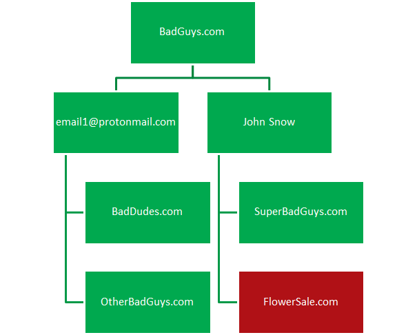

# Cyber Threat Intelligence Pivoting With Maltego

## 1. Attack  chain


## 2. Meta Info

### 2.1 Email

```
From: real_employee@fakeOrg.com
To: victim@target.com
Subject: Invoice for Sale #0123
Attachment: Invoice-2020_0123.doc
Target Region: IE
Target Industry: Government
Sender IP: 234.234.234.234
```

### 2.2 Malicious Attachment

```
FileName: Invoice-2020_0123.doc
File Type: Microsoft MS Word 
Document with Macro
Hash: SHA1 / MD5 / SHA256
Fuzzy Hash: TLSH/ssdeep
Trend Detection: TROJ_DLOAD.ABCD
Competitor Detection: 
     MACRO_DLOADER.A
     DOC_MACRO_APT999
Macro Contents: Strings
Doc Contents: Lure used
Doc Attributes: Author, Created Date
Dynamic Artifacts: Registry Changes, 
Mutex, Network Traffic, File System
```

### 2.3 C2 Domain

```
Domain: badguys.com
IP: 123.123.123.123
Hosting Location: Netherlands
AS: 12345
Registration Date: 01.01.2020
Whois: email1@protonmail.com, John Snow
SSL Certificate: Unique_SSL_Cert1
Web Contents: Interesting_Site_Strings
```

## 3. Pivoting

### 3.1  Pivoting from email meta info


### 3.2  Pivoting from C2 Domain parsing DNS


### 3.3 Pivoting from C2 Domain Whois info



### 3.4 Pivoting from attachment file meta info


## 4. Maltego Graph

### 4.1 Draw the basic CTI graph


### 4.2 Add pivoting relation 


### 4.3 Correlation Analysis

