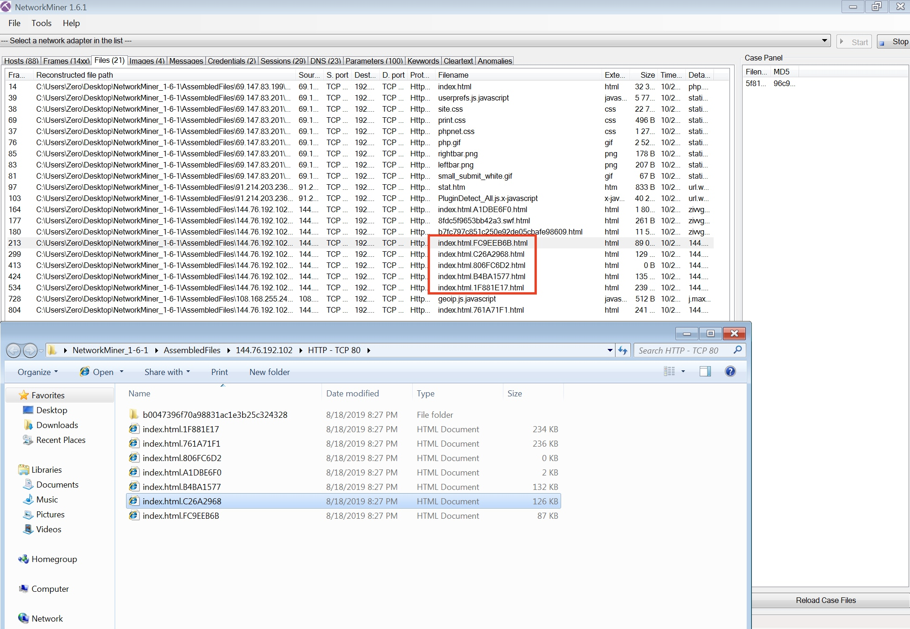

# Extract files from traffic~~~~
# Linux
## The first way
### tcpxtract
How to install
- libpcap libpcap-devel
- [tcpxtract-1.0.1-10.el6.2.x86_64.rpm](http://download-ib01.fedoraproject.org/pub/epel/6/x86_64/Packages/t/tcpxtract-1.0.1-10.el6.2.x86_64.rpm)

E.g.
```
[Bao@localhost PCAP_Analysis]$ wget http://forensicscontest.com/contest01/evidence01.pcap
--2019-08-18 08:07:17--  http://forensicscontest.com/contest01/evidence01.pcap
Resolving forensicscontest.com... 66.33.205.68
Connecting to forensicscontest.com|66.33.205.68|:80... connected.
HTTP request sent, awaiting response... 200 OK
Length: 70957 (69K) [application/vnd.tcpdump.pcap]
Saving to: “evidence01.pcap”

100%[======================================>] 70,957       136K/s   in 0.5s    

2019-08-18 08:07:19 (136 KB/s) - “evidence01.pcap” saved [70957/70957]

[Bao@localhost PCAP_Analysis]$ tcpxtract -f evidence01.pcap
Found file of type "zip" in session [205.188.13.12:47873 -> 192.168.1.159:63236], exporting to 00000000.zip
Found file of type "zip" in session [205.188.13.12:47873 -> 192.168.1.159:63236], exporting to 00000001.zip
Found file of type "zip" in session [205.188.13.12:47873 -> 192.168.1.159:63236], exporting to 00000002.zip
Found file of type "zip" in session [205.188.13.12:47873 -> 192.168.1.159:63236], exporting to 00000003.zip
Found file of type "zip" in session [205.188.13.12:47873 -> 192.168.1.159:63236], exporting to 00000004.zip
Found file of type "zip" in session [205.188.13.12:47873 -> 192.168.1.159:63236], exporting to 00000005.zip
Found file of type "zip" in session [205.188.13.12:47873 -> 192.168.1.159:63236], exporting to 00000006.zip
Found file of type "zip" in session [205.188.13.12:47873 -> 192.168.1.159:63236], exporting to 00000007.zip
Found file of type "gif" in session [205.188.13.12:47873 -> 192.168.1.159:63236], exporting to 00000008.gif
Found file of type "zip" in session [205.188.13.12:47873 -> 192.168.1.159:63236], exporting to 00000009.zip
Found file of type "zip" in session [205.188.13.12:47873 -> 192.168.1.159:63236], exporting to 00000010.zip
Found file of type "zip" in session [205.188.13.12:47873 -> 192.168.1.159:63236], exporting to 00000011.zip
Found file of type "zip" in session [205.188.13.12:47873 -> 192.168.1.159:63236], exporting to 00000012.zip
Found file of type "zip" in session [205.188.13.12:47873 -> 192.168.1.159:63236], exporting to 00000013.zip
Found file of type "gif" in session [205.188.13.12:47873 -> 192.168.1.159:63236], exporting to 00000014.gif
Found file of type "zip" in session [205.188.13.12:47873 -> 192.168.1.159:63236], exporting to 00000015.zip
Found file of type "gif" in session [205.188.13.12:47873 -> 192.168.1.159:63236], exporting to 00000016.gif
Found file of type "zip" in session [205.188.13.12:47873 -> 192.168.1.159:63236], exporting to 00000017.zip
Found file of type "zip" in session [205.188.13.12:47873 -> 192.168.1.159:63236], exporting to 00000018.zip
Found file of type "gif" in session [205.188.13.12:47873 -> 192.168.1.159:63236], exporting to 00000019.gif
Found file of type "zip" in session [205.188.13.12:47873 -> 192.168.1.159:63236], exporting to 00000020.zip
Found file of type "gif" in session [205.188.13.12:47873 -> 192.168.1.159:63236], exporting to 00000021.gif
Found file of type "zip" in session [205.188.13.12:47873 -> 192.168.1.159:63236], exporting to 00000022.zip
Found file of type "zip" in session [192.168.1.158:17940 -> 192.168.1.159:63492], exporting to 00000023.zip
Found file of type "zip" in session [192.168.1.158:17940 -> 192.168.1.159:63492], exporting to 00000024.zip
Found file of type "zip" in session [192.168.1.158:17940 -> 192.168.1.159:63492], exporting to 00000025.zip
Found file of type "zip" in session [192.168.1.158:17940 -> 192.168.1.159:63492], exporting to 00000026.zip
Found file of type "zip" in session [192.168.1.158:17940 -> 192.168.1.159:63492], exporting to 00000027.zip
Found file of type "zip" in session [192.168.1.158:17940 -> 192.168.1.159:63492], exporting to 00000028.zip
Found file of type "zip" in session [192.168.1.158:17940 -> 192.168.1.159:63492], exporting to 00000029.zip
Found file of type "zip" in session [192.168.1.158:17940 -> 192.168.1.159:63492], exporting to 00000030.zip
Found file of type "zip" in session [192.168.1.158:17940 -> 192.168.1.159:63492], exporting to 00000031.zip
Found file of type "zip" in session [192.168.1.158:17940 -> 192.168.1.159:63492], exporting to 00000032.zip
Found file of type "zip" in session [192.168.1.158:17940 -> 192.168.1.159:63492], exporting to 00000033.zip
Found file of type "zip" in session [192.168.1.158:17940 -> 192.168.1.159:63492], exporting to 00000034.zip
Found file of type "zip" in session [192.168.1.158:17940 -> 192.168.1.159:63492], exporting to 00000035.zip
Found file of type "zip" in session [192.168.1.158:17940 -> 192.168.1.159:63492], exporting to 00000036.zip
Found file of type "html" in session [64.236.68.246:20480 -> 192.168.1.159:63748], exporting to 00000037.html
[Bao@localhost PCAP_Analysis]$ file *
00000000.zip:    Zip archive data, at least v2.0 to extract
00000001.zip:    Zip archive data, at least v2.0 to extract
00000002.zip:    Zip archive data, at least v2.0 to extract
00000003.zip:    Zip archive data, at least v2.0 to extract
00000004.zip:    Zip archive data, at least v2.0 to extract
00000005.zip:    Zip archive data, at least v2.0 to extract
00000006.zip:    Zip archive data, at least v2.0 to extract
00000007.zip:    Zip archive data, at least v1.0 to extract
00000008.gif:    GIF image data, version 89a, 19 x 19
00000009.zip:    Zip archive data, at least v2.0 to extract
00000010.zip:    Zip archive data, at least v2.0 to extract
00000011.zip:    Zip archive data, at least v2.0 to extract
00000012.zip:    Zip archive data, at least v2.0 to extract
00000013.zip:    Zip archive data, at least v1.0 to extract
00000014.gif:    GIF image data, version 89a, 19 x 19
00000015.zip:    Zip archive data, at least v1.0 to extract
00000016.gif:    GIF image data, version 89a, 19 x 19
00000017.zip:    Zip archive data, at least v2.0 to extract
00000018.zip:    Zip archive data, at least v1.0 to extract
00000019.gif:    GIF image data, version 89a, 19 x 19
00000020.zip:    Zip archive data, at least v1.0 to extract
00000021.gif:    GIF image data, version 89a, 19 x 19
00000022.zip:    Zip archive data, at least v2.0 to extract
00000023.zip:    Microsoft Word 2007+
00000024.zip:    Microsoft Word 2007+
00000025.zip:    Microsoft Word 2007+
00000026.zip:    Microsoft OOXML
00000027.zip:    Microsoft OOXML
00000028.zip:    Microsoft Word 2007+
00000029.zip:    Microsoft Word 2007+
00000030.zip:    Zip archive data, at least v2.0 to extract
00000031.zip:    Microsoft Word 2007+
00000032.zip:    Microsoft Word 2007+
00000033.zip:    Microsoft Word 2007+
00000034.zip:    Zip archive data, at least v2.0 to extract
00000035.zip:    Zip archive data, at least v2.0 to extract
00000036.zip:    Zip archive data, at least v2.0 to extract
00000037.html:   HTML document text
evidence01.pcap: tcpdump capture file (little-endian) - version 2.4 (Ethernet, capture length 65535)
[Bao@localhost PCAP_Analysis]$ 

```
# Windows
## The second way
### NetworkMiner
How to install

- [NetworkMiner](http://sourceforge.net/projects/networkminer/files/latest/download)

E.g.
```
wget https://pcap.honeynet.org.my/v1/submission/downloadpcap.php?id=1493
```



sha256:
```
bd56609c386a6b5bc18254c7327d221af182193eee5008f6e405ab5c1215b070  index.html.1F881E17.html
816b21df749b17029af83f94273fe0fe480d25ee2f84fb25bf97d06a8fadefe4  index.html.761A71F1.html
e3b0c44298fc1c149afbf4c8996fb92427ae41e4649b934ca495991b7852b855  index.html.806FC6D2.html
cab97d0f79907a04a3598fea75bdde346711e03ca3cc091bce0e27ec069207db  index.html.A1DBE6F0.html
d78fb2c23422471657a077ff68906d6f6b639d7b7b00ef269fa3a2ce1b38710a  index.html.B4BA1577.html
3483a7264a3bef074d0c2715e90350ca1aa7387dee937679702d5ad79b0c84ca  index.html.C26A2968.html
5d651f449d12e6bc75a0c875b4dae19d8b3ec8b3933b6c744942b5763d5df08d  index.html.FC9EEB6B.html
```

Query VirusTotal with Sha256, result is malware or clean

# All
## The third way
### wireshark

open .pcap file, next File->export objects->Http, finally check files
# macOS
## The fourth way
### foremost
```
https://sourceforge.net/projects/foremost/

OSX:
$ tar zxvf foremost-xx.tar.gz
$ cd foremost-xx
$ make mac
$ make macinstall

foremost -v -i 5f810408ddbbd6d349b4be4766f41a37.pcap
```


