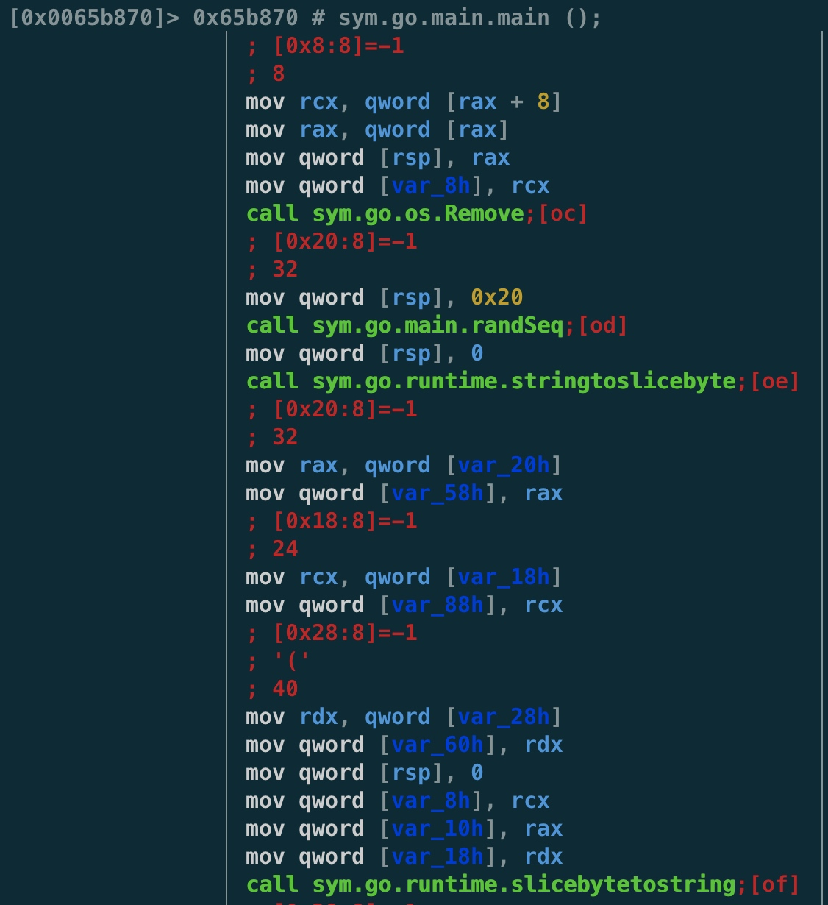

# Go Binary Malware Analysis
- 50470f94e7d65b50bf00d7416a9634d9e4141c5109a78f5769e4204906ab5f0b

## View all Go function


## main.init() process
* check()


* request https://ipapi.co/json/
```
{
    "ip": "***.***.***.***",
    "city": "***",
    "region": "***",
    "region_code": null,
    "country": "**",
    "country_name": "*****",
    "continent_code": "***",
    "in_eu": false,
    "postal": null,
    "latitude": null,
    "longitude": null,
    "timezone": null,
    "utc_offset": null,
    "country_calling_code": "***",
    "currency": "***",
    "languages": "*****",
    "asn": "***",
    "org": "test.com, Inc."
}
```


* filter some countries


## main function generates AES key, size is 0x20


## Encrypt AES Key with RSA Pubilc Key
Call makesecret() encrypt AES Key
* main()

* makesecret()

* RSA Key


* After encryption is complete, base64 encrypted AES Key


## Encrypt File with AES


## Decrypt READ.ME


