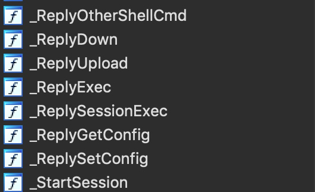

# March 2019 MacOS Malware
## Lazarus Group backdoor, targeting cryptocurrency business
```
SHA256: f9ffb15a6bf559773b0df7d8a89d9440819ab285f17a7b0a98626c14164d170f
f9ffb15a6bf559773b0df7d8a89d9440819ab285f17a7b0a98626c14164d170f: Mach-O 64-bit executable x86_64
```
## Interesting function




## NetWork info


xref in CreateSession()...


URL Address is (__int64)&_gMyConf + 260 * *((signed int *)&_gMyConf + 0x2A8) + 0x54

1. 0x0000000100005150 __gMyConf
2. *((signed int *)&_gMyConf + 0x2A8) = *(0x0000000100005150+0x2A8)=*(0x00000001000053f8)

    __data:00000001000053F8                 db    0
    
1. 260 * *((signed int *)&_gMyConf + 0x2A8)=260 * 0=0
2. (__int64)&_gMyConf + 260 * *((signed int *)&_gMyConf + 0x2A8) + 0x54 = (__int64)&_gMyConf+ 0x54 =  0x00000001000051a4


 
URL is https://towingoperations.com/chat/chat.php

## This is a backdoor tool in development


## Functions of the backdoor:
- Set sleep time (delay between C2 interactions)
- Exit session
- Collect basic host information
- Check malware status
- Show current malware configuration
- Update malware configuratiov
- Execute system shell command
- Download & Upload files
- curl global clean up