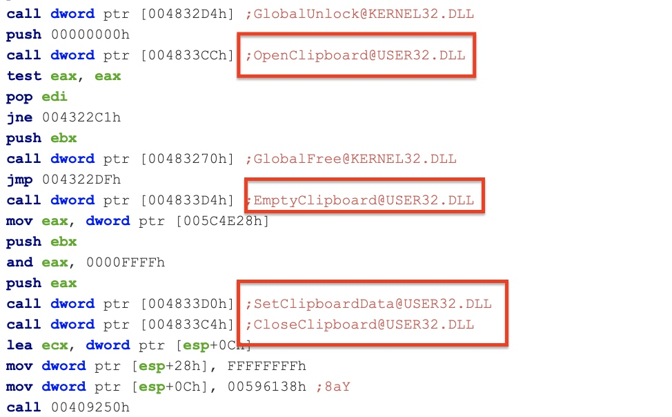
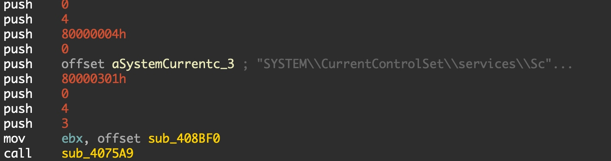
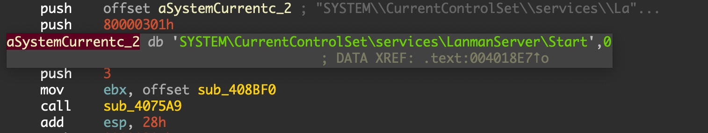
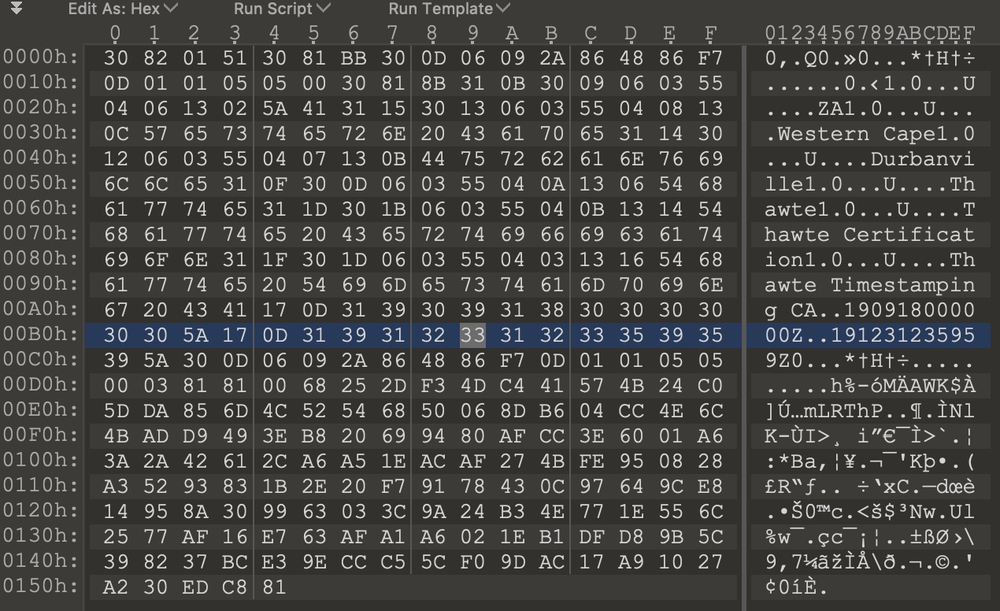
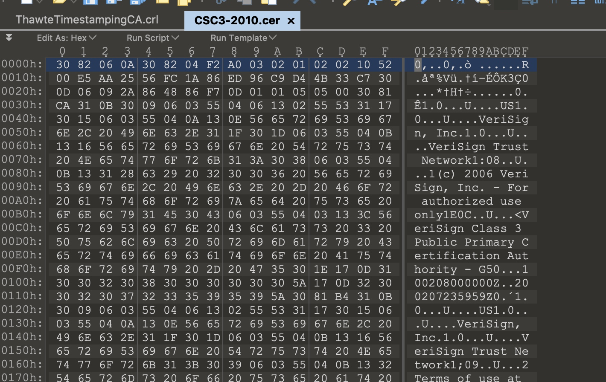
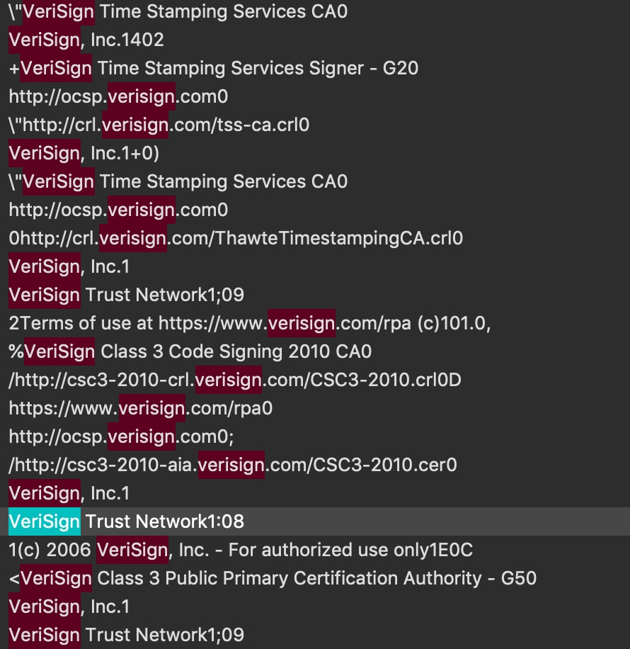
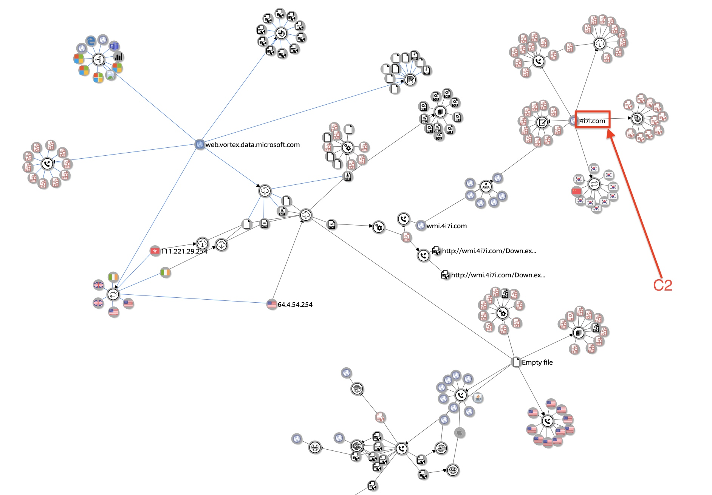
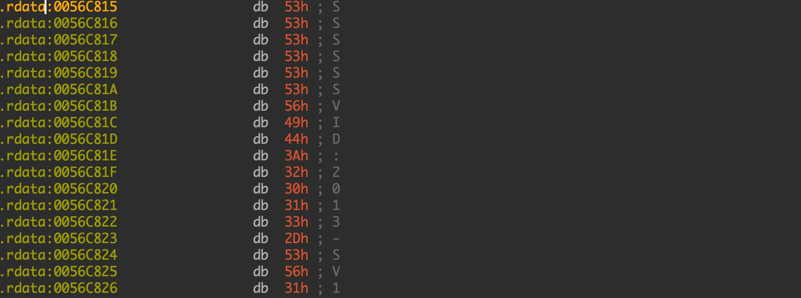
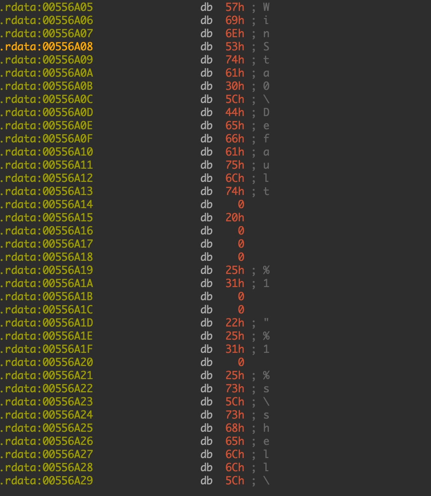
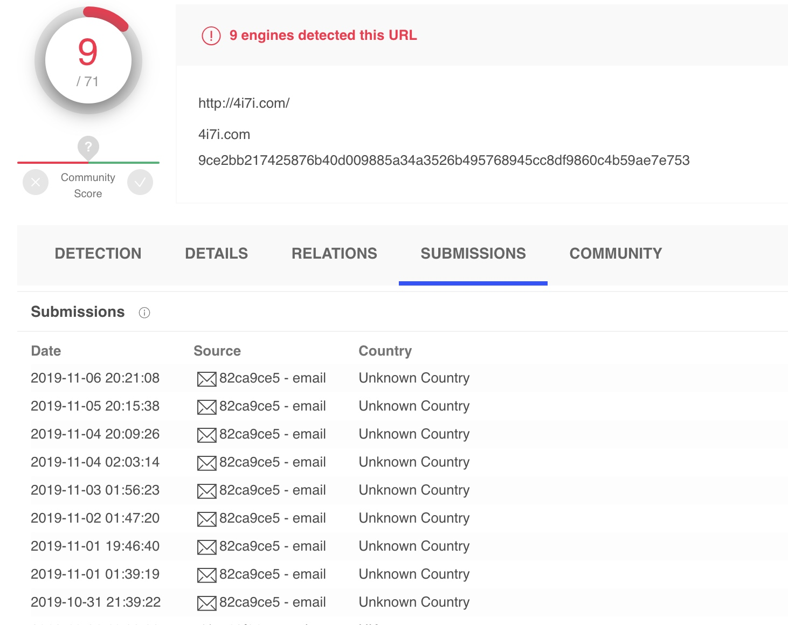

# “贪吃蛇”挖矿木马
## 信息
mssql.exe: 5878d550c72d646e6da06337a92f683e7464f4a5
## 分析
### UPX加壳脱壳
mssql_unpack.exe: ffee0afad0140dba6a5f5539039165ae7500a066 

### 粘贴板内容监听

### 读取hosts文件
C:\Windows\SysNative\drivers\etc\hosts

### 设置定时任务
SYSTEM\CurrentControlSet\services\Schedule\Start

  
### 开启lanmanserver服务，即IPC$服务可用，445端口可用
SYSTEM\CurrentControlSet\services\LanmanServer\Start

### 为了保证与C&C Server 通信顺利，下载可信证书
http://crl.verisign.com/ThawteTimestampingCA.crl

http://csc3-2010-aia.verisign.com/CSC3-2010.cer

可信网络前面字符

### Download Server
4i7i.com

### 大灰狼远控

### MS18_32漏洞
2018年的内核提权漏洞，部分Windows系统win32k.sys组件的NtUserSetImeInfoEx系统函数内部未验证内核对象中的空指针对象，普通应用程序可利用该空指针漏洞以内核权限执行任意代码。

### 传播方式垃圾邮件居多

