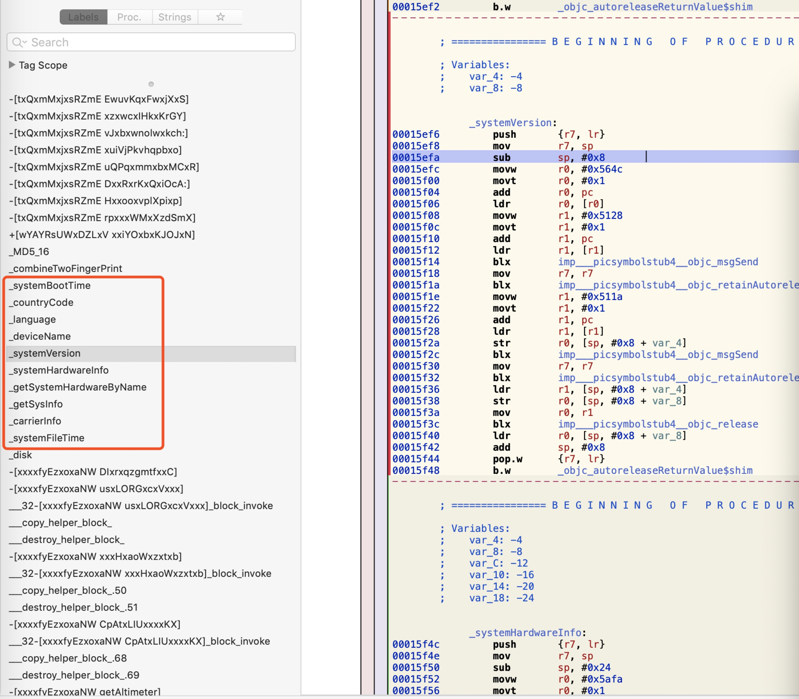
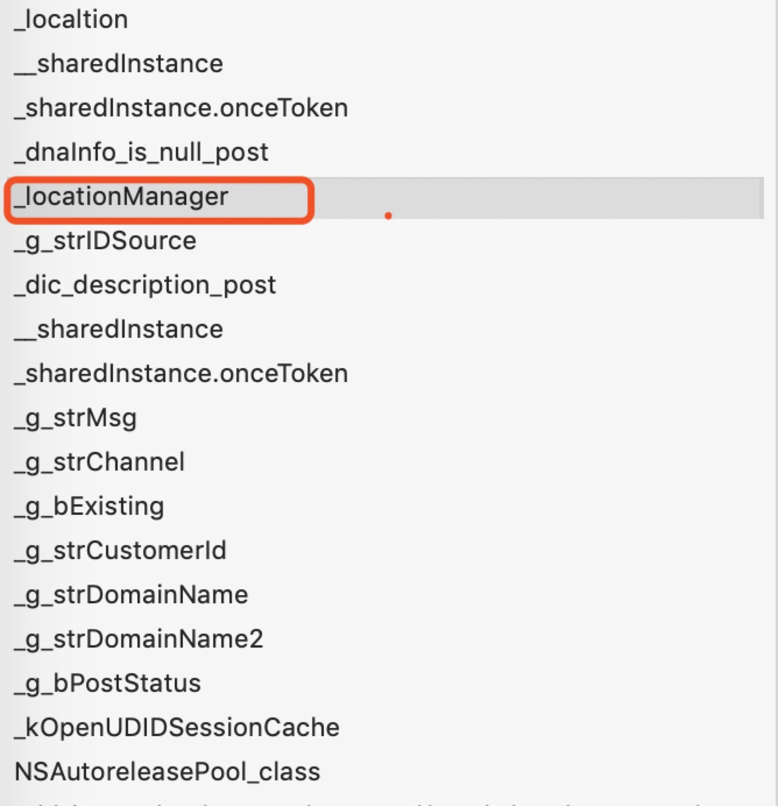

# 数盟SDK分析
## du.jar
### 1. 收集Device ID，可以追踪用户
代码位置：cn.shuzilm.core.DUHelper.java
```java
public static String getQueryID(Context context, String str, String str2) {
    String str3 = BuildConfig.d;
    if (k == 0) {
        k = 1;
        str3 = (String) getQueryID(context, str, str2, 0, null).get("device_id");
        k = 0;
        return str3;
    }
    Log.i("[shuzilm]", "invoke too fast.");
    return str3;
        
}

```
### 2. 可以收集package/asset资源目录字符串，调用函数，取一些不该拿的字符串
代码位置：cn.shuzilm.core.DUHelper.java
```java
private String a(Context context, String str) {
    try {
        InputStream open = context.getAssets().open(str);//敏感代码
        StringBuffer stringBuffer = new StringBuffer();
        BufferedReader bufferedReader = new BufferedReader(new InputStreamReader(open));
        while (true) {
            String readLine = bufferedReader.readLine();
            if (readLine != null) {
                stringBuffer.append(readLine);
            } else {
                bufferedReader.close();
                open.close();
                return stringBuffer.toString();
            }
        }
    } catch (IOException e) {
        return null;
    }
 }
```

### 3. 传感器监听，可以跟location信息结合绘制用户移动轨迹
代码位置：cn.shuzilm.core.DUHelper.java
```java
private static native void onSensorChanged(Context context, SensorEvent sensorEvent);
```
### 4. 手机状态监听，监听用户手机是否通话、待机
代码位置：cn.shuzilm.core.DUHelper.java
```java
 public static int unResListener() {
        ((TelephonyManager) mContext.getSystemService("phone")).listen(e, 0);
        return 0;
 }
```
### 5.0  可以查看设备上某个server是否运行，判断并查看某个server运行信息
cn.shuzilm.core.q.java
```java
public class q {
    public static boolean a(Context context, String str) {
        boolean z = false;
        try {
            for (RunningServiceInfo runningServiceInfo : ((ActivityManager) context.getSystemService("activity")).getRunningServices(200)){ //获取运行的所有service
                z = runningServiceInfo.process.equals(str) ? true : z;
            }
        } catch (Exception e) {
            e.printStackTrace();
        }
        return z;
    }
}
```
## iOS du.framework (Android du.so经过某些特殊处理，某些函数不能全部逆，故逆向分析iOS)
### 1. 收集信息(系统启动时间、国家码、设备名、硬件信息、系统信息、系统文件时间)


### 2. 定位信息（敏感信息）

